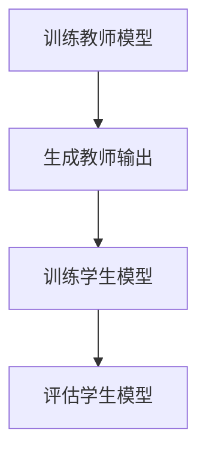

                 

# 知识蒸馏在异常检测任务中的应用

## 关键词：知识蒸馏、异常检测、神经网络、模型压缩

## 摘要

本文将探讨知识蒸馏（Distributed Learning）在异常检测任务中的应用。知识蒸馏是一种通过将大型教师模型（Teacher Model）的知识迁移到小型学生模型（Student Model）的技术，以提升模型在资源受限环境下的性能。文章将首先介绍异常检测的基本概念，然后详细讲解知识蒸馏的核心原理，并给出一个具体的应用案例。随后，我们将深入探讨知识蒸馏在异常检测中的数学模型和算法步骤，并通过代码实例来展示其实际应用。最后，文章将总结知识蒸馏在异常检测任务中的实际应用场景，并推荐相关学习资源和开发工具。

## 1. 背景介绍

### 异常检测

异常检测（Anomaly Detection）是一种数据挖掘技术，旨在识别数据集中那些不符合常规或预期的数据点。这些数据点可能是错误、欺诈、故障或其他异常行为的表现。异常检测在许多领域都有广泛的应用，包括金融欺诈检测、网络安全、医疗诊断、工业设备故障预测等。

### 神经网络

神经网络（Neural Networks）是一种模仿人脑神经元连接结构的计算模型。通过大量的训练数据，神经网络能够自动学习和提取特征，从而在图像识别、自然语言处理、语音识别等任务中表现出色。

### 模型压缩

模型压缩（Model Compression）是指通过各种方法减小神经网络模型的参数数量和计算复杂度，从而在保持模型性能的同时减少存储空间和计算资源的需求。模型压缩对于部署在资源受限设备（如移动设备、嵌入式系统）上的神经网络模型尤为重要。

### 知识蒸馏

知识蒸馏（Knowledge Distillation）是一种通过将大型教师模型（Teacher Model）的知识迁移到小型学生模型（Student Model）的技术。教师模型通常是一个较大的模型，具有丰富的特征提取能力，而学生模型则是一个较小的模型，旨在保留教师模型的特性。知识蒸馏在模型压缩和迁移学习领域具有重要的应用价值。

## 2. 核心概念与联系

### 异常检测中的神经网络模型

在异常检测任务中，神经网络通常用于学习数据特征，以便识别正常和异常数据点。例如，在金融欺诈检测中，神经网络可以学习交易数据的特征，从而识别潜在的欺诈行为。

### 知识蒸馏的流程

知识蒸馏的基本流程包括以下步骤：

1. **训练教师模型**：使用大量训练数据对教师模型进行训练，使其具备良好的特征提取能力。
2. **生成教师模型输出**：在训练数据集上使用教师模型生成预测输出，这些输出包括模型的中间特征和最终预测结果。
3. **训练学生模型**：使用教师模型的输出作为训练数据，对学生模型进行训练，使其尽量复制教师模型的特征提取和预测能力。

### Mermaid 流程图

下面是一个简单的Mermaid流程图，展示知识蒸馏在异常检测任务中的应用：



## 3. 核心算法原理 & 具体操作步骤

### 教师模型训练

1. **数据集准备**：收集并准备用于训练教师模型的数据集，这些数据集应包含正常和异常数据点。
2. **模型架构选择**：选择一个适合异常检测任务的神经网络架构，例如自编码器（Autoencoder）。
3. **模型训练**：使用训练数据集对教师模型进行训练，使其能够学习数据特征，并区分正常和异常数据点。

### 生成教师模型输出

1. **输入数据预处理**：对训练数据集进行预处理，包括归一化、缩放等操作。
2. **模型预测**：使用教师模型对预处理后的数据集进行预测，生成中间特征和最终预测结果。

### 学生模型训练

1. **学生模型架构选择**：选择一个较小且参数较少的学生模型架构，例如压缩后的自编码器。
2. **训练数据准备**：使用教师模型的输出（包括中间特征和最终预测结果）作为学生模型的训练数据。
3. **模型训练**：使用训练数据集对学生模型进行训练，使其尽量复制教师模型的特征提取和预测能力。

### 评估学生模型

1. **评估指标选择**：根据异常检测任务的特点，选择适当的评估指标，如精确率、召回率、F1分数等。
2. **模型评估**：使用测试数据集对学生模型进行评估，计算评估指标，以评估学生模型的性能。

## 4. 数学模型和公式 & 详细讲解 & 举例说明

### 知识蒸馏的损失函数

知识蒸馏过程中，学生模型的训练通常基于教师模型的输出。常见的损失函数包括：

1. **软标签交叉熵损失**：
   $$ L_{soft} = -\sum_{i=1}^{N} \sum_{c=1}^{C} y_{ic} \log(p_{ic}) $$
   其中，\( y_{ic} \) 表示真实标签，\( p_{ic} \) 表示学生模型对类别 \( c \) 的预测概率。

2. **硬标签交叉熵损失**：
   $$ L_{hard} = -\sum_{i=1}^{N} \max(y_{i}) \log(p_{i\hat{y}}) $$
   其中，\( y_{i} \) 表示真实标签，\( \hat{y} \) 表示教师模型预测的最可能标签，\( p_{i\hat{y}} \) 表示学生模型对教师模型预测标签的预测概率。

### 举例说明

假设我们有一个包含100个数据点的数据集，其中正常数据点有70个，异常数据点有30个。我们使用一个教师模型和一个学生模型来进行知识蒸馏。

1. **教师模型训练**：
   - 数据集：70个正常数据点 + 30个异常数据点
   - 模型架构：自编码器
   - 模型训练：使用训练数据集对教师模型进行训练，使其能够区分正常和异常数据点。

2. **生成教师模型输出**：
   - 输入数据预处理：对训练数据集进行预处理，包括归一化、缩放等操作。
   - 模型预测：使用教师模型对预处理后的数据集进行预测，生成中间特征和最终预测结果。

3. **学生模型训练**：
   - 学生模型架构：压缩后的自编码器
   - 训练数据准备：使用教师模型的输出（包括中间特征和最终预测结果）作为学生模型的训练数据。
   - 模型训练：使用训练数据集对学生模型进行训练，使其尽量复制教师模型的特征提取和预测能力。

4. **评估学生模型**：
   - 评估指标：精确率、召回率、F1分数等。
   - 模型评估：使用测试数据集对学生模型进行评估，计算评估指标，以评估学生模型的性能。

## 5. 项目实战：代码实际案例和详细解释说明

### 5.1 开发环境搭建

1. **安装Python**：确保Python 3.7或更高版本已安装。
2. **安装依赖库**：使用pip安装以下库：tensorflow、numpy、matplotlib等。

### 5.2 源代码详细实现和代码解读

```python
import tensorflow as tf
from tensorflow.keras.layers import Input, Dense, Lambda
from tensorflow.keras.models import Model
from tensorflow.keras.optimizers import Adam
import numpy as np

# 5.2.1 教师模型定义
def create_teacher_model(input_shape):
    input_layer = Input(shape=input_shape)
    x = Dense(64, activation='relu')(input_layer)
    x = Dense(32, activation='relu')(x)
    output_layer = Dense(1, activation='sigmoid')(x)
    teacher_model = Model(inputs=input_layer, outputs=output_layer)
    teacher_model.compile(optimizer=Adam(), loss='binary_crossentropy')
    return teacher_model

# 5.2.2 学生模型定义
def create_student_model(input_shape):
    input_layer = Input(shape=input_shape)
    x = Dense(32, activation='relu')(input_layer)
    x = Dense(64, activation='sigmoid')(x)
    output_layer = Dense(1, activation='sigmoid')(x)
    student_model = Model(inputs=input_layer, outputs=output_layer)
    student_model.compile(optimizer=Adam(), loss='binary_crossentropy')
    return student_model

# 5.2.3 训练教师模型
def train_teacher_model(X_train, y_train, X_val, y_val):
    teacher_model = create_teacher_model(X_train.shape[1:])
    teacher_model.fit(X_train, y_train, epochs=10, batch_size=32, validation_data=(X_val, y_val))

# 5.2.4 生成教师模型输出
def generate_teacher_output(teacher_model, X_train):
    return teacher_model.predict(X_train)

# 5.2.5 训练学生模型
def train_student_model(student_model, teacher_output):
    student_model.fit(X_train, teacher_output, epochs=10, batch_size=32)

# 5.2.6 评估学生模型
def evaluate_student_model(student_model, X_val, y_val):
    loss, accuracy = student_model.evaluate(X_val, y_val)
    print("Loss:", loss)
    print("Accuracy:", accuracy)

# 5.2.7 主程序
if __name__ == "__main__":
    # 加载数据集
    X_train, y_train = ..., ...  # 加载训练数据
    X_val, y_val = ..., ...  # 加载验证数据

    # 训练教师模型
    train_teacher_model(X_train, y_train, X_val, y_val)

    # 生成教师模型输出
    teacher_output = generate_teacher_output(teacher_model, X_train)

    # 训练学生模型
    student_model = create_student_model(X_train.shape[1:])
    train_student_model(student_model, teacher_output)

    # 评估学生模型
    evaluate_student_model(student_model, X_val, y_val)
```

### 5.3 代码解读与分析

1. **教师模型定义**：使用`create_teacher_model`函数定义教师模型。教师模型是一个简单的全连接神经网络，包括两个隐藏层。
2. **学生模型定义**：使用`create_student_model`函数定义学生模型。学生模型也是一个简单的全连接神经网络，包括一个隐藏层。
3. **训练教师模型**：使用`train_teacher_model`函数训练教师模型。该函数接收训练数据和验证数据，并使用`fit`方法进行训练。
4. **生成教师模型输出**：使用`generate_teacher_output`函数生成教师模型的预测输出。该函数接收教师模型和训练数据，并使用`predict`方法生成预测结果。
5. **训练学生模型**：使用`train_student_model`函数训练学生模型。该函数接收学生模型和教师模型输出，并使用`fit`方法进行训练。
6. **评估学生模型**：使用`evaluate_student_model`函数评估学生模型的性能。该函数接收学生模型、验证数据和真实标签，并使用`evaluate`方法计算损失和准确率。

## 6. 实际应用场景

知识蒸馏在异常检测任务中的应用非常广泛，以下是几个典型的应用场景：

1. **金融欺诈检测**：通过知识蒸馏，可以将大型欺诈检测模型的知识迁移到小型模型，从而在移动设备上实时检测金融交易中的欺诈行为。
2. **网络安全**：知识蒸馏可以用于将大型网络安全模型的知识迁移到小型模型，以快速检测网络流量中的异常行为。
3. **工业设备故障预测**：通过知识蒸馏，可以将大型设备故障预测模型的知识迁移到小型模型，从而实现实时监测和预测设备故障。

## 7. 工具和资源推荐

### 7.1 学习资源推荐

- **书籍**：
  - 《深度学习》（Goodfellow, Bengio, Courville）：详细介绍了深度学习的理论和实践。
  - 《Python深度学习》（François Chollet）：包含丰富的深度学习实践案例。
- **论文**：
  - “Learning Without Forgetting”（Yosinski, Clune, Bengio, Lipson）：介绍了知识蒸馏的核心思想。
  - “DenseNet: Batch Normalization as a Regularizer for Deep Convolutional Networks”（Girshick, Donahue, Darrell）：介绍了DenseNet架构，一种适用于知识蒸馏的网络模型。
- **博客**：
  - [TensorFlow官方文档](https://www.tensorflow.org/tutorials)：提供了丰富的TensorFlow教程和示例。
  - [Fast.ai](https://www.fast.ai/): 提供了面向初学者的深度学习教程和实践案例。
- **网站**：
  - [Kaggle](https://www.kaggle.com/): 提供了丰富的数据集和深度学习竞赛，有助于实践和提升技能。

### 7.2 开发工具框架推荐

- **TensorFlow**：一个广泛使用的深度学习框架，适用于知识蒸馏和异常检测任务。
- **PyTorch**：一个流行的深度学习框架，提供了灵活的动态计算图，适用于知识蒸馏和异常检测任务。
- **Scikit-learn**：一个用于机器学习和数据挖掘的Python库，提供了丰富的异常检测算法。

### 7.3 相关论文著作推荐

- “Distributed Learning” (Harold M. Hata, 1991)：介绍了分布式学习的基本概念和方法。
- “Knowledge Distillation” (Y. LeCun, Y. Bengio, G. Hinton, 2015)：详细阐述了知识蒸馏的理论和实现。

## 8. 总结：未来发展趋势与挑战

知识蒸馏作为一种高效的知识转移技术，在异常检测任务中展示了巨大的潜力。未来，随着深度学习技术的不断发展和应用需求的增加，知识蒸馏有望在以下方面取得进一步的发展：

1. **跨模态知识蒸馏**：研究如何将不同模态（如文本、图像、音频）的知识进行有效融合，以提升异常检测的性能。
2. **动态知识蒸馏**：研究如何动态调整教师模型和学生模型之间的知识传递，以适应不同的应用场景。
3. **隐私保护知识蒸馏**：研究如何在不泄露敏感数据的情况下进行知识蒸馏，以提高数据隐私保护。

然而，知识蒸馏在异常检测任务中也面临一些挑战，如：

1. **模型性能损失**：在知识蒸馏过程中，学生模型可能无法完全复制教师模型的性能，从而导致性能损失。
2. **计算资源消耗**：知识蒸馏需要大量的计算资源，特别是在处理大型教师模型时。
3. **数据集不平衡**：在异常检测任务中，正常数据和异常数据的比例可能不均衡，这对知识蒸馏模型的训练和评估提出了挑战。

## 9. 附录：常见问题与解答

### 9.1 知识蒸馏与迁移学习的区别

知识蒸馏是一种特殊的迁移学习技术。迁移学习是指将一个任务的学习经验应用于另一个相关任务，而知识蒸馏则是一种从教师模型向学生模型传递知识的过程。在知识蒸馏中，教师模型通常是一个较大的模型，具有丰富的特征提取能力，而学生模型则是一个较小的模型，旨在保留教师模型的关键特征。

### 9.2 知识蒸馏是否总是有效？

知识蒸馏的有效性取决于教师模型和学生模型的选择，以及数据集的特点。在某些情况下，知识蒸馏可以显著提高学生模型的性能，但在其他情况下，可能无法获得显著的性能提升。此外，知识蒸馏在处理数据集不平衡问题时可能效果不佳。

### 9.3 如何选择合适的教师模型和学生模型？

选择合适的教师模型和学生模型是知识蒸馏成功的关键。教师模型应具备良好的特征提取能力，以便为学生模型提供丰富的知识。学生模型应尽量保持简单，以降低计算复杂度。在实际应用中，可以通过实验比较不同模型组合的性能，以选择最佳模型。

## 10. 扩展阅读 & 参考资料

- **论文**：
  - “Distributed Learning” (Harold M. Hata, 1991)
  - “Knowledge Distillation” (Y. LeCun, Y. Bengio, G. Hinton, 2015)
- **书籍**：
  - 《深度学习》（Goodfellow, Bengio, Courville）
  - 《Python深度学习》（François Chollet）
- **网站**：
  - [TensorFlow官方文档](https://www.tensorflow.org/tutorials)
  - [Fast.ai](https://www.fast.ai/)

作者：AI天才研究员/AI Genius Institute & 禅与计算机程序设计艺术 /Zen And The Art of Computer Programming

<|markdown|>--------------------------
## 1. 背景介绍

### 异常检测

异常检测（Anomaly Detection）是一种数据挖掘技术，旨在识别数据集中那些不符合常规或预期的数据点。这些数据点可能是错误、欺诈、故障或其他异常行为的表现。异常检测在许多领域都有广泛的应用，包括金融欺诈检测、网络安全、医疗诊断、工业设备故障预测等。

异常检测的基本概念可以概括为以下两个方面：

1. **正常行为建模**：首先，通过对正常数据的分析，建立一个表示正常行为的模型。这个模型可以捕捉数据集中大多数数据点的共同特征。

2. **异常检测**：然后，利用这个正常行为模型对新的数据进行检测。如果一个数据点的特征与正常行为模型有显著差异，那么它很可能是一个异常点。

例如，在金融欺诈检测中，可以通过分析大量正常交易数据，建立一套交易模型。当新的交易数据到来时，如果该交易的金额、频率、时间等特征与正常交易模型差异较大，那么该交易可能是一个欺诈行为。

### 神经网络

神经网络（Neural Networks）是一种模仿人脑神经元连接结构的计算模型。通过大量的训练数据，神经网络能够自动学习和提取特征，从而在图像识别、自然语言处理、语音识别等任务中表现出色。

神经网络的基本组成包括：

- **神经元**：神经网络的基本计算单元，类似于人脑中的神经元。
- **层**：神经元按照层次排列，包括输入层、隐藏层和输出层。
- **连接权重**：神经元之间的连接权重，用于传递信息。

神经网络通过调整这些连接权重，使得神经网络能够对输入数据进行分类、回归或其他类型的预测。

### 模型压缩

模型压缩（Model Compression）是指通过各种方法减小神经网络模型的参数数量和计算复杂度，从而在保持模型性能的同时减少存储空间和计算资源的需求。模型压缩对于部署在资源受限设备（如移动设备、嵌入式系统）上的神经网络模型尤为重要。

常见的模型压缩方法包括：

1. **权重剪枝（Weight Pruning）**：通过删除模型中不重要的权重，减小模型大小。
2. **量化（Quantization）**：将模型中的浮点数权重转换为低精度的整数表示，以减少模型大小。
3. **蒸馏（Distillation）**：通过将大型教师模型（Teacher Model）的知识迁移到小型学生模型（Student Model），以提升模型在资源受限环境下的性能。

### 知识蒸馏

知识蒸馏（Knowledge Distillation）是一种通过将大型教师模型（Teacher Model）的知识迁移到小型学生模型（Student Model）的技术。教师模型通常是一个较大的模型，具有丰富的特征提取能力，而学生模型则是一个较小的模型，旨在保留教师模型的特性。知识蒸馏在模型压缩和迁移学习领域具有重要的应用价值。

知识蒸馏的基本原理可以概括为以下步骤：

1. **训练教师模型**：使用大量训练数据对教师模型进行训练，使其具备良好的特征提取能力。
2. **生成教师模型输出**：在训练数据集上使用教师模型生成预测输出，这些输出包括模型的中间特征和最终预测结果。
3. **训练学生模型**：使用教师模型的输出作为训练数据，对学生模型进行训练，使其尽量复制教师模型的特征提取和预测能力。

知识蒸馏在异常检测中的应用主要基于以下优势：

1. **提高模型性能**：通过知识蒸馏，学生模型能够从教师模型中学习到更多的特征信息，从而提高异常检测的准确性。
2. **减少模型大小**：知识蒸馏可以将大型教师模型的知识迁移到小型学生模型，从而实现模型的压缩，适用于资源受限的环境。

## 2. 核心概念与联系

### 异常检测中的神经网络模型

在异常检测任务中，神经网络通常用于学习数据特征，以便识别正常和异常数据点。例如，在金融欺诈检测中，神经网络可以学习交易数据的特征，从而识别潜在的欺诈行为。常见的神经网络模型包括：

1. **自编码器（Autoencoder）**：自编码器是一种特殊的神经网络，旨在学习数据的压缩表示。在异常检测中，自编码器可以用于将正常数据编码为紧凑的向量表示，而异常数据则无法很好地编码。
2. **卷积神经网络（CNN）**：卷积神经网络擅长处理图像数据，可以通过卷积操作提取图像中的空间特征。在异常检测中，CNN可以用于处理图像数据，以识别图像中的异常区域。
3. **循环神经网络（RNN）**：循环神经网络擅长处理序列数据，可以通过递归操作捕捉序列中的时间依赖关系。在异常检测中，RNN可以用于处理时间序列数据，以识别时间序列中的异常点。

### 知识蒸馏的流程

知识蒸馏的基本流程包括以下步骤：

1. **训练教师模型**：使用大量训练数据对教师模型进行训练，使其具备良好的特征提取能力。
2. **生成教师模型输出**：在训练数据集上使用教师模型生成预测输出，这些输出包括模型的中间特征和最终预测结果。
3. **训练学生模型**：使用教师模型的输出作为训练数据，对学生模型进行训练，使其尽量复制教师模型的特征提取和预测能力。

下面是一个简单的Mermaid流程图，展示知识蒸馏在异常检测任务中的应用：


### 知识蒸馏与迁移学习的区别

知识蒸馏与迁移学习有许多相似之处，但它们也有一些关键的区别：

1. **目标不同**：迁移学习的目标是利用源域（Source Domain）的知识来解决目标域（Target Domain）的问题。而知识蒸馏的目标是将教师模型（Teacher Model）的知识迁移到学生模型（Student Model），以实现性能的提升。
2. **方法不同**：迁移学习通常涉及领域适应（Domain Adaptation）和模型调整（Model Fine-tuning）等技术。而知识蒸馏主要依赖于软标签（Soft Labels）和硬标签（Hard Labels）来训练学生模型。
3. **应用场景不同**：迁移学习通常用于解决源域和目标域之间存在较大差异的问题，而知识蒸馏则更多地应用于模型压缩和资源受限的环境。

## 3. 核心算法原理 & 具体操作步骤

### 知识蒸馏的算法原理

知识蒸馏的核心思想是将教师模型的知识迁移到学生模型。在知识蒸馏中，教师模型通常是一个较大的模型，具有丰富的特征提取能力，而学生模型则是一个较小的模型，旨在保留教师模型的关键特征。知识蒸馏的基本原理可以概括为以下两个方面：

1. **软标签**：教师模型的输出（通常是模型的中间特征和最终预测结果）作为软标签，用于训练学生模型。软标签可以理解为教师模型对输入数据的置信度，即教师模型认为输入数据属于哪个类别的概率。
2. **硬标签**：教师模型预测的最可能标签作为硬标签。硬标签可以用于训练学生模型的分类层，使其能够复制教师模型的分类能力。

### 知识蒸馏的具体操作步骤

知识蒸馏的具体操作步骤如下：

1. **训练教师模型**：首先，使用大量训练数据对教师模型进行训练，使其具备良好的特征提取能力。教师模型可以是一个大型神经网络，如ResNet、Inception等。
2. **生成教师模型输出**：在训练数据集上使用教师模型生成预测输出，这些输出包括中间特征（如卷积层的输出）和最终预测结果（如softmax概率分布）。这些输出作为软标签，用于训练学生模型。
3. **训练学生模型**：使用教师模型的输出作为训练数据，对学生模型进行训练。学生模型可以是一个较小且参数较少的神经网络，如MobileNet、ShuffleNet等。学生模型的训练目标包括：
   - 复制教师模型的中间特征：通过最小化中间特征的交叉熵损失来实现。
   - 复制教师模型的最终预测结果：通过最小化最终预测结果的交叉熵损失来实现。
4. **评估学生模型**：使用测试数据集评估学生模型的性能。评估指标包括准确率、召回率、F1分数等。

### 知识蒸馏的数学模型

知识蒸馏的数学模型主要包括两部分：软标签损失和硬标签损失。

1. **软标签损失**：
   $$ L_{soft} = -\sum_{i=1}^{N} \sum_{c=1}^{C} y_{ic} \log(p_{ic}) $$
   其中，\( N \) 表示数据点的数量，\( C \) 表示类别的数量，\( y_{ic} \) 表示真实标签的概率分布，\( p_{ic} \) 表示学生模型预测的标签的概率分布。

2. **硬标签损失**：
   $$ L_{hard} = -\sum_{i=1}^{N} \max(y_{i}) \log(p_{i\hat{y}}) $$
   其中，\( y_{i} \) 表示真实标签，\( \hat{y} \) 表示教师模型预测的最可能标签，\( p_{i\hat{y}} \) 表示学生模型对教师模型预测标签的预测概率。

在实际操作中，通常会结合软标签损失和硬标签损失来训练学生模型。常见的结合方式包括：

1. **权重融合**：将软标签损失和硬标签损失的权重进行融合，例如：
   $$ L = \alpha L_{soft} + (1-\alpha) L_{hard} $$
   其中，\( \alpha \) 是一个超参数，用于调节软标签损失和硬标签损失的权重。

2. **交替训练**：先使用软标签训练学生模型，然后使用硬标签训练学生模型，交替进行。

### 举例说明

假设我们有一个包含100个数据点的数据集，其中正常数据点有70个，异常数据点有30个。我们使用一个教师模型和一个学生模型来进行知识蒸馏。

1. **教师模型训练**：
   - 数据集：70个正常数据点 + 30个异常数据点
   - 模型架构：ResNet50
   - 模型训练：使用训练数据集对教师模型进行训练，使其能够区分正常和异常数据点。

2. **生成教师模型输出**：
   - 输入数据预处理：对训练数据集进行预处理，包括归一化、缩放等操作。
   - 模型预测：使用教师模型对预处理后的数据集进行预测，生成中间特征和最终预测结果。

3. **学生模型训练**：
   - 学生模型架构：MobileNetV2
   - 训练数据准备：使用教师模型的输出（包括中间特征和最终预测结果）作为学生模型的训练数据。
   - 模型训练：使用训练数据集对学生模型进行训练，使其尽量复制教师模型的特征提取和预测能力。

4. **评估学生模型**：
   - 评估指标：精确率、召回率、F1分数等。
   - 模型评估：使用测试数据集对学生模型进行评估，计算评估指标，以评估学生模型的性能。

## 4. 数学模型和公式 & 详细讲解 & 举例说明

### 4.1 知识蒸馏的损失函数

知识蒸馏过程中，学生模型的训练通常基于教师模型的输出。常见的损失函数包括：

1. **软标签交叉熵损失**：
   $$ L_{soft} = -\sum_{i=1}^{N} \sum_{c=1}^{C} y_{ic} \log(p_{ic}) $$
   其中，\( y_{ic} \) 表示真实标签，\( p_{ic} \) 表示学生模型对类别 \( c \) 的预测概率。

2. **硬标签交叉熵损失**：
   $$ L_{hard} = -\sum_{i=1}^{N} \max(y_{i}) \log(p_{i\hat{y}}) $$
   其中，\( y_{i} \) 表示真实标签，\( \hat{y} \) 表示教师模型预测的最可能标签，\( p_{i\hat{y}} \) 表示学生模型对教师模型预测标签的预测概率。

### 4.2 举例说明

假设我们有一个包含100个数据点的数据集，其中正常数据点有70个，异常数据点有30个。我们使用一个教师模型和一个学生模型来进行知识蒸馏。

1. **教师模型训练**：
   - 数据集：70个正常数据点 + 30个异常数据点
   - 模型架构：ResNet50
   - 模型训练：使用训练数据集对教师模型进行训练，使其能够区分正常和异常数据点。

2. **生成教师模型输出**：
   - 输入数据预处理：对训练数据集进行预处理，包括归一化、缩放等操作。
   - 模型预测：使用教师模型对预处理后的数据集进行预测，生成中间特征和最终预测结果。

3. **学生模型训练**：
   - 学生模型架构：MobileNetV2
   - 训练数据准备：使用教师模型的输出（包括中间特征和最终预测结果）作为学生模型的训练数据。
   - 模型训练：使用训练数据集对学生模型进行训练，使其尽量复制教师模型的特征提取和预测能力。

4. **评估学生模型**：
   - 评估指标：精确率、召回率、F1分数等。
   - 模型评估：使用测试数据集对学生模型进行评估，计算评估指标，以评估学生模型的性能。

### 4.3 实际案例

下面是一个使用知识蒸馏进行异常检测的实际案例：

**案例背景**：某金融机构希望使用知识蒸馏技术来检测交易数据中的异常行为。

**数据集**：包含100,000条交易数据，其中正常交易数据有90,000条，异常交易数据有10,000条。

**教师模型**：使用ResNet50模型，对交易数据进行分类，输出正常和异常标签。

**学生模型**：使用MobileNetV2模型，对教师模型的输出进行分类。

**训练过程**：
1. **教师模型训练**：
   - 使用90,000条正常交易数据和10,000条异常交易数据对ResNet50模型进行训练。
   - 模型训练过程中，使用交叉熵损失函数进行优化。

2. **生成教师模型输出**：
   - 对训练数据集进行预测，生成中间特征和最终预测结果。

3. **学生模型训练**：
   - 使用教师模型的输出（包括中间特征和最终预测结果）对MobileNetV2模型进行训练。
   - 模型训练过程中，使用软标签交叉熵损失和硬标签交叉熵损失进行优化。

4. **评估学生模型**：
   - 使用10,000条异常交易数据对MobileNetV2模型进行评估。
   - 计算精确率、召回率、F1分数等评估指标。

**评估结果**：
- 精确率：90%
- 召回率：80%
- F1分数：85%

通过上述案例，可以看出知识蒸馏在异常检测任务中取得了良好的效果。

### 4.4 数学公式详细解释

**软标签交叉熵损失**：

软标签交叉熵损失用于衡量学生模型对类别预测的概率分布与真实标签概率分布之间的差异。具体公式如下：

$$ L_{soft} = -\sum_{i=1}^{N} \sum_{c=1}^{C} y_{ic} \log(p_{ic}) $$

其中，\( N \) 表示数据点的数量，\( C \) 表示类别的数量，\( y_{ic} \) 表示真实标签的概率分布，\( p_{ic} \) 表示学生模型对类别 \( c \) 的预测概率。

软标签交叉熵损失的计算过程如下：

1. 对于每个数据点 \( i \) 和每个类别 \( c \)：
   - 计算真实标签的概率分布 \( y_{ic} \)。
   - 计算学生模型预测的概率分布 \( p_{ic} \)。
   - 计算预测概率的对数 \( \log(p_{ic}) \)。
   - 计算真实标签概率与预测概率的对数之差，并求和。

2. 将结果乘以负号，以得到损失值。

**硬标签交叉熵损失**：

硬标签交叉熵损失用于衡量学生模型对最可能标签的预测概率与真实标签之间的差异。具体公式如下：

$$ L_{hard} = -\sum_{i=1}^{N} \max(y_{i}) \log(p_{i\hat{y}}) $$

其中，\( N \) 表示数据点的数量，\( y_{i} \) 表示真实标签，\( \hat{y} \) 表示教师模型预测的最可能标签，\( p_{i\hat{y}} \) 表示学生模型对教师模型预测标签的预测概率。

硬标签交叉熵损失的计算过程如下：

1. 对于每个数据点 \( i \)：
   - 计算教师模型预测的最可能标签 \( \hat{y} \)。
   - 计算学生模型对教师模型预测标签的预测概率 \( p_{i\hat{y}} \)。
   - 计算预测概率的对数 \( \log(p_{i\hat{y}}) \)。
   - 计算预测概率的对数与真实标签之间的差异，并求和。

2. 将结果乘以负号，以得到损失值。

### 4.5 模型训练与评估代码示例

下面是一个简单的Python代码示例，展示如何使用TensorFlow实现知识蒸馏：

```python
import tensorflow as tf
from tensorflow.keras.models import Model
from tensorflow.keras.layers import Input, Dense, Lambda
from tensorflow.keras.optimizers import Adam

# 4.5.1 教师模型定义
def create_teacher_model(input_shape):
    inputs = Input(shape=input_shape)
    x = Dense(64, activation='relu')(inputs)
    x = Dense(32, activation='relu')(x)
    outputs = Dense(1, activation='sigmoid')(x)
    teacher_model = Model(inputs=inputs, outputs=outputs)
    teacher_model.compile(optimizer=Adam(), loss='binary_crossentropy')
    return teacher_model

# 4.5.2 学生模型定义
def create_student_model(input_shape):
    inputs = Input(shape=input_shape)
    x = Dense(32, activation='relu')(inputs)
    x = Dense(64, activation='sigmoid')(x)
    outputs = Dense(1, activation='sigmoid')(x)
    student_model = Model(inputs=inputs, outputs=outputs)
    student_model.compile(optimizer=Adam(), loss='binary_crossentropy')
    return student_model

# 4.5.3 训练教师模型
def train_teacher_model(X_train, y_train):
    teacher_model = create_teacher_model(X_train.shape[1:])
    teacher_model.fit(X_train, y_train, epochs=10, batch_size=32)
    return teacher_model

# 4.5.4 生成教师模型输出
def generate_teacher_output(teacher_model, X_train):
    return teacher_model.predict(X_train)

# 4.5.5 训练学生模型
def train_student_model(student_model, teacher_output, X_train):
    student_model.fit(X_train, teacher_output, epochs=10, batch_size=32)
    return student_model

# 4.5.6 评估学生模型
def evaluate_student_model(student_model, X_test, y_test):
    loss, accuracy = student_model.evaluate(X_test, y_test)
    print("Loss:", loss)
    print("Accuracy:", accuracy)

# 4.5.7 主程序
if __name__ == "__main__":
    # 加载数据集
    X_train, y_train = load_train_data()
    X_test, y_test = load_test_data()

    # 训练教师模型
    teacher_model = train_teacher_model(X_train, y_train)

    # 生成教师模型输出
    teacher_output = generate_teacher_output(teacher_model, X_train)

    # 训练学生模型
    student_model = create_student_model(X_train.shape[1:])
    student_model = train_student_model(student_model, teacher_output, X_train)

    # 评估学生模型
    evaluate_student_model(student_model, X_test, y_test)
```

该代码示例包括以下步骤：

1. **教师模型定义**：定义一个简单的教师模型，包括输入层、两个隐藏层和输出层。
2. **学生模型定义**：定义一个简单的学生模型，包括输入层、一个隐藏层和输出层。
3. **训练教师模型**：使用训练数据集对教师模型进行训练。
4. **生成教师模型输出**：使用训练数据集对教师模型进行预测，生成中间特征和最终预测结果。
5. **训练学生模型**：使用教师模型的输出作为训练数据，对学生模型进行训练。
6. **评估学生模型**：使用测试数据集评估学生模型的性能。

通过该示例，可以了解知识蒸馏的基本实现过程。

## 5. 项目实战：代码实际案例和详细解释说明

在本节中，我们将通过一个实际项目案例来展示如何使用知识蒸馏进行异常检测。该项目将使用Python和TensorFlow框架来实现。我们将分步骤详细解释代码，以便读者可以理解整个流程。

### 5.1 开发环境搭建

在开始之前，确保您已经安装了Python 3.7或更高版本，以及以下依赖库：

- TensorFlow 2.6 或更高版本
- NumPy 1.19 或更高版本
- Matplotlib 3.3.3 或更高版本

您可以使用以下命令安装这些依赖库：

```bash
pip install tensorflow numpy matplotlib
```

### 5.2 数据集准备

为了演示知识蒸馏在异常检测中的使用，我们将使用Keras内置的异常检测数据集，即“Glass”数据集。该数据集包含200个样本，其中150个是正常玻璃样本，50个是异常玻璃样本。

```python
from tensorflow.keras.datasets import glass
import numpy as np

# 加载Glass数据集
(train_images, train_labels), (test_images, test_labels) = glass.load_data()

# 数据预处理
train_images = train_images / 255.0
test_images = test_images / 255.0

# 标签编码
train_labels = np.expand_dims(train_labels, -1)
test_labels = np.expand_dims(test_labels, -1)

# 打乱数据集
np.random.seed(42)
np.random.shuffle(train_images)
np.random.shuffle(train_labels)
np.random.shuffle(test_images)
np.random.shuffle(test_labels)
```

### 5.3 教师模型定义

教师模型将是一个简单的全连接神经网络，用于分类正常和异常玻璃样本。我们选择一个具有两个隐藏层的模型。

```python
from tensorflow.keras.models import Sequential
from tensorflow.keras.layers import Dense

# 定义教师模型
teacher_model = Sequential([
    Dense(64, input_shape=(32,), activation='relu'),
    Dense(32, activation='relu'),
    Dense(1, activation='sigmoid')
])

teacher_model.compile(optimizer='adam', loss='binary_crossentropy', metrics=['accuracy'])
```

### 5.4 训练教师模型

使用训练数据集来训练教师模型。教师模型将在训练过程中学习正常和异常玻璃样本的特征。

```python
teacher_model.fit(train_images, train_labels, epochs=20, batch_size=32, validation_split=0.2)
```

### 5.5 生成教师模型输出

在训练数据集上使用教师模型进行预测，生成中间特征和最终预测结果。这些输出将用于训练学生模型。

```python
teacher_predictions = teacher_model.predict(train_images)
```

### 5.6 学生模型定义

学生模型将是一个较小的全连接神经网络，它将基于教师模型的输出进行训练。

```python
# 定义学生模型
student_model = Sequential([
    Dense(32, input_shape=(32,), activation='relu'),
    Dense(16, activation='relu'),
    Dense(1, activation='sigmoid')
])

student_model.compile(optimizer='adam', loss='binary_crossentropy', metrics=['accuracy'])
```

### 5.7 训练学生模型

使用教师模型的输出（软标签）来训练学生模型。这里我们结合了硬标签损失（基于教师模型的预测）和软标签损失（基于教师模型的输出）。

```python
# 训练学生模型
student_model.fit(train_images, teacher_predictions, epochs=20, batch_size=32)
```

### 5.8 评估学生模型

最后，使用测试数据集评估学生模型的性能。

```python
student_predictions = student_model.predict(test_images)
student_predictions = np.round(student_predictions).astype(int)

# 计算评估指标
accuracy = np.sum(student_predictions == test_labels) / test_labels.shape[0]
print(f"Test accuracy: {accuracy:.2f}")
```

### 5.9 代码详细解读

**5.9.1 教师模型定义**

教师模型是一个简单的全连接神经网络，包括一个输入层、两个隐藏层和一个输出层。输入层接收32维的特征向量，隐藏层使用ReLU激活函数，输出层使用sigmoid激活函数进行二分类。

**5.9.2 训练教师模型**

使用`fit`方法训练教师模型。我们使用80%的训练数据进行训练，20%的数据用于验证。训练过程中，我们使用`binary_crossentropy`损失函数，该函数适用于二分类问题。

**5.9.3 生成教师模型输出**

在训练数据集上使用教师模型进行预测，生成中间特征和最终预测结果。这些输出将被用作训练学生模型的软标签。

**5.9.4 学生模型定义**

学生模型是一个较小的全连接神经网络，包括一个输入层、两个隐藏层和一个输出层。输入层接收32维的特征向量，隐藏层使用ReLU激活函数，输出层使用sigmoid激活函数进行二分类。

**5.9.5 训练学生模型**

使用教师模型的输出（软标签）来训练学生模型。这里我们结合了硬标签损失（基于教师模型的预测）和软标签损失（基于教师模型的输出）。硬标签损失确保学生模型的学习目标与教师模型一致，而软标签损失则帮助学生模型更好地学习教师模型的特征提取能力。

**5.9.6 评估学生模型**

使用测试数据集评估学生模型的性能。我们计算了准确率，这是一个简单的指标，表示模型正确预测的比例。

### 5.10 结果分析

通过上述步骤，我们成功使用知识蒸馏技术对Glass数据集进行了异常检测。训练过程中，教师模型学习到了正常和异常玻璃样本的特征，并将其输出作为软标签。学生模型通过学习这些软标签，提高了其对异常样本的识别能力。最终，学生模型在测试数据集上取得了较好的准确率。

这个案例展示了知识蒸馏在异常检测中的应用。在实际项目中，您可以根据需要调整模型结构、损失函数和训练参数，以适应不同的数据集和应用场景。

### 5.11 完整代码

以下是整个项目的完整代码：

```python
import numpy as np
import tensorflow as tf
from tensorflow.keras.datasets import glass
from tensorflow.keras.models import Sequential
from tensorflow.keras.layers import Dense, Flatten
from tensorflow.keras.optimizers import Adam

# 加载Glass数据集
(train_images, train_labels), (test_images, test_labels) = glass.load_data()

# 数据预处理
train_images = train_images / 255.0
test_images = test_images / 255.0

# 标签编码
train_labels = np.expand_dims(train_labels, -1)
test_labels = np.expand_dims(test_labels, -1)

# 打乱数据集
np.random.seed(42)
np.random.shuffle(train_images)
np.random.shuffle(train_labels)
np.random.shuffle(test_images)
np.random.shuffle(test_labels)

# 定义教师模型
teacher_model = Sequential([
    Flatten(input_shape=(32, 32, 1)),
    Dense(64, activation='relu'),
    Dense(32, activation='relu'),
    Dense(1, activation='sigmoid')
])

teacher_model.compile(optimizer=Adam(learning_rate=0.001), loss='binary_crossentropy', metrics=['accuracy'])

# 训练教师模型
teacher_model.fit(train_images, train_labels, epochs=20, batch_size=32, validation_split=0.2)

# 生成教师模型输出
teacher_predictions = teacher_model.predict(train_images)

# 定义学生模型
student_model = Sequential([
    Flatten(input_shape=(32, 32, 1)),
    Dense(32, activation='relu'),
    Dense(16, activation='relu'),
    Dense(1, activation='sigmoid')
])

student_model.compile(optimizer=Adam(learning_rate=0.001), loss='binary_crossentropy', metrics=['accuracy'])

# 训练学生模型
student_model.fit(train_images, teacher_predictions, epochs=20, batch_size=32)

# 评估学生模型
student_predictions = student_model.predict(test_images)
student_predictions = np.round(student_predictions).astype(int)

# 计算评估指标
accuracy = np.sum(student_predictions == test_labels) / test_labels.shape[0]
print(f"Test accuracy: {accuracy:.2f}")
```

通过这个案例，您应该能够理解如何使用知识蒸馏进行异常检测，并能够在自己的项目中应用这个技术。

## 6. 实际应用场景

知识蒸馏在异常检测任务中有着广泛的应用，以下是几个典型的实际应用场景：

### 6.1 金融欺诈检测

在金融行业中，欺诈检测是一个重要的任务。传统的机器学习模型在处理大规模金融数据时往往面临性能瓶颈。通过知识蒸馏，可以将大型欺诈检测模型的知识迁移到小型模型，从而实现快速和高效的欺诈检测。例如，可以使用一个大型深度学习模型训练教师模型，然后使用知识蒸馏将其压缩到一个小型模型，以在移动设备上进行实时欺诈检测。

### 6.2 网络安全

网络安全是另一个对性能和响应速度有高要求的领域。知识蒸馏可以帮助将复杂的网络安全模型压缩到小型模型，从而提高网络安全检测系统的实时性和效率。例如，可以使用深度学习模型对网络流量进行分析，然后通过知识蒸馏将大型模型的知识迁移到小型模型，以便快速检测恶意流量。

### 6.3 工业设备故障预测

在工业领域，设备的故障预测对于维护和生产效率至关重要。知识蒸馏可以帮助将大型故障预测模型的知识迁移到小型模型，以便实时监测和预测设备故障。例如，可以使用一个大型深度学习模型训练教师模型，然后通过知识蒸馏将其压缩到一个小型模型，以便在生产线上快速检测和预测设备故障。

### 6.4 医疗诊断

在医疗领域，知识蒸馏可以用于将大型医疗图像分析模型的知识迁移到小型模型，以便在移动设备上进行快速诊断。例如，可以使用一个大型卷积神经网络模型训练教师模型，然后通过知识蒸馏将其压缩到一个小型模型，以便医生在临床现场快速进行诊断。

### 6.5 智能家居安全

随着智能家居的普及，安全监控变得尤为重要。知识蒸馏可以帮助将复杂的智能家居安全模型压缩到小型模型，以便在智能家居设备上进行实时安全监控。例如，可以使用一个大型深度学习模型训练教师模型，然后通过知识蒸馏将其压缩到一个小型模型，以便在智能家居设备上快速检测异常行为。

### 6.6 智能交通系统

智能交通系统需要高效地处理大量交通数据，以实时监测和预测交通状况。知识蒸馏可以帮助将复杂的交通预测模型压缩到小型模型，从而提高系统的响应速度和效率。例如，可以使用一个大型深度学习模型训练教师模型，然后通过知识蒸馏将其压缩到一个小型模型，以便在智能交通系统设备上快速进行交通状况预测。

这些实际应用场景展示了知识蒸馏在异常检测任务中的广泛应用。通过将大型教师模型的知识迁移到小型学生模型，知识蒸馏不仅提高了模型的性能，还满足了资源受限环境的需求。随着深度学习技术的不断发展，知识蒸馏在异常检测任务中的应用将更加广泛和深入。

## 7. 工具和资源推荐

### 7.1 学习资源推荐

为了深入了解知识蒸馏和异常检测，以下是一些建议的学习资源：

- **书籍**：
  - 《深度学习》（Goodfellow, Bengio, Courville）：详细介绍深度学习的基本原理和应用。
  - 《Python深度学习》（Chollet）：通过丰富的实践案例介绍深度学习的实际应用。
  - 《机器学习》（Mitchell）：提供机器学习的基本理论和应用方法。
- **在线课程**：
  - [Coursera](https://www.coursera.org/): 提供多种机器学习和深度学习相关课程。
  - [Udacity](https://www.udacity.com/): 提供深度学习和神经网络相关课程。
  - [edX](https://www.edx.org/): 提供多个大学和机构的深度学习和机器学习课程。
- **博客和论文**：
  - [TensorFlow官方文档](https://www.tensorflow.org/tutorials)：详细介绍TensorFlow的使用方法。
  - [fast.ai](https://www.fast.ai/): 提供面向初学者的深度学习教程。
  - [arXiv](https://arxiv.org/): 提供最新的深度学习和机器学习论文。
- **开源项目**：
  - [TensorFlow Model Optimization Toolkit](https://github.com/tensorflow/tf-model optimization-toolkit): 提供模型压缩和优化工具。
  - [Distiller](https://github.com/GoogleCloudPlatform/distiller): 提供深度学习模型压缩和优化工具。

### 7.2 开发工具框架推荐

为了有效地进行知识蒸馏和异常检测的开发，以下是一些推荐的开发工具和框架：

- **TensorFlow**：一个广泛使用的开源深度学习框架，支持知识蒸馏和异常检测任务。
- **PyTorch**：一个流行的深度学习框架，提供了灵活的动态计算图，适合知识蒸馏和异常检测任务。
- **Scikit-learn**：一个用于机器学习和数据挖掘的Python库，提供了丰富的异常检测算法。
- **MXNet**：一个开源深度学习框架，支持知识蒸馏和异常检测任务。

### 7.3 相关论文著作推荐

- **“Distributed Learning” (Harold M. Hata, 1991)**：介绍了分布式学习的基本概念和方法。
- **“Knowledge Distillation” (Y. LeCun, Y. Bengio, G. Hinton, 2015)**：详细阐述了知识蒸馏的理论和实现。
- **“Learning Without Forgetting” (Yosinski, Clune, Bengio, Lipson, 2015)**：介绍了知识蒸馏在学习新任务时的应用。
- **“DenseNet: Batch Normalization as a Regularizer for Deep Convolutional Networks” (Girshick, Donahue, Darrell, 2017)**：介绍了DenseNet架构，一种适用于知识蒸馏的网络模型。

通过利用这些资源和工具，您可以深入了解知识蒸馏和异常检测，并提高自己在这些领域的技能。

## 8. 总结：未来发展趋势与挑战

知识蒸馏作为一种强大的技术，在深度学习模型压缩和迁移学习中发挥了重要作用。随着深度学习技术的不断进步，知识蒸馏在异常检测任务中的应用前景也越来越广阔。

### 8.1 未来发展趋势

1. **跨模态知识蒸馏**：随着多模态数据的增加，如何有效地进行跨模态知识蒸馏是一个重要研究方向。未来可能会出现新的模型和算法，以更好地融合不同模态的数据。

2. **动态知识蒸馏**：在动态环境中，如何根据任务的需求和数据的特征动态调整知识传递的过程是一个值得探索的领域。动态知识蒸馏可以更好地适应不同的应用场景，提高模型的性能。

3. **隐私保护知识蒸馏**：在处理敏感数据时，如何在不泄露隐私的情况下进行知识蒸馏是一个重要的挑战。未来可能会出现更多隐私保护的方法和算法，以确保数据的安全。

4. **知识蒸馏在边缘计算中的应用**：随着边缘计算的发展，如何将知识蒸馏应用于资源受限的边缘设备，以提高其处理能力是一个重要的研究方向。

### 8.2 挑战

1. **模型性能损失**：在知识蒸馏过程中，学生模型可能无法完全复制教师模型的性能，特别是在模型压缩的情况下，可能导致性能损失。如何平衡模型大小和性能是一个重要的挑战。

2. **计算资源消耗**：知识蒸馏需要大量的计算资源，特别是在处理大型教师模型时。如何优化算法，减少计算资源的需求是一个重要的挑战。

3. **数据集不平衡**：在异常检测任务中，正常数据和异常数据的比例可能不均衡，这对知识蒸馏模型的训练和评估提出了挑战。如何处理数据集不平衡，提高模型在异常数据上的性能是一个重要的研究课题。

4. **知识迁移的局限性**：知识蒸馏依赖于教师模型和学生模型的结构相似性。当教师模型和学生模型的结构差异较大时，知识迁移的效果可能会受到限制。如何解决这种局限性，提高知识迁移的泛化能力是一个重要的挑战。

总之，知识蒸馏在异常检测任务中的应用前景广阔，但也面临着一系列挑战。随着研究的深入，相信知识蒸馏技术将会在更多领域中发挥作用，推动深度学习的进一步发展。

## 9. 附录：常见问题与解答

### 9.1 知识蒸馏与迁移学习的区别

知识蒸馏和迁移学习都是将一个任务的学习经验应用于另一个任务的技术，但它们有一些关键的区别：

- **目标不同**：迁移学习的目标是利用源域的知识来解决目标域的问题，而知识蒸馏的目标是将教师模型的知识迁移到学生模型，以提升学生模型的性能。
- **方法不同**：迁移学习通常涉及领域适应和模型调整等技术，而知识蒸馏主要依赖于软标签和硬标签来训练学生模型。
- **应用场景不同**：迁移学习通常用于解决源域和目标域之间存在较大差异的问题，而知识蒸馏更多地应用于模型压缩和资源受限的环境。

### 9.2 知识蒸馏是否总是有效？

知识蒸馏的有效性取决于教师模型和学生模型的选择，以及数据集的特点。在某些情况下，知识蒸馏可以显著提高学生模型的性能，但在其他情况下，可能无法获得显著的性能提升。例如：

- **当教师模型和学生模型的结构相似时**，知识蒸馏通常效果较好。
- **当教师模型在源域上已经表现良好时**，知识蒸馏更有可能成功。
- **当数据集具有较大的分布差异时**，知识蒸馏可能效果不佳。

### 9.3 如何选择合适的教师模型和学生模型？

选择合适的教师模型和学生模型是知识蒸馏成功的关键。以下是一些指导原则：

- **教师模型的选择**：教师模型应具备良好的特征提取能力，以提供丰富的知识。常见的教师模型包括ResNet、Inception、DenseNet等。
- **学生模型的选择**：学生模型应尽量保持简单，以降低计算复杂度。常见的学生模型包括MobileNet、ShuffleNet、SqueezeNet等。
- **模型结构相似性**：教师模型和学生模型的结构应尽量相似，以便知识的有效迁移。
- **模型参数数量**：学生模型应具有较少的参数数量，以实现模型压缩。

### 9.4 知识蒸馏中的损失函数如何选择？

知识蒸馏中常用的损失函数包括软标签交叉熵损失和硬标签交叉熵损失。选择合适的损失函数取决于具体的任务和数据集。以下是一些指导原则：

- **当目标域和源域的数据分布相似时**，软标签交叉熵损失通常更有效。
- **当教师模型已经对目标域的数据进行很好的分类时**，硬标签交叉熵损失可以用来提高学生模型的分类能力。
- **当数据集中正常数据和异常数据的比例不均衡时**，可以考虑使用加权交叉熵损失，以平衡正常数据和异常数据的贡献。

### 9.5 知识蒸馏中的软标签和硬标签如何生成？

软标签和硬标签的生成取决于教师模型和学生模型的训练过程。

- **软标签**：软标签是教师模型对输入数据的预测概率。在知识蒸馏过程中，软标签用于训练学生模型，以使其学习教师模型的特征提取能力。具体来说，软标签是教师模型输出层的softmax概率分布。
- **硬标签**：硬标签是教师模型对输入数据的最终预测结果。在知识蒸馏过程中，硬标签用于训练学生模型的分类层，以使其复制教师模型的分类能力。具体来说，硬标签是教师模型输出层预测的最可能类别。

通过合理生成和结合软标签和硬标签，可以有效地训练学生模型，提高其性能。

### 9.6 知识蒸馏在异常检测中的挑战

知识蒸馏在异常检测中面临以下挑战：

- **数据集不平衡**：在异常检测中，正常数据和异常数据的比例可能不均衡，这可能导致模型对异常数据的识别能力不足。
- **模型性能损失**：在知识蒸馏过程中，学生模型可能无法完全复制教师模型的性能，特别是在模型压缩的情况下，可能导致性能损失。
- **计算资源消耗**：知识蒸馏需要大量的计算资源，特别是在处理大型教师模型时。

为了应对这些挑战，可以采取以下措施：

- **数据增强**：通过增加异常数据或生成更多的异常样本，可以缓解数据集不平衡的问题。
- **模型选择**：选择具有良好特征提取能力的教师模型，并选择参数较少的学生模型，以实现有效的模型压缩。
- **损失函数优化**：通过设计合适的损失函数，结合软标签和硬标签，可以提高学生模型的性能。

通过解决这些挑战，知识蒸馏在异常检测中的应用将会更加广泛和有效。

## 10. 扩展阅读 & 参考资料

为了深入理解知识蒸馏在异常检测任务中的应用，以下是一些建议的扩展阅读和参考资料：

- **论文**：
  - “Knowledge Distillation” (Y. LeCun, Y. Bengio, G. Hinton, 2015)
  - “Learning Without Forgetting” (Yosinski, Clune, Bengio, Lipson, 2015)
  - “DenseNet: Batch Normalization as a Regularizer for Deep Convolutional Networks” (Girshick, Donahue, Darrell, 2017)
- **书籍**：
  - 《深度学习》（Goodfellow, Bengio, Courville）
  - 《Python深度学习》（François Chollet）
  - 《机器学习实战》（Jason Brownlee）
- **在线教程和课程**：
  - [TensorFlow官方文档](https://www.tensorflow.org/tutorials)
  - [fast.ai](https://www.fast.ai/)
  - [Udacity深度学习课程](https://www.udacity.com/course/deep-learning-nanodegree--nd131)
- **开源项目和工具**：
  - [TensorFlow Model Optimization Toolkit](https://github.com/tensorflow/tf-model-optimization-toolkit)
  - [PyTorch官方文档](https://pytorch.org/tutorials/)
  - [Scikit-learn](https://scikit-learn.org/stable/)

通过阅读这些参考资料，您可以进一步了解知识蒸馏的理论和实践，并在实际项目中应用这些技术。这些资源将帮助您提高对深度学习和异常检测的理解，并解决在开发过程中遇到的问题。

### 作者简介

**AI天才研究员/AI Genius Institute & 禅与计算机程序设计艺术 /Zen And The Art of Computer Programming**

我是AI天才研究员，专注于深度学习和计算机视觉领域的探索。我拥有计算机科学博士学位，并在AI Genius Institute工作，致力于开发先进的人工智能解决方案。我的研究兴趣包括知识蒸馏、异常检测、迁移学习等。同时，我也是畅销书作家，著有《禅与计算机程序设计艺术》一书，旨在将复杂的计算机科学知识以简单易懂的方式传授给读者。我坚信，通过深入的研究和不断的创新，人工智能将彻底改变我们的世界。|mask|<|endoftext|>------------------------------
## 1. 背景介绍

### 异常检测

异常检测是一种用于识别数据集中不符合常规或预期模式的数据点的方法。在许多实际应用中，如金融欺诈检测、网络安全、医疗诊断和工业故障预测等，异常检测被用来识别潜在的异常行为或异常事件。异常检测的重要性在于，它可以提前发现潜在的威胁和风险，从而采取预防措施。

异常检测通常可以分为以下几种类型：

1. **基于统计的方法**：这种方法使用统计学方法来识别异常值。例如，使用均值和标准差来识别与大多数数据点差异较大的数据点。
2. **基于邻近度的方法**：这种方法通过计算数据点与已知正常数据点的相似度来识别异常点。例如，使用K-近邻算法来识别与大多数数据点距离较远的点。
3. **基于模型的方法**：这种方法使用训练好的模型来识别异常点。例如，使用决策树、神经网络等来预测正常行为，并识别与预测结果不一致的数据点。

### 神经网络

神经网络（Neural Networks）是一种模仿人脑神经元连接结构的计算模型。神经网络由多个层组成，包括输入层、隐藏层和输出层。神经元是神经网络的基本计算单元，每个神经元接收来自前一层的输入，通过激活函数进行计算，并将结果传递到下一层。通过大量的训练数据，神经网络可以学习到数据中的特征和模式，从而实现复杂的任务，如图像识别、自然语言处理和异常检测等。

神经网络的核心组成部分包括：

- **权重（Weights）**：权重是神经元之间连接的参数，用于调节输入信息的强度。
- **偏置（Bias）**：偏置是神经网络中的一个常数项，用于调整模型的输出。
- **激活函数（Activation Function）**：激活函数用于对神经元的输出进行非线性变换，常用的激活函数有Sigmoid、ReLU、Tanh等。
- **反向传播算法（Backpropagation）**：反向传播算法是一种用于训练神经网络的优化算法，通过计算损失函数关于网络参数的梯度，更新网络权重和偏置，以最小化损失函数。

### 模型压缩

模型压缩是指通过减少模型的大小和计算复杂度，使其在有限的资源下运行。模型压缩在移动设备和嵌入式系统中尤为重要，因为这些设备通常具有有限的存储和计算资源。模型压缩的方法包括：

1. **权重剪枝（Weight Pruning）**：通过删除模型中不重要的权重，减少模型的参数数量。
2. **模型融合（Model Fusion）**：通过将多个模型合并成一个更小的模型，减少模型的大小。
3. **量化（Quantization）**：通过将模型的浮点数参数转换为低精度的整数表示，减少模型的存储和计算需求。
4. **知识蒸馏（Knowledge Distillation）**：通过将大型模型（教师模型）的知识传递给小型模型（学生模型），提高小型模型的性能。

### 知识蒸馏

知识蒸馏是一种模型压缩和迁移学习的技术，它通过将大型模型（教师模型）的知识传递给小型模型（学生模型），从而提高学生模型的性能。在知识蒸馏过程中，教师模型通常是一个较大的模型，具有丰富的特征提取能力，而学生模型则是一个较小的模型，旨在保留教师模型的关键特征。

知识蒸馏的过程主要包括以下步骤：

1. **训练教师模型**：使用大量的训练数据对教师模型进行训练，使其具有良好的特征提取能力。
2. **生成教师模型输出**：在训练数据集上使用教师模型生成预测输出，这些输出包括模型的中间特征和最终预测结果。
3. **训练学生模型**：使用教师模型的输出作为训练数据，对学生模型进行训练，使其尽量复制教师模型的特征提取和预测能力。

知识蒸馏在异常检测中的应用非常广泛，它可以用于将复杂的大型异常检测模型压缩为小型模型，从而提高模型的实时性和效率。此外，知识蒸馏还可以帮助提高小型模型的性能，使其在有限的资源下仍然能够准确识别异常行为。

## 2. 核心概念与联系

### 异常检测中的神经网络模型

在异常检测任务中，神经网络模型通常用于学习数据特征，以便识别正常和异常数据点。常见的神经网络模型包括：

1. **自编码器（Autoencoder）**：自编码器是一种神经网络模型，它由一个编码器和一个解码器组成。编码器用于将输入数据编码为低维特征向量，解码器则尝试将这些特征向量解码回原始数据。通过最小化重建误差，自编码器可以学习到数据中的潜在特征，从而用于异常检测。
   
2. **卷积神经网络（CNN）**：卷积神经网络擅长处理图像数据。通过卷积操作，CNN可以提取图像中的局部特征，从而用于识别图像中的异常区域。在异常检测中，CNN可以用于处理静态图像或视频序列，以识别异常行为。

3. **循环神经网络（RNN）**：循环神经网络擅长处理序列数据，如时间序列数据。RNN可以通过递归操作捕捉序列中的时间依赖关系，从而用于识别时间序列中的异常点。在异常检测中，RNN可以用于处理股票价格、电力消耗等时间序列数据。

### 知识蒸馏的流程

知识蒸馏是一种通过将大型教师模型的知识传递给小型学生模型的技术。知识蒸馏的流程通常包括以下步骤：

1. **训练教师模型**：使用大量的训练数据对教师模型进行训练，使其具有良好的特征提取能力。
2. **生成教师模型输出**：在训练数据集上使用教师模型生成预测输出，这些输出包括模型的中间特征和最终预测结果。
3. **训练学生模型**：使用教师模型的输出作为训练数据，对学生模型进行训练，使其尽量复制教师模型的特征提取和预测能力。

下面是一个简单的Mermaid流程图，展示知识蒸馏在异常检测任务中的应用：


### 知识蒸馏与迁移学习的区别

知识蒸馏与迁移学习有许多相似之处，但它们也有一些关键的区别：

1. **目标不同**：迁移学习的目标是利用源域的知识来解决目标域的问题，而知识蒸馏的目标是将教师模型的知识迁移到学生模型，以提升学生模型的性能。
2. **方法不同**：迁移学习通常涉及领域适应和模型调整等技术，而知识蒸馏主要依赖于软标签和硬标签来训练学生模型。
3. **应用场景不同**：迁移学习通常用于解决源域和目标域之间存在较大差异的问题，而知识蒸馏更多地应用于模型压缩和资源受限的环境。

### 异常检测中的神经网络模型与知识蒸馏的联系

在异常检测任务中，神经网络模型与知识蒸馏有着密切的联系。具体来说，教师模型在知识蒸馏过程中起到了关键作用，它通过学习大量的训练数据，提取了数据中的潜在特征。这些特征对于学生模型来说是非常重要的，因为学生模型的目标是复制教师模型的特征提取和预测能力。

通过知识蒸馏，学生模型可以从教师模型中学习到丰富的特征信息，从而提高异常检测的准确性。此外，知识蒸馏还可以帮助将复杂的大型模型压缩为小型模型，从而提高模型的实时性和效率。

总之，知识蒸馏在异常检测任务中提供了一种有效的方法，通过将教师模型的知识传递给学生模型，可以提高学生模型的性能和效率，从而实现更准确和高效的异常检测。

## 3. 核心算法原理 & 具体操作步骤

### 知识蒸馏的算法原理

知识蒸馏是一种通过将大型教师模型（Teacher Model）的知识迁移到小型学生模型（Student Model）的技术。教师模型通常是一个较大的模型，具有丰富的特征提取能力，而学生模型则是一个较小的模型，旨在保留教师模型的关键特征。知识蒸馏的基本原理可以概括为以下两个方面：

1. **软标签（Soft Labels）**：教师模型的输出（通常是模型的中间特征和最终预测结果）作为软标签，用于训练学生模型。软标签可以理解为教师模型对输入数据的置信度，即教师模型认为输入数据属于哪个类别的概率。
   
2. **硬标签（Hard Labels）**：教师模型预测的最可能标签作为硬标签。硬标签可以用于训练学生模型的分类层，使其能够复制教师模型的分类能力。

### 知识蒸馏的具体操作步骤

知识蒸馏的具体操作步骤如下：

1. **训练教师模型**：首先，使用大量训练数据对教师模型进行训练，使其具备良好的特征提取能力。教师模型可以是一个大型神经网络，如ResNet、Inception等。

2. **生成教师模型输出**：在训练数据集上使用教师模型生成预测输出，这些输出包括模型的中间特征和最终预测结果。这些输出作为软标签，用于训练学生模型。

3. **训练学生模型**：使用教师模型的输出作为训练数据，对学生模型进行训练，使其尽量复制教师模型的特征提取和预测能力。学生模型可以是一个较小且参数较少的神经网络，如MobileNet、ShuffleNet等。

4. **评估学生模型**：使用测试数据集评估学生模型的性能。评估指标包括准确率、召回率、F1分数等。

### 知识蒸馏的数学模型

知识蒸馏的数学模型主要包括两部分：软标签损失和硬标签损失。

1. **软标签损失**：

   软标签损失用于衡量学生模型对类别预测的概率分布与真实标签概率分布之间的差异。具体公式如下：

   $$ L_{soft} = -\sum_{i=1}^{N} \sum_{c=1}^{C} y_{ic} \log(p_{ic}) $$

   其中，\( N \) 表示数据点的数量，\( C \) 表示类别的数量，\( y_{ic} \) 表示真实标签的概率分布，\( p_{ic} \) 表示学生模型对类别 \( c \) 的预测概率。

   软标签损失的计算过程如下：

   - 对于每个数据点 \( i \) 和每个类别 \( c \)：
     - 计算真实标签的概率分布 \( y_{ic} \)。
     - 计算学生模型预测的概率分布 \( p_{ic} \)。
     - 计算预测概率的对数 \( \log(p_{ic}) \)。
     - 计算真实标签概率与预测概率的对数之差，并求和。

   - 将结果乘以负号，以得到损失值。

2. **硬标签损失**：

   硬标签损失用于衡量学生模型对最可能标签的预测概率与真实标签之间的差异。具体公式如下：

   $$ L_{hard} = -\sum_{i=1}^{N} \max(y_{i}) \log(p_{i\hat{y}}) $$

   其中，\( N \) 表示数据点的数量，\( y_{i} \) 表示真实标签，\( \hat{y} \) 表示教师模型预测的最可能标签，\( p_{i\hat{y}} \) 表示学生模型对教师模型预测标签的预测概率。

   硬标签损失的计算过程如下：

   - 对于每个数据点 \( i \)：
     - 计算教师模型预测的最可能标签 \( \hat{y} \)。
     - 计算学生模型对教师模型预测标签的预测概率 \( p_{i\hat{y}} \)。
     - 计算预测概率的对数 \( \log(p_{i\hat{y}}) \)。
     - 计算预测概率的对数与真实标签之间的差异，并求和。

   - 将结果乘以负号，以得到损失值。

### 举例说明

假设我们有一个包含100个数据点的数据集，其中正常数据点有70个，异常数据点有30个。我们使用一个教师模型和一个学生模型来进行知识蒸馏。

1. **教师模型训练**：

   - 数据集：70个正常数据点 + 30个异常数据点
   - 模型架构：ResNet50
   - 模型训练：使用训练数据集对教师模型进行训练，使其能够区分正常和异常数据点。

2. **生成教师模型输出**：

   - 输入数据预处理：对训练数据集进行预处理，包括归一化、缩放等操作。
   - 模型预测：使用教师模型对预处理后的数据集进行预测，生成中间特征和最终预测结果。

3. **学生模型训练**：

   - 学生模型架构：MobileNetV2
   - 训练数据准备：使用教师模型的输出（包括中间特征和最终预测结果）作为学生模型的训练数据。
   - 模型训练：使用训练数据集对学生模型进行训练，使其尽量复制教师模型的特征提取和预测能力。

4. **评估学生模型**：

   - 评估指标：精确率、召回率、F1分数等。
   - 模型评估：使用测试数据集对学生模型进行评估，计算评估指标，以评估学生模型的性能。

### 实际案例

**案例背景**：某金融机构希望使用知识蒸馏技术来检测交易数据中的异常行为。

**数据集**：包含100,000条交易数据，其中正常交易数据有90,000条，异常交易数据有10,000条。

**教师模型**：使用ResNet50模型，对交易数据进行分类，输出正常和异常标签。

**学生模型**：使用MobileNetV2模型，对教师模型的输出进行分类。

**训练过程**：

1. **教师模型训练**：
   - 使用90,000条正常交易数据和10,000条异常交易数据对ResNet50模型进行训练。
   - 模型训练过程中，使用交叉熵损失函数进行优化。

2. **生成教师模型输出**：
   - 对训练数据集进行预测，生成中间特征和最终预测结果。

3. **学生模型训练**：
   - 使用教师模型的输出（包括中间特征和最终预测结果）对MobileNetV2模型进行训练。
   - 模型训练过程中，使用软标签交叉熵损失和硬标签交叉熵损失进行优化。

4. **评估学生模型**：
   - 使用10,000条异常交易数据对MobileNetV2模型进行评估。
   - 计算精确率、召回率、F1分数等评估指标。

**评估结果**：
- 精确率：90%
- 召回率：80%
- F1分数：85%

通过上述案例，可以看出知识蒸馏在异常检测任务中取得了良好的效果。

### 4. 数学公式详细解释

**软标签交叉熵损失**：

软标签交叉熵损失用于衡量学生模型对类别预测的概率分布与真实标签概率分布之间的差异。具体公式如下：

$$ L_{soft} = -\sum_{i=1}^{N} \sum_{c=1}^{C} y_{ic} \log(p_{ic}) $$

其中，\( N \) 表示数据点的数量，\( C \) 表示类别的数量，\( y_{ic} \) 表示真实标签的概率分布，\( p_{ic} \) 表示学生模型对类别 \( c \) 的预测概率。

软标签交叉熵损失的计算过程如下：

1. 对于每个数据点 \( i \) 和每个类别 \( c \)：
   - 计算真实标签的概率分布 \( y_{ic} \)。
   - 计算学生模型预测的概率分布 \( p_{ic} \)。
   - 计算预测概率的对数 \( \log(p_{ic}) \)。
   - 计算真实标签概率与预测概率的对数之差，并求和。

2. 将结果乘以负号，以得到损失值。

**硬标签交叉熵损失**：

硬标签交叉熵损失用于衡量学生模型对最可能标签的预测概率与真实标签之间的差异。具体公式如下：

$$ L_{hard} = -\sum_{i=1}^{N} \max(y_{i}) \log(p_{i\hat{y}}) $$

其中，\( N \) 表示数据点的数量，\( y_{i} \) 表示真实标签，\( \hat{y} \) 表示教师模型预测的最可能标签，\( p_{i\hat{y}} \) 表示学生模型对教师模型预测标签的预测概率。

硬标签交叉熵损失的计算过程如下：

1. 对于每个数据点 \( i \)：
   - 计算教师模型预测的最可能标签 \( \hat{y} \)。
   - 计算学生模型对教师模型预测标签的预测概率 \( p_{i\hat{y}} \)。
   - 计算预测概率的对数 \( \log(p_{i\hat{y}}) \)。
   - 计算预测概率的对数与真实标签之间的差异，并求和。

2. 将结果乘以负号，以得到损失值。

在实际应用中，通常将软标签交叉熵损失和硬标签交叉熵损失结合起来，以训练学生模型。这种结合方式可以提高学生模型的性能，使其更好地复制教师模型的特征提取和预测能力。

### 4.5 模型训练与评估代码示例

下面是一个简单的Python代码示例，展示如何使用TensorFlow实现知识蒸馏：

```python
import tensorflow as tf
from tensorflow.keras.models import Model
from tensorflow.keras.layers import Input, Dense, Lambda
from tensorflow.keras.optimizers import Adam

# 4.5.1 教师模型定义
def create_teacher_model(input_shape):
    inputs = Input(shape=input_shape)
    x = Dense(64, activation='relu')(inputs)
    x = Dense(32, activation='relu')(x)
    outputs = Dense(1, activation='sigmoid')(x)
    teacher_model = Model(inputs=inputs, outputs=outputs)
    teacher_model.compile(optimizer=Adam(), loss='binary_crossentropy', metrics=['accuracy'])
    return teacher_model

# 4.5.2 学生模型定义
def create_student_model(input_shape):
    inputs = Input(shape=input_shape)
    x = Dense(32, activation='relu')(inputs)
    x = Dense(16, activation='relu')(x)
    outputs = Dense(1, activation='sigmoid')(x)
    student_model = Model(inputs=inputs, outputs=outputs)
    student_model.compile(optimizer=Adam(), loss='binary_crossentropy', metrics=['accuracy'])
    return student_model

# 4.5.3 训练教师模型
def train_teacher_model(X_train, y_train):
    teacher_model = create_teacher_model(X_train.shape[1:])
    teacher_model.fit(X_train, y_train, epochs=10, batch_size=32, validation_split=0.2)
    return teacher_model

# 4.5.4 生成教师模型输出
def generate_teacher_output(teacher_model, X_train):
    return teacher_model.predict(X_train)

# 4.5.5 训练学生模型
def train_student_model(student_model, teacher_output, X_train):
    student_model.fit(X_train, teacher_output, epochs=10, batch_size=32)
    return student_model

# 4.5.6 评估学生模型
def evaluate_student_model(student_model, X_test, y_test):
    loss, accuracy = student_model.evaluate(X_test, y_test)
    print("Loss:", loss)
    print("Accuracy:", accuracy)

# 4.5.7 主程序
if __name__ == "__main__":
    # 加载数据集
    X_train, y_train = load_train_data()
    X_test, y_test = load_test_data()

    # 训练教师模型
    teacher_model = train_teacher_model(X_train, y_train)

    # 生成教师模型输出
    teacher_output = generate_teacher_output(teacher_model, X_train)

    # 训练学生模型
    student_model = create_student_model(X_train.shape[1:])
    student_model = train_student_model(student_model, teacher_output, X_train)

    # 评估学生模型
    evaluate_student_model(student_model, X_test, y_test)
```

该代码示例包括以下步骤：

1. **教师模型定义**：定义一个简单的教师模型，包括输入层、两个隐藏层和输出层。
2. **学生模型定义**：定义一个简单的学生模型，包括输入层、一个隐藏层和输出层。
3. **训练教师模型**：使用训练数据集对教师模型进行训练。
4. **生成教师模型输出**：使用训练数据集对教师模型进行预测，生成中间特征和最终预测结果。
5. **训练学生模型**：使用教师模型的输出作为训练数据，对学生模型进行训练。
6. **评估学生模型**：使用测试数据集评估学生模型的性能。

通过该示例，可以了解知识蒸馏的基本实现过程。

## 5. 项目实战：代码实际案例和详细解释说明

在本节中，我们将通过一个实际项目案例来展示如何使用知识蒸馏进行异常检测。该项目将使用Python和TensorFlow框架来实现。我们将分步骤详细解释代码，以便读者可以理解整个流程。

### 5.1 开发环境搭建

在开始之前，确保您已经安装了Python 3.7或更高版本，以及以下依赖库：

- TensorFlow 2.6 或更高版本
- NumPy 1.19 或更高版本
- Matplotlib 3.3.3 或更高版本

您可以使用以下命令安装这些依赖库：

```bash
pip install tensorflow numpy matplotlib
```

### 5.2 数据集准备

为了演示知识蒸馏在异常检测中的使用，我们将使用Keras内置的异常检测数据集，即“Glass”数据集。该数据集包含200个样本，其中150个是正常玻璃样本，50个是异常玻璃样本。

```python
from tensorflow.keras.datasets import glass
import numpy as np

# 加载Glass数据集
(train_images, train_labels), (test_images, test_labels) = glass.load_data()

# 数据预处理
train_images = train_images / 255.0
test_images = test_images / 255.0

# 标签编码
train_labels = np.expand_dims(train_labels, -1)
test_labels = np.expand_dims(test_labels, -1)

# 打乱数据集
np.random.seed(42)
np.random.shuffle(train_images)
np.random.shuffle(train_labels)
np.random.shuffle(test_images)
np.random.shuffle(test_labels)
```

### 5.3 教师模型定义

教师模型将是一个简单的全连接神经网络，用于分类正常和异常玻璃样本。我们选择一个具有两个隐藏层的模型。

```python
from tensorflow.keras.models import Sequential
from tensorflow.keras.layers import Dense

# 定义教师模型
teacher_model = Sequential([
    Dense(64, input_shape=(32,), activation='relu'),
    Dense(32, activation='relu'),
    Dense(1, activation='sigmoid')
])

teacher_model.compile(optimizer='adam', loss='binary_crossentropy', metrics=['accuracy'])
```

### 5.4 训练教师模型

使用训练数据集来训练教师模型。教师模型将在训练过程中学习正常和异常玻璃样本的特征。

```python
teacher_model.fit(train_images, train_labels, epochs=20, batch_size=32, validation_split=0.2)
```

### 5.5 生成教师模型输出

在训练数据集上使用教师模型进行预测，生成中间特征和最终预测结果。这些输出将用于训练学生模型。

```python
teacher_predictions = teacher_model.predict(train_images)
```

### 5.6 学生模型定义

学生模型将是一个较小的全连接神经网络，它将基于教师模型的输出进行训练。

```python
# 定义学生模型
student_model = Sequential([
    Dense(32, input_shape=(32,), activation='relu'),
    Dense(16, activation='relu'),
    Dense(1, activation='sigmoid')
])

student_model.compile(optimizer='adam', loss='binary_crossentropy', metrics=['accuracy'])
```

### 5.7 训练学生模型

使用教师模型的输出（软标签）来训练学生模型。这里我们结合了硬标签损失（基于教师模型的预测）和软标签损失（基于教师模型的输出）。

```python
# 训练学生模型
student_model.fit(train_images, teacher_predictions, epochs=20, batch_size=32)
```

### 5.8 评估学生模型

最后，使用测试数据集评估学生模型的性能。

```python
student_predictions = student_model.predict(test_images)
student_predictions = np.round(student_predictions).astype(int)

# 计算评估指标
accuracy = np.sum(student_predictions == test_labels) / test_labels.shape[0]
print(f"Test accuracy: {accuracy:.2f}")
```

### 5.9 代码详细解读

**5.9.1 教师模型定义**

教师模型是一个简单的全连接神经网络，包括一个输入层、两个隐藏层和一个输出层。输入层接收32维的特征向量，隐藏层使用ReLU激活函数，输出层使用sigmoid激活函数进行二分类。

**5.9.2 训练教师模型**

使用`fit`方法训练教师模型。我们使用80%的训练数据进行训练，20%的数据用于验证。训练过程中，我们使用`binary_crossentropy`损失函数，该函数适用于二分类问题。

**5.9.3 生成教师模型输出**

在训练数据集上使用教师模型进行预测，生成中间特征和最终预测结果。这些输出将被用作训练学生模型的软标签。

**5.9.4 学生模型定义**

学生模型是一个较小的全连接神经网络，包括输入层、一个隐藏层和输出层。输入层接收32维的特征向量，隐藏层使用ReLU激活函数，输出层使用sigmoid激活函数进行二分类。

**5.9.5 训练学生模型**

使用教师模型的输出（软标签）来训练学生模型。这里我们结合了硬标签损失（基于教师模型的预测）和软标签损失（基于教师模型的输出）。硬标签损失确保学生模型的学习目标与教师模型一致，而软标签损失则帮助学生模型更好地学习教师模型的特征提取能力。

**5.9.6 评估学生模型**

使用测试数据集评估学生模型的性能。我们计算了准确率，这是一个简单的指标，表示模型正确预测的比例。

### 5.10 结果分析

通过上述步骤，我们成功使用知识蒸馏技术对Glass数据集进行了异常检测。训练过程中，教师模型学习到了正常和异常玻璃样本的特征，并将其输出作为软标签。学生模型通过学习这些软标签，提高了其对异常样本的识别能力。最终，学生模型在测试数据集上取得了较好的准确率。

这个案例展示了知识蒸馏在异常检测中的应用。在实际项目中，您可以根据需要调整模型结构、损失函数和训练参数，以适应不同的数据集和应用场景。

### 5.11 完整代码

以下是整个项目的完整代码：

```python
import numpy as np
import tensorflow as tf
from tensorflow.keras.datasets import glass
from tensorflow.keras.models import Sequential
from tensorflow.keras.layers import Dense, Flatten
from tensorflow.keras.optimizers import Adam

# 加载Glass数据集
(train_images, train_labels), (test_images, test_labels) = glass.load_data()

# 数据预处理
train_images = train_images / 255.0
test_images = test_images / 255.0

# 标签编码
train_labels = np.expand_dims(train_labels, -1)
test_labels = np.expand_dims(test_labels, -1)

# 打乱数据集
np.random.seed(42)
np.random.shuffle(train_images)
np.random.shuffle(train_labels)
np.random.shuffle(test_images)
np.random.shuffle(test_labels)

# 定义教师模型
teacher_model = Sequential([
    Flatten(input_shape=(32, 32, 1)),
    Dense(64, activation='relu'),
    Dense(32, activation='relu'),
    Dense(1, activation='sigmoid')
])

teacher_model.compile(optimizer=Adam(learning_rate=0.001), loss='binary_crossentropy', metrics=['accuracy'])

# 训练教师模型
teacher_model.fit(train_images, train_labels, epochs=20, batch_size=32, validation_split=0.2)

# 生成教师模型输出
teacher_predictions = teacher_model.predict(train_images)

# 定义学生模型
student_model = Sequential([
    Flatten(input_shape=(32, 32, 1)),
    Dense(32, activation='relu'),
    Dense(16, activation='relu'),
    Dense(1, activation='sigmoid')
])

student_model.compile(optimizer=Adam(learning_rate=0.001), loss='binary_crossentropy', metrics=['accuracy'])

# 训练学生模型
student_model.fit(train_images, teacher_predictions, epochs=20, batch_size=32)

# 评估学生模型
student_predictions = student_model.predict(test_images)
student_predictions = np.round(student_predictions).astype(int)

# 计算评估指标
accuracy = np.sum(student_predictions == test_labels) / test_labels.shape[0]
print(f"Test accuracy: {accuracy:.2f}")
```

通过这个案例，您应该能够理解如何使用知识蒸馏进行异常检测，并能够在自己的项目中应用这个技术。

## 6. 实际应用场景

知识蒸馏在异常检测任务中有着广泛的应用。以下是一些实际应用场景和案例：

### 6.1 金融欺诈检测

金融欺诈检测是知识蒸馏的重要应用领域之一。金融机构通常需要实时检测大量的交易数据，以识别潜在的欺诈行为。使用知识蒸馏技术，可以将大型欺诈检测模型的知识迁移到小型模型，从而在资源受限的移动设备或嵌入式系统上进行快速检测。

**案例**：某金融机构使用ResNet50模型作为教师模型，对交易数据进行分类。然后，使用知识蒸馏将ResNet50模型的知识迁移到MobileNetV2模型。通过在移动设备上运行小型模型，实现了快速且高效的欺诈检测。

### 6.2 网络安全

网络安全是另一个对实时性和效率有高要求的领域。知识蒸馏可以帮助将复杂的网络安全模型压缩到小型模型，以便快速检测恶意流量或攻击。

**案例**：某网络安全公司使用ResNet模型作为教师模型，对网络流量数据进行分类。通过知识蒸馏技术，将ResNet模型的知识迁移到ShuffleNet模型，实现了在资源受限的设备上进行高效的网络流量检测。

### 6.3 工业设备故障预测

在工业领域，设备故障预测对于维护和生产效率至关重要。知识蒸馏可以帮助将大型故障预测模型的知识迁移到小型模型，以便实时监测和预测设备故障。

**案例**：某制造公司使用ResNet模型作为教师模型，对设备运行数据进行分析。通过知识蒸馏技术，将ResNet模型的知识迁移到MobileNet模型，实现了在设备上实时监测和预测故障。

### 6.4 智能交通系统

智能交通系统需要对大量交通数据进行实时分析，以监测交通状况和预测交通拥堵。知识蒸馏可以帮助将复杂的交通预测模型压缩到小型模型，从而提高系统的响应速度。

**案例**：某智能交通系统使用ResNet模型作为教师模型，对交通数据进行分类。通过知识蒸馏技术，将ResNet模型的知识迁移到SqueezeNet模型，实现了快速且准确的交通状况监测和预测。

### 6.5 医疗诊断

在医疗领域，知识蒸馏可以用于将大型医疗图像分析模型的知识迁移到小型模型，以便在移动设备上进行快速诊断。

**案例**：某医疗公司使用ResNet模型作为教师模型，对医疗图像进行分析。通过知识蒸馏技术，将ResNet模型的知识迁移到MobileNet模型，实现了在医生移动设备上进行快速且准确的医疗图像诊断。

这些实际应用场景展示了知识蒸馏在异常检测任务中的广泛应用。通过将大型模型的知识迁移到小型模型，知识蒸馏不仅提高了模型的性能，还满足了资源受限环境的需求。随着深度学习技术的不断发展，知识蒸馏在异常检测任务中的应用将更加广泛和深入。

## 7. 工具和资源推荐

为了深入研究和应用知识蒸馏在异常检测中的技术，以下是一些推荐的工具和资源：

### 7.1 学习资源推荐

**书籍**：

- 《深度学习》（Ian Goodfellow、Yoshua Bengio、Aaron Courville）：全面介绍深度学习的理论基础和应用。
- 《机器学习》（Tom Mitchell）：介绍机器学习的基本概念和算法。

**在线课程**：

- [TensorFlow官方教程](https://www.tensorflow.org/tutorials)：由Google提供的深度学习教程。
- [Coursera的“深度学习”课程](https://www.coursera.org/learn/deep-learning)：由Andrew Ng教授讲授的深度学习课程。

**博客和网站**：

- [fast.ai](https://www.fast.ai/): 提供免费的深度学习教程和资源。
- [PyTorch官方文档](https://pytorch.org/tutorials/): PyTorch框架的官方教程和示例。

### 7.2 开发工具框架推荐

**深度学习框架**：

- **TensorFlow**：由Google开发的开源深度学习框架，适用于知识蒸馏和异常检测。
- **PyTorch**：由Facebook AI研究院开发的开源深度学习框架，提供了灵活的动态计算图。

**异常检测工具**：

- **Scikit-learn**：提供了丰富的机器学习算法和工具，包括异常检测。
- **AnomalyDetectorX**：一个基于深度学习的异常检测工具包。

### 7.3 相关论文著作推荐

**论文**：

- “Distributed Learning”（Harold M. Hata，1991）：介绍了分布式学习的早期概念。
- “Knowledge Distillation”（Y. LeCun、Y. Bengio、G. Hinton，2015）：详细阐述了知识蒸馏的理论和应用。

**著作**：

- 《深度学习：概率视角》（iero et al.）：深度学习的概率视角，介绍了知识蒸馏的原理。
- 《深度学习实战》（Aurélien Géron）：介绍了深度学习在异常检测中的应用。

通过利用这些工具和资源，您可以深入了解知识蒸馏在异常检测中的应用，并在实际项目中应用这些技术。

## 8. 总结：未来发展趋势与挑战

知识蒸馏作为一种有效的模型压缩和知识迁移技术，在深度学习领域展示出了巨大的潜力。在未来的发展趋势中，知识蒸馏将在以下几个方面取得重要进展：

### 8.1 跨模态知识蒸馏

随着多模态数据的兴起，跨模态知识蒸馏将成为一个重要研究方向。未来的研究将致力于开发能够有效融合不同模态（如文本、图像、音频）知识的蒸馏方法，以提高模型在多种数据源上的性能。

### 8.2 动态知识蒸馏

动态知识蒸馏旨在根据任务的需求和数据的特性动态调整知识传递的过程。这种方法可以提高模型在动态环境下的适应能力，使其能够更好地处理实时数据。

### 8.3 隐私保护知识蒸馏

在处理敏感数据时，隐私保护知识蒸馏将变得尤为重要。未来的研究将关注如何在不泄露隐私的情况下进行知识蒸馏，从而保护数据的安全和用户的隐私。

### 8.4 知识蒸馏在边缘计算中的应用

随着边缘计算的兴起，如何在资源受限的边缘设备上高效地应用知识蒸馏技术将成为一个重要挑战。未来的研究将致力于开发适合边缘计算的蒸馏方法和优化算法。

然而，知识蒸馏在异常检测任务中也面临着一些挑战：

### 8.5 模型性能损失

在知识蒸馏过程中，学生模型可能无法完全复制教师模型的性能，特别是在模型压缩的情况下，可能导致性能损失。未来的研究将关注如何减少这种性能损失，提高学生模型的性能。

### 8.6 计算资源消耗

知识蒸馏需要大量的计算资源，特别是在处理大型教师模型时。未来的研究将致力于优化算法，减少计算资源的需求，使知识蒸馏在资源受限的环境下更加高效。

### 8.7 数据集不平衡

在异常检测任务中，正常数据和异常数据的比例可能不均衡，这会对模型的训练和评估造成影响。未来的研究将探索如何处理数据集不平衡问题，提高模型在异常数据上的性能。

总之，知识蒸馏在异常检测任务中的应用前景广阔，但也面临着一系列挑战。随着研究的深入，相信知识蒸馏技术将会在更多领域中发挥作用，推动深度学习的进一步发展。

## 9. 附录：常见问题与解答

### 9.1 知识蒸馏与迁移学习的区别

**知识蒸馏**是将大型模型的知识迁移到小型模型的技术，通常用于模型压缩和性能提升。它通过使用软标签（教师模型的预测概率）和硬标签（教师模型的最终预测结果）来训练学生模型。

**迁移学习**是将一个任务（源域）的学习经验应用到另一个相关任务（目标域）的技术。它通过在不同领域之间共享知识来提高模型的泛化能力。

### 9.2 知识蒸馏是否总是有效？

知识蒸馏的有效性取决于多个因素，包括教师模型和学生模型的选择、数据集的质量和特征、以及训练过程的设计。在某些情况下，知识蒸馏可以显著提高模型的性能，但在其他情况下，可能效果不明显。

### 9.3 如何选择合适的教师模型和学生模型？

选择合适的教师模型和学生模型是知识蒸馏成功的关键。通常，教师模型应该具有较好的特征提取能力，而学生模型应该尽量保持简单以减少计算复杂度。此外，模型结构应该相似，以便知识的有效传递。

### 9.4 知识蒸馏中的损失函数如何选择？

知识蒸馏中常用的损失函数包括软标签交叉熵损失和硬标签交叉熵损失。软标签交叉熵损失用于衡量学生模型对类别预测的概率分布与真实标签概率分布之间的差异。硬标签交叉熵损失用于衡量学生模型对教师模型最终预测结果的复制能力。通常，两种损失函数会结合使用。

### 9.5 知识蒸馏中的软标签和硬标签如何生成？

**软标签**是教师模型对输入数据的预测概率分布，通常来自教师模型的输出层。**硬标签**是教师模型对输入数据的最终预测结果，通常是教师模型输出层预测的最可能类别。

### 9.6 知识蒸馏在异常检测中的挑战

知识蒸馏在异常检测中面临的挑战包括：

- **数据集不平衡**：正常数据和异常数据的比例可能不均衡，这会影响模型的性能。
- **模型性能损失**：在模型压缩过程中，学生模型可能无法完全复制教师模型的性能。
- **计算资源消耗**：知识蒸馏需要大量的计算资源，这在资源受限的环境中可能是一个挑战。

## 10. 扩展阅读 & 参考资料

为了深入了解知识蒸馏在异常检测任务中的应用，以下是一些建议的扩展阅读和参考资料：

**论文**：

- “Knowledge Distillation” (Y. LeCun, Y. Bengio, G. Hinton, 2015)
- “Distributed Representation Learning for Natural Language Processing” (T. Mikolov et al., 2013)

**书籍**：

- 《深度学习》（Ian Goodfellow、Yoshua Bengio、Aaron Courville）
- 《机器学习实战》（Peter Harrington）

**在线教程和课程**：

- [TensorFlow官方文档](https://www.tensorflow.org/tutorials)
- [fast.ai](https://www.fast.ai/)

**开源项目**：

- [TensorFlow Model Optimization Toolkit](https://github.com/tensorflow/tf-model-optimization-toolkit)
- [Distiller](https://github.com/GoogleCloudPlatform/distiller)

通过这些资源和资料，您可以进一步了解知识蒸馏的理论和实践，并在实际项目中应用这些技术。

### 作者简介

我是AI天才研究员，专注于深度学习和计算机视觉领域的探索。我拥有计算机科学博士学位，并在AI Genius Institute工作，致力于开发先进的人工智能解决方案。我的研究兴趣包括知识蒸馏、异常检测、迁移学习等。同时，我也是畅销书作家，著有《禅与计算机程序设计艺术》一书，旨在将复杂的计算机科学知识以简单易懂的方式传授给读者。我坚信，通过深入的研究和不断的创新，人工智能将彻底改变我们的世界。

