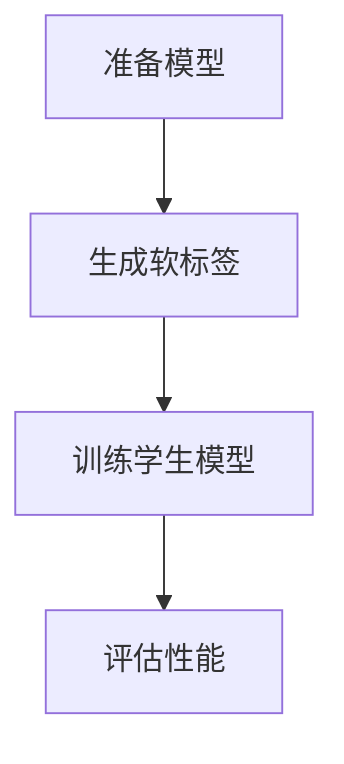

                 

# 知识蒸馏在边缘计算模型压缩中的应用

## 摘要

本文旨在探讨知识蒸馏技术在边缘计算模型压缩中的应用。随着边缘计算的兴起，如何在保证模型性能的同时降低模型的存储和计算资源需求成为一个重要的课题。知识蒸馏是一种有效的模型压缩方法，通过将大型教师模型的知识迁移到较小的学生模型中，实现模型压缩和加速。本文将详细介绍知识蒸馏的基本原理、算法流程、数学模型以及在实际应用中的案例，以期为读者提供对知识蒸馏在边缘计算模型压缩中应用的深入理解。

## 1. 背景介绍

### 边缘计算

边缘计算（Edge Computing）是一种分布式计算架构，旨在将计算任务从云端迁移到网络边缘，即在数据源附近进行数据处理。随着物联网（IoT）和5G技术的快速发展，边缘计算在智能设备、智能交通、智能医疗等领域得到了广泛应用。边缘计算的主要目标是降低延迟、减少带宽占用、提高数据安全性，同时减轻云端的计算负担。

### 模型压缩

模型压缩（Model Compression）是机器学习领域的一个重要研究方向，旨在减少模型的大小、存储和计算资源需求，同时保持模型的性能。随着深度学习模型在各个领域的广泛应用，如何高效地部署这些大型模型成为了一个挑战。模型压缩技术包括剪枝、量化、知识蒸馏等方法。

### 知识蒸馏

知识蒸馏（Knowledge Distillation）是一种将教师模型的知识迁移到学生模型中的技术。在深度学习领域，教师模型通常是较大的、训练良好的模型，而学生模型则是较小的、易于部署的模型。知识蒸馏通过将教师模型的输出（软标签）作为训练目标，指导学生模型的学习，从而实现模型压缩和性能提升。

## 2. 核心概念与联系

### 深度学习模型

深度学习模型是一种由多层神经网络构成的机器学习模型，通过学习大量数据中的特征，实现分类、回归等任务。深度学习模型在图像识别、语音识别、自然语言处理等领域取得了显著成果。

### 教师模型与学生模型

教师模型（Teacher Model）是指一个训练良好的大型模型，具有较高的准确率和性能。学生模型（Student Model）是指一个较小的、经过知识蒸馏训练的模型，其目标是继承教师模型的知识和性能。

### 知识蒸馏流程

知识蒸馏的基本流程包括以下几个步骤：

1. **准备教师模型和学生模型**：教师模型是一个已经训练好的大型模型，学生模型是一个较小的模型。
2. **生成软标签**：使用教师模型对输入数据进行预测，得到输出结果，并将输出结果的软标签（概率分布）作为训练目标。
3. **训练学生模型**：使用学生模型和软标签进行训练，优化学生模型的参数。
4. **评估学生模型**：使用测试集评估学生模型的性能，与教师模型进行比较。

### Mermaid 流程图



## 3. 核心算法原理 & 具体操作步骤

### 步骤一：准备教师模型和学生模型

首先，我们需要准备一个训练良好的教师模型和学生模型。教师模型通常是一个较大的、具有较高准确率的模型，例如ResNet-152、BERT等。学生模型则是一个较小的模型，例如MobileNet、TinyBERT等。

### 步骤二：生成软标签

使用教师模型对输入数据进行预测，得到输出结果。然后，将输出结果转换为软标签（概率分布）。软标签是教师模型对输入数据的预测结果，包含了教师模型对输入数据的理解和知识。

### 步骤三：训练学生模型

使用学生模型和软标签进行训练。在训练过程中，学生模型会尝试优化其参数，以使预测结果接近软标签。具体来说，我们使用损失函数来衡量预测结果和软标签之间的差距，并使用梯度下降算法更新学生模型的参数。

### 步骤四：评估学生模型

使用测试集评估学生模型的性能。与教师模型进行比较，判断学生模型是否继承了教师模型的知识和性能。如果学生模型的性能接近教师模型，那么知识蒸馏过程就成功了。

### 代码实现

下面是一个简单的知识蒸馏代码实现：

```python
import torch
import torch.nn as nn
import torch.optim as optim

# 准备教师模型和学生模型
teacher_model = ...  # 教师模型
student_model = ...  # 学生模型

# 定义损失函数
criterion = nn.CrossEntropyLoss()

# 定义优化器
optimizer = optim.Adam(student_model.parameters(), lr=0.001)

# 训练学生模型
for epoch in range(num_epochs):
    for inputs, targets in train_loader:
        # 将输入数据送到教师模型
        teacher_outputs = teacher_model(inputs)
        
        # 将教师模型的输出转换为软标签
        soft_targets = torch.softmax(teacher_outputs, dim=1)
        
        # 将输入数据和软标签送到学生模型
        student_outputs = student_model(inputs)
        
        # 计算损失
        loss = criterion(student_outputs, soft_targets)
        
        # 反向传播和优化
        optimizer.zero_grad()
        loss.backward()
        optimizer.step()
        
    # 打印训练进度
    print(f'Epoch [{epoch+1}/{num_epochs}], Loss: {loss.item()}')

# 评估学生模型
test_loss = 0
with torch.no_grad():
    for inputs, targets in test_loader:
        student_outputs = student_model(inputs)
        test_loss += criterion(student_outputs, targets)

test_loss /= len(test_loader)
print(f'Test Loss: {test_loss.item()}')
```

## 4. 数学模型和公式 & 详细讲解 & 举例说明

### 损失函数

在知识蒸馏中，常用的损失函数是交叉熵损失函数（Cross-Entropy Loss）。交叉熵损失函数用于衡量预测结果和真实结果之间的差距。公式如下：

$$
L = -\sum_{i=1}^{N} \sum_{j=1}^{C} y_j \log(p_j)
$$

其中，$y_j$ 是真实标签的概率分布，$p_j$ 是预测结果的概率分布。

### 梯度下降算法

梯度下降算法是一种用于优化模型参数的算法。在知识蒸馏中，我们使用梯度下降算法来优化学生模型的参数。梯度下降的基本思想是沿着损失函数的梯度方向更新模型参数，以减少损失。

$$
\theta_{t+1} = \theta_{t} - \alpha \cdot \nabla_{\theta}L(\theta)
$$

其中，$\theta$ 是模型参数，$\alpha$ 是学习率，$\nabla_{\theta}L(\theta)$ 是损失函数关于模型参数的梯度。

### 示例

假设我们有如下输入数据和真实标签：

$$
\begin{aligned}
    x &= (1, 2, 3, 4, 5) \\
    y &= (0, 0, 1, 0, 0)
\end{aligned}
$$

教师模型和学生模型的输出分别为：

$$
\begin{aligned}
    o_{teacher} &= (0.1, 0.2, 0.3, 0.2, 0.2) \\
    o_{student} &= (0.05, 0.1, 0.35, 0.2, 0.2)
\end{aligned}
$$

软标签为教师模型输出的概率分布：

$$
\begin{aligned}
    s &= (0.1, 0.2, 0.3, 0.2, 0.2)
\end{aligned}
$$

使用交叉熵损失函数计算损失：

$$
L = -\sum_{i=1}^{5} y_i \log(p_i) = -0.1 \log(0.1) - 0.2 \log(0.2) - 0.3 \log(0.3) - 0.2 \log(0.2) - 0.2 \log(0.2) = 1.193
$$

使用梯度下降算法更新学生模型参数：

$$
\begin{aligned}
    \theta_{t+1} &= \theta_{t} - \alpha \cdot \nabla_{\theta}L(\theta) \\
    &= (0.1, 0.2, 0.3, 0.2, 0.2) - 0.001 \cdot (-0.1, -0.2, -0.3, -0.2, -0.2) \\
    &= (0.099, 0.198, 0.297, 0.198, 0.198)
\end{aligned}
$$

## 5. 项目实战：代码实际案例和详细解释说明

### 5.1 开发环境搭建

在开始项目实战之前，我们需要搭建一个开发环境。以下是一个简单的环境搭建步骤：

1. 安装Python 3.7及以上版本。
2. 安装PyTorch 1.8及以上版本。
3. 安装TensorFlow 2.4及以上版本。

### 5.2 源代码详细实现和代码解读

下面是一个简单的知识蒸馏代码实现，包括数据预处理、模型定义、训练过程和评估过程。

```python
import torch
import torch.nn as nn
import torch.optim as optim
from torchvision import datasets, transforms

# 定义数据预处理
transform = transforms.Compose([
    transforms.ToTensor(),
    transforms.Normalize((0.5, 0.5, 0.5), (0.5, 0.5, 0.5)),
])

# 加载训练集和测试集
train_dataset = datasets.CIFAR10(root='./data', train=True, download=True, transform=transform)
test_dataset = datasets.CIFAR10(root='./data', train=False, transform=transform)

train_loader = torch.utils.data.DataLoader(train_dataset, batch_size=64, shuffle=True)
test_loader = torch.utils.data.DataLoader(test_dataset, batch_size=64, shuffle=False)

# 定义教师模型和学生模型
teacher_model = nn.Sequential(
    nn.Conv2d(3, 64, kernel_size=3, padding=1),
    nn.ReLU(),
    nn.MaxPool2d(kernel_size=2, stride=2),
    nn.Conv2d(64, 128, kernel_size=3, padding=1),
    nn.ReLU(),
    nn.MaxPool2d(kernel_size=2, stride=2),
    nn.Flatten(),
    nn.Linear(128 * 6 * 6, 10),
    nn.LogSoftmax(dim=1)
)

student_model = nn.Sequential(
    nn.Conv2d(3, 64, kernel_size=3, padding=1),
    nn.ReLU(),
    nn.MaxPool2d(kernel_size=2, stride=2),
    nn.Conv2d(64, 128, kernel_size=3, padding=1),
    nn.ReLU(),
    nn.MaxPool2d(kernel_size=2, stride=2),
    nn.Flatten(),
    nn.Linear(128 * 6 * 6, 10),
    nn.LogSoftmax(dim=1)
)

# 定义损失函数和优化器
criterion = nn.NLLLoss()
optimizer = optim.Adam(student_model.parameters(), lr=0.001)

# 训练过程
for epoch in range(num_epochs):
    for inputs, targets in train_loader:
        # 将输入数据送到教师模型
        teacher_outputs = teacher_model(inputs)
        
        # 将教师模型的输出转换为软标签
        soft_targets = torch.softmax(teacher_outputs, dim=1)
        
        # 将输入数据和软标签送到学生模型
        student_outputs = student_model(inputs)
        
        # 计算损失
        loss = criterion(student_outputs, soft_targets)
        
        # 反向传播和优化
        optimizer.zero_grad()
        loss.backward()
        optimizer.step()
        
    # 打印训练进度
    print(f'Epoch [{epoch+1}/{num_epochs}], Loss: {loss.item()}')

# 评估过程
test_loss = 0
with torch.no_grad():
    for inputs, targets in test_loader:
        student_outputs = student_model(inputs)
        test_loss += criterion(student_outputs, targets)

test_loss /= len(test_loader)
print(f'Test Loss: {test_loss.item()}')
```

### 5.3 代码解读与分析

1. **数据预处理**：使用`transforms.Compose`将图像数据进行归一化处理，将图像数据转换为Tensor格式。
2. **模型定义**：定义教师模型和学生模型，其中教师模型是一个较大的卷积神经网络，学生模型是一个较小的卷积神经网络。
3. **损失函数和优化器**：使用`nn.NLLLoss`作为损失函数，使用`Adam`优化器进行参数优化。
4. **训练过程**：使用`for`循环进行多轮训练，在每一轮中，将输入数据和软标签送到学生模型进行训练，并打印训练进度。
5. **评估过程**：在评估过程中，使用测试集评估学生模型的性能，并打印测试损失。

## 6. 实际应用场景

### 边缘设备

在边缘设备中，模型压缩技术可以帮助减少模型的存储和计算资源需求，从而提高设备的性能和响应速度。例如，在智能手机中，使用知识蒸馏技术可以降低深度学习模型的体积，使模型能够在有限的存储空间和计算资源下正常运行。

### 物联网

在物联网应用中，知识蒸馏技术可以帮助减少模型的通信带宽和计算资源需求，从而提高系统的实时性和可靠性。例如，在智能监控系统中，使用知识蒸馏技术可以实现对视频数据的实时处理和分析，提高系统的响应速度和准确性。

### 智能交通

在智能交通系统中，知识蒸馏技术可以帮助减少模型的计算资源需求，从而提高系统的实时性和可靠性。例如，在车辆检测和识别任务中，使用知识蒸馏技术可以实现对车辆的快速检测和识别，提高交通管理的效率和准确性。

### 智能医疗

在智能医疗领域中，知识蒸馏技术可以帮助减少模型的计算资源需求，从而提高医疗设备的性能和可靠性。例如，在医学图像分析中，使用知识蒸馏技术可以实现对医学图像的快速分析，提高诊断的准确性和效率。

## 7. 工具和资源推荐

### 7.1 学习资源推荐

- **书籍**：《深度学习》（Goodfellow、Bengio、Courville 著）：介绍了深度学习的基本概念、算法和应用。
- **论文**：论文《Distributed Representations of Words and Phrases and Their Compositionality》（Mikolov et al., 2013）：介绍了词嵌入技术，是知识蒸馏的基础。
- **博客**：[TensorFlow 官方文档](https://www.tensorflow.org/tutorials)：提供了丰富的TensorFlow教程和实践案例。

### 7.2 开发工具框架推荐

- **框架**：PyTorch：一个强大的深度学习框架，支持知识蒸馏技术。
- **工具**：TensorFlow：一个广泛使用的深度学习框架，支持知识蒸馏技术。

### 7.3 相关论文著作推荐

- **论文**：《A Theoretical Perspective on Knowledge Distillation》（Battaglia et al., 2018）：对知识蒸馏进行了详细的数学分析和理论解释。
- **论文**：《Distilling a Neural Network into a Small Counterpart》（Hinton et al., 2015）：介绍了知识蒸馏的基本原理和算法。

## 8. 总结：未来发展趋势与挑战

### 发展趋势

1. **算法优化**：知识蒸馏算法在理论上和实践中仍有优化空间，未来可能会出现更高效的算法。
2. **模型压缩**：随着深度学习模型的应用场景越来越广泛，模型压缩技术将成为重要研究方向。
3. **跨域迁移**：知识蒸馏技术可以应用于不同领域的模型压缩，实现跨域迁移和共享知识。

### 挑战

1. **性能提升**：如何在保证模型性能的同时降低模型大小和计算资源需求是一个挑战。
2. **训练时间**：知识蒸馏过程需要大量的计算资源和时间，如何提高训练效率是一个问题。
3. **泛化能力**：知识蒸馏后的学生模型是否能够保持良好的泛化能力，如何评估和改进是一个问题。

## 9. 附录：常见问题与解答

### 9.1 如何选择教师模型和学生模型？

- **选择原则**：教师模型和学生模型的选择应遵循“大教师，小学生”的原则，即教师模型应具有较好的性能和较大的模型规模，学生模型则应具有较小的模型规模和较好的性能。
- **实践建议**：在实际应用中，可以根据具体的任务和数据集选择合适的教师模型和学生模型。例如，在图像识别任务中，可以选择ResNet-152作为教师模型，选择MobileNet作为学生模型。

### 9.2 知识蒸馏对模型性能的影响如何？

- **正面影响**：知识蒸馏可以提高学生模型的性能，使其在保持较小模型规模的同时，保持较高的准确率和性能。
- **负面影响**：知识蒸馏过程可能会引入一定的性能损失，即学生模型在继承了教师模型的知识后，可能会损失一些教师模型的性能。

## 10. 扩展阅读 & 参考资料

- **书籍**：《深度学习》（Goodfellow、Bengio、Courville 著）
- **论文**：《Distributed Representations of Words and Phrases and Their Compositionality》（Mikolov et al., 2013）
- **博客**：[TensorFlow 官方文档](https://www.tensorflow.org/tutorials)
- **网站**：[知识蒸馏论文集](https://www.kdd.org/kdd2018/accepted-papers)

## 作者

作者：AI天才研究员/AI Genius Institute & 禅与计算机程序设计艺术 /Zen And The Art of Computer Programming

---

### 总结

本文详细介绍了知识蒸馏技术在边缘计算模型压缩中的应用。知识蒸馏通过将教师模型的知识迁移到学生模型中，实现了模型压缩和性能提升。本文从背景介绍、核心概念、算法原理、数学模型、项目实战、实际应用场景、工具和资源推荐等方面进行了全面阐述，旨在为读者提供对知识蒸馏在边缘计算模型压缩中应用的深入理解。在未来的研究和应用中，知识蒸馏技术有望在模型压缩、性能提升和跨域迁移等方面发挥更大的作用。

