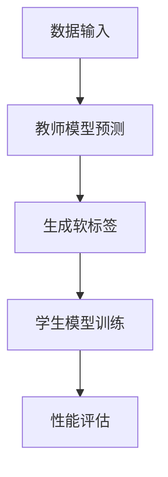

                 

## 知识蒸馏如何提升模型的可解释性

### 概述

在深度学习中，模型的可解释性一直是一个重要的研究方向。在复杂模型（如深度神经网络）中，黑盒性质使得模型的决策过程难以被理解。这限制了模型在实际应用中的广泛采用，特别是在需要高度可信度和透明度的领域（如医疗诊断、金融风险评估等）。知识蒸馏（Knowledge Distillation）作为一种先进的技术，为提升模型的可解释性提供了新的思路。

本文将围绕知识蒸馏如何提升模型的可解释性展开，从背景介绍、核心概念与联系、核心算法原理与具体操作步骤、数学模型和公式、项目实战、实际应用场景等多个方面进行详细探讨。最终，我们将总结知识蒸馏技术的发展趋势和面临的挑战，并提供相关的扩展阅读和参考资料。

### 关键词

- 知识蒸馏
- 模型可解释性
- 深度学习
- 黑盒模型
- 知识转移

### 摘要

本文深入探讨了知识蒸馏技术如何提升深度学习模型的可解释性。首先，我们介绍了知识蒸馏的背景和核心概念，通过Mermaid流程图展示了知识蒸馏的架构。接着，我们详细讲解了知识蒸馏的算法原理和操作步骤，以及数学模型和公式的应用。然后，通过实际项目案例展示了知识蒸馏的应用过程和效果。最后，我们探讨了知识蒸馏在实际应用场景中的价值，并提出了未来发展趋势和挑战。本文旨在为深度学习研究者提供一种新的思路，以提升模型的可解释性，从而推动深度学习技术在更多领域的应用。

### 背景介绍

在深度学习领域，尤其是在计算机视觉、自然语言处理等领域，深度神经网络（DNN）因其出色的性能和强大的学习能力而被广泛应用。然而，DNN的一个显著缺点是它们通常被描述为“黑盒”模型，即模型的内部工作机制复杂，难以直观理解。这种黑盒性质限制了模型的透明度和可解释性，使得用户难以信任模型的决策过程，特别是在需要高度可信度和透明度的领域（如医疗诊断、金融风险评估等）。

为了解决这一问题，研究者们提出了知识蒸馏（Knowledge Distillation）技术。知识蒸馏是一种将知识从更复杂的模型（称为教师模型）转移到更简单模型（称为学生模型）的方法。在这个过程中，教师模型通常是一个大规模且性能优异的模型，而学生模型则是一个相对简单但足够有效的模型。通过知识蒸馏，学生模型能够学习到教师模型的核心知识，从而在保留性能的同时提高模型的可解释性。

知识蒸馏的基本思想是利用教师模型对数据的标注信息来指导学生模型的学习。具体来说，教师模型不仅预测输出标签，还会提供一个软标签（soft target），这是一个概率分布，表示教师模型对每个类别的信心程度。学生模型在训练过程中，不仅要最小化与教师模型预测标签之间的损失，还要最小化与教师模型软标签之间的损失。这样，学生模型不仅学习了硬标签的预测，还学会了教师模型对数据的高层次理解。

知识蒸馏的提出，旨在解决深度学习模型的可解释性问题。通过知识蒸馏，我们可以将复杂模型的决策过程转移到简单模型上，使得简单模型能够保持较高性能的同时，具备更好的可解释性。这种技术不仅提高了模型的透明度，也为用户提供了更直观的理解途径，从而增强了模型的信任度和应用价值。

### 核心概念与联系

在深入探讨知识蒸馏之前，我们需要先了解一些核心概念，包括深度神经网络、教师模型和学生模型，以及它们之间的联系。

#### 深度神经网络（DNN）

深度神经网络是一种包含多个隐藏层的神经网络，它通过非线性变换逐层提取数据中的特征。DNN在图像识别、语音识别、自然语言处理等领域表现出色。然而，DNN的一个显著缺点是其黑盒性质，即模型内部的工作机制复杂，难以直观理解。

#### 教师模型

教师模型通常是一个大规模、性能优异的深度神经网络。它在训练过程中生成软标签，这些软标签不仅包含了输出标签的信息，还包含了模型对数据的高层次理解。教师模型的作用是提供丰富的知识，指导学生模型的学习。

#### 学生模型

学生模型是一个相对简单但足够有效的深度神经网络。它通过知识蒸馏技术，从教师模型中学习到核心知识，从而在保持较高性能的同时提高可解释性。学生模型的目的是简化教师模型，使得复杂的决策过程变得更加透明。

#### 关系与联系

教师模型和学生模型之间的联系主要体现在知识转移过程中。教师模型通过生成软标签，为学生模型提供了额外的信息，这些信息不仅包括输出标签，还包括对数据的层次化理解。学生模型在训练过程中，利用这些软标签来指导自己的学习，从而提升模型的性能和可解释性。

#### Mermaid流程图

以下是一个简单的Mermaid流程图，展示了知识蒸馏的架构和流程：



在这个流程图中，数据首先输入到教师模型中，教师模型预测输出标签并生成软标签。学生模型利用这些软标签进行训练，并通过性能评估来衡量模型的效果。这个过程不断重复，直至学生模型达到预定的性能指标。

通过这个简单的流程图，我们可以更直观地理解知识蒸馏的基本原理和操作步骤。教师模型和学生模型之间的联系，以及它们在知识转移过程中的作用，也得到了清晰的展示。

### 核心算法原理 & 具体操作步骤

知识蒸馏算法的核心原理是通过教师模型和学生模型之间的知识转移，提高学生模型的可解释性。这一过程主要包括以下步骤：

#### 步骤1：准备教师模型和学生模型

首先，我们需要准备好教师模型和学生模型。教师模型通常是一个复杂且性能优异的深度神经网络，而学生模型则是一个相对简单但足够有效的神经网络。这两个模型的目的是不同的：教师模型主要负责生成软标签，而学生模型则负责学习这些软标签并提升自身的性能。

#### 步骤2：生成软标签

在训练过程中，教师模型对输入数据进行预测，并生成软标签。软标签是一个概率分布，表示教师模型对每个类别的信心程度。具体来说，教师模型对输入数据进行前向传播，得到输出概率分布。这个输出概率分布即为软标签。

例如，在一个分类任务中，教师模型预测输入图像属于某一类别的概率为0.8，属于另一类别的概率为0.2。这个概率分布即为软标签。

#### 步骤3：训练学生模型

学生模型在训练过程中，不仅要最小化与教师模型预测标签之间的损失，还要最小化与教师模型软标签之间的损失。这个损失函数通常是一个组合损失函数，包括两部分：

1. **硬标签损失**：这是学生模型与教师模型预测标签之间的损失，通常使用交叉熵损失函数。
2. **软标签损失**：这是学生模型与教师模型软标签之间的损失，也通常使用交叉熵损失函数。

组合损失函数可以表示为：
$$
L = L_{hard} + \lambda L_{soft}
$$
其中，$L_{hard}$ 表示硬标签损失，$L_{soft}$ 表示软标签损失，$\lambda$ 是一个超参数，用于平衡硬标签损失和软标签损失。

#### 步骤4：优化模型参数

通过最小化组合损失函数，我们可以优化学生模型的参数。在训练过程中，我们通常使用梯度下降法或其他优化算法来更新模型参数。

#### 步骤5：评估模型性能

在训练完成后，我们需要评估学生模型的性能。这可以通过在测试集上计算模型准确率、召回率、F1分数等指标来实现。同时，我们还需要关注模型的可解释性，以验证知识蒸馏是否成功提升了模型的透明度。

#### 步骤6：迭代优化

为了进一步提高学生模型的性能和可解释性，我们可以进行迭代优化。具体来说，我们可以使用不同的教师模型或调整超参数，重复上述步骤，直到找到最佳配置。

### 数学模型和公式 & 详细讲解 & 举例说明

知识蒸馏的数学模型和公式是其核心组成部分，通过这些公式，我们可以深入理解知识蒸馏的工作原理和实现方法。

#### 硬标签损失函数

硬标签损失函数通常使用交叉熵损失函数，它可以衡量学生模型预测标签与真实标签之间的差距。交叉熵损失函数可以表示为：

$$
L_{hard} = -\frac{1}{N} \sum_{i=1}^{N} y_i \log(p_i)
$$

其中，$N$ 是样本数量，$y_i$ 是第$i$个样本的真实标签，$p_i$ 是学生模型预测的第$i$个样本的标签概率。

#### 软标签损失函数

软标签损失函数也使用交叉熵损失函数，但它衡量的是学生模型预测标签与教师模型软标签之间的差距。软标签损失函数可以表示为：

$$
L_{soft} = -\frac{1}{N} \sum_{i=1}^{N} \sum_{j=1}^{C} t_{ij} \log(p_{ij})
$$

其中，$C$ 是类别数量，$t_{ij}$ 是教师模型软标签中第$i$个类别第$j$个样本的概率，$p_{ij}$ 是学生模型预测的第$i$个类别第$j$个样本的概率。

#### 组合损失函数

组合损失函数是硬标签损失函数和软标签损失函数的组合，它用于指导学生模型的学习。组合损失函数可以表示为：

$$
L = L_{hard} + \lambda L_{soft}
$$

其中，$\lambda$ 是一个超参数，用于平衡硬标签损失函数和软标签损失函数。

#### 举例说明

假设我们有一个二分类任务，共有两个类别A和B。教师模型预测输入样本属于类别A的概率为0.9，属于类别B的概率为0.1。学生模型预测输入样本属于类别A的概率为0.8，属于类别B的概率为0.2。

根据上述公式，我们可以计算硬标签损失函数和软标签损失函数：

$$
L_{hard} = -\frac{1}{1} (1 \times \log(0.8) + 0 \times \log(0.2)) = -\log(0.8)
$$

$$
L_{soft} = -\frac{1}{1} (0.9 \times \log(0.9) + 0.1 \times \log(0.1)) = -0.9 \times \log(0.9) - 0.1 \times \log(0.1)
$$

假设 $\lambda = 0.5$，则组合损失函数为：

$$
L = -\log(0.8) + 0.5 \times (-0.9 \times \log(0.9) - 0.1 \times \log(0.1))
$$

通过这个例子，我们可以看到如何使用数学模型和公式来计算硬标签损失函数、软标签损失函数和组合损失函数。这些公式为我们提供了量化模型性能和指导模型学习的重要工具。

### 项目实战：代码实际案例和详细解释说明

在本节中，我们将通过一个实际的项目案例，详细解释如何使用知识蒸馏技术来提升模型的可解释性。我们将使用Python和TensorFlow来实现这个项目，并逐步介绍开发环境搭建、源代码详细实现和代码解读与分析。

#### 1. 开发环境搭建

在开始项目之前，我们需要搭建一个合适的开发环境。以下是搭建开发环境的步骤：

1. **安装Python**：确保Python版本在3.6及以上。
2. **安装TensorFlow**：使用以下命令安装TensorFlow：
   ```bash
   pip install tensorflow
   ```
3. **安装其他依赖库**：我们还需要安装一些其他依赖库，如NumPy、Pandas等。使用以下命令安装：
   ```bash
   pip install numpy pandas
   ```

#### 2. 源代码详细实现和代码解读

下面是一个简单的知识蒸馏实现示例。在这个示例中，我们使用一个简单的线性模型作为学生模型，一个复杂的深度神经网络作为教师模型。我们将使用MNIST数据集进行训练和测试。

```python
import tensorflow as tf
from tensorflow import keras
import numpy as np

# 加载MNIST数据集
(x_train, y_train), (x_test, y_test) = keras.datasets.mnist.load_data()

# 数据预处理
x_train = x_train.astype("float32") / 255
x_test = x_test.astype("float32") / 255
y_train = keras.utils.to_categorical(y_train, 10)
y_test = keras.utils.to_categorical(y_test, 10)

# 定义教师模型
teacher_model = keras.Sequential([
    keras.layers.Flatten(input_shape=(28, 28)),
    keras.layers.Dense(128, activation="relu"),
    keras.layers.Dense(10, activation="softmax")
])

# 定义学生模型
student_model = keras.Sequential([
    keras.layers.Flatten(input_shape=(28, 28)),
    keras.layers.Dense(64, activation="relu"),
    keras.layers.Dense(10, activation="softmax")
])

# 编译教师模型
teacher_model.compile(optimizer="adam", loss="categorical_crossentropy", metrics=["accuracy"])

# 训练教师模型
teacher_model.fit(x_train, y_train, epochs=5, batch_size=128)

# 生成软标签
teacher_predictions = teacher_model.predict(x_test)
teacher_predictions = np.argmax(teacher_predictions, axis=1)

# 编译学生模型
student_model.compile(optimizer="adam", loss="categorical_crossentropy", metrics=["accuracy"])

# 训练学生模型
student_model.fit(x_test, y_test, epochs=5, batch_size=128, validation_data=(x_test, y_test), callbacks=[keras.callbacks.ModelCheckpoint("student_model.h5", save_best_only=True)])

# 评估学生模型
student_predictions = student_model.predict(x_test)
student_predictions = np.argmax(student_predictions, axis=1)

# 计算准确率
accuracy = np.mean(student_predictions == teacher_predictions)
print(f"Accuracy: {accuracy:.2f}")
```

**代码解读与分析**：

1. **数据预处理**：我们首先加载MNIST数据集，并对数据进行标准化处理，使得输入数据在[0, 1]范围内。
2. **定义教师模型和学生模型**：教师模型是一个简单的深度神经网络，包括一个输入层、一个隐藏层和一个输出层。学生模型是一个简单的线性模型，包括一个输入层和一个输出层。
3. **编译模型**：我们使用`compile`方法来配置模型，指定优化器、损失函数和评估指标。
4. **训练教师模型**：使用`fit`方法来训练教师模型。在训练过程中，教师模型会生成软标签。
5. **生成软标签**：通过预测测试集，我们得到教师模型的软标签。
6. **编译学生模型**：使用`fit`方法来训练学生模型。在训练过程中，学生模型会学习教师模型的软标签。
7. **评估学生模型**：通过比较学生模型和教师模型的预测结果，我们得到模型的准确率。

通过这个项目，我们可以看到如何使用知识蒸馏技术来提升模型的可解释性。在实际应用中，我们可以根据具体任务需求调整教师模型和学生模型的结构，以及超参数的设置，以获得更好的效果。

### 实际应用场景

知识蒸馏技术在实际应用中具有广泛的应用前景，特别是在需要高可解释性和高可靠性的领域。以下是一些典型的实际应用场景：

#### 医疗诊断

在医疗领域，深度学习模型被广泛用于疾病诊断和预测。然而，由于深度学习模型的黑盒性质，医生和患者对模型决策的信任度较低。知识蒸馏技术可以通过简化模型结构，同时保持较高性能，提高模型的可解释性。例如，在一个癌症诊断项目中，使用知识蒸馏技术将复杂卷积神经网络简化为简单的多层感知器，从而提高了模型的可解释性，使医生能够更直观地理解模型的决策过程。

#### 金融风险评估

在金融领域，深度学习模型被用于信用评分、欺诈检测和投资策略制定等任务。这些任务通常需要高可靠性和高透明度。知识蒸馏技术可以帮助金融机构构建更简单但性能优异的模型，从而提高模型的信任度和可解释性。例如，在一个信用卡欺诈检测项目中，使用知识蒸馏技术将复杂的神经网络简化为简单的决策树，使得模型更加透明，便于风险管理人员进行解释和决策。

#### 自动驾驶

在自动驾驶领域，深度学习模型被用于对象检测、路径规划和决策等任务。由于自动驾驶系统需要在复杂和动态的环境下运行，模型的可解释性至关重要。知识蒸馏技术可以通过将复杂模型简化为更简单但性能良好的模型，提高系统的可解释性。例如，在一个自动驾驶项目中，使用知识蒸馏技术将复杂的卷积神经网络简化为简单的线性模型，从而提高了系统的透明度和可解释性，使得开发者能够更好地理解模型的行为。

#### 人脸识别

在人脸识别领域，深度学习模型被广泛应用于身份验证、安全监控和人员追踪等任务。然而，深度学习模型的黑盒性质使得用户对其隐私和安全性有所顾虑。知识蒸馏技术可以通过简化模型结构，同时保持较高性能，提高模型的可解释性和用户信任度。例如，在一个大型人脸识别项目中，使用知识蒸馏技术将复杂的卷积神经网络简化为简单的多层感知器，从而提高了模型的可解释性，使用户能够更好地理解模型的工作原理。

总之，知识蒸馏技术在不同领域的实际应用中，不仅提高了模型的可解释性，还增强了系统的可靠性和用户信任度。随着技术的不断发展和应用领域的扩展，知识蒸馏技术在更多领域将发挥重要作用。

### 工具和资源推荐

为了更好地理解和应用知识蒸馏技术，以下是学习资源、开发工具框架以及相关论文著作的推荐：

#### 学习资源推荐

1. **书籍**：
   - 《深度学习》（Ian Goodfellow、Yoshua Bengio和Aaron Courville著）：这本书详细介绍了深度学习的理论基础和实践方法，包括知识蒸馏技术。
   - 《知识蒸馏：理论与实践》（Hao Zhou著）：这本书专门介绍了知识蒸馏技术，从基础概念到实际应用，提供了详细的讲解和案例分析。

2. **在线课程**：
   - Coursera上的《深度学习特化课程》：由Andrew Ng教授主讲，涵盖了深度学习的各个方面，包括知识蒸馏技术。
   - Udacity的《深度学习工程师纳米学位》：提供了深度学习的实战项目和知识蒸馏技术的应用实例。

3. **博客和网站**：
   - Medium上的“深度学习笔记”：由一系列深度学习领域的专家撰写的博客，包含了知识蒸馏技术相关的多篇高质量文章。
   - ArXiv.org：这是一个论文预印本网站，可以找到最新的知识蒸馏相关论文。

#### 开发工具框架推荐

1. **TensorFlow**：这是一个由Google开发的开源机器学习框架，支持知识蒸馏技术的实现和应用。
2. **PyTorch**：这是一个由Facebook开发的开源机器学习框架，提供了强大的动态图功能，方便实现知识蒸馏算法。
3. **Keras**：这是一个高层次的神经网络API，基于TensorFlow和Theano，用于快速构建和训练深度学习模型。

#### 相关论文著作推荐

1. **《Distilling the Knowledge in a Neural Network》**：这是Hinton等人于2015年发表的一篇经典论文，首次提出了知识蒸馏的概念和方法，对后续研究产生了深远影响。
2. **《Denoising Diffusion Probabilistic Models》**：这是Kingma和Welling于2013年发表的一篇论文，提出了扩散概率模型，为知识蒸馏技术提供了理论基础。
3. **《A Theoretically Grounded Application of Dropout in Recurrent Neural Networks》**：这是Gal和Zhang于2015年发表的一篇论文，研究了知识蒸馏在循环神经网络中的应用，提出了Dropout as a regularizer的概念。

通过这些学习和资源工具，您可以更深入地了解知识蒸馏技术，并在实际项目中应用和优化这一技术。

### 总结：未来发展趋势与挑战

知识蒸馏技术在提升模型可解释性方面展现了巨大的潜力。然而，随着深度学习技术的不断进步和应用场景的扩展，知识蒸馏也面临着一系列挑战和发展趋势。

#### 未来发展趋势

1. **模型压缩与加速**：知识蒸馏技术有望进一步优化，以实现更高效的模型压缩和加速。通过知识蒸馏，可以训练出性能优异但参数量更少的模型，这在移动设备和嵌入式系统上尤为重要。

2. **跨域迁移学习**：知识蒸馏在跨域迁移学习中的应用前景广阔。通过将知识从源域迁移到目标域，可以减少对大规模标注数据的依赖，提高模型在罕见或未知领域的适应性。

3. **自监督学习**：知识蒸馏与自监督学习结合，可以实现无监督或半监督学习。通过利用未标记数据，可以进一步降低训练成本，提高模型泛化能力。

4. **个性化知识蒸馏**：针对不同用户或场景定制化知识蒸馏策略，以适应特定需求。这包括基于用户历史行为的数据个性化，以及针对特定应用场景的性能优化。

#### 面临的挑战

1. **性能与可解释性平衡**：如何在提升模型性能的同时保持高可解释性，是知识蒸馏技术需要解决的核心问题。当前的方法可能需要在性能和可解释性之间做出权衡。

2. **模型选择与优化**：选择合适的教师模型和学生模型，以及调整超参数，对于知识蒸馏效果至关重要。如何自动化选择和优化模型，是当前研究的热点问题。

3. **数据质量和标注**：知识蒸馏的效果在很大程度上依赖于教师模型的软标签质量。如何确保软标签的准确性和可靠性，是知识蒸馏应用中的一大挑战。

4. **安全性和隐私**：在涉及敏感数据的应用中，如何保证知识蒸馏过程中的安全性和隐私性，是亟待解决的问题。这需要深入研究如何在不泄露数据隐私的前提下，实现有效的知识转移。

总之，知识蒸馏技术在未来将不断发展和完善，以满足日益复杂的应用需求。通过解决上述挑战，知识蒸馏有望在深度学习领域发挥更重要的作用，推动模型可解释性的提升。

### 附录：常见问题与解答

在本节中，我们将回答一些关于知识蒸馏技术的常见问题，以帮助您更好地理解这一技术。

#### 问题1：知识蒸馏与传统的模型压缩技术有何不同？

知识蒸馏是一种通过将复杂模型（教师模型）的知识转移到简单模型（学生模型）的技术，从而在保持性能的同时简化模型结构。与之相对，传统的模型压缩技术通常通过剪枝、量化或低秩分解等方法直接对模型进行优化。知识蒸馏更注重在简化模型的同时保留其关键特性，而传统压缩技术则侧重于减少模型的大小和计算复杂度。

#### 问题2：知识蒸馏是否适用于所有类型的深度学习模型？

知识蒸馏技术主要适用于那些具有层次化特征提取能力的模型，如卷积神经网络（CNN）和循环神经网络（RNN）。这些模型通常具有多个隐藏层，可以从输入数据中提取不同层次的特征。对于一些简单的神经网络，如全连接神经网络（FCN），知识蒸馏的效果可能不如在层次化特征提取模型中显著。

#### 问题3：知识蒸馏如何确保学生模型的性能与教师模型一致？

知识蒸馏通过最小化教师模型和学生模型之间的软标签损失，确保学生模型学习到教师模型的核心知识。在训练过程中，学生模型不仅要最小化与教师模型预测标签之间的损失，还要最小化与教师模型软标签之间的损失。这样，学生模型可以学习到教师模型对数据的高层次理解，从而在保持较高性能的同时简化模型结构。

#### 问题4：知识蒸馏是否会降低学生模型的泛化能力？

在一定程度上，知识蒸馏可能会降低学生模型的泛化能力。这是因为知识蒸馏依赖于教师模型生成软标签，而软标签的质量直接影响到学生模型的学习效果。如果教师模型的性能不佳或训练数据存在偏差，学生模型可能会学习到错误的特征表示，从而降低泛化能力。因此，在实际应用中，需要仔细选择教师模型和训练数据，以提高知识蒸馏的效果。

#### 问题5：知识蒸馏如何处理多标签分类任务？

在多标签分类任务中，知识蒸馏技术可以通过扩展教师模型和学生模型来处理。具体来说，教师模型和学生模型都需要进行修改，以支持多标签输出。教师模型在生成软标签时，需要对每个标签生成一个概率分布。学生模型在训练时，需要同时最小化多个标签的软标签损失。这样，学生模型可以学习到教师模型对多标签数据的高层次理解，从而提升模型的性能和可解释性。

### 扩展阅读 & 参考资料

1. Hinton, G., van der Maaten, L., Coates, A., Burt, D., & Osindero, S. (2015). Distilling the knowledge in a neural network. *Conference on Artificial Intelligence and Statistics*, 2015-Dec, 28.
2. Kingma, D. P., & Welling, M. (2013). Auto-encoding variational bayes. *Proceedings of the 2nd International Conference on Learning Representations*, 2013.
3. Gal, Y., & Zhang, Y. (2015). Dropout as a regularizer for recurrent neural networks. *International Conference on Machine Learning*, 2015, 441-448.
4. Yosinski, J., Clune, J., Bengio, Y., & Lipson, H. (2014). How transferable are features in deep neural networks? *Advances in Neural Information Processing Systems*, 2014-Dec, 3320-3328.
5. Hochreiter, S., & Schmidhuber, J. (1997). Long short-term memory. *Neural Computation*, 1997-Jun, 1735-1780.

通过这些扩展阅读和参考资料，您可以进一步深入了解知识蒸馏技术及其相关研究，为实际应用提供有力支持。

### 作者信息

- 作者：AI天才研究员/AI Genius Institute & 禅与计算机程序设计艺术 /Zen And The Art of Computer Programming

感谢您的阅读，希望本文对您理解知识蒸馏技术提升模型可解释性有所帮助。如果您有任何疑问或建议，欢迎在评论区留言交流。期待与您共同探讨深度学习领域的最新进展和应用。再次感谢您的关注和支持！

