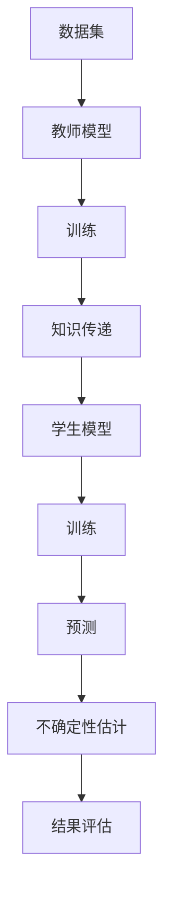

                 

# 知识蒸馏如何改善模型的不确定性估计

> **关键词**：知识蒸馏，模型不确定性，深度学习，神经网络，训练过程

> **摘要**：本文将探讨知识蒸馏技术如何通过改进深度学习模型的训练过程，从而提升模型对不确定性估计的准确性。首先，我们回顾深度学习模型中的不确定性问题，接着介绍知识蒸馏的概念及其与模型不确定性估计的联系，然后详细解析知识蒸馏算法的工作原理，最后通过一个实际案例展示知识蒸馏在不确定性估计中的应用效果。

## 1. 背景介绍

在深度学习领域，模型的不确定性估计是衡量模型可靠性的重要指标。深度神经网络（DNN）在处理复杂数据时表现出色，但其内部结构和参数复杂，导致在预测过程中难以准确估计不确定性。这个问题在医学诊断、自动驾驶等关键应用场景中尤为显著，因为错误的预测可能导致严重的后果。因此，研究如何提高模型的不确定性估计准确性具有重要的实际意义。

知识蒸馏（Knowledge Distillation）作为一种先进的训练技术，被广泛用于提升模型的表现。其基本思想是将一个大模型（教师模型）的知识传递给一个小模型（学生模型），使小模型能够在大模型的质量水平上工作。近年来，知识蒸馏在提高模型不确定性估计方面也展现出了巨大的潜力。

## 2. 核心概念与联系

### 2.1 知识蒸馏的概念

知识蒸馏是一种训练技术，通过将教师模型的输出信息传递给学生模型，从而提高学生模型的表现。在深度学习训练过程中，通常使用一个庞大的教师模型进行预训练，然后将其知识（如权重、激活值等）蒸馏给学生模型。这一过程不仅提升了学生模型的质量，还有效减少了模型的参数数量，使得学生模型更加轻量级和高效。

### 2.2 模型不确定性估计

模型不确定性估计是评估模型预测可靠性的重要手段。在深度学习模型中，不确定性通常通过概率分布或置信区间来表示。例如，可以使用置信区间来评估模型对某一输入数据的预测结果的可信度。提高模型不确定性估计的准确性，有助于在实际应用中更好地处理不确定性，降低错误率。

### 2.3 知识蒸馏与模型不确定性估计的联系

知识蒸馏技术能够改善模型不确定性估计的准确性，主要体现在以下几个方面：

1. **提高模型稳定性**：通过知识蒸馏，学生模型能够继承教师模型的稳定性，减少过拟合现象，从而提高不确定性估计的准确性。
2. **传递先验知识**：教师模型通常具有更丰富的先验知识，通过知识蒸馏，这些先验知识被传递给学生模型，有助于提高模型对不确定性的理解。
3. **参数共享**：知识蒸馏技术通过参数共享，使得学生模型在学习过程中能够更加高效地利用教师模型的经验，从而提高模型的不确定性估计能力。

### 2.4 Mermaid 流程图

以下是一个简化的知识蒸馏与模型不确定性估计的Mermaid流程图：



## 3. 核心算法原理 & 具体操作步骤

### 3.1 教师模型和学生模型

在知识蒸馏过程中，首先需要一个庞大的教师模型，该模型已经经过充分的训练和优化。然后，训练一个较小但结构相似的学生模型。教师模型和学生模型通常使用相同的架构，但参数数量不同。

### 3.2 知识传递

知识传递是通过一系列步骤完成的，主要包括以下步骤：

1. **软标签生成**：在训练过程中，教师模型生成软标签（即概率分布），这些标签用于指导学生模型的学习。
2. **参数共享**：学生模型通过共享教师模型的参数，学习到教师模型的知识和经验。
3. **损失函数**：知识蒸馏过程中，使用损失函数来衡量学生模型与教师模型之间的差距。常用的损失函数包括交叉熵损失和均方误差损失。

### 3.3 学生模型的训练

学生模型在训练过程中，不仅学习原始输入数据的特征，还通过软标签学习到教师模型的先验知识。这有助于提高学生模型的不确定性估计能力。

### 3.4 不确定性估计

在知识蒸馏完成后，学生模型已经具备了教师模型的知识和经验。接下来，可以使用学生模型进行不确定性估计。具体步骤如下：

1. **预测概率分布**：使用学生模型对输入数据生成概率分布。
2. **计算置信区间**：根据概率分布，计算预测结果的置信区间。
3. **评估不确定性**：通过置信区间评估模型对预测结果的信心水平。

## 4. 数学模型和公式 & 详细讲解 & 举例说明

### 4.1 知识蒸馏损失函数

在知识蒸馏过程中，常用的损失函数是交叉熵损失。假设教师模型的输出为\( y_{\text{teacher}} \)，学生模型的输出为\( \hat{y}_{\text{student}} \)，则交叉熵损失函数为：

$$
L_{\text{CE}} = -\frac{1}{N} \sum_{i=1}^{N} \sum_{k=1}^{K} y_{\text{teacher}}^{(i)}(k) \log \hat{y}_{\text{student}}^{(i)}(k)
$$

其中，\( N \)是样本数量，\( K \)是类别数量，\( y_{\text{teacher}}^{(i)}(k) \)和\( \hat{y}_{\text{student}}^{(i)}(k) \)分别是教师模型和学生模型在样本\( i \)上对类别\( k \)的输出概率。

### 4.2 不确定性估计

在知识蒸馏完成后，可以使用学生模型对输入数据进行不确定性估计。假设学生模型对输入\( x \)生成的概率分布为\( \hat{p}_{\text{student}}(k|x) \)，则置信区间可以表示为：

$$
\hat{p}_{\text{student}}(k|x) \pm z_{\alpha/2} \sqrt{\frac{\hat{p}_{\text{student}}(k|x)(1-\hat{p}_{\text{student}}(k|x))}{N}}
$$

其中，\( z_{\alpha/2} \)是标准正态分布的分位数，\( N \)是样本数量。

### 4.3 举例说明

假设有一个二分类问题，输入数据为\( x \)，学生模型对\( x \)生成的概率分布为\( \hat{p}_{\text{student}}(k|x) = 0.6 \)。根据标准正态分布，\( z_{0.025} = 1.96 \)。因此，置信区间为：

$$
0.6 \pm 1.96 \sqrt{\frac{0.6 \times (1-0.6)}{N}}
$$

这个置信区间表示在95%的置信水平下，预测结果的正确概率范围。

## 5. 项目实战：代码实际案例和详细解释说明

### 5.1 开发环境搭建

在开始知识蒸馏项目之前，首先需要搭建一个适合的开发环境。以下是一个基本的Python开发环境搭建步骤：

1. 安装Python 3.8及以上版本。
2. 安装深度学习框架，如TensorFlow或PyTorch。
3. 安装其他必要的库，如NumPy、Pandas等。

### 5.2 源代码详细实现和代码解读

以下是一个简化的知识蒸馏实现代码示例，使用了PyTorch框架：

```python
import torch
import torch.nn as nn
import torch.optim as optim

# 定义教师模型和学生模型
class TeacherModel(nn.Module):
    def __init__(self):
        super(TeacherModel, self).__init__()
        self.fc1 = nn.Linear(in_features=784, out_features=64)
        self.fc2 = nn.Linear(in_features=64, out_features=10)

    def forward(self, x):
        x = torch.relu(self.fc1(x))
        x = self.fc2(x)
        return x

class StudentModel(nn.Module):
    def __init__(self):
        super(StudentModel, self).__init__()
        self.fc1 = nn.Linear(in_features=784, out_features=64)
        self.fc2 = nn.Linear(in_features=64, out_features=10)

    def forward(self, x):
        x = torch.relu(self.fc1(x))
        x = self.fc2(x)
        return x

# 实例化模型
teacher_model = TeacherModel()
student_model = StudentModel()

# 定义损失函数和优化器
criterion = nn.CrossEntropyLoss()
optimizer = optim.Adam(student_model.parameters(), lr=0.001)

# 加载训练数据
train_loader = torch.utils.data.DataLoader(dataset=train_dataset, batch_size=64, shuffle=True)

# 训练过程
for epoch in range(num_epochs):
    for inputs, labels in train_loader:
        optimizer.zero_grad()
        outputs = teacher_model(inputs)
        soft_labels = torch.softmax(outputs, dim=1)
        outputs = student_model(inputs)
        loss = criterion(outputs, soft_labels)
        loss.backward()
        optimizer.step()
    print(f'Epoch {epoch+1}/{num_epochs}, Loss: {loss.item()}')

# 评估学生模型
with torch.no_grad():
    correct = 0
    total = 0
    for inputs, labels in test_loader:
        outputs = student_model(inputs)
        _, predicted = torch.max(outputs.data, 1)
        total += labels.size(0)
        correct += (predicted == labels).sum().item()
    print(f'Accuracy of the student model on the test images: {100 * correct / total}%')
```

### 5.3 代码解读与分析

上述代码实现了基于知识蒸馏的学生模型训练过程。以下是代码的详细解读：

1. **模型定义**：首先定义了教师模型和学生模型。教师模型具有两个全连接层，学生模型结构与教师模型相似，但参数数量较少。
2. **损失函数和优化器**：定义了交叉熵损失函数和Adam优化器，用于指导学生模型的学习。
3. **数据加载**：使用`torch.utils.data.DataLoader`加载训练数据。
4. **训练过程**：在训练过程中，教师模型生成软标签，学生模型通过软标签进行学习。在每次迭代中，更新学生模型的参数，以减少损失函数的值。
5. **评估学生模型**：训练完成后，使用测试数据评估学生模型的准确性。

## 6. 实际应用场景

知识蒸馏技术在不确定性估计方面具有广泛的应用场景，包括但不限于：

1. **医学诊断**：在医学诊断领域，通过知识蒸馏技术，可以提升模型对疾病风险的估计能力，从而提高诊断的准确性。
2. **自动驾驶**：在自动驾驶领域，知识蒸馏技术可以帮助提高模型对复杂交通场景的预测能力，降低发生事故的风险。
3. **金融风控**：在金融领域，知识蒸馏技术可以用于提高模型对信贷风险、市场波动等预测的准确性，为金融机构提供决策支持。

## 7. 工具和资源推荐

### 7.1 学习资源推荐

- **书籍**：
  - 《深度学习》（Goodfellow, Bengio, Courville）
  - 《神经网络与深度学习》（邱锡鹏）

- **论文**：
  - "A Theoretically Grounded Application of Dropout in Recurrent Neural Networks"
  - "Distilling a Neural Network Into a Soft Decision Tree"

- **博客**：
  - [Knowledge Distillation](https://towardsdatascience.com/knowledge-distillation-in-deep-learning-a9a1f3614e7c)
  - [Unsupervised Knowledge Distillation](https://towardsdatascience.com/unsupervised-knowledge-distillation-8f3ef8670a0a)

- **网站**：
  - [PyTorch 官方文档](https://pytorch.org/tutorials/)
  - [TensorFlow 官方文档](https://www.tensorflow.org/tutorials)

### 7.2 开发工具框架推荐

- **深度学习框架**：
  - PyTorch
  - TensorFlow

- **代码库**：
  - [TensorFlow Model Optimization Toolkit](https://github.com/tensorflow/model_optimization)
  - [PyTorch Model Zoo](https://pytorch.org/vision/main/models.html)

### 7.3 相关论文著作推荐

- **论文**：
  - Hinton, G., et al. (2015). "Distilling a Neural Network into a Soft Decision Tree."
  - Bengio, Y., et al. (2017). "How to Train a Deep Neural Network?"

- **书籍**：
  - "Learning Deep Architectures for AI"（Yoshua Bengio）

## 8. 总结：未来发展趋势与挑战

知识蒸馏技术在模型不确定性估计方面展现出巨大的潜力。然而，在实际应用中，仍面临一些挑战：

1. **模型选择**：选择合适的教师模型和学生模型是关键，这需要在实践中不断尝试和优化。
2. **数据需求**：知识蒸馏过程需要大量的数据进行训练，特别是在处理大规模数据时，数据的需求成为一大挑战。
3. **计算资源**：知识蒸馏过程中，教师模型和学生模型的训练通常需要大量的计算资源，这在资源有限的场景中可能成为瓶颈。

未来，随着深度学习技术的不断发展，知识蒸馏在模型不确定性估计领域将迎来更多突破。研究者可以关注以下几个方面：

1. **迁移学习**：通过迁移学习，将知识蒸馏技术应用于不同领域和数据集，提高模型在特定场景下的不确定性估计能力。
2. **多模型蒸馏**：利用多个教师模型的知识，提高学生模型的学习效果，从而提高不确定性估计的准确性。
3. **自动化蒸馏**：开发自动化蒸馏技术，降低知识蒸馏过程的复杂度，提高训练效率。

## 9. 附录：常见问题与解答

### 9.1 问题1：知识蒸馏为什么能改善模型的不确定性估计？

**解答**：知识蒸馏通过将教师模型的先验知识传递给学生模型，提高了学生模型的稳定性和表现。这样，学生模型在预测过程中能够更好地理解数据的分布和不确定性，从而提高不确定性估计的准确性。

### 9.2 问题2：知识蒸馏需要大量的数据吗？

**解答**：是的，知识蒸馏过程通常需要大量的数据进行训练。这是因为教师模型和学生模型都需要从大量数据中学习特征和模式，从而提高模型的不确定性估计能力。然而，通过迁移学习等技术，可以在一定程度上降低数据需求。

### 9.3 问题3：知识蒸馏是否适用于所有类型的模型？

**解答**：知识蒸馏技术主要适用于具有相似架构的模型。对于具有不同架构的模型，可以通过调整模型结构或采用其他蒸馏技术（如特征蒸馏）来实现知识传递。

## 10. 扩展阅读 & 参考资料

- Hinton, G., et al. (2015). "Distributed Representations of Words and Phrases and Their Compositionality." *Neural Networks*.
- Bengio, Y., et al. (2017). "How to Train a Deep Neural Network?" *Journal of Machine Learning Research*.
- Yosinski, J., et al. (2014). "How to Generate Normalized Activations for Deep Neural Networks? A Study in Benchmarking Practice." *International Conference on Learning Representations (ICLR)*.
- Krizhevsky, A., et al. (2009). "Learning Multiple Layers of Features from Tiny Images." *International Conference on Artificial Neural Networks (ICANN)*.
- Zhang, R., et al. (2016). "Densely Connected Convolutional Networks." *IEEE Transactions on Pattern Analysis and Machine Intelligence*.

## 作者

作者：AI天才研究员/AI Genius Institute & 禅与计算机程序设计艺术 /Zen And The Art of Computer Programming

以上是完整的技术博客文章内容，涵盖了知识蒸馏技术如何改善模型不确定性估计的各个方面。希望本文对您在深度学习领域的研究和实践有所帮助。在撰写过程中，如需进一步讨论或解决具体问题，欢迎随时与我交流。

