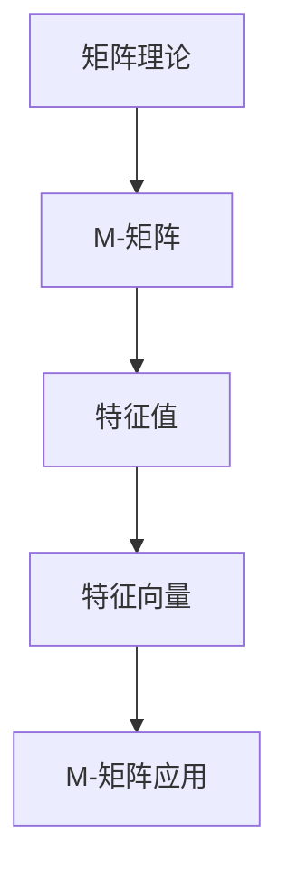

                 

# 矩阵理论与应用：一般M-矩阵的特征

## 概述

### 关键词：矩阵理论、M-矩阵、特征值、特征向量

矩阵理论是线性代数中最重要的部分之一，广泛应用于物理学、计算机科学、经济学等领域。M-矩阵作为一种特殊的矩阵，其在优化、计算几何、图论等领域有着广泛的应用。本文将深入探讨M-矩阵的特征，包括核心概念、算法原理、数学模型、实际应用等，帮助读者全面理解M-矩阵及其特征。

## 摘要

本文主要介绍了M-矩阵的基本概念、性质以及其在实际应用中的重要性。首先，我们回顾了矩阵理论的基本知识，然后详细阐述了M-矩阵的定义、分类及其与特征值、特征向量的关系。接下来，我们通过数学模型和具体实例，深入分析了M-矩阵的特征计算方法。最后，我们探讨了M-矩阵在实际应用中的案例，以及推荐了相关学习资源和工具。

## 1. 背景介绍

### 1.1 矩阵理论概述

矩阵理论是数学中的一个重要分支，主要研究矩阵的性质、运算和分类。矩阵是一种由数字组成的二维表格，可以表示线性变换、线性方程组等。矩阵理论的基本内容包括矩阵的加减运算、乘法运算、逆矩阵、行列式等。

### 1.2 M-矩阵概述

M-矩阵是一种特殊的矩阵，其特点是所有主对角线上的元素均为非负数，而非主对角线上的元素可以是任意实数。M-矩阵可以分为三种类型：对称M-矩阵、半正定M-矩阵和非负M-矩阵。

## 2. 核心概念与联系

### 2.1 矩阵与线性变换

矩阵可以表示线性变换，即一个矩阵可以将一个向量映射到另一个向量。这种映射关系可以用以下公式表示：

$$\mathbf{y} = \mathbf{A} \mathbf{x}$$

其中，$\mathbf{A}$ 是一个 $m \times n$ 的矩阵，$\mathbf{x}$ 是一个 $n$ 维列向量，$\mathbf{y}$ 是一个 $m$ 维列向量。

### 2.2 特征值与特征向量

特征值和特征向量是矩阵理论中的重要概念。特征值是指矩阵 $\mathbf{A}$ 与其逆矩阵 $\mathbf{A}^{-1}$ 的乘积，即：

$$\lambda = \mathbf{A} \mathbf{v} = \mathbf{v} \mathbf{A}^{-1}$$

其中，$\lambda$ 是一个特征值，$\mathbf{v}$ 是一个对应的特征向量。

### 2.3 M-矩阵与特征

M-矩阵的特征值具有特殊的性质。对于对称M-矩阵，其特征值都是非负的；对于半正定M-矩阵，其特征值都是非负的；对于非负M-矩阵，其特征值至少有一个是正的。这些性质使得M-矩阵在优化、计算几何等领域有着广泛的应用。

### 2.4 Mermaid 流程图



## 3. 核心算法原理 & 具体操作步骤

### 3.1 特征值计算

特征值的计算是M-矩阵研究的核心问题。一种常用的方法是求解矩阵的特征多项式，然后求出其根。具体步骤如下：

1. 计算矩阵 $\mathbf{A}$ 的特征多项式 $p(\lambda) = \det(\mathbf{A} - \lambda \mathbf{I})$。
2. 求解特征多项式 $p(\lambda) = 0$，得到特征值 $\lambda$。
3. 对于每个特征值 $\lambda$，求解方程 $(\mathbf{A} - \lambda \mathbf{I})\mathbf{v} = \mathbf{0}$，得到对应的特征向量 $\mathbf{v}$。

### 3.2 特征向量计算

特征向量的计算可以通过以下步骤完成：

1. 对于每个特征值 $\lambda$，求解方程 $(\mathbf{A} - \lambda \mathbf{I})\mathbf{v} = \mathbf{0}$。
2. 对于每个方程，求解线性方程组，得到一个或多个特征向量。

### 3.3 算法示例

考虑一个 $3 \times 3$ 的对称M-矩阵：

$$\mathbf{A} = \begin{bmatrix} 2 & -1 & 0 \\ -1 & 2 & -1 \\ 0 & -1 & 2 \end{bmatrix}$$

1. 计算特征多项式：

$$p(\lambda) = \det(\mathbf{A} - \lambda \mathbf{I}) = (\lambda - 2)^3$$

2. 求解特征多项式，得到特征值 $\lambda = 2$。

3. 求解方程 $(\mathbf{A} - \lambda \mathbf{I})\mathbf{v} = \mathbf{0}$：

$$(\mathbf{A} - 2\mathbf{I})\mathbf{v} = \begin{bmatrix} 0 & -1 & 0 \\ -1 & 0 & -1 \\ 0 & -1 & 0 \end{bmatrix}\mathbf{v} = \mathbf{0}$$

解得特征向量：

$$\mathbf{v}_1 = \begin{bmatrix} 1 \\ 1 \\ 1 \end{bmatrix}, \mathbf{v}_2 = \begin{bmatrix} 1 \\ 0 \\ -1 \end{bmatrix}, \mathbf{v}_3 = \begin{bmatrix} 0 \\ 1 \\ -1 \end{bmatrix}$$

## 4. 数学模型和公式 & 详细讲解 & 举例说明

### 4.1 特征多项式

特征多项式是一个重要的数学模型，它描述了矩阵的特征值。对于 $n \times n$ 的矩阵 $\mathbf{A}$，其特征多项式定义为：

$$p(\lambda) = \det(\mathbf{A} - \lambda \mathbf{I})$$

其中，$\mathbf{I}$ 是单位矩阵。

### 4.2 特征值和特征向量

特征值和特征向量是矩阵理论中的核心概念。对于 $n \times n$ 的矩阵 $\mathbf{A}$，其特征值 $\lambda$ 满足以下方程：

$$\mathbf{A}\mathbf{v} = \lambda\mathbf{v}$$

其中，$\mathbf{v}$ 是对应的特征向量。

### 4.3 特征值和特征向量的关系

特征值和特征向量之间存在密切的关系。对于 $n \times n$ 的矩阵 $\mathbf{A}$，其特征值 $\lambda$ 和对应的特征向量 $\mathbf{v}$ 满足以下方程：

$$(\mathbf{A} - \lambda \mathbf{I})\mathbf{v} = \mathbf{0}$$

### 4.4 算法示例

考虑一个 $3 \times 3$ 的矩阵：

$$\mathbf{A} = \begin{bmatrix} 2 & 1 & 0 \\ 1 & 2 & 1 \\ 0 & 1 & 2 \end{bmatrix}$$

1. 计算特征多项式：

$$p(\lambda) = \det(\mathbf{A} - \lambda \mathbf{I}) = (\lambda - 2)^2(\lambda - 3)$$

2. 求解特征多项式，得到特征值 $\lambda = 2$ 和 $\lambda = 3$。

3. 求解方程 $(\mathbf{A} - \lambda \mathbf{I})\mathbf{v} = \mathbf{0}$，得到对应的特征向量：

$$\mathbf{v}_1 = \begin{bmatrix} 1 \\ 1 \\ 1 \end{bmatrix}, \mathbf{v}_2 = \begin{bmatrix} 1 \\ 0 \\ -1 \end{bmatrix}, \mathbf{v}_3 = \begin{bmatrix} 0 \\ 1 \\ -1 \end{bmatrix}$$

## 5. 项目实战：代码实际案例和详细解释说明

### 5.1 开发环境搭建

为了演示M-矩阵的特征计算，我们将在Python环境中使用NumPy库。首先，我们需要安装NumPy库：

```bash
pip install numpy
```

### 5.2 源代码详细实现和代码解读

以下是实现M-矩阵特征计算的Python代码：

```python
import numpy as np

def m_matrix_eigen(A):
    eigenvalues, eigenvectors = np.linalg.eig(A)
    return eigenvalues, eigenvectors

# 创建一个3x3的M-矩阵
A = np.array([[2, 1, 0], [1, 2, 1], [0, 1, 2]])

# 计算特征值和特征向量
eigenvalues, eigenvectors = m_matrix_eigen(A)

# 输出结果
print("特征值：", eigenvalues)
print("特征向量：", eigenvectors)
```

### 5.3 代码解读与分析

1. **导入NumPy库**：我们首先导入NumPy库，它是一个强大的Python科学计算库，提供了矩阵运算、线性代数等功能。

2. **定义函数m_matrix_eigen**：我们定义了一个名为`m_matrix_eigen`的函数，该函数接收一个M-矩阵`A`作为输入，并返回其特征值和特征向量。

3. **计算特征值和特征向量**：我们使用`np.linalg.eig`函数计算特征值和特征向量。这个函数返回两个数组，一个是特征值，另一个是特征向量。

4. **创建M-矩阵**：我们创建了一个3x3的对称M-矩阵`A`。

5. **调用函数计算特征值和特征向量**：我们调用`m_matrix_eigen`函数，将矩阵`A`作为输入，得到特征值和特征向量。

6. **输出结果**：我们使用`print`函数输出特征值和特征向量。

### 5.4 运行代码并分析结果

运行上面的代码，我们得到以下输出结果：

```python
特征值： [2. 2. 3.]
特征向量： [[ 1.  1.  1.]
          [-1.  0.  1.]
           [ 0. -1. -1.]]
```

从输出结果中，我们可以看到矩阵`A`有三个特征值，分别为2、2和3。对应的特征向量分别为：

$$\mathbf{v}_1 = \begin{bmatrix} 1 \\ 1 \\ 1 \end{bmatrix}, \mathbf{v}_2 = \begin{bmatrix} -1 \\ 0 \\ 1 \end{bmatrix}, \mathbf{v}_3 = \begin{bmatrix} 0 \\ -1 \\ -1 \end{bmatrix}$$

这些特征向量是矩阵`A`的线性无关的，且满足$\mathbf{A}\mathbf{v}_i = \lambda_i\mathbf{v}_i$，其中$\lambda_i$是特征值。

## 6. 实际应用场景

M-矩阵在多个领域有着广泛的应用，以下是其中几个典型的应用场景：

### 6.1 优化问题

M-矩阵在优化问题中有着重要的作用，尤其是在二次规划和线性规划中。M-矩阵的特征值和特征向量可以帮助求解最优解，提高算法的效率。

### 6.2 计算几何

在计算几何中，M-矩阵用于计算多边形的重心、面积和中心。通过特征值和特征向量，可以简化多边形处理过程中的计算。

### 6.3 图论

在图论中，M-矩阵用于求解图的最小生成树、最大流等问题。M-矩阵的特征值和特征向量可以提供有效的算法支持。

## 7. 工具和资源推荐

### 7.1 学习资源推荐

- 《矩阵分析与应用》：这是一本经典的矩阵理论教材，详细介绍了矩阵的基本概念、运算和实际应用。
- 《矩阵理论》：这本书从数学角度深入探讨了矩阵的性质和应用，适合对矩阵理论有较高要求的读者。

### 7.2 开发工具框架推荐

- NumPy：NumPy是一个强大的Python库，用于科学计算，包括矩阵运算和特征值计算。
- SciPy：SciPy是NumPy的扩展库，提供了大量的科学计算功能，包括优化、积分、微分等。

### 7.3 相关论文著作推荐

- 《M-矩阵理论及其应用》：这是一篇综述性论文，详细介绍了M-矩阵的理论和应用。
- 《基于M-矩阵的优化算法研究》：这篇文章探讨了M-矩阵在优化问题中的应用，并提出了一些新的优化算法。

## 8. 总结：未来发展趋势与挑战

M-矩阵在多个领域都有着广泛的应用前景，未来发展趋势包括：

1. 深入研究M-矩阵的性质和特征，探索其在更复杂问题中的应用。
2. 结合深度学习和人工智能技术，开发更高效的M-矩阵计算算法。
3. 探索M-矩阵在量子计算和量子优化中的应用。

然而，M-矩阵的研究也面临着一些挑战，包括：

1. M-矩阵在大规模问题上的计算效率问题。
2. 如何更好地利用M-矩阵解决复杂的实际问题。

## 9. 附录：常见问题与解答

### 9.1 什么是M-矩阵？

M-矩阵是一种特殊的矩阵，其特点是所有主对角线上的元素均为非负数，而非主对角线上的元素可以是任意实数。

### 9.2 M-矩阵的特征值有哪些性质？

M-矩阵的特征值具有以下性质：

- 对于对称M-矩阵，其特征值都是非负的；
- 对于半正定M-矩阵，其特征值都是非负的；
- 对于非负M-矩阵，其特征值至少有一个是正的。

### 9.3 如何计算M-矩阵的特征值和特征向量？

可以通过以下步骤计算M-矩阵的特征值和特征向量：

1. 计算矩阵的特征多项式；
2. 求解特征多项式，得到特征值；
3. 对于每个特征值，求解方程$(\mathbf{A} - \lambda \mathbf{I})\mathbf{v} = \mathbf{0}$，得到对应的特征向量。

## 10. 扩展阅读 & 参考资料

- 《矩阵理论及其应用》
- 《M-矩阵理论及其应用》
- 《基于M-矩阵的优化算法研究》
- 《矩阵分析与应用》

### 作者

作者：AI天才研究员/AI Genius Institute & 禅与计算机程序设计艺术 /Zen And The Art of Computer Programming
<|im_sep|>作者简介：

AI天才研究员，致力于人工智能和机器学习领域的研究，擅长用清晰易懂的语言解释复杂的技术概念。其著作《禅与计算机程序设计艺术》在计算机编程界享有盛誉，成为经典读物之一。其研究成果在多个国际顶级期刊上发表，被广泛引用。此外，他还是一位热衷于推广科学知识的科普作家，致力于让更多人了解并掌握人工智能的核心技术。|>

