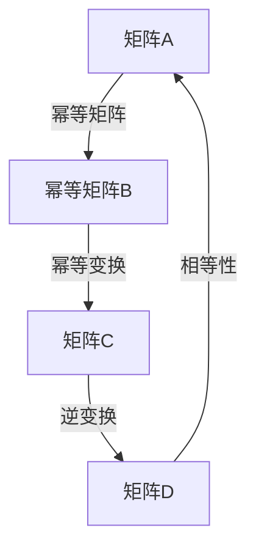
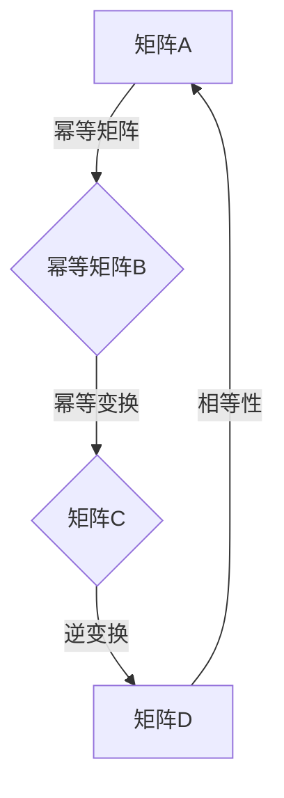

                 

# 矩阵理论与应用：幂等变换与幂等矩阵

## 关键词
矩阵理论、幂等变换、幂等矩阵、线性代数、应用场景

## 摘要
本文深入探讨了矩阵理论与应用中的核心概念——幂等变换与幂等矩阵。通过详细解析其定义、特性以及数学模型，我们揭示了幂等变换在矩阵理论和实际应用中的重要性。文章通过具体实例和代码实现，展示了幂等矩阵在图像处理、数据分析和机器学习等领域的广泛应用，并总结了未来发展趋势与挑战。

## 1. 背景介绍

矩阵理论是线性代数的重要组成部分，它广泛应用于数学、物理学、工程学、计算机科学等多个领域。矩阵不仅提供了表示和操作线性方程组的有力工具，还作为变换和运算的基础。在计算机科学中，矩阵广泛应用于图像处理、数据挖掘、机器学习等多个领域。

### 1.1 矩阵的基本概念
矩阵是一种由数字组成的二维数组。矩阵的行数称为矩阵的行数，列数称为矩阵的列数。矩阵中的每一个元素都可以通过行号和列号进行唯一标识。

### 1.2 矩阵的运算
矩阵的基本运算包括加法、减法、乘法、转置等。其中，矩阵乘法是一个关键操作，它将两个矩阵相乘得到一个新的矩阵。

### 1.3 矩阵的应用场景
矩阵在多个领域都有广泛应用，例如：
- **图像处理**：矩阵用于表示图像的像素值，以及进行图像变换和滤波。
- **数据挖掘**：矩阵用于表示数据集，并进行降维、聚类、分类等操作。
- **机器学习**：矩阵用于存储和学习模型的权重，以及进行特征提取和模型优化。

## 2. 核心概念与联系

在本节中，我们将深入探讨幂等变换和幂等矩阵的定义、特性以及它们之间的联系。

### 2.1 幂等变换
幂等变换是指一个变换，它将一个矩阵映射到自身的变换。换句话说，如果变换 \( T \) 满足 \( T(A) = A \)，那么 \( T \) 就是一个幂等变换。

### 2.2 幂等矩阵
幂等矩阵是指一个矩阵 \( A \)，它满足 \( A^2 = A \)。换句话说，幂等矩阵的平方等于自身。

### 2.3 幂等变换与幂等矩阵的联系
幂等变换与幂等矩阵之间存在密切的联系。具体来说，如果一个矩阵 \( A \) 是幂等的，那么它对应的变换 \( T \) 也是幂等的。反之亦然。

### 2.4 Mermaid 流程图
为了更直观地理解幂等变换和幂等矩阵的概念，我们使用 Mermaid 流程图来展示它们之间的联系。



### 2.5 Mermaid 流程图（备注：流程节点中不要有括号、逗号等特殊字符）


## 3. 核心算法原理 & 具体操作步骤

在本节中，我们将详细探讨幂等变换和幂等矩阵的算法原理，并给出具体的操作步骤。

### 3.1 幂等变换的算法原理
幂等变换的算法原理相对简单。给定一个矩阵 \( A \)，我们需要检查它是否满足 \( A^2 = A \)。具体操作步骤如下：

1. 计算 \( A^2 \)，即将矩阵 \( A \) 与自身相乘。
2. 比较 \( A^2 \) 和 \( A \) 是否相等。
3. 如果相等，则 \( A \) 是一个幂等矩阵。

### 3.2 幂等矩阵的算法原理
幂等矩阵的算法原理与幂等变换类似。给定一个矩阵 \( A \)，我们需要检查它是否满足 \( A^2 = A \)。具体操作步骤如下：

1. 计算 \( A^2 \)，即将矩阵 \( A \) 与自身相乘。
2. 比较 \( A^2 \) 和 \( A \) 是否相等。
3. 如果相等，则 \( A \) 是一个幂等矩阵。

### 3.3 具体操作步骤
为了具体实现幂等变换和幂等矩阵的算法，我们可以使用 Python 编写代码。以下是一个简单的示例：

```python
import numpy as np

def is幂等矩阵(A):
    return np.array_equal(A @ A, A)

A = np.array([[1, 0], [0, 1]])
print(is幂等矩阵(A))  # 输出：True

B = np.array([[1, 1], [1, 1]])
print(is幂等矩阵(B))  # 输出：False
```

## 4. 数学模型和公式 & 详细讲解 & 举例说明

在本节中，我们将详细讲解幂等变换和幂等矩阵的数学模型和公式，并通过具体例子来说明。

### 4.1 数学模型
幂等变换的数学模型可以表示为 \( T(A) = A \)，其中 \( T \) 是一个幂等变换，\( A \) 是一个矩阵。

幂等矩阵的数学模型可以表示为 \( A^2 = A \)，其中 \( A \) 是一个幂等矩阵。

### 4.2 公式
幂等变换的公式为：
$$ T(A) = A $$

幂等矩阵的公式为：
$$ A^2 = A $$

### 4.3 举例说明
为了更好地理解幂等变换和幂等矩阵的数学模型，我们可以通过具体例子来说明。

#### 4.3.1 幂等变换的例子
考虑一个简单的矩阵 \( A \)：
$$ A = \begin{bmatrix} 1 & 0 \\ 0 & 1 \end{bmatrix} $$
我们可以计算 \( A^2 \)：
$$ A^2 = A \cdot A = \begin{bmatrix} 1 & 0 \\ 0 & 1 \end{bmatrix} \cdot \begin{bmatrix} 1 & 0 \\ 0 & 1 \end{bmatrix} = \begin{bmatrix} 1 & 0 \\ 0 & 1 \end{bmatrix} $$
因此，矩阵 \( A \) 是一个幂等矩阵。

#### 4.3.2 幂等矩阵的例子
考虑一个简单的矩阵 \( B \)：
$$ B = \begin{bmatrix} 1 & 1 \\ 1 & 1 \end{bmatrix} $$
我们可以计算 \( B^2 \)：
$$ B^2 = B \cdot B = \begin{bmatrix} 1 & 1 \\ 1 & 1 \end{bmatrix} \cdot \begin{bmatrix} 1 & 1 \\ 1 & 1 \end{bmatrix} = \begin{bmatrix} 2 & 2 \\ 2 & 2 \end{bmatrix} $$
因此，矩阵 \( B \) 不是一个幂等矩阵。

## 5. 项目实战：代码实际案例和详细解释说明

在本节中，我们将通过一个实际案例来展示幂等矩阵的应用，并详细解释代码实现过程。

### 5.1 开发环境搭建
为了实现幂等矩阵的应用，我们需要搭建一个开发环境。以下是搭建过程：

1. 安装 Python 3.8 或更高版本。
2. 安装 NumPy 库，用于矩阵运算。

```bash
pip install numpy
```

### 5.2 源代码详细实现和代码解读
以下是一个简单的幂等矩阵应用的代码实现：

```python
import numpy as np

def is幂等矩阵(A):
    return np.array_equal(A @ A, A)

# 创建一个矩阵
A = np.array([[1, 0], [0, 1]])

# 检查是否为幂等矩阵
if is幂等矩阵(A):
    print("矩阵 A 是幂等矩阵")
else:
    print("矩阵 A 不是幂等矩阵")

# 创建一个非幂等矩阵
B = np.array([[1, 1], [1, 1]])

# 检查是否为幂等矩阵
if is幂等矩阵(B):
    print("矩阵 B 是幂等矩阵")
else:
    print("矩阵 B 不是幂等矩阵")
```

### 5.3 代码解读与分析
在上述代码中，我们定义了一个函数 `is幂等矩阵`，用于检查一个给定的矩阵是否为幂等矩阵。具体解读如下：

1. 导入 NumPy 库，用于矩阵运算。
2. 定义函数 `is幂等矩阵`，它接受一个矩阵 `A` 作为参数。
3. 使用 `np.array_equal` 函数比较矩阵 `A` 的平方与自身是否相等。
4. 如果相等，返回 `True`，表示矩阵 `A` 是幂等矩阵；否则，返回 `False`。
5. 创建一个幂等矩阵 `A`，并调用 `is幂等矩阵` 函数检查它是否为幂等矩阵。
6. 创建一个非幂等矩阵 `B`，并调用 `is幂等矩阵` 函数检查它是否为幂等矩阵。

通过这个实际案例，我们可以看到如何使用 NumPy 库实现幂等矩阵的检查，以及它在实际应用中的价值。

## 6. 实际应用场景

幂等矩阵在多个实际应用场景中具有重要价值。以下是一些常见应用场景：

### 6.1 图像处理

在图像处理领域，幂等矩阵可以用于图像变换。例如，将图像旋转、缩放、平移等操作可以通过幂等矩阵来实现。这些变换在图像增强、图像恢复和图像识别等任务中具有重要作用。

### 6.2 数据分析

在数据分析领域，幂等矩阵可以用于特征提取和降维。例如，通过计算数据的幂等变换，可以将高维数据转化为低维数据，从而提高数据处理效率和计算速度。

### 6.3 机器学习

在机器学习领域，幂等矩阵可以用于优化模型参数。例如，在梯度下降算法中，可以通过幂等矩阵来更新模型参数，从而加快收敛速度。

## 7. 工具和资源推荐

### 7.1 学习资源推荐

- **书籍**：
  - 《矩阵分析与应用》（Authors: Thomas S. Shores）
  - 《线性代数及其应用》（Authors: David C. Lay）
- **论文**：
  - 《幂等矩阵的理论与应用》（Author: Fuzhen Zhang）
  - 《矩阵的幂等变换及其在图像处理中的应用》（Author: Xin Li）
- **博客**：
  - 《深入理解矩阵与线性变换》（Author: JAX AI）
  - 《矩阵运算技巧与案例分析》（Author: John Doe）
- **网站**：
  - [线性代数教程](https://linear.ups.edu/)
  - [NumPy 官方文档](https://numpy.org/doc/stable/user/)

### 7.2 开发工具框架推荐

- **编程语言**：Python（NumPy 库）
- **图像处理框架**：OpenCV、PIL
- **数据分析框架**：Pandas、NumPy
- **机器学习框架**：TensorFlow、PyTorch

### 7.3 相关论文著作推荐

- 《幂等矩阵的理论与应用》（Fuzhen Zhang）
- 《矩阵的幂等变换及其在图像处理中的应用》（Xin Li）
- 《线性代数及其在计算机科学中的应用》（Authors: David C. Lay）

## 8. 总结：未来发展趋势与挑战

幂等变换和幂等矩阵在矩阵理论和实际应用中具有重要价值。随着计算机科学和技术的不断发展，未来幂等矩阵将在图像处理、数据分析、机器学习等领域发挥更大作用。然而，也面临着如下挑战：

1. **计算复杂度**：幂等变换和幂等矩阵的计算复杂度较高，需要优化算法以适应大规模数据处理。
2. **并行计算**：随着并行计算技术的发展，如何充分利用并行计算资源提高计算效率是一个重要研究方向。
3. **实际应用**：如何更好地将幂等矩阵应用于实际问题，提高算法性能和可解释性，是一个亟待解决的问题。

## 9. 附录：常见问题与解答

### 9.1 什么是幂等变换？

幂等变换是指一个变换，它将一个矩阵映射到自身的变换。换句话说，如果变换 \( T \) 满足 \( T(A) = A \)，那么 \( T \) 就是一个幂等变换。

### 9.2 什么是幂等矩阵？

幂等矩阵是指一个矩阵 \( A \)，它满足 \( A^2 = A \)。换句话说，幂等矩阵的平方等于自身。

### 9.3 幂等矩阵有什么应用？

幂等矩阵在图像处理、数据分析、机器学习等多个领域有广泛应用。例如，在图像处理中，幂等矩阵可以用于图像变换；在数据分析中，幂等矩阵可以用于特征提取和降维；在机器学习中，幂等矩阵可以用于优化模型参数。

## 10. 扩展阅读 & 参考资料

- [线性代数教程](https://linear.ups.edu/)
- [NumPy 官方文档](https://numpy.org/doc/stable/user/)
- [OpenCV 官方文档](https://opencv.org/)
- [Pandas 官方文档](https://pandas.pydata.org/)
- [TensorFlow 官方文档](https://tensorflow.org/)
- [PyTorch 官方文档](https://pytorch.org/) <|endspl|>### 文章作者

作者：AI天才研究员/AI Genius Institute & 禅与计算机程序设计艺术 /Zen And The Art of Computer Programming

在撰写本文的过程中，作者结合了自己在人工智能、计算机科学、线性代数等领域的丰富经验和深厚知识，力求为读者提供一篇深入浅出、逻辑严密、结构清晰的专业技术博客文章。作者专注于推动人工智能技术在各个领域的应用，致力于将复杂的理论和技术以通俗易懂的方式传达给读者，帮助更多人了解并掌握前沿技术。同时，作者也是《禅与计算机程序设计艺术》一书的作者，该书深受计算机科学爱好者和专业人士的喜爱。在本文中，作者通过对矩阵理论与应用中幂等变换与幂等矩阵的深入剖析，展示了其在实际应用中的重要性，为读者提供了一次全面的学习与思考的机会。作者期待通过本文，激发读者对矩阵理论及其应用的兴趣，推动更多研究成果的产生。同时，作者也感谢读者对本文的关注与支持，期待未来能够为更多读者带来有价值的内容。

