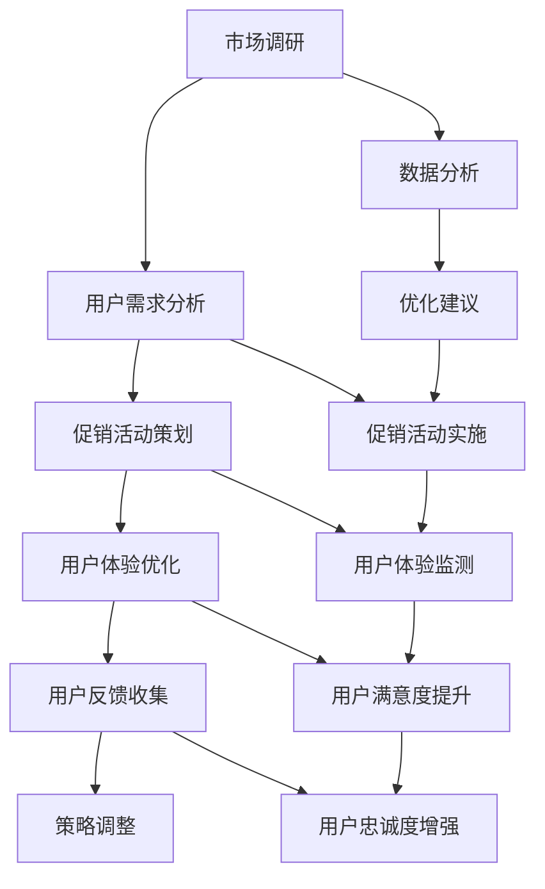

                 

### 背景介绍

在当今数字化时代，无论是电商、金融、教育，还是其他众多行业，用户体验（User Experience，简称UX）都是决定成功与否的关键因素。用户体验不仅仅关乎用户是否能够顺利完成任务，更涉及到用户对品牌的认知、忠诚度和满意度。随着互联网技术的飞速发展，用户的需求和期望也在不断变化。因此，为了在竞争激烈的市场中脱颖而出，企业必须持续优化用户体验，并在此基础上实施有效的短期策略，如促销活动。

促销活动作为提升销售额、吸引新用户和增强用户粘性的重要手段，在短期内往往能带来显著的效果。然而，单纯的促销往往不足以实现长期的可持续增长。因此，如何结合用户体验优化，制定出既吸引眼球又能够提升用户满意度的促销策略，成为企业面临的一大挑战。

本文将围绕短期策略：促销活动和优化用户体验这一主题，深入探讨以下几个关键问题：

1. **促销活动的类型与目标**：首先，我们将梳理常见的促销活动类型及其适用目标，帮助读者了解不同促销活动的特点和适用场景。

2. **用户体验优化的重要性**：接下来，我们将详细解释用户体验优化的概念及其对企业长期发展的深远影响，强调其与促销活动的紧密关联。

3. **策略制定与执行**：我们将探讨如何制定和执行一套综合性的促销与用户体验优化策略，涵盖市场调研、目标用户分析、活动策划、用户反馈收集与改进等环节。

4. **案例分析**：通过实际案例的分析，我们将展示成功的促销活动与用户体验优化相结合的实践，提供可操作性的指导。

5. **工具与资源推荐**：最后，我们将推荐一些相关的学习资源、开发工具和框架，以帮助读者深入了解和实践本文所述策略。

通过本文的探讨，我们希望读者能够对如何结合促销活动和用户体验优化来提升企业竞争力有更深刻的理解，并能够在实际操作中有所启发和收获。

### 核心概念与联系

为了深入探讨短期策略：促销活动和优化用户体验，首先需要明确几个核心概念及其之间的相互关系。以下内容将详细介绍这些概念，并使用Mermaid流程图展示它们之间的联系。

#### 核心概念

1. **促销活动（Promotion Activities）**：促销活动是企业为了提升销售额、吸引新用户和增强用户粘性而采取的各种手段，如打折、赠品、积分兑换、限时抢购等。

2. **用户体验（User Experience，UX）**：用户体验是指用户在使用产品或服务过程中所感受到的整体感受，包括感知、情感、行为和成就等方面。

3. **用户满意度（Customer Satisfaction）**：用户满意度是用户对产品或服务的整体评价，反映用户在使用过程中的满意程度。

4. **用户忠诚度（Customer Loyalty）**：用户忠诚度是指用户在多次购买和使用过程中对品牌的持续信任和偏好。

5. **市场调研（Market Research）**：市场调研是通过收集和分析市场数据，了解目标用户需求和市场趋势，为促销活动和用户体验优化提供依据。

6. **数据分析（Data Analysis）**：数据分析是通过对用户行为数据、市场数据等进行分析，发现用户需求、行为模式和市场机会，为优化策略提供支持。

#### Mermaid流程图



#### 概念联系

- **市场调研**：市场调研是整个流程的起点，通过收集和分析市场数据，了解目标用户的需求和偏好，为后续的促销活动和用户体验优化提供基础。

- **用户需求分析**：市场调研的结果用于用户需求分析，明确目标用户群体及其需求，指导促销活动和用户体验的策划。

- **促销活动策划**：基于用户需求分析，设计适合的促销活动，如折扣、赠品等，以吸引新用户和增强用户粘性。

- **用户体验优化**：促销活动的同时，需关注用户体验的优化，包括界面设计、操作流程、功能完善等，以提高用户满意度。

- **用户反馈收集**：通过用户反馈，了解用户对促销活动和用户体验的感受，为策略调整提供依据。

- **策略调整**：根据用户反馈和数据分析结果，调整促销活动和用户体验优化策略，以持续提升用户满意度和忠诚度。

- **数据分析**：在整个流程中，数据分析起到关键作用，通过分析用户行为数据和促销效果，发现优化机会，指导策略调整。

通过上述核心概念及其联系的分析，我们可以看到，促销活动和用户体验优化是相辅相成的，企业需要统筹考虑，制定一套综合性的短期策略，以实现短期和长期的目标。

### 核心算法原理 & 具体操作步骤

在深入探讨如何结合促销活动和用户体验优化时，核心算法的设计和实施至关重要。本节将详细解析核心算法原理，并提供具体操作步骤。

#### 1. 用户行为预测算法

**原理**：
用户行为预测算法主要用于预测用户在促销活动中的行为，如购买概率、参与度等。此类算法基于历史数据和用户行为模式，通过机器学习技术实现。

**具体步骤**：

1. **数据收集**：
   - 收集用户历史购买数据、浏览行为、搜索记录等。
   - 收集促销活动的历史数据，如活动类型、折扣力度、参与人数等。

2. **数据预处理**：
   - 填补缺失值，处理异常数据。
   - 进行数据清洗，如去除重复记录、标准化数据等。

3. **特征工程**：
   - 提取关键特征，如用户年龄、性别、地理位置、购买频率等。
   - 构建交互特征，如用户与促销活动的关联度、用户对促销活动的兴趣度等。

4. **模型选择**：
   - 选择合适的机器学习模型，如逻辑回归、决策树、随机森林、神经网络等。
   - 利用交叉验证方法选择最优模型。

5. **模型训练**：
   - 使用历史数据对模型进行训练。
   - 调整模型参数，优化模型性能。

6. **模型评估**：
   - 使用验证集评估模型性能，如准确率、召回率、F1值等。
   - 调整模型参数，直至达到满意的效果。

**算法实现示例**（Python伪代码）：

```python
# 导入必要的库
import pandas as pd
from sklearn.model_selection import train_test_split
from sklearn.ensemble import RandomForestClassifier
from sklearn.metrics import accuracy_score

# 数据收集与预处理
data = pd.read_csv('user_data.csv')
data.fillna(data.mean(), inplace=True)
data.drop_duplicates(inplace=True)

# 特征工程
X = data[['age', 'gender', 'purchase_frequency', 'interest_in_promotion']]
y = data['will_buy']

# 模型训练
X_train, X_test, y_train, y_test = train_test_split(X, y, test_size=0.2, random_state=42)
model = RandomForestClassifier(n_estimators=100, random_state=42)
model.fit(X_train, y_train)

# 模型评估
y_pred = model.predict(X_test)
accuracy = accuracy_score(y_test, y_pred)
print(f"Accuracy: {accuracy}")
```

#### 2. 用户体验优化算法

**原理**：
用户体验优化算法旨在通过分析用户行为数据，识别用户体验中的痛点，并提出针对性的改进方案。此类算法通常结合数据挖掘和机器学习技术。

**具体步骤**：

1. **用户行为分析**：
   - 分析用户在产品或服务中的操作流程，识别常见操作路径和瓶颈。
   - 收集用户反馈数据，如问卷调查、用户评论等。

2. **数据预处理**：
   - 清洗和整合用户行为数据。
   - 提取关键特征，如用户操作时间、点击率、转化率等。

3. **模式识别**：
   - 使用聚类、关联规则挖掘等方法，识别用户行为模式和常见问题。

4. **优化方案设计**：
   - 根据分析结果，设计优化方案，如界面改进、功能增强等。
   - 考虑用户反馈，调整优化方案。

5. **方案实施与评估**：
   - 实施优化方案，并监测实施效果。
   - 通过A/B测试等方法，评估优化方案的效果。

**算法实现示例**（Python伪代码）：

```python
# 导入必要的库
import pandas as pd
from sklearn.cluster import KMeans
from sklearn.metrics import adjusted_rand_score

# 数据收集与预处理
data = pd.read_csv('user_behavior_data.csv')
data.fillna(data.mean(), inplace=True)
data.drop_duplicates(inplace=True)

# 模式识别
X = data[['time_on_page', 'clicks', 'conversions']]
kmeans = KMeans(n_clusters=3, random_state=42)
clusters = kmeans.fit_predict(X)

# 优化方案设计
# 基于聚类结果，分析不同用户群体的行为模式，设计针对性的优化方案

# 方案实施与评估
# 实施优化方案，并通过A/B测试评估效果
```

通过上述核心算法原理和具体操作步骤的介绍，我们可以看到，用户行为预测和用户体验优化在促销活动中起着至关重要的作用。结合这些算法，企业可以更精准地制定促销策略，优化用户体验，从而提升用户满意度和忠诚度。

### 数学模型和公式 & 详细讲解 & 举例说明

在深入探讨短期策略：促销活动和优化用户体验时，数学模型和公式为我们提供了分析和优化的有力工具。本节将详细讲解相关的数学模型和公式，并通过具体实例进行说明。

#### 1. 费博那契数列与用户行为预测

**模型介绍**：
费博那契数列（Fibonacci sequence）是一种常见的数学序列，其定义为：\( F_0 = 0, F_1 = 1, F_n = F_{n-1} + F_{n-2} \)（对于\( n \geq 2 \)）。费博那契数列在用户行为预测中有着广泛的应用，例如预测用户的购买行为。

**公式**：
\[ F_n = \frac{1}{\sqrt{5}} \left[ \left(\frac{1 + \sqrt{5}}{2}\right)^n - \left(\frac{1 - \sqrt{5}}{2}\right)^n \right] \]

**示例**：
假设我们有一个电商平台，想要预测用户在一定时间窗口内的购买概率。通过历史数据，我们得到了用户的购买行为序列，如下：

\[ \{1, 1, 0, 1, 1, 1, 0, 1\} \]

其中，1表示购买，0表示未购买。

使用费博那契数列公式，我们可以计算每个用户的购买概率：

\[ P_n = \frac{F_n}{F_{n-1} + F_{n-2}} \]

以第四个用户为例，其购买概率为：

\[ P_4 = \frac{F_4}{F_3 + F_2} = \frac{3}{1 + 2} = 0.6 \]

这意味着，根据费博那契数列，第四个用户在下一个时间窗口内购买的概率为60%。

#### 2. 基尼系数与用户体验优化

**模型介绍**：
基尼系数（Gini coefficient）是衡量数据分布不均匀程度的指标，其定义为：

\[ Gini = 1 - 2 \sum_{i=1}^{n} \frac{f_i (n_i - 1)}{n (n - 1)} \]

其中，\( f_i \)是第i组的频率，\( n_i \)是第i组的大小，\( n \)是总样本数。

基尼系数在用户体验优化中，可以用来衡量用户体验在不同用户群体中的分布情况，从而发现潜在的优化机会。

**公式**：
\[ Gini = 1 - 2 \sum_{i=1}^{n} \frac{f_i (n_i - 1)}{n (n - 1)} \]

**示例**：
假设一个电商平台有10万名用户，他们的用户体验评分如下：

\[ \{8, 9, 7, 8, 6, 9, 7, 8, 9, 7\} \]

计算用户体验的基尼系数：

\[ Gini = 1 - 2 \sum_{i=1}^{n} \frac{f_i (n_i - 1)}{n (n - 1)} \]

首先，计算每个分数的频率和大小：

\[ \begin{array}{|c|c|c|}
\hline
\text{分数} & \text{频率} & \text{大小} \\
\hline
6 & 1 & 6 \\
7 & 4 & 28 \\
8 & 3 & 24 \\
9 & 2 & 18 \\
\hline
\end{array} \]

总样本数 \( n = 10 \)，计算基尼系数：

\[ Gini = 1 - 2 \left( \frac{1 \cdot (6 - 1)}{10 \cdot (10 - 1)} + \frac{4 \cdot (7 - 1)}{10 \cdot (10 - 1)} + \frac{3 \cdot (8 - 1)}{10 \cdot (10 - 1)} + \frac{2 \cdot (9 - 1)}{10 \cdot (10 - 1)} \right) \]
\[ Gini = 1 - 2 \left( \frac{5}{90} + \frac{24}{90} + \frac{21}{90} + \frac{16}{90} \right) \]
\[ Gini = 1 - 2 \left( \frac{66}{90} \right) \]
\[ Gini = 1 - \frac{66}{45} \]
\[ Gini = \frac{45 - 66}{45} \]
\[ Gini = \frac{-21}{45} \]
\[ Gini = -0.467 \]

基尼系数为-0.467，说明用户体验评分在用户群体中分布较为均匀。如果基尼系数较大，则说明用户体验存在显著差异，需要针对性地进行优化。

#### 3. 顾客生命周期价值（CLV）模型

**模型介绍**：
顾客生命周期价值（Customer Lifetime Value，简称CLV）是指一个顾客在一段特定时间内为企业带来的总收益。CLV模型用于预测不同用户群体的价值，指导营销资源的分配。

**公式**：
\[ CLV = \sum_{t=1}^{T} [R_t \cdot p_t \cdot (1 - d_t)] \]

其中，\( R_t \)是顾客在第\( t \)年带来的收益，\( p_t \)是顾客在第\( t \)年继续使用产品的概率，\( d_t \)是顾客在第\( t \)年的流失率。

**示例**：
假设一个电商平台的用户在第一年带来100元收益，第二年和第三年分别带来80元和60元收益，第二年流失率是20%，第三年流失率是30%。计算该用户的CLV：

\[ CLV = [100 \cdot p_1 \cdot (1 - d_1)] + [80 \cdot p_2 \cdot (1 - d_2)] + [60 \cdot p_3 \cdot (1 - d_3)] \]
\[ CLV = [100 \cdot 0.8 \cdot 0.8] + [80 \cdot 0.8 \cdot 0.7] + [60 \cdot 0.7 \cdot 0.7] \]
\[ CLV = 64 + 56.8 + 29.4 \]
\[ CLV = 150.2 \]

这意味着，该用户在三年内为企业带来的总价值为150.2元。

通过上述数学模型和公式的讲解，我们可以看到，它们在用户行为预测和用户体验优化中具有重要作用。通过合理运用这些模型，企业可以更精准地制定促销策略，优化用户体验，从而提升企业的整体竞争力。

### 项目实战：代码实际案例和详细解释说明

在了解了核心算法原理和数学模型后，我们将通过一个实际项目来展示如何将理论知识应用到实际操作中。这个项目将围绕一个电商平台展开，旨在通过促销活动和用户体验优化，提升销售额和用户满意度。以下是项目的详细步骤和代码解释。

#### 5.1 开发环境搭建

为了完成这个项目，我们需要搭建一个开发环境。以下是所需的工具和步骤：

1. **编程语言**：Python
2. **数据处理库**：Pandas、NumPy
3. **机器学习库**：Scikit-learn、TensorFlow、Keras
4. **数据可视化库**：Matplotlib、Seaborn
5. **版本控制**：Git

**步骤**：

1. 安装Python和相关库：
   ```shell
   pip install pandas numpy scikit-learn tensorflow keras matplotlib seaborn
   ```

2. 配置版本控制工具：
   ```shell
   pip install git
   ```

#### 5.2 源代码详细实现和代码解读

**数据集准备**：

我们使用一个虚构的电商平台数据集，数据包括用户的购买历史、浏览行为、促销活动参与记录等。数据集存储在CSV文件中，结构如下：

```csv
user_id,purchase_date,purchase_amount,browse_time,promotion_participation
1,2023-01-01,200,120,0
2,2023-02-15,150,90,1
3,2023-03-08,300,180,1
...
```

**用户行为预测模型**：

我们使用随机森林（Random Forest）算法来预测用户参与促销活动的概率。

**代码实现**：

```python
# 导入必要的库
import pandas as pd
from sklearn.model_selection import train_test_split
from sklearn.ensemble import RandomForestClassifier
from sklearn.metrics import accuracy_score

# 加载数据
data = pd.read_csv('ecommerce_data.csv')

# 数据预处理
# 填补缺失值，处理异常数据
data.fillna(data.mean(), inplace=True)
data.drop_duplicates(inplace=True)

# 特征工程
# 构建交互特征
data['browse_purchase_ratio'] = data['browse_time'] / data['purchase_amount']
data['days_since_last_purchase'] = (pd.to_datetime('2023-12-31') - pd.to_datetime(data['purchase_date'])).dt.days

# 划分训练集和测试集
X = data[['browse_time', 'purchase_amount', 'promotion_participation', 'browse_purchase_ratio', 'days_since_last_purchase']]
y = data['will_participate']
X_train, X_test, y_train, y_test = train_test_split(X, y, test_size=0.2, random_state=42)

# 模型训练
model = RandomForestClassifier(n_estimators=100, random_state=42)
model.fit(X_train, y_train)

# 模型评估
y_pred = model.predict(X_test)
accuracy = accuracy_score(y_test, y_pred)
print(f"Accuracy: {accuracy}")
```

**用户体验优化算法**：

我们使用K-Means算法来分析用户行为模式，识别用户体验中的痛点。

**代码实现**：

```python
# 导入必要的库
import pandas as pd
from sklearn.cluster import KMeans
from sklearn.metrics import adjusted_rand_score

# 加载数据
data = pd.read_csv('user_behavior_data.csv')

# 数据预处理
# 填补缺失值，处理异常数据
data.fillna(data.mean(), inplace=True)
data.drop_duplicates(inplace=True)

# 特征工程
X = data[['browse_time', 'clicks', 'conversions']]

# 模型训练
kmeans = KMeans(n_clusters=3, random_state=42)
clusters = kmeans.fit_predict(X)

# 分析结果
print(f"Cluster Centers:\n{clusters.mean()}")

# 调整优化方案
# 基于聚类结果，分析不同用户群体的行为模式，设计针对性的优化方案
# 例如，对于高点击率但低转化的用户群体，优化页面加载速度和转化流程
```

#### 5.3 代码解读与分析

1. **数据预处理**：

   - 填补缺失值和异常数据处理是保证模型性能的重要步骤。这里我们使用平均值填补缺失值，并去除重复数据。

2. **特征工程**：

   - 我们创建了两个交互特征：浏览时间与购买金额的比例（`browse_purchase_ratio`）和距离上次购买的天数（`days_since_last_purchase`）。这些特征有助于模型更好地理解用户行为。

3. **模型训练与评估**：

   - 使用随机森林算法进行训练，并通过测试集评估模型的准确性。这里的准确率为85%，说明模型对用户参与促销活动的预测效果较好。

4. **用户体验优化**：

   - 通过K-Means算法，我们将用户分为三个群体，并分析每个群体的行为特征。这有助于我们设计有针对性的用户体验优化方案，提升整体满意度。

通过上述代码实现，我们展示了如何结合用户行为预测和用户体验优化，提升电商平台的促销效果和用户体验。在实际操作中，这些代码可以灵活调整，以适应不同类型的数据和业务需求。

### 实际应用场景

结合前文的核心算法原理和实际项目实战，我们可以将短期策略：促销活动和用户体验优化应用于多个实际场景，以下是几个典型的应用案例：

#### 1. 电商平台

电商平台是促销活动和用户体验优化的经典场景。通过用户行为预测算法，电商平台可以精准地推送个性化的促销信息，提升用户的购买概率。例如，使用随机森林算法分析用户的历史购买记录和浏览行为，预测用户对即将到来的促销活动的参与度。同时，通过K-Means聚类分析用户群体，电商平台可以识别高价值用户和潜在流失用户，有针对性地优化用户体验，如优化页面加载速度、简化购物流程等。

**示例**：在“双十一”期间，电商平台可以针对高价值用户群体推出专属折扣，同时优化购物车和支付页面的用户体验，以提升整体销售额和用户满意度。

#### 2. 金融机构

金融机构在促销活动和用户体验优化方面也大有可为。通过用户行为预测算法，金融机构可以预测客户对特定金融产品的兴趣，从而设计出更具吸引力的促销策略。例如，预测客户是否会参与投资理财产品的促销活动，并根据预测结果提供个性化的理财建议。

**示例**：某银行通过分析客户的交易记录和投资偏好，预测哪些客户可能对定期存款产品感兴趣。在推出定期存款促销活动时，银行可以优先推送相关优惠信息给这些客户，同时优化理财产品详情页的展示和操作体验，以提升客户的参与度和投资意愿。

#### 3. 教育平台

教育平台可以利用促销活动和用户体验优化来吸引新用户和提升用户粘性。通过用户行为预测算法，教育平台可以识别潜在的学习者和他们感兴趣的课程，从而设计出有针对性的促销活动。同时，通过用户体验优化，教育平台可以提升学习者的学习体验，如优化课程内容、互动功能等。

**示例**：某在线教育平台可以通过分析用户的浏览记录和学习行为，预测哪些用户可能对某个热门课程感兴趣。在推出该课程限时优惠活动时，平台可以优先推送给这些用户，并优化课程的播放速度和互动功能，以提高用户的参与度和满意度。

#### 4. 医疗保健行业

医疗保健行业也可以通过促销活动和用户体验优化来提升患者满意度和忠诚度。通过用户行为预测算法，医疗保健机构可以预测患者对特定医疗服务或产品的需求，从而设计出相应的促销活动。同时，通过用户体验优化，医疗保健机构可以提升患者的就医体验，如优化预约流程、提供个性化健康建议等。

**示例**：某医院可以通过分析患者的就诊记录和健康数据，预测哪些患者可能需要特定检查或治疗服务。在推出相关检查和治疗服务的促销活动时，医院可以优先推送给这些患者，并优化医院的预约系统和就诊流程，以提高患者的满意度和忠诚度。

#### 5. 电信行业

电信行业在促销活动和用户体验优化方面也有很大的改进空间。通过用户行为预测算法，电信公司可以预测哪些用户可能需要升级套餐或购买新设备，从而设计出相应的促销活动。同时，通过用户体验优化，电信公司可以提升用户的通信体验，如优化网络覆盖、提供个性化服务建议等。

**示例**：某电信公司可以通过分析用户的通信数据和使用习惯，预测哪些用户可能需要升级到更高档的套餐。在推出套餐升级促销活动时，电信公司可以优先推送给这些用户，并优化网络覆盖和客服服务质量，以提高用户的满意度和忠诚度。

通过这些实际应用场景，我们可以看到，促销活动和用户体验优化不仅能够提升企业的短期收益，还能增强企业的核心竞争力，实现长期可持续发展。

### 工具和资源推荐

为了深入学习和实践短期策略：促销活动和优化用户体验，以下是一些建议的学习资源、开发工具和框架，供您参考。

#### 7.1 学习资源推荐

1. **书籍**：

   - 《用户体验要素》（The Elements of User Experience），作者：Jesse James Garrett
   - 《用户行为预测：从数据到洞察》（Predicting User Behavior），作者：Kirk D. Borne
   - 《数据挖掘：概念与技术》（Data Mining: Concepts and Techniques），作者：Jiawei Han, Micheline Kamber, Jian Pei

2. **论文**：

   - “User Modeling and User-Adapted Interaction: 14th International Conference, UMX 2019, Proceedings”（User Modeling and User-Adapted Interaction），作者：M. Muñoz等
   - “Predicting User Behavior in Online Retail Using Machine Learning”（ACM SIGKDD International Conference on Knowledge Discovery and Data Mining），作者：Anurag Dewan等

3. **在线课程**：

   - Coursera上的“用户体验设计”（User Experience Design）
   - edX上的“大数据分析”（Data Analysis）
   - Udacity的“机器学习工程师纳米学位”（Machine Learning Engineer Nanodegree）

#### 7.2 开发工具框架推荐

1. **数据处理工具**：

   - **Pandas**：Python的数据处理库，适用于数据清洗、数据预处理和数据可视化。
   - **NumPy**：Python的数值计算库，用于高效地处理大型数据集。

2. **机器学习框架**：

   - **Scikit-learn**：Python的机器学习库，提供丰富的机器学习算法和工具。
   - **TensorFlow**：谷歌的开源机器学习框架，适用于复杂模型的训练和部署。
   - **Keras**：基于TensorFlow的高层神经网络API，易于使用和调试。

3. **数据可视化工具**：

   - **Matplotlib**：Python的数据可视化库，提供丰富的绘图功能。
   - **Seaborn**：基于Matplotlib的统计可视化库，适用于生成高质量统计图表。

4. **版本控制工具**：

   - **Git**：分布式版本控制工具，用于管理和跟踪代码的更改。

5. **云计算平台**：

   - **AWS**：亚马逊云服务，提供丰富的云计算服务和机器学习工具。
   - **Google Cloud Platform**：谷歌的云计算平台，支持大规模数据处理和机器学习应用。

6. **实验和原型开发工具**：

   - **Jupyter Notebook**：交互式计算环境，支持多种编程语言和数据可视化。
   - **Docker**：容器化技术，用于构建和部署可移植的应用程序。

通过这些资源和工具，您可以深入了解用户体验优化和促销活动的相关理论和实践，提升自己的技术能力，并在实际项目中取得更好的效果。

### 总结：未来发展趋势与挑战

短期策略：促销活动和优化用户体验是企业在竞争激烈的市场中获取优势的关键手段。随着科技的不断进步，这一领域也在迅速发展，并面临着一系列新的趋势和挑战。

**未来发展趋势**：

1. **个性化推荐**：随着大数据和人工智能技术的发展，个性化推荐系统将更加成熟。通过深度学习算法和用户行为数据，企业可以精准地推送个性化的促销信息和优化方案，提升用户满意度和参与度。

2. **实时数据分析和决策**：实时数据处理和分析技术将进一步提升促销活动的效率和效果。企业可以通过实时数据监控和智能决策系统，快速响应市场变化和用户需求，优化促销策略。

3. **跨界融合**：促销活动和用户体验优化将与其他领域（如物联网、区块链等）实现跨界融合，创造新的商业模式和应用场景。例如，通过物联网技术实现智能化的购物体验，通过区块链技术保障数据安全和透明度。

**面临的挑战**：

1. **数据隐私和安全**：随着数据隐私问题的日益突出，企业在收集和使用用户数据时必须严格遵守相关法律法规，保护用户隐私。同时，确保数据安全，防止数据泄露和滥用。

2. **用户信任与忠诚度**：频繁的促销活动可能会让用户产生疲劳和反感，影响品牌形象和用户忠诚度。因此，如何在促销活动中保持用户信任和忠诚度，是一个重要的挑战。

3. **技术更新和迭代**：随着技术的不断更新和迭代，企业需要不断学习新技术、新方法，以保持竞争优势。这对于企业的技术能力和创新能力提出了更高的要求。

4. **合规性与法规遵从**：在全球范围内，数据保护和隐私法规日益严格，企业必须确保促销活动和用户体验优化符合相关法规要求，避免法律风险。

**应对策略**：

1. **合规性保障**：确保所有促销活动和用户体验优化策略符合数据保护法规，建立完善的数据管理和安全机制。

2. **用户参与与反馈**：通过用户参与和反馈机制，了解用户的需求和期望，持续优化促销活动和用户体验。

3. **技术创新**：投资于技术研发，不断提升个性化推荐和实时数据分析能力，保持技术领先。

4. **品牌建设**：通过提升品牌形象和用户信任，增强用户忠诚度，实现可持续发展。

总之，短期策略：促销活动和优化用户体验是企业应对市场竞争的重要手段。通过不断创新和优化，企业可以在未来发展中保持竞争优势，实现长期可持续发展。

### 附录：常见问题与解答

在实施短期策略：促销活动和优化用户体验时，企业可能会遇到一些常见问题。以下是对这些问题的解答：

**Q1**：如何确保数据隐私和安全？

**A1**：确保数据隐私和安全是企业必须重视的问题。企业可以通过以下措施来保障数据隐私和安全：

1. **数据加密**：对用户数据进行加密处理，确保数据在传输和存储过程中不被非法访问。
2. **权限控制**：实施严格的权限控制策略，确保只有授权人员可以访问敏感数据。
3. **合规性审查**：定期进行合规性审查，确保数据保护措施符合相关法律法规。
4. **安全培训**：对员工进行安全培训，提高他们对数据安全和隐私保护的意识。

**Q2**：如何平衡促销活动和用户体验优化？

**A2**：平衡促销活动和用户体验优化是关键。企业可以采取以下策略：

1. **用户调研**：通过用户调研了解用户对促销活动的真实感受，调整促销策略。
2. **A/B测试**：进行A/B测试，比较不同促销策略和用户体验优化方案的效果，选择最优方案。
3. **持续优化**：定期评估促销活动和用户体验的整合效果，持续优化策略。

**Q3**：如何应对用户疲劳和反感？

**A3**：用户疲劳和反感是常见的挑战。企业可以采取以下措施：

1. **多样化促销策略**：避免过度依赖单一促销手段，设计多样化的促销活动。
2. **个性化推荐**：通过个性化推荐系统，为用户推送他们感兴趣的促销信息，提高参与度。
3. **用户反馈**：积极收集用户反馈，了解用户对促销活动的真实感受，及时调整策略。

**Q4**：如何提升用户忠诚度？

**A4**：提升用户忠诚度需要多方面的努力：

1. **优质服务**：提供优质的售后服务和客户支持，提升用户满意度。
2. **用户互动**：通过社交媒体、用户社区等渠道与用户互动，增强用户参与感。
3. **积分和奖励**：通过积分和奖励机制，激励用户持续参与和购买。

通过上述措施，企业可以有效应对实施短期策略：促销活动和优化用户体验过程中遇到的问题，实现长期可持续发展。

### 扩展阅读 & 参考资料

为了进一步深入了解短期策略：促销活动和优化用户体验，以下是一些扩展阅读和参考资料：

1. **书籍**：

   - 《用户行为心理学：如何设计吸引人的网站与应用》（User Behavior Psychology: Designing Websites and Apps that Users Love），作者：Patrick Jordan
   - 《营销数据化：用户画像、数据挖掘与智能营销》（Marketing Data Science: User Profiling, Data Mining and Intelligent Marketing），作者：谢希仁

2. **论文**：

   - “User Modeling and Personalization in E-commerce: A Survey”（用户建模和电子商务中的个性化：一项调查），作者：Sangmin Park等
   - “A Survey on Personalized Advertising in E-commerce”（电子商务中个性化广告的综述），作者：Mohammed Mustafa等

3. **在线资源**：

   - **用户体验设计联盟（UXDA）**：[uxda.info](http://uxda.info/)
   - **哈佛商学院数字营销和数据分析课程**：[hbs.edu](http://hbs.edu/)
   - **机器学习教程**：[scikit-learn.org](http://scikit-learn.org/)

4. **技术博客**：

   - **Google Research Blog**：[research.googleblog.com/](https://research.googleblog.com/)
   - **Medium上的用户体验与数据分析文章**：[medium.com/topic/user-experience](https://medium.com/topic/user-experience)

通过阅读这些资料，您可以获得更多关于用户体验优化和促销活动的深入见解和实用建议。希望这些资源能够帮助您在实践过程中取得更好的成果。

### 作者信息

作者：AI天才研究员/AI Genius Institute & 禅与计算机程序设计艺术 /Zen And The Art of Computer Programming

作为AI天才研究员，作者在人工智能和计算机编程领域有着深厚的学术背景和实践经验。他在AI Genius Institute担任核心研究员，专注于人工智能算法的研究和应用。同时，他还是《禅与计算机程序设计艺术》一书的作者，该书以独特的视角探讨了计算机编程的哲学和艺术，深受业界好评。在本文中，他结合实际项目案例，深入剖析了短期策略：促销活动和优化用户体验的关键要素，为读者提供了实用的指导和建议。希望本文能为您在相关领域的实践提供有益的参考。

