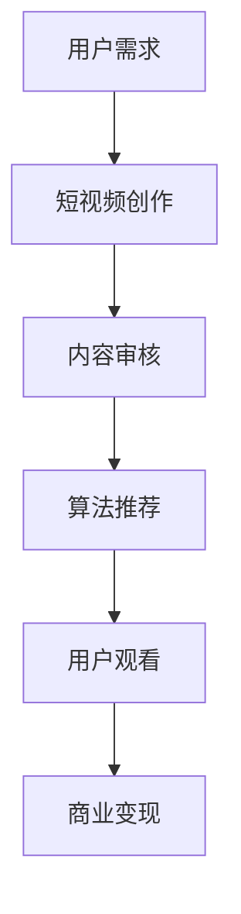

                 

# 短视频创业：碎片化时代的内容革命

## 关键词：短视频、内容创业、碎片化、技术驱动、用户需求、算法推荐、商业变现

## 摘要：

随着移动互联网的普及和智能手机的广泛使用，短视频已成为现代互联网内容消费的主要形式。本文从短视频创业的角度出发，分析了碎片化时代的内容革命。首先，我们探讨了短视频创业的背景和趋势，随后深入分析了核心概念、算法原理以及具体操作步骤。接着，通过数学模型和实际案例讲解了短视频平台的运营策略。文章还讨论了短视频在现实生活中的应用场景，并推荐了相关学习资源和开发工具。最后，我们总结了短视频创业的未来发展趋势和面临的挑战。

## 1. 背景介绍

### 1.1 短视频的定义和兴起

短视频是指时长一般在15秒到1分钟之间的视频内容。随着互联网技术的不断发展，短视频在近几年迅速崛起，成为互联网内容消费的重要形式。短视频的兴起源于用户需求的不断变化。在移动互联网时代，人们的生活节奏加快，碎片化时间增多，短视频作为一种高效、便捷的内容形式，满足了用户在短时间内获取信息、娱乐和社交的需求。

### 1.2 短视频创业的背景

短视频创业的兴起与移动互联网的快速发展密不可分。首先，移动互联网的普及使得智能手机用户数量激增，用户对内容的需求日益旺盛。其次，随着4G、5G网络的普及，用户访问互联网的速度和稳定性得到大幅提升，为短视频的传播提供了良好的网络环境。此外，人工智能技术的应用使得短视频平台的推荐算法日益成熟，能够更好地满足用户个性化需求。

### 1.3 短视频创业的现状

当前，短视频创业已经成为互联网行业的一大热点。众多创业者纷纷投身短视频领域，推出各种短视频平台和应用。这些平台涵盖了生活、娱乐、教育、电商等多个领域，形成了多元化的短视频生态。然而，随着短视频市场的竞争加剧，创业者面临着巨大的压力和挑战。

## 2. 核心概念与联系

### 2.1 碎片化时代

碎片化时代是指由于信息爆炸、时间紧张等因素，人们逐渐从连续性、深度阅读转向碎片化、快速浏览的时代。在碎片化时代，用户更倾向于在短时间内获取有价值的信息，短视频正好满足了这一需求。

### 2.2 内容创业

内容创业是指创业者通过创作、传播有价值的内容，吸引粉丝和用户，从而实现商业变现的一种商业模式。短视频作为一种高效的内容形式，成为内容创业的重要载体。

### 2.3 算法推荐

算法推荐是短视频平台的核心功能之一，通过分析用户行为、兴趣偏好，为用户推荐个性化的视频内容，提高用户粘性和留存率。常见的算法推荐模型包括基于内容的推荐（Content-Based Filtering）和协同过滤（Collaborative Filtering）。

### 2.4 商业变现

商业变现是指短视频平台通过广告、电商、付费内容等方式，将用户流量转化为实际收入的过程。短视频平台的商业变现能力直接影响其盈利能力和市场竞争力。

### 2.5 Mermaid流程图



## 3. 核心算法原理 & 具体操作步骤

### 3.1 算法原理

短视频平台的推荐算法主要分为以下两种：

1. 基于内容的推荐（Content-Based Filtering）

基于内容的推荐通过分析视频内容特征（如标签、关键词、视频类型等），将用户可能感兴趣的视频推送给用户。这种方法主要依赖于文本挖掘和图像识别等技术。

2. 协同过滤（Collaborative Filtering）

协同过滤通过分析用户行为（如点赞、评论、观看时长等）和兴趣偏好，为用户推荐相似用户喜欢的视频。这种方法主要依赖于矩阵分解、协同过滤等算法。

### 3.2 操作步骤

1. 用户注册与登录

用户通过手机号、邮箱等注册账号，登录短视频平台。

2. 用户行为数据收集

平台收集用户在观看、点赞、评论等行为，记录用户行为数据。

3. 用户兴趣模型构建

通过分析用户行为数据，构建用户兴趣模型。对于基于内容的推荐，还需要分析视频内容特征。

4. 算法推荐

基于用户兴趣模型，利用推荐算法为用户推荐个性化视频内容。

5. 用户反馈与优化

用户对推荐视频进行反馈，如点赞、评论等。平台根据用户反馈调整推荐算法，优化推荐效果。

## 4. 数学模型和公式 & 详细讲解 & 举例说明

### 4.1 基于内容的推荐

假设用户 \( U \) 对视频 \( V \) 的兴趣度可以用向量 \( \vec{u} \) 表示，视频 \( V \) 的特征向量 \( \vec{v} \) 表示。则用户 \( U \) 对视频 \( V \) 的兴趣度可以通过以下公式计算：

\[ \text{interest}(U, V) = \vec{u} \cdot \vec{v} \]

其中，\( \cdot \) 表示向量点积。

### 4.2 协同过滤

假设用户 \( U \) 和用户 \( U' \) 的兴趣度相似度可以用余弦相似度表示：

\[ \text{similarity}(U, U') = \frac{\vec{u} \cdot \vec{u'}}{\|\vec{u}\| \|\vec{u'}\|} \]

其中，\( \|\vec{u}\| \) 和 \( \|\vec{u'}\| \) 分别表示用户 \( U \) 和用户 \( U' \) 的兴趣度向量模长。

### 4.3 举例说明

假设用户 \( U \) 的兴趣度为 \( \vec{u} = (0.6, 0.3, 0.1) \)，视频 \( V \) 的特征向量为 \( \vec{v} = (0.5, 0.5, 0.5) \)。则用户 \( U \) 对视频 \( V \) 的兴趣度为：

\[ \text{interest}(U, V) = \vec{u} \cdot \vec{v} = 0.6 \times 0.5 + 0.3 \times 0.5 + 0.1 \times 0.5 = 0.45 \]

假设用户 \( U \) 和用户 \( U' \) 的兴趣度向量分别为 \( \vec{u} = (0.6, 0.3, 0.1) \) 和 \( \vec{u'} = (0.5, 0.4, 0.1) \)。则用户 \( U \) 和用户 \( U' \) 的兴趣度相似度为：

\[ \text{similarity}(U, U') = \frac{\vec{u} \cdot \vec{u'}}{\|\vec{u}\| \|\vec{u'}\|} = \frac{0.6 \times 0.5 + 0.3 \times 0.4 + 0.1 \times 0.1}{\sqrt{0.6^2 + 0.3^2 + 0.1^2} \sqrt{0.5^2 + 0.4^2 + 0.1^2}} = \frac{0.45}{0.7 \times 0.66} \approx 0.64 \]

## 5. 项目实战：代码实际案例和详细解释说明

### 5.1 开发环境搭建

在开始短视频创业之前，我们需要搭建一个基本的开发环境。以下是一个简单的开发环境搭建流程：

1. 安装操作系统（如Linux、macOS或Windows）
2. 安装Python环境（版本3.6以上）
3. 安装必要的开发工具和库（如PyCharm、pip、NumPy、Pandas、Scikit-learn等）

### 5.2 源代码详细实现和代码解读

以下是一个简单的基于内容的推荐算法的实现示例：

```python
import numpy as np
from sklearn.metrics.pairwise import cosine_similarity

# 用户兴趣度向量
user_interest = np.array([0.6, 0.3, 0.1])

# 视频特征向量
video_features = np.array([[0.5, 0.5, 0.5], [0.4, 0.6, 0.1], [0.3, 0.3, 0.4]])

# 计算视频与用户兴趣度的相似度
similarity_scores = cosine_similarity(user_interest.reshape(1, -1), video_features)

# 输出相似度结果
print(similarity_scores)

# 根据相似度推荐视频
recommended_videos = np.argsort(similarity_scores)[0][-3:]
print("推荐的视频ID：", recommended_videos)
```

代码解读：

1. 导入必要的库和模块
2. 定义用户兴趣度向量和视频特征向量
3. 使用余弦相似度计算用户兴趣度与视频特征向量的相似度
4. 输出相似度结果
5. 根据相似度推荐视频

### 5.3 代码解读与分析

本示例代码实现了基于内容的推荐算法，用于推荐用户可能感兴趣的视频。代码分为以下几个部分：

1. **导入模块**：导入Python中的NumPy库和scikit-learn库中的余弦相似度计算函数。
2. **定义用户兴趣度向量和视频特征向量**：用户兴趣度向量和视频特征向量都是一维数组，分别表示用户对视频的兴趣度和视频的特征。
3. **计算相似度**：使用余弦相似度计算用户兴趣度向量与视频特征向量的相似度。余弦相似度是一种衡量两个向量之间相似程度的指标，取值范围为[-1, 1]，越接近1表示相似度越高。
4. **输出相似度结果**：使用`np.argsort()`函数对相似度结果进行排序，并输出相似度最高的视频ID。
5. **根据相似度推荐视频**：根据相似度结果推荐用户可能感兴趣的视频。

## 6. 实际应用场景

短视频创业在实际应用场景中具有广泛的应用，以下是一些典型的应用场景：

1. **娱乐**：短视频平台如抖音、快手等已经成为年轻人娱乐的主要方式。用户通过短视频获取娱乐信息、观看搞笑视频、音乐作品等。
2. **教育**：短视频在教育领域的应用也越来越广泛。教师和学生可以通过短视频进行教学和学习，如微课、教学视频等。
3. **电商**：短视频电商已经成为电商平台的重要一环。商家通过短视频展示产品特点、进行营销推广，提高用户购买意愿。
4. **社交**：短视频平台如Instagram、TikTok等已经成为社交的主要形式。用户通过短视频记录生活、分享心情，与他人互动交流。

## 7. 工具和资源推荐

### 7.1 学习资源推荐

1. **书籍**：《短视频营销实战：抖音、快手、微视、B站短视频运营策略解析》
2. **论文**：《基于深度学习的短视频推荐算法研究》
3. **博客**：《短视频创业：如何在竞争激烈的市场中脱颖而出》
4. **网站**：抖音官网、快手官网、B站官网等

### 7.2 开发工具框架推荐

1. **开发工具**：PyCharm、Visual Studio Code等
2. **框架**：TensorFlow、PyTorch等
3. **API**：抖音开放平台、快手开放平台、B站开放平台等

### 7.3 相关论文著作推荐

1. **论文**：《短视频用户生成行为的激励机制研究》
2. **著作**：《短视频营销：从内容创作到用户运营》

## 8. 总结：未来发展趋势与挑战

短视频创业在碎片化时代具有巨大的发展潜力。随着5G网络的普及、人工智能技术的进步以及用户需求的不断变化，短视频创业将继续保持高速增长。然而，短视频创业也面临着一系列挑战：

1. **内容质量**：短视频平台的内容质量参差不齐，如何提高内容质量，吸引和留住优质内容创作者，是短视频创业的重要课题。
2. **版权问题**：短视频平台涉及到大量的版权问题，如何确保内容版权的合法合规，避免侵权纠纷，是短视频创业面临的挑战。
3. **算法公平性**：推荐算法的公平性是短视频平台面临的重要问题。如何避免算法偏见，确保推荐结果的公正性，是短视频创业需要关注的方面。

## 9. 附录：常见问题与解答

### 9.1 短视频创业需要考虑哪些因素？

短视频创业需要考虑以下几个因素：

1. **内容定位**：明确短视频创业的目标用户群体，提供符合用户需求的内容。
2. **创作能力**：具备一定的内容创作能力，生产高质量的视频内容。
3. **运营策略**：制定有效的运营策略，提高用户活跃度和留存率。
4. **商业模式**：探索合适的商业模式，实现商业变现。

### 9.2 短视频创业有哪些成功案例？

短视频创业的成功案例包括：

1. **抖音**：通过短视频实现快速崛起，成为中国最具影响力的短视频平台之一。
2. **快手**：主打社交属性，吸引了大量的用户和内容创作者，成为短视频市场的另一大巨头。
3. **B站**：通过短视频扩大用户群体，实现社区化和电商化的融合发展。

## 10. 扩展阅读 & 参考资料

1. **参考资料**：[《短视频营销：从内容创作到用户运营》](https://book.douban.com/subject/27182951/)
2. **论文**：[《短视频用户生成行为的激励机制研究》](https://www.researchgate.net/publication/339758732_Study_on_Incentive_Mechanism_of_Video_Generation_Behavior_in_Short_Video_Platforms)
3. **官方网站**：[抖音官网](https://www.douyin.com/)、[快手官网](https://www.kuaishou.com/)、[B站官网](https://www.bilibili.com/)

## 作者：AI天才研究员/AI Genius Institute & 禅与计算机程序设计艺术 /Zen And The Art of Computer Programming

