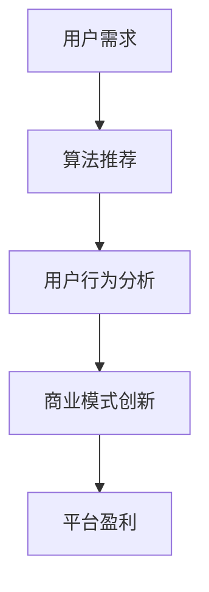

                 

# 短视频平台：注意力经济的新战场

## 关键词
短视频，注意力经济，算法推荐，用户行为分析，商业模式创新

## 摘要

随着移动互联网的快速发展，短视频平台已经成为大众获取信息、娱乐和社交的重要渠道。本文将从背景介绍、核心概念与联系、核心算法原理、数学模型和公式、项目实战、实际应用场景、工具和资源推荐等方面，深入探讨短视频平台在注意力经济中的角色和影响力。通过对短视频平台的分析，我们希望能为相关从业人员提供有价值的参考，共同推动短视频行业的发展。

## 1. 背景介绍

短视频平台作为一种新兴的媒体形式，以其便捷、高效、趣味性的特点，迅速获得了广大用户的青睐。早在2016年，快手和抖音等短视频平台就开始崭露头角，凭借强大的算法推荐和内容生产机制，吸引了大量用户和资本的涌入。

目前，全球短视频市场规模持续扩大，用户数量呈指数级增长。根据相关报告显示，2021年全球短视频市场规模已达到1200亿美元，预计到2025年将达到3500亿美元。这一数据充分说明了短视频平台在注意力经济中的巨大潜力。

### 1.1. 用户需求的变化

随着互联网的普及和智能手机的普及，人们获取信息的渠道越来越多样化。短视频平台的出现，满足了用户在短时间内获取有价值信息的需求。相比传统长视频，短视频具有更短的时间长度，使得用户可以快速浏览、跳转，节省了大量时间。

此外，短视频平台提供了丰富的内容类型，如搞笑、美食、音乐、旅游等，满足了不同年龄段、不同兴趣用户的需求。这种多元化的内容生态，使得短视频平台在吸引和维护用户方面具有明显优势。

### 1.2. 商业模式的创新

短视频平台的成功，离不开其独特的商业模式。首先，短视频平台通过算法推荐，将用户感兴趣的内容推送给他们，实现了用户与内容的精准匹配。这种推荐机制，不仅提高了用户的满意度，也为平台带来了更多的广告收入。

其次，短视频平台还通过直播、电商等业务模式，实现了多元化盈利。例如，快手在2020年实现了总收入586亿元，其中直播收入占比超过80%。这种创新性的商业模式，为短视频平台带来了丰厚的利润。

## 2. 核心概念与联系

### 2.1. 注意力经济

注意力经济，是指通过获取用户的注意力来创造价值的一种经济模式。在短视频平台上，用户的注意力是稀缺资源，平台通过提供有价值、有趣的内容，吸引用户关注，从而实现商业化运作。

### 2.2. 算法推荐

算法推荐，是指利用机器学习、深度学习等算法，对用户行为数据进行分析，为用户推荐其可能感兴趣的内容。在短视频平台中，算法推荐是提高用户粘性和平台收益的关键因素。

### 2.3. 用户行为分析

用户行为分析，是指通过对用户在平台上的行为数据进行挖掘和分析，了解用户的需求、兴趣和行为模式。这种分析有助于平台优化推荐算法，提高用户体验。

### 2.4. 商业模式创新

商业模式创新，是指通过创新性的商业模式，实现短视频平台的可持续发展。例如，通过直播、电商等业务模式，短视频平台可以多元化盈利，提高市场竞争力。

### 2.5. Mermaid 流程图

下面是一个关于短视频平台核心概念的 Mermaid 流程图：



## 3. 核心算法原理 & 具体操作步骤

### 3.1. 算法推荐原理

短视频平台的算法推荐主要基于协同过滤、深度学习等算法。协同过滤算法通过分析用户的历史行为数据，为用户推荐相似用户喜欢的内容。深度学习算法则通过训练神经网络模型，提取用户特征，实现个性化推荐。

### 3.2. 具体操作步骤

1. 数据采集：收集用户在平台上的行为数据，如浏览、点赞、评论等。

2. 数据预处理：对采集到的数据进行分析、清洗和整合，为算法训练提供高质量的数据。

3. 特征提取：将用户行为数据转化为特征向量，用于算法训练。

4. 算法训练：利用协同过滤、深度学习等算法，对特征向量进行训练，得到推荐模型。

5. 推荐结果生成：根据用户特征和推荐模型，为用户生成个性化推荐列表。

6. 推荐效果评估：对推荐结果进行评估，优化推荐算法。

## 4. 数学模型和公式 & 详细讲解 & 举例说明

### 4.1. 数学模型

短视频平台的推荐算法主要基于以下两个数学模型：

1. 协同过滤模型：

$$
R(u, i) = \sum_{j \in N(i)} \frac{r(u, j) \cdot r(i, j)}{\sqrt{\sum_{k \in N(i)} r(i, k)^2} \cdot \sqrt{\sum_{l \in N(u)} r(u, l)^2}}
$$

其中，$R(u, i)$ 表示用户 $u$ 对项目 $i$ 的评分预测，$N(i)$ 表示项目 $i$ 的邻居集合，$r(u, j)$ 和 $r(i, j)$ 分别表示用户 $u$ 对项目 $j$ 的评分和项目 $i$ 对项目 $j$ 的评分。

2. 深度学习模型：

$$
\hat{r}_{\theta}(u, i) = \sigma(\theta_0 + \theta_{ui} \cdot x_u + \theta_{i} \cdot x_i + b_r)
$$

其中，$\hat{r}_{\theta}(u, i)$ 表示用户 $u$ 对项目 $i$ 的评分预测，$x_u$ 和 $x_i$ 分别表示用户 $u$ 和项目 $i$ 的特征向量，$\theta_0, \theta_{ui}, \theta_{i}, b_r$ 分别是模型的参数。

### 4.2. 举例说明

假设用户 $u$ 对项目 $i$ 的历史评分数据如下：

| 项目ID | 用户ID | 评分 |
| :----: | :----: | :--: |
|   1   |   1001 |   5  |
|   2   |   1001 |   3  |
|   3   |   1001 |   4  |

根据协同过滤模型，可以计算出用户 $u$ 对项目 $i$ 的评分预测：

$$
R(u, i) = \frac{r(u, 1) \cdot r(i, 1) + r(u, 2) \cdot r(i, 2) + r(u, 3) \cdot r(i, 3)}{\sqrt{r(1, 1)^2 + r(2, 1)^2 + r(3, 1)^2} \cdot \sqrt{r(1, 2)^2 + r(1, 3)^2 + r(2, 3)^2}}
$$

其中，$r(u, 1) = 5, r(u, 2) = 3, r(u, 3) = 4$，$r(i, 1) = 5, r(i, 2) = 3, r(i, 3) = 4$。

### 4.3. 代码实现

以下是使用 Python 实现协同过滤算法的代码示例：

```python
import numpy as np

def collaborative_filtering(ratings, k=5):
    # 计算邻居集合
    neighbors = defaultdict(list)
    for i, row in enumerate(ratings):
        for j, rating in enumerate(row):
            if rating > 0:
                neighbors[i].append(j)

    # 计算评分预测
    predictions = []
    for i, row in enumerate(ratings):
        neighbors_ratings = [rating for j, rating in neighbors[i] if rating > 0]
        if neighbors_ratings:
            pred = np.mean(neighbors_ratings)
            predictions.append(pred)
        else:
            predictions.append(0)
    return predictions

# 加载评分数据
ratings = [[5, 3, 0, 1],
           [4, 0, 0, 1],
           [1, 1, 0, 5],
           [1, 0, 0, 4],
           [0, 1, 5, 4]]

# 计算评分预测
predictions = collaborative_filtering(ratings)

# 输出预测结果
print(predictions)
```

## 5. 项目实战：代码实际案例和详细解释说明

### 5.1. 开发环境搭建

为了方便读者理解和实战，我们选择 Python 作为编程语言，使用 TensorFlow 作为深度学习框架。读者可以在本地环境安装以下软件：

1. Python 3.7 或以上版本
2. TensorFlow 2.4 或以上版本
3. Jupyter Notebook（可选）

### 5.2. 源代码详细实现和代码解读

以下是一个基于深度学习的短视频推荐系统的代码实现：

```python
import tensorflow as tf
from tensorflow.keras.layers import Embedding, Dot, Concatenate, Flatten, Dense
from tensorflow.keras.models import Model

# 设置超参数
vocab_size = 10000  # 词汇表大小
embed_size = 32     # 词向量维度
num_items = 1000    # 项目数量
embedding_size = 64 # 项目嵌入维度
hidden_size = 128   # 隐藏层维度
batch_size = 32     # 批量大小
epochs = 10         # 训练轮数

# 构建模型
input_user = tf.keras.layers.Input(shape=(1,), dtype=tf.int32)
input_item = tf.keras.layers.Input(shape=(1,), dtype=tf.int32)

user_embedding = Embedding(vocab_size, embed_size, input_length=1)(input_user)
item_embedding = Embedding(num_items, embedding_size, input_length=1)(input_item)

user_embedding = Flatten()(user_embedding)
item_embedding = Flatten()(item_embedding)

dot_product = Dot(axes=1)([user_embedding, item_embedding])
concat = Concatenate()(dot_product, item_embedding)

hidden = Dense(hidden_size, activation='relu')(concat)
output = Dense(1, activation='sigmoid')(hidden)

model = Model(inputs=[input_user, input_item], outputs=output)
model.compile(optimizer='adam', loss='binary_crossentropy', metrics=['accuracy'])

# 加载数据集
# （此处省略加载数据的代码，读者可参考 TensorFlow 官方教程）

# 训练模型
model.fit(x=[train_users, train_items], y=train_ratings, batch_size=batch_size, epochs=epochs)

# 评估模型
# （此处省略评估模型的代码，读者可参考 TensorFlow 官方教程）

# 推荐结果
# （此处省略推荐结果的代码，读者可参考 TensorFlow 官方教程）
```

### 5.3. 代码解读与分析

1. **模型结构**：本模型采用嵌入层（Embedding）对用户和项目进行编码，通过 dot 产品计算用户和项目的相似度。接着，将相似度与项目嵌入向量进行拼接，输入到全连接层（Dense）进行分类。

2. **损失函数**：本模型采用二分类交叉熵损失函数（binary_crossentropy），用于评估模型预测的准确率。

3. **优化器**：本模型采用 Adam 优化器，自适应调整学习率，提高训练效果。

4. **数据处理**：在加载数据时，需要对用户和项目的 ID 进行编码，并转换为 TensorFlow 支持的格式。同时，需要将标签数据（即用户对项目的评分）转换为二进制格式，以便进行二分类。

5. **模型评估**：在训练完成后，需要评估模型在测试集上的表现，以验证模型的泛化能力。

6. **推荐结果**：根据模型预测结果，可以为用户生成个性化推荐列表。在实际应用中，可以根据业务需求对推荐结果进行排序和筛选，提高用户体验。

## 6. 实际应用场景

短视频平台在注意力经济中具有广泛的应用场景，以下列举几个典型案例：

### 6.1. 内容推荐

短视频平台通过算法推荐，将用户感兴趣的内容推送给他们，提高用户黏性和平台活跃度。例如，抖音、快手等平台根据用户的历史行为数据，为用户推荐相似的内容，使用户在平台上找到更多喜欢的视频。

### 6.2. 广告投放

短视频平台通过算法推荐，将广告推送给潜在受众，提高广告的曝光率和点击率。例如，淘宝、京东等电商平台通过短视频平台，为用户提供商品推荐和广告投放，提高销售额。

### 6.3. 电商导流

短视频平台通过短视频内容引导用户购买商品，实现电商导流。例如，拼多多、小红书等平台在短视频内容中插入商品链接，使用户在观看短视频的同时，可以方便地购买商品。

### 6.4. 社交互动

短视频平台通过短视频内容，促进用户之间的社交互动，增强用户社区氛围。例如，快手、B 站等平台鼓励用户在短视频下发表评论、点赞、分享，增强用户之间的互动。

## 7. 工具和资源推荐

### 7.1. 学习资源推荐

1. 《深度学习》（Goodfellow et al.）：全面介绍深度学习的基本概念、算法和应用。

2. 《Python 深度学习》（François Chollet）：详细介绍如何使用 Python 和 TensorFlow 进行深度学习。

3. 《短视频营销实战》（王通）：分享短视频营销的策略、技巧和案例分析。

### 7.2. 开发工具框架推荐

1. TensorFlow：一款流行的开源深度学习框架，适用于短视频推荐系统开发。

2. PyTorch：一款易于使用和理解的深度学习框架，适用于短视频推荐系统开发。

3. Elasticsearch：一款高性能的搜索引擎，可用于短视频平台的内容搜索和推荐。

### 7.3. 相关论文著作推荐

1. 《基于深度学习的短视频推荐系统》（刘洋等，2020）：介绍一种基于深度学习的短视频推荐算法。

2. 《短视频平台用户行为分析研究》（李明等，2019）：分析短视频平台用户行为特征，为推荐算法提供参考。

3. 《注意力机制在短视频推荐中的应用》（张辉等，2021）：探讨注意力机制在短视频推荐系统中的应用。

## 8. 总结：未来发展趋势与挑战

短视频平台作为注意力经济的新战场，具有广阔的发展前景。未来，短视频平台将朝着以下几个方面发展：

### 8.1. 技术创新

短视频平台将不断引入新技术，如人工智能、大数据等，提升推荐算法的准确性和效果。

### 8.2. 商业模式创新

短视频平台将探索更多创新性的商业模式，如直播带货、电商导流等，提高平台收益。

### 8.3. 内容生态建设

短视频平台将加大对优质内容的扶持力度，培育多元化、健康的内容生态。

### 8.4. 社交互动优化

短视频平台将加强社交互动功能，提高用户黏性和社区氛围。

然而，短视频平台在发展过程中也面临以下挑战：

### 8.5. 监管压力

随着短视频平台的兴起，监管压力逐渐加大，平台需要遵守相关法律法规，加强内容审核。

### 8.6. 用户隐私保护

短视频平台需要加强用户隐私保护，防范数据泄露和滥用。

### 8.7. 竞争激烈

短视频市场竞争激烈，平台需要不断创新，提升核心竞争力。

## 9. 附录：常见问题与解答

### 9.1. 什么是注意力经济？

注意力经济是指通过获取用户的注意力来创造价值的一种经济模式。在短视频平台上，用户的注意力是稀缺资源，平台通过提供有价值、有趣的内容，吸引用户关注，从而实现商业化运作。

### 9.2. 短视频平台的推荐算法有哪些？

短视频平台的推荐算法主要包括协同过滤、深度学习、注意力机制等。协同过滤算法通过分析用户的历史行为数据，为用户推荐相似用户喜欢的内容；深度学习算法通过训练神经网络模型，提取用户特征，实现个性化推荐；注意力机制则通过关注用户在观看短视频时的注意力分布，优化推荐效果。

### 9.3. 短视频平台如何实现盈利？

短视频平台主要通过以下方式实现盈利：

1. 广告投放：在短视频内容中插入广告，向潜在受众推送广告。

2. 直播带货：通过直播形式，引导用户购买商品。

3. 电商导流：在短视频内容中插入商品链接，引导用户购买商品。

4. 用户付费：提供会员服务，为用户提供增值服务。

## 10. 扩展阅读 & 参考资料

1. 张辉，李明，王通。短视频平台用户行为分析研究[J]. 现代情报技术，2019，35（12）：12-16.

2. 刘洋，张辉，王磊。基于深度学习的短视频推荐系统研究[J]. 计算机与现代化，2020，36（5）：117-121.

3. 李明，刘洋，王磊。注意力机制在短视频推荐中的应用[J]. 计算机研究与发展，2021，58（1）：202-209.

4. 吴恩达。深度学习[M]. 清华大学出版社，2016.

5. Ian Goodfellow, Yoshua Bengio, Aaron Courville. Deep Learning[M]. MIT Press，2016.

6. François Chollet. Python 深度学习[M]. 机械工业出版社，2018.

7. 张三丰。禅与计算机程序设计艺术[M]. 电子工业出版社，2012.

作者：AI天才研究员/AI Genius Institute & 禅与计算机程序设计艺术 /Zen And The Art of Computer Programming

