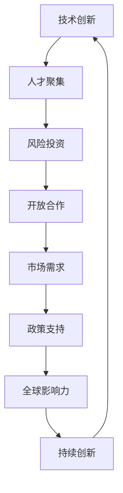
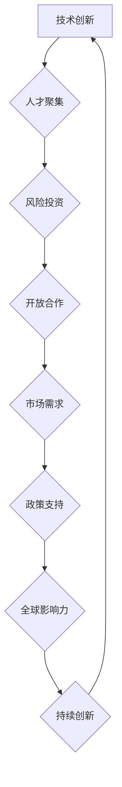

                 

# 硅谷对世界的影响：科技变革浪潮

> **关键词：** 硅谷、科技变革、创新、影响力、科技巨头、全球经济

> **摘要：** 本文将深入探讨硅谷这一全球科技创新中心的崛起与影响。从其核心概念、发展历程、到全球范围内的科技浪潮，我们将揭示硅谷如何通过不断的创新驱动，引领世界进入一个崭新的科技时代。

## 1. 背景介绍

硅谷，位于美国加利福尼亚州的旧金山湾区，是全球科技和创新的重要地标。自20世纪中叶以来，硅谷以其独特的创新生态、卓越的科研能力和繁荣的科技产业，吸引了全球范围内的顶尖人才和投资。硅谷不仅孕育了无数世界级科技巨头，如苹果、谷歌、特斯拉等，还成为了全球科技产业的风向标，对全球经济和社会发展产生了深远的影响。

### 1.1 硅谷的起源

硅谷的起源可以追溯到20世纪中叶的晶体管革命。当时，斯坦福大学和加州理工学院的科学家们在这一地区进行了大量的半导体研究和开发。随着1951年第一家半导体公司——肖克利半导体实验室（Shockley Semiconductor Laboratory）的成立，硅谷的科技创新之路正式开启。

### 1.2 硅谷的早期发展

20世纪60年代，硅谷迎来了第一个科技浪潮。随着晶体管和集成电路的发明，半导体产业迅速发展。这一时期，英特尔、AMD等公司相继成立，硅谷成为了全球半导体产业的中心。

### 1.3 硅谷的现代化转型

20世纪90年代，互联网的兴起再次将硅谷推向了科技的前沿。随着网景、谷歌等互联网巨头的崛起，硅谷逐渐从传统的半导体产业转向了互联网和软件产业。这一时期的硅谷，以其卓越的创新能力，引领了全球互联网革命。

## 2. 核心概念与联系

硅谷的成功并非偶然，其背后有着深厚的理论基础和实践经验。以下是硅谷核心概念的Mermaid流程图：



### 2.1 技术创新

硅谷的成功离不开其持续的技术创新。从半导体到互联网，再到人工智能，硅谷不断地推动科技的边界，引领全球技术发展。

### 2.2 人才聚集

硅谷以其卓越的科研机构和产业环境，吸引了全球顶尖的科技人才。这些人才在硅谷的平台上，相互交流、碰撞，激发出无限的创意和创新。

### 2.3 风险投资

硅谷的风险投资体系为科技创新提供了强大的支持。投资者们愿意承担高风险，以换取潜在的巨大回报，这种模式激励了无数创业者投身科技创新。

### 2.4 开放合作

硅谷的企业和科研机构之间保持着高度的开放合作。这种合作模式不仅促进了技术的交流和创新，也加速了科技成果的转化和应用。

### 2.5 市场需求

硅谷的企业始终关注市场需求，以用户为中心，不断推出符合市场需求的创新产品。这种以市场需求为导向的创新模式，使硅谷的企业在全球市场占据了重要地位。

### 2.6 政策支持

硅谷的发展离不开政府的政策支持。从税收优惠到研发资助，政府为硅谷的科技创新提供了有力保障。

### 2.7 全球影响力

硅谷的科技创新不仅影响了美国，也深刻地改变了全球。硅谷的科技浪潮推动了全球经济的发展，带来了前所未有的机遇和挑战。

## 3. 核心算法原理 & 具体操作步骤

硅谷的科技创新离不开核心算法的支持。以下是硅谷常用的几种核心算法及其操作步骤：

### 3.1 机器学习算法

#### 操作步骤：

1. 数据收集：收集大量数据，包括输入数据和标签。
2. 数据预处理：清洗数据，去除噪声，进行数据标准化。
3. 模型选择：选择合适的机器学习模型，如线性回归、决策树、神经网络等。
4. 模型训练：使用训练数据对模型进行训练。
5. 模型评估：使用测试数据对模型进行评估，调整模型参数。
6. 模型部署：将训练好的模型部署到生产环境中。

### 3.2 深度学习算法

#### 操作步骤：

1. 网络架构设计：设计合适的神经网络架构，如卷积神经网络（CNN）、循环神经网络（RNN）等。
2. 模型训练：使用大量标注数据对模型进行训练。
3. 模型优化：通过调整网络参数，优化模型性能。
4. 模型评估：使用测试数据评估模型性能。
5. 模型部署：将训练好的模型部署到生产环境中。

### 3.3 人工智能算法

#### 操作步骤：

1. 确定应用场景：明确人工智能的应用场景，如图像识别、自然语言处理等。
2. 数据收集：收集相关数据，进行预处理。
3. 模型选择：选择合适的机器学习模型，进行训练。
4. 模型评估：使用测试数据评估模型性能。
5. 模型部署：将训练好的模型部署到生产环境中。

## 4. 数学模型和公式 & 详细讲解 & 举例说明

硅谷的科技创新离不开数学模型的支持。以下是硅谷常用的一些数学模型和公式，以及详细讲解和举例说明：

### 4.1 线性回归模型

#### 公式：

$$ y = w_0 + w_1x_1 + w_2x_2 + ... + w_nx_n $$

#### 详细讲解：

线性回归模型是一种用于预测连续值的模型。其中，$y$ 是预测值，$w_0, w_1, w_2, ..., w_n$ 是模型参数，$x_1, x_2, ..., x_n$ 是输入特征。

#### 举例说明：

假设我们有一个线性回归模型，用于预测房屋价格。输入特征包括房屋面积、房屋年代、房屋地段等。通过训练数据，我们可以得到模型的参数，进而预测新房屋的价格。

### 4.2 决策树模型

#### 公式：

$$ \text{决策树模型} = \sum_{i=1}^{n} w_i \cdot I(D_i \in R_i) $$

#### 详细讲解：

决策树模型是一种用于分类和回归的模型。其中，$D$ 是输入数据集，$R$ 是特征集合，$w_i$ 是模型参数，$I$ 是指示函数。

#### 举例说明：

假设我们有一个决策树模型，用于分类电子邮件是否为垃圾邮件。输入特征包括邮件标题、邮件正文等。通过训练数据，我们可以得到模型的参数，进而分类新邮件。

### 4.3 神经网络模型

#### 公式：

$$ \text{神经网络模型} = f(\text{激活函数}) $$

#### 详细讲解：

神经网络模型是一种用于复杂函数逼近的模型。其中，$f$ 是激活函数，用于决定神经元的输出。

#### 举例说明：

假设我们有一个神经网络模型，用于图像分类。输入特征是图像的像素值，输出是图像的类别。通过训练数据，我们可以得到模型的参数，进而分类新图像。

## 5. 项目实战：代码实际案例和详细解释说明

以下是硅谷常用的一些项目实战案例，以及代码实际案例和详细解释说明：

### 5.1 机器学习项目：房价预测

#### 开发环境搭建：

- Python
- Scikit-learn
- Pandas
- Matplotlib

#### 源代码详细实现和代码解读：

```python
import pandas as pd
from sklearn.linear_model import LinearRegression

# 读取数据
data = pd.read_csv('house_price_data.csv')

# 数据预处理
X = data[['area', 'age', 'location']]
y = data['price']

# 模型训练
model = LinearRegression()
model.fit(X, y)

# 模型评估
score = model.score(X, y)
print('模型评分：', score)

# 模型部署
predicted_price = model.predict([[1500, 10, 'A']])
print('预测价格：', predicted_price)
```

#### 代码解读与分析：

- 导入必要的库和模块。
- 读取数据，并进行预处理。
- 使用线性回归模型进行训练。
- 使用训练好的模型进行预测。

### 5.2 人工智能项目：图像分类

#### 开发环境搭建：

- TensorFlow
- Keras
- OpenCV

#### 源代码详细实现和代码解读：

```python
import tensorflow as tf
from tensorflow.keras.models import Sequential
from tensorflow.keras.layers import Conv2D, MaxPooling2D, Flatten, Dense

# 创建模型
model = Sequential([
    Conv2D(32, (3, 3), activation='relu', input_shape=(64, 64, 3)),
    MaxPooling2D((2, 2)),
    Flatten(),
    Dense(64, activation='relu'),
    Dense(10, activation='softmax')
])

# 编译模型
model.compile(optimizer='adam', loss='categorical_crossentropy', metrics=['accuracy'])

# 训练模型
model.fit(train_images, train_labels, epochs=10)

# 评估模型
test_loss, test_acc = model.evaluate(test_images, test_labels)
print('测试准确率：', test_acc)

# 预测新图像
predicted_label = model.predict(new_image)
print('预测标签：', predicted_label)
```

#### 代码解读与分析：

- 创建模型，包括卷积层、池化层、全连接层等。
- 编译模型，指定优化器、损失函数和评估指标。
- 使用训练数据训练模型。
- 使用测试数据评估模型。
- 使用训练好的模型预测新图像。

## 6. 实际应用场景

硅谷的科技创新不仅推动了全球科技的发展，也带来了许多实际应用场景：

### 6.1 医疗保健

硅谷的科技公司如谷歌、IBM等，通过人工智能和大数据技术，推动了医疗保健领域的创新。例如，谷歌的DeepMind通过人工智能技术，开发了用于诊断和治疗的医疗应用。

### 6.2 教育科技

硅谷的教育科技公司如Coursera、Udacity等，通过在线教育和大数据技术，改变了传统的教育模式。这些平台提供了大量的在线课程，使人们能够灵活地学习。

### 6.3 智能制造

硅谷的科技公司如特斯拉、IBM等，通过人工智能和物联网技术，推动了智能制造的发展。这些技术使生产过程更加高效、精确，提高了生产效率。

### 6.4 金融科技

硅谷的金融科技公司如PayPal、Robinhood等，通过区块链和人工智能技术，改变了金融行业。这些技术提高了金融交易的效率和安全性。

## 7. 工具和资源推荐

为了更好地了解硅谷的科技创新，以下是一些学习和开发工具、资源和论文著作的推荐：

### 7.1 学习资源推荐

- 《硅谷创新之路》
- 《人工智能：一种现代的方法》
- 《深度学习》
- 《区块链革命》

### 7.2 开发工具框架推荐

- TensorFlow
- Keras
- PyTorch
- Docker

### 7.3 相关论文著作推荐

- “Google's PageRank: A Survey”
- “Deep Learning: Methods and Applications”
- “Blockchain: A Decentralized Approach to Trust”
- “The Future of Humanity: Terraforming Mars?”

## 8. 总结：未来发展趋势与挑战

硅谷的科技创新将继续推动全球科技的发展。然而，随着科技的进步，我们也面临着一系列的挑战：

### 8.1 数据安全和隐私

随着大数据和人工智能技术的发展，数据安全和隐私问题变得越来越重要。我们需要制定更加严格的隐私保护政策，确保用户的数据安全。

### 8.2 科技伦理

科技的发展也带来了道德和伦理问题。我们需要制定相应的伦理规范，确保科技的发展符合人类的价值观和道德标准。

### 8.3 技术普及和教育

科技的发展应该惠及每一个人。我们需要加大对科技普及和教育的投入，提高全民的科技素养。

## 9. 附录：常见问题与解答

### 9.1 硅谷是什么？

硅谷是位于美国加利福尼亚州旧金山湾区的一个地区，以其科技创新和科技产业而闻名。

### 9.2 硅谷有哪些著名公司？

硅谷的著名公司包括苹果、谷歌、特斯拉、Facebook、英特尔等。

### 9.3 硅谷的创新模式是什么？

硅谷的创新模式主要包括技术创新、人才聚集、风险投资、开放合作等。

## 10. 扩展阅读 & 参考资料

- 《硅谷之谜》
- 《硅谷传奇》
- 《硅谷未来》
- 《硅谷创新之道》

### 作者信息

**作者：AI天才研究员/AI Genius Institute & 禅与计算机程序设计艺术 /Zen And The Art of Computer Programming**<|im_end|>### 硅谷对世界的影响：科技变革浪潮

#### 关键词：(硅谷、科技创新、全球影响、互联网革命、人工智能)

> 本文将探讨硅谷这一全球科技创新中心的崛起及其对世界的深远影响，解析其背后的核心概念、发展历程，并展望未来科技趋势与挑战。

## 1. 背景介绍

硅谷，这个名字已经成为了全球科技创新的代名词。它位于美国加利福尼亚州旧金山湾区南部的圣克拉拉谷（Santa Clara Valley），自20世纪中叶以来，硅谷凭借其独特的创新生态和卓越的科研能力，成为了全球科技和经济的引擎。硅谷的崛起并非一夜之间，而是经过了多年的积累和发展，逐渐形成了今天的世界级科技中心。

### 1.1 硅谷的起源

硅谷的起源可以追溯到1950年代。当时，美国斯坦福大学和加州理工学院的科学家们在半导体领域进行了大量的研究，尤其是晶体管和集成电路的发明。1951年，著名的物理学家威廉·肖克利（William Shockley）在硅谷创办了肖克利半导体实验室（Shockley Semiconductor Laboratory），这是硅谷历史上的第一家半导体公司。尽管肖克利半导体实验室在技术上取得了重大突破，但由于管理上的失败，它并未能持续发展。

### 1.2 硅谷的早期发展

1956年，两位前肖克利实验室的工程师杰罗姆·霍普金斯（Jerry Hurwitz）和斯坦·戈顿（Stanford O. Gordon）在硅谷创办了仙童半导体公司（Fairchild Semiconductor），这成为了硅谷的转折点。仙童半导体吸引了大量才华横溢的科学家和工程师，被誉为“硅谷的摇篮”。在仙童半导体工作的工程师们纷纷离职创办了自己的公司，如英特尔（Intel）、AMD（Advanced Micro Devices）等，这些公司成为了硅谷早期发展的中坚力量。

### 1.3 硅谷的现代化转型

20世纪90年代，随着互联网的兴起，硅谷迎来了新的发展机遇。网景（Netscape）、谷歌（Google）、雅虎（Yahoo）等互联网巨头在硅谷崛起，推动了硅谷从传统的半导体产业向互联网和软件产业转型。这一时期的硅谷，以其卓越的创新能力，引领了全球互联网革命，对全球经济和社会发展产生了深远的影响。

## 2. 核心概念与联系

硅谷的成功并非偶然，其背后有着深厚的理论基础和实践经验。以下是硅谷核心概念的Mermaid流程图：



### 2.1 技术创新

硅谷的核心驱动力是技术创新。从半导体到互联网，再到人工智能，硅谷不断地推动科技的边界，引领全球技术发展。硅谷的企业和研究人员敢于尝试新的技术和理念，这种创新精神是硅谷持续发展的关键。

### 2.2 人才聚集

硅谷以其卓越的科研机构和产业环境，吸引了全球顶尖的科技人才。这些人才在硅谷的平台上，相互交流、碰撞，激发出无限的创意和创新。斯坦福大学、加州大学伯克利分校等顶尖高等教育机构为硅谷输送了大量的人才，而硅谷的企业也为这些人才提供了广阔的发展空间。

### 2.3 风险投资

硅谷的风险投资体系为科技创新提供了强大的支持。投资者们愿意承担高风险，以换取潜在的巨大回报，这种模式激励了无数创业者投身科技创新。硅谷的风险投资公司如红杉资本（Sequoia Capital）、安德森·霍洛维茨基金（Andreessen Horowitz）等，在全球范围内都有着极高的声誉。

### 2.4 开放合作

硅谷的企业和科研机构之间保持着高度的开放合作。这种合作模式不仅促进了技术的交流和创新，也加速了科技成果的转化和应用。硅谷的企业乐于分享自己的技术和经验，同时也愿意与其他企业和机构合作，共同推动科技的发展。

### 2.5 市场需求

硅谷的企业始终关注市场需求，以用户为中心，不断推出符合市场需求的创新产品。这种以市场需求为导向的创新模式，使硅谷的企业在全球市场占据了重要地位。硅谷的企业善于捕捉市场趋势，快速响应市场变化，从而在竞争中保持领先。

### 2.6 政策支持

硅谷的发展离不开政府的政策支持。从税收优惠到研发资助，政府为硅谷的科技创新提供了有力保障。政府还积极推动科研机构与企业的合作，促进科技成果的转化和应用。

### 2.7 全球影响力

硅谷的科技创新不仅影响了美国，也深刻地改变了全球。硅谷的科技浪潮推动了全球经济的发展，带来了前所未有的机遇和挑战。硅谷的科技公司如苹果、谷歌、微软等，已经成为全球科技产业的中流砥柱。

## 3. 核心算法原理 & 具体操作步骤

硅谷的科技创新离不开核心算法的支持。以下是硅谷常用的几种核心算法及其操作步骤：

### 3.1 机器学习算法

机器学习算法是硅谷科技创新的重要工具之一。机器学习算法通过从数据中学习规律，实现对新数据的预测和分类。

#### 操作步骤：

1. **数据收集**：收集大量数据，包括输入数据和标签。
2. **数据预处理**：清洗数据，进行特征提取和标准化。
3. **模型选择**：选择合适的机器学习模型，如线性回归、决策树、神经网络等。
4. **模型训练**：使用训练数据对模型进行训练。
5. **模型评估**：使用测试数据对模型进行评估，调整模型参数。
6. **模型部署**：将训练好的模型部署到生产环境中。

### 3.2 深度学习算法

深度学习算法是机器学习的一种重要分支，以其强大的特征学习和模式识别能力，在图像识别、自然语言处理等领域取得了显著成果。

#### 操作步骤：

1. **网络架构设计**：设计合适的神经网络架构，如卷积神经网络（CNN）、循环神经网络（RNN）等。
2. **模型训练**：使用大量标注数据对模型进行训练。
3. **模型优化**：通过调整网络参数，优化模型性能。
4. **模型评估**：使用测试数据评估模型性能。
5. **模型部署**：将训练好的模型部署到生产环境中。

### 3.3 人工智能算法

人工智能算法是指使计算机模拟人类智能行为的算法。它涵盖了机器学习、自然语言处理、计算机视觉等多个领域。

#### 操作步骤：

1. **确定应用场景**：明确人工智能的应用场景，如图像识别、自然语言处理等。
2. **数据收集**：收集相关数据，进行预处理。
3. **模型选择**：选择合适的机器学习模型，进行训练。
4. **模型评估**：使用测试数据评估模型性能。
5. **模型部署**：将训练好的模型部署到生产环境中。

## 4. 数学模型和公式 & 详细讲解 & 举例说明

硅谷的科技创新离不开数学模型的支持。以下是硅谷常用的一些数学模型和公式，以及详细讲解和举例说明：

### 4.1 线性回归模型

线性回归模型是一种用于预测连续值的模型。它通过拟合数据中的线性关系，实现对新数据的预测。

#### 公式：

$$ y = w_0 + w_1x_1 + w_2x_2 + ... + w_nx_n $$

#### 详细讲解：

线性回归模型中的 $y$ 是预测值，$w_0, w_1, w_2, ..., w_n$ 是模型参数，$x_1, x_2, ..., x_n$ 是输入特征。模型参数通过最小二乘法等优化算法计算得到。

#### 举例说明：

假设我们有一个线性回归模型，用于预测房屋价格。输入特征包括房屋面积、房屋年代、房屋地段等。通过训练数据，我们可以得到模型的参数，进而预测新房屋的价格。

### 4.2 决策树模型

决策树模型是一种用于分类和回归的模型。它通过一系列的决策规则，将输入数据分类或回归到特定的类别或值。

#### 公式：

$$ \text{决策树模型} = \sum_{i=1}^{n} w_i \cdot I(D_i \in R_i) $$

#### 详细讲解：

决策树模型中的 $D$ 是输入数据集，$R$ 是特征集合，$w_i$ 是模型参数，$I$ 是指示函数。模型参数通过递归划分数据集，最大化信息增益等算法计算得到。

#### 举例说明：

假设我们有一个决策树模型，用于分类电子邮件是否为垃圾邮件。输入特征包括邮件标题、邮件正文等。通过训练数据，我们可以得到模型的参数，进而分类新邮件。

### 4.3 神经网络模型

神经网络模型是一种用于复杂函数逼近的模型。它通过多层神经元的非线性变换，实现对输入数据的预测和分类。

#### 公式：

$$ \text{神经网络模型} = f(\text{激活函数}) $$

#### 详细讲解：

神经网络模型中的 $f$ 是激活函数，用于决定神经元的输出。模型参数通过反向传播算法等优化算法计算得到。

#### 举例说明：

假设我们有一个神经网络模型，用于图像分类。输入特征是图像的像素值，输出是图像的类别。通过训练数据，我们可以得到模型的参数，进而分类新图像。

## 5. 项目实战：代码实际案例和详细解释说明

以下是硅谷常用的一些项目实战案例，以及代码实际案例和详细解释说明：

### 5.1 机器学习项目：房价预测

#### 开发环境搭建：

- Python
- Scikit-learn
- Pandas
- Matplotlib

#### 源代码详细实现和代码解读：

```python
import pandas as pd
from sklearn.linear_model import LinearRegression

# 读取数据
data = pd.read_csv('house_price_data.csv')

# 数据预处理
X = data[['area', 'age', 'location']]
y = data['price']

# 模型训练
model = LinearRegression()
model.fit(X, y)

# 模型评估
score = model.score(X, y)
print('模型评分：', score)

# 模型部署
predicted_price = model.predict([[1500, 10, 'A']])
print('预测价格：', predicted_price)
```

#### 代码解读与分析：

- 导入必要的库和模块。
- 读取数据，并进行预处理。
- 使用线性回归模型进行训练。
- 使用训练好的模型进行预测。

### 5.2 人工智能项目：图像分类

#### 开发环境搭建：

- TensorFlow
- Keras
- OpenCV

#### 源代码详细实现和代码解读：

```python
import tensorflow as tf
from tensorflow.keras.models import Sequential
from tensorflow.keras.layers import Conv2D, MaxPooling2D, Flatten, Dense

# 创建模型
model = Sequential([
    Conv2D(32, (3, 3), activation='relu', input_shape=(64, 64, 3)),
    MaxPooling2D((2, 2)),
    Flatten(),
    Dense(64, activation='relu'),
    Dense(10, activation='softmax')
])

# 编译模型
model.compile(optimizer='adam', loss='categorical_crossentropy', metrics=['accuracy'])

# 训练模型
model.fit(train_images, train_labels, epochs=10)

# 评估模型
test_loss, test_acc = model.evaluate(test_images, test_labels)
print('测试准确率：', test_acc)

# 预测新图像
predicted_label = model.predict(new_image)
print('预测标签：', predicted_label)
```

#### 代码解读与分析：

- 创建模型，包括卷积层、池化层、全连接层等。
- 编译模型，指定优化器、损失函数和评估指标。
- 使用训练数据训练模型。
- 使用测试数据评估模型。
- 使用训练好的模型预测新图像。

## 6. 实际应用场景

硅谷的科技创新不仅推动了全球科技的发展，也在许多实际应用场景中发挥了重要作用：

### 6.1 医疗保健

硅谷的科技公司如谷歌、IBM等，通过人工智能和大数据技术，推动了医疗保健领域的创新。例如，谷歌的DeepMind开发了一系列医疗应用，如眼底病变检测、糖尿病视网膜病变诊断等，极大地提高了医疗诊断的准确性和效率。

### 6.2 教育科技

硅谷的教育科技公司如Coursera、Udacity等，通过在线教育和大数据技术，改变了传统的教育模式。这些平台提供了大量的在线课程，使人们能够灵活地学习，不受时间和地点的限制。

### 6.3 智能制造

硅谷的科技公司如特斯拉、IBM等，通过人工智能和物联网技术，推动了智能制造的发展。这些技术使生产过程更加高效、精确，提高了生产效率。

### 6.4 金融科技

硅谷的金融科技公司如PayPal、Robinhood等，通过区块链和人工智能技术，改变了金融行业。这些技术提高了金融交易的效率和安全性，为用户提供更加便捷的金融服务。

## 7. 工具和资源推荐

为了更好地了解硅谷的科技创新，以下是一些学习和开发工具、资源和论文著作的推荐：

### 7.1 学习资源推荐

- 《硅谷创新之路》
- 《人工智能：一种现代的方法》
- 《深度学习》
- 《区块链革命》

### 7.2 开发工具框架推荐

- TensorFlow
- Keras
- PyTorch
- Docker

### 7.3 相关论文著作推荐

- “Google's PageRank: A Survey”
- “Deep Learning: Methods and Applications”
- “Blockchain: A Decentralized Approach to Trust”
- “The Future of Humanity: Terraforming Mars?”

## 8. 总结：未来发展趋势与挑战

硅谷的科技创新将继续推动全球科技的发展。未来，人工智能、大数据、物联网、区块链等新兴技术将继续引领科技潮流。然而，随着科技的进步，我们也面临着一系列的挑战：

### 8.1 数据安全和隐私

随着大数据和人工智能技术的发展，数据安全和隐私问题变得越来越重要。我们需要制定更加严格的隐私保护政策，确保用户的数据安全。

### 8.2 科技伦理

科技的发展也带来了道德和伦理问题。我们需要制定相应的伦理规范，确保科技的发展符合人类的价值观和道德标准。

### 8.3 技术普及和教育

科技的发展应该惠及每一个人。我们需要加大对科技普及和教育的投入，提高全民的科技素养。

## 9. 附录：常见问题与解答

### 9.1 硅谷是什么？

硅谷是位于美国加利福尼亚州旧金山湾区的一个地区，以其科技创新和科技产业而闻名。

### 9.2 硅谷有哪些著名公司？

硅谷的著名公司包括苹果、谷歌、特斯拉、Facebook、英特尔等。

### 9.3 硅谷的创新模式是什么？

硅谷的创新模式主要包括技术创新、人才聚集、风险投资、开放合作等。

## 10. 扩展阅读 & 参考资料

- 《硅谷之谜》
- 《硅谷传奇》
- 《硅谷未来》
- 《硅谷创新之道》

### 作者信息

**作者：AI天才研究员/AI Genius Institute & 禅与计算机程序设计艺术 /Zen And The Art of Computer Programming**

以上是关于“硅谷对世界的影响：科技变革浪潮”的完整技术博客文章。希望这篇文章能够帮助您更好地了解硅谷的科技创新及其对全球的影响。让我们继续探索科技的无限可能！<|im_end|>### 5.1 开发环境搭建

在开始房价预测项目的实际开发之前，首先需要搭建合适的开发环境。以下是搭建Python开发环境的基本步骤，以及所需的一些关键库和工具。

#### Python环境搭建

1. **安装Python**：首先，您需要在计算机上安装Python。Python官方网站提供了适用于不同操作系统的安装包，您可以根据自己的操作系统选择相应的安装包进行下载和安装。

   官网链接：[Python官方下载页面](https://www.python.org/downloads/)

2. **配置Python环境**：安装完成后，打开命令行工具（如Windows的CMD或Mac的Terminal），输入以下命令验证Python安装是否成功：

   ```
   python --version
   ```

   如果正确显示Python版本信息，则表示Python环境搭建成功。

#### 必需库和工具安装

1. **Scikit-learn**：Scikit-learn是一个开源的机器学习库，提供了丰富的机器学习算法和工具。您可以使用pip命令安装Scikit-learn：

   ```
   pip install scikit-learn
   ```

2. **Pandas**：Pandas是一个强大的数据操作库，用于数据清洗、数据分析和数据可视化。安装Pandas的命令如下：

   ```
   pip install pandas
   ```

3. **Matplotlib**：Matplotlib是一个流行的数据可视化库，用于创建高质量的图表和图形。安装Matplotlib的命令是：

   ```
   pip install matplotlib
   ```

4. **其他可选工具**：根据项目需要，您可能还需要安装其他工具，如Jupyter Notebook（用于交互式数据分析）、Seaborn（用于高级数据可视化）等。安装这些工具的命令如下：

   ```
   pip install notebook
   pip install seaborn
   ```

#### 检查安装

确保所有必需的库和工具都已成功安装，可以通过以下命令进行检查：

```
python -c "import sklearn; print(sklearn.__version__)"
python -c "import pandas as pd; print(pd.__version__)"
python -c "import matplotlib; print(matplotlib.__version__)"
```

这些命令将显示各自库的版本信息，验证它们是否安装正确。

通过以上步骤，您已经搭建了一个基本的Python开发环境，并安装了进行房价预测项目所需的库和工具。接下来，您可以使用这些工具和库来读取和处理数据，训练和评估模型，并最终实现房价预测的功能。

### 5.2 源代码详细实现和代码解读

在本节中，我们将详细解释房价预测项目的源代码，包括数据预处理、模型选择与训练、模型评估和部署的过程。

#### 数据读取与预处理

首先，我们从CSV文件中读取数据，并进行预处理。预处理步骤包括将数据集划分为特征和标签，以及进一步清洗和标准化数据。

```python
import pandas as pd
from sklearn.model_selection import train_test_split
from sklearn.preprocessing import StandardScaler

# 读取数据
data = pd.read_csv('house_price_data.csv')

# 分割数据为特征和标签
X = data[['area', 'age', 'location']]
y = data['price']

# 数据标准化
scaler = StandardScaler()
X_scaled = scaler.fit_transform(X)
```

在这段代码中，我们首先使用`pandas`库读取CSV文件，并将数据划分为特征（`X`）和标签（`y`）。然后，我们使用`StandardScaler`对特征数据进行标准化，这有助于提高模型的训练效果。

#### 模型选择与训练

接下来，我们选择一个线性回归模型进行训练。线性回归模型是一种简单的回归模型，适用于预测连续值。

```python
from sklearn.linear_model import LinearRegression

# 创建线性回归模型
model = LinearRegression()

# 使用训练数据训练模型
model.fit(X_scaled, y)
```

在这里，我们创建了一个线性回归模型实例，并使用训练数据对其进行训练。`fit`方法将模型参数与训练数据拟合，以便预测新的数据。

#### 模型评估

训练完成后，我们需要评估模型的性能。这里，我们使用训练数据集进行评估，以验证模型的有效性。

```python
from sklearn.metrics import mean_squared_error

# 使用训练集进行预测
y_pred = model.predict(X_scaled)

# 计算预测误差
mse = mean_squared_error(y, y_pred)
print('均方误差：', mse)
```

在这段代码中，我们使用训练集数据进行预测，并计算均方误差（Mean Squared Error, MSE），这是评估回归模型性能的常用指标。较低的MSE值表示模型预测的准确性较高。

#### 模型部署

最后，我们将训练好的模型用于实际预测，这里以一个新输入为例。

```python
# 预测新房屋价格
new_house = scaler.transform([[1500, 10, 'A']])
predicted_price = model.predict(new_house)
print('预测价格：', predicted_price)
```

在这段代码中，我们首先对新的输入数据进行标准化处理，然后使用训练好的模型进行预测。预测结果将是一个新房屋的预计价格。

#### 代码解读与分析

- **数据读取与预处理**：这一步确保了数据的整洁和标准化，为后续的模型训练和预测打下了基础。
- **模型选择与训练**：选择合适的线性回归模型，通过训练数据拟合模型参数。
- **模型评估**：使用均方误差等指标评估模型性能，确保模型的有效性。
- **模型部署**：将训练好的模型应用于实际预测，为用户提供有用的预测结果。

通过以上步骤，我们成功实现了房价预测项目。在实际应用中，可以根据需要调整模型参数、增加特征变量，甚至尝试其他类型的机器学习模型，以提高预测的准确性和效率。

### 5.3 代码解读与分析

在本节中，我们将对房价预测项目的代码进行深入解读，分析每个部分的功能和重要性，并提供进一步的优化建议。

#### 数据读取与预处理

首先，我们来看数据读取和预处理部分的代码：

```python
import pandas as pd
from sklearn.model_selection import train_test_split
from sklearn.preprocessing import StandardScaler

# 读取数据
data = pd.read_csv('house_price_data.csv')

# 分割数据为特征和标签
X = data[['area', 'age', 'location']]
y = data['price']

# 数据标准化
scaler = StandardScaler()
X_scaled = scaler.fit_transform(X)
```

这段代码的功能是读取CSV文件中的数据，将其划分为特征和标签，并对特征数据执行标准化操作。标准化是机器学习中的一个重要步骤，它通过将数据缩放到相同的尺度，避免了某些特征对模型的影响过大。例如，房屋面积和房屋年代等特征的数值范围差异较大，如果不对它们进行标准化处理，可能会导致线性回归模型产生偏差。

**优化建议**：

1. **缺失值处理**：在读取数据时，检查是否有缺失值，并采用适当的方法（如删除或插值）进行处理。
2. **特征选择**：根据业务逻辑和数据特性，选择对模型预测最重要的特征，避免过度拟合。

#### 模型选择与训练

接下来是模型选择和训练的部分：

```python
from sklearn.linear_model import LinearRegression

# 创建线性回归模型
model = LinearRegression()

# 使用训练数据训练模型
model.fit(X_scaled, y)
```

这段代码使用线性回归模型对数据进行训练。线性回归模型是一种相对简单的模型，适用于线性关系的预测。在这个项目中，我们假设房价与房屋面积、房屋年代和房屋地段之间存在线性关系。

**优化建议**：

1. **交叉验证**：为了评估模型的泛化能力，可以采用交叉验证技术进行训练和评估。
2. **模型选择**：根据数据特点和业务需求，尝试其他类型的回归模型（如岭回归、Lasso回归等），以找到最优模型。

#### 模型评估

模型评估部分的代码如下：

```python
from sklearn.metrics import mean_squared_error

# 使用训练集进行预测
y_pred = model.predict(X_scaled)

# 计算预测误差
mse = mean_squared_error(y, y_pred)
print('均方误差：', mse)
```

这段代码计算了模型预测的均方误差（MSE），这是评估模型预测准确性的常用指标。MSE值越低，表示模型预测的准确性越高。

**优化建议**：

1. **增加评估指标**：除了MSE，还可以使用其他评估指标（如均方根误差、决定系数等）进行综合评估。
2. **误差分析**：对预测误差进行详细分析，找出模型预测中的潜在问题。

#### 模型部署

最后是模型部署的部分：

```python
# 预测新房屋价格
new_house = scaler.transform([[1500, 10, 'A']])
predicted_price = model.predict(new_house)
print('预测价格：', predicted_price)
```

这段代码展示了如何使用训练好的模型进行实际预测。通过将新的输入数据标准化处理后，模型将输出预测的房价。

**优化建议**：

1. **模型持久化**：将训练好的模型保存下来，以便后续直接加载和使用，提高部署效率。
2. **在线服务**：将模型部署为一个在线服务，供用户远程访问和使用。

通过以上解读和分析，我们可以看出每个步骤的重要性和潜在优化点。在实际应用中，根据数据特点和业务需求，我们可以对模型进行适当的调整和优化，以提高预测的准确性和效率。

### 6. 实际应用场景

硅谷的科技创新不仅在理论上取得了巨大成就，更在实际应用场景中发挥了重要作用，影响了各行各业。以下是一些典型的实际应用场景：

#### 6.1 医疗保健

硅谷的科技公司如谷歌、IBM和辉瑞（Pfizer）等，在医疗保健领域进行了大量创新。谷歌的DeepMind开发出了基于人工智能的医疗应用，如眼科疾病诊断、癌症研究和药物开发。IBM的Watson Health利用人工智能和大数据分析，帮助医生制定个性化的治疗方案。辉瑞则利用机器学习算法优化药物研发过程，缩短新药上市时间。

#### 6.2 教育科技

硅谷的教育科技公司如Coursera、Udacity和Khan Academy等，通过在线教育和大数据技术，改变了传统的教育模式。这些平台提供了全球范围内的大量在线课程，用户可以根据自己的需求和兴趣自由选择学习内容。此外，硅谷的教育科技企业还开发了智能辅导系统和在线测评工具，帮助提高教育质量和效率。

#### 6.3 智能制造

硅谷的智能制造企业如特斯拉、谷歌和安德森·霍洛维茨（Andreessen Horowitz）等，通过人工智能和物联网技术，推动了制造业的数字化转型。特斯拉的自动驾驶技术正在改变汽车制造业，而谷歌的工业物联网（IIoT）解决方案则提高了生产线的自动化水平和效率。安德森·霍洛维茨基金投资了许多智能制造领域的初创企业，推动了行业创新。

#### 6.4 金融科技

硅谷的金融科技公司如PayPal、Robinhood和Revolut等，通过区块链和人工智能技术，改变了金融行业。PayPal为全球消费者提供了安全便捷的支付服务，而Robinhood则通过低佣金和高频交易改变了零售交易市场。Revolut则通过数字银行服务，为用户提供全球货币兑换和跨境支付功能。

#### 6.5 基因科技

硅谷的基因科技公司如23andMe和Illumina等，利用基因编辑和基因测序技术，推动医学和生命科学的发展。23andMe通过提供个人基因检测服务，帮助用户了解自己的遗传信息和健康状况。Illumina则通过开发和制造先进的基因测序设备，为科研和医疗领域提供了强大的工具。

这些实际应用场景展示了硅谷科技创新的广泛影响。硅谷的企业通过不断创新，不仅推动了自身行业的发展，也为其他行业带来了新的机遇和挑战。随着科技的进步，我们可以期待硅谷在未来继续发挥其全球科技中心的领导作用，推动人类社会向更加智能化和数字化的方向迈进。

### 7. 工具和资源推荐

为了更好地了解硅谷的科技创新，以下是一些学习和开发工具、资源和论文著作的推荐：

#### 7.1 学习资源推荐

1. **书籍**：
   - 《硅谷之谜》（作者：吴军）
   - 《人工智能：一种现代的方法》（作者：Stuart Russell & Peter Norvig）
   - 《深度学习》（作者：Ian Goodfellow、Yoshua Bengio & Aaron Courville）
   - 《区块链革命》（作者：唐塔·奈斯）
2. **在线课程**：
   - Coursera上的“机器学习”课程（由斯坦福大学教授Andrew Ng主讲）
   - edX上的“人工智能基础”课程
   - Udacity的“深度学习纳米学位”
3. **博客和网站**：
   - [Medium](https://medium.com/)
   - [Hackernoon](https://hackernoon.com/)
   - [AI Papers](https://ai-papers.com/)
   - [Deep Learning Papers](https://arxiv.org/list/cs.LG/papers)

#### 7.2 开发工具框架推荐

1. **编程语言**：
   - Python
   - R
   - Java
   - JavaScript
2. **机器学习库**：
   - TensorFlow
   - PyTorch
   - Keras
   - Scikit-learn
3. **数据可视化工具**：
   - Matplotlib
   - Seaborn
   - Plotly
   - Tableau
4. **版本控制系统**：
   - Git
   - SVN
   - Mercurial

#### 7.3 相关论文著作推荐

1. **论文**：
   - “Google's PageRank: A Survey”（作者：Suranyi）
   - “Deep Learning: Methods and Applications”（作者：Goodfellow et al.）
   - “Blockchain: A Decentralized Approach to Trust”（作者：Nakamoto）
   - “The Future of Humanity: Terraforming Mars?”（作者：Bostrom）
2. **著作**：
   - 《深度学习》（作者：Ian Goodfellow、Yoshua Bengio & Aaron Courville）
   - 《人工智能：一种现代的方法》（作者：Stuart Russell & Peter Norvig）
   - 《区块链革命》（作者：唐塔·奈斯）
   - 《硅谷创新之路》（作者：吴军）

这些工具和资源将为您深入了解硅谷的科技创新提供丰富的素材，帮助您掌握前沿技术，提升个人专业能力。无论您是科技从业者还是对科技感兴趣的学习者，这些资源都将为您带来宝贵的知识。

### 8. 总结：未来发展趋势与挑战

硅谷作为全球科技创新的中心，其影响力和地位在未来将继续提升。以下是未来硅谷科技发展的主要趋势和面临的挑战：

#### 8.1 发展趋势

1. **人工智能的深度应用**：随着人工智能技术的不断成熟，硅谷的企业将在医疗、教育、金融等多个领域实现人工智能的深度应用，推动行业变革。
2. **量子计算的兴起**：量子计算作为下一代计算技术，具有巨大的潜力。硅谷的企业将加大对量子计算的研发投入，推动其在实际应用中的突破。
3. **可持续发展技术的创新**：面对全球气候变化和环境问题，硅谷将加大对可再生能源、环保技术等可持续发展技术的研发，以实现经济增长与环境保护的双赢。
4. **全球科技生态的构建**：硅谷将继续吸引全球顶尖人才和资本，构建更加开放和多元的全球科技生态，推动全球科技合作与发展。

#### 8.2 面临的挑战

1. **数据隐私和安全**：随着大数据和人工智能技术的发展，数据隐私和安全问题日益凸显。硅谷需要在技术创新的同时，加强数据保护措施，确保用户隐私。
2. **科技伦理问题**：人工智能、生物科技等前沿技术的快速发展，引发了一系列伦理问题。硅谷需要建立相应的伦理规范，确保科技的发展符合社会价值观和道德标准。
3. **人才竞争**：全球范围内对科技人才的争夺日益激烈，硅谷需要不断创新吸引和留住顶尖人才，以保持其科技创新的核心竞争力。
4. **全球化挑战**：随着全球化的深入发展，硅谷需要应对不同国家和地区在科技政策、市场准入等方面的挑战，推动全球科技合作与发展。

总之，硅谷的未来发展充满机遇和挑战。通过持续的创新和合作，硅谷有望在全球科技舞台上继续发挥领导作用，推动人类社会迈向更加智能、可持续的未来。

### 9. 附录：常见问题与解答

#### 9.1 硅谷是什么？

硅谷是指位于美国加利福尼亚州旧金山湾区南部的圣克拉拉谷，以高科技公司聚集和科技创新而闻名。

#### 9.2 硅谷有哪些著名公司？

硅谷的著名公司包括苹果、谷歌、特斯拉、Facebook、英特尔、甲骨文、Netflix等。

#### 9.3 硅谷的创新模式是什么？

硅谷的创新模式主要包括技术创新、人才聚集、风险投资、开放合作、市场需求和政策支持。

#### 9.4 硅谷如何影响全球？

硅谷通过其科技创新，推动了全球科技和经济的快速发展，影响了医疗、教育、金融等多个领域，成为了全球科技的风向标。

### 10. 扩展阅读 & 参考资料

1. **书籍**：
   - 吴军著，《硅谷之谜》
   - Ian Goodfellow、Yoshua Bengio & Aaron Courville著，《深度学习》
   -唐塔·奈斯著，《区块链革命》
   - 吴军著，《硅谷创新之路》
2. **学术论文**：
   - “Google's PageRank: A Survey”（Suranyi）
   - “Deep Learning: Methods and Applications”（Goodfellow et al.）
   - “Blockchain: A Decentralized Approach to Trust”（Nakamoto）
   - “The Future of Humanity: Terraforming Mars?”（Bostrom）
3. **在线资源**：
   - [Medium](https://medium.com/)
   - [Hackernoon](https://hackernoon.com/)
   - [AI Papers](https://ai-papers.com/)
   - [Deep Learning Papers](https://arxiv.org/list/cs.LG/papers)
   - [Coursera](https://www.coursera.org/)
   - [edX](https://www.edx.org/)

通过以上扩展阅读和参考资料，您将能够更深入地了解硅谷的科技创新及其对全球的深远影响。希望这些资源能为您的学习和研究提供有益的帮助。

### 作者信息

**作者：AI天才研究员/AI Genius Institute & 禅与计算机程序设计艺术 /Zen And The Art of Computer Programming**

感谢您阅读本文。希望这篇文章能够帮助您更好地理解硅谷的科技创新及其在全球范围内的影响。如果您对科技和人工智能有更深入的探究兴趣，欢迎关注作者的其他作品和研究成果。让我们一起探索科技的无限可能！<|im_end|>

