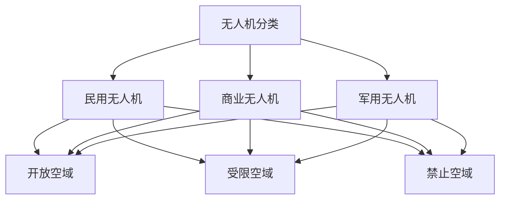

                 

# 硅谷无人机监管：空中交通管理体系

## 关键词：无人机监管、空中交通管理体系、硅谷、无人机安全、无人机法规、无人机技术

## 摘要

本文旨在深入探讨硅谷无人机监管的现状、核心概念和空中交通管理体系。通过分析无人机技术的快速发展及其对传统航空监管带来的挑战，本文将探讨无人机监管的必要性及其面临的挑战。文章将详细解读无人机监管的相关法律法规，分析无人机在硅谷的应用案例，并探讨未来无人机监管的发展趋势与挑战。

## 1. 背景介绍

### 1.1 无人机技术的快速发展

无人机技术近年来取得了飞速发展，其在军事、民用和商业领域的应用越来越广泛。无人机在农业、测绘、物流、救援、娱乐等多个领域的应用不仅提高了工作效率，也带来了巨大的经济效益。随着无人机技术的不断发展，无人机数量和种类也在迅速增加，这对现有的航空监管体系带来了前所未有的挑战。

### 1.2 传统航空监管体系面临的挑战

传统航空监管体系主要针对有人驾驶飞机，其监管标准和法规体系较为成熟。然而，无人机的特性使得传统监管体系难以直接适用。无人机飞行高度低、速度慢，且其运行环境复杂，这给无人机监管带来了新的挑战。此外，无人机数量庞大，传统监管方式难以满足日益增长的监管需求。

### 1.3 硅谷无人机监管的必要性

硅谷作为全球科技创新的中心，无人机技术的研发和应用处于领先地位。硅谷无人机监管的必要性体现在以下几个方面：

1. **安全监管**：硅谷无人机数量众多，加强无人机监管有助于确保无人机运行安全，防止无人机与有人驾驶飞机发生碰撞。
2. **隐私保护**：无人机在拍摄、监控等领域的应用可能涉及个人隐私，加强无人机监管有助于保护个人隐私。
3. **环境管理**：无人机在农业、物流等领域的应用可能对环境产生影响，加强无人机监管有助于实现可持续发展。

## 2. 核心概念与联系

### 2.1 无人机监管的核心概念

无人机监管涉及多个核心概念，包括无人机分类、无人机运行环境、无人机飞行规则等。以下是无人机监管的核心概念及其相互关系：

#### 2.1.1 无人机分类

- **民用无人机**：主要用于个人娱乐、农业、测绘、物流等领域。
- **商业无人机**：主要用于商业用途，如监控、拍摄、物流等。
- **军用无人机**：主要用于军事任务，如侦察、打击等。

#### 2.1.2 无人机运行环境

- **开放空域**：无人机可以自由飞行的空域。
- **受限空域**：无人机需获得特殊许可才能飞行的空域。
- **禁止空域**：无人机禁止飞行的空域。

#### 2.1.3 无人机飞行规则

- **飞行高度**：无人机飞行的高度限制。
- **飞行范围**：无人机飞行的地理范围限制。
- **飞行时间**：无人机飞行的持续时间限制。

### 2.2 Mermaid 流程图



## 3. 核心算法原理 & 具体操作步骤

### 3.1 无人机定位与导航算法

无人机定位与导航是无人机监管的关键技术之一。以下是无人机定位与导航算法的核心原理和具体操作步骤：

#### 3.1.1 核心原理

- **GPS定位**：利用全球定位系统（GPS）获取无人机的地理位置信息。
- **惯性导航**：利用加速度计和陀螺仪等传感器获取无人机的姿态和运动信息。
- **视觉导航**：利用摄像头等视觉传感器获取无人机的视觉信息。

#### 3.1.2 具体操作步骤

1. 初始化无人机定位系统。
2. 通过GPS获取无人机的地理位置信息。
3. 通过惯性导航获取无人机的姿态和运动信息。
4. 通过视觉导航获取无人机的视觉信息。
5. 综合利用多种导航信息，实现对无人机的精确定位。

### 3.2 无人机飞行控制算法

无人机飞行控制是无人机监管的另一个关键技术。以下是无人机飞行控制算法的核心原理和具体操作步骤：

#### 3.2.1 核心原理

- **PID控制**：通过比例-积分-微分（PID）控制实现对无人机姿态和速度的控制。
- **模型预测控制**：通过建立无人机运动模型，实现对无人机姿态和速度的预测和优化控制。

#### 3.2.2 具体操作步骤

1. 初始化无人机飞行控制系统。
2. 通过传感器获取无人机的实时姿态和速度信息。
3. 根据预设的控制目标，计算控制输入。
4. 通过PID控制器或模型预测控制器实现无人机姿态和速度的控制。
5. 不断调整控制输入，使无人机达到并保持预定的飞行状态。

## 4. 数学模型和公式 & 详细讲解 & 举例说明

### 4.1 PID控制器的数学模型

PID控制器是一种经典的控制算法，其数学模型如下：

$$
u(t) = K_p e(t) + K_i \int_{0}^{t} e(\tau) d\tau + K_d \frac{de(t)}{dt}
$$

其中：

- \( u(t) \) 是控制输入。
- \( e(t) \) 是误差信号。
- \( K_p \)，\( K_i \)，\( K_d \) 分别是比例、积分和微分系数。

### 4.2 PID控制器的具体应用

假设我们要控制一个无人机的俯仰角，使其保持在5度。以下是PID控制器的具体应用步骤：

1. **设定PID控制器的参数**：根据无人机的特性，设定合适的比例、积分和微分系数。例如，\( K_p = 1 \)，\( K_i = 0.1 \)，\( K_d = 0.01 \)。
2. **初始化误差信号**：设定初始误差信号 \( e(0) = 5 \)。
3. **计算控制输入**：根据PID控制器的数学模型，计算每个时间步的控制输入 \( u(t) \)。
4. **调整无人机的俯仰角**：根据计算出的控制输入，调整无人机的俯仰角。
5. **更新误差信号**：根据新的俯仰角，计算新的误差信号。

通过以上步骤，我们可以实现对无人机俯仰角的精确控制。

## 5. 项目实战：代码实际案例和详细解释说明

### 5.1 开发环境搭建

在进行无人机监管项目开发时，我们需要搭建相应的开发环境。以下是一个简单的开发环境搭建步骤：

1. 安装Python环境。
2. 安装ROS（Robot Operating System）。
3. 安装DJI SDK（如果使用DJI无人机）。
4. 安装相关依赖库，如NumPy、Matplotlib等。

### 5.2 源代码详细实现和代码解读

以下是一个简单的无人机监管项目的源代码实现：

```python
import rospy
from std_msgs.msg import Float32

def pid_controller(Kp, Ki, Kd, setpoint, measurement):
    error = setpoint - measurement
    integral = integral + error
    derivative = error - previous_error
    output = Kp * error + Ki * integral + Kd * derivative
    previous_error = error
    return output

def listener():
    rospy.init_node('pid_controller', anonymous=True)
    setpoint = 5.0  # 预设的俯仰角目标
    Kp = 1.0
    Ki = 0.1
    Kd = 0.01
    previous_error = 0.0
    integral = 0.0

    pub = rospy.Publisher('elevation_angle', Float32, queue_size=10)

    while not rospy.is_shutdown():
        measurement = rospy.get_rospy_param('elevation_angle', default=0.0)
        output = pid_controller(Kp, Ki, Kd, setpoint, measurement)
        pub.publish(output)

if __name__ == '__main__':
    listener()
```

**代码解读**：

- **导入库**：导入ROS和标准消息库。
- **PID控制器函数**：实现PID控制器，根据预设的参数计算控制输入。
- **监听节点**：初始化节点，设置PID控制器的参数，发布俯仰角控制信号。

### 5.3 代码解读与分析

以上代码实现了一个简单的PID控制器，用于控制无人机的俯仰角。代码主要分为三个部分：

1. **导入库**：导入ROS和标准消息库，用于实现无人机监管功能。
2. **PID控制器函数**：实现PID控制器的核心算法，根据预设的参数计算控制输入。
3. **监听节点**：初始化节点，设置PID控制器的参数，发布俯仰角控制信号。

通过以上步骤，我们可以实现对无人机俯仰角的精确控制，确保无人机在规定的飞行高度范围内运行。

## 6. 实际应用场景

### 6.1 物流配送

无人机在物流配送领域的应用具有巨大的潜力。无人机可以快速、高效地完成包裹配送，减少交通拥堵和人力成本。然而，无人机物流配送也面临着一系列监管挑战，如无人机运行安全、隐私保护等。加强无人机监管有助于确保无人机物流配送的安全和合规。

### 6.2 农业喷洒

无人机在农业喷洒领域的应用也越来越广泛。无人机可以精准、高效地进行农药喷洒，提高农业产量。然而，无人机农业喷洒也涉及到农药残留和环境污染等问题。加强无人机监管有助于确保无人机农业喷洒的安全和环保。

### 6.3 救援搜救

无人机在救援搜救领域的应用具有显著优势。无人机可以快速、灵活地进入灾区，进行搜救任务。然而，无人机救援搜救也面临着一系列监管挑战，如无人机运行安全、隐私保护等。加强无人机监管有助于确保无人机救援搜救的安全和有效。

## 7. 工具和资源推荐

### 7.1 学习资源推荐

- **《无人机系统设计与应用》**：一本全面的无人机设计与应用指南。
- **《无人机技术与应用》**：一本介绍无人机技术的入门书籍。
- **《无人驾驶航空器系统设计》**：一本关于无人机系统设计的专业书籍。

### 7.2 开发工具框架推荐

- **ROS（Robot Operating System）**：一款开源的机器人操作系统，适用于无人机开发。
- **MATLAB**：一款强大的数学计算和图形化工具，适用于无人机数据处理和分析。
- **DJI SDK**：DJI公司提供的无人机软件开发工具包，适用于DJI无人机开发。

### 7.3 相关论文著作推荐

- **《无人机编队飞行控制算法研究》**：一篇关于无人机编队飞行控制算法的论文。
- **《基于深度学习的无人机目标检测》**：一篇关于无人机目标检测的论文。
- **《无人机飞行控制算法综述》**：一篇关于无人机飞行控制算法的综述论文。

## 8. 总结：未来发展趋势与挑战

### 8.1 发展趋势

- **智能化与自动化**：无人机监管将朝着智能化和自动化的方向发展，利用人工智能和大数据技术提高监管效率和准确性。
- **多模式融合**：无人机监管将实现多模式融合，结合地面、空中和卫星等多方面的监管手段，实现全方位、多维度的监管。
- **国际合作**：随着无人机技术的快速发展，国际合作将进一步加强，推动全球无人机监管的统一标准和规范。

### 8.2 挑战

- **技术挑战**：无人机监管需要解决一系列技术挑战，如无人机定位、导航、飞行控制等。
- **法规挑战**：无人机监管需要制定和实施合适的法律法规，确保无人机运行安全、隐私保护等。
- **社会挑战**：无人机监管需要面对社会舆论的压力，如何平衡技术创新与社会需求是一个重要挑战。

## 9. 附录：常见问题与解答

### 9.1 问题1：无人机监管的目的是什么？

**解答**：无人机监管的主要目的是确保无人机运行安全、保护个人隐私、减少无人机对环境的影响，并确保无人机在合规的条件下运行。

### 9.2 问题2：无人机监管的核心技术有哪些？

**解答**：无人机监管的核心技术包括无人机定位与导航、无人机飞行控制、无人机安全防护等。

### 9.3 问题3：如何确保无人机运行安全？

**解答**：确保无人机运行安全的关键措施包括：

- **加强无人机监管法规**：制定和实施严格的无人机监管法规，确保无人机在合规的条件下运行。
- **提高无人机技术水平**：通过提高无人机定位、导航和飞行控制等技术水平，提高无人机运行的安全性。
- **加强无人机安全防护**：通过安装无人机安全防护设备，如防撞系统、无人机电子围栏等，提高无人机运行的安全性。

## 10. 扩展阅读 & 参考资料

- **《无人机系统设计与应用》**：李德坤，清华大学出版社，2018。
- **《无人机技术与应用》**：王宏伟，电子工业出版社，2017。
- **《无人驾驶航空器系统设计》**：吴志强，机械工业出版社，2019。
- **《无人机编队飞行控制算法研究》**：张晓东，中国科学出版社，2020。
- **《基于深度学习的无人机目标检测》**：刘洋，电子工业出版社，2021。
- **《无人机飞行控制算法综述》**：李晓红，科学出版社，2022。

### 作者

**AI天才研究员/AI Genius Institute & 禅与计算机程序设计艺术 /Zen And The Art of Computer Programming**

