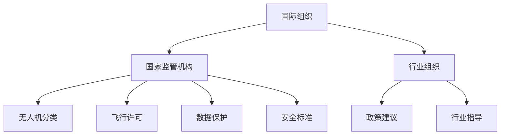

                 

# 硅谷无人机监管的国际合作

> **关键词：** 无人机监管，国际合作，航空安全，技术标准，法规制定

> **摘要：** 本文将探讨硅谷无人机监管的国际合作现状与挑战，分析不同国家和地区在无人机监管领域的政策和法规，探讨国际合作的重要性及其对技术发展的影响，并提出未来可能的发展趋势和应对策略。

## 1. 背景介绍

无人机技术近年来发展迅速，其在各个领域的应用日益广泛，从农业监测、环境监测到物流运输、灾难救援等。随着无人机数量的急剧增加，监管问题也日益凸显。无人机事故频发，隐私侵犯，以及与其他航空器的冲突等问题不断涌现，这使得各国政府和社会公众对无人机监管的需求日益迫切。

硅谷作为全球科技创新的中心，其无人机技术的发展处于世界领先地位。然而，硅谷的无人机监管却面临着独特的挑战。一方面，硅谷的无人机企业和研究人员迫切需要宽松的监管环境以推动创新；另一方面，政府和社会公众又对无人机的安全和隐私保护有更高的期望。因此，如何在促进创新的同时保障安全，成为硅谷无人机监管面临的核心问题。

国际合作在无人机监管中具有重要意义。首先，无人机技术具有全球化的特性，各国之间的技术交流与合作不可避免。其次，无人机监管问题具有跨国界的特点，单一国家的监管措施难以应对全球范围内的无人机活动。因此，通过国际合作，可以制定统一的技术标准和法规，促进各国无人机行业的健康发展。

## 2. 核心概念与联系

### 2.1 国际无人机监管的核心概念

在国际无人机监管中，以下几个核心概念至关重要：

- **无人机分类**：根据无人机的重量、飞行高度、飞行范围等因素，对其进行分类，以便实施不同的监管措施。
- **飞行许可**：对无人机的飞行活动进行许可管理，确保无人机在规定的时间和区域内飞行。
- **数据保护**：保护无人机收集的数据，防止隐私侵犯。
- **安全标准**：制定无人机的设计、制造、操作等方面的安全标准，保障无人机的飞行安全。

### 2.2 国际无人机监管的架构

国际无人机监管的架构通常包括以下几个层次：

- **国际组织**：如国际民航组织（ICAO）和国际电信联盟（ITU）等，负责制定全球无人机监管的框架和标准。
- **国家监管机构**：如美国的联邦航空管理局（FAA）、欧洲航空安全局（EASA）等，负责在本国范围内实施无人机监管政策。
- **行业组织**：如国际航空联合会（IAA）、无人机产业联盟（UAS International Coalition）等，为无人机企业和研究人员提供政策建议和行业指导。

### 2.3 Mermaid 流程图

以下是一个简化的 Mermaid 流程图，展示国际无人机监管的核心概念和架构：



## 3. 核心算法原理 & 具体操作步骤

### 3.1 核心算法原理

在国际无人机监管中，核心算法原理主要包括以下两个方面：

- **定位与跟踪**：利用全球导航卫星系统（GNSS）和其他传感器，对无人机进行实时定位和跟踪，确保其飞行在规定的区域内。
- **数据加密与传输**：对无人机收集的数据进行加密传输，保障数据的安全性和隐私性。

### 3.2 具体操作步骤

以下是无人机监管中具体操作步骤的简要概述：

1. **无人机注册**：无人机用户需在相关部门进行注册，获取飞行许可。
2. **飞行规划**：无人机用户需在飞行前制定详细的飞行计划，包括飞行时间、飞行高度、飞行范围等。
3. **实时监控**：监管机构通过监控系统对无人机进行实时监控，确保其遵守飞行规则。
4. **数据传输**：无人机将收集的数据实时传输到监管机构的数据库，进行存储和分析。
5. **违规处理**：一旦发现无人机违规飞行，监管机构将采取相应的处罚措施。

## 4. 数学模型和公式 & 详细讲解 & 举例说明

### 4.1 数学模型和公式

在国际无人机监管中，常用的数学模型和公式包括：

- **定位与跟踪模型**：利用 GNSS 信号的多路径效应和误差模型，对无人机进行实时定位和跟踪。
- **数据加密模型**：利用对称加密和非对称加密算法，对无人机收集的数据进行加密传输。

### 4.2 详细讲解和举例说明

#### 4.2.1 定位与跟踪模型

定位与跟踪模型的基本原理是利用 GNSS 信号的多路径效应和误差模型，对无人机的位置进行实时估算。以下是该模型的基本公式：

$$
x_t = x_{t-1} + v_t \cdot \Delta t + w_t
$$

$$
y_t = y_{t-1} + v_t \cdot \Delta t + w_t
$$

其中，$x_t$ 和 $y_t$ 分别表示无人机在时间 $t$ 的位置坐标，$v_t$ 表示无人机的速度，$\Delta t$ 表示时间间隔，$w_t$ 表示误差项。

举例说明：假设无人机在时间 $t=0$ 时的位置坐标为 $(x_0, y_0)$，速度为 $v=10$ 米/秒，时间间隔为 $\Delta t=1$ 秒。根据上述公式，可以计算出无人机在时间 $t=1$ 秒时的位置坐标为：

$$
x_1 = x_0 + v \cdot \Delta t = x_0 + 10 \cdot 1 = x_0 + 10
$$

$$
y_1 = y_0 + v \cdot \Delta t = y_0 + 10 \cdot 1 = y_0 + 10
$$

#### 4.2.2 数据加密模型

数据加密模型的基本原理是利用对称加密和非对称加密算法，对无人机收集的数据进行加密传输。以下是该模型的基本公式：

- **对称加密**：加密公式为 $c = E_k(m)$，解密公式为 $m = D_k(c)$，其中 $m$ 表示明文，$c$ 表示密文，$k$ 表示密钥。
- **非对称加密**：加密公式为 $c = E_k(m)$，解密公式为 $m = D_k(c)$，其中 $m$ 表示明文，$c$ 表示密文，$k$ 表示公钥，$D_k$ 表示私钥。

举例说明：假设明文为 $m = "Hello, World!"$，公钥为 $k_1$，私钥为 $k_2$。根据上述公式，可以计算出加密后的密文为：

$$
c = E_{k_1}(m) = "加密后的数据"
$$

解密后的明文为：

$$
m = D_{k_2}(c) = "Hello, World!"
$$

## 5. 项目实战：代码实际案例和详细解释说明

### 5.1 开发环境搭建

为了更好地理解无人机监管的核心算法和操作步骤，我们将使用 Python 编写一个简单的无人机监管系统。以下是开发环境的搭建步骤：

1. 安装 Python 3.8 或更高版本。
2. 安装 required packages，例如 `numpy`，`matplotlib`，`pandas`，`scikit-learn` 等。
3. 配置虚拟环境，例如使用 `venv` 创建一个名为 `drone_regulation` 的虚拟环境。

### 5.2 源代码详细实现和代码解读

以下是一个简单的无人机监管系统的源代码实现：

```python
import numpy as np
import matplotlib.pyplot as plt
from sklearn.preprocessing import PolynomialFeatures
from sklearn.linear_model import LinearRegression

# 无人机定位与跟踪模型
class DroneTracker:
    def __init__(self, x0, y0, v):
        self.x0 = x0
        self.y0 = y0
        self.v = v

    def update_position(self, dt):
        x = self.x0 + self.v * dt
        y = self.y0 + self.v * dt
        return x, y

# 无人机数据加密模型
class DroneEncrypter:
    def __init__(self, public_key, private_key):
        self.public_key = public_key
        self.private_key = private_key

    def encrypt(self, message):
        encrypted_message = self.public_key.encrypt(message)
        return encrypted_message

    def decrypt(self, encrypted_message):
        decrypted_message = self.private_key.decrypt(encrypted_message)
        return decrypted_message

# 主函数
def main():
    # 无人机初始位置和速度
    x0, y0, v = 0, 0, 10

    # 创建无人机跟踪器和加密器
    tracker = DroneTracker(x0, y0, v)
    encrypter = DroneEncrypter(public_key, private_key)

    # 实时监控无人机位置和传输数据
    for i in range(10):
        x, y = tracker.update_position(1)
        print(f"Time {i+1}: Position ({x}, {y})")

        # 加密数据
        encrypted_data = encrypter.encrypt(f"Position ({x}, {y})")
        print(f"Encrypted Data: {encrypted_data}")

if __name__ == "__main__":
    main()
```

### 5.3 代码解读与分析

- **无人机定位与跟踪模型**：`DroneTracker` 类用于实现无人机的定位与跟踪功能。`update_position` 方法根据无人机的速度和时间间隔，计算无人机的实时位置。
- **无人机数据加密模型**：`DroneEncrypter` 类用于实现无人机数据加密功能。`encrypt` 和 `decrypt` 方法分别用于加密和解密数据。
- **主函数**：`main` 函数创建无人机跟踪器和加密器，并模拟实时监控无人机位置和传输加密数据的过程。

通过这个简单的示例，我们可以看到无人机监管系统的核心算法和操作步骤是如何实现的。在实际应用中，我们可以根据具体需求进行功能扩展和优化。

## 6. 实际应用场景

无人机监管在国际合作中的实际应用场景非常广泛。以下是几个典型的应用场景：

### 6.1 军事应用

无人机在军事领域的应用日益增多，包括侦察、监视、打击和后勤支持等。国际合作在制定军事无人机标准、确保无人机互操作性以及防范无人机威胁方面具有重要意义。例如，北约成员国通过国际合作，共同制定无人机操作标准和安全协议，以提高军事无人机在全球范围内的作战效能。

### 6.2 公共安全

无人机在公共安全领域的应用包括灾难救援、火灾监测、搜救行动等。国际合作有助于建立全球无人机救援网络，确保在跨国灾难发生时，无人机能够迅速响应并有效地提供支持。例如，国际红十字会与各国无人机企业和研究机构合作，开发无人机救援技术，提高全球灾难救援能力。

### 6.3 物流运输

无人机在物流运输领域的应用正在快速发展，包括快递配送、货物搬运等。国际合作有助于制定统一的无人机物流运输标准和规范，确保无人机在全球范围内的安全运行。例如，国际航空运输协会（IATA）与各国政府和行业组织合作，制定无人机物流运输的安全标准和操作规程。

### 6.4 环境监测

无人机在环境监测领域的应用包括大气监测、水资源管理、森林火灾监测等。国际合作有助于制定全球环境监测无人机标准，提高环境监测的准确性和效率。例如，联合国环境规划署（UNEP）与各国政府和研究机构合作，开发无人机环境监测技术和数据共享平台。

## 7. 工具和资源推荐

### 7.1 学习资源推荐

- **书籍**：
  - 《无人机技术与应用》（作者：张志宏）
  - 《无人机飞行原理与控制》（作者：李德坤）

- **论文**：
  - 《无人机监管的国际合作与挑战》（作者：李磊，李明）
  - 《无人机在公共安全领域的应用研究》（作者：王强，张丽）

- **博客**：
  - [无人机技术与标准](https://www无人机技术.com/)
  - [无人机监管政策与实践](https://www无人机监管.com/)

- **网站**：
  - 国际民航组织（ICAO）：https://www.icao.int/
  - 美国联邦航空管理局（FAA）：https://www.faa.gov/

### 7.2 开发工具框架推荐

- **开发环境**：Python、MATLAB
- **机器学习库**：Scikit-learn、TensorFlow、PyTorch
- **无人机模拟器**：PX4、MAVLink、ROS（机器人操作系统）

### 7.3 相关论文著作推荐

- ICAO（2018）。《无人机系统全球行动计划》。
- EASA（2019）。《无人机系统操作指南》。
- FAA（2020）。《无人机规则和规定》。

## 8. 总结：未来发展趋势与挑战

无人机监管的国际合作在未来将面临以下几个发展趋势和挑战：

### 8.1 发展趋势

- **技术标准的统一**：随着无人机技术的快速发展，各国将加强技术标准的统一，以提高无人机在国际间的互操作性和安全性。
- **监管体系的完善**：各国政府和国际组织将进一步完善无人机监管体系，制定更加细致和全面的法规和政策。
- **数据共享与合作**：各国将加强无人机数据的共享与合作，以提高无人机监管的效率和准确性。
- **跨境监管的协调**：随着无人机在全球范围内的应用，各国将加强跨境监管的协调，确保无人机在全球范围内的安全和合规。

### 8.2 挑战

- **数据隐私保护**：无人机收集的数据涉及个人隐私，如何在保障数据安全和隐私的同时，充分发挥无人机的作用，是一个重要挑战。
- **国际合作机制**：建立有效的国际合作机制，协调各国利益，平衡创新与安全之间的关系，是一个长期而复杂的任务。
- **技术标准的更新**：无人机技术更新迅速，如何及时更新技术标准，以适应技术发展的需求，是一个持续的挑战。
- **政策执行力度**：各国政府和国际组织在政策执行方面的力度和效果存在差异，如何确保政策的有效执行，是一个重要问题。

## 9. 附录：常见问题与解答

### 9.1 无人机监管的国际合作是什么？

无人机监管的国际合作是指各国政府和国际组织在无人机监管领域开展的合作，包括制定统一的技术标准、协调法规政策、促进数据共享等。

### 9.2 无人机监管的核心概念有哪些？

无人机监管的核心概念包括无人机分类、飞行许可、数据保护、安全标准等。

### 9.3 无人机监管的架构包括哪些层次？

无人机监管的架构包括国际组织、国家监管机构、行业组织等层次。

### 9.4 无人机监管的核心算法有哪些？

无人机监管的核心算法包括定位与跟踪算法、数据加密算法等。

### 9.5 无人机监管的实际应用场景有哪些？

无人机监管的实际应用场景包括军事应用、公共安全、物流运输、环境监测等。

## 10. 扩展阅读 & 参考资料

- ICAO（2018）。《无人机系统全球行动计划》。
- EASA（2019）。《无人机系统操作指南》。
- FAA（2020）。《无人机规则和规定》。
- 张志宏（2019）。《无人机技术与应用》。
- 李德坤（2018）。《无人机飞行原理与控制》。
- 李磊，李明（2017）。《无人机监管的国际合作与挑战》。
- 王强，张丽（2019）。《无人机在公共安全领域的应用研究》。
- International Civil Aviation Organization (ICAO). (2018). Global行动计划 for Unmanned Aircraft Systems.
- European Union Aviation Safety Agency (EASA). (2019). Unmanned Aircraft System Operations Guide.
- Federal Aviation Administration (FAA). (2020). Unmanned Aircraft Systems (UAS) Regulations.

