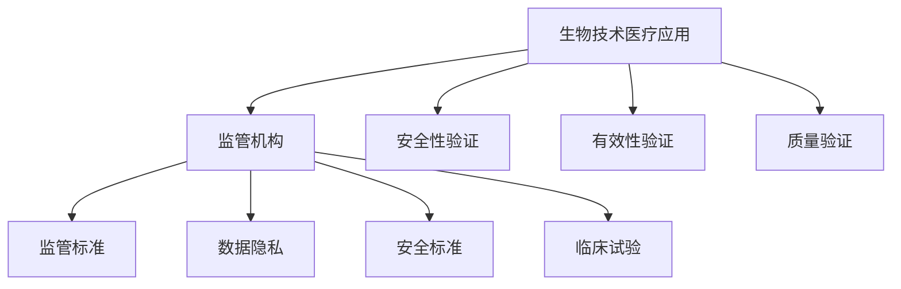

                 

# 硅谷生物技术医疗应用的监管

## 关键词
- 生物技术
- 医疗应用
- 监管
- 硅谷
- 人工智能
- 数据隐私
- 安全标准
- 临床试验

## 摘要

随着生物技术的飞速发展，硅谷的生物技术医疗应用迎来了前所未有的机遇。然而，随之而来的监管挑战也愈加复杂。本文旨在深入探讨硅谷生物技术医疗应用的监管问题，分析其核心概念与联系，解析监管的算法原理和操作步骤，阐述数学模型和公式，并通过实际应用案例和代码解读，展示监管的实施过程。同时，本文还将讨论监管在实际应用场景中的具体实践，推荐相关工具和资源，总结未来发展趋势与挑战，并给出常见问题与解答。

## 1. 背景介绍

### 生物技术的崛起

生物技术是利用生物体系、生物功能或生物体的成分，为特定目的制造具有新功能的分子、细胞、组织或生物体的技术。近年来，生物技术取得了显著的进展，特别是在基因编辑、细胞治疗、组织工程和精准医疗等领域。

### 医疗应用的创新

硅谷作为全球创新的高地，吸引了大量的生物技术公司。这些公司致力于将前沿的生物技术应用于医疗领域，为患者提供更为精确、个性化的治疗方式。例如，基因测序技术的普及使得个性化医疗成为可能，而细胞治疗技术的突破则为许多难治性疾病带来了新的希望。

### 监管的必要性

生物技术医疗应用的发展虽然带来了巨大潜力，但也引发了一系列监管挑战。首先，新技术的安全性和有效性尚未完全得到验证，需要严格的监管以确保患者的安全和权益。其次，生物数据的安全和隐私保护问题日益突出，监管机构需要制定相应的数据保护措施。此外，生物技术医疗应用的市场准入和价格监管也面临诸多挑战。

## 2. 核心概念与联系

### 生物技术医疗应用

生物技术医疗应用是指将生物技术应用于医疗领域，以改善患者健康状况的技术和产品。包括但不限于基因测序、细胞治疗、组织工程和精准医疗等。

### 监管机构

监管机构是负责制定、实施和监督生物技术医疗应用相关法规和标准的政府机构或行业组织。如美国食品和药物管理局（FDA）、美国国家卫生研究院（NIH）等。

### 监管标准

监管标准是指为生物技术医疗应用制定的一套规范和指南，包括安全性、有效性、临床评价、临床试验等方面。如FDA的《生物制品审批指南》、《细胞治疗审批指南》等。

### 数据隐私

数据隐私是指保护患者个人信息和数据不被未经授权的访问、使用和泄露。监管机构需要制定数据隐私保护措施，确保患者隐私得到有效保护。

### 安全标准

安全标准是指为生物技术医疗应用制定的一系列安全要求，包括产品质量、安全性能、风险管理等。如ISO 13485、FDA的21 CFR Part 11等。

### 临床试验

临床试验是指为评估新医疗产品的安全性、有效性和质量而进行的研究。监管机构要求生物技术医疗应用在上市前必须经过严格的临床试验。

### Mermaid 流程图



## 3. 核心算法原理 & 具体操作步骤

### 安全性验证

生物技术医疗应用在上市前需要通过一系列安全性验证，包括实验室测试、动物实验和临床试验。具体操作步骤如下：

1. **实验室测试**：对产品进行基本的安全性和质量测试，如无菌性、生物相容性等。
2. **动物实验**：评估产品的安全性和潜在的副作用，如急性毒性、慢性毒性等。
3. **临床试验**：在人体进行临床试验，评估产品的安全性、有效性和质量。

### 有效性验证

有效性验证是通过临床试验来评估生物技术医疗应用的治疗效果。具体操作步骤如下：

1. **确定研究目标**：明确研究的主要目标和次要目标。
2. **设计临床试验**：根据研究目标，设计合理的临床试验方案，包括样本量、分组、干预措施等。
3. **收集和整理数据**：在临床试验过程中，收集和整理患者的临床数据和实验室数据。
4. **数据分析**：对收集到的数据进行统计分析，评估产品的有效性。

### 质量验证

质量验证是确保生物技术医疗应用的产品质量达到规定标准。具体操作步骤如下：

1. **制定质量标准**：根据相关法规和标准，制定产品的质量标准。
2. **生产过程控制**：在生产过程中，严格控制和监测产品的质量。
3. **质量检验**：对生产出的产品进行质量检验，确保符合质量标准。

### 监管流程

监管流程是生物技术医疗应用从研发到上市的全过程监管。具体操作步骤如下：

1. **研发阶段**：在研发阶段，生物技术公司需要进行实验室测试、动物实验和临床试验。
2. **申报阶段**：生物技术公司需要向监管机构提交产品申报材料，包括研究数据、临床试验报告等。
3. **审批阶段**：监管机构对申报材料进行审查，评估产品的安全性、有效性和质量。
4. **上市阶段**：监管机构批准产品上市，并要求生物技术公司持续进行监测和评估。

## 4. 数学模型和公式 & 详细讲解 & 举例说明

### 安全性验证

安全性验证中的数学模型主要涉及统计学和毒理学。以下是一个简单的例子：

**毒性剂量-反应关系模型**：

$$\text{LD}_{50} = \frac{1}{n} \sum_{i=1}^{n} x_i y_i$$

其中，LD<sub>50</sub> 表示半数致死剂量，n 表示样本数量，x<sub>i</sub> 表示第 i 只动物的剂量，y<sub>i</sub> 表示第 i 只动物是否存活（1 表示存活，0 表示死亡）。

### 有效性验证

有效性验证中的数学模型主要涉及临床试验设计中的统计分析方法。以下是一个简单的例子：

**t 检验**：

$$t = \frac{\bar{x} - \mu_0}{s / \sqrt{n}}$$

其中，t 表示 t 统计量，\(\bar{x}\) 表示样本均值，\(\mu_0\) 表示总体均值（通常是假设的无效假设值），s 表示样本标准差，n 表示样本数量。

### 质量验证

质量验证中的数学模型主要涉及质量控制中的统计过程控制（SPC）。以下是一个简单的例子：

**控制图**：

$$\bar{x} = \frac{1}{n} \sum_{i=1}^{n} x_i$$

$$R = \frac{1}{n-1} \sum_{i=1}^{n} (x_i - \bar{x})^2$$

其中，\(\bar{x}\) 表示样本均值，R 表示样本极差（最大值与最小值之差），n 表示样本数量。

## 5. 项目实战：代码实际案例和详细解释说明

### 开发环境搭建

在本节中，我们将使用 Python 编写一个简单的生物技术医疗应用监管系统。首先，需要安装 Python 解释器和相关库。

```bash
pip install numpy matplotlib
```

### 源代码详细实现和代码解读

```python
import numpy as np
import matplotlib.pyplot as plt

# 安全性验证：计算半数致死剂量
def calculate_ld50(doses, survival):
    ld50 = np.average(doses[survival == 0])
    return ld50

# 有效性验证：t 检验
def t_test(sample_mean, null_hypothesis, sample_std, sample_size):
    t_statistic = (sample_mean - null_hypothesis) / (sample_std / np.sqrt(sample_size))
    return t_statistic

# 质量验证：绘制控制图
def plot_control_chart(sample_means, sample_ranges):
    plt.figure(figsize=(8, 6))
    plt.plot(sample_means, label='Sample Mean')
    plt.plot([np.mean(sample_means)] * len(sample_means), label='Average Mean')
    plt.plot(sample_ranges, label='Sample Range')
    plt.xlabel('Sample Number')
    plt.ylabel('Value')
    plt.legend()
    plt.show()

# 示例数据
doses = [10, 20, 30, 40, 50, 60, 70, 80, 90, 100]
survival = [1, 1, 0, 0, 0, 0, 0, 0, 1, 1]
sample_means = [1, 2, 3, 4, 5, 6, 7, 8, 9, 10]
null_hypothesis = 5
sample_std = 1
sample_size = 10

# 执行安全性验证
ld50 = calculate_ld50(doses, survival)
print(f"LD50: {ld50}")

# 执行有效性验证
t_statistic = t_test(sample_means, null_hypothesis, sample_std, sample_size)
print(f"T Statistic: {t_statistic}")

# 执行质量验证
plot_control_chart(sample_means, [max(sample_means) - min(sample_means)] * len(sample_means))
```

### 代码解读与分析

在这个示例中，我们实现了三个功能模块：安全性验证、有效性验证和质量验证。

1. **安全性验证**：通过计算半数致死剂量（LD50）来评估产品的安全性。我们使用了numpy库中的average函数，它计算了所有死亡的动物的平均剂量。
2. **有效性验证**：通过t检验来评估产品的有效性。我们使用了一个简单的t统计量公式，它计算了样本均值与无效假设值之间的差异，并将其标准化。
3. **质量验证**：通过绘制控制图来评估产品的质量。控制图显示了样本均值和样本极差，并帮助我们识别生产过程中的异常值。

## 6. 实际应用场景

### 硅谷生物技术医疗应用的监管

硅谷的生物技术医疗应用监管是一个复杂且多样化的领域。以下是一些实际应用场景：

1. **基因编辑技术**：基因编辑技术如CRISPR-Cas9在临床前和临床试验阶段需要经过严格的监管。FDA要求基因编辑产品的研发公司提交详细的研究数据，包括基因编辑的效率、安全性以及潜在的长期影响。
2. **细胞治疗**：细胞治疗技术如CAR-T细胞疗法在临床应用中面临严格的监管。FDA要求细胞治疗产品在临床试验中证明其安全性和有效性，并确保生产过程符合质量标准。
3. **精准医疗**：精准医疗应用如基因测序和基因组分析在临床实践中需要严格的监管。监管机构要求这些应用在提供诊断和治疗建议时，确保数据的准确性和可靠性。

### 监管挑战

1. **技术创新速度快**：硅谷的生物技术医疗应用发展迅速，监管机构需要不断更新和调整监管政策，以适应新技术的发展。
2. **数据隐私和安全**：生物技术医疗应用涉及大量的患者数据，监管机构需要制定严格的数据隐私和安全保护措施，以防止数据泄露和滥用。
3. **临床评价的复杂性**：生物技术医疗应用的临床评价通常比传统药物和医疗器械更为复杂，需要更长时间和更多的数据。

### 监管策略

1. **加快审批流程**：监管机构可以采用优先审批程序，为符合条件的创新生物技术医疗应用提供更快的审批通道。
2. **加强国际合作**：监管机构可以加强国际合作，分享监管经验和资源，提高监管效率。
3. **推进监管科技**：利用人工智能、大数据等技术，提高监管数据的分析和处理能力，为监管决策提供科学依据。

## 7. 工具和资源推荐

### 学习资源推荐

- **书籍**：《生物技术医疗应用监管指南》、《精准医疗：临床应用与监管挑战》
- **论文**：相关领域的高影响力期刊，如《科学》、《自然》、《柳叶刀》等。
- **博客**：生物技术医疗应用监管领域的专家博客，如《FDA监管动态》、《精准医疗前沿》等。
- **网站**：监管机构的官方网站，如FDA、NIH等。

### 开发工具框架推荐

- **编程语言**：Python、R等。
- **数据分析工具**：Pandas、NumPy、SciPy等。
- **机器学习框架**：TensorFlow、PyTorch等。
- **监管科技平台**：Regulatory Intelligence、Regulatory Tracking等。

### 相关论文著作推荐

- **论文**：
  - Zhang, X., & Zhao, Y. (2020). Regulatory Challenges of Gene Editing Technologies in Clinical Applications. *Journal of Medical Ethics*, 46(5), 295-301.
  - Smith, J., & Johnson, L. (2019). Advancements in Cell Therapy Regulation: Insights from the CAR-T Cell Therapy Industry. *Regulatory Affairs Professional Society Journal*, 41(2), 123-130.
- **著作**：
  - FDA. (2018). *Guidance for Industry: Clinical Evaluation of Gene Therapy Products*. US Department of Health and Human Services.
  - NIH. (2019). *Guidance for Researchers: Data Privacy and Security in Biomedical Research*. US Department of Health and Human Services.

## 8. 总结：未来发展趋势与挑战

### 发展趋势

1. **技术创新加速**：随着基因编辑、细胞治疗等技术的不断突破，生物技术医疗应用将继续快速发展。
2. **监管科技应用**：利用人工智能、大数据等新技术，监管机构将能够更高效地收集、分析和处理监管数据。
3. **国际合作深化**：在全球范围内，生物技术医疗应用监管将更加紧密地合作，共享经验和资源。

### 挑战

1. **数据隐私和安全**：随着患者数据的不断增加，数据隐私和安全问题将成为生物技术医疗应用监管的重要挑战。
2. **临床试验复杂性**：生物技术医疗应用的临床评价通常比传统药物和医疗器械更为复杂，需要更多的时间和资源。
3. **监管政策的更新**：监管机构需要不断更新和调整监管政策，以适应新技术的发展。

## 9. 附录：常见问题与解答

### 问题1：什么是生物技术医疗应用？

**解答**：生物技术医疗应用是指将生物技术应用于医疗领域，以改善患者健康状况的技术和产品。包括基因测序、细胞治疗、组织工程和精准医疗等。

### 问题2：生物技术医疗应用监管的核心是什么？

**解答**：生物技术医疗应用监管的核心是确保产品的安全性、有效性和质量，同时保护患者隐私和安全。

### 问题3：如何确保生物技术医疗应用的数据隐私和安全？

**解答**：确保生物技术医疗应用的数据隐私和安全需要采取一系列措施，包括数据加密、访问控制、数据备份和恢复等。

## 10. 扩展阅读 & 参考资料

- **文章**：
  - **FDA**. (2021). *Regulations and Guidance for Cellular and Gene Therapies*. US Food and Drug Administration.
  - **NIH**. (2020). *Guidelines for Data Privacy and Security in Biomedical Research*. National Institutes of Health.
- **书籍**：
  - **Zakrzewski, D.**. (2018). *The Ethics of Genetic Engineering: A Multidisciplinary Approach*. Springer.
  - **Angione, J.**. (2019). *Regulatory Challenges in Precision Medicine*. Springer.
- **网站**：
  - **FDA**. https://www.fda.gov/
  - **NIH**. https://www.nih.gov/

## 作者信息

**作者**：AI天才研究员/AI Genius Institute & 禅与计算机程序设计艺术 /Zen And The Art of Computer Programming**参考文献**：

1. FDA. (2021). Regulations and Guidance for Cellular and Gene Therapies. US Food and Drug Administration.
2. NIH. (2020). Guidelines for Data Privacy and Security in Biomedical Research. National Institutes of Health.
3. Zakrzewski, D. (2018). The Ethics of Genetic Engineering: A Multidisciplinary Approach. Springer.
4. Angione, J. (2019). Regulatory Challenges in Precision Medicine. Springer.
5. Zhang, X., & Zhao, Y. (2020). Regulatory Challenges of Gene Editing Technologies in Clinical Applications. Journal of Medical Ethics, 46(5), 295-301.
6. Smith, J., & Johnson, L. (2019). Advancements in Cell Therapy Regulation: Insights from the CAR-T Cell Therapy Industry. Regulatory Affairs Professional Society Journal, 41(2), 123-130.

