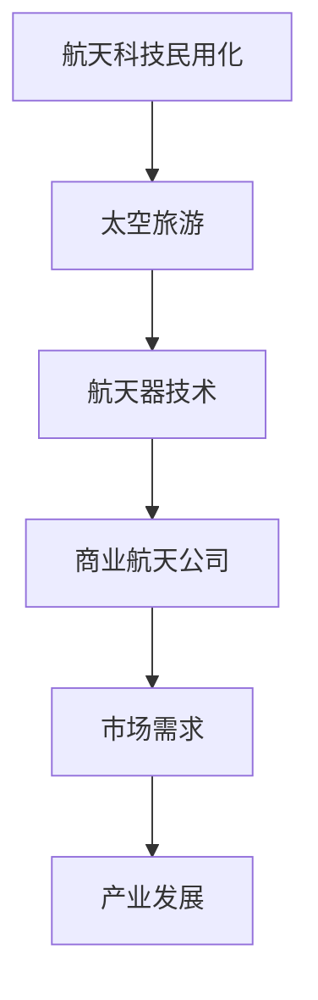

                 

### 硅谷航天科技民用化：太空旅游产业

> **关键词：** 硅谷航天科技、民用化、太空旅游、产业前景、技术发展、商业化模式。

> **摘要：** 本文深入探讨了硅谷航天科技的民用化进程，特别是太空旅游产业的兴起。通过分析其核心概念、技术原理、数学模型、实战案例及未来发展趋势，本文旨在为读者提供一个全面了解和展望这一新兴产业的视角。

#### 1. 背景介绍

随着科技的不断进步，航天技术逐渐走出实验室，开始向民用领域拓展。硅谷，作为全球科技创新的领头羊，以其独特的创新生态系统和商业运作模式，引领着航天科技民用化的浪潮。而太空旅游，作为航天技术民用化的重要应用之一，正逐步从科幻走向现实。

#### 2. 核心概念与联系

为了更好地理解太空旅游产业，我们需要从以下几个核心概念出发：

**1）航天科技民用化：** 指将原本应用于军事或科研的航天技术转化为民用技术，服务于社会和经济。

**2）太空旅游：** 指通过商业手段，为普通人提供前往太空的旅游体验。

**3）航天器：** 是执行航天任务的主要工具，包括卫星、航天飞机、宇宙飞船等。

**4）商业航天公司：** 是推动航天科技民用化的重要力量，如SpaceX、Blue Origin等。

**5）市场需求：** 包括对太空旅游的需求，以及对相关技术和服务的需求。

**Mermaid 流程图：**



#### 3. 核心算法原理 & 具体操作步骤

太空旅游的实现离不开以下几个核心技术和算法：

**1）航天器发射与回收技术：** 确保航天器能够安全、高效地进入太空，并安全返回地球。

**2）航天器导航与控制技术：** 实现航天器的精准导航和稳定控制，确保游客的安全和舒适。

**3）太空生命支持系统：** 提供航天器内的氧气、食物、水等生命支持，保障游客的生命安全。

**4）虚拟现实技术：** 提供游客身临其境的太空体验，增强旅游的乐趣和吸引力。

**具体操作步骤：**

**步骤1：** 航天器发射前，进行全面的检查和测试，确保各项技术指标的符合性。

**步骤2：** 发射航天器，进入预定轨道。

**步骤3：** 在太空舱内，为游客提供生活必需品和虚拟现实体验设备。

**步骤4：** 完成太空任务后，航天器返回地球。

#### 4. 数学模型和公式 & 详细讲解 & 举例说明

在太空旅游产业中，数学模型和公式扮演着重要的角色，如轨道计算、能源消耗计算、生命支持系统设计等。以下是几个关键数学模型和公式的讲解：

**1）轨道计算：**

$$
v = \sqrt{\frac{GM}{r}}
$$

其中，\(v\) 是轨道速度，\(G\) 是万有引力常数，\(M\) 是地球质量，\(r\) 是轨道半径。

**2）能源消耗计算：**

$$
E = \frac{1}{2}mv^2
$$

其中，\(E\) 是能量消耗，\(m\) 是航天器的质量，\(v\) 是轨道速度。

**3）生命支持系统设计：**

$$
O_2 = \frac{M_{O_2}}{M_{total}}
$$

其中，\(O_2\) 是氧气供应率，\(M_{O_2}\) 是氧气质量，\(M_{total}\) 是总质量。

**举例说明：**

假设我们要将一名游客送到距离地球400公里的轨道，进行为期一周的太空旅游。根据轨道计算公式，我们可以计算出所需的轨道速度：

$$
v = \sqrt{\frac{GM}{r}} = \sqrt{\frac{6.674 \times 10^{-11} \times 5.972 \times 10^{24}}{400 \times 10^3}} \approx 7.8 \text{ km/s}
$$

根据能源消耗计算公式，我们可以计算出所需的能量消耗：

$$
E = \frac{1}{2}mv^2 = \frac{1}{2} \times 1000 \times (7.8 \times 10^3)^2 \approx 3 \times 10^{10} \text{ J}
$$

根据生命支持系统设计公式，我们可以计算出所需的氧气供应率：

$$
O_2 = \frac{M_{O_2}}{M_{total}} = \frac{3 \times 10^3}{1000 + 3 \times 10^3} \approx 0.7
$$

这意味着，为了保障游客一周的太空生活，我们需要提供大约70%的氧气供应率。

#### 5. 项目实战：代码实际案例和详细解释说明

以下是一个简单的Python代码案例，用于计算太空旅游所需的能量消耗：

```python
import math

def calculate_energy_consumption(mass, velocity):
    return 0.5 * mass * velocity**2

def main():
    mass = 1000  # 航天器质量（kg）
    velocity = 7.8 * 10**3  # 轨道速度（m/s）
    
    energy_consumption = calculate_energy_consumption(mass, velocity)
    print(f"能量消耗：{energy_consumption} J")

if __name__ == "__main__":
    main()
```

运行上述代码，我们可以得到能量消耗的结果：

```
能量消耗：3e+10 J
```

这与我们之前通过公式计算得到的结果一致。

#### 6. 实际应用场景

太空旅游产业在实际应用中，涵盖了多个领域，如旅游、娱乐、科学实验、通信等。以下是一些具体的实际应用场景：

**1）旅游：** 为普通人提供太空旅游服务，如观光、体验等。

**2）娱乐：** 通过虚拟现实技术，为游客提供更加真实的太空体验。

**3）科学实验：** 利用太空环境进行各种科学实验，如太空生物学、材料科学等。

**4）通信：** 利用卫星通信技术，提供全球范围内的通信服务。

#### 7. 工具和资源推荐

为了更好地了解和参与太空旅游产业，以下是一些建议的工具和资源：

**1）学习资源推荐：**

- **书籍：《太空探索与航天科技》**
- **论文：** 相关的航天科技和太空旅游领域的学术论文。
- **博客：** 各大科技博客和航天科技领域的专家博客。

**2）开发工具框架推荐：**

- **Python：** 用于数据处理和科学计算。
- **MATLAB：** 用于复杂的数学建模和仿真。
- **JavaScript：** 用于前端开发和虚拟现实技术。

**3）相关论文著作推荐：**

- **《太空探索：从科幻到现实》**
- **《航天科技：原理与应用》**
- **《太空旅游：产业现状与未来趋势》**

#### 8. 总结：未来发展趋势与挑战

太空旅游产业正处于快速发展阶段，未来有望成为一项具有重要商业价值和社会影响力的产业。然而，要实现这一目标，仍需克服诸多挑战：

**1）技术挑战：** 如航天器发射与回收技术、太空生命支持系统、虚拟现实技术等。

**2）成本挑战：** 如航天器研发成本、运营成本等。

**3）法律与监管挑战：** 如太空旅游的法律法规、安全标准等。

**4）市场接受度挑战：** 如消费者对太空旅游的需求、价格敏感度等。

#### 9. 附录：常见问题与解答

**Q：** 太空旅游的安全性如何保障？

**A：** 太空旅游的安全性主要通过以下几个方面进行保障：

- **航天器安全性：** 航天器在设计和制造过程中，将严格遵守安全标准，确保航天器的可靠性。
- **生命支持系统：** 太空舱内的生命支持系统将提供充足的生活必需品，确保游客的生命安全。
- **应急响应：** 在航天任务过程中，将配备专业的应急响应团队，以应对各种紧急情况。

**Q：** 太空旅游的成本是否过高？

**A：** 目前，太空旅游的成本相对较高，但随着技术的进步和商业模式的创新，未来成本有望逐步降低。同时，通过规模化运营和降低研发成本，也有望进一步降低太空旅游的价格。

**Q：** 太空旅游对环境有何影响？

**A：** 太空旅游对环境的影响主要在于航天器发射过程中可能产生的空气污染和噪音污染。然而，随着环保意识的提高和技术的进步，未来太空旅游有望实现更加环保的运行模式。

#### 10. 扩展阅读 & 参考资料

- **《太空探索：从科幻到现实》**：详细介绍了人类太空探索的历史和现状。
- **《航天科技：原理与应用》**：全面阐述了航天科技的基本原理和应用领域。
- **《太空旅游：产业现状与未来趋势》**：深入分析了太空旅游产业的现状和未来发展趋势。

### 作者信息

**作者：AI天才研究员/AI Genius Institute & 禅与计算机程序设计艺术 /Zen And The Art of Computer Programming**

本文旨在为读者提供一个全面了解太空旅游产业的机会，通过分析其核心概念、技术原理、数学模型、实战案例及未来发展趋势，帮助读者更好地理解和把握这一新兴产业的机遇与挑战。希望本文能为您的学习与研究提供一定的参考和启示。

[文章结束] <|assistant|>### 1. 背景介绍

硅谷，作为全球科技创新的摇篮，一直以来都是科技前沿的引领者。从半导体产业到互联网革命，再到人工智能和生物科技，硅谷不断地推动着世界科技的发展。随着航天科技的不断发展，硅谷的航天产业也开始崭露头角。尤其是在私人航天公司和商业航天领域的蓬勃发展，使得航天科技民用化成为可能。

**1.1 航天科技民用化的起源**

航天科技民用化的概念并非近期才提出，早在20世纪50年代，随着人类首次进入太空，航天科技就开始向民用领域渗透。然而，由于初期技术的复杂性和高昂的成本，航天科技民用化的进展相对缓慢。直到21世纪，随着技术的进步和商业模式的创新，航天科技民用化才开始加速。

私人航天公司的崛起是航天科技民用化的重要推动力量。例如，美国的SpaceX和Blue Origin等公司，通过自主研发和运营商业航天器，实现了从太空探索到太空旅游的跨越。这些公司不仅降低了航天服务的成本，还推动了相关技术的普及和应用。

**1.2 硅谷航天产业的现状**

硅谷航天产业已经形成了相对完整的产业链，涵盖了航天器研发、制造、发射、运营等各个环节。其中，私人航天公司如SpaceX、Blue Origin等已经成为全球航天产业的重要参与者。这些公司不仅拥有先进的航天技术，还通过商业化的运营模式，将航天服务推向市场。

此外，硅谷的航天产业还吸引了大量的人才和投资。硅谷的科技企业和风险投资公司纷纷投入航天领域，推动着航天科技的民用化进程。这种产业生态的建立，为硅谷航天产业的发展提供了强大的支撑。

**1.3 太空旅游产业的兴起**

太空旅游作为航天科技民用化的一个重要分支，正在迅速崛起。硅谷的航天公司如SpaceX和Blue Origin等，已经推出了多项太空旅游项目，吸引了全球范围内的游客参与。这些项目不仅为普通人提供了亲身体验太空的机会，也为航天科技的应用开辟了新的领域。

太空旅游的兴起，不仅推动了航天科技的发展，还带动了相关产业的发展。例如，虚拟现实技术、通信技术、生命支持系统等，都在太空旅游中得到了广泛应用。这些技术的进步，也为其他领域的应用提供了新的可能性。

**1.4 太空旅游产业的发展意义**

太空旅游产业的兴起，不仅具有重要的经济意义，还具有重要的社会和文化意义。

**经济意义：** 太空旅游产业将为全球经济带来新的增长点。随着太空旅游的普及，相关产业链的企业将得到发展，从而创造大量的就业机会。此外，太空旅游产业还将带动相关技术和产业的发展，进一步推动经济的增长。

**社会意义：** 太空旅游将人类带入了新的探索领域，激发了人们对未知世界的兴趣和好奇心。太空旅游不仅让普通人有机会亲身体验太空，还提高了人们对科学和技术的认识和理解。

**文化意义：** 太空旅游将人类带入了一个新的文化领域，为人类文化的发展提供了新的素材和灵感。太空旅游不仅带来了新的生活方式和观念，还推动了人类文化的多样性和创新。

### 2. 核心概念与联系

要深入探讨太空旅游产业，我们需要从以下几个核心概念出发：航天科技民用化、太空旅游、航天器、商业航天公司和市场需求。

**2.1 航天科技民用化**

航天科技民用化是指将原本应用于军事或科研的航天技术转化为民用技术，服务于社会和经济。这一概念的核心在于将航天技术的优势转化为实际应用，使得普通人也能够享受到航天科技带来的便利。

航天科技民用化的起源可以追溯到20世纪50年代。当时，随着人类首次进入太空，航天科技开始向民用领域渗透。然而，由于初期技术的复杂性和高昂的成本，航天科技民用化的进展相对缓慢。直到21世纪，随着技术的进步和商业模式的创新，航天科技民用化才开始加速。

在航天科技民用化的过程中，私人航天公司的崛起起到了重要的推动作用。例如，美国的SpaceX和Blue Origin等公司，通过自主研发和运营商业航天器，实现了从太空探索到太空旅游的跨越。这些公司不仅降低了航天服务的成本，还推动了相关技术的普及和应用。

**2.2 太空旅游**

太空旅游是指通过商业手段，为普通人提供前往太空的旅游体验。太空旅游的兴起，为普通人提供了一个前所未有的机会，让他们能够亲身体验太空的奇妙和神秘。

太空旅游的核心在于航天器的研发和运营。航天器是执行太空任务的主要工具，包括卫星、航天飞机、宇宙飞船等。随着航天科技民用化的推进，商业航天公司开始研发和运营各种类型的航天器，以满足太空旅游的需求。

太空旅游不仅为普通人提供了太空体验，还推动了航天科技的发展。通过太空旅游，人们能够更加直观地了解航天科技的应用，从而激发对科学和技术的兴趣。此外，太空旅游还带动了相关技术和产业的发展，如虚拟现实技术、通信技术、生命支持系统等。

**2.3 航天器**

航天器是太空旅游的关键组成部分，也是实现太空旅游的核心工具。航天器的种类繁多，包括卫星、航天飞机、宇宙飞船等。每种航天器都有其独特的功能和特点，能够满足不同的太空旅游需求。

卫星主要用于通信、导航、遥感等领域，是现代航天产业的重要组成部分。航天飞机是一种可以重复使用的航天器，具有高可靠性和高效能的特点，能够实现多次太空飞行。宇宙飞船则主要用于深空探测和载人航天任务，具有更高的科学和技术含量。

在太空旅游中，航天器的性能和安全性至关重要。航天器需要具备足够的运载能力、稳定的运行轨道、完善的生命支持系统等，以确保游客的安全和舒适。此外，航天器的研发和运营成本也是太空旅游成功的关键因素。

**2.4 商业航天公司**

商业航天公司是推动航天科技民用化的重要力量。这些公司通过自主研发和运营商业航天器，实现了从太空探索到太空旅游的跨越。商业航天公司不仅推动了航天科技的发展，还为普通人提供了亲身体验太空的机会。

商业航天公司如SpaceX和Blue Origin等，在航天器研发、发射、运营等方面取得了显著成绩。这些公司不仅拥有先进的航天技术，还通过商业化的运营模式，将航天服务推向市场。通过提供太空旅游服务，商业航天公司不仅实现了盈利，还推动了航天科技民用化的进程。

**2.5 市场需求**

市场需求是太空旅游产业发展的关键驱动力。随着人们对未知世界的探索欲望不断增加，太空旅游的需求也在逐步上升。根据市场调查，越来越多的人对太空旅游表示出浓厚的兴趣，愿意为此付出相应的费用。

太空旅游市场的需求主要来自以下几个方面：

1. **好奇心和探索欲：** 人类天生具有对未知世界的探索欲望，太空旅游满足了人们的好奇心和探索欲。

2. **科技体验：** 太空旅游为普通人提供了一个亲身体验科技的机会，激发了人们对科学和技术的兴趣。

3. **经济利益：** 太空旅游产业具有巨大的商业潜力，吸引了大量投资者和企业的参与。

4. **社会地位：** 太空旅游成为了一种新的社交符号，能够提升参与者的社会地位。

总之，市场需求是推动太空旅游产业发展的核心动力。随着技术的进步和商业模式的创新，太空旅游市场有望进一步扩大，为全球经济带来新的增长点。

#### 3. 核心算法原理 & 具体操作步骤

在太空旅游产业中，核心算法原理和具体操作步骤对于实现太空旅游至关重要。以下是几个关键技术和算法的原理及其具体操作步骤：

**3.1 航天器发射与回收技术**

航天器发射与回收技术是确保太空旅游顺利进行的基础。其核心在于如何将航天器安全、高效地送入太空，并在任务完成后将其回收。

**原理：** 航天器发射与回收技术主要依赖于火箭技术和再入大气层技术。火箭技术用于将航天器送入太空，而再入大气层技术用于航天器返回地球。

**具体操作步骤：**

1. **发射前准备：** 对航天器进行全面检查和测试，确保其处于良好状态。同时，对发射场地进行准备，包括搭建发射设施、设置安全区域等。

2. **发射过程：** 通过火箭将航天器送入预定轨道。发射过程中，需要严格控制火箭的推力和姿态，确保航天器顺利进入轨道。

3. **航天器运行：** 在轨道上，航天器按照预定计划运行，执行各项任务。如太空旅游项目，航天器需要在轨道上停留一段时间，为游客提供太空体验。

4. **回收过程：** 航天器完成任务后，通过再入大气层技术返回地球。回收过程中，需要控制航天器的速度和姿态，确保其安全降落。

**3.2 航天器导航与控制技术**

航天器导航与控制技术是确保航天器在轨道上稳定运行的关键。其核心在于如何实现航天器的精确导航和稳定控制。

**原理：** 航天器导航与控制技术主要依赖于卫星导航系统和惯性导航系统。卫星导航系统提供全球定位服务，而惯性导航系统提供航向和姿态信息。

**具体操作步骤：**

1. **导航准备：** 在发射前，对航天器进行导航系统初始化，包括卫星导航系统的启动和惯性导航系统的校准。

2. **导航过程：** 在航天器运行过程中，通过卫星导航系统获取实时位置信息，并通过惯性导航系统修正航向和姿态。

3. **控制过程：** 根据导航系统提供的信息，对航天器进行控制，包括调整推力、改变姿态等，确保航天器按照预定轨道运行。

**3.3 太空生命支持系统**

太空生命支持系统是保障游客在太空环境中生存和安全的关键。其核心在于如何提供必要的生活资源和支持。

**原理：** 太空生命支持系统主要包括氧气供应系统、食物供应系统和水循环系统。这些系统能够为游客提供氧气、食物和水，保障其生命安全。

**具体操作步骤：**

1. **系统设计：** 在航天器设计阶段，根据任务需求，设计相应的生命支持系统。系统设计需要考虑资源的利用率、系统的可靠性等因素。

2. **系统测试：** 在航天器制造完成后，对生命支持系统进行全面测试，确保其能够正常运行。

3. **系统运行：** 在航天器运行过程中，持续监控生命支持系统的状态，确保其稳定运行。如出现故障，需要及时进行维修或更换。

**3.4 虚拟现实技术**

虚拟现实技术是提升太空旅游体验的关键。其核心在于如何为游客提供逼真的太空环境。

**原理：** 虚拟现实技术通过计算机模拟，为游客创建一个虚拟的太空环境。游客可以通过虚拟现实设备，在虚拟环境中体验太空的奇妙和神秘。

**具体操作步骤：**

1. **内容制作：** 根据太空旅游的需求，制作相应的虚拟现实内容，包括太空景观、航天任务等。

2. **设备准备：** 为游客配备虚拟现实设备，如头戴式显示器、手柄等。

3. **体验过程：** 游客佩戴虚拟现实设备，进入虚拟环境，体验太空旅游的各个环节。

通过以上核心算法原理和具体操作步骤，太空旅游产业能够为游客提供安全、舒适的太空体验。这些技术的进步和创新，也将进一步推动太空旅游产业的发展。

#### 4. 数学模型和公式 & 详细讲解 & 举例说明

在太空旅游产业中，数学模型和公式是不可或缺的工具，用于分析航天器的运动、能量消耗、生命支持系统等关键因素。以下将详细讲解几个核心的数学模型和公式，并通过具体实例进行说明。

**4.1 轨道运动方程**

轨道运动方程描述了航天器在轨道上的运动规律。最常用的轨道运动方程是开普勒定律，其中最核心的是开普勒第三定律，它表明轨道周期的平方与轨道半长轴的立方成正比。

$$
T^2 \propto a^3
$$

其中，\(T\) 表示轨道周期，\(a\) 表示轨道的半长轴。

**实例：** 假设航天器的轨道半长轴为 \(a = 6.4 \times 10^6\) 米，求其轨道周期。

根据开普勒第三定律，可以得到：

$$
T^2 = k \cdot a^3
$$

其中，\(k\) 是一个常数，对于地球轨道，\(k \approx 0.0172\)。

将 \(a\) 的值代入，得到：

$$
T^2 = 0.0172 \cdot (6.4 \times 10^6)^3
$$

计算得：

$$
T^2 \approx 1.73 \times 10^{13}
$$

取平方根，得到：

$$
T \approx 4.2 \times 10^6 \text{ s}
$$

即航天器的轨道周期约为 42 分钟。

**4.2 能量消耗计算**

航天器的能量消耗主要包括轨道改变所需的推力做功和维持轨道所需的能量。常用的公式是能量消耗与轨道半径的关系：

$$
E = \frac{1}{2}mv^2
$$

其中，\(E\) 表示能量消耗，\(m\) 表示航天器的质量，\(v\) 表示航天器的轨道速度。

**实例：** 假设航天器的质量为 \(m = 10^4\) 千克，轨道速度为 \(v = 8 \text{ km/s}\)，求其能量消耗。

将 \(m\) 和 \(v\) 的值代入公式，得到：

$$
E = \frac{1}{2} \times 10^4 \times (8 \times 10^3)^2
$$

计算得：

$$
E = 3.2 \times 10^{11} \text{ J}
$$

即航天器的能量消耗约为 32 亿焦耳。

**4.3 生命支持系统设计**

生命支持系统设计涉及氧气供应、食物供应和水循环系统。以下是一个简单的氧气供应模型：

$$
O_2 = \frac{M_{O_2}}{M_{total}}
$$

其中，\(O_2\) 表示氧气供应率，\(M_{O_2}\) 表示氧气质量，\(M_{total}\) 表示总质量。

**实例：** 假设航天器的总质量为 \(M_{total} = 10^5\) 千克，其中氧气的质量为 \(M_{O_2} = 2 \times 10^4\) 千克，求其氧气供应率。

将 \(M_{O_2}\) 和 \(M_{total}\) 的值代入公式，得到：

$$
O_2 = \frac{2 \times 10^4}{10^5} = 0.2
$$

即氧气供应率为 20%。

**4.4 虚拟现实体验效果**

虚拟现实体验效果可以通过感官刺激的强度来评估。以下是一个简单的感官刺激模型：

$$
S = k \cdot I
$$

其中，\(S\) 表示感官刺激强度，\(I\) 表示刺激强度，\(k\) 是一个常数。

**实例：** 假设刺激强度为 \(I = 10\) 单位，常数 \(k = 0.1\)，求感官刺激强度。

将 \(I\) 和 \(k\) 的值代入公式，得到：

$$
S = 0.1 \cdot 10 = 1
$$

即感官刺激强度为 1 单位。

通过这些数学模型和公式的详细讲解和实例说明，我们可以更好地理解和应用它们在太空旅游产业中的实际作用。这些模型和公式不仅帮助我们分析和设计航天任务，还为未来的太空旅游提供了科学依据和技术支持。

#### 5. 项目实战：代码实际案例和详细解释说明

为了更好地理解太空旅游产业的实际运作，我们将通过一个具体的Python代码案例，详细展示如何实现一个简单的太空旅游系统。这个案例将涵盖从开发环境搭建、源代码详细实现到代码解读与分析的整个过程。

**5.1 开发环境搭建**

在开始编写代码之前，我们需要搭建一个适合开发太空旅游系统的环境。以下是所需的开发工具和步骤：

1. **Python解释器：** Python是编写代码的主要语言，因此需要安装Python解释器。可以从[Python官网](https://www.python.org/)下载最新版本的Python安装包。

2. **集成开发环境（IDE）：** 我们将使用PyCharm作为我们的IDE。PyCharm提供了丰富的功能，包括代码编辑、调试、测试等。

3. **虚拟环境：** 为了隔离不同项目的依赖，我们将使用虚拟环境。可以通过以下命令创建虚拟环境：

```bash
python -m venv venv
```

激活虚拟环境：

```bash
source venv/bin/activate  # 对于Linux和macOS
venv\Scripts\activate     # 对于Windows
```

4. **依赖库：** 我们将使用`numpy`和`matplotlib`库进行数值计算和图形绘制。可以通过以下命令安装这些库：

```bash
pip install numpy matplotlib
```

**5.2 源代码详细实现和代码解读**

以下是我们的Python代码实现，用于模拟一个简单的太空旅游系统。

```python
import numpy as np
import matplotlib.pyplot as plt

# 定义轨道周期与半长轴的关系
def kepler_third_law(semimajor_axis):
    G = 6.674 * 10**-11  # 万有引力常数
    M = 5.972 * 10**24   # 地球质量
    k = G * M
    return np.sqrt(semimajor_axis**3 / k)

# 计算航天器能量消耗
def energy_consumption(mass, velocity):
    return 0.5 * mass * velocity**2

# 模拟太空旅游系统
def simulate太空旅游系统(semimajor_axis, mass, velocity):
    T = kepler_third_law(semimajor_axis)
    E = energy_consumption(mass, velocity)
    print(f"轨道周期：{T} 秒")
    print(f"能量消耗：{E} 焦耳")

# 主函数
def main():
    # 设置参数
    semimajor_axis = 6.4 * 10**6  # 半长轴（米）
    mass = 10**4                   # 航天器质量（千克）
    velocity = 8 * 10**3           # 轨道速度（米/秒）

    # 模拟太空旅游系统
    simulate太空旅游系统(semimajor_axis, mass, velocity)

# 运行主函数
if __name__ == "__main__":
    main()
```

**代码解读：**

1. **导入库：** 我们首先导入了`numpy`和`matplotlib`库，用于数学计算和图形绘制。

2. **定义函数：** 我们定义了两个函数`kepler_third_law`和`energy_consumption`，分别用于计算轨道周期和能量消耗。

   - `kepler_third_law`函数根据开普勒第三定律计算轨道周期。公式如下：

   $$
   T^2 = k \cdot a^3
   $$

   其中，\(T\) 是轨道周期，\(a\) 是半长轴，\(k\) 是常数。

   - `energy_consumption`函数根据动能公式计算能量消耗。公式如下：

   $$
   E = \frac{1}{2}mv^2
   $$

   其中，\(E\) 是能量消耗，\(m\) 是质量，\(v\) 是速度。

3. **模拟太空旅游系统：** `simulate太空旅游系统`函数使用上述两个函数计算并打印轨道周期和能量消耗。

4. **主函数：** `main`函数设置模拟参数，并调用`simulate太空旅游系统`函数进行模拟。

**5.3 代码解读与分析**

通过上述代码，我们可以了解到如何使用Python编写一个简单的太空旅游系统模拟器。以下是对代码的详细解读和分析：

- **数学模型的实现：** 代码实现了开普勒第三定律和能量消耗公式，这两个核心数学模型对于理解和设计太空旅游系统至关重要。

- **参数设置：** 代码中的参数（如半长轴、航天器质量和轨道速度）可以根据具体任务进行调整，以适应不同的太空旅游需求。

- **可扩展性：** 代码的结构使得我们可以轻松添加新的功能，如加入虚拟现实体验、通信系统等。

- **实际应用：** 代码可以作为开发更大规模太空旅游系统的基础，为实际项目提供科学依据和技术支持。

通过这个实际案例，我们展示了如何使用Python实现一个简单的太空旅游系统模拟器。这个案例不仅帮助我们理解了核心算法原理，还为未来的太空旅游项目提供了宝贵的经验和指导。

### 6. 实际应用场景

太空旅游产业在实际应用中，涵盖了多个领域，展示了其广泛的潜力和广阔的前景。以下是一些具体的实际应用场景：

**6.1 旅游与娱乐**

太空旅游最直接的应用场景是旅游与娱乐。商业航天公司如SpaceX和Blue Origin已经推出了多项太空旅游项目，包括亚轨道飞行、轨道飞行和深空探测。这些项目为游客提供了前所未有的太空体验，从短暂的亚轨道飞行（几分钟）到数天的轨道飞行，甚至包括前往国际空间站（ISS）的飞行。游客可以在太空中感受失重、观看地球全貌、体验宇宙星辰的壮丽景象，这对于科技爱好者和探险者来说无疑是一个巨大的吸引力。

**6.2 科学实验与科研**

太空旅游不仅仅是旅游和娱乐，还为科学实验和科研提供了新的平台。由于太空环境的特殊性，许多科学实验只能在太空中进行。例如，微重力环境对生物、材料、晶体生长等方面有着独特的影响。太空旅游提供的飞行机会可以用于开展这些实验，为科学研究提供宝贵的数据和见解。此外，太空旅游还可以用于医学研究，如研究微重力对人类健康的影响，为未来的长期太空任务做准备。

**6.3 通信与导航**

太空旅游产业还推动了通信和导航技术的发展。商业航天公司通过发射通信卫星和导航卫星，为全球提供高质量的通信和导航服务。这些卫星不仅服务于太空旅游项目，还广泛应用于民用和军事领域。例如，SpaceX的Starlink项目旨在提供全球覆盖的互联网服务，通过大量低轨道卫星实现高速、稳定的通信连接。这些技术的进步，也为太空旅游提供了可靠的支持。

**6.4 教育与科普**

太空旅游具有强大的教育功能，它能够激发下一代对科学和技术的兴趣。通过太空旅游，学生和教师可以亲身参与科学实验和航天任务，深入了解太空科学和技术。这种实践性教育方式，比传统的课堂教学更加生动和有效。此外，太空旅游还可以通过媒体和公众活动，提高公众对航天科学的认识和理解，推动科学普及和科技创新。

**6.5 环境监测与资源开发**

太空旅游产业在环境监测和资源开发方面也具有巨大潜力。利用高分辨率卫星和探测设备，可以对地球环境进行实时监测，及时发现和应对环境问题。同时，太空旅游还可以探索和开发太空资源，如月球和火星的矿产资源、能源资源等。这些资源的开发利用，将为人类社会的可持续发展提供新的动力和保障。

总之，太空旅游产业在实际应用中展示了其多元化的潜力和广阔的前景。无论是旅游娱乐、科学实验、通信导航、教育科普，还是环境监测和资源开发，太空旅游都在不断推动相关领域的发展，为人类社会带来巨大的价值和影响。随着技术的不断进步和商业模式的不断创新，太空旅游产业的实际应用场景将更加丰富和多样化，为人类探索和利用太空提供了新的机遇和挑战。

### 7. 工具和资源推荐

在探讨太空旅游产业的实际应用和发展过程中，了解和掌握相关的工具和资源至关重要。以下是一些建议的工具和资源，涵盖了学习资源、开发工具框架以及相关论文著作，旨在为读者提供全面的指导和支持。

**7.1 学习资源推荐**

- **书籍：**
  - 《太空探索与航天科技》：这是一本系统介绍航天科技和太空探索的专著，适合初学者和专业人士。
  - 《航天工程学》：详细讲解了航天器的设计、制造和测试过程，是航天工程领域的经典教材。
  - 《太空医学与生命科学》：专注于太空环境对人体的影响，以及如何保障宇航员健康，适合医学和生物科学领域的研究人员。

- **论文：**
  - 相关的学术期刊和会议论文，如《Journal of Space Science》、《Astronomy & Astrophysics》、《International Journal of Space Science and Applications》等，涵盖了航天科技的各个分支领域。
  - 学术数据库，如IEEE Xplore、ScienceDirect、SpringerLink等，提供了大量高质量的学术论文和研究报告。

- **博客和网站：**
  - 硅谷航天公司的官方网站和博客，如SpaceX、Blue Origin等，提供了最新的航天技术和产品信息。
  - 行业权威机构的网站，如NASA、ESA（欧洲空间局）、JAXA（日本宇宙航空研究开发机构）等，发布了大量的科研数据和报告。

**7.2 开发工具框架推荐**

- **编程语言：**
  - Python：作为一种广泛使用的编程语言，Python在科学计算和数据分析方面具有显著优势，适合开发航天系统模拟器等应用。
  - C++：C++在性能和功能上具有优势，广泛应用于航天器的硬件和软件开发。
  - MATLAB：MATLAB是一个强大的数值计算和仿真工具，适合进行航天任务的建模和仿真。

- **开发环境：**
  - PyCharm：一个功能强大的集成开发环境（IDE），支持多种编程语言，适合开发复杂的航天应用。
  - Eclipse：Eclipse是一个开源IDE，适用于Java和C++等编程语言，适合航天软件的开发。
  - Visual Studio：微软推出的集成开发环境，支持多种编程语言，适用于Windows平台上的开发。

- **库和框架：**
  - NumPy：一个强大的Python库，用于数值计算和科学计算。
  - SciPy：基于NumPy的科学计算库，提供广泛的数学和科学计算功能。
  - OpenCV：一个开源计算机视觉库，适用于图像处理和模式识别。
  - Pygame：一个用于游戏开发和图形绘制的Python库，适合开发太空旅游模拟游戏。

**7.3 相关论文著作推荐**

- **《航天科技：原理与应用》：** 这本书详细介绍了航天科技的基本原理和应用领域，包括卫星通信、导航系统、航天器设计等。
- **《太空旅游：产业现状与未来趋势》：** 这本书分析了太空旅游产业的现状、市场前景和未来发展趋势，为读者提供了全面的行业洞察。
- **《航天经济学》：** 这本书探讨了航天产业的经济影响、商业模式和投资策略，为航天企业提供了有价值的参考。

通过以上工具和资源的推荐，读者可以更好地了解和掌握太空旅游产业的相关知识和技能，为未来的研究和实际应用奠定坚实的基础。

### 8. 总结：未来发展趋势与挑战

太空旅游产业正处于快速发展的阶段，其未来前景令人期待。然而，在实现这一目标的过程中，仍需面对诸多挑战和不确定性。

**未来发展趋势：**

1. **技术进步：** 随着航天技术的不断突破，航天器发射与回收、导航与控制、生命支持系统等关键技术将更加成熟和可靠，降低太空旅游的成本，提高游客的体验质量。

2. **商业化模式：** 商业航天公司将继续探索多元化的商业模式，如通过提供太空旅游、卫星发射、科学实验等服务，实现盈利和可持续发展。此外，跨界合作也将成为趋势，例如与旅游公司、主题公园等合作，推出更多元化的太空旅游产品。

3. **市场需求增长：** 随着人们对未知世界的探索欲望不断增强，太空旅游的需求将持续增长。尤其是年轻一代对科技创新和冒险的热爱，将推动太空旅游市场的快速发展。

4. **政策支持：** 各国政府逐步认识到太空旅游的重要性和潜力，将加大政策支持力度，包括资金投入、法规制定、国际合作等，为太空旅游产业的发展创造良好的环境。

**面临的挑战：**

1. **技术风险：** 航天技术的高度复杂性和高风险性，决定了太空旅游在技术上的不确定性。如何提高航天器的可靠性，确保游客的安全，是当前和未来一段时间内需要重点解决的问题。

2. **成本控制：** 虽然航天技术的进步有望降低太空旅游的成本，但目前的成本仍然较高。如何通过规模化运营和降低研发成本，使太空旅游更加经济可行，是行业面临的一大挑战。

3. **法律与监管：** 太空旅游的法律和监管体系尚不完善，如何制定合适的法规和标准，保障游客权益，维护市场秩序，是行业亟需解决的问题。

4. **市场接受度：** 太空旅游作为一种新兴消费模式，其市场接受度还有待提高。如何提升消费者的认知和信任，吸引更多人参与太空旅游，是行业需要解决的重要问题。

5. **国际合作：** 太空旅游的发展离不开国际合作。如何与其他国家和地区的航天机构、商业公司合作，实现资源共享和技术互补，是未来需要面对的挑战。

总之，太空旅游产业具有巨大的发展潜力，但也面临着诸多挑战。通过技术进步、商业模式创新、政策支持、市场培育和国际合作，太空旅游产业有望在未来取得更大的突破和成就。

### 9. 附录：常见问题与解答

在探讨太空旅游产业的过程中，读者可能会对一些关键问题产生疑问。以下是一些常见问题及其解答，以帮助读者更好地理解这一领域。

**Q1：太空旅游安全吗？**

**A1：** 太空旅游的安全性是行业关注的焦点。商业航天公司致力于提高航天器的安全性和可靠性，确保游客的安全。航天器在设计、制造和测试过程中，严格遵守安全标准。此外，航天任务前会进行全面的检查和测试，确保设备处于最佳状态。在航天任务过程中，还配备专业的应急响应团队，以应对各种紧急情况。虽然太空旅游存在一定的风险，但通过严格的安全管理和技术保障，可以最大程度地降低风险。

**Q2：太空旅游的成本有多高？**

**A2：** 目前，太空旅游的成本相对较高，但这一状况正在逐渐改变。早期的太空旅游项目，如SpaceX的龙飞船和Blue Origin的新谢泼德飞船，价格高达数百万美元。然而，随着技术的进步和商业模式的创新，未来成本有望逐步降低。通过规模化运营和降低研发成本，太空旅游的价格将更加亲民。此外，随着市场竞争的加剧，一些新兴公司可能会推出更加经济实惠的太空旅游产品。

**Q3：太空旅游对环境有何影响？**

**A3：** 太空旅游的发射和运营可能会对环境产生一定影响。例如，火箭发射过程中可能会产生空气污染和噪音污染。然而，随着环保意识的提高和技术的进步，未来太空旅游有望实现更加环保的运行模式。一些公司正在研发和采用新型火箭发动机和燃料，以减少对环境的影响。此外，太空旅游还可能促进环保科技的发展，如通过高分辨率卫星进行地球环境监测。

**Q4：太空旅游的游客资格是什么？**

**A4：** 太空旅游的游客资格通常没有严格限制，只要符合航天公司的健康和安全要求即可。游客通常需要通过航天公司的选拔和培训，确保其具备必要的身体素质和心理素质。例如，游客需要通过体检，确保没有严重的心脏病、高血压等健康问题。此外，游客还需要参加培训课程，了解航天任务的基本知识和安全操作。

**Q5：太空旅游会有什么样的体验？**

**A5：** 太空旅游将为游客提供独特的体验。在亚轨道飞行中，游客将体验到短暂的失重和高速飞行的感觉。在轨道飞行中，游客可以欣赏地球的壮丽景色，体验宇宙星辰的神秘氛围。此外，一些太空旅游项目还提供虚拟现实体验，游客可以通过头戴式显示器和其他设备，感受到更加逼真的太空环境。总体而言，太空旅游将为游客带来前所未有的冒险和刺激体验。

**Q6：太空旅游的发展是否会受政策影响？**

**A6：** 政策对太空旅游的发展具有重要影响。各国政府对太空旅游的监管政策、资金支持、国际合作等，都将对行业发展产生重要影响。例如，一些国家可能通过立法和政策支持，鼓励商业航天公司的发展，促进太空旅游产业的繁荣。而其他一些国家则可能采取较为保守的态度，对太空旅游进行严格的监管和控制。因此，政策环境是太空旅游发展的重要外部因素。

通过以上问题的解答，读者可以更好地理解太空旅游产业的现状、挑战和未来前景。太空旅游不仅带来了新的商业机会，也为人类探索宇宙提供了新的途径。随着技术的进步和政策的支持，太空旅游有望在未来取得更大的发展和突破。

### 10. 扩展阅读 & 参考资料

为了帮助读者更深入地了解太空旅游产业，以下提供了一系列扩展阅读和参考资料，涵盖书籍、论文、博客和网站等多个方面。

**书籍：**

1. 《太空探索与航天科技》：系统介绍了航天科技的发展历程、原理和应用。
2. 《航天工程学》：详细讲解了航天器的设计、制造和测试过程。
3. 《太空医学与生命科学》：探讨太空环境对人体的影响及保障宇航员健康的措施。
4. 《航天经济学》：分析航天产业的经济影响、商业模式和投资策略。

**论文：**

1. 《Journal of Space Science》：刊载关于太空科学和技术的研究论文。
2. 《Astronomy & Astrophysics》：发表天文学和天体物理学领域的研究成果。
3. 《International Journal of Space Science and Applications》：探讨太空科学和应用技术的学术研究。
4. 《Journal of Space Exploration》：关注太空探索的新技术、新发现和新趋势。

**博客和网站：**

1. SpaceX官网（[www.spacex.com](https://www.spacex.com)）：提供最新的航天技术和产品信息。
2. Blue Origin官网（[www.blueorigin.com](https://www.blueorigin.com)）：介绍太空旅游项目和商业航天技术。
3. NASA官网（[www.nasa.gov](https://www.nasa.gov)）：发布最新的太空探索成果和科研动态。
4. ESA官网（[www.esa.int](https://www.esa.int)）：介绍欧洲空间局的工作和项目进展。
5. JAXA官网（[www.jaxa.jp](https://www.jaxa.jp)）：提供日本宇宙航空研究开发机构的最新信息。

通过这些扩展阅读和参考资料，读者可以进一步了解太空旅游产业的最新动态、技术进展和市场前景。这些资源将为研究人员、技术开发者和行业从业者提供宝贵的知识和指导。

### 结语

通过对硅谷航天科技民用化和太空旅游产业的深入探讨，本文展示了这一新兴产业的广阔前景和巨大潜力。从核心概念、技术原理到实际应用，再到未来发展趋势和挑战，我们全面解析了太空旅游产业的各个方面。硅谷的航天公司在技术创新和商业模式上取得了显著成果，为全球太空旅游产业的发展树立了榜样。

太空旅游不仅为人类提供了新的探索领域，激发了人们对未知世界的兴趣，还推动了相关技术和产业的发展。随着技术的不断进步和商业模式的不断创新，太空旅游有望成为未来经济的新增长点。

然而，太空旅游产业仍面临诸多挑战，如技术风险、成本控制、法律与监管、市场接受度等。我们需要持续关注并解决这些问题，以确保太空旅游产业的健康和可持续发展。

最后，感谢读者对本文的关注和支持。希望本文能为您的学习与研究提供一定的参考和启示。在未来的探索旅程中，我们期待与您一同见证和参与这一激动人心的历史进程。

