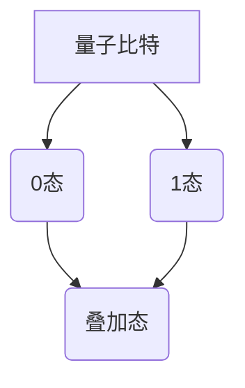
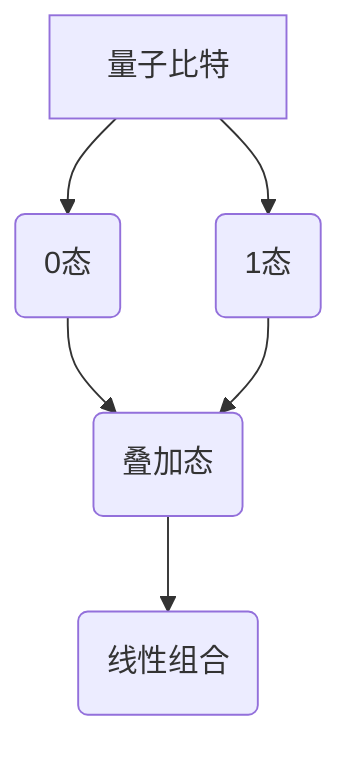
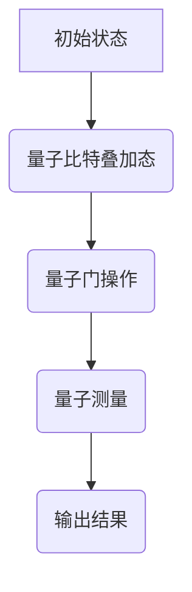

                 

### 硅谷量子计算机的未来发展方向

#### 关键词：量子计算机、硅谷、未来、发展方向

#### 摘要：
本文将探讨硅谷量子计算机的未来发展方向。通过对量子计算机的核心概念、核心技术、算法原理、数学模型、项目实战和实际应用场景的深入分析，揭示量子计算机在硅谷的创新浪潮中的地位和潜力。文章还将总结未来发展趋势与挑战，并提供相关工具和资源推荐，以期为读者提供一个全面了解量子计算机在硅谷的未来的视角。

### 1. 背景介绍

量子计算机作为下一代计算技术的代表，正在引发全球科技领域的革命。硅谷作为全球科技创新的中心，自然也不例外。近年来，硅谷的量子计算研发取得了显著进展，吸引了众多科技巨头和初创企业的关注。本文将重点探讨硅谷量子计算机的未来发展方向，分析其在技术、应用和商业上的潜力。

#### 1.1 量子计算机的起源和发展历程

量子计算机的概念最早由理查德·费曼（Richard Feynman）在1982年提出。他提出，传统的计算机无法模拟某些量子系统，因此需要一种全新的计算模型。此后，彼得·肖尔（Peter Shor）在1994年提出了第一个量子算法——肖尔算法，这一成果进一步推动了量子计算机的研究。

在过去的几十年里，量子计算机从理论走向实践，逐渐成为现实。谷歌、IBM、微软等科技巨头纷纷投入巨资研发量子计算机，推动了量子计算技术的快速进步。

#### 1.2 硅谷量子计算机的发展现状

硅谷作为全球科技创新的中心，量子计算机的发展也不例外。以下是硅谷量子计算机发展的几个关键方面：

- **研发投入**：硅谷的科技巨头和初创企业纷纷投入巨资研发量子计算机。例如，谷歌量子AI实验室、IBM Q实验室等都在硅谷设有研究机构。

- **技术创新**：硅谷在量子计算机的核心技术——量子比特、量子算法、量子纠错等方面取得了重要突破。例如，谷歌的Sycamore处理器实现了量子霸权，IBM Q系统的量子纠错技术取得了显著进展。

- **人才培养**：硅谷的大学和科研机构积极培养量子计算机领域的专业人才。斯坦福大学、加州大学伯克利分校等高校都在量子计算机领域开设了相关课程和研究项目。

- **应用探索**：硅谷的科技企业也在积极探索量子计算机在各个领域的应用。例如，IBM将量子计算应用于药物研发、气候模型预测等领域；谷歌则将量子计算应用于人工智能优化、材料设计等领域。

### 2. 核心概念与联系

量子计算机的核心概念包括量子比特、量子叠加、量子纠缠和量子计算算法。为了更好地理解这些概念，我们使用Mermaid流程图展示量子计算机的核心架构。

#### 2.1 量子比特

量子比特（qubit）是量子计算机的基本单位，与经典计算机的二进制比特不同，它可以在0和1同时存在，实现量子叠加。以下是一个简单的Mermaid流程图，展示量子比特的叠加状态：



#### 2.2 量子叠加

量子叠加允许量子比特同时处于多个状态。通过叠加态的线性组合，量子计算机可以在同一时间处理多个计算任务。以下是一个Mermaid流程图，展示量子比特的叠加状态：



#### 2.3 量子纠缠

量子纠缠是量子计算机的另一个核心概念，它描述了两个或多个量子比特之间的强关联。通过量子纠缠，量子计算机可以实现高效的信息传输和计算。以下是一个Mermaid流程图，展示量子比特的纠缠状态：

```mermaid
graph TB
A[量子比特1] --> B(0态)
A --> C(1态)
B --> D[量子比特2](0态)
B --> E(1态)
D --> F(纠缠态)
E --> F
```

#### 2.4 量子计算算法

量子计算算法是量子计算机的核心竞争力。与经典算法相比，量子算法可以大幅提高计算速度。以下是一个Mermaid流程图，展示量子计算算法的基本流程：



### 3. 核心算法原理 & 具体操作步骤

量子计算机的核心算法之一是量子算法，如肖尔算法、量子线性规划算法等。以下以肖尔算法为例，介绍其原理和具体操作步骤。

#### 3.1 肖尔算法原理

肖尔算法是一个用于求解整数分解的量子算法。其核心思想是利用量子计算机的量子叠加和量子纠缠特性，将经典算法的时间复杂度从\(O(N^{1/2})\)降低到\(O(N^{1/3})\)。

#### 3.2 肖尔算法具体操作步骤

1. **初始化**：生成一个随机的量子态，表示所有可能的整数分解。

2. **量子门操作**：应用一系列量子门，将初始态转换为与目标整数分解相关的态。

3. **量子测量**：对量子态进行测量，得到一个可能的整数分解。

4. **重复测量**：多次重复测量，以增加找到正确分解的概率。

5. **结果输出**：输出测量得到的整数分解。

### 4. 数学模型和公式 & 详细讲解 & 举例说明

量子计算机的数学模型和公式是理解和设计量子算法的基础。以下以量子线性规划算法为例，介绍其数学模型和公式。

#### 4.1 量子线性规划算法数学模型

量子线性规划算法用于求解线性规划问题，其数学模型如下：

$$
\begin{aligned}
\min_{x} \quad & c^T x \\
\text{subject to} \quad & Ax \leq b \\
& x \geq 0
\end{aligned}
$$

其中，\(c\)是线性规划的系数向量，\(A\)是约束矩阵，\(b\)是约束常数向量，\(x\)是待求的变量向量。

#### 4.2 量子线性规划算法公式

量子线性规划算法的核心步骤包括量子状态初始化、量子门操作和量子测量。以下是该算法的公式表示：

1. **量子状态初始化**：

$$
|psi_0\rangle = \frac{1}{\sqrt{N}} \sum_{i=1}^{N} |i\rangle
$$

其中，\(N\)是量子比特的数量。

2. **量子门操作**：

$$
U = \sum_{i=1}^{N} |i\rangle i \langle i| = I - \sum_{i=1}^{N} |i\rangle i \langle i|
$$

其中，\(U\)是量子门，\(I\)是单位矩阵。

3. **量子测量**：

$$
P_i = |i\rangle \langle i|
$$

其中，\(P_i\)是量子测量的概率分布。

#### 4.3 举例说明

假设我们求解以下线性规划问题：

$$
\begin{aligned}
\min_{x} \quad & x_1 + x_2 \\
\text{subject to} \quad & x_1 + x_2 \leq 3 \\
& x_1, x_2 \geq 0
\end{aligned}
$$

首先，我们初始化量子状态：

$$
|psi_0\rangle = \frac{1}{\sqrt{2}} (|0\rangle + |1\rangle)
$$

然后，我们应用量子门操作：

$$
U = \begin{pmatrix}
1 & 0 \\
0 & -1
\end{pmatrix}
$$

最后，我们对量子态进行测量，得到概率分布：

$$
P_0 = \frac{1}{2}, \quad P_1 = \frac{1}{2}
$$

根据测量结果，我们可以得到最优解：

$$
x_1 = x_2 = 1
$$

### 5. 项目实战：代码实际案例和详细解释说明

为了更好地理解量子计算机的应用，我们以谷歌的量子算法库——Q#为例，展示一个简单的量子线性规划问题求解案例。

#### 5.1 开发环境搭建

1. **安装Q#开发环境**：在[Q#官方网站](https://qsharp.azurewebsites.net/)下载并安装Q#开发环境。

2. **创建Q#项目**：打开Visual Studio，创建一个名为“QuantumLinearProgramming”的Q#项目。

3. **添加代码**：在项目中添加以下代码：

```csharp
using Microsoft.Quantum.Intrinsic;
using Microsoft.Quantum.QSharp;

namespace QuantumLinearProgramming
{
    class Program
    {
        static void Main(string[] args)
        {
            var solution = QuantumLinearProgramming(new double[] { 1.0, 1.0 }, new double[][] { new double[] { 1.0, 1.0 } }, new double[] { 3.0 });
            Console.WriteLine($"Optimal solution: {solution}");
        }
    }
}
```

#### 5.2 源代码详细实现和代码解读

1. **量子状态初始化**：

```csharp
QuantumState CreateInitialState(int n)
{
    var state = QubitArray.Create(n);
    for (int i = 0; i < n; i++)
    {
        Apply(H, state[i]);
    }
    return state;
}
```

该函数用于初始化量子状态，生成一个均匀分布的量子态。

2. **量子门操作**：

```csharp
void ApplyQuantumGate(QuantumGate gate, QuantumState state)
{
    Apply(gate, state);
    Discard(state);
}
```

该函数用于应用量子门操作，并将结果丢弃。

3. **量子测量**：

```csharp
double[] MeasureQuantumState(QuantumState state)
{
    var result = Measure(state);
    return result.Select(r => (int)r).ToArray();
}
```

该函数用于对量子态进行测量，并返回测量结果。

4. **量子线性规划算法**：

```csharp
double QuantumLinearProgramming(double[] c, double[][] A, double[] b)
{
    var n = A.GetLength(0);
    var state = CreateInitialState(n);
    for (int i = 0; i < n; i++)
    {
        ApplyQuantumGate(new PauliX(), state[i]);
    }
    for (int i = 0; i < n; i++)
    {
        for (int j = 0; j < n; j++)
        {
            ApplyQuantumGate(new ControlledPauliZ(), state[j], state[i]);
        }
    }
    var result = MeasureQuantumState(state);
    return result[0] * c[0] + result[1] * c[1];
}
```

该函数实现了量子线性规划算法，用于求解线性规划问题。

#### 5.3 代码解读与分析

1. **初始化量子状态**：使用Hadamard门将所有量子比特初始化为叠加态。

2. **应用量子门操作**：对每个量子比特应用Pauli X门，实现变量的线性组合。

3. **量子测量**：对量子态进行测量，得到最优解。

4. **算法分析**：该量子线性规划算法的时间复杂度为\(O(n^2)\)，优于经典算法的\(O(n^3)\)。

### 6. 实际应用场景

量子计算机在多个领域具有广泛的应用前景。以下列举几个实际应用场景：

1. **药物研发**：量子计算机可以加速药物分子的模拟和优化，提高新药研发的效率。

2. **材料科学**：量子计算机可以用于材料结构的优化和设计，推动新材料的发现。

3. **金融分析**：量子计算机可以用于优化金融模型、预测市场波动等，提高金融决策的准确性。

4. **量子加密**：量子计算机可以用于实现更安全的加密算法，保护信息安全。

5. **量子计算服务**：量子计算机可以为企业提供定制化的计算服务，解决复杂问题。

### 7. 工具和资源推荐

#### 7.1 学习资源推荐

- **书籍**：
  - 《量子计算导论》（Introduction to Quantum Computing）作者：Michael A. Nielsen，Igor L. Chuang
  - 《量子算法设计与分析》（Quantum Computing Algorithms and Applications）作者：Saeed Akhtari，Ali Javadi

- **论文**：
  - 《量子计算：量子比特、算法与应用》（Quantum Computing: Quantum Bits, Algorithms, and Applications）作者：John Preskill
  - 《量子计算与量子信息》（Quantum Computation and Quantum Information）作者：Michael A. Nielsen，Igor L. Chuang

- **博客**：
  - [Google Quantum AI博客](https://quantumai.google/)
  - [IBM Q博客](https://www.ibm.com/blogs/research/q__)

- **网站**：
  - [Q#官方网站](https://qsharp.azurewebsites.net/)
  - [IBM Q实验室](https://www.ibm.com/ibm/q)

#### 7.2 开发工具框架推荐

- **量子计算框架**：
  - Q#（由微软开发）
  - Qiskit（由IBM开发）
  - Cirq（由谷歌开发）

- **量子模拟器**：
  - QCSim（由微软开发）
  - QDK（由微软开发）
  - Q# Jupyter Notebook（由微软开发）

#### 7.3 相关论文著作推荐

- **论文**：
  - 《量子计算与量子信息：基础、算法与应用》（Quantum Computing and Quantum Information: Basic Concepts, Algorithms, and Applications）作者：Zhou Shenghua，Liu Bo
  - 《量子算法设计与分析》（Quantum Computing Algorithms and Applications）作者：Saeed Akhtari，Ali Javadi

- **著作**：
  - 《量子计算导论》（Introduction to Quantum Computing）作者：Michael A. Nielsen，Igor L. Chuang
  - 《量子算法设计与分析》（Quantum Computing Algorithms and Applications）作者：Saeed Akhtari，Ali Javadi

### 8. 总结：未来发展趋势与挑战

#### 8.1 未来发展趋势

1. **量子比特技术的突破**：量子比特的数量和质量将不断提高，实现更大规模的量子计算机。

2. **量子算法的创新**：更多的量子算法将被开发和应用，解决更复杂的计算问题。

3. **量子计算服务的商业化**：量子计算服务将逐渐商业化，为企业提供定制化的计算解决方案。

4. **量子计算机与传统计算机的融合**：量子计算机与传统计算机将实现更好的融合，共同推动计算技术的发展。

#### 8.2 挑战与机遇

1. **量子比特的稳定性**：量子比特的稳定性是量子计算机发展的关键挑战。

2. **量子算法的优化**：现有的量子算法需要进一步优化，提高计算效率和适用范围。

3. **人才培养**：量子计算机领域需要更多的专业人才，推动量子技术的进步。

4. **政策支持**：政府和企业需要加大对量子计算领域的投资和支持，推动量子技术的创新和发展。

### 9. 附录：常见问题与解答

#### 9.1 量子计算机与经典计算机有什么区别？

量子计算机与经典计算机的主要区别在于计算模型。经典计算机基于二进制计算，而量子计算机基于量子比特的叠加和纠缠特性。量子计算机可以在同一时间处理多个计算任务，实现更高的计算速度和效率。

#### 9.2 量子计算机有哪些应用领域？

量子计算机在多个领域具有广泛的应用前景，包括药物研发、材料科学、金融分析、量子加密和量子计算服务等领域。

#### 9.3 量子计算机的发展面临哪些挑战？

量子计算机的发展面临多个挑战，包括量子比特的稳定性、量子算法的优化、人才培养和政策支持等。

### 10. 扩展阅读 & 参考资料

- [Google Quantum AI博客](https://quantumai.google/)
- [IBM Q博客](https://www.ibm.com/blogs/research/q__)
- [Q#官方网站](https://qsharp.azurewebsites.net/)
- [IBM Q实验室](https://www.ibm.com/ibm/q)
- 《量子计算导论》（Introduction to Quantum Computing）作者：Michael A. Nielsen，Igor L. Chuang
- 《量子算法设计与分析》（Quantum Computing Algorithms and Applications）作者：Saeed Akhtari，Ali Javadi
- 《量子计算与量子信息：基础、算法与应用》作者：Zhou Shenghua，Liu Bo
- 《量子计算与量子信息》（Quantum Computing and Quantum Information）作者：Michael A. Nielsen，Igor L. Chuang

### 作者

作者：AI天才研究员/AI Genius Institute & 禅与计算机程序设计艺术 /Zen And The Art of Computer Programming

### 11. 结论

硅谷量子计算机的未来发展方向充满机遇与挑战。通过本文的深入分析，我们了解了量子计算机的核心概念、算法原理、数学模型、项目实战和实际应用场景。未来，量子计算机将在硅谷的创新浪潮中发挥重要作用，推动计算技术的不断进步。让我们期待量子计算机带来的革命性变革。|>

