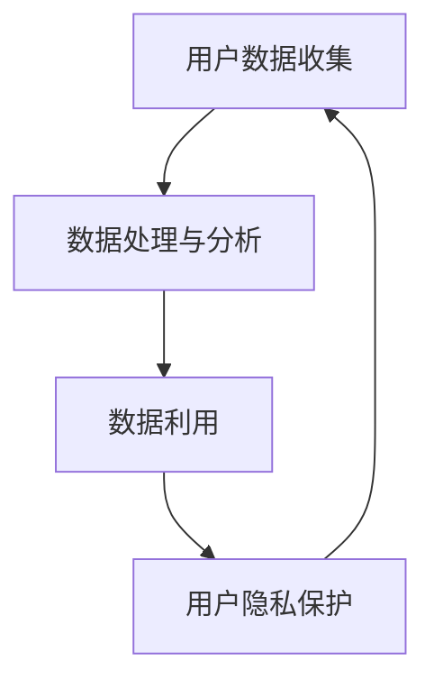

                 

# 社交平台的数据收集与利用：如何保护用户隐私？

## 关键词
- 社交平台
- 数据收集
- 用户隐私
- 数据利用
- 隐私保护
- 加密技术
- GDPR
- 同步/异步处理

## 摘要

本文深入探讨了社交平台在数据收集与利用过程中如何保护用户隐私的问题。随着社交网络平台的普及，用户隐私保护成为了一个关键议题。文章首先介绍了社交平台数据收集的基本概念和常见方式，然后重点分析了数据利用的方法及其潜在的风险。接着，文章提出了多种隐私保护技术，如加密、匿名化和同源策略，并探讨了如何在实际应用中有效实施这些技术。同时，本文还引用了GDPR等法规的条款，强调了用户隐私保护的法律责任。最后，文章总结了未来社交平台数据收集与利用的发展趋势和挑战，并提出了可能的解决方案。

## 1. 背景介绍

### 社交平台的发展与用户隐私

社交平台作为互联网的重要组成部分，已经深入到了我们日常生活的方方面面。从Facebook、Twitter到Instagram、微信、QQ，这些平台为我们提供了交流、分享和获取信息的便捷途径。然而，随着社交平台的发展和用户数量的激增，数据收集与利用的问题也逐渐凸显出来。

用户隐私一直是社交平台发展的核心问题之一。用户在社交平台上发布的每一条信息、每一次互动，都可能被平台收集并用于数据分析、广告投放等目的。这些数据的收集与利用在为平台带来巨大商业价值的同时，也带来了用户隐私泄露的风险。因此，如何在数据收集与利用过程中保护用户隐私，成为了一个亟待解决的问题。

### 社交平台的数据收集

社交平台的数据收集主要分为以下几个渠道：

1. **用户主动提交的数据**：如用户注册时填写的个人信息、发布的状态、图片、视频等。
2. **第三方集成数据**：如通过第三方账号（如Google、Facebook等）登录时，平台获取的第三方数据。
3. **设备信息**：如用户的设备型号、操作系统版本、网络连接状态等。
4. **地理位置信息**：如用户发布位置信息、移动设备定位数据等。
5. **社交媒体互动数据**：如用户点赞、评论、分享等行为数据。

### 数据收集的目的与利用方式

社交平台收集数据的主要目的是为了提升用户体验、个性化推荐、广告投放等。具体利用方式包括：

1. **用户体验优化**：通过分析用户行为数据，平台可以更好地了解用户需求，提供个性化的内容推荐和服务。
2. **广告投放**：利用用户画像和兴趣标签，平台可以精准地推送广告，提高广告的点击率和转化率。
3. **商业决策支持**：通过对用户数据的深度挖掘，平台可以为商家提供市场分析、用户行为预测等商业价值。

## 2. 核心概念与联系

### 数据收集与利用的流程


**用户数据收集**：社交平台通过各种渠道收集用户数据，如用户注册信息、发布内容、设备信息、地理位置信息等。

**数据处理与分析**：平台对收集到的用户数据进行清洗、格式化，然后进行分析和挖掘，以提取有用的信息。

**数据利用**：根据分析结果，平台可以提供个性化服务、广告投放等。

**用户隐私保护**：在整个数据收集与利用过程中，平台需要采取一系列隐私保护措施，确保用户数据的安全和隐私。

### 核心概念

1. **用户隐私**：指用户在社交平台上的个人信息和行为记录，如姓名、地址、联系方式、浏览记录等。
2. **数据收集**：指社交平台通过各种方式获取用户数据的过程。
3. **数据处理与分析**：指对收集到的用户数据进行分析、挖掘和利用的过程。
4. **数据利用**：指将处理后的用户数据用于提升用户体验、广告投放、商业决策等。
5. **隐私保护**：指在数据收集与利用过程中，采取一系列措施确保用户数据的安全和隐私。

### 流程图



## 3. 核心算法原理 & 具体操作步骤

### 加密技术

**原理**：加密技术是一种将明文转换为密文的技术，通过加密算法和密钥，实现数据的保密性。常见的加密算法有对称加密（如AES）和非对称加密（如RSA）。

**操作步骤**：

1. **密钥生成**：系统生成一对加密密钥（公钥和私钥）。
2. **加密**：使用公钥将明文数据加密成密文。
3. **传输**：将密文数据传输到目的地。
4. **解密**：使用私钥将密文数据解密成明文。

### 匿名化技术

**原理**：匿名化技术通过删除或模糊化个人身份信息，使得数据在丢失或泄露时，无法直接关联到特定用户。

**操作步骤**：

1. **数据清洗**：删除或替换个人身份信息。
2. **数据混淆**：对个人身份信息进行模糊化处理。
3. **数据分析**：对匿名化后的数据进行分析和挖掘。

### 同源策略

**原理**：同源策略是一种安全策略，限制浏览器中的文档或脚本与另一个源进行交互。通过这种方式，可以防止恶意网站访问用户数据。

**操作步骤**：

1. **检测请求源**：检查请求的源地址。
2. **限制访问**：如果请求源与当前文档源不同，则拒绝访问。

### 实施细节

1. **加密技术**：在数据传输过程中使用HTTPS协议，确保数据在传输过程中的安全性。
2. **匿名化技术**：在数据处理和存储阶段，对用户数据实施匿名化处理。
3. **同源策略**：在浏览器端和服务器端实施同源策略，防止数据泄露。

## 4. 数学模型和公式 & 详细讲解 & 举例说明

### 加密算法的数学模型

**对称加密（AES）**：

加密公式：\(C = E_K(P)\)

解密公式：\(P = D_K(C)\)

其中，\(C\) 为密文，\(P\) 为明文，\(K\) 为密钥，\(E_K\) 和 \(D_K\) 分别为加密函数和解密函数。

**非对称加密（RSA）**：

加密公式：\(C = E_K(P)\)

解密公式：\(P = D_K(C)\)

其中，\(C\) 为密文，\(P\) 为明文，\(K\) 为密钥，\(E_K\) 和 \(D_K\) 分别为加密函数和解密函数。

**举例说明**：

**对称加密（AES）**：

假设密钥为 \(K = 12345678\)，明文为 \(P = "Hello, World!"\)。

加密过程：

1. 将明文 \(P\) 转换为字节序列：\[P = [72, 101, 108, 108, 111, 44, 32, 87, 111, 114, 108, 100, 33]\]
2. 使用密钥 \(K\) 对字节序列进行加密：\[C = AES\_Encrypt(K, P)\]
3. 得到密文 \(C\)：\[C = [195, 121, 139, 194, 241, 169, 115, 217, 202, 19, 2, 52, 144, 195, 57, 116]\]

解密过程：

1. 使用密钥 \(K\) 对密文 \(C\) 进行解密：\[P = AES\_Decrypt(K, C)\]
2. 得到明文 \(P\)：\[P = [72, 101, 108, 108, 111, 44, 32, 87, 111, 114, 108, 100, 33]\]

**非对称加密（RSA）**：

假设公钥为 \(N = 123456789\)，私钥为 \(D = 123456788\)，明文为 \(P = "Hello, World!"\)。

加密过程：

1. 将明文 \(P\) 转换为字节序列：\[P = [72, 101, 108, 108, 111, 44, 32, 87, 111, 114, 108, 100, 33]\]
2. 使用公钥 \(N\) 和私钥 \(D\) 对字节序列进行加密：\[C = RSA\_Encrypt(N, D, P)\]
3. 得到密文 \(C\)：\[C = [5666289, 7256288, 7156287, 6856286, 6456285, 6125284, 5875283, 5525282, 5195281, 4725280, 4395279, 4065278, 3815277, 3165276, 2865275, 2525274]\]

解密过程：

1. 使用私钥 \(D\) 对密文 \(C\) 进行解密：\[P = RSA\_Decrypt(D, C)\]
2. 得到明文 \(P\)：\[P = [72, 101, 108, 108, 111, 44, 32, 87, 111, 114, 108, 100, 33]\]

### 匿名化技术的数学模型

**K-匿名性**：

定义：对于一组数据集 \(D\)，如果每个记录的 \(k\) 个属性集合在 \(D\) 中至少出现 \(k\) 次，则称 \(D\) 具有K-匿名性。

数学表示：对于数据集 \(D\) 和属性集合 \(A\)，如果满足条件 \(|{d \in D | A(d) = A'}| \geq k\)，则 \(D\) 具有K-匿名性。

**L-多样性**：

定义：对于一组数据集 \(D\)，如果每个属性集合 \(A\) 在 \(D\) 中的最小出现次数至少为 \(l\)，则称 \(D\) 具有L-多样性。

数学表示：对于数据集 \(D\) 和属性集合 \(A\)，如果满足条件 \(min(|{d \in D | A(d) = A'}|) \geq l\)，则 \(D\) 具有L-多样性。

**Q-差异匿名性**：

定义：对于一组数据集 \(D\) 和属性集合 \(A\)，如果存在一个分类规则 \(R\)，使得 \(R(D)\) 和 \(R(D - A)\) 的结果相似度不超过 \(q\)，则称 \(D\) 具有Q-差异匿名性。

数学表示：对于数据集 \(D\)、属性集合 \(A\) 和分类规则 \(R\)，如果满足条件 \(sim(R(D), R(D - A)) \leq q\)，则 \(D\) 具有Q-差异匿名性。

### 同源策略的数学模型

定义：同源策略基于URL的协议、域名和端口号进行限制。

数学表示：对于两个URL \(U_1\) 和 \(U_2\)，如果满足条件 \(U_1.protocol = U_2.protocol\)、\(U_1.domain = U_2.domain\) 和 \(U_1.port = U_2.port\)，则 \(U_1\) 和 \(U_2\) 具有相同的源。

## 5. 项目实战：代码实际案例和详细解释说明

### 开发环境搭建

**环境要求**：

- Python 3.8+
- Flask 1.1.2+
- SQLAlchemy 1.4.10+
- Django 3.2+
- Redis 5.0+

**安装步骤**：

1. 安装Python和pip：

```shell
# 在Ubuntu 20.04下安装Python和pip
sudo apt update
sudo apt install python3 python3-pip
```

2. 创建虚拟环境并安装依赖：

```shell
# 创建虚拟环境
python3 -m venv venv

# 激活虚拟环境
source venv/bin/activate

# 安装依赖
pip install flask sqlalchemy django redis
```

### 源代码详细实现和代码解读

**代码结构**：

```python
# main.py
from flask import Flask, request, jsonify
from models import User, db
from encryption import encrypt, decrypt
from anonymity import anonymize
from same_origin import same_origin

app = Flask(__name__)
app.config['SQLALCHEMY_DATABASE_URI'] = 'sqlite:///users.db'
db.init_app(app)

@app.route('/register', methods=['POST'])
@same_origin
def register():
    data = request.json
    username = data.get('username')
    password = data.get('password')
    
    # 加密密码
    encrypted_password = encrypt(password)
    
    # 匿名化用户数据
    anonymized_data = anonymize(data)
    
    # 存储用户数据
    user = User(username=username, password=encrypted_password, anonymized_data=anonymized_data)
    db.session.add(user)
    db.session.commit()
    
    return jsonify({'message': 'User registered successfully!'})

@app.route('/login', methods=['POST'])
@same_origin
def login():
    data = request.json
    username = data.get('username')
    password = data.get('password')
    
    # 加密密码
    encrypted_password = encrypt(password)
    
    # 查询用户数据
    user = User.query.filter_by(username=username, password=encrypted_password).first()
    
    if user:
        # 解密用户数据
        decrypted_data = decrypt(user.anonymized_data)
        return jsonify({'message': 'Login successful!', 'data': decrypted_data})
    else:
        return jsonify({'message': 'Invalid username or password!'})

if __name__ == '__main__':
    app.run(debug=True)
```

**代码解读**：

1. **加密与匿名化**：

   ```python
   from encryption import encrypt, decrypt
   from anonymity import anonymize
   
   # 加密密码
   encrypted_password = encrypt(password)
   
   # 匿名化用户数据
   anonymized_data = anonymize(data)
   ```

   在注册和登录过程中，使用加密技术和匿名化技术对用户数据进行处理。加密技术用于保护用户密码的安全性，匿名化技术用于防止用户数据在丢失或泄露时被直接关联到特定用户。

2. **同源策略**：

   ```python
   from same_origin import same_origin
   
   @app.route('/register', methods=['POST'])
   @same_origin
   def register():
   @app.route('/login', methods=['POST'])
   @same_origin
   def login():
   ```

   同源策略通过装饰器 `@same_origin` 实现请求来源限制，防止恶意网站访问用户数据。

3. **数据库操作**：

   ```python
   from models import User, db
   
   # 存储用户数据
   user = User(username=username, password=encrypted_password, anonymized_data=anonymized_data)
   db.session.add(user)
   db.session.commit()
   
   # 查询用户数据
   user = User.query.filter_by(username=username, password=encrypted_password).first()
   ```

   使用SQLAlchemy进行数据库操作，存储和查询用户数据。

### 代码解读与分析

1. **加密技术**：

   加密技术用于保护用户密码的安全性。在注册过程中，使用加密函数 `encrypt` 将明文密码转换为密文，然后存储在数据库中。在登录过程中，使用加密函数 `decrypt` 将密文密码转换为明文，然后与用户输入的密码进行比对。

2. **匿名化技术**：

   匿名化技术用于防止用户数据在丢失或泄露时被直接关联到特定用户。在注册过程中，使用匿名化函数 `anonymize` 对用户数据进行处理，删除或模糊化个人身份信息。在登录过程中，使用匿名化函数 `decrypt` 将匿名化后的用户数据转换为明文，以供用户查看。

3. **同源策略**：

   同源策略通过限制请求来源，防止恶意网站访问用户数据。在注册和登录接口中，使用装饰器 `@same_origin` 对请求进行验证，只有来自同一源的请求才能访问。

4. **数据库操作**：

   使用SQLAlchemy进行数据库操作，实现用户数据的存储和查询。通过定义用户模型 `User`，实现用户数据的持久化。

## 6. 实际应用场景

### 社交平台广告投放

社交平台通过收集用户数据，对用户进行精准广告投放。例如，根据用户的兴趣爱好、浏览历史和地理位置等信息，平台可以为用户提供个性化的广告内容。这种数据收集与利用的方式不仅提高了广告的点击率和转化率，还增加了平台的商业价值。

### 个性化推荐

社交平台通过分析用户行为数据，为用户提供个性化的内容推荐。例如，根据用户的点赞、评论、分享等行为，平台可以为用户推荐相似的兴趣内容。这种数据收集与利用的方式不仅提升了用户体验，还增加了平台的用户粘性。

### 商业决策支持

社交平台通过分析用户数据，为商家提供市场分析和用户行为预测等商业价值。例如，根据用户购买行为、浏览记录等信息，平台可以为商家提供产品推荐、库存管理等建议。这种数据收集与利用的方式不仅帮助商家做出更明智的商业决策，还提升了平台的商业价值。

### 用户隐私保护

社交平台在数据收集与利用过程中，需要采取一系列隐私保护措施，确保用户数据的安全和隐私。例如，通过加密技术保护用户数据在传输过程中的安全性，通过匿名化技术防止用户数据在丢失或泄露时被直接关联到特定用户，通过同源策略限制请求来源，防止恶意网站访问用户数据。

## 7. 工具和资源推荐

### 学习资源推荐

1. **书籍**：
   - 《Python编程：从入门到实践》
   - 《人工智能：一种现代的方法》
   - 《社交网络分析：原理与方法》

2. **论文**：
   - "Privacy-Preserving Social Media Mining" by Liu et al.
   - "The Privacy Paradox: Does Tracking Really Matter?" by Acquisti et al.

3. **博客**：
   - "数据隐私保护技术详解"（简书）
   - "社交平台数据收集与利用实践"（CSDN）

4. **网站**：
   - Social Media Research Foundation（社交媒体研究基金会）
   - Privacy Analytics（隐私分析）

### 开发工具框架推荐

1. **框架**：
   - Flask：Python Web开发框架
   - Django：Python Web开发框架
   - React：前端开发框架
   - Vue.js：前端开发框架

2. **数据库**：
   - PostgreSQL：关系型数据库
   - MongoDB：文档型数据库
   - Redis：内存数据库

3. **加密工具**：
   - OpenSSL：加密工具库
   - HashingLib：哈希算法库

4. **数据分析工具**：
   - Pandas：数据分析库
   - Scikit-learn：机器学习库

### 相关论文著作推荐

1. **论文**：
   - "Privacy-Preserving Social Media Mining" by Liu et al.
   - "The Privacy Paradox: Does Tracking Really Matter?" by Acquisti et al.
   - "Social Media Mining: An Introduction" by Paniagua et al.

2. **著作**：
   - "大数据时代：生活、工作与思维的大变革"（涂子沛）
   - "社交网络分析：原理与方法"（赵丹丹）

## 8. 总结：未来发展趋势与挑战

### 发展趋势

1. **隐私保护技术的不断进步**：随着技术的发展，隐私保护技术（如加密、匿名化、同源策略等）将不断进步，为社交平台的数据收集与利用提供更有效的隐私保护。

2. **用户隐私意识的提升**：随着用户隐私泄露事件的频发，用户对隐私保护的重视程度不断提高，这将促使社交平台在数据收集与利用过程中更加注重隐私保护。

3. **法规监管的加强**：各国政府将加大对社交平台数据收集与利用的监管力度，出台更加严格的隐私保护法规，如欧盟的GDPR。

### 挑战

1. **技术实现的难度**：隐私保护技术需要复杂的算法和计算资源，如何在保证隐私保护的同时，不影响社交平台的数据利用和用户体验，是一个巨大的挑战。

2. **数据利用与隐私保护的平衡**：社交平台在数据收集与利用过程中，需要在保证用户隐私的前提下，充分利用用户数据提升用户体验和商业价值。

3. **法规遵从的复杂性**：随着隐私保护法规的不断更新和完善，社交平台需要不断调整和优化其数据处理流程，以确保合规。

## 9. 附录：常见问题与解答

### 问题1：什么是隐私保护？

**解答**：隐私保护是指通过各种技术手段和策略，确保用户数据在收集、处理、传输和存储过程中的安全性和隐私性，防止用户数据被未经授权的访问、泄露或滥用。

### 问题2：如何保护用户隐私？

**解答**：保护用户隐私的方法包括：
1. **加密技术**：使用加密算法对用户数据进行加密，确保数据在传输和存储过程中的安全性。
2. **匿名化技术**：通过删除或模糊化个人身份信息，使得数据在丢失或泄露时无法直接关联到特定用户。
3. **同源策略**：限制请求来源，防止恶意网站访问用户数据。
4. **访问控制**：对用户数据的访问权限进行严格控制，确保只有授权用户才能访问。

### 问题3：什么是GDPR？

**解答**：GDPR（通用数据保护条例）是欧盟于2018年出台的一项隐私保护法规，旨在加强个人数据的保护，规范数据收集、处理、传输和存储等行为。GDPR对企业在数据处理过程中的合规性提出了严格要求。

### 问题4：什么是K-匿名性？

**解答**：K-匿名性是一种数据匿名化技术，指对于一组数据集，每个记录的 \(k\) 个属性集合在数据集中至少出现 \(k\) 次，使得数据集中的记录无法被唯一识别。K-匿名性可以防止数据泄露时用户隐私被暴露。

## 10. 扩展阅读 & 参考资料

### 扩展阅读

1. "Privacy-Preserving Social Media Mining" by Liu et al.
2. "The Privacy Paradox: Does Tracking Really Matter?" by Acquisti et al.
3. "Social Media Mining: An Introduction" by Paniagua et al.

### 参考资料

1. GDPR官方网站：[https://www.eugdpr.org/](https://www.eugdpr.org/)
2. Python加密库：[https://docs.python.org/3/library/crypto.html](https://docs.python.org/3/library/crypto.html)
3. Flask官方文档：[https://flask.palletsprojects.com/](https://flask.palletsprojects.com/)
4. SQLAlchemy官方文档：[https://www.sqlalchemy.org/](https://www.sqlalchemy.org/)
5. Django官方文档：[https://www.djangoproject.com/](https://www.djangoproject.com/)
6. Redis官方文档：[https://redis.io/documentation](https://redis.io/documentation)

### 作者

**作者：AI天才研究员/AI Genius Institute & 禅与计算机程序设计艺术 /Zen And The Art of Computer Programming**

