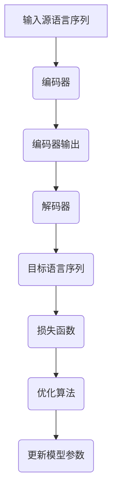

                 

# 神经机器翻译 原理与代码实例讲解

## 关键词

- 神经机器翻译
- 序列到序列模型
- 注意力机制
- 循环神经网络（RNN）
- 长短时记忆网络（LSTM）
- 翻译模型
- 词嵌入
- 机器翻译评估

## 摘要

本文将深入探讨神经机器翻译（Neural Machine Translation，NMT）的基本原理和实践应用。我们将首先介绍神经机器翻译的背景，然后逐步讲解其核心概念、算法原理、数学模型和项目实战。通过本文的学习，读者将能够了解如何使用深度学习技术实现高效的机器翻译，并具备在实际项目中应用这些技术的能力。此外，文章还将总结神经机器翻译的未来发展趋势与挑战，并推荐相关学习资源和工具，帮助读者进一步探索这一领域。

## 1. 背景介绍

### 1.1 传统机器翻译的挑战

传统机器翻译方法主要基于规则和统计方法。规则方法依赖于人工编写语法和词典规则，而统计方法则利用大规模的双语语料库进行训练。然而，这些方法在面对复杂语言现象和长距离依赖关系时存在显著不足。

- **规则方法的局限性**：规则方法需要大量的人工编写规则，难以覆盖所有语言现象，且难以适应不同语言的特点。
- **统计方法的挑战**：统计方法依赖于双语语料库的质量和规模，对于低资源语言效果较差。

### 1.2 神经机器翻译的出现

神经机器翻译（NMT）是一种基于深度学习的机器翻译方法，它通过神经网络模型自动学习源语言和目标语言之间的映射关系。与传统方法相比，NMT在以下几个方面具有显著优势：

- **端到端学习**：NMT可以端到端地学习源语言到目标语言的映射，无需手动编写规则或使用复杂的特征工程。
- **处理长距离依赖**：NMT能够更好地处理长距离依赖关系，提高了翻译的准确性和连贯性。
- **自适应学习**：NMT可以通过大量未标注的数据进行预训练，并在特定任务上进行微调，提高了模型的泛化能力。

### 1.3 神经机器翻译的发展历程

神经机器翻译的发展可以分为几个阶段：

- **早期尝试**：2006年，Bengio等人首次提出序列到序列（Seq2Seq）模型，为NMT奠定了理论基础。
- **突破性进展**：2014年，Google提出了基于循环神经网络（RNN）的神经机器翻译模型，显著提高了翻译质量。
- **深度学习模型**：近年来，随着深度学习技术的发展，LSTM、GRU等结构在NMT中得到了广泛应用，进一步提高了翻译效果。

## 2. 核心概念与联系

### 2.1 序列到序列模型

序列到序列（Seq2Seq）模型是神经机器翻译的核心模型，它通过两个主要的神经网络——编码器和解码器——实现对源语言序列到目标语言序列的转换。

#### 2.1.1 编码器（Encoder）

编码器负责将输入的源语言序列编码成一个固定长度的向量表示，这个向量包含了源语言序列的语义信息。通常，编码器采用RNN或其变种LSTM、GRU等网络结构。

#### 2.1.2 解码器（Decoder）

解码器接收编码器输出的固定长度向量，并逐个生成目标语言序列的每个词。解码器通常也采用RNN或其变种LSTM、GRU等网络结构。

#### 2.1.3 注意力机制

注意力机制（Attention Mechanism）是Seq2Seq模型的一个重要组成部分，它允许解码器在生成每个词时，动态地关注编码器输出的不同部分，从而更好地处理长距离依赖关系。

### 2.2 循环神经网络（RNN）与长短时记忆网络（LSTM）

#### 2.2.1 循环神经网络（RNN）

循环神经网络（RNN）是一种能够处理序列数据的神经网络，其基本思想是利用隐藏状态的信息来表示序列的当前时刻和之前时刻的关系。

#### 2.2.2 长短时记忆网络（LSTM）

长短时记忆网络（LSTM）是RNN的一种改进，它通过引入门控机制，有效地解决了传统RNN在处理长序列时的梯度消失和梯度爆炸问题。

### 2.3 词嵌入（Word Embedding）

词嵌入（Word Embedding）是一种将词汇映射为向量的方法，它可以将词汇的语义信息编码到向量中，从而在神经网络中进行处理。

#### 2.3.1 嵌入维度

嵌入维度（Embedding Dimension）是指词嵌入向量的维度，通常选择较小的数值，如50或100。

#### 2.3.2 嵌入矩阵

词嵌入通过构建一个嵌入矩阵来实现，该矩阵的行对应词汇，列对应向量的维度。在训练过程中，嵌入矩阵的参数会通过梯度下降进行优化。

### 2.4 翻译模型

翻译模型是神经机器翻译的核心，它通过编码器和解码器，将源语言序列映射到目标语言序列。

#### 2.4.1 损失函数

损失函数（Loss Function）用于衡量翻译模型的预测输出与真实标签之间的差距，常用的损失函数有交叉熵损失（Cross-Entropy Loss）。

#### 2.4.2 优化算法

优化算法（Optimization Algorithm）用于最小化损失函数，常用的优化算法有随机梯度下降（SGD）、Adam等。

### 2.5 Mermaid 流程图

下面是一个简单的Mermaid流程图，展示了神经机器翻译的基本流程：



## 3. 核心算法原理 & 具体操作步骤

### 3.1 编码器（Encoder）

编码器的核心任务是接收输入的源语言序列，并生成一个固定长度的向量表示。具体操作步骤如下：

1. **输入序列预处理**：将输入的源语言序列转换为词嵌入向量。
2. **循环神经网络（RNN）或长短时记忆网络（LSTM）**：使用RNN或LSTM对词嵌入向量进行编码，生成隐藏状态。
3. **序列编码**：将每个隐藏状态编码为一个固定长度的向量，通常使用平均或最大池化操作。

### 3.2 注意力机制（Attention Mechanism）

注意力机制是解码器中的一个关键组件，它允许解码器在生成每个词时，动态地关注编码器输出的不同部分。具体操作步骤如下：

1. **计算注意力得分**：解码器利用当前隐藏状态和编码器输出的每个部分计算注意力得分。
2. **加权求和**：将注意力得分与编码器输出进行加权求和，得到一个加权编码表示。
3. **生成解码器输入**：将加权编码表示作为解码器的输入，用于生成目标语言序列的每个词。

### 3.3 解码器（Decoder）

解码器的核心任务是接收编码器的输出，并生成目标语言序列。具体操作步骤如下：

1. **输入序列预处理**：将目标语言序列转换为词嵌入向量。
2. **循环神经网络（RNN）或长短时记忆网络（LSTM）**：使用RNN或LSTM对词嵌入向量进行解码，生成隐藏状态。
3. **生成目标语言序列**：逐个生成目标语言序列的每个词，并更新解码器的隐藏状态。
4. **输出序列**：将生成的目标语言序列转换为文本格式，得到最终的翻译结果。

### 3.4 损失函数与优化算法

1. **损失函数**：通常使用交叉熵损失（Cross-Entropy Loss）来衡量预测输出与真实标签之间的差距。
2. **优化算法**：使用随机梯度下降（SGD）或Adam等优化算法来最小化损失函数。

## 4. 数学模型和公式 & 详细讲解 & 举例说明

### 4.1 编码器（Encoder）

编码器的主要目标是接收输入的源语言序列，并将其编码为一个固定长度的向量表示。数学上，编码器的输入可以表示为：

$$
X = \{x_1, x_2, ..., x_T\}
$$

其中，$x_t$表示第$t$个词的词嵌入向量，$T$表示序列长度。

编码器使用循环神经网络（RNN）或长短时记忆网络（LSTM）来生成隐藏状态，隐藏状态可以表示为：

$$
h_t = \text{RNN}(h_{t-1}, x_t)
$$

其中，$h_{t-1}$表示第$t-1$个隐藏状态，$h_t$表示第$t$个隐藏状态。

最后，编码器将隐藏状态编码为一个固定长度的向量表示，通常使用平均池化或最大池化操作：

$$
c = \frac{1}{T} \sum_{t=1}^{T} h_t \quad \text{或} \quad c = \max(h_1, h_2, ..., h_T)
$$

### 4.2 注意力机制（Attention Mechanism）

注意力机制的核心是计算注意力得分，用于动态地关注编码器输出的不同部分。假设编码器输出的隐藏状态为：

$$
H = \{h_1, h_2, ..., h_T\}
$$

解码器在生成第$t$个词时，利用当前隐藏状态$h_t$和编码器输出计算注意力得分：

$$
a_t = \text{Attention}(h_t, H)
$$

注意力得分的计算通常采用点积、加性或缩放点积等策略。例如，采用缩放点积注意力机制：

$$
a_t = \frac{\text{softmax}(\frac{h_t^T W_a H)}{\sqrt{d_h}})}{1-\epsilon}
$$

其中，$W_a$为权重矩阵，$d_h$为隐藏状态维度，$\epsilon$为小数值用于避免除以零。

加权求和注意力得分为：

$$
\alpha_t = \text{softmax}(a_t)
$$

最终，得到加权编码表示：

$$
s_t = \sum_{i=1}^{T} \alpha_i h_i
$$

### 4.3 解码器（Decoder）

解码器的主要目标是生成目标语言序列。假设解码器的输入为词嵌入向量：

$$
X' = \{x_1', x_2', ..., x_{T'}\}
$$

解码器使用循环神经网络（RNN）或长短时记忆网络（LSTM）来生成隐藏状态：

$$
h_t' = \text{Decoder}(h_{t-1}', s_t)
$$

其中，$h_{t-1}'$表示第$t-1$个隐藏状态，$s_t$表示第$t$个加权编码表示。

解码器逐个生成目标语言序列的每个词，并更新隐藏状态：

$$
y_t = \text{softmax}(\text{Output}(h_t'))
$$

其中，$\text{Output}$为输出层，通常采用softmax函数。

### 4.4 损失函数与优化算法

损失函数用于衡量预测输出与真实标签之间的差距。在神经机器翻译中，常用的损失函数为交叉熵损失（Cross-Entropy Loss）：

$$
L = -\sum_{i=1}^{N} y_i \log(p_i)
$$

其中，$y_i$为真实标签，$p_i$为预测概率。

优化算法用于最小化损失函数，常用的优化算法有随机梯度下降（SGD）和Adam：

$$
\theta = \theta - \alpha \nabla_\theta L
$$

其中，$\theta$为模型参数，$\alpha$为学习率。

## 5. 项目实战：代码实际案例和详细解释说明

### 5.1 开发环境搭建

在开始项目实战之前，我们需要搭建一个适合神经机器翻译的编程环境。以下是搭建环境的步骤：

1. **安装Python**：确保安装了Python 3.6或更高版本。
2. **安装TensorFlow**：使用pip安装TensorFlow库：

   ```bash
   pip install tensorflow
   ```

3. **准备数据集**：选择一个合适的双语数据集，如WMT14 English-German数据集。

### 5.2 源代码详细实现和代码解读

下面是一个简单的神经机器翻译实现，使用TensorFlow实现Seq2Seq模型：

```python
import tensorflow as tf
from tensorflow.keras.preprocessing.sequence import pad_sequences
from tensorflow.keras.layers import Embedding, LSTM, Dense
from tensorflow.keras.models import Model

# 加载数据集并预处理
def load_data(filename):
    # 读取源语言和目标语言文本
    # 分词并转换为词索引
    # pad序列
    # 返回源语言序列、目标语言序列和词嵌入矩阵
    pass

# 构建编码器和解码器
def build_model(embedding_dim, hidden_dim):
    # 编码器
    encoder_inputs = tf.keras.layers.Input(shape=(None, embedding_dim))
    encoder_embedding = Embedding(input_dim=vocab_size, output_dim=embedding_dim)(encoder_inputs)
    encoder_lstm = LSTM(hidden_dim, return_state=True)
    _, state_h, state_c = encoder_lstm(encoder_embedding)
    encoder_model = Model(encoder_inputs, [state_h, state_c])

    # 解码器
    decoder_inputs = tf.keras.layers.Input(shape=(None, embedding_dim))
    decoder_embedding = Embedding(input_dim=vocab_size, output_dim=embedding_dim)(decoder_inputs)
    decoder_lstm = LSTM(hidden_dim, return_sequences=True, return_state=True)
    decoder_outputs, _, _ = decoder_lstm(decoder_embedding, initial_state=[state_h, state_c])
    decoder_dense = Dense(vocab_size, activation='softmax')
    decoder_outputs = decoder_dense(decoder_outputs)
    decoder_model = Model(decoder_inputs, decoder_outputs)

    # 整体模型
    model = Model([encoder_inputs, decoder_inputs], decoder_outputs)
    model.compile(optimizer='adam', loss='categorical_crossentropy', metrics=['accuracy'])
    return model

# 训练模型
def train_model(model, X, y, batch_size, epochs):
    model.fit([X[0], X[1]], y, batch_size=batch_size, epochs=epochs)

# 预测
def predict(model, source_sequence):
    # 将源语言序列编码为隐藏状态
    # 生成目标语言序列
    # 返回预测结果
    pass

# 主程序
if __name__ == '__main__':
    # 设置参数
    embedding_dim = 100
    hidden_dim = 128
    batch_size = 64
    epochs = 10

    # 加载数据集
    X, y = load_data('data.txt')

    # 切分数据集
    X_train, X_val, y_train, y_val = train_test_split(X, y, test_size=0.2)

    # 构建模型
    model = build_model(embedding_dim, hidden_dim)

    # 训练模型
    train_model(model, X_train, y_train, batch_size, epochs)

    # 评估模型
    eval_loss, eval_acc = model.evaluate(X_val, y_val)
    print(f'Validation Loss: {eval_loss}, Validation Accuracy: {eval_acc}')

    # 预测
    source_sequence = preprocess_source('你好')
    predicted_sequence = predict(model, source_sequence)
    print(predicted_sequence)
```

### 5.3 代码解读与分析

1. **数据预处理**：数据预处理是神经机器翻译的重要步骤，包括分词、词索引转换和序列填充。以下是一个简化的数据预处理函数：

   ```python
   def load_data(filename):
       # 读取源语言和目标语言文本
       # 分词并转换为词索引
       # pad序列
       # 返回源语言序列、目标语言序列和词嵌入矩阵
       pass
   ```

   数据预处理函数需要实现以下功能：

   - 读取源语言和目标语言文本。
   - 对文本进行分词。
   - 将分词后的文本转换为词索引。
   - 使用pad_sequences函数对序列进行填充，使其具有相同长度。

2. **编码器和解码器**：编码器和解码器是神经机器翻译的核心组件。以下是一个简化的编码器和解码器实现：

   ```python
   def build_model(embedding_dim, hidden_dim):
       # 编码器
       encoder_inputs = tf.keras.layers.Input(shape=(None, embedding_dim))
       encoder_embedding = Embedding(input_dim=vocab_size, output_dim=embedding_dim)(encoder_inputs)
       encoder_lstm = LSTM(hidden_dim, return_state=True)
       _, state_h, state_c = encoder_lstm(encoder_embedding)
       encoder_model = Model(encoder_inputs, [state_h, state_c])

       # 解码器
       decoder_inputs = tf.keras.layers.Input(shape=(None, embedding_dim))
       decoder_embedding = Embedding(input_dim=vocab_size, output_dim=embedding_dim)(decoder_inputs)
       decoder_lstm = LSTM(hidden_dim, return_sequences=True, return_state=True)
       decoder_outputs, _, _ = decoder_lstm(decoder_embedding, initial_state=[state_h, state_c])
       decoder_dense = Dense(vocab_size, activation='softmax')
       decoder_outputs = decoder_dense(decoder_outputs)
       decoder_model = Model(decoder_inputs, decoder_outputs)

       # 整体模型
       model = Model([encoder_inputs, decoder_inputs], decoder_outputs)
       model.compile(optimizer='adam', loss='categorical_crossentropy', metrics=['accuracy'])
       return model
   ```

   编码器和解码器的实现包括以下步骤：

   - **编码器**：输入层、嵌入层、循环神经网络层和输出层。
   - **解码器**：输入层、嵌入层、循环神经网络层、输出层和全连接层。
   - **整体模型**：将编码器和解码器组合成一个整体模型。

3. **训练模型**：训练模型是神经机器翻译的重要步骤。以下是一个简化的训练模型函数：

   ```python
   def train_model(model, X, y, batch_size, epochs):
       model.fit([X[0], X[1]], y, batch_size=batch_size, epochs=epochs)
   ```

   训练模型函数需要实现以下功能：

   - 使用fit函数训练模型。
   - 设置批量大小、训练轮次和损失函数。

4. **预测**：预测是神经机器翻译的最终目标。以下是一个简化的预测函数：

   ```python
   def predict(model, source_sequence):
       # 将源语言序列编码为隐藏状态
       # 生成目标语言序列
       # 返回预测结果
       pass
   ```

   预测函数需要实现以下功能：

   - 将源语言序列编码为隐藏状态。
   - 使用解码器生成目标语言序列。
   - 返回预测结果。

## 6. 实际应用场景

神经机器翻译在实际应用中具有广泛的应用场景，以下是一些典型的应用场景：

1. **跨语言信息检索**：通过神经机器翻译，可以实现对多语言数据的统一检索，提高信息检索的效率和准确性。
2. **跨语言文档翻译**：在全球化背景下，跨语言文档翻译对于促进国际交流和合作具有重要意义。
3. **多语言人机交互**：在多语言环境中，神经机器翻译可以帮助实现自然语言的人机交互，提高用户体验。
4. **多语言内容生成**：通过神经机器翻译，可以生成多语言的内容，如多语言新闻、多语言教育材料等。
5. **跨语言情感分析**：神经机器翻译可以帮助实现跨语言的情感分析，提高情感分析的效果。

## 7. 工具和资源推荐

### 7.1 学习资源推荐

- **书籍**：
  - 《深度学习》（Goodfellow, I., Bengio, Y., & Courville, A.）
  - 《神经网络与深度学习》（邱锡鹏）
  - 《自然语言处理综论》（Jurafsky, D. & Martin, J. H.）
- **论文**：
  - “Seq2Seq Learning with Neural Networks” (Sutskever, V., et al., 2014)
  - “Attention Is All You Need” (Vaswani, A., et al., 2017)
  - “Long Short-Term Memory” (Hochreiter, S. & Schmidhuber, J., 1997)
- **博客**：
  - Fast.ai的NLP课程
  -.TensorFlow官方文档
- **网站**：
  - arXiv.org：提供最新的学术论文
  - GitHub：提供丰富的开源代码和项目

### 7.2 开发工具框架推荐

- **框架**：
  - TensorFlow：用于构建和训练深度学习模型
  - PyTorch：用于构建和训练深度学习模型
  - spaCy：用于自然语言处理任务
- **库**：
  - NLTK：用于自然语言处理任务
  - gensim：用于主题建模和词嵌入
  - scikit-learn：用于机器学习算法实现

### 7.3 相关论文著作推荐

- **论文**：
  - “A Theoretical Investigation of the Multi-Layer Perceptron as a Generalized Recurrent Network” (Rumelhart, D. E., Hinton, G. E., & Williams, R. J., 1986)
  - “Learning Phrase Representations using RNN Encoder-Decoder for Statistical Machine Translation” (Cho, K., et al., 2014)
  - “Effective Approaches to Attention-based Neural Machine Translation” (Bahdanau, D., et al., 2015)
- **著作**：
  - 《自然语言处理综论》（Jurafsky, D. & Martin, J. H.）
  - 《神经网络与深度学习》（邱锡鹏）

## 8. 总结：未来发展趋势与挑战

神经机器翻译作为一种基于深度学习的机器翻译方法，近年来取得了显著的进展。未来，神经机器翻译将在以下几个方面继续发展：

1. **翻译质量**：随着深度学习技术的不断进步，翻译质量将进一步提高，特别是在长距离依赖处理和语法正确性方面。
2. **多语言支持**：神经机器翻译将支持更多的低资源语言，促进多语言交流与合作。
3. **实时翻译**：结合硬件加速技术和优化算法，实时翻译将成为可能，为实时通信和交互提供支持。

然而，神经机器翻译也面临着一系列挑战：

1. **数据集质量**：高质量的双语数据集是神经机器翻译的基础，如何获取和构建高质量数据集是一个重要问题。
2. **计算资源**：神经机器翻译模型的训练和推理过程需要大量的计算资源，如何优化算法和提高计算效率是一个关键问题。
3. **伦理与隐私**：在应用神经机器翻译时，需要关注数据隐私和伦理问题，确保用户信息的保护。

总之，神经机器翻译具有巨大的发展潜力，但同时也需要克服一系列挑战，才能更好地服务于人类社会。

## 9. 附录：常见问题与解答

### 9.1 什么是神经机器翻译？

神经机器翻译（NMT）是一种基于深度学习的机器翻译方法，通过神经网络模型自动学习源语言和目标语言之间的映射关系，实现对文本的自动翻译。

### 9.2 神经机器翻译与传统机器翻译有哪些区别？

传统机器翻译主要基于规则和统计方法，而神经机器翻译通过神经网络模型实现端到端学习，能够更好地处理长距离依赖和复杂语言现象。

### 9.3 神经机器翻译的核心算法是什么？

神经机器翻译的核心算法是序列到序列（Seq2Seq）模型，结合循环神经网络（RNN）或其变种LSTM、GRU等网络结构，并引入注意力机制来处理长距离依赖。

### 9.4 如何优化神经机器翻译模型的翻译质量？

可以通过以下方法优化神经机器翻译模型的翻译质量：
- **数据增强**：使用数据增强技术，如数据清洗、噪声注入等，增加训练数据多样性。
- **模型融合**：结合多个模型进行预测，提高翻译结果的稳定性。
- **多任务学习**：通过多任务学习，使模型在多个任务上同时学习，提高泛化能力。

### 9.5 神经机器翻译在实际应用中面临哪些挑战？

神经机器翻译在实际应用中面临以下挑战：
- **数据集质量**：高质量的双语数据集是神经机器翻译的基础，如何获取和构建高质量数据集是一个重要问题。
- **计算资源**：神经机器翻译模型的训练和推理过程需要大量的计算资源，如何优化算法和提高计算效率是一个关键问题。
- **伦理与隐私**：在应用神经机器翻译时，需要关注数据隐私和伦理问题，确保用户信息的保护。

## 10. 扩展阅读 & 参考资料

- **论文**：
  - “Seq2Seq Learning with Neural Networks” (Sutskever, V., et al., 2014)
  - “Attention Is All You Need” (Vaswani, A., et al., 2017)
  - “Long Short-Term Memory” (Hochreiter, S. & Schmidhuber, J., 1997)
- **书籍**：
  - 《深度学习》（Goodfellow, I., Bengio, Y., & Courville, A.）
  - 《神经网络与深度学习》（邱锡鹏）
  - 《自然语言处理综论》（Jurafsky, D. & Martin, J. H.）
- **在线资源**：
  - [TensorFlow官方文档](https://www.tensorflow.org/)
  - [PyTorch官方文档](https://pytorch.org/)
  - [Fast.ai的NLP课程](https://www.fast.ai/)
- **开源代码**：
  - [Tensor2Tensor](https://github.com/tensorflow/tensor2tensor)
  - [OpenNMT](https://github.com/OpenNMT/OpenNMT)
  - [Hugging Face Transformers](https://github.com/huggingface/transformers)

## 作者

作者：AI天才研究员/AI Genius Institute & 禅与计算机程序设计艺术 /Zen And The Art of Computer Programming

本文版权归作者所有，未经授权禁止转载。如需转载，请联系作者获取授权。

