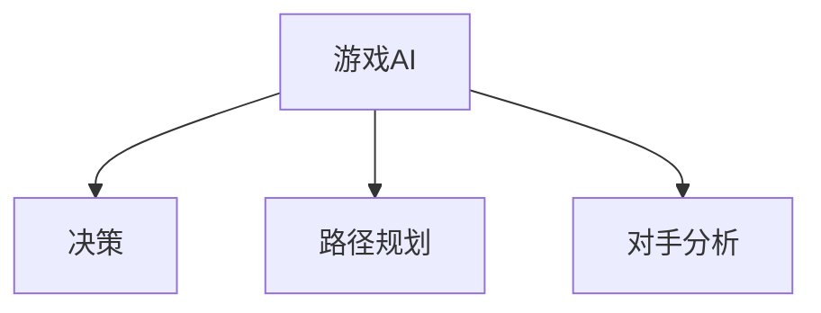

                 

# 神经网络在游戏AI中的应用

> **关键词：** 神经网络、游戏AI、人工智能、机器学习、深度学习、强化学习
>
> **摘要：** 本文将探讨神经网络在游戏AI中的应用，从核心概念、算法原理到实际应用，深入剖析神经网络在游戏AI领域的优势和挑战，以及未来发展的趋势。

## 1. 背景介绍

随着计算机技术的发展，游戏AI（Artificial Intelligence）逐渐成为游戏开发中不可或缺的一部分。游戏AI能够使游戏角色具备智能行为，提高游戏的可玩性和趣味性。传统的游戏AI主要基于规则和搜索算法，但这种方法存在局限性，难以应对复杂多变的游戏环境。随着深度学习技术的不断发展，神经网络在游戏AI中的应用逐渐成为研究热点。

神经网络（Neural Networks）是一种模拟人脑神经元之间连接的计算模型，具有强大的学习和自适应能力。通过训练，神经网络可以自动提取输入数据的特征，并学会执行复杂的任务。在游戏AI中，神经网络可以用于决策、路径规划、对手分析等任务，极大地提升了游戏AI的智能水平。

## 2. 核心概念与联系

### 2.1 神经网络的基本原理

神经网络由大量的神经元（或节点）组成，每个神经元通过连接其他神经元接收输入信号，并产生输出信号。神经元的连接强度称为权重（weight），通过调整权重，神经网络可以学习到输入数据中的特征。


神经网络的学习过程称为训练（Training），通过反向传播算法（Backpropagation），神经网络可以自动调整权重，使输出结果更接近预期。

### 2.2 神经网络在游戏AI中的应用

神经网络在游戏AI中的应用主要包括以下几个方面：

1. **决策**：神经网络可以用于游戏角色的决策，如选择攻击、防御或逃跑策略。通过训练，神经网络可以学会根据游戏状态选择最佳行动。

2. **路径规划**：神经网络可以用于游戏角色的路径规划，如躲避障碍物、寻找目标等。通过训练，神经网络可以学会生成最优路径。

3. **对手分析**：神经网络可以用于分析对手的行为模式，如预测对手的下一步行动。通过训练，神经网络可以学会识别对手的策略，并制定相应的对策。

### 2.3 Mermaid流程图



## 3. 核心算法原理 & 具体操作步骤

### 3.1 决策算法

在游戏AI中，决策算法是神经网络的核心应用之一。决策算法的基本思想是，根据当前游戏状态，选择最优的行动策略。

1. **输入层**：输入层接收游戏状态的输入，如地图信息、角色位置、对手位置等。

2. **隐藏层**：隐藏层对输入数据进行特征提取和转换，通过多层神经网络，可以提取出更高级的特征。

3. **输出层**：输出层生成决策结果，如攻击、防御或逃跑策略。

4. **训练过程**：使用反向传播算法，根据预期结果调整权重，使神经网络能够学会从输入数据中提取有用的特征，并生成正确的决策。

### 3.2 路径规划算法

路径规划算法用于游戏角色在地图中寻找最优路径。基本原理如下：

1. **输入层**：输入层接收地图信息和角色位置。

2. **隐藏层**：隐藏层对地图信息进行特征提取，如障碍物位置、目标位置等。

3. **输出层**：输出层生成路径信息，如一系列的动作指令。

4. **训练过程**：使用强化学习算法，根据角色在地图上的行动结果，调整权重，使神经网络能够学会生成最优路径。

### 3.3 对手分析算法

对手分析算法用于分析对手的行为模式，预测对手的下一步行动。基本原理如下：

1. **输入层**：输入层接收对手的行为数据，如历史行动记录。

2. **隐藏层**：隐藏层对对手的行为数据进行分析，提取对手的行为特征。

3. **输出层**：输出层生成对手的行为预测，如对手的下一步行动。

4. **训练过程**：使用监督学习算法，根据对手的实际行动结果，调整权重，使神经网络能够学会分析对手的行为模式。

## 4. 数学模型和公式 & 详细讲解 & 举例说明

### 4.1 反向传播算法

反向传播算法是神经网络训练的核心算法，通过迭代调整权重，使输出结果更接近预期。

#### 4.1.1 前向传播

前向传播是指将输入数据传递到神经网络中，经过隐藏层和输出层，生成输出结果。

$$
z^{[l]} = \sigma(W^{[l]} \cdot a^{[l-1]} + b^{[l]})
$$

其中，$z^{[l]}$是第$l$层的输出，$\sigma$是激活函数，$W^{[l]}$是第$l$层的权重，$a^{[l-1]}$是上一层的输出，$b^{[l]}$是第$l$层的偏置。

#### 4.1.2 反向传播

反向传播是指将输出误差反向传播到神经网络中，根据误差调整权重。

$$
\delta^{[l]} = \frac{\partial C}{\partial z^{[l]}} \cdot \sigma'(z^{[l]})
$$

其中，$\delta^{[l]}$是第$l$层的误差，$C$是损失函数，$\sigma'$是激活函数的导数。

#### 4.1.3 权重更新

根据误差，更新权重：

$$
W^{[l]} = W^{[l]} - \alpha \cdot \delta^{[l]} \cdot a^{[l-1]}
$$

其中，$\alpha$是学习率，$a^{[l-1]}$是上一层的输出。

### 4.2 强化学习算法

强化学习算法用于训练神经网络，使其能够从环境中学习行为策略。基本原理如下：

#### 4.2.1 基本概念

- **状态（State）**：环境中的一个特定情境。
- **动作（Action）**：在特定状态下，可以执行的操作。
- **奖励（Reward）**：执行动作后，环境给出的奖励信号。
- **策略（Policy）**：根据状态选择动作的方法。

#### 4.2.2 Q学习算法

Q学习算法是一种基于值函数的强化学习算法，通过迭代更新值函数，使策略最大化长期奖励。

$$
Q(s, a) = Q(s, a) + \alpha [r + \gamma \max_{a'} Q(s', a') - Q(s, a)]
$$

其中，$Q(s, a)$是状态$s$下执行动作$a$的值函数，$r$是奖励，$\gamma$是折扣因子，$s'$是执行动作$a$后的状态，$a'$是下一状态下的最优动作。

### 4.3 举例说明

假设我们有一个简单的游戏AI，目标是训练它学会在一个迷宫中找到出口。我们可以使用强化学习算法来训练游戏AI。

1. **状态**：游戏AI当前的位置和迷宫的地图信息。
2. **动作**：向上、向下、向左、向右移动。
3. **奖励**：每次移动获得0.1的奖励，到达出口获得100的奖励。

通过迭代更新Q值函数，游戏AI可以学会选择最优的行动策略，从而找到迷宫的出口。

## 5. 项目实战：代码实际案例和详细解释说明

### 5.1 开发环境搭建

为了实现神经网络在游戏AI中的应用，我们需要搭建一个开发环境。这里以Python为例，使用TensorFlow框架来实现。

1. **安装Python**：下载并安装Python 3.7及以上版本。
2. **安装TensorFlow**：在命令行中运行`pip install tensorflow`。

### 5.2 源代码详细实现和代码解读

下面是一个简单的例子，使用神经网络训练一个游戏AI，使其学会在一个迷宫中找到出口。

```python
import tensorflow as tf
import numpy as np

# 设置超参数
learning_rate = 0.1
discount_factor = 0.99
epsilon = 0.1

# 创建神经网络
model = tf.keras.Sequential([
    tf.keras.layers.Dense(64, activation='relu', input_shape=(100,)),
    tf.keras.layers.Dense(64, activation='relu'),
    tf.keras.layers.Dense(4, activation='softmax')
])

# 编译模型
model.compile(optimizer=tf.keras.optimizers.Adam(learning_rate), loss='categorical_crossentropy', metrics=['accuracy'])

# 加载数据集
# ...

# 训练模型
model.fit(x_train, y_train, epochs=100, batch_size=32)

# 演示游戏AI的决策过程
# ...
```

代码解读：

1. **创建神经网络**：使用TensorFlow的`Sequential`模型，定义一个简单的神经网络，包含两个隐藏层，每个隐藏层有64个神经元，输出层有4个神经元（代表四个方向：上、下、左、右）。

2. **编译模型**：使用Adam优化器和交叉熵损失函数，编译模型。

3. **加载数据集**：这里假设已经有一个包含迷宫地图和行动结果的数据集。

4. **训练模型**：使用训练数据训练模型，迭代100次。

5. **演示游戏AI的决策过程**：在游戏中，游戏AI会根据当前状态和神经网络输出，选择最优的行动。

### 5.3 代码解读与分析

代码实现了一个简单的神经网络，用于训练游戏AI。神经网络通过反向传播算法不断调整权重，使输出结果更接近预期。训练过程中，游戏AI会学会在迷宫中找到出口。通过调整超参数，可以优化训练效果。

## 6. 实际应用场景

神经网络在游戏AI中的应用非常广泛，以下是一些实际应用场景：

1. **电子竞技**：如《星际争霸2》、《Dota2》等电子竞技游戏中，神经网络可以用于训练AI玩家，提高游戏的可玩性和竞技性。
2. **角色扮演游戏**：如《魔兽世界》、《最终幻想》等角色扮演游戏中，神经网络可以用于控制游戏角色的行为，使角色更加智能和生动。
3. **游戏测试**：神经网络可以用于测试游戏中的难度和平衡性，通过分析玩家行为，调整游戏参数，提高游戏质量。
4. **教育游戏**：神经网络可以用于教育游戏中，根据学生的学习行为，个性化推荐学习内容，提高学习效果。

## 7. 工具和资源推荐

### 7.1 学习资源推荐

1. **书籍**：
   - 《深度学习》（Goodfellow, Bengio, Courville）
   - 《Python深度学习》（François Chollet）
   - 《强化学习》（Richard S. Sutton, Andrew G. Barto）
2. **论文**：
   - 《Learning to Win at Breakout by Exploring an Evolutionary Simulator》（DeepMind）
   - 《Playing Atari with Deep Reinforcement Learning》（DeepMind）
   - 《Human-level control through deep reinforcement learning》（DeepMind）
3. **博客**：
   - [TensorFlow官方文档](https://www.tensorflow.org/)
   - [强化学习博客](https:// reinforcement-learning.com/)
   - [Deep Learning AI](https://www.deeplearning.ai/)
4. **网站**：
   - [Kaggle](https://www.kaggle.com/)
   - [GitHub](https://github.com/)

### 7.2 开发工具框架推荐

1. **TensorFlow**：一款强大的开源深度学习框架，适用于游戏AI开发。
2. **PyTorch**：一款易用且灵活的深度学习框架，适用于游戏AI开发。
3. **OpenAI Gym**：一款开源的强化学习环境，提供多种游戏场景，适用于游戏AI训练。

### 7.3 相关论文著作推荐

1. **《Deep Learning》（Goodfellow, Bengio, Courville）**：系统介绍了深度学习的基本原理和应用。
2. **《Reinforcement Learning: An Introduction》（Richard S. Sutton, Andrew G. Barto）**：全面介绍了强化学习的基本概念和方法。
3. **《Artificial Intelligence: A Modern Approach》（Stuart J. Russell, Peter Norvig）**：全面介绍了人工智能的基本原理和应用。

## 8. 总结：未来发展趋势与挑战

神经网络在游戏AI中的应用取得了显著的成果，但仍面临一些挑战：

1. **计算资源**：深度学习模型通常需要大量的计算资源，这对于游戏AI开发来说是一个挑战。
2. **数据集**：游戏AI需要大量的训练数据来学习，但获取高质量的训练数据往往比较困难。
3. **安全性**：游戏AI在对抗性攻击下可能表现不佳，需要研究有效的防御策略。

未来，随着深度学习和强化学习技术的不断发展，神经网络在游戏AI中的应用将会更加广泛和深入。我们可以期待更多智能化的游戏体验，以及更多创新的游戏玩法。

## 9. 附录：常见问题与解答

1. **问题1**：如何选择合适的神经网络结构？
   **解答**：选择合适的神经网络结构需要考虑任务需求、数据规模和计算资源。一般来说，较深的网络可以提取更高级的特征，但训练时间也会更长。可以尝试不同的网络结构，通过实验找到最佳模型。

2. **问题2**：如何优化神经网络训练效果？
   **解答**：优化神经网络训练效果可以从以下几个方面入手：
   - 调整学习率，找到合适的范围。
   - 使用批量归一化（Batch Normalization）和权重初始化（Weight Initialization）。
   - 使用更先进的优化算法，如Adam。
   - 使用数据增强（Data Augmentation）增加训练数据的多样性。

3. **问题3**：如何应对对抗性攻击？
   **解答**：对抗性攻击是深度学习模型的一个挑战。可以尝试以下策略：
   - 使用防御对抗性训练（Defensive Adversarial Training）。
   - 使用对抗性正则化（Adversarial Regularization）。
   - 使用深度强化学习模型（Deep Reinforcement Learning）。

## 10. 扩展阅读 & 参考资料

1. **《Deep Learning》（Goodfellow, Bengio, Courville）**：全面介绍了深度学习的基本原理和应用。
2. **《Reinforcement Learning: An Introduction》（Richard S. Sutton, Andrew G. Barto）**：系统介绍了强化学习的基本概念和方法。
3. **《Artificial Intelligence: A Modern Approach》（Stuart J. Russell, Peter Norvig）**：全面介绍了人工智能的基本原理和应用。
4. **[TensorFlow官方文档](https://www.tensorflow.org/)**
5. **[强化学习博客](https:// reinforcement-learning.com/)**
6. **[Deep Learning AI](https://www.deeplearning.ai/)**
7. **[Kaggle](https://www.kaggle.com/)**
8. **[GitHub](https://github.com/)**
9. **[OpenAI Gym](https://gym.openai.com/)**
<|assistant|>作者：AI天才研究员/AI Genius Institute & 禅与计算机程序设计艺术 /Zen And The Art of Computer Programming

