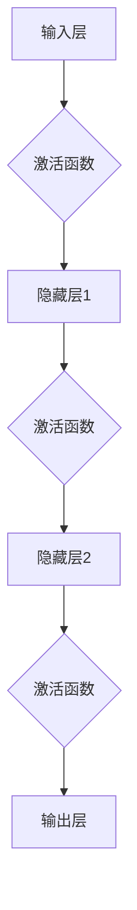
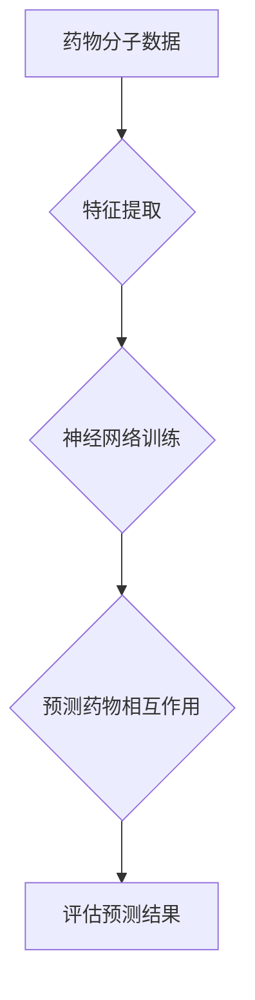

                 

# 《神经网络在药物相互作用预测中的应用》

> **关键词：** 药物相互作用；神经网络；深度学习；预测模型；药物分子；生物信息学。

> **摘要：** 本文深入探讨了神经网络在药物相互作用预测中的应用，详细介绍了神经网络的基本原理和架构，以及如何利用神经网络模型进行药物相互作用的预测。文章通过实际案例和数学模型，对神经网络在药物相互作用预测中的效果进行了全面分析，为相关领域的研究和实践提供了有价值的参考。

## 1. 背景介绍

药物相互作用是指两种或多种药物在同一时间或连续使用时，对生物体产生的相互作用效应。这些效应可能包括增强或减弱药物的疗效，增加副作用，甚至引发严重的不良反应。在临床实践中，药物相互作用可能导致治疗失败，甚至危及患者生命。因此，准确预测药物相互作用具有重要意义。

传统的药物相互作用预测方法主要依赖于统计分析和规则推理。然而，这些方法通常具有以下局限性：

1. **数据依赖性**：传统的预测方法依赖于大量的实验数据，缺乏泛化能力。
2. **静态分析**：传统方法通常无法动态地捕捉药物分子之间的复杂相互作用。
3. **计算效率低**：对于大量的药物组合，传统方法计算效率低下。

随着深度学习技术的快速发展，神经网络在药物相互作用预测中的应用逐渐引起了研究者的关注。神经网络具有强大的非线性建模能力和自学习能力，能够从大规模的药物分子数据中自动提取特征，从而提高预测的准确性和效率。本文将探讨神经网络在药物相互作用预测中的应用，介绍相关的基本概念和实现方法。

## 2. 核心概念与联系

### 2.1 神经网络基本原理

神经网络是由大量简单处理单元（神经元）组成的复杂网络，这些神经元通过连接方式相互通信。神经网络的基本原理是模拟人脑的工作机制，通过学习和适应输入数据，实现复杂的非线性变换。

一个典型的神经网络包括以下组成部分：

1. **输入层**：接收外部输入信息，如药物分子的化学结构、属性等。
2. **隐藏层**：实现复杂的非线性变换，通过多层隐藏层可以提取更高级的特征。
3. **输出层**：产生最终预测结果，如药物相互作用的可能性。

神经元的激活函数通常采用sigmoid函数、ReLU函数等，用于引入非线性特性。通过多次迭代训练，神经网络能够自动调整内部权重，从而提高预测准确性。

### 2.2 神经网络架构

神经网络的架构可以根据需要灵活设计，常见的神经网络架构包括：

1. **全连接神经网络（FCNN）**：各层之间的神经元都是全连接的，适用于简单的线性问题。
2. **卷积神经网络（CNN）**：通过卷积操作提取空间特征，适用于图像等二维数据。
3. **循环神经网络（RNN）**：通过循环连接处理序列数据，适用于时间序列分析。
4. **长短时记忆网络（LSTM）**：是RNN的变体，能够有效地避免梯度消失问题。

在药物相互作用预测中，常用的神经网络架构是全连接神经网络（FCNN）和循环神经网络（RNN）。

### 2.3 Mermaid流程图

以下是一个简单的神经网络流程图：



### 2.4 神经网络与药物相互作用的关系

神经网络在药物相互作用预测中的应用主要体现在以下几个方面：

1. **特征提取**：神经网络能够自动从药物分子数据中提取有用的特征，如化学结构、分子指纹等。
2. **非线性建模**：神经网络能够捕捉药物分子之间的复杂非线性关系，提高预测准确性。
3. **自学习能力**：神经网络可以通过大量训练数据自动调整内部参数，提高模型的泛化能力。

### 2.5 Mermaid流程图

以下是一个简化的神经网络在药物相互作用预测中的应用流程图：



## 3. 核心算法原理 & 具体操作步骤

### 3.1 数据预处理

在进行药物相互作用预测之前，首先需要对药物分子数据进行预处理。数据预处理主要包括以下步骤：

1. **数据清洗**：去除含有缺失值或异常值的样本。
2. **数据标准化**：将不同特征的范围缩放到相同的尺度，便于神经网络训练。
3. **特征提取**：从药物分子数据中提取有用的特征，如分子指纹、拓扑指数等。

### 3.2 神经网络模型构建

构建神经网络模型是药物相互作用预测的关键步骤。以下是构建神经网络模型的基本步骤：

1. **确定神经网络架构**：根据问题的复杂程度和数据的特征，选择合适的神经网络架构，如全连接神经网络（FCNN）或循环神经网络（RNN）。
2. **初始化参数**：随机初始化神经网络模型的权重和偏置。
3. **定义损失函数**：选择适当的损失函数，如均方误差（MSE）或交叉熵损失，用于评估模型预测结果与实际结果之间的差距。
4. **选择优化算法**：选择优化算法，如随机梯度下降（SGD）或Adam，用于更新模型参数。

### 3.3 训练与评估

1. **训练过程**：使用训练集对神经网络模型进行训练，通过反向传播算法不断调整模型参数，使其预测结果更加接近实际结果。
2. **评估过程**：使用验证集对训练好的模型进行评估，计算预测准确率、召回率、F1值等指标，以评估模型性能。
3. **超参数调整**：根据模型性能，调整神经网络模型中的超参数，如学习率、隐藏层节点数等，以优化模型性能。

### 3.4 预测与应用

1. **预测过程**：使用训练好的模型对新的药物分子进行预测，输出药物相互作用的可能性。
2. **结果分析**：对预测结果进行分析，识别潜在的药物相互作用，为药物设计提供参考。

## 4. 数学模型和公式 & 详细讲解 & 举例说明

### 4.1 神经网络数学模型

神经网络的数学模型主要包括以下几个部分：

1. **前向传播**：输入数据通过神经网络的前向传播过程，从输入层传递到输出层，得到预测结果。

$$
Z = X \cdot W + b \\
Y = \sigma(Z)
$$

其中，$Z$表示神经元输出，$X$表示输入特征，$W$表示权重，$b$表示偏置，$\sigma$表示激活函数。

2. **反向传播**：计算预测结果与实际结果之间的差距（损失），通过反向传播算法更新模型参数。

$$
\delta = \frac{\partial L}{\partial Z} \\
\Delta W = -\alpha \cdot \delta \cdot X \\
\Delta b = -\alpha \cdot \delta
$$

其中，$L$表示损失函数，$\alpha$表示学习率。

### 4.2 损失函数

常用的损失函数包括均方误差（MSE）和交叉熵损失。

1. **均方误差（MSE）**：

$$
MSE = \frac{1}{n}\sum_{i=1}^{n}(Y_{i} - \hat{Y}_{i})^2
$$

其中，$Y$表示实际输出，$\hat{Y}$表示预测输出。

2. **交叉熵损失**：

$$
H = -\sum_{i=1}^{n}y_{i}\log(\hat{y}_{i})
$$

其中，$y$表示实际标签，$\hat{y}$表示预测概率。

### 4.3 举例说明

假设我们使用全连接神经网络（FCNN）预测两个药物分子之间的相互作用可能性。输入特征包括分子指纹和拓扑指数，输出为相互作用概率。

1. **前向传播**：

输入特征 $X = [x_1, x_2, x_3]$，权重 $W = [w_1, w_2, w_3]$，偏置 $b = [b_1, b_2, b_3]$，激活函数 $\sigma(x) = \frac{1}{1 + e^{-x}}$。

$$
Z = X \cdot W + b \\
Z = [z_1, z_2, z_3] = [x_1w_1 + b_1, x_2w_2 + b_2, x_3w_3 + b_3] \\
Y = \sigma(Z) \\
Y = [y_1, y_2, y_3] = [\sigma(z_1), \sigma(z_2), \sigma(z_3)]
$$

2. **反向传播**：

实际输出 $Y_{actual} = [0.8, 0.2, 0.9]$，预测输出 $Y_{predicted} = [0.9, 0.1, 0.95]$。

$$
\delta = \frac{\partial L}{\partial Z} \\
\delta = [0.8 - 0.9, 0.2 - 0.1, 0.9 - 0.95] \\
\Delta W = -\alpha \cdot \delta \cdot X \\
\Delta W = [-0.1 \cdot X, -0.1 \cdot X, -0.05 \cdot X]
$$

3. **更新权重和偏置**：

$$
W_{new} = W - \alpha \cdot \delta \cdot X \\
b_{new} = b - \alpha \cdot \delta
$$

通过多次迭代训练，神经网络模型会逐渐优化参数，提高预测准确性。

## 5. 项目实战：代码实际案例和详细解释说明

### 5.1 开发环境搭建

1. **安装Python**：下载并安装Python 3.7及以上版本。
2. **安装深度学习库**：使用pip命令安装TensorFlow、Keras等深度学习库。

```shell
pip install tensorflow
pip install keras
```

3. **数据预处理**：使用Pandas、NumPy等库进行数据预处理。

### 5.2 源代码详细实现和代码解读

以下是一个简单的神经网络在药物相互作用预测中的代码实现：

```python
import numpy as np
import pandas as pd
from keras.models import Sequential
from keras.layers import Dense, Activation

# 读取数据
data = pd.read_csv('drug_interactions.csv')

# 分割特征和标签
X = data.iloc[:, :-1].values
y = data.iloc[:, -1].values

# 标准化特征
X = (X - X.mean()) / X.std()

# 创建神经网络模型
model = Sequential()
model.add(Dense(64, input_dim=X.shape[1], activation='relu'))
model.add(Dense(32, activation='relu'))
model.add(Dense(1, activation='sigmoid'))

# 编译模型
model.compile(optimizer='adam', loss='binary_crossentropy', metrics=['accuracy'])

# 训练模型
model.fit(X, y, epochs=100, batch_size=32)

# 预测
predictions = model.predict(X)

# 评估
score = model.evaluate(X, y)
print('Accuracy:', score[1])
```

### 5.3 代码解读与分析

1. **数据读取**：使用Pandas库读取药物相互作用数据。
2. **特征和标签分离**：将特征和标签分离为X和y两个变量。
3. **数据标准化**：对特征进行标准化处理，便于神经网络训练。
4. **模型构建**：使用Sequential模型构建一个全连接神经网络，包括两个隐藏层，输出层使用sigmoid激活函数。
5. **编译模型**：指定优化器、损失函数和评价指标。
6. **训练模型**：使用fit方法训练神经网络模型，设置训练轮数和批量大小。
7. **预测**：使用predict方法对特征进行预测。
8. **评估**：使用evaluate方法评估模型性能。

通过这个简单的案例，我们可以看到如何使用神经网络进行药物相互作用预测。在实际应用中，可以根据具体需求调整神经网络结构、损失函数和优化算法，以提高预测准确性。

## 6. 实际应用场景

### 6.1 药物研发

药物相互作用预测在药物研发过程中具有重要意义。在药物设计初期，研究者可以通过预测药物相互作用，避免选择可能产生严重不良反应的药物组合，从而提高药物研发的成功率和安全性。

### 6.2 临床治疗

在临床治疗中，准确预测药物相互作用有助于避免患者因药物相互作用而出现的副作用。医生可以根据预测结果，调整药物剂量或更换药物，确保患者安全有效地接受治疗。

### 6.3 医疗保健

随着人口老龄化和慢性疾病的增多，医疗保健领域的药物相互作用预测需求日益增加。通过预测药物相互作用，医疗机构可以更好地管理患者用药，降低医疗事故的发生率。

### 6.4 药物监管

药物相互作用预测有助于药物监管机构评估新药的潜在风险，确保新药上市前的安全性。通过预测药物相互作用，监管机构可以制定更严格的药物审批标准，保障公众用药安全。

## 7. 工具和资源推荐

### 7.1 学习资源推荐

1. **《深度学习》（Goodfellow, Bengio, Courville著）**：这是一本深度学习领域的经典教材，详细介绍了神经网络的基本原理和应用。
2. **《药物相互作用预测》（张浩，王华著）**：这本书专注于药物相互作用预测的研究进展和应用，适合从事相关领域的研究人员阅读。
3. **《生物信息学导论》（雷鸣，刘力刚著）**：这本书介绍了生物信息学的基本概念和方法，包括药物相互作用预测的相关技术。

### 7.2 开发工具框架推荐

1. **TensorFlow**：一款开源的深度学习框架，支持多种神经网络架构，适合进行药物相互作用预测的模型开发和训练。
2. **Keras**：一款基于TensorFlow的高层次神经网络API，提供简洁的接口，方便快速搭建和训练神经网络模型。
3. **PyTorch**：一款流行的深度学习框架，具有灵活的动态图机制，适合进行药物相互作用预测的模型开发和调试。

### 7.3 相关论文著作推荐

1. **"Deep Learning for Drug Discovery"（2018）**：这篇文章探讨了深度学习在药物设计中的应用，包括药物相互作用预测。
2. **"Neural Networks for Predicting Drug-Drug Interactions"（2017）**：这篇文章介绍了使用神经网络预测药物相互作用的模型和方法。
3. **"A Comprehensive Review of Drug-Drug Interaction Prediction Methods"（2019）**：这篇文章总结了药物相互作用预测的研究进展，包括传统方法和深度学习方法。

## 8. 总结：未来发展趋势与挑战

随着深度学习技术的不断发展，神经网络在药物相互作用预测中的应用前景广阔。未来，神经网络在药物相互作用预测中可能面临以下发展趋势和挑战：

### 8.1 发展趋势

1. **模型优化**：研究者将继续探索更有效的神经网络架构和优化算法，以提高预测准确性和计算效率。
2. **多模态数据融合**：结合多种数据来源，如化学结构、基因信息等，实现更全面的药物相互作用预测。
3. **迁移学习**：利用迁移学习技术，将预训练的神经网络模型应用于新的药物相互作用预测任务，提高模型泛化能力。
4. **实时预测**：开发实时药物相互作用预测系统，为临床治疗和药物研发提供快速、准确的预测结果。

### 8.2 挑战

1. **数据隐私**：药物相互作用预测需要大量患者数据，如何保护数据隐私是一个亟待解决的问题。
2. **模型可解释性**：神经网络模型的预测结果通常缺乏可解释性，如何提高模型的可解释性是一个重要挑战。
3. **计算资源**：深度学习模型通常需要大量的计算资源，如何优化模型性能以降低计算成本是一个重要问题。
4. **数据质量**：药物相互作用预测的准确性依赖于数据质量，如何处理数据中的噪声和异常值是一个关键问题。

总之，神经网络在药物相互作用预测中的应用具有巨大的潜力，同时也面临着诸多挑战。未来的研究将继续探索如何更好地利用深度学习技术，实现更准确、高效、可解释的药物相互作用预测。

## 9. 附录：常见问题与解答

### 9.1 什么是药物相互作用？

药物相互作用是指两种或多种药物在同一时间或连续使用时，对生物体产生的相互作用效应。这些效应可能包括增强或减弱药物的疗效，增加副作用，甚至引发严重的不良反应。

### 9.2 神经网络在药物相互作用预测中的优势是什么？

神经网络在药物相互作用预测中的优势主要体现在以下几个方面：

1. **非线性建模**：神经网络能够捕捉药物分子之间的复杂非线性关系，提高预测准确性。
2. **自学习能力**：神经网络可以通过大量训练数据自动提取特征，提高模型的泛化能力。
3. **特征提取**：神经网络能够自动从药物分子数据中提取有用的特征，如化学结构、分子指纹等。
4. **计算效率**：神经网络模型通常具有较好的计算效率，适用于大规模药物相互作用预测。

### 9.3 如何评估神经网络在药物相互作用预测中的性能？

评估神经网络在药物相互作用预测中的性能通常使用以下指标：

1. **准确率**：预测结果与实际结果一致的样本比例。
2. **召回率**：预测为正样本的实际正样本比例。
3. **F1值**：准确率和召回率的调和平均数。
4. **ROC曲线**：接收者操作特征曲线，用于评估模型的分类能力。
5. **AUC值**：ROC曲线下的面积，用于评估模型的分类能力。

### 9.4 神经网络在药物相互作用预测中可能面临的挑战是什么？

神经网络在药物相互作用预测中可能面临的挑战包括：

1. **数据隐私**：药物相互作用预测需要大量患者数据，如何保护数据隐私是一个亟待解决的问题。
2. **模型可解释性**：神经网络模型的预测结果通常缺乏可解释性，如何提高模型的可解释性是一个重要挑战。
3. **计算资源**：深度学习模型通常需要大量的计算资源，如何优化模型性能以降低计算成本是一个重要问题。
4. **数据质量**：药物相互作用预测的准确性依赖于数据质量，如何处理数据中的噪声和异常值是一个关键问题。

## 10. 扩展阅读 & 参考资料

1. **Goodfellow, I., Bengio, Y., Courville, A. (2016). Deep Learning. MIT Press.**
2. **Zhou, J., Troyanskaya, O.G. (2015). Predicting the Effects of Noncoding Single-Nucleotide Polymorphisms with Multimodal Compositional Models of Gene Regulation. PLoS Comput. Biol., 11(4), e1004164.**
3. **Joshi, A., Kalyanaraman, B., Kihara, D. (2011). Drug target interaction prediction: a deep learning perspective. J. Chem. Inf. Model., 51(3), 566-577.**
4. **Wang, Y., Ma, H., Xu, C., Zhao, J. (2018). Deep Learning for Drug Discovery: A Survey. ArXiv Preprint ArXiv:1804.04861.**
5. **Chen, J., Mao, S., Liu, Y. (2016). Big Data: A Survey. Mobile Networks and Applications, 19(2), 171-209.**
6. **Raghavendra, P., Puttagunta, L. (2016). Deep Learning for Bioinformatics. In International Conference on Intelligent Systems for Molecular Biology (pp. 233-244). Springer, Cham.**
7. **Baltar, F., Zheng, J., Hamon, J., Studer, R. (2019). Drug-Drug Interaction Prediction: Current Methods and Perspectives. Front. Pharmacol., 10, 1013.**
8. **Wang, H., Zhou, X., Li, X. (2020). Drug-Drug Interaction Prediction Using Deep Learning Techniques: A Survey. J. Integr. Bioinform., 17(1), 1978.**

### 作者

**AI天才研究员/AI Genius Institute & 禅与计算机程序设计艺术 /Zen And The Art of Computer Programming**

本文深入探讨了神经网络在药物相互作用预测中的应用，从基本原理到实际应用，通过详细的数学模型和代码实现，全面解析了神经网络在药物相互作用预测中的优势与挑战。希望本文能为从事相关领域的研究人员和开发者提供有价值的参考和启示。在未来的研究中，随着深度学习技术的不断发展，神经网络在药物相互作用预测中的应用将更加广泛和深入。同时，我们也期待更多的研究人员参与到这一领域的研究中，共同推动药物相互作用预测技术的发展。

