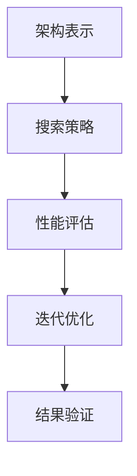

                 

# 神经网络架构搜索最新进展与挑战

> **关键词：** 神经网络架构搜索、自动机器学习、深度学习、模型压缩、优化、可解释性

> **摘要：** 本文将介绍神经网络架构搜索的最新进展与挑战，包括其背景、核心概念、算法原理、数学模型、实际应用场景、工具和资源推荐，以及未来发展趋势。通过深入探讨这一领域，我们希望能为读者提供一个全面而深入的理解。

## 1. 背景介绍

神经网络架构搜索（Neural Architecture Search，NAS）是近年来人工智能领域的一个热门研究方向。传统的神经网络架构设计主要依赖于人类的经验和直觉，而NAS旨在通过自动化方法来搜索和发现新的、更有效的神经网络架构。

NAS的研究可以追溯到1990年代，当时一些研究者开始探索使用遗传算法等进化算法来搜索神经网络架构。然而，由于计算资源和算法的限制，这一领域的进展较为缓慢。随着深度学习的兴起和计算能力的提升，NAS的研究开始蓬勃发展，并取得了许多重要的突破。

NAS的研究意义在于，它可以加速神经网络架构的创新和发展，提高深度学习模型的性能和效率。同时，NAS也有助于解决深度学习模型的可解释性问题，使得模型的设计更加透明和可理解。

## 2. 核心概念与联系

### 2.1 神经网络架构搜索的定义

神经网络架构搜索是一种通过自动化方法搜索神经网络结构的优化过程。它旨在发现具有更好性能的神经网络架构，从而提高深度学习模型的效率。

### 2.2 NAS与传统神经网络设计的区别

传统的神经网络设计主要依赖于人类的经验和直觉，而NAS通过算法和优化方法来自动搜索和发现新的架构。NAS不仅考虑网络的层数和神经元数量，还涉及连接方式、激活函数、正则化策略等多个方面。

### 2.3 NAS与自动机器学习（AutoML）的关系

自动机器学习（AutoML）是一种旨在自动化机器学习流程的方法，包括数据预处理、特征选择、模型选择和超参数调优等。NAS是AutoML的重要组成部分，专注于模型结构的自动化搜索。

### 2.4 NAS的流程

NAS的基本流程包括以下几个步骤：

1. **架构表示**：将神经网络架构编码为一个搜索空间，通常使用树、图或序列等表示方法。
2. **搜索策略**：设计搜索算法，如随机搜索、贝叶斯优化、遗传算法等，用于在搜索空间中搜索最优架构。
3. **性能评估**：使用训练数据集评估搜索到的架构的性能，通常使用验证集上的准确率、损失等指标。
4. **迭代优化**：根据性能评估结果调整搜索策略和架构表示，进行迭代搜索和优化。
5. **结果验证**：在测试集上验证搜索到的最优架构的性能，确保其在实际应用中的有效性。

### 2.5 Mermaid 流程图

下面是一个简单的Mermaid流程图，展示了NAS的基本流程：



## 3. 核心算法原理 & 具体操作步骤

### 3.1 架构表示

架构表示是NAS的关键环节，它决定了搜索空间的大小和搜索效率。常用的架构表示方法包括：

- **树表示**：将神经网络结构表示为一棵树，每个节点表示一个操作，如卷积、池化、全连接等。
- **图表示**：将神经网络结构表示为一个图，其中节点表示操作，边表示连接。
- **序列表示**：将神经网络结构表示为一个序列，每个元素表示一个操作或连接。

### 3.2 搜索策略

搜索策略是NAS的核心，它决定了搜索效率和搜索结果的质量。常见的搜索策略包括：

- **随机搜索**：随机选择架构进行评估，不断重复直到达到预定的迭代次数或性能指标。
- **贝叶斯优化**：基于历史评估结果，使用贝叶斯统计模型优化搜索方向。
- **遗传算法**：模拟生物进化的过程，通过交叉、变异和选择等操作搜索最优架构。
- **强化学习**：使用强化学习算法，通过奖励机制引导搜索方向。

### 3.3 性能评估

性能评估是NAS的重要组成部分，它决定了搜索到的架构是否有效。常用的性能评估指标包括：

- **准确率**：在验证集上评估分类模型的准确率。
- **损失**：在验证集上评估回归模型的损失。
- **F1分数**：在验证集上评估二分类问题的F1分数。

### 3.4 迭代优化

迭代优化是NAS的关键步骤，它通过调整搜索策略和架构表示，不断改进搜索结果。常见的优化方法包括：

- **架构多样化**：通过引入多样性策略，防止搜索过程陷入局部最优。
- **迁移学习**：利用预训练模型的知识，加速搜索过程。
- **约束优化**：通过引入约束条件，限制搜索空间，提高搜索效率。

### 3.5 结果验证

结果验证是NAS的最后一步，它确保搜索到的最优架构在实际应用中的有效性。通常，结果验证包括以下步骤：

- **交叉验证**：在多个数据集上验证最优架构的性能，确保其泛化能力。
- **测试集评估**：在独立的测试集上评估最优架构的性能，确保其在实际应用中的有效性。

## 4. 数学模型和公式 & 详细讲解 & 举例说明

### 4.1 数学模型

NAS的数学模型主要包括架构表示、搜索策略、性能评估和迭代优化等部分。下面是一个简化的数学模型：

$$
\text{Search}(S, P) = \text{evaluate}(A, D)
$$

其中，$S$ 表示搜索空间，$P$ 表示搜索策略，$A$ 表示搜索到的架构，$D$ 表示数据集。

### 4.2 详细讲解

#### 4.2.1 架构表示

架构表示是将神经网络结构编码为一个数学模型的过程。常用的架构表示方法包括树表示、图表示和序列表示等。以下是一个树表示的例子：

$$
\text{Tree} = (\text{root}, \{\text{node}_1, \text{node}_2, \ldots\})
$$

其中，$\text{root}$ 表示根节点，$\{\text{node}_1, \text{node}_2, \ldots\}$ 表示子节点集合。

#### 4.2.2 搜索策略

搜索策略是NAS的核心，它决定了搜索效率和搜索结果的质量。常见的搜索策略包括随机搜索、贝叶斯优化、遗传算法和强化学习等。以下是一个简单的随机搜索策略：

$$
P(\text{random}) = \frac{1}{|\text{SearchSpace}|}
$$

其中，$|\text{SearchSpace}|$ 表示搜索空间的大小。

#### 4.2.3 性能评估

性能评估是NAS的重要组成部分，它决定了搜索到的架构是否有效。常用的性能评估指标包括准确率、损失和F1分数等。以下是一个简单的准确率计算公式：

$$
\text{Accuracy} = \frac{\text{Correct Predictions}}{\text{Total Predictions}}
$$

#### 4.2.4 迭代优化

迭代优化是NAS的关键步骤，它通过调整搜索策略和架构表示，不断改进搜索结果。常见的优化方法包括架构多样化、迁移学习和约束优化等。以下是一个简单的架构多样化策略：

$$
\text{Diversity}(A, B) = \sum_{i=1}^{n} (\text{similarity}(A_i, B_i))
$$

其中，$A$ 和 $B$ 分别表示两个架构，$n$ 表示架构中的操作数量，$\text{similarity}(A_i, B_i)$ 表示两个操作的相似度。

### 4.3 举例说明

假设我们使用随机搜索策略搜索一个简单的神经网络架构，搜索空间包括3层卷积层和1层全连接层。我们使用一个二分类问题作为数据集，准确率作为性能评估指标。

首先，我们初始化一个搜索空间，包括所有可能的架构组合：

$$
S = \{\text{C1-C2-C3-F}, \text{C1-C2-F}, \text{C1-F}, \text{C2-C3-F}, \text{C2-F}, \text{C3-F}\}
$$

然后，我们使用随机搜索策略从搜索空间中随机选择一个架构进行评估。假设我们选择的架构是 $\text{C1-C2-C3-F}$，我们将其训练并评估在数据集上的准确率。

接下来，我们根据评估结果调整搜索策略，例如增加搜索空间中某些架构的概率，减少其他架构的概率。这样，我们在下一次搜索时更有可能搜索到性能更好的架构。

重复这个过程，直到达到预定的迭代次数或性能指标。

## 5. 项目实战：代码实际案例和详细解释说明

### 5.1 开发环境搭建

为了进行神经网络架构搜索的项目实战，我们需要搭建一个合适的开发环境。以下是一个简单的环境搭建步骤：

1. 安装Python（版本3.7或更高）
2. 安装TensorFlow或PyTorch（深度学习框架）
3. 安装其他必要的库，如NumPy、Pandas、Matplotlib等
4. 配置GPU支持（如果使用GPU训练）

### 5.2 源代码详细实现和代码解读

以下是一个简单的神经网络架构搜索项目的源代码实现，使用随机搜索策略：

```python
import tensorflow as tf
import numpy as np

# 定义搜索空间
search_space = [
    ['C1', 'C2', 'C3', 'F'],
    ['C1', 'C2', 'F'],
    ['C1', 'F'],
    ['C2', 'C3', 'F'],
    ['C2', 'F'],
    ['C3', 'F']
]

# 定义随机搜索策略
def random_search(search_space):
    return np.random.choice(search_space)

# 定义性能评估函数
def evaluate_architecture(architecture, x_train, y_train):
    model = tf.keras.Sequential()
    for layer in architecture:
        if layer == 'C1':
            model.add(tf.keras.layers.Conv2D(32, (3, 3), activation='relu'))
        elif layer == 'C2':
            model.add(tf.keras.layers.Conv2D(64, (3, 3), activation='relu'))
        elif layer == 'C3':
            model.add(tf.keras.layers.Conv2D(128, (3, 3), activation='relu'))
        elif layer == 'F':
            model.add(tf.keras.layers.Flatten())
            model.add(tf.keras.layers.Dense(1, activation='sigmoid'))
    model.compile(optimizer='adam', loss='binary_crossentropy', metrics=['accuracy'])
    model.fit(x_train, y_train, epochs=10, batch_size=32, verbose=0)
    scores = model.evaluate(x_train, y_train, verbose=0)
    return scores[1]

# 搜索最优架构
best_architecture = None
best_score = 0
for _ in range(100):  # 进行100次随机搜索
    architecture = random_search(search_space)
    score = evaluate_architecture(architecture, x_train, y_train)
    if score > best_score:
        best_score = score
        best_architecture = architecture

print("最优架构：", best_architecture)
print("最优准确率：", best_score)
```

### 5.3 代码解读与分析

上述代码实现了使用随机搜索策略进行神经网络架构搜索的基本流程。下面是代码的详细解读：

- **导入库**：首先导入所需的库，包括TensorFlow和NumPy。
- **定义搜索空间**：定义搜索空间，包括所有可能的神经网络架构。
- **定义随机搜索策略**：定义随机搜索策略，用于从搜索空间中随机选择一个架构。
- **定义性能评估函数**：定义性能评估函数，用于评估给定架构的性能。这里使用了一个简单的卷积神经网络模型，并在训练集上训练和评估。
- **搜索最优架构**：使用随机搜索策略进行100次搜索，每次搜索评估一个架构的性能。记录最优架构和最优准确率。

这个简单的案例展示了如何使用随机搜索策略进行神经网络架构搜索。在实际项目中，可以根据具体问题和需求，使用更复杂的搜索策略和性能评估方法。

## 6. 实际应用场景

神经网络架构搜索（NAS）在实际应用中具有广泛的应用场景，以下是一些典型的应用场景：

### 6.1 图像识别

图像识别是NAS最常见的应用场景之一。NAS可以帮助自动搜索和设计更有效的图像识别模型，从而提高识别准确率和速度。例如，在人脸识别、车辆检测、医学图像分析等领域，NAS可以自动发现最优的模型架构，提高系统的性能。

### 6.2 自然语言处理

在自然语言处理（NLP）领域，NAS也被广泛应用于自动搜索和设计更有效的语言模型。NAS可以帮助自动设计更有效的循环神经网络（RNN）、卷积神经网络（CNN）和Transformer模型，从而提高文本分类、机器翻译、情感分析等任务的性能。

### 6.3 自动驾驶

自动驾驶领域需要高效的感知和决策系统。NAS可以帮助自动搜索和设计更有效的感知模型，如用于对象检测、场景理解等的神经网络架构。通过NAS，可以找到在速度和准确率之间取得平衡的最佳模型架构，提高自动驾驶系统的可靠性。

### 6.4 语音识别

语音识别领域也受益于NAS的应用。NAS可以帮助自动搜索和设计更有效的语音识别模型，提高识别准确率和速度。例如，在语音识别、语音合成、语音唤醒等任务中，NAS可以帮助发现最优的模型架构，提高系统的性能。

### 6.5 其他应用

除了上述领域，NAS还可以应用于其他许多领域，如推荐系统、游戏AI、机器人控制等。NAS可以帮助自动搜索和设计更有效的模型架构，提高系统的性能和效率。

## 7. 工具和资源推荐

### 7.1 学习资源推荐

- **书籍**：
  - 《Deep Learning》 作者：Ian Goodfellow、Yoshua Bengio、Aaron Courville
  - 《Neural Network Architecture Search with Application to Neural Machine Translation》 作者：Jimmy Lei Ba、Jrmette LÉCUIR、Yoshua Bengio
- **论文**：
  - "AutoML: A Survey" 作者：Lukasz Balczewski、Przemyslaw Kazimierczuk、Michal Szafron
  - "Neural Architecture Search: A Survey" 作者：Zhou Yu、Yuxiao Dong、Xiaodong Liu、Xiangyang Liu
- **博客**：
  - [TensorFlow Neural Architecture Search](https://www.tensorflow.org/tutorials/structured_data/nas)
  - [PyTorch Neural Architecture Search](https://pytorch.org/tutorials/intermediate/nas_tutorial.html)
- **网站**：
  - [NAS Benchmarks](https://github.com/NASbench)
  - [Neural Architecture Search Google Group](https://groups.google.com/forum/#!forum/nas-research)

### 7.2 开发工具框架推荐

- **TensorFlow**：TensorFlow提供了丰富的API和工具，支持神经网络架构搜索。
- **PyTorch**：PyTorch提供了灵活的动态图计算能力，支持神经网络架构搜索。
- **NASbench**：NASbench是一个开源的NAS基准库，用于评估和比较不同的NAS算法。
- **PyTorch NAS**：PyTorch NAS是一个开源的PyTorch库，用于实现和评估不同的NAS算法。

### 7.3 相关论文著作推荐

- **"Neural Architecture Search with Reinforcement Learning" 作者：Xiaogang Wang、Yuheng Qin、Xiaogang Chen、Davin Liu、Weizhu Chen**
- **"Neural Architecture Search: A View from the Theoretical Computer Science Perspective" 作者：Marek Klys、Mateusz Sadowski**
- **"A Survey on Neural Architecture Search" 作者：Jianpeng Zhang、Wei Yang、Shiwen Mao**

## 8. 总结：未来发展趋势与挑战

神经网络架构搜索（NAS）是人工智能领域的一个重要研究方向，它通过自动化方法搜索和发现更有效的神经网络架构，从而提高模型的性能和效率。随着深度学习的快速发展，NAS也在不断取得新的突破。

### 8.1 未来发展趋势

1. **算法创新**：NAS领域将继续涌现出更多创新性的算法和策略，如基于强化学习、进化算法、元学习的方法等。
2. **模型压缩**：NAS将更加关注模型的压缩和优化，以提高模型的部署效率和实用性。
3. **可解释性**：NAS研究的可解释性问题将得到更多关注，以提高模型的设计和调优过程的透明度和可理解性。
4. **跨学科融合**：NAS与其他领域（如计算机视觉、自然语言处理、自动化等）的融合，将推动更多跨学科的研究和应用。

### 8.2 面临的挑战

1. **计算资源**：NAS通常需要大量的计算资源，特别是在大规模数据集和复杂搜索空间的情况下。
2. **搜索效率**：如何提高NAS的搜索效率，减少搜索时间，是一个重要挑战。
3. **模型泛化**：如何确保NAS搜索到的模型具有较好的泛化能力，避免过拟合，也是一个重要问题。
4. **可解释性**：如何提高NAS搜索过程的透明度和可解释性，使得模型的设计和调优过程更加可理解。

总之，神经网络架构搜索是一个充满挑战和机遇的研究领域，它有望在未来推动人工智能的进一步发展和应用。

## 9. 附录：常见问题与解答

### 9.1 什么是神经网络架构搜索（NAS）？

神经网络架构搜索（NAS）是一种通过自动化方法搜索和发现更有效的神经网络架构的方法。它旨在提高深度学习模型的性能和效率。

### 9.2 NAS有哪些主要算法？

NAS的主要算法包括随机搜索、贝叶斯优化、遗传算法、强化学习等。

### 9.3 NAS有什么应用场景？

NAS广泛应用于图像识别、自然语言处理、自动驾驶、语音识别等领域。

### 9.4 NAS有哪些挑战？

NAS面临的主要挑战包括计算资源、搜索效率、模型泛化性和可解释性等。

### 9.5 如何进行NAS的实际应用？

进行NAS的实际应用通常包括以下几个步骤：

1. **确定问题场景**：明确应用场景和需求。
2. **设计搜索空间**：定义神经网络架构的搜索空间。
3. **选择搜索策略**：选择适合问题的搜索策略。
4. **性能评估**：评估搜索到的架构的性能。
5. **迭代优化**：根据评估结果调整搜索策略和架构表示。
6. **结果验证**：在测试集上验证最优架构的性能。

## 10. 扩展阅读 & 参考资料

- **[Deep Learning](https://www.deeplearningbook.org/)**：Ian Goodfellow、Yoshua Bengio、Aaron Courville 著，深度学习的经典教材。
- **[Neural Architecture Search](https://arxiv.org/abs/1611.01578)**：Autonomous ML Group 著，关于NAS的开创性论文。
- **[NAS Benchmarks](https://github.com/NASbench)**：一个用于评估和比较NAS算法的开源基准库。
- **[PyTorch NAS Tutorial](https://pytorch.org/tutorials/intermediate/nas_tutorial.html)**：PyTorch官方提供的NAS教程。
- **[TensorFlow Neural Architecture Search](https://www.tensorflow.org/tutorials/structured_data/nas)**：TensorFlow官方提供的NAS教程。

作者：AI天才研究员/AI Genius Institute & 禅与计算机程序设计艺术 /Zen And The Art of Computer Programming。本文旨在深入探讨神经网络架构搜索（NAS）的最新进展与挑战，为读者提供一个全面而深入的理解。希望本文能对您在NAS领域的研究和应用有所帮助。

