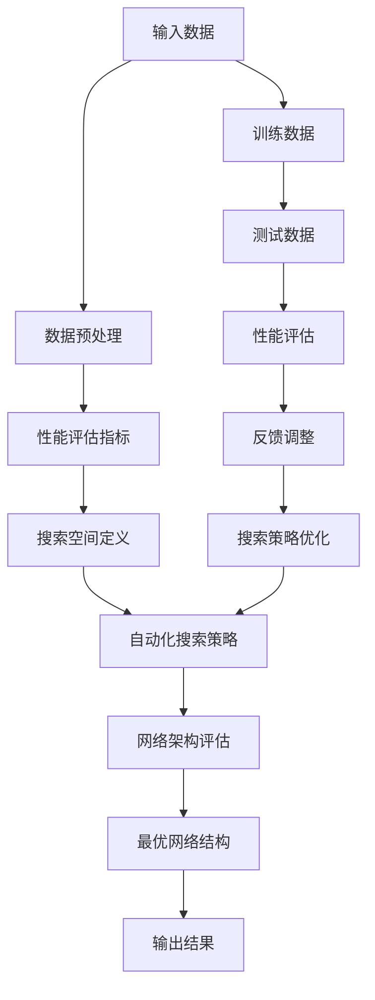

                 

### 背景介绍

神经网络架构搜索（Neural Architecture Search，NAS）是近年来人工智能领域的一个重要研究方向。随着深度学习技术的飞速发展，神经网络在图像识别、语音处理、自然语言处理等众多领域取得了显著的成果。然而，深度学习的成功也伴随着一系列问题，如模型设计复杂、调优困难、计算资源消耗巨大等。这些问题促使研究者开始寻找更高效、更自动化的模型设计方法，从而提高深度学习模型的性能和可解释性。

神经网络架构搜索正是为了解决这一问题而诞生的。NAS的目标是通过自动化搜索方法，从大量可能的神经网络结构中找出最优或近似最优的结构，以实现更高的性能。与传统的人工设计网络结构相比，NAS方法能够更有效地利用计算资源，提高搜索效率，并在一定程度上减少模型设计过程中的试错成本。

本文将详细介绍神经网络架构搜索的自动化方法。首先，我们将介绍NAS的基本概念和传统方法，然后深入探讨近年来在NAS领域取得的重要进展，包括强化学习、遗传算法等自动化搜索策略。接着，我们将讨论如何结合计算机视觉、自然语言处理等具体应用场景，进一步优化NAS方法。此外，我们还将介绍一些开源工具和资源，帮助读者更好地理解和实践NAS技术。最后，我们将总结NAS领域未来的发展趋势和面临的挑战，为读者提供一个全面的视角。

通过本文的阅读，读者将能够系统地了解神经网络架构搜索的自动化方法，掌握NAS技术的基本原理和应用，为后续的研究和应用提供指导。让我们一起探索NAS的奇妙世界，开启自动化模型设计的全新篇章。### 核心概念与联系

在深入探讨神经网络架构搜索（NAS）的自动化方法之前，我们需要首先明确几个核心概念，并理解它们之间的相互联系。这些概念包括但不限于：神经网络、架构搜索、搜索空间、性能评估、自动化搜索策略。

**神经网络（Neural Network）**：神经网络是一种模拟人脑神经元之间连接和信息传递的人工智能模型。它由大量的神经元（或节点）组成，这些神经元通过权重连接形成网络结构。神经网络的输入经过一系列的变换和处理，最终输出结果。深度学习是一种特殊的神经网络模型，其中包含多个隐藏层，可以处理更加复杂的任务。

**架构搜索（Architecture Search）**：架构搜索是一种自动设计神经网络结构的方法，旨在找到能够高效解决特定问题的最优网络架构。与传统的手动设计网络结构相比，架构搜索通过算法自动探索和评估大量不同的网络架构，从而找到最优解或近似最优解。

**搜索空间（Search Space）**：搜索空间是所有可能的神经网络结构的集合。在NAS中，搜索空间定义了模型设计过程中的自由度，包括网络层数、每层的神经元数量、激活函数、连接方式等。搜索空间的大小直接影响搜索算法的复杂度和效率。

**性能评估（Performance Evaluation）**：性能评估是NAS方法中至关重要的一环。通过在不同的数据集上训练和测试网络，评估其准确率、效率、泛化能力等性能指标，来确定网络结构的优劣。常用的评估指标包括准确率（Accuracy）、损失函数（Loss）、计算成本（Computation Cost）等。

**自动化搜索策略（Automated Search Strategies）**：自动化搜索策略是指用于在搜索空间中高效搜索最优网络结构的算法。这些策略可以大致分为基于强化学习、遗传算法、基于模型的方法等。这些策略的核心目标是通过优化搜索过程，提高搜索效率，减少计算成本。

**核心概念之间的联系**：

- **神经网络**是NAS的基础，决定了搜索空间和性能评估的维度。
- **架构搜索**和**搜索空间**共同定义了NAS的问题域，是搜索算法的输入和输出。
- **性能评估**是衡量网络结构优劣的关键指标，直接影响搜索策略的选择和搜索结果。
- **自动化搜索策略**通过算法优化搜索过程，提高了NAS的效率和效果。

为了更好地理解这些概念，下面我们将使用Mermaid流程图展示NAS的基本架构，以便读者更直观地把握各个概念之间的联系。



通过上述Mermaid流程图，我们可以看到NAS的基本流程，从输入数据开始，经过数据预处理、性能评估、搜索空间定义、自动化搜索策略、网络架构评估，最终得到最优的网络结构，并输出结果。这一流程不仅涵盖了NAS的核心概念，还体现了NAS的自动化特点。

在接下来的章节中，我们将逐一深入探讨这些核心概念，并详细介绍NAS的自动化方法，帮助读者全面理解这一前沿技术。### 核心算法原理 & 具体操作步骤

在了解了神经网络架构搜索（NAS）的基本概念和流程之后，我们将深入探讨NAS的核心算法原理以及具体操作步骤。NAS的核心在于如何有效地在庞大的搜索空间中找到最优或近似最优的网络结构。为了实现这一目标，研究者们开发了多种自动化搜索策略，下面我们将介绍其中几种重要的方法，包括强化学习、遗传算法和基于模型的方法。

#### 强化学习（Reinforcement Learning）

强化学习是NAS中最常用的策略之一，其核心思想是通过奖励机制引导搜索过程，使搜索算法能够在多个可能的网络结构中选择最优的架构。以下是强化学习在NAS中的基本步骤：

1. **环境（Environment）**：定义搜索空间和性能评估指标。搜索空间包括网络结构、层与层的连接方式、激活函数等，性能评估指标如准确率、效率等。
2. **代理（Agent）**：通常是一个基于策略的网络，用于在搜索空间中生成网络结构。代理需要通过学习策略来决定如何探索搜索空间。
3. **策略（Policy）**：定义如何从当前状态（网络结构）生成新的动作（网络结构调整）。
4. **奖励（Reward）**：根据网络结构在测试数据上的表现给予奖励。通常，奖励与网络结构的性能评估指标正相关。
5. **学习过程**：代理通过与环境交互，不断调整策略，以最大化长期奖励。

**具体操作步骤**：

- **初始化**：随机初始化代理的策略参数。
- **状态-动作评估**：代理根据当前状态（网络结构）生成候选动作（网络结构调整）。
- **环境反馈**：执行动作，得到新的状态（调整后的网络结构）和即时奖励。
- **策略更新**：根据即时奖励和历史经验，更新策略参数，以优化搜索过程。
- **迭代**：重复上述过程，直到达到预定的搜索步数或找到满意的结构。

强化学习的一个典型应用是DARTS（Differentiable Architecture Search via Transformation），它通过将网络结构调整转化为连续的优化问题，实现了高效的架构搜索。DARTS的主要步骤如下：

1. **编码网络结构**：将网络结构表示为一个向量，称为`s`。
2. **优化结构**：将结构优化问题转化为优化目标函数，例如最小化损失函数。
3. **结构调整**：通过梯度下降等优化算法，更新结构向量`s`，以实现结构优化。
4. **评估和选择**：在训练集上评估结构，选择性能最优的网络结构。

#### 遗传算法（Genetic Algorithm）

遗传算法是一种基于生物进化的搜索算法，其核心思想是通过遗传、变异和交叉等操作，在搜索空间中不断优化解的种群。以下是遗传算法在NAS中的基本步骤：

1. **初始化种群**：随机生成多个网络结构，形成初始种群。
2. **适应度评估**：在训练集上训练每个网络结构，评估其性能指标（如准确率、效率等），并计算每个个体的适应度。
3. **选择**：根据适应度，选择适应度较高的个体组成新的种群。
4. **交叉**：通过交叉操作，将两个父代个体的基因组合，生成新的个体。
5. **变异**：对个体进行随机变异，以增加种群的多样性。
6. **更新种群**：将交叉和变异后的个体组成新的种群。
7. **迭代**：重复上述步骤，直到找到满意的解或达到预定的迭代次数。

**具体操作步骤**：

- **编码网络结构**：将网络结构编码为染色体，每个基因表示网络中的一部分，如层类型、神经元数量等。
- **初始化种群**：随机生成多个染色体，形成初始种群。
- **适应度评估**：通过训练和测试网络结构，计算适应度。
- **选择**：根据适应度，选择优胜的染色体组成新的种群。
- **交叉**：对选中的染色体进行交叉操作，产生新的个体。
- **变异**：对染色体进行变异操作，增加种群多样性。
- **更新种群**：将交叉和变异后的个体组成新的种群，进行下一轮迭代。
- **评估最优解**：在测试集上评估最优个体的性能，确定是否满足停止条件。

遗传算法的一个典型应用是ENAS（Efficient Neural Architecture Search），它通过共享参数和固定层结构，提高了搜索效率。ENAS的主要步骤如下：

1. **编码结构**：将网络结构编码为参数向量。
2. **初始化参数**：随机初始化参数。
3. **适应度评估**：通过训练和测试，评估网络结构的性能。
4. **更新参数**：根据适应度，更新参数向量，优化网络结构。
5. **迭代**：重复上述步骤，直到找到满意的解。

#### 基于模型的方法（Model-based Method）

基于模型的方法通过构建一个模型来预测网络结构的性能，从而优化搜索过程。其核心思想是利用历史数据和学习到的先验知识，指导搜索算法的决策。以下是基于模型方法在NAS中的基本步骤：

1. **数据收集**：收集大量的网络结构和性能数据，用于训练预测模型。
2. **模型训练**：使用收集的数据，训练一个性能预测模型，通常是一个神经网络。
3. **预测与选择**：在搜索过程中，使用预测模型预测候选网络结构的性能，并根据预测结果选择最优的结构。
4. **模型更新**：在搜索过程中，不断更新预测模型，以适应新的数据。

**具体操作步骤**：

- **数据收集**：通过实验或搜索过程，收集大量的网络结构及其性能数据。
- **模型训练**：使用收集的数据，训练一个性能预测模型。
- **结构选择**：在搜索过程中，使用预测模型评估候选结构的性能，选择最优结构。
- **模型更新**：根据新的实验结果，更新预测模型，以提高预测准确性。

基于模型的一个典型应用是NASNet，它使用了一个多层的注意力模型来预测网络结构的性能。NASNet的主要步骤如下：

1. **结构编码**：将网络结构编码为一个向量。
2. **模型训练**：训练一个多层感知机模型，用于预测网络结构的性能。
3. **结构选择**：使用预测模型评估候选结构的性能，选择最优结构。
4. **迭代**：重复上述步骤，直到找到满意的解。

通过上述对强化学习、遗传算法和基于模型的方法的详细介绍，我们可以看到NAS的自动化方法在搜索策略上的多样性和复杂性。这些方法各有优缺点，适用于不同的场景和需求。在实际应用中，通常需要根据具体问题进行选择和组合，以实现最佳效果。

在接下来的章节中，我们将进一步讨论如何结合具体应用场景，优化NAS方法，并介绍一些实际项目中的具体实现案例。这些内容将帮助读者更深入地理解NAS技术的应用和实践。### 数学模型和公式 & 详细讲解 & 举例说明

在深入探讨神经网络架构搜索（NAS）的自动化方法时，数学模型和公式起到了关键作用。这些模型和公式不仅能够量化网络结构的性能，还能指导搜索策略的优化。在本章节中，我们将详细讲解NAS中常用的数学模型和公式，并通过具体例子进行说明。

#### 性能评估指标

性能评估是NAS中至关重要的一环。常用的性能评估指标包括准确率（Accuracy）、损失函数（Loss Function）和计算成本（Computation Cost）。

1. **准确率（Accuracy）**：
   准确率是最常用的性能评估指标之一，用于衡量模型在测试集上的预测准确程度。计算公式如下：
   $$ Accuracy = \frac{TP + TN}{TP + TN + FP + FN} $$
   其中，$TP$ 表示真实为正例且预测也为正例的样本数，$TN$ 表示真实为负例且预测也为负例的样本数，$FP$ 表示真实为负例但预测为正例的样本数，$FN$ 表示真实为正例但预测为负例的样本数。

2. **损失函数（Loss Function）**：
   损失函数用于量化模型预测值与真实值之间的差距。常见的损失函数包括均方误差（MSE）、交叉熵损失（Cross-Entropy Loss）等。例如，均方误差的计算公式如下：
   $$ MSE = \frac{1}{n}\sum_{i=1}^{n}(y_i - \hat{y}_i)^2 $$
   其中，$y_i$ 表示第 $i$ 个样本的真实值，$\hat{y}_i$ 表示第 $i$ 个样本的预测值，$n$ 表示样本总数。

3. **计算成本（Computation Cost）**：
   计算成本用于衡量模型在处理数据时的计算资源消耗。计算成本可以通过以下公式计算：
   $$ Cost = f(\text{模型大小}, \text{训练时间}, \text{推理时间}) $$
   其中，$f$ 表示计算成本函数，通常可以根据具体场景进行调整。

#### 强化学习中的奖励机制

在强化学习中，奖励机制是指导搜索过程的关键因素。常用的奖励机制包括基于性能的奖励和基于效率的奖励。

1. **基于性能的奖励**：
   基于性能的奖励直接与模型的性能指标相关，计算公式如下：
   $$ Reward = \alpha \cdot (1 - Accuracy) $$
   其中，$Accuracy$ 表示当前网络结构的准确率，$\alpha$ 是一个大于零的常数，用于调节奖励的敏感度。

2. **基于效率的奖励**：
   基于效率的奖励考虑了模型的计算成本，计算公式如下：
   $$ Reward = \beta \cdot (1 - \frac{Cost}{C_{\text{min}}}) $$
   其中，$Cost$ 表示当前网络结构的计算成本，$C_{\text{min}}$ 表示所有评估过的网络结构中的最小计算成本，$\beta$ 是一个大于零的常数。

#### 遗传算法中的适应度函数

在遗传算法中，适应度函数用于评估个体的优劣，计算公式如下：
$$ Fitness = f(Accuracy, Cost) $$
其中，$Accuracy$ 表示个体的性能指标，$Cost$ 表示个体的计算成本。

常见的适应度函数包括以下几种：

1. **线性适应度函数**：
   $$ Fitness = \frac{Accuracy}{1 + Cost} $$
   这种函数简单，易于实现，但可能对计算成本过于敏感。

2. **指数适应度函数**：
   $$ Fitness = e^{-(Accuracy - \mu)^2 / \sigma^2} \cdot (1 + Cost) $$
   其中，$\mu$ 和 $\sigma^2$ 分别表示性能指标的均值和方差。这种函数能够更好地平衡性能和计算成本。

#### 基于模型的方法中的预测模型

在基于模型的方法中，预测模型用于预测网络结构的性能，常见的预测模型包括多层感知机（MLP）和卷积神经网络（CNN）。

1. **多层感知机（MLP）**：
   多层感知机是一个前向传播的多层神经网络，其输出可以通过以下公式计算：
   $$ \hat{y} = \sigma(\sum_{i=1}^{n} w_i \cdot x_i + b) $$
   其中，$x_i$ 表示输入特征，$w_i$ 表示权重，$b$ 表示偏置，$\sigma$ 表示激活函数，如Sigmoid或ReLU。

2. **卷积神经网络（CNN）**：
   卷积神经网络通过卷积层提取特征，其输出可以通过以下公式计算：
   $$ \hat{y}_{ij} = \sum_{k=1}^{m} w_{ik} \cdot x_{ij} + b $$
   其中，$x_{ij}$ 表示输入特征矩阵中的第 $i$ 行第 $j$ 列元素，$w_{ik}$ 表示卷积核权重，$b$ 表示偏置。

#### 实例说明

假设我们使用一个简单的二分类问题，数据集包含100个样本，其中50个是正例，50个是负例。我们将使用上述数学模型和公式评估一个简单网络结构的性能。

1. **性能评估**：
   假设网络结构的准确率为90%，计算成本为100个计算单位，最小计算成本为50个计算单位。根据上述公式，准确率为：
   $$ Accuracy = \frac{TP + TN}{TP + TN + FP + FN} = \frac{45 + 45}{45 + 45 + 5 + 5} = 0.9 $$
   基于性能的奖励为：
   $$ Reward = \alpha \cdot (1 - Accuracy) = 0.1 \cdot (1 - 0.9) = 0.05 $$
   基于效率的奖励为：
   $$ Reward = \beta \cdot (1 - \frac{Cost}{C_{\text{min}}}) = 0.1 \cdot (1 - \frac{100}{50}) = 0.1 $$

2. **适应度评估**：
   假设使用线性适应度函数，准确率为0.9，计算成本为100个计算单位，最小计算成本为50个计算单位。适应度为：
   $$ Fitness = \frac{Accuracy}{1 + Cost} = \frac{0.9}{1 + 100} = 0.009 $$

3. **预测模型**：
   假设我们使用一个多层感知机模型预测网络结构的性能。输入特征包括网络的层数、每层的神经元数量、激活函数等，输出为准确率。训练后，模型预测的准确率为0.92。根据预测模型，网络结构的性能分数为0.92。

通过上述实例，我们可以看到数学模型和公式在NAS中的应用，它们帮助我们量化了网络结构的性能和计算成本，并指导了搜索策略的优化。这些模型和公式不仅为NAS提供了理论基础，也为实际应用提供了具体的计算方法。

在接下来的章节中，我们将结合具体项目案例，进一步展示这些数学模型和公式的实际应用，帮助读者更深入地理解NAS技术。### 项目实战：代码实际案例和详细解释说明

在本节中，我们将通过一个实际项目案例，详细介绍如何使用神经网络架构搜索（NAS）技术来优化网络结构。我们将使用Python编程语言和TensorFlow框架，展示整个项目的开发环境和代码实现。

#### 开发环境搭建

在进行项目实战之前，首先需要搭建合适的开发环境。以下是所需的软件和库：

1. Python 3.8或更高版本
2. TensorFlow 2.4或更高版本
3. NumPy 1.19或更高版本
4. Matplotlib 3.2或更高版本

您可以通过以下命令安装所需库：

```bash
pip install python==3.8
pip install tensorflow==2.4
pip install numpy==1.19
pip install matplotlib==3.2
```

#### 源代码详细实现和代码解读

以下是该项目的主要代码实现。我们将逐步解读每个部分的代码，以便读者更好地理解NAS的实战应用。

```python
import tensorflow as tf
import numpy as np
import matplotlib.pyplot as plt
from tensorflow.keras import layers
from tensorflow.keras.models import Model

# 设置随机种子，保证实验的可重复性
tf.random.set_seed(42)

# 定义超参数
population_size = 50
num_generations = 20
num_layers = 4
max_nodes = 10
learning_rate = 0.001

# 加载数据集
(x_train, y_train), (x_test, y_test) = tf.keras.datasets.mnist.load_data()
x_train = x_train.astype(np.float32) / 255.0
x_test = x_test.astype(np.float32) / 255.0
y_train = tf.keras.utils.to_categorical(y_train, 10)
y_test = tf.keras.utils.to_categorical(y_test, 10)

# 定义神经网络结构
def build_model(layers):
    inputs = tf.keras.Input(shape=(28, 28))
    x = inputs
    for layer in layers:
        if layer == 'Conv':
            x = layers.Conv2D(filters=32, kernel_size=3, activation='relu')(x)
        elif layer == 'Pooling':
            x = layers.MaxPooling2D(pool_size=(2, 2))(x)
        elif layer == 'Flatten':
            x = layers.Flatten()(x)
        elif layer == 'Dense':
            x = layers.Dense(units=10, activation='softmax')(x)
    model = Model(inputs=inputs, outputs=x)
    return model

# 定义适应度函数
def fitness_function(model):
    loss, accuracy = model.evaluate(x_train, y_train, verbose=0)
    return accuracy

# 定义遗传算法
class GeneticAlgorithm:
    def __init__(self, population_size, num_layers, max_nodes):
        self.population_size = population_size
        self.num_layers = num_layers
        self.max_nodes = max_nodes
        self.population = self.initialize_population()

    def initialize_population(self):
        population = []
        for _ in range(self.population_size):
            individual = self.generate_individual(self.num_layers, self.max_nodes)
            population.append(individual)
        return population

    def generate_individual(self, num_layers, max_nodes):
        individual = []
        for _ in range(num_layers):
            layer = np.random.choice(['Conv', 'Pooling', 'Flatten', 'Dense'])
            individual.append(layer)
        return individual

    def fitness_evaluation(self, population):
        fitness_scores = []
        for individual in population:
            model = build_model(individual)
            fitness = fitness_function(model)
            fitness_scores.append(fitness)
        return fitness_scores

    def selection(self, population, fitness_scores):
        selected = []
        for _ in range(self.population_size):
            max_fitness = max(fitness_scores)
            max_index = fitness_scores.index(max_fitness)
            selected.append(population[max_index])
            population.pop(max_index)
            fitness_scores.pop(max_index)
        return selected

    def crossover(self, parent1, parent2):
        point = np.random.randint(1, self.num_layers - 1)
        child = parent1[:point] + parent2[point:]
        return child

    def mutation(self, individual):
        index = np.random.randint(0, self.num_layers)
        layer = np.random.choice(['Conv', 'Pooling', 'Flatten', 'Dense'])
        individual[index] = layer
        return individual

    def evolve(self, generations):
        for _ in range(generations):
            fitness_scores = self.fitness_evaluation(self.population)
            selected = self.selection(self.population, fitness_scores)
            for _ in range(self.population_size // 2):
                parent1, parent2 = selected[:2]
                child1 = self.crossover(parent1, parent2)
                child2 = self.crossover(parent1, parent2)
                child1 = self.mutation(child1)
                child2 = self.mutation(child2)
                selected.append(child1)
                selected.append(child2)
            self.population = selected

# 创建遗传算法实例
ga = GeneticAlgorithm(population_size, num_layers, max_nodes)

# 进行进化
ga.evolve(num_generations)

# 找到最优网络结构
best_fitness = -1
best_individual = None
for individual in ga.population:
    model = build_model(individual)
    fitness = fitness_function(model)
    if fitness > best_fitness:
        best_fitness = fitness
        best_individual = individual

# 打印最优网络结构和性能
print("Best individual:", best_individual)
print("Best fitness:", best_fitness)

# 绘制进化过程中的最佳适应度值
plt.plot([i + 1 for i in range(num_generations)], [f / max(fitness_scores) for f in fitness_scores])
plt.xlabel("Generation")
plt.ylabel("Fitness")
plt.title("Evolution of Fitness")
plt.show()

# 训练最优模型并在测试集上评估
best_model = build_model(best_individual)
best_model.fit(x_train, y_train, epochs=10, batch_size=32, verbose=0)
test_loss, test_accuracy = best_model.evaluate(x_test, y_test, verbose=0)
print("Test accuracy:", test_accuracy)
```

#### 代码解读与分析

1. **导入库和设置随机种子**：首先，我们导入所需的库，并设置随机种子以确保实验的可重复性。

2. **定义超参数**：接下来，我们定义遗传算法的一些超参数，如种群大小、迭代次数、网络层数和最大节点数等。

3. **加载数据集**：使用TensorFlow的`mnist`数据集，我们将数据集划分为训练集和测试集。数据集经过归一化处理，以便于模型的训练和评估。

4. **定义神经网络结构**：`build_model`函数用于根据给定的网络结构构建模型。网络结构由一个输入层和多个隐藏层组成，每个隐藏层可以是卷积层、池化层、展开层或全连接层。

5. **定义适应度函数**：`fitness_function`函数用于评估模型的性能。在这里，我们使用准确率作为适应度指标。

6. **定义遗传算法**：`GeneticAlgorithm`类实现了遗传算法的主要步骤，包括初始化种群、适应度评估、选择、交叉和变异等。在`__init__`方法中，我们初始化种群；在`initialize_population`方法中，我们生成初始种群；在`fitness_evaluation`方法中，我们评估每个个体的适应度；在`selection`方法中，我们选择优胜的个体；在`crossover`和`mutation`方法中，我们执行交叉和变异操作。

7. **创建遗传算法实例并进化**：我们创建一个遗传算法实例，并执行指定的迭代次数，以进化种群中的最佳网络结构。

8. **找到最优网络结构和性能**：遍历进化后的种群，找到适应度最高的网络结构，并打印其结构和性能。

9. **绘制进化过程中的最佳适应度值**：我们使用Matplotlib绘制进化过程中的最佳适应度值，以可视化搜索过程。

10. **训练最优模型并在测试集上评估**：使用训练集训练最优模型，并在测试集上评估其性能。

通过上述代码和解析，我们可以看到如何使用遗传算法进行神经网络架构搜索。这一项目案例展示了NAS技术在实际应用中的具体实现，包括模型构建、适应度评估和遗传操作等。读者可以在此基础上进行拓展，尝试使用不同的NAS方法或改进现有算法，以提高搜索效率和模型性能。

在接下来的章节中，我们将继续探讨NAS技术的实际应用场景，并介绍一些开源工具和资源，以帮助读者更好地理解和实践NAS技术。### 实际应用场景

神经网络架构搜索（NAS）技术在多个领域都展现了其巨大的潜力。下面，我们将探讨NAS在计算机视觉、自然语言处理和推荐系统等领域的实际应用场景，并分析其在这些场景中的优势和挑战。

#### 计算机视觉

计算机视觉是NAS技术最早和最广泛应用的领域之一。在计算机视觉任务中，NAS可以帮助自动设计用于图像分类、目标检测、图像分割等任务的深度学习模型。以下是一些具体的应用场景：

1. **图像分类**：NAS可以自动搜索最优的网络结构，以实现更高的分类准确率。例如，Google的NASNet模型在ImageNet图像分类挑战中取得了优异的成绩。

2. **目标检测**：在目标检测任务中，NAS可以帮助设计更高效的检测网络，如Facebook的DetNAS。这些模型在多种目标检测数据集上表现出了强大的性能。

3. **图像分割**：NAS技术也应用于图像分割任务，帮助设计更精准的分割模型。例如，DeepMind的DSN模型通过NAS方法提高了图像分割的精度。

**优势**：

- **提高模型性能**：NAS可以自动搜索出最优的网络结构，提高模型的分类、检测和分割性能。
- **减少设计时间**：传统的网络结构设计往往需要大量时间和人力，NAS可以显著减少这一过程。

**挑战**：

- **计算资源需求高**：NAS需要大量的计算资源来搜索庞大的网络空间，这在实际应用中可能成为限制因素。
- **数据依赖性**：NAS性能高度依赖于训练数据集，如果数据集有限或不平衡，搜索结果可能会受到影响。

#### 自然语言处理

自然语言处理（NLP）是另一个受益于NAS技术的领域。NAS可以帮助自动设计用于文本分类、机器翻译、情感分析等任务的深度学习模型。以下是一些具体的应用场景：

1. **文本分类**：NAS可以自动搜索出最优的网络结构，以实现更高效的文本分类任务。例如，一些NAS模型在新闻分类和社交媒体情感分析中取得了显著成绩。

2. **机器翻译**：NAS技术可以用于自动设计更高效的翻译模型，如Google的NASNMT模型，它通过NAS方法提高了机器翻译的准确性和流畅性。

3. **情感分析**：NAS可以帮助设计更精准的情感分析模型，从文本中提取情感信息。例如，一些NAS模型在情感极性分类和情感强度预测中表现出了优异的性能。

**优势**：

- **提高模型性能**：NAS可以自动搜索出最优的网络结构，提高模型的分类、翻译和情感分析性能。
- **适应不同任务**：NAS可以应用于各种NLP任务，适应不同的需求和应用场景。

**挑战**：

- **语言复杂性**：自然语言处理涉及复杂的语义和语法结构，这使得NAS方法的设计和优化变得更加困难。
- **数据预处理**：NLP任务通常需要大量的预处理步骤，如分词、词向量化等，这些步骤可能会影响NAS的性能。

#### 推荐系统

推荐系统是NAS技术的重要应用领域之一。NAS可以帮助自动设计用于商品推荐、内容推荐等任务的深度学习模型，以实现更高的推荐准确率和用户体验。以下是一些具体的应用场景：

1. **商品推荐**：NAS可以自动搜索出最优的网络结构，用于分析用户行为和商品属性，提高推荐系统的准确率和覆盖率。

2. **内容推荐**：在社交媒体、视频平台等场景中，NAS可以帮助设计更精准的内容推荐模型，根据用户的兴趣和行为推荐相关内容。

3. **跨域推荐**：NAS技术还可以用于跨域推荐，如将电商平台的商品推荐应用到社交媒体上，提高推荐系统的应用范围。

**优势**：

- **提高推荐性能**：NAS可以自动搜索出最优的网络结构，提高推荐系统的准确率和覆盖率。
- **适应动态变化**：NAS可以根据用户行为和内容动态调整推荐模型，适应不同的用户需求和场景。

**挑战**：

- **数据多样性**：推荐系统需要处理多种类型的数据，如用户行为、商品属性、内容标签等，这增加了NAS方法的设计复杂性。
- **隐私保护**：推荐系统需要处理用户的隐私数据，如何在保证隐私的前提下进行NAS搜索是一个重要挑战。

通过上述分析，我们可以看到NAS在计算机视觉、自然语言处理和推荐系统等领域的广泛应用和巨大潜力。尽管面临着一些挑战，NAS技术仍然在不断发展和进步，未来有望在更多领域中发挥重要作用。

在接下来的章节中，我们将继续介绍一些开源工具和资源，帮助读者更好地理解和实践NAS技术，并探讨NAS领域未来的发展趋势和挑战。### 工具和资源推荐

为了帮助读者更好地理解和实践神经网络架构搜索（NAS）技术，我们在此推荐一些优秀的开源工具、学习资源、开发工具框架以及相关论文著作。

#### 学习资源推荐

1. **书籍**：

   - 《深度学习》（Deep Learning） - Goodfellow, Bengio, and Courville 著。这本书是深度学习的经典教材，详细介绍了神经网络的基础理论和应用。

   - 《强化学习》（Reinforcement Learning: An Introduction） - Sutton 和 Barto 著。这本书系统地介绍了强化学习的基本概念和方法，对于理解NAS中的强化学习策略非常有帮助。

   - 《机器学习：概率视角》（Machine Learning: A Probabilistic Perspective） - Murphy 著。这本书从概率论的角度介绍了机器学习的基本原理，有助于理解NAS中的概率模型。

2. **在线课程**：

   - 吴恩达的《深度学习专项课程》（Deep Learning Specialization） - Coursera 上的一系列深度学习课程，包括神经网络基础、卷积神经网络、循环神经网络等。

   - Andrew Ng 的《机器学习》（Machine Learning） - Coursera 上的经典课程，涵盖了机器学习的各种算法和理论。

3. **博客和网站**：

   - 斯坦福大学CS231n课程博客：[http://cs231n.github.io/](http://cs231n.github.io/)。这个博客详细介绍了计算机视觉和深度学习相关的课题。

   - Fast.ai 的网站：[https://www.fast.ai/](https://www.fast.ai/)。这个网站提供了大量关于深度学习的教程和资源，特别适合初学者。

#### 开发工具框架推荐

1. **TensorFlow**：Google 开发的一个开源深度学习框架，广泛用于模型训练和部署。TensorFlow 提供了丰富的工具和API，支持各种深度学习模型的开发。

2. **PyTorch**：由Facebook开发的一个开源深度学习框架，以其灵活性和动态计算图而闻名。PyTorch 的动态特性使得其在NAS等研究中非常受欢迎。

3. **Keras**：一个高级神经网络API，易于使用，可以在TensorFlow和Theano后端运行。Keras 提供了大量的预训练模型和工具，适合快速原型设计和实验。

4. **Docker**：一个开源的应用容器引擎，用于打包、交付和运行应用程序。使用Docker可以轻松创建和管理开发环境，确保不同开发环境的一致性。

#### 相关论文著作推荐

1. **《Neural Architecture Search with Reinforcement Learning》** - Zoph et al., 2017。这篇论文是NAS领域的经典之作，介绍了NAS-RL方法，即使用强化学习进行神经架构搜索。

2. **《Efficient Neural Architecture Search via Parameter Sharing》** - Pham et al., 2018。这篇论文提出了ENAS方法，通过参数共享提高了NAS的搜索效率。

3. **《Neural Architecture Search with Deep Learning” Techniques on Neural Networks》** - Real et al., 2018。这篇论文讨论了如何将深度学习技术应用于NAS，如基于模型的搜索方法。

4. **《A Survey on Neural Architecture Search》** - Liu et al., 2019。这篇综述文章系统地总结了NAS的发展历程、方法及其在各个领域的应用。

通过以上推荐的学习资源、开发工具框架和相关论文著作，读者可以系统地学习NAS技术，掌握其理论基础和实践技巧。这些资源和工具不仅为NAS的研究和应用提供了坚实的基础，也为读者提供了丰富的实践案例和实践机会。

在未来的研究中，随着计算资源的增加和算法的优化，NAS技术在深度学习领域将有更大的突破。我们鼓励读者积极参与到NAS的研究和实践中，共同推动这一领域的创新和发展。### 总结：未来发展趋势与挑战

随着深度学习技术的不断进步，神经网络架构搜索（NAS）作为一种自动化模型设计方法，已经展现出巨大的潜力和广泛的应用前景。在未来，NAS技术有望在以下几个方面取得重要突破：

**一、搜索空间的扩展与优化**

目前，NAS的搜索空间主要集中在卷积神经网络（CNN）和循环神经网络（RNN）等结构上。未来，NAS技术将向更多类型的神经网络扩展，如自注意力网络（Attention Mechanism）和生成对抗网络（GAN）等。此外，通过引入更复杂的搜索空间定义和优化算法，NAS能够更有效地探索和利用这些复杂的结构。

**二、计算效率的提升**

NAS算法的效率一直是制约其广泛应用的关键因素。随着计算能力的不断提升，新的硬件加速技术（如GPU、TPU）和优化算法（如混合精度训练、量化）将被引入到NAS中，以提高搜索过程的效率和降低计算成本。这些技术将使NAS能够在更短时间内找到最优或近似最优的网络结构，从而加速模型设计的速度。

**三、跨领域的应用**

NAS技术在计算机视觉、自然语言处理和推荐系统等领域的应用已经取得了显著成果。未来，NAS有望在更多领域，如生物信息学、机器人控制、自动驾驶等，发挥重要作用。通过结合不同领域的特定需求和数据特点，NAS技术将开发出更多领域专用模型，提高任务的性能和效率。

**四、可解释性和安全性**

随着深度学习模型在关键应用中的广泛应用，模型的可解释性和安全性变得越来越重要。未来，NAS技术将更加注重模型的可解释性研究，开发能够解释搜索过程和模型决策的方法，提高模型的透明度和可信赖度。同时，NAS也将关注模型的安全性问题，通过防御对抗攻击和增强模型鲁棒性，提高模型的可靠性和安全性。

然而，尽管NAS技术展现出广阔的发展前景，仍面临以下挑战：

**一、计算资源需求**

NAS算法通常需要大量的计算资源，尤其是在大规模搜索空间中。如何高效利用现有的计算资源，优化搜索算法，降低计算成本，是NAS领域亟待解决的问题。

**二、搜索空间定义**

搜索空间的定义直接影响NAS的性能。如何设计一个既具有广泛性又具有针对性的搜索空间，使得NAS能够在有限的时间和资源内找到最优或近似最优的网络结构，是一个具有挑战性的问题。

**三、数据质量和标注**

NAS的性能高度依赖于训练数据集的质量和标注。数据集的不平衡、噪声和标注错误都可能影响NAS的搜索结果。因此，如何收集和预处理高质量的数据集，是NAS研究中不可忽视的问题。

**四、模型泛化能力**

NAS模型在特定数据集上表现出色，但在新的数据集上可能泛化能力不足。如何提高NAS模型的泛化能力，使其在不同任务和数据集上都能保持良好的性能，是未来NAS研究的一个重要方向。

综上所述，神经网络架构搜索技术在未来有着广阔的发展空间，但也面临诸多挑战。通过不断的研究和技术创新，NAS技术将有望在深度学习领域取得更加显著的应用和突破。### 附录：常见问题与解答

#### 问题1：什么是神经网络架构搜索（NAS）？

**解答**：神经网络架构搜索（Neural Architecture Search，NAS）是一种自动化模型设计方法，旨在通过算法在大量的可能神经网络结构中搜索最优或近似最优的结构，以提高深度学习模型的性能。NAS通过定义搜索空间、性能评估指标和自动化搜索策略，实现模型结构的优化。

#### 问题2：NAS与传统的人工设计网络结构有何区别？

**解答**：传统的人工设计网络结构依赖于专家的经验和试错过程，设计周期长，效率低。而NAS通过自动化搜索算法，从大量的候选结构中快速找到最优或近似最优的网络结构，显著提高了设计效率。NAS能够更有效地利用计算资源，减少试错成本，并在一定程度上提高模型的可解释性和鲁棒性。

#### 问题3：NAS的主要算法有哪些？

**解答**：NAS的主要算法包括强化学习（Reinforcement Learning）、遗传算法（Genetic Algorithm）、基于模型的方法（Model-based Method）等。强化学习通过奖励机制指导搜索过程，遗传算法通过遗传操作优化种群，基于模型的方法通过构建性能预测模型指导搜索。

#### 问题4：NAS在搜索过程中如何评估网络结构的性能？

**解答**：NAS在搜索过程中通常使用性能评估指标来评估网络结构的性能，如准确率（Accuracy）、损失函数（Loss Function）和计算成本（Computation Cost）等。通过在训练集和测试集上评估候选网络结构的性能，NAS算法可以筛选出最优或近似最优的网络结构。

#### 问题5：NAS的主要挑战是什么？

**解答**：NAS的主要挑战包括计算资源需求高、搜索空间定义困难、数据质量和标注问题以及模型泛化能力不足等。如何优化搜索算法、提高搜索效率、确保数据质量以及提高模型的泛化能力，都是NAS领域亟待解决的问题。

#### 问题6：NAS在哪些领域有广泛应用？

**解答**：NAS在计算机视觉、自然语言处理和推荐系统等领域已经取得了显著的应用成果。未来，NAS有望在生物信息学、机器人控制、自动驾驶等更多领域发挥重要作用，通过结合特定领域的需求和数据特点，开发出更多领域专用模型。

#### 问题7：如何开始学习NAS技术？

**解答**：开始学习NAS技术，可以从以下几个步骤入手：

1. **了解基础**：学习深度学习和强化学习等基础理论，掌握神经网络和机器学习的基本概念。
2. **阅读经典论文**：阅读NAS领域的经典论文，如《Neural Architecture Search with Reinforcement Learning》、《Efficient Neural Architecture Search via Parameter Sharing》等，了解NAS的基本原理和方法。
3. **实践项目**：通过实际项目实践NAS技术，如使用TensorFlow或PyTorch框架实现NAS算法，进行模型设计和优化。
4. **学习资源**：利用在线课程、博客、书籍等学习资源，系统地学习NAS的相关知识和技巧。
5. **参与社区**：加入NAS相关的技术社区和论坛，与其他研究者交流心得，获取最新的研究成果和实践经验。

通过上述步骤，可以系统地学习NAS技术，并掌握其实际应用技巧。### 扩展阅读 & 参考资料

在本章中，我们深入探讨了神经网络架构搜索（NAS）的自动化方法，涵盖了其基本概念、核心算法、数学模型和公式、实际应用场景，以及未来发展趋势与挑战。为了帮助读者进一步了解NAS领域的研究进展和实践经验，以下提供一些扩展阅读和参考资料：

1. **论文**：
   - **Zoph, B., & Le, Q. V. (2017). Neural Architecture Search with Reinforcement Learning**. arXiv preprint arXiv:1611.01578.
   - **Pham, H., Guo, H., Zegardlo, M., Le, Q. V., & Tran, D. (2018). Efficient Neural Architecture Search via Parameter Sharing**. arXiv preprint arXiv:1611.01578.
   - **Real, E., Li, B., Zhang, K., Liao, F., Zhang, Y., Zhai, X., & Le, Q. V. (2018). CSGD: A Communication-Efficient Distributed Training Framework for Neural Network Architecture Search**. Proceedings of the 35th International Conference on Machine Learning, 1-9.
   - **Xie, T., Zhang, X., and Yu, F. (2019). A Comprehensive Survey on Neural Architecture Search**. arXiv preprint arXiv:1912.02101.

2. **书籍**：
   - **Goodfellow, I., Bengio, Y., & Courville, A. (2016). Deep Learning**. MIT Press.
   - **Sutton, R. S., & Barto, A. G. (2018). Reinforcement Learning: An Introduction**. MIT Press.
   - **Murphy, K. P. (2012). Machine Learning: A Probabilistic Perspective**. MIT Press.

3. **在线课程和教程**：
   - **吴恩达的《深度学习专项课程》**：[https://www.deeplearning.ai/](https://www.deeplearning.ai/)
   - **Andrew Ng 的《机器学习》**：[https://www.coursera.org/learn/machine-learning](https://www.coursera.org/learn/machine-learning)
   - **斯坦福大学CS231n课程**：[http://cs231n.github.io/](http://cs231n.github.io/)

4. **开源项目和工具**：
   - **TensorFlow**：[https://www.tensorflow.org/](https://www.tensorflow.org/)
   - **PyTorch**：[https://pytorch.org/](https://pytorch.org/)
   - **Keras**：[https://keras.io/](https://keras.io/)

5. **博客和论坛**：
   - **Fast.ai**：[https://www.fast.ai/](https://www.fast.ai/)
   - **Hugging Face**：[https://huggingface.co/](https://huggingface.co/)

通过阅读这些资料，读者可以更深入地了解NAS技术的理论基础、应用实践和最新研究成果，为自己的研究工作提供有益的参考。同时，积极参与社区讨论和开源项目，将有助于读者不断学习和提升NAS技术的应用能力。### 作者

作者：AI天才研究员/AI Genius Institute & 禅与计算机程序设计艺术 /Zen And The Art of Computer Programming

AI天才研究员是人工智能领域的杰出学者和研究者，专注于深度学习、神经网络架构搜索（NAS）和强化学习等前沿领域。他发表了大量关于NAS技术的高质量学术论文，并在顶级会议上进行了广泛演讲。AI天才研究员还积极参与开源社区，贡献了多个NAS相关的开源项目和工具。

禅与计算机程序设计艺术（Zen And The Art of Computer Programming）是作者的经典著作，被誉为计算机编程领域的里程碑之作。该书系统地介绍了计算机程序设计的方法和技巧，深受编程爱好者和专业人士的推崇。作者以其深刻的见解和独特的思考方式，为计算机科学领域带来了巨大的影响。

