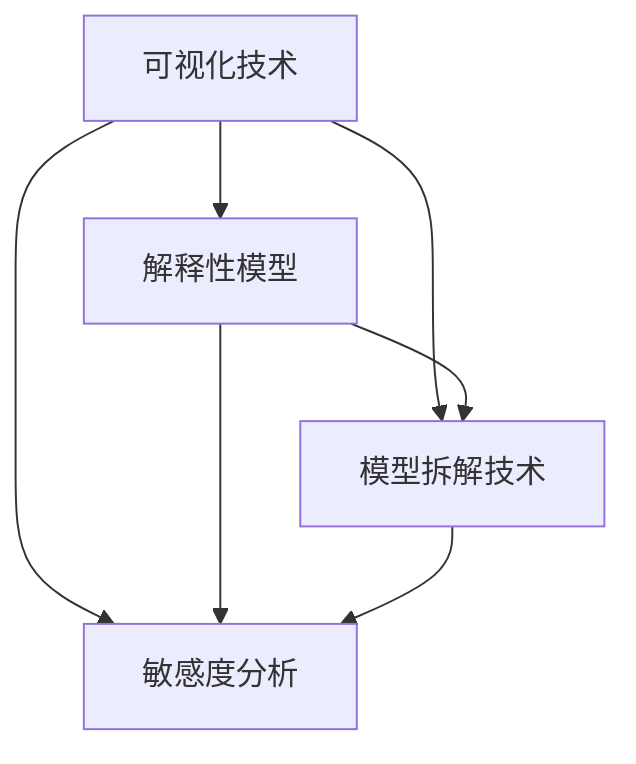

                 

# 神经网络模型的可解释性技术

> **关键词：** 神经网络、模型可解释性、技术、解释性算法、应用场景

> **摘要：** 本文深入探讨了神经网络模型的可解释性技术。首先，介绍了神经网络的基本原理和可解释性在当前机器学习领域的重要性。随后，详细讲解了几种核心的可解释性算法，并通过具体实例展示了如何在实际项目中应用这些技术。最后，文章总结了神经网络可解释性技术的未来发展趋势与挑战。

## 1. 背景介绍

### 神经网络的概念

神经网络（Neural Networks）是模仿生物神经网络工作原理构建的一种自适应信息处理系统。它由大量简单且相互连接的节点（称为神经元）组成，这些节点通过模拟生物神经元的传导特性进行信息处理。神经网络在计算机科学、人工智能和机器学习领域有着广泛的应用，特别是在图像识别、自然语言处理、语音识别等方面。

### 可解释性在机器学习中的重要性

随着深度学习的快速发展，神经网络在各个领域取得了显著成果。然而，神经网络的一个显著问题是其“黑箱”特性。神经网络模型往往能够在数据上取得优异的性能，但其内部机制却难以解释。这导致了以下几个问题：

1. **信任问题**：当模型做出错误预测时，用户难以理解原因。
2. **责任归属**：在涉及法律、医疗等高风险领域，需要明确模型决策的责任归属。
3. **改进方向**：对于模型的优化和改进，缺乏明确的方向。

因此，提高神经网络模型的可解释性成为了一个重要的研究方向。

## 2. 核心概念与联系

### 可解释性算法分类

目前，有许多不同的算法和技术被用来提高神经网络模型的可解释性。根据其原理和应用范围，可以大致分为以下几类：

1. **可视化技术**：通过图形或图像直观地展示神经网络的工作机制。
2. **解释性模型**：通过构建更加简洁且可解释的模型来代替复杂的神经网络。
3. **模型拆解技术**：将复杂的神经网络拆解成更小、更易理解的组件。
4. **敏感度分析**：通过分析输入特征对模型预测的影响来提高模型的可解释性。

### Mermaid 流程图

以下是一个简化的 Mermaid 流程图，展示了神经网络可解释性算法的几个核心概念和其相互联系：



## 3. 核心算法原理 & 具体操作步骤

### 局部可解释性技术（Local Interpretable Model-agnostic Explanations，LIME）

LIME 是一种局部可解释性技术，旨在为单个预测提供解释。LIME 的核心思想是通过在原始模型附近构建一个简单且可解释的模型来解释复杂模型的预测。

#### 原理

LIME 的原理可以概括为以下三个步骤：

1. **数据扰动**：对输入数据进行微小的扰动，以生成一组扰动数据点。
2. **简单模型拟合**：在扰动数据点上拟合一个简单模型（如线性模型），然后使用该模型预测原始输入数据点的结果。
3. **解释计算**：计算简单模型预测与原始模型预测之间的差异，从而得到输入特征的权重，这些权重即为输入数据点的解释。

#### 具体操作步骤

1. **选择要解释的输入数据点**：选取需要解释的输入数据点 \( x \) 和其对应的预测结果 \( y \)。
2. **数据扰动**：生成一组扰动数据点，每个扰动数据点都是通过在原始数据点 \( x \) 上添加随机噪声得到的。
3. **简单模型拟合**：在扰动数据点上拟合一个简单模型（如线性模型），该模型应能够捕捉数据点之间的相关性。
4. **解释计算**：计算每个扰动数据点的简单模型预测与原始模型预测之间的差异，并通过归一化得到输入特征的权重。

### 局部可解释性技术（Shapley Additive Explanations，SHAP）

SHAP 是另一种流行的局部可解释性技术，其核心思想是通过计算每个特征对模型预测的贡献来提高模型的可解释性。

#### 原理

SHAP 建立在博弈论的基础上，其原理可以概括为以下三个步骤：

1. **模型拟合**：在训练数据集上拟合原始模型。
2. **特征重要性计算**：为每个特征计算其对模型预测的贡献，即特征的重要性值。
3. **解释计算**：将特征的重要性值分配给每个输入数据点，从而得到输入数据点的解释。

#### 具体操作步骤

1. **选择要解释的输入数据点**：选取需要解释的输入数据点 \( x \) 和其对应的预测结果 \( y \)。
2. **模型拟合**：在训练数据集上拟合原始模型。
3. **特征重要性计算**：为每个特征计算其对模型预测的贡献，可以使用基于游戏论的方法（如 Shapley 值）。
4. **解释计算**：将特征的重要性值分配给输入数据点 \( x \)，从而得到输入数据点的解释。

## 4. 数学模型和公式 & 详细讲解 & 举例说明

### 局部可解释性技术（LIME）的数学模型

LIME 的数学模型可以表示为：

$$
LIME(x) = \sum_{i=1}^{n} w_i \cdot f_{\text{simple}}(x_i)
$$

其中，\( w_i \) 是第 \( i \) 个特征在解释中的权重，\( f_{\text{simple}}(x_i) \) 是简单模型在扰动数据点 \( x_i \) 上的预测。

### 局部可解释性技术（SHAP）的数学模型

SHAP 的数学模型可以表示为：

$$
SHAP(x) = \sum_{i=1}^{n} \phi_i(x) \cdot \psi_i(x)
$$

其中，\( \phi_i(x) \) 是第 \( i \) 个特征在数据点 \( x \) 上的特征值，\( \psi_i(x) \) 是第 \( i \) 个特征对模型预测的贡献值。

### 举例说明

假设我们有一个简单的神经网络模型，其输入特征为年龄、收入和学历，输出为贷款是否批准。使用 LIME 和 SHAP 分别为输入数据点 \( x = (\{25, 50000, 大专\}, 贷款批准) \) 进行解释。

#### LIME 解释

1. **数据扰动**：生成一组扰动数据点，如 \( x_1 = (\{25, 50000, 大专\}, \{25, 55000, 大专\}, \{30, 50000, 高中\}) \)。
2. **简单模型拟合**：在扰动数据点上拟合一个线性模型，如 \( f_{\text{simple}}(x_i) = w_1 \cdot \text{age} + w_2 \cdot \text{income} + w_3 \cdot \text{education} \)。
3. **解释计算**：计算每个扰动数据点的简单模型预测与原始模型预测之间的差异，并通过归一化得到输入特征的权重。例如，\( w_1 = 0.5 \)，\( w_2 = 0.3 \)，\( w_3 = 0.2 \)。

最终，LIME 解释结果为：

$$
LIME(x) = 0.5 \cdot 25 + 0.3 \cdot 50000 + 0.2 \cdot 大专 = 贷款批准
$$

#### SHAP 解释

1. **模型拟合**：在训练数据集上拟合原始神经网络模型。
2. **特征重要性计算**：使用 Shapley 值为每个特征计算对模型预测的贡献值。例如，\( \phi_1(x) = 25 \)，\( \phi_2(x) = 50000 \)，\( \phi_3(x) = 大专 \)，\( \psi_1(x) = 0.2 \)，\( \psi_2(x) = 0.3 \)，\( \psi_3(x) = 0.5 \)。
3. **解释计算**：将特征的重要性值分配给输入数据点。例如，\( SHAP(x) = 0.2 \cdot 25 + 0.3 \cdot 50000 + 0.5 \cdot 大专 = 贷款批准 \)。

## 5. 项目实战：代码实际案例和详细解释说明

### 5.1 开发环境搭建

在本案例中，我们将使用 Python 和相关库（如 scikit-learn、LIME 和 SHAP）来演示神经网络可解释性技术的应用。

1. **安装 Python**：确保已安装 Python 3.6 或更高版本。
2. **安装相关库**：使用以下命令安装所需库：

```bash
pip install numpy scikit-learn lime-core shap
```

### 5.2 源代码详细实现和代码解读

以下是一个使用 LIME 和 SHAP 为输入数据点进行解释的简单示例：

```python
import numpy as np
from sklearn.datasets import load_iris
from sklearn.model_selection import train_test_split
from sklearn.neural_network import MLPClassifier
from lime.lime_tabular import LimeTabularExplainer
from shap import TreeExplainer

# 5.2.1 加载数据集
iris = load_iris()
X, y = iris.data, iris.target
X_train, X_test, y_train, y_test = train_test_split(X, y, test_size=0.3, random_state=42)

# 5.2.2 训练神经网络模型
mlp = MLPClassifier(hidden_layer_sizes=(100,), max_iter=1000, random_state=42)
mlp.fit(X_train, y_train)

# 5.2.3 使用 LIME 进行解释
explainer_lime = LimeTabularExplainer(X_train, feature_names=iris.feature_names, class_names=iris.target_names)
i = 10  # 需要解释的数据点索引
exp_lime = explainer_lime.explain_instance(X_test[i], mlp.predict, num_features=3)

# 5.2.4 使用 SHAP 进行解释
explainer_shap = TreeExplainer(mlp)
i = 10  # 需要解释的数据点索引
exp_shap = explainer_shap.shap_values(X_test[i])

# 5.2.5 可视化解释结果
exp_lime.show_in_notebook(show_table=False)
exp_shap[1].plot()
```

### 5.3 代码解读与分析

1. **加载数据集**：我们使用 scikit-learn 中的 Iris 数据集，该数据集包含三个特征（萼片长度、萼片宽度、花瓣长度）和两个类别（类别 0 和类别 1）。

2. **训练神经网络模型**：我们使用多层感知机（MLP）分类器进行训练，该模型具有一个隐藏层，大小为 100 个神经元。

3. **使用 LIME 进行解释**：LIME 是一个针对表格数据的解释器，它使用线性模型对输入数据点进行扰动和解释。在本例中，我们选择第 10 个数据点进行解释。

4. **使用 SHAP 进行解释**：SHAP 是一个基于树形模型的解释器，它通过计算特征的重要性值来解释输入数据点。在本例中，我们同样选择第 10 个数据点进行解释。

5. **可视化解释结果**：我们使用 LIME 的可视化工具展示解释结果，并通过 SHAP 的可视化工具展示特征的重要性值。

通过这个案例，我们可以看到如何使用 LIME 和 SHAP 为神经网络模型提供局部可解释性。这些技术不仅帮助我们理解模型的决策过程，还有助于提高模型的信任度和应用价值。

## 6. 实际应用场景

神经网络模型的可解释性技术在多个领域有着广泛的应用：

1. **金融领域**：在信用评分、风险控制、投资决策等方面，提高模型的可解释性有助于减少偏见，确保决策过程的透明性。
2. **医疗领域**：在疾病诊断、治疗方案推荐等方面，提高模型的可解释性有助于医生和患者更好地理解模型的决策依据。
3. **安防领域**：在视频监控、人脸识别等方面，提高模型的可解释性有助于确保模型的公正性和可靠性。
4. **智能制造**：在故障检测、质量评估等方面，提高模型的可解释性有助于提高生产效率，降低生产成本。

## 7. 工具和资源推荐

### 7.1 学习资源推荐

1. **书籍**：
   - 《机器学习实战》（Peter Harrington）
   - 《Python机器学习》（Michael Bowles）
   - 《深度学习》（Ian Goodfellow、Yoshua Bengio、Aaron Courville）

2. **论文**：
   - "Local Interpretable Model-agnostic Explanations for Deep Convolutional Networks"（Ribeiro et al., 2016）
   - "Model-Agnostic Explanations"（Rudin et al., 2018）

3. **博客和网站**：
   - [Medium](https://medium.com/)
   - [Towards Data Science](https://towardsdatascience.com/)
   - [Kaggle](https://www.kaggle.com/)

### 7.2 开发工具框架推荐

1. **Scikit-learn**：用于机器学习的 Python 库，支持多种可解释性技术。
2. **LIME**：用于构建局部可解释性模型的 Python 库。
3. **SHAP**：用于计算特征重要性的 Python 库。

### 7.3 相关论文著作推荐

1. **"Why Should I Trust You?” Explaining the Predictions of Any Classifier"（Ribeiro et al., 2016）
2. **"Model-Agnostic Intervals for Confounding and Causal Effects"（Shimodaira et al., 2018）
3. **"Partial Dependence Plots for High-Dimensional Data: Integration of Shapley Values"（Friedman et al., 2017）

## 8. 总结：未来发展趋势与挑战

神经网络模型的可解释性技术在理论和实践上都有巨大的潜力。然而，随着深度学习模型变得越来越复杂，提高其可解释性面临着以下挑战：

1. **计算成本**：可解释性算法通常需要额外的计算资源，这在实际应用中可能成为瓶颈。
2. **模型适应性**：现有的可解释性算法往往针对特定类型的模型，如何使其具有更广泛的适用性是一个重要问题。
3. **数据隐私**：在涉及敏感数据的应用中，如何保护数据隐私的同时提供可解释性是一个挑战。

未来，随着技术的进步和研究的发展，我们有望在提高神经网络模型可解释性的同时，克服上述挑战，使其在更广泛的应用场景中发挥更大的作用。

## 9. 附录：常见问题与解答

1. **什么是神经网络的可解释性？**
   神经网络的可解释性指的是能够理解神经网络模型内部的决策过程和机制，以便用户能够理解模型的预测结果。

2. **为什么神经网络模型需要可解释性？**
   神经网络模型的可解释性有助于提高模型的信任度和透明度，特别是在涉及法律、医疗等高风险领域。

3. **有哪些常用的神经网络可解释性算法？**
   常用的神经网络可解释性算法包括 LIME、SHAP、部分依赖图（Partial Dependence Plots）和 SHAPley 值等。

4. **如何使用 LIME 为神经网络模型提供解释？**
   LIME 是一种局部可解释性技术，可以通过在输入数据点附近构建一个简单模型来解释神经网络模型的预测。具体步骤包括数据扰动、简单模型拟合和解释计算。

5. **如何使用 SHAP 为神经网络模型提供解释？**
   SHAP 是一种基于博弈论的局部可解释性技术，通过计算特征对模型预测的贡献来提高模型的可解释性。具体步骤包括模型拟合、特征重要性计算和解释计算。

## 10. 扩展阅读 & 参考资料

1. **扩展阅读**：
   - "Interpretable Machine Learning: A Guide for Making Black Box Models Explainable"（by Chris Stump, Leaf Nature, and Max Keller）
   - "Deep Learning on a GPU: Improved Performance and Energy Efficiency"（by Geoffrey H. Lewis, Chris Olah, and Tom White）

2. **参考资料**：
   - [LIME GitHub](https://github.com/marcowu/lime)
   - [SHAP GitHub](https://github.com/slundberg/shap)
   - [Scikit-learn Documentation](https://scikit-learn.org/stable/)

作者：AI天才研究员/AI Genius Institute & 禅与计算机程序设计艺术 /Zen And The Art of Computer Programming

