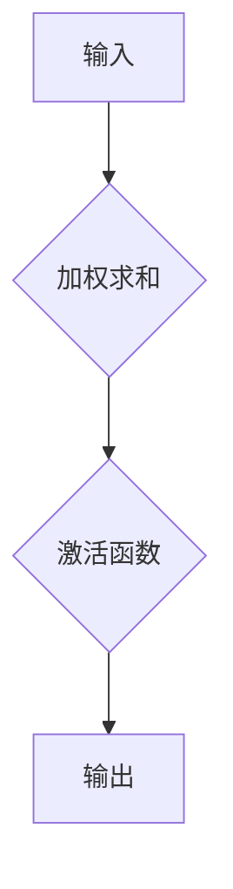
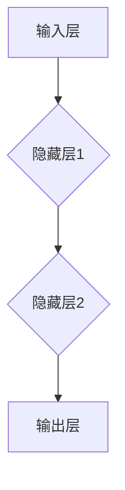
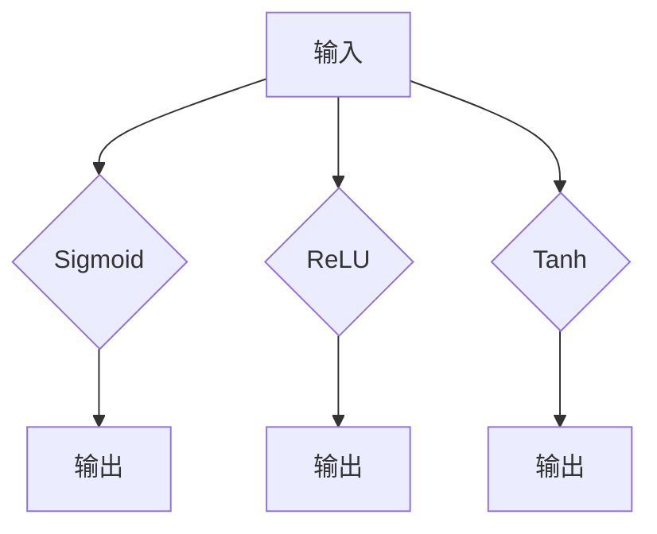
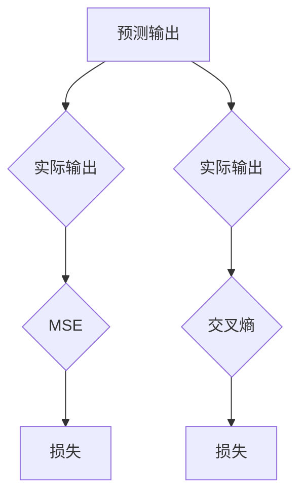

                 

# 神经网络：人类与机器的共存

## 关键词
- 神经网络
- 人工智能
- 机器学习
- 计算机视觉
- 自然语言处理
- 深度学习
- 神经架构搜索

## 摘要
本文旨在探讨神经网络这一强大的人工智能工具如何帮助人类与机器实现更高效的共存。我们将从背景介绍、核心概念与联系、核心算法原理、数学模型和公式、项目实战、实际应用场景、工具和资源推荐、未来发展趋势与挑战以及常见问题与解答等多个方面，系统性地梳理神经网络的相关知识，并提供实用的实战案例。通过本文的阅读，您将深入理解神经网络的工作原理，掌握其实际应用技巧，并能够展望其未来的发展前景。

### 1. 背景介绍

#### 1.1 神经网络的发展历程

神经网络作为一种模仿人脑结构的计算模型，其发展历程可以追溯到上世纪40年代。当时，心理学家和数学家们开始尝试用数学模型来模拟人脑的神经网络。1958年，弗兰克·罗森布拉特（Frank Rosenblatt）发明了感知机（Perceptron），这是第一个能够进行二分类的神经网络模型。尽管感知机存在一些局限性，但它为神经网络的发展奠定了基础。

随着时间的推移，神经网络经历了多个发展阶段。1986年，具有反向传播算法的多层感知机（Multilayer Perceptron, MLP）被提出，使得神经网络能够处理更复杂的非线性问题。随后，深度学习的概念被提出，并迅速发展。2012年，深度卷积神经网络（Convolutional Neural Network, CNN）在图像识别任务上取得了突破性成果，标志着深度学习时代的到来。

#### 1.2 人工智能的发展背景

人工智能（Artificial Intelligence, AI）是计算机科学的一个分支，旨在使计算机具备类似人类智能的能力。随着计算能力的提升和大数据的涌现，人工智能在多个领域取得了显著进展。例如，计算机视觉使机器能够识别和理解图像，自然语言处理使机器能够理解和生成自然语言，机器人技术使机器能够执行复杂的物理任务。

神经网络作为人工智能的重要技术之一，其发展对人工智能的进步起到了关键作用。神经网络模型能够通过学习大量的数据，自动提取有用的特征，从而实现复杂任务的自动化。这使得神经网络在计算机视觉、自然语言处理、机器人控制等众多领域得到了广泛应用。

#### 1.3 人类与机器共存的现实需求

在现代社会中，人类与机器的共存已成为一种现实需求。随着科技的进步，越来越多的机器和系统能够执行复杂的任务，提高生产效率，改善生活质量。例如，自动驾驶汽车、智能客服、智能家居等，都在不同程度上改变了人们的生活方式。

然而，人类与机器的共存也带来了一系列挑战。如何确保机器系统的安全性和可靠性？如何实现人类与机器的高效协作？如何处理机器产生的海量数据？这些问题都需要通过深入研究和创新来解决。神经网络作为一种具有自适应性和智能化的计算模型，能够在这些方面提供有力的支持。

### 2. 核心概念与联系

#### 2.1 神经元

神经元是神经网络的基本单元，类似于人脑中的神经元。神经元接收输入信号，通过权重进行加权求和，再通过激活函数产生输出。神经元的结构和功能可以用Mermaid流程图表示：



#### 2.2 层

神经网络由多个层组成，包括输入层、隐藏层和输出层。输入层接收外部输入信号，隐藏层进行特征提取和变换，输出层生成最终输出。各层之间通过神经元连接，形成一个层次化的结构。



#### 2.3 激活函数

激活函数是神经网络中的一个重要概念，用于引入非线性特性。常见的激活函数包括Sigmoid函数、ReLU函数和Tanh函数。激活函数的选择对神经网络的性能有重要影响。



#### 2.4 损失函数

损失函数用于衡量神经网络输出与实际输出之间的差距。常见的损失函数包括均方误差（Mean Squared Error, MSE）、交叉熵（Cross Entropy Loss）等。损失函数的选择对神经网络的优化过程有重要影响。



### 3. 核心算法原理 & 具体操作步骤

#### 3.1 前向传播

前向传播是神经网络的基本操作之一，用于计算神经网络在给定输入下的输出。具体步骤如下：

1. 初始化神经网络参数（权重和偏置）。
2. 对输入数据进行预处理，如归一化、标准化等。
3. 将输入数据传递到神经网络的输入层。
4. 通过每个层的神经元，进行加权求和并应用激活函数。
5. 最终得到输出层的输出。

#### 3.2 反向传播

反向传播是神经网络的优化过程，用于调整网络参数以最小化损失函数。具体步骤如下：

1. 计算输出层的误差（损失函数值）。
2. 通过每个层，将误差反向传播到输入层。
3. 根据误差计算每个神经元的梯度。
4. 使用梯度下降或其他优化算法更新神经网络参数。

#### 3.3 梯度下降

梯度下降是反向传播中常用的优化算法，用于调整神经网络参数。具体步骤如下：

1. 计算损失函数关于每个参数的梯度。
2. 使用梯度更新参数：$$\theta_{\text{new}} = \theta_{\text{old}} - \alpha \cdot \nabla_{\theta} J(\theta)$$，其中 $\alpha$ 是学习率。
3. 重复步骤1和2，直到达到收敛条件。

### 4. 数学模型和公式 & 详细讲解 & 举例说明

#### 4.1 前向传播公式

前向传播中，神经元的输出可以通过以下公式计算：

$$
\text{output} = \sigma(\sum_{j=1}^{n} w_{ji} \cdot x_{j} + b_i)
$$

其中，$\sigma$ 是激活函数，$w_{ji}$ 是输入层到隐藏层的权重，$x_{j}$ 是输入层第 $j$ 个神经元的输入，$b_i$ 是隐藏层第 $i$ 个神经元的偏置。

#### 4.2 反向传播公式

反向传播中，每个神经元的误差可以通过以下公式计算：

$$
\nabla_{x_i} J(x) = \frac{\partial}{\partial x_i} \left( \sum_{j=1}^{n} \sigma(\sum_{k=1}^{m} w_{kj} \cdot x_{k} + b_j) - y \right)
$$

其中，$J(x)$ 是损失函数，$y$ 是实际输出，$\sigma$ 是激活函数。

#### 4.3 梯度下降公式

梯度下降中，参数的更新可以通过以下公式计算：

$$
\theta_{\text{new}} = \theta_{\text{old}} - \alpha \cdot \nabla_{\theta} J(\theta)
$$

其中，$\alpha$ 是学习率，$\nabla_{\theta} J(\theta)$ 是损失函数关于参数 $\theta$ 的梯度。

#### 4.4 举例说明

假设我们有一个简单的神经网络，包含一个输入层、一个隐藏层和一个输出层。输入层有两个神经元，隐藏层有两个神经元，输出层有一个神经元。激活函数使用 Sigmoid 函数。给定输入数据 $[0.5, 0.7]$ 和标签 $[0.9]$，我们将使用前向传播和反向传播来计算损失并更新参数。

**前向传播：**

1. 初始化参数：$w_{11} = 0.1, w_{12} = 0.2, w_{21} = 0.3, w_{22} = 0.4, b_1 = 0.1, b_2 = 0.2, b_3 = 0.3$
2. 计算隐藏层输出：
   $$
   z_1 = 0.1 \cdot 0.5 + 0.3 \cdot 0.7 + 0.1 = 0.205 \\
   z_2 = 0.2 \cdot 0.5 + 0.4 \cdot 0.7 + 0.2 = 0.28 \\
   h_1 = \sigma(z_1) = \frac{1}{1 + e^{-z_1}} = 0.527 \\
   h_2 = \sigma(z_2) = \frac{1}{1 + e^{-z_2}} = 0.686
   $$
3. 计算输出层输出：
   $$
   z_3 = 0.1 \cdot 0.527 + 0.2 \cdot 0.686 + 0.3 = 0.243 \\
   o_3 = \sigma(z_3) = \frac{1}{1 + e^{-z_3}} = 0.575
   $$

**反向传播：**

1. 计算损失函数：
   $$
   J(o_3) = (0.9 - 0.575)^2 = 0.108
   $$
2. 计算输出层误差的梯度：
   $$
   \nabla_{z_3} J(o_3) = \frac{\partial}{\partial z_3} (0.9 - 0.575) = 0.375 \\
   \nabla_{o_3} J(o_3) = \frac{\partial}{\partial o_3} (0.9 - 0.575) \cdot \sigma'(z_3) = 0.375 \cdot 0.424 = 0.158
   $$
3. 计算隐藏层误差的梯度：
   $$
   \nabla_{z_1} J(o_3) = w_{31} \cdot \nabla_{o_3} J(o_3) = 0.1 \cdot 0.158 = 0.015 \\
   \nabla_{z_2} J(o_3) = w_{32} \cdot \nabla_{o_3} J(o_3) = 0.2 \cdot 0.158 = 0.031 \\
   \nabla_{h_1} J(o_3) = \nabla_{z_1} J(o_3) \cdot \sigma'(z_1) = 0.015 \cdot 0.473 = 0.007 \\
   \nabla_{h_2} J(o_3) = \nabla_{z_2} J(o_3) \cdot \sigma'(z_2) = 0.031 \cdot 0.314 = 0.009
   $$
4. 更新参数：
   $$
   w_{31} = w_{31} - \alpha \cdot \nabla_{z_1} J(o_3) = 0.1 - 0.1 \cdot 0.015 = 0.085 \\
   w_{32} = w_{32} - \alpha \cdot \nabla_{z_2} J(o_3) = 0.2 - 0.1 \cdot 0.031 = 0.164 \\
   b_1 = b_1 - \alpha \cdot \nabla_{h_1} J(o_3) = 0.1 - 0.1 \cdot 0.007 = 0.093 \\
   b_2 = b_2 - \alpha \cdot \nabla_{h_2} J(o_3) = 0.2 - 0.1 \cdot 0.009 = 0.191
   $$

通过以上计算，我们更新了神经网络的参数，使得损失函数值下降。这个过程将重复进行，直到达到收敛条件。

### 5. 项目实战：代码实际案例和详细解释说明

在本节中，我们将通过一个简单的神经网络项目来展示如何实现神经网络的基本功能。我们将使用 Python 语言和 TensorFlow 库来实现一个简单的线性回归模型。

#### 5.1 开发环境搭建

1. 安装 Python 3.x 版本。
2. 安装 TensorFlow 库：

```bash
pip install tensorflow
```

#### 5.2 源代码详细实现和代码解读

以下是一个简单的线性回归模型的代码实现：

```python
import tensorflow as tf
import numpy as np

# 模型参数
learning_rate = 0.1
num_epochs = 100

# 输入数据
X = np.array([1, 2, 3, 4, 5])
Y = np.array([2, 4, 5, 4, 5])

# 构建模型
model = tf.keras.Sequential([
    tf.keras.layers.Dense(units=1, input_shape=[1])
])

# 编译模型
model.compile(optimizer='sgd', loss='mean_squared_error')

# 训练模型
model.fit(X, Y, epochs=num_epochs)

# 预测
predictions = model.predict(X)

# 输出预测结果
print(predictions)
```

**代码解读：**

1. 导入 TensorFlow 和 NumPy 库。
2. 定义模型参数，包括学习率和训练轮数。
3. 创建输入数据。
4. 构建模型，这里使用一个全连接层（Dense Layer）。
5. 编译模型，指定优化器和损失函数。
6. 训练模型。
7. 使用模型进行预测。
8. 输出预测结果。

#### 5.3 代码解读与分析

在本例中，我们使用 TensorFlow 库构建了一个简单的线性回归模型。模型的核心是一个全连接层，它通过学习输入数据 $X$ 和标签 $Y$ 之间的关系，来预测新的输入数据。

**模型构建：**

```python
model = tf.keras.Sequential([
    tf.keras.layers.Dense(units=1, input_shape=[1])
])
```

这里使用 `Sequential` 模型堆叠器来构建模型。`Dense` 层是一个全连接层，它包含一个线性变换和一个激活函数。在这个例子中，我们使用默认的线性激活函数，即没有激活函数。

**模型编译：**

```python
model.compile(optimizer='sgd', loss='mean_squared_error')
```

在编译模型时，我们指定了优化器（`sgd` 表示随机梯度下降）和损失函数（`mean_squared_error` 表示均方误差）。优化器用于调整模型参数，以最小化损失函数。

**模型训练：**

```python
model.fit(X, Y, epochs=num_epochs)
```

`fit` 函数用于训练模型。在这里，我们使用训练数据 `X` 和 `Y` 进行训练，并指定训练轮数 `num_epochs`。每次训练轮数，模型都会尝试调整参数，以最小化损失函数。

**模型预测：**

```python
predictions = model.predict(X)
print(predictions)
```

在训练完成后，我们使用模型进行预测。`predict` 函数用于计算输入数据在训练好的模型上的预测结果。最后，我们输出预测结果。

### 6. 实际应用场景

神经网络在多个领域具有广泛的应用，以下是几个典型的应用场景：

#### 6.1 计算机视觉

计算机视觉是神经网络的重要应用领域之一。通过深度学习模型，神经网络能够自动提取图像中的特征，实现图像分类、目标检测、图像生成等任务。例如，卷积神经网络（CNN）在图像识别任务上取得了显著的成果。

#### 6.2 自然语言处理

自然语言处理（NLP）是另一个重要的应用领域。神经网络模型在文本分类、机器翻译、情感分析等方面表现出色。近年来，生成对抗网络（GAN）和变换器（Transformer）等模型在 NLP 中取得了突破性进展。

#### 6.3 机器人控制

神经网络在机器人控制领域也发挥着重要作用。通过学习环境中的数据，神经网络能够帮助机器人进行导航、抓取、避障等任务。例如，深度强化学习（DRL）在自动驾驶和机器人控制中取得了显著成果。

#### 6.4 金融领域

神经网络在金融领域也有着广泛的应用。例如，在股票市场预测、信用评分、风险管理等方面，神经网络模型能够通过分析历史数据，帮助金融机构做出更准确的决策。

### 7. 工具和资源推荐

#### 7.1 学习资源推荐

1. **书籍：**
   - 《深度学习》（Ian Goodfellow、Yoshua Bengio 和 Aaron Courville 著）
   - 《神经网络与深度学习》（邱锡鹏 著）
   - 《机器学习》（Tom Mitchell 著）

2. **在线课程：**
   - 吴恩达的《深度学习》课程（Coursera）
   - Andrew Ng 的《机器学习》课程（Coursera）

3. **博客和网站：**
   - Medium 上的机器学习和深度学习博客
   - arXiv.org 上的最新论文和研究成果

#### 7.2 开发工具框架推荐

1. **TensorFlow：** Google 开源的深度学习框架，广泛应用于研究和开发。
2. **PyTorch：** Facebook 开源的深度学习框架，具有灵活的动态计算图。
3. **Keras：** 高级神经网络API，易于使用和扩展。

#### 7.3 相关论文著作推荐

1. **《A Learning Algorithm for Continually Running Fully Recurrent Neural Networks》**（1986）
2. **《Deep Learning》**（2016）
3. **《Backpropagation》**（1986）

### 8. 总结：未来发展趋势与挑战

神经网络作为一种具有自适应性和智能化的计算模型，已经在多个领域取得了显著成果。然而，随着技术的不断进步，神经网络仍面临许多挑战和机遇。

#### 8.1 发展趋势

1. **计算能力提升：** 随着计算能力的提升，神经网络将能够处理更复杂的问题和数据。
2. **数据规模增长：** 大数据的增长为神经网络提供了丰富的训练数据，有助于提高模型的性能。
3. **多模态学习：** 神经网络将能够处理多种类型的数据，实现跨模态的学习和推理。

#### 8.2 挑战

1. **可解释性：** 神经网络模型的黑箱特性使其难以解释，需要开发可解释的神经网络模型。
2. **数据隐私：** 在处理敏感数据时，需要确保数据隐私和安全。
3. **过拟合：** 神经网络模型容易出现过拟合现象，需要开发有效的正则化方法。

### 9. 附录：常见问题与解答

#### 9.1 神经网络的基本原理是什么？

神经网络是一种模拟人脑结构的计算模型，通过多层神经元之间的连接和激活函数，实现数据的输入输出和特征提取。

#### 9.2 神经网络有哪些类型的激活函数？

常见的激活函数包括 Sigmoid、ReLU、Tanh 等。它们用于引入非线性特性，使神经网络能够处理复杂的非线性问题。

#### 9.3 如何避免神经网络过拟合？

过拟合可以通过以下方法避免：
- 增加训练数据
- 使用正则化方法（如 L1、L2 正则化）
- 使用dropout技术
- 调整网络结构

### 10. 扩展阅读 & 参考资料

1. **《深度学习》**（Ian Goodfellow、Yoshua Bengio 和 Aaron Courville 著）
2. **《神经网络与深度学习》**（邱锡鹏 著）
3. **《机器学习》**（Tom Mitchell 著）
4. **[TensorFlow 官方文档](https://www.tensorflow.org/)**
5. **[PyTorch 官方文档](https://pytorch.org/)**
6. **[Keras 官方文档](https://keras.io/)**
7. **[arXiv.org](https://arxiv.org/) 上的最新研究成果**<|assistant|>

