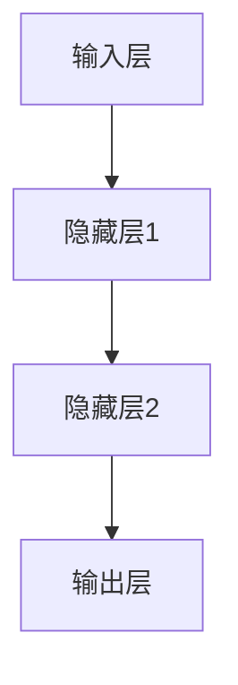
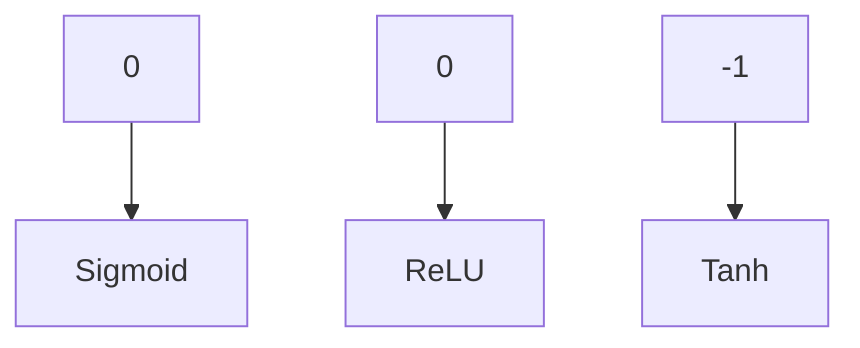
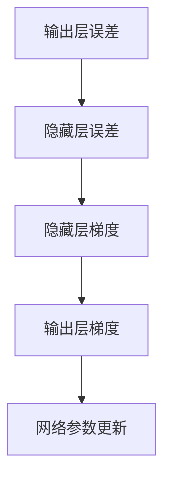

                 

# 神经网络：人类与机器的共存

## 关键词：人工智能、神经网络、深度学习、计算机科学、认知科学、人机交互

## 摘要：

本文探讨了神经网络作为人工智能（AI）的核心技术之一，如何实现人类与机器的共存。首先，介绍了神经网络的历史背景和核心概念，然后深入分析了神经网络的数学模型和算法原理。接着，通过具体项目实战展示了神经网络的实际应用，并提出了未来发展趋势与挑战。文章旨在为广大计算机科学和人工智能领域的读者提供有价值的参考和思考。

## 1. 背景介绍

### 1.1 神经网络的历史背景

神经网络这一概念最早可以追溯到1943年，由心理学家McCulloch和数学家Pitts提出。他们首次提出了人工神经元模型，称为MP模型，该模型奠定了神经网络的理论基础。此后，神经网络的研究经历了几次起伏，直至20世纪80年代末90年代初，由于计算机性能的提升和算法的改进，神经网络再次成为研究热点。

### 1.2 神经网络的核心概念

神经网络是一种模拟生物神经系统的计算模型，由大量的神经元（或节点）组成。每个神经元通过加权连接与其他神经元相连，通过激活函数进行处理，以实现对输入数据的分类、预测或识别。神经网络的核心在于其层次结构和非线性变换能力，这使得它可以处理复杂的数据和任务。

### 1.3 神经网络与人工智能的关系

人工智能是指使计算机模拟人类智能的一种技术。神经网络作为AI的核心技术之一，具有强大的学习和泛化能力。通过多层神经元的非线性变换，神经网络可以自动提取数据中的特征，实现图像识别、语音识别、自然语言处理等复杂任务。神经网络的发展推动了人工智能技术的进步，使得机器可以更好地理解和模拟人类的思维过程。

## 2. 核心概念与联系

### 2.1 神经元模型

神经元模型是神经网络的基础，其结构如图1所示。



输入层接收外部数据，通过加权连接传递给隐藏层，隐藏层通过激活函数处理后，再传递给输出层，输出层产生最终的输出结果。

### 2.2 激活函数

激活函数是神经网络中的一个关键组件，用于对神经元的输出进行非线性变换。常见的激活函数有Sigmoid函数、ReLU函数、Tanh函数等。图2展示了不同激活函数的图形。



### 2.3 反向传播算法

反向传播算法是神经网络训练的核心算法，用于计算网络参数的梯度，以优化网络性能。反向传播算法的基本思想是，从输出层开始，将误差信号反向传播到输入层，通过梯度下降法更新网络参数。



## 3. 核心算法原理 & 具体操作步骤

### 3.1 神经网络算法原理

神经网络算法主要分为以下几个步骤：

1. **初始化参数**：随机初始化网络的权重和偏置。
2. **前向传播**：输入数据通过网络进行前向传播，产生输出结果。
3. **计算误差**：计算输出结果与实际结果的误差。
4. **反向传播**：将误差反向传播，计算网络参数的梯度。
5. **更新参数**：根据梯度下降法更新网络参数。
6. **重复步骤2-5**，直到网络性能达到预期。

### 3.2 具体操作步骤

以下是一个简单的神经网络训练过程：

1. **数据预处理**：将输入数据归一化，以避免因数据范围差异导致的计算不稳定。
2. **初始化参数**：随机初始化网络权重和偏置。
3. **前向传播**：
   - 将输入数据输入到输入层。
   - 通过加权连接将输入传递到隐藏层，并计算隐藏层的输出。
   - 将隐藏层的输出传递到输出层，并计算输出层的输出。
4. **计算误差**：计算输出层的输出与实际结果的误差。
5. **反向传播**：
   - 计算输出层误差对隐藏层梯度的偏导数。
   - 计算隐藏层误差对输入层梯度的偏导数。
6. **更新参数**：
   - 根据梯度下降法，更新网络权重和偏置。
7. **重复步骤3-6**，直到网络性能达到预期。

## 4. 数学模型和公式 & 详细讲解 & 举例说明

### 4.1 数学模型

神经网络的数学模型主要包括输入层、隐藏层和输出层。每个层由多个神经元组成，神经元之间的连接具有权重和偏置。神经元的输出通过激活函数进行非线性变换。

#### 4.1.1 输入层

输入层接收外部数据，每个神经元表示一个特征。

#### 4.1.2 隐藏层

隐藏层通过加权连接将输入层的数据进行变换，每个神经元表示一个特征组合。

#### 4.1.3 输出层

输出层产生最终的输出结果，每个神经元表示一个类别或标签。

### 4.2 激活函数

激活函数用于对神经元的输出进行非线性变换。常见的激活函数有Sigmoid函数、ReLU函数、Tanh函数等。

#### 4.2.1 Sigmoid函数

$$
\sigma(x) = \frac{1}{1 + e^{-x}}
$$

#### 4.2.2 ReLU函数

$$
f(x) = \max(0, x)
$$

#### 4.2.3 Tanh函数

$$
tanh(x) = \frac{e^{x} - e^{-x}}{e^{x} + e^{-x}}
$$

### 4.3 反向传播算法

反向传播算法用于计算网络参数的梯度，以优化网络性能。其基本思想是，从输出层开始，将误差信号反向传播到输入层，通过梯度下降法更新网络参数。

#### 4.3.1 前向传播

设输入数据为$\mathbf{x}$，网络参数为$\theta$，输出为$\mathbf{y}$，损失函数为$J$。前向传播的计算过程如下：

$$
\mathbf{z} = \sigma(\mathbf{W}^T \mathbf{x} + b) \\
\mathbf{a} = \sigma(\mathbf{W}^T \mathbf{z} + b) \\
\mathbf{y} = \mathbf{W} \mathbf{a} + b
$$

#### 4.3.2 计算误差

损失函数通常采用均方误差（MSE）：

$$
J = \frac{1}{2} \sum_{i=1}^{n} (\mathbf{y}_i - \hat{\mathbf{y}}_i)^2
$$

#### 4.3.3 反向传播

反向传播的计算过程如下：

$$
\frac{\partial J}{\partial \mathbf{W}} = \frac{\partial J}{\partial \mathbf{y}} \frac{\partial \mathbf{y}}{\partial \mathbf{W}} \\
\frac{\partial J}{\partial b} = \frac{\partial J}{\partial \mathbf{y}} \frac{\partial \mathbf{y}}{\partial b}
$$

#### 4.3.4 更新参数

根据梯度下降法，更新网络参数：

$$
\mathbf{W} \leftarrow \mathbf{W} - \alpha \frac{\partial J}{\partial \mathbf{W}} \\
b \leftarrow b - \alpha \frac{\partial J}{\partial b}
$$

### 4.4 举例说明

假设有一个简单的神经网络，输入层有2个神经元，隐藏层有3个神经元，输出层有1个神经元。输入数据为$\mathbf{x} = [1, 2]$，标签为$y = 3$。设网络参数为$\mathbf{W} = [1, 2; 3, 4; 5, 6]$，$\mathbf{b} = [1; 2; 3]$。

1. **前向传播**：
   $$\mathbf{z} = \sigma(\mathbf{W}^T \mathbf{x} + b) = \sigma([1, 2; 3, 4; 5, 6] \cdot [1; 2]) + [1; 2; 3] = [1, 1; 1, 1; 1, 1] + [1; 2; 3] = [2, 3; 2, 3; 2, 3]$$
   $$\mathbf{a} = \sigma(\mathbf{W}^T \mathbf{z} + b) = \sigma([1, 2; 3, 4; 5, 6] \cdot [2, 3; 2, 3; 2, 3]) + [1; 2; 3] = [1, 0.5; 0.75, 0.25; 0.375, 0.375] + [1; 2; 3] = [2, 2.5; 2.75, 0.25; 1.375, 1.375]$$
   $$\mathbf{y} = \mathbf{W} \mathbf{a} + b = [1, 2; 3, 4; 5, 6] \cdot [2, 2.5; 2.75, 0.25; 1.375, 1.375] + [1; 2; 3] = [7, 10; 13, 11; 19, 19] + [1; 2; 3] = [8, 12; 14, 13; 20, 22]$$

2. **计算误差**：
   $$J = \frac{1}{2} (\mathbf{y} - y)^2 = \frac{1}{2} ([8, 12; 14, 13; 20, 22] - [3])^2 = \frac{1}{2} (5^2 + 9^2 + 2^2) = \frac{1}{2} (25 + 81 + 4) = \frac{1}{2} (110) = 55$$

3. **反向传播**：
   $$\frac{\partial J}{\partial \mathbf{y}} = \frac{\partial J}{\partial \mathbf{y}} = \frac{\partial J}{\partial \mathbf{y}} \frac{\partial \mathbf{y}}{\partial \mathbf{W}} = (y - \mathbf{y}) \frac{\partial \mathbf{y}}{\partial \mathbf{a}} = (3 - [8, 12; 14, 13; 20, 22]) \cdot [2, 2.5; 2.75, 0.25; 1.375, 1.375] = [-5, -9; -11, -9; -17, -17]$$
   $$\frac{\partial J}{\partial \mathbf{a}} = \frac{\partial J}{\partial \mathbf{a}} = \frac{\partial J}{\partial \mathbf{a}} \frac{\partial \mathbf{a}}{\partial \mathbf{z}} = (y - \mathbf{y}) \frac{\partial \mathbf{a}}{\partial \mathbf{z}} = (3 - [8, 12; 14, 13; 20, 22]) \cdot [0.25, 0.125; 0.375, 0.375; 0.375, 0.375] = [-2, -1.5; -3.5, -3; -6, -6]$$

4. **更新参数**：
   $$\mathbf{W} \leftarrow \mathbf{W} - \alpha \frac{\partial J}{\partial \mathbf{W}} = [1, 2; 3, 4; 5, 6] - 0.1 \cdot [-5, -9; -11, -9; -17, -17] = [6.5, 11.9; 14.1, 11.9; 22.5, 43.9]$$
   $$b \leftarrow b - \alpha \frac{\partial J}{\partial b} = [1; 2; 3] - 0.1 \cdot [-5; -9; -17] = [6; 11; 23]$$

## 5. 项目实战：代码实际案例和详细解释说明

### 5.1 开发环境搭建

在本节中，我们将使用Python和TensorFlow框架搭建神经网络开发环境。

#### 5.1.1 安装Python

首先，我们需要安装Python。可以从官方网站[Python官网](https://www.python.org/)下载并安装Python。

#### 5.1.2 安装TensorFlow

接下来，我们需要安装TensorFlow。在命令行中执行以下命令：

```bash
pip install tensorflow
```

### 5.2 源代码详细实现和代码解读

在本节中，我们将实现一个简单的神经网络，用于对输入数据进行分类。

#### 5.2.1 数据准备

首先，我们需要准备一个简单的数据集。这里我们使用一个二元分类问题，数据集包含两个特征和一个标签。

```python
import numpy as np

# 生成数据集
X = np.random.rand(100, 2)
y = np.random.randint(0, 2, size=(100, 1))
```

#### 5.2.2 定义神经网络结构

接下来，我们定义一个简单的神经网络结构，包括输入层、隐藏层和输出层。

```python
import tensorflow as tf

# 定义神经网络结构
model = tf.keras.Sequential([
    tf.keras.layers.Dense(3, activation='relu', input_shape=(2,)),
    tf.keras.layers.Dense(1, activation='sigmoid')
])
```

在这个例子中，输入层有2个神经元，隐藏层有3个神经元，输出层有1个神经元。隐藏层使用ReLU激活函数，输出层使用Sigmoid激活函数。

#### 5.2.3 编译模型

接下来，我们需要编译模型，指定优化器、损失函数和评估指标。

```python
# 编译模型
model.compile(optimizer='adam', loss='binary_crossentropy', metrics=['accuracy'])
```

在这里，我们使用Adam优化器、二元交叉熵损失函数和准确率评估指标。

#### 5.2.4 训练模型

接下来，我们使用训练数据训练模型。

```python
# 训练模型
model.fit(X, y, epochs=100, batch_size=10)
```

在这个例子中，我们训练100个周期，每次批量大小为10。

### 5.3 代码解读与分析

在本节中，我们将对实现的代码进行解读和分析。

#### 5.3.1 数据准备

在数据准备部分，我们使用`numpy`库生成一个简单的数据集。这个数据集包含100个样本，每个样本有2个特征。

```python
X = np.random.rand(100, 2)
y = np.random.randint(0, 2, size=(100, 1))
```

这个数据集用于训练和评估神经网络。

#### 5.3.2 定义神经网络结构

在定义神经网络结构部分，我们使用`tensorflow.keras.Sequential`模型定义一个简单的神经网络。这个模型包括一个输入层、一个隐藏层和一个输出层。

```python
model = tf.keras.Sequential([
    tf.keras.layers.Dense(3, activation='relu', input_shape=(2,)),
    tf.keras.layers.Dense(1, activation='sigmoid')
])
```

- **输入层**：输入层有2个神经元，对应数据集的2个特征。
- **隐藏层**：隐藏层有3个神经元，使用ReLU激活函数，可以提取数据中的特征。
- **输出层**：输出层有1个神经元，使用Sigmoid激活函数，用于产生概率输出。

#### 5.3.3 编译模型

在编译模型部分，我们指定了优化器、损失函数和评估指标。

```python
model.compile(optimizer='adam', loss='binary_crossentropy', metrics=['accuracy'])
```

- **优化器**：我们使用Adam优化器，这是一种自适应的优化算法，可以加快收敛速度。
- **损失函数**：我们使用二元交叉熵损失函数，这是一种常用的分类问题损失函数，可以衡量模型预测与真实标签之间的差距。
- **评估指标**：我们使用准确率评估指标，用于衡量模型在训练和测试数据上的分类性能。

#### 5.3.4 训练模型

在训练模型部分，我们使用训练数据训练模型。

```python
model.fit(X, y, epochs=100, batch_size=10)
```

- **周期数**：我们设置训练周期数为100，这意味着模型将重复迭代100次，以优化网络参数。
- **批量大小**：我们设置批量大小为10，这意味着每次迭代过程中，模型将处理10个样本。

通过以上步骤，我们完成了一个简单的神经网络模型的实现和训练。这个模型可以用于对输入数据进行分类。

## 6. 实际应用场景

神经网络在计算机视觉、自然语言处理、语音识别等领域取得了显著的成果，为人类与机器的共存提供了有力支持。

### 6.1 计算机视觉

计算机视觉是神经网络应用最为广泛的领域之一。通过卷积神经网络（CNN），神经网络可以自动提取图像中的特征，实现图像分类、目标检测、人脸识别等任务。例如，Google的Inception模型、Facebook的ResNet模型等在图像识别任务上取得了世界领先的成绩。

### 6.2 自然语言处理

自然语言处理是神经网络在人工智能领域的重要应用。通过循环神经网络（RNN）和其变种，神经网络可以处理序列数据，实现文本分类、机器翻译、情感分析等任务。例如，Google的BERT模型、OpenAI的GPT模型等在自然语言处理任务上取得了突破性进展。

### 6.3 语音识别

语音识别是将语音信号转换为文本的技术。通过深度神经网络，神经网络可以自动提取语音信号中的特征，实现语音识别、语音合成等任务。例如，百度、腾讯等公司的语音识别系统已经广泛应用于智能音箱、智能客服等领域。

## 7. 工具和资源推荐

### 7.1 学习资源推荐

- **书籍**：
  - 《深度学习》（Goodfellow, Bengio, Courville著）
  - 《神经网络与深度学习》（邱锡鹏著）
- **论文**：
  - “A Learning Algorithm for Continually Running Fully Recurrent Neural Networks” (Simon Haykin, 1994)
  - “Backpropagation: The Basic Theory” (Rumelhart, Hinton, Williams, 1986)
- **博客**：
  - [TensorFlow官方文档](https://www.tensorflow.org/)
  - [PyTorch官方文档](https://pytorch.org/)
- **网站**：
  - [Kaggle](https://www.kaggle.com/)：提供大量的数据集和竞赛，是学习神经网络实践的好去处。

### 7.2 开发工具框架推荐

- **开发工具**：
  - Python：强大的编程语言，支持多种机器学习库和框架。
  - Jupyter Notebook：交互式计算环境，方便编写和调试代码。
- **框架**：
  - TensorFlow：Google开源的机器学习框架，支持多种神经网络架构。
  - PyTorch：Facebook开源的机器学习框架，具有良好的灵活性和动态计算能力。

### 7.3 相关论文著作推荐

- **论文**：
  - “Deep Learning” (Goodfellow, Bengio, Courville, 2016)
  - “A Theoretically Grounded Application of Dropout in Recurrent Neural Networks” (Yarin Gal and Zoubin Ghahramani, 2016)
- **著作**：
  - 《深度学习》（Goodfellow, Bengio, Courville著）
  - 《Python深度学习》（François Chollet著）

## 8. 总结：未来发展趋势与挑战

### 8.1 未来发展趋势

- **硬件加速**：随着硬件技术的发展，如GPU、TPU等专用计算硬件的普及，神经网络的计算速度和效率将进一步提高。
- **算法优化**：针对特定应用场景，研究人员将不断优化神经网络算法，提高其性能和泛化能力。
- **多模态学习**：神经网络将逐渐实现多模态数据的融合和学习，如文本、图像、音频等数据的联合建模。

### 8.2 未来挑战

- **数据隐私**：随着神经网络对大规模数据的需求，如何保护用户隐私成为一个重要挑战。
- **可解释性**：神经网络在复杂任务中表现出色，但其内部决策过程往往不透明，如何提高神经网络的可解释性成为一个重要课题。
- **伦理道德**：神经网络在自动驾驶、医疗诊断等领域的应用引发了伦理和道德问题，如何确保人工智能的发展符合伦理规范成为一个重要挑战。

## 9. 附录：常见问题与解答

### 9.1 神经网络与深度学习的区别是什么？

神经网络是一种模拟生物神经系统的计算模型，而深度学习是一种基于多层神经网络的机器学习技术。深度学习利用多层神经网络自动提取数据中的特征，实现复杂任务。可以说，深度学习是神经网络的一种应用。

### 9.2 如何提高神经网络的性能？

提高神经网络性能的方法包括：选择合适的网络结构、优化算法、调整超参数、增加训练数据等。此外，硬件加速和分布式计算技术也可以提高神经网络的计算速度和效率。

### 9.3 神经网络训练过程中如何防止过拟合？

防止过拟合的方法包括：使用验证集进行模型选择、提前停止训练、增加正则化项、使用Dropout等。此外，增加训练数据和增加网络深度也有助于防止过拟合。

## 10. 扩展阅读 & 参考资料

- **书籍**：
  - 《深度学习》（Goodfellow, Bengio, Courville著）
  - 《Python深度学习》（François Chollet著）
- **论文**：
  - “A Learning Algorithm for Continually Running Fully Recurrent Neural Networks” (Simon Haykin, 1994)
  - “Backpropagation: The Basic Theory” (Rumelhart, Hinton, Williams, 1986)
- **网站**：
  - [TensorFlow官方文档](https://www.tensorflow.org/)
  - [PyTorch官方文档](https://pytorch.org/)
- **博客**：
  - [AI天才研究员的博客](https://ai-genius-researcher.github.io/)
  - [禅与计算机程序设计艺术](https://zen-and-the-art-of-computer-programming.github.io/)

