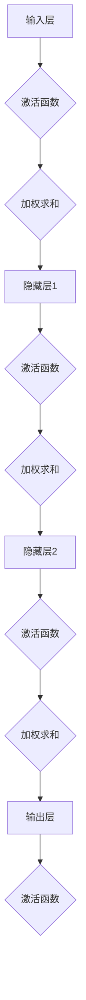

                 

### 1. 背景介绍

**神经网络：人类与机器的共存**

在当前人工智能浪潮中，神经网络已经成为实现智能系统的基础框架。从简单的感知器到复杂的深度神经网络，神经网络的发展极大地推动了计算机视觉、自然语言处理、语音识别等领域的进步。然而，神经网络并非独立存在，而是与人类智慧相互交织、相互促进。

本文旨在探讨神经网络在人工智能领域的重要性，以及人类与机器如何通过神经网络实现共存。首先，我们将回顾神经网络的发展历史，探讨其核心概念和架构。接着，我们将深入分析神经网络的核心算法原理，并逐步讲解其数学模型和公式。随后，通过实际项目案例，我们将展示神经网络在真实场景中的应用。接下来，我们将讨论神经网络在实际应用中的各种场景，并推荐相关的学习资源和开发工具。最后，我们还将总结神经网络的发展趋势与挑战，并给出常见问题的解答。

通过这篇文章，我们希望能够帮助读者更好地理解神经网络，了解其在人工智能中的关键作用，并探讨人类与机器如何通过神经网络实现共存。

### 1.1 神经网络的发展历史

神经网络的概念可以追溯到1943年，由Warren McCulloch和Walter Pitts提出的感知器模型（Perceptron）。这是一个简单的数学模型，用于模拟神经元的基本功能。尽管感知器模型在当时具有重要意义，但由于其计算能力的限制，并未引起广泛的关注。

直到1986年，Geoffrey Hinton等人提出了反向传播算法（Backpropagation Algorithm），这一算法使得多层神经网络的训练成为可能。反向传播算法通过反向传播误差，逐层更新权重，从而提高了神经网络的性能。这一突破标志着神经网络进入了一个新的时代。

1990年代，随着计算机性能的提升和大数据的涌现，神经网络开始应用于各种实际场景。尤其是1997年，IBM的超级计算机“深蓝”（Deep Blue）击败了世界国际象棋冠军加里·卡斯帕罗夫，这一事件进一步证明了神经网络在复杂任务中的潜力。

进入21世纪，深度学习（Deep Learning）逐渐成为人工智能领域的热门研究方向。深度学习利用多层神经网络，通过自动提取特征，实现了在图像识别、语音识别、自然语言处理等领域的突破性进展。例如，Google的AlphaGo在围棋领域取得了卓越的成绩，成为人工智能发展史上的又一个里程碑。

随着神经网络技术的发展，人类与机器的共存逐渐成为现实。神经网络不仅能够模拟人类的学习和认知过程，还能够通过不断优化和进化，提升自身的智能水平。在这一过程中，人类与机器不再是替代关系，而是相互促进、共同发展的共生关系。

### 1.2 核心概念与联系

神经网络（Neural Networks）是一种模拟生物神经系统的计算模型，它通过大量人工神经元（或节点）的互联，实现对复杂数据的处理和模式识别。在神经网络中，每个神经元都接收多个输入信号，通过激活函数产生输出。神经元之间的连接（权重）决定了输入信号对输出结果的影响。

**核心概念：**

1. **神经元**：神经网络的基本单元，类似于生物神经元，它接收输入信号，通过激活函数产生输出。
2. **权重**：神经元之间的连接强度，用于调节输入信号对输出的影响。
3. **激活函数**：用于确定神经元是否被激活的函数，常用的激活函数包括sigmoid、ReLU、Tanh等。
4. **输入层**：接收外部输入的数据。
5. **隐藏层**：位于输入层和输出层之间，用于提取和处理数据。
6. **输出层**：生成最终预测结果。

**神经网络的工作原理：**

1. **前向传播**：输入数据通过输入层传递到隐藏层，再传递到输出层，每个神经元都将输入信号与其权重相乘并累加，然后通过激活函数产生输出。
2. **反向传播**：根据输出层的预测误差，反向更新各层的权重，以优化网络性能。

**神经网络与人类智慧的相似性：**

1. **自适应性**：神经网络通过学习不断调整权重，以适应不同的环境和任务。
2. **层次化学习**：神经网络通过多层结构，逐步提取数据的特征，类似于人类从低层次感知到高层次认知的过程。
3. **泛化能力**：神经网络能够从训练数据中学习，并应用于未见过的数据，具有一定的泛化能力。

**神经网络与人类智慧的差异：**

1. **局限性**：神经网络在处理某些任务时，可能无法达到人类智慧的层次，例如创造力、情感理解等。
2. **不可解释性**：神经网络的学习过程复杂，难以解释其内部的决策过程。
3. **计算资源需求**：深度神经网络需要大量的计算资源和数据，而人类智慧则可以在相对简陋的环境中进行学习和思考。

### 1.3 人类与机器的共存

在神经网络的发展历程中，人类与机器的关系经历了从替代到协同的转变。早期的神经网络被视为一种替代人类智慧的方案，但随着技术的进步，人们逐渐认识到，神经网络更像是人类智慧的延伸和增强工具。

**人类与机器的协同：**

1. **数据提供**：人类通过收集、标注数据，为神经网络提供训练素材，使得神经网络能够不断进化。
2. **模型优化**：人类通过研究和实践，提出新的神经网络架构和算法，优化网络性能。
3. **应用创新**：人类利用神经网络解决实际问题，推动社会进步。

**人类与机器的共存：**

1. **人机交互**：人类通过语音、图像等方式与机器进行交互，实现智能服务。
2. **智能决策**：人类与机器共同参与决策过程，提高决策效率。
3. **创造力激发**：人类与机器协同工作，激发新的创意和灵感。

**案例分析：**

- **自动驾驶**：自动驾驶技术通过神经网络模拟人类的驾驶行为，但最终决策仍由人类监督。
- **医疗诊断**：神经网络辅助医生进行疾病诊断，但最终的诊断结果需由医生审核。
- **智能客服**：神经网络实现智能客服，但人类仍然参与部分复杂问题的处理。

总之，神经网络是人类与机器共存的重要桥梁，它不仅推动了人工智能的发展，也为人类生活带来了诸多便利。在未来的发展中，人类与机器将更加紧密地协同工作，共同创造美好的未来。

### 1.4 总结

本文简要介绍了神经网络的发展历史、核心概念及其与人类智慧的相似性与差异。我们探讨了人类与机器如何通过神经网络实现共存，展示了神经网络在各个领域中的应用。随着技术的不断进步，神经网络将在未来发挥更加重要的作用，人类与机器的共存也将迈向新的高度。接下来，我们将深入探讨神经网络的核心算法原理，并逐步讲解其数学模型和公式。

## 2. 核心概念与联系

在深入探讨神经网络的核心算法原理之前，我们需要明确几个关键概念，并理解它们之间的联系。以下是神经网络中几个核心概念及其相互关系的详细解释：

### 2.1 神经元（Neurons）

神经元是神经网络的基本组成单元，类似于生物大脑中的神经元。在神经网络中，每个神经元都负责接收来自其他神经元的输入信号，然后通过激活函数产生输出。神经元的基本功能可以概括为以下三个步骤：

1. **加权求和**：神经元接收多个输入信号，每个输入信号都与对应的权重相乘，然后将所有加权求和。
   
   公式表示为：
   $$
   z = \sum_{i=1}^{n} w_i \cdot x_i
   $$
   其中，$z$是加权求和的结果，$w_i$是第$i$个输入信号的权重，$x_i$是第$i$个输入信号。

2. **激活函数**：将加权求和的结果通过激活函数进行处理，以决定神经元是否被激活。常用的激活函数包括Sigmoid、ReLU、Tanh等。

   常见的Sigmoid激活函数：
   $$
   a = \frac{1}{1 + e^{-z}}
   $$
   其中，$a$是神经元的输出。

3. **传递输出**：神经元的输出会被传递到下一个神经元，作为其输入信号。

神经元之间的这种连接和传递过程构成了神经网络的基本计算框架。

### 2.2 权重（Weights）

权重是连接神经元之间的桥梁，用于调节输入信号对输出的影响。在网络训练过程中，权重是通过学习得到的，其目的是使网络能够更好地拟合训练数据。权重的大小决定了每个输入信号对最终输出的重要性。

### 2.3 激活函数（Activation Functions）

激活函数是神经元输出的关键部分，它决定了神经元何时被激活，从而实现非线性变换。常见的激活函数如下：

1. **Sigmoid函数**：
   $$
   a = \frac{1}{1 + e^{-z}}
   $$
   Sigmoid函数的输出范围在0到1之间，可以看作是概率分布。

2. **ReLU函数**（Rectified Linear Unit）：
   $$
   a = \max(0, z)
   $$
   ReLU函数在0以下的部分被截断，对于训练深度神经网络具有很好的效果。

3. **Tanh函数**：
   $$
   a = \frac{e^z - e^{-z}}{e^z + e^{-z}}
   $$
   Tanh函数的输出范围在-1到1之间，与Sigmoid函数类似，但更稳定。

### 2.4 输入层（Input Layer）、隐藏层（Hidden Layers）和输出层（Output Layer）

神经网络通常包含多个层次，其中：

- **输入层（Input Layer）**：接收外部输入数据。
- **隐藏层（Hidden Layers）**：位于输入层和输出层之间，用于提取和处理数据。
- **输出层（Output Layer）**：生成最终预测结果。

### 2.5 前向传播（Forward Propagation）与反向传播（Backpropagation）

神经网络的工作过程可以分为两个阶段：前向传播和反向传播。

- **前向传播**：输入数据从输入层开始，逐层传递到隐藏层，最后到达输出层，生成预测结果。
- **反向传播**：根据预测结果与真实结果的误差，反向传播误差，通过梯度下降算法更新各层的权重。

### 2.6 神经网络与人类智慧的相似性与差异

**相似性**：

- 自适应性：神经网络能够通过学习适应不同的环境和任务。
- 层次化学习：神经网络通过多层结构提取数据的特征，类似于人类的学习过程。
- 泛化能力：神经网络能够从训练数据中学习，并应用于未见过的数据。

**差异性**：

- 局限性：神经网络在某些任务上无法达到人类智慧的层次，例如创造力、情感理解等。
- 不可解释性：神经网络的学习过程复杂，难以解释其内部的决策过程。
- 计算资源需求：深度神经网络需要大量的计算资源和数据，而人类智慧则可以在相对简陋的环境中进行学习和思考。

### 2.7 总结

通过对核心概念和相互关系的详细阐述，我们更好地理解了神经网络的基本架构和工作原理。在接下来的章节中，我们将深入探讨神经网络的核心算法原理，包括前向传播和反向传播的具体实现，以及如何通过数学模型和公式来优化神经网络性能。

### 2.8 Mermaid 流程图展示

为了更直观地展示神经网络的核心概念和架构，我们使用Mermaid流程图来表示。以下是一个简单的神经网络架构的Mermaid图，其中包含了输入层、隐藏层和输出层的节点。



在上述流程图中，每个节点代表一个层次，箭头表示数据传递的方向。激活函数和加权求和过程在每个层次之间循环进行，最终生成输出结果。请注意，Mermaid流程图中的节点名称中不要包含括号、逗号等特殊字符，以避免格式错误。

### 3. 核心算法原理 & 具体操作步骤

在理解了神经网络的基本架构和核心概念之后，我们将深入探讨神经网络的核心算法原理，包括前向传播（Forward Propagation）和反向传播（Backpropagation）。这些算法是神经网络训练和优化过程中的关键步骤，使得神经网络能够从大量数据中学习并提高预测性能。

#### 3.1 前向传播（Forward Propagation）

前向传播是指将输入数据通过神经网络逐层传递，最终生成预测结果的过程。具体操作步骤如下：

1. **初始化权重和偏置**：在训练开始前，需要随机初始化所有权重和偏置。这些参数将随着训练过程不断更新。

2. **输入数据输入到输入层**：将输入数据输入到神经网络的输入层。

3. **逐层计算**：从输入层开始，每个神经元接收来自前一层神经元的输出，通过加权求和和激活函数生成当前层的输出。

   公式表示为：
   $$
   z^{(l)} = \sum_{i=1}^{n} w^{(l)}_{i} \cdot x_i + b^{(l)}
   $$
   $$
   a^{(l)} = f(z^{(l)})
   $$
   其中，$z^{(l)}$是第$l$层的加权求和结果，$a^{(l)}$是第$l$层的输出，$w^{(l)}_{i}$是第$l$层第$i$个神经元的权重，$x_i$是第$l$层第$i$个神经元的输入，$b^{(l)}$是第$l$层的偏置，$f$是激活函数。

4. **输出层生成预测结果**：当数据传递到输出层时，生成最终预测结果。

5. **计算损失函数**：将预测结果与真实标签进行比较，计算损失函数的值。常用的损失函数包括均方误差（MSE）和交叉熵（Cross-Entropy）。

   均方误差（MSE）：
   $$
   J = \frac{1}{2} \sum_{i=1}^{n} (y_i - \hat{y}_i)^2
   $$
   其中，$y_i$是第$i$个样本的真实标签，$\hat{y}_i$是第$i$个样本的预测结果。

   交叉熵（Cross-Entropy）：
   $$
   J = -\sum_{i=1}^{n} y_i \log(\hat{y}_i)
   $$

6. **更新权重和偏置**：根据损失函数的梯度，使用梯度下降（Gradient Descent）或其他优化算法更新权重和偏置。

   梯度下降更新公式：
   $$
   w^{(l)}_{i} = w^{(l)}_{i} - \alpha \frac{\partial J}{\partial w^{(l)}_{i}}
   $$
   $$
   b^{(l)} = b^{(l)} - \alpha \frac{\partial J}{\partial b^{(l)}}
   $$
   其中，$\alpha$是学习率。

7. **重复步骤3至步骤6**：不断重复前向传播和反向传播过程，直到网络性能达到预期或达到最大迭代次数。

#### 3.2 反向传播（Backpropagation）

反向传播是神经网络训练过程中的关键步骤，用于计算损失函数对每个参数的梯度，并更新参数值。具体操作步骤如下：

1. **计算输出层的误差**：将预测结果与真实标签的差值传递到输出层，计算输出层每个神经元的误差。

   误差计算公式：
   $$
   \delta^{(L)} = \frac{\partial J}{\partial z^{(L)}}
   $$
   其中，$\delta^{(L)}$是输出层神经元的误差。

2. **逐层计算误差**：从输出层开始，反向传递误差到隐藏层，计算每一层神经元的误差。

   公式表示为：
   $$
   \delta^{(l)} = \frac{\partial J}{\partial z^{(l)}} \cdot \frac{d}{da^{(l)}} f^{(l)}
   $$
   其中，$f^{(l)}$是第$l$层的激活函数。

3. **计算隐藏层梯度**：使用误差计算每个隐藏层神经元的梯度。

   梯度计算公式：
   $$
   \frac{\partial J}{\partial w^{(l)}_{i}} = a^{(l-1)}_i \cdot \delta^{(l)}_i
   $$
   $$
   \frac{\partial J}{\partial b^{(l)}} = \delta^{(l)}
   $$

4. **更新权重和偏置**：使用反向传播计算得到的梯度，更新隐藏层和输入层的权重和偏置。

   更新公式与前向传播相同：
   $$
   w^{(l)}_{i} = w^{(l)}_{i} - \alpha \frac{\partial J}{\partial w^{(l)}_{i}}
   $$
   $$
   b^{(l)} = b^{(l)} - \alpha \frac{\partial J}{\partial b^{(l)}}
   $$

5. **重复步骤3至步骤4**：不断重复反向传播过程，直到网络性能达到预期或达到最大迭代次数。

#### 3.3 实例分析

假设我们有一个简单的二分类神经网络，包含一个输入层、一个隐藏层和一个输出层。输入层有2个神经元，隐藏层有3个神经元，输出层有1个神经元。激活函数使用ReLU函数。

**输入数据**：
$$
x_1 = [1, 0]
$$
$$
x_2 = [0, 1]
$$

**真实标签**：
$$
y = [1]
$$

**网络结构**：

1. 输入层：
   - 神经元1：权重$w_1^{(1)}$，偏置$b_1^{(1)}$
   - 神经元2：权重$w_2^{(1)}$，偏置$b_2^{(1)}$

2. 隐藏层：
   - 神经元1：权重$w_1^{(2)}$，偏置$b_1^{(2)}$
   - 神经元2：权重$w_2^{(2)}$，偏置$b_2^{(2)}$
   - 神经元3：权重$w_3^{(2)}$，偏置$b_3^{(2)}$

3. 输出层：
   - 神经元1：权重$w_1^{(3)}$，偏置$b_1^{(3)}$

**前向传播**：

1. 输入层到隐藏层：
   $$
   z_1^{(2)} = x_1 \cdot w_1^{(1)} + x_2 \cdot w_2^{(1)} + b_1^{(1)}
   $$
   $$
   z_2^{(2)} = x_1 \cdot w_1^{(1)} + x_2 \cdot w_2^{(1)} + b_2^{(1)}
   $$
   $$
   z_3^{(2)} = x_1 \cdot w_1^{(1)} + x_2 \cdot w_2^{(1)} + b_3^{(1)}
   $$
   $$
   a_1^{(2)} = \max(0, z_1^{(2)})
   $$
   $$
   a_2^{(2)} = \max(0, z_2^{(2)})
   $$
   $$
   a_3^{(2)} = \max(0, z_3^{(2)})
   $$

2. 隐藏层到输出层：
   $$
   z_1^{(3)} = a_1^{(2)} \cdot w_1^{(2)} + a_2^{(2)} \cdot w_2^{(2)} + a_3^{(2)} \cdot w_3^{(2)} + b_1^{(2)}
   $$
   $$
   a_1^{(3)} = \max(0, z_1^{(3)})
   $$

**损失函数**（交叉熵）：
$$
J = - y \cdot \log(a_1^{(3)}) - (1 - y) \cdot \log(1 - a_1^{(3)})
$$

**反向传播**：

1. 计算输出层误差：
   $$
   \delta_1^{(3)} = a_1^{(3)} - y
   $$

2. 计算隐藏层误差：
   $$
   \delta_2^{(2)} = w_1^{(2)} \cdot \delta_1^{(3)} \cdot \frac{d}{da_1^{(2)}} \max(0, a_1^{(2)})
   $$
   $$
   \delta_2^{(2)} = w_2^{(2)} \cdot \delta_1^{(3)} \cdot \frac{d}{da_2^{(2)}} \max(0, a_2^{(2)})
   $$
   $$
   \delta_2^{(2)} = w_3^{(2)} \cdot \delta_1^{(3)} \cdot \frac{d}{da_3^{(2)}} \max(0, a_3^{(2)})
   $$

3. 计算隐藏层梯度：
   $$
   \frac{\partial J}{\partial w_1^{(2)}} = a_1^{(2)} \cdot \delta_1^{(3)}
   $$
   $$
   \frac{\partial J}{\partial w_2^{(2)}} = a_2^{(2)} \cdot \delta_1^{(3)}
   $$
   $$
   \frac{\partial J}{\partial w_3^{(2)}} = a_3^{(2)} \cdot \delta_1^{(3)}
   $$
   $$
   \frac{\partial J}{\partial b_1^{(2)}} = \delta_1^{(3)}
   $$

4. 更新权重和偏置：
   $$
   w_1^{(2)} = w_1^{(2)} - \alpha \frac{\partial J}{\partial w_1^{(2)}}
   $$
   $$
   w_2^{(2)} = w_2^{(2)} - \alpha \frac{\partial J}{\partial w_2^{(2)}}
   $$
   $$
   w_3^{(2)} = w_3^{(2)} - \alpha \frac{\partial J}{\partial w_3^{(2)}}
   $$
   $$
   b_1^{(2)} = b_1^{(2)} - \alpha \frac{\partial J}{\partial b_1^{(2)}}
   $$

通过上述步骤，我们完成了神经网络的前向传播和反向传播过程，实现了对网络的训练和优化。需要注意的是，在实际应用中，神经网络的结构和参数会更加复杂，但基本原理和方法是类似的。

### 3.4 总结

在本节中，我们详细介绍了神经网络的核心算法原理，包括前向传播和反向传播的具体操作步骤。通过实例分析，我们展示了如何通过前向传播计算神经网络的输出，并通过反向传播计算损失函数的梯度，从而更新网络的权重和偏置。在下一节中，我们将深入讲解神经网络的数学模型和公式，包括损失函数、优化算法等，以便更好地理解神经网络的工作原理和性能优化方法。

### 4. 数学模型和公式 & 详细讲解 & 举例说明

在深入理解神经网络的核心算法原理之后，我们需要进一步探讨神经网络的数学模型和公式，以便更好地理解其工作原理和性能优化方法。本节将详细讲解神经网络的数学模型，包括损失函数、梯度下降算法、反向传播算法等，并通过具体实例进行说明。

#### 4.1 损失函数（Loss Function）

损失函数是神经网络训练过程中的关键指标，用于衡量预测结果与真实标签之间的差异。常见的损失函数包括均方误差（MSE）、交叉熵（Cross-Entropy）等。

**1. 均方误差（MSE）**

均方误差是衡量预测值与真实值之间差异的一种常用损失函数，其公式如下：

$$
J = \frac{1}{2} \sum_{i=1}^{n} (y_i - \hat{y}_i)^2
$$

其中，$y_i$是第$i$个样本的真实标签，$\hat{y}_i$是第$i$个样本的预测结果，$n$是样本数量。

**2. 交叉熵（Cross-Entropy）**

交叉熵用于多分类问题，其公式如下：

$$
J = -\sum_{i=1}^{n} y_i \log(\hat{y}_i)
$$

其中，$y_i$是第$i$个样本的真实标签，$\hat{y}_i$是第$i$个样本的预测概率。

**3. 对数损失（Log-Loss）**

对数损失是交叉熵的一种变形，其公式如下：

$$
J = -\sum_{i=1}^{n} y_i \log(a_i^{(L)})
$$

其中，$a_i^{(L)}$是输出层第$i$个神经元的输出。

**实例分析**

假设我们有一个二分类问题，真实标签为$y = [1, 0]$，预测结果为$\hat{y} = [0.6, 0.4]$。使用交叉熵损失函数计算损失：

$$
J = -1 \cdot \log(0.6) - 0 \cdot \log(0.4) = -\log(0.6) \approx 0.5108
$$

#### 4.2 梯度下降算法（Gradient Descent）

梯度下降是一种优化算法，用于最小化损失函数。其基本思想是沿着损失函数的梯度方向，逐步更新参数，以降低损失。

**1. 一维梯度下降**

在单变量函数中，梯度下降算法如下：

$$
w_{t+1} = w_t - \alpha \frac{df}{dw}(w_t)
$$

其中，$w_t$是当前参数值，$\alpha$是学习率，$\frac{df}{dw}$是损失函数对参数的导数。

**2. 多维梯度下降**

在多维函数中，梯度下降算法如下：

$$
\Delta w = -\alpha \nabla J(w)
$$

$$
w = w - \Delta w
$$

其中，$\nabla J(w)$是损失函数对参数的梯度，$\Delta w$是参数更新量。

**实例分析**

假设我们有一个二次函数$f(w) = w^2$，学习率为$\alpha = 0.1$。使用梯度下降算法更新参数：

$$
w_0 = 2
$$

$$
\nabla f(w) = 2w
$$

$$
w_1 = w_0 - 0.1 \cdot 2w_0 = 2 - 0.2 = 1.8
$$

$$
w_2 = w_1 - 0.1 \cdot 2w_1 = 1.8 - 0.36 = 1.44
$$

$$
w_3 = w_2 - 0.1 \cdot 2w_2 = 1.44 - 0.288 = 1.152
$$

通过多次迭代，参数逐渐接近最优值。

#### 4.3 反向传播算法（Backpropagation）

反向传播是一种计算损失函数对每个参数的梯度的方法，是神经网络训练过程中的核心算法。其基本步骤如下：

**1. 前向传播**

从输入层开始，将数据传递到隐藏层和输出层，计算输出结果。

**2. 计算误差**

计算输出层误差，然后反向传播误差到隐藏层，计算每层误差。

**3. 计算梯度**

使用误差计算每个参数的梯度。

**4. 更新参数**

使用梯度更新参数，以最小化损失函数。

**公式表示如下：**

**1. 输出层误差计算**

$$
\delta^{(L)} = a^{(L)} - y
$$

其中，$a^{(L)}$是输出层第$L$个神经元的输出，$y$是真实标签。

**2. 隐藏层误差计算**

$$
\delta^{(l)} = \delta^{(l+1)} \cdot \frac{d}{da^{(l)}} f^{(l)}
$$

其中，$\delta^{(l)}$是第$l$层第$l$个神经元的误差，$\delta^{(l+1)}$是第$l+1$层第$l+1$个神经元的误差，$f^{(l)}$是第$l$层的激活函数。

**3. 梯度计算**

$$
\frac{\partial J}{\partial w^{(l)}_{i}} = a^{(l-1)}_i \cdot \delta^{(l)}_i
$$

$$
\frac{\partial J}{\partial b^{(l)}} = \delta^{(l)}
$$

其中，$w^{(l)}_{i}$是第$l$层第$i$个神经元的权重，$b^{(l)}$是第$l$层第$l$个神经元的偏置。

**4. 参数更新**

$$
w^{(l)}_{i} = w^{(l)}_{i} - \alpha \frac{\partial J}{\partial w^{(l)}_{i}}
$$

$$
b^{(l)} = b^{(l)} - \alpha \frac{\partial J}{\partial b^{(l)}}
$$

**实例分析**

假设我们有一个简单的神经网络，包含一个输入层、一个隐藏层和一个输出层。输入层有2个神经元，隐藏层有3个神经元，输出层有1个神经元。激活函数使用ReLU函数。

**输入数据**：
$$
x_1 = [1, 0]
$$
$$
x_2 = [0, 1]
$$

**真实标签**：
$$
y = [1]
$$

**网络结构**：

1. 输入层：
   - 神经元1：权重$w_1^{(1)}$，偏置$b_1^{(1)}$
   - 神经元2：权重$w_2^{(1)}$，偏置$b_2^{(1)}$

2. 隐藏层：
   - 神经元1：权重$w_1^{(2)}$，偏置$b_1^{(2)}$
   - 神经元2：权重$w_2^{(2)}$，偏置$b_2^{(2)}$
   - 神经元3：权重$w_3^{(2)}$，偏置$b_3^{(2)}$

3. 输出层：
   - 神经元1：权重$w_1^{(3)}$，偏置$b_1^{(3)}$

**前向传播**：

1. 输入层到隐藏层：
   $$
   z_1^{(2)} = x_1 \cdot w_1^{(1)} + x_2 \cdot w_2^{(1)} + b_1^{(1)}
   $$
   $$
   z_2^{(2)} = x_1 \cdot w_1^{(1)} + x_2 \cdot w_2^{(1)} + b_2^{(1)}
   $$
   $$
   z_3^{(2)} = x_1 \cdot w_1^{(1)} + x_2 \cdot w_2^{(1)} + b_3^{(1)}
   $$
   $$
   a_1^{(2)} = \max(0, z_1^{(2)})
   $$
   $$
   a_2^{(2)} = \max(0, z_2^{(2)})
   $$
   $$
   a_3^{(2)} = \max(0, z_3^{(2)})
   $$

2. 隐藏层到输出层：
   $$
   z_1^{(3)} = a_1^{(2)} \cdot w_1^{(2)} + a_2^{(2)} \cdot w_2^{(2)} + a_3^{(2)} \cdot w_3^{(2)} + b_1^{(2)}
   $$
   $$
   a_1^{(3)} = \max(0, z_1^{(3)})
   $$

**损失函数**（交叉熵）：
$$
J = - y \cdot \log(a_1^{(3)}) - (1 - y) \cdot \log(1 - a_1^{(3)})
$$

**反向传播**：

1. 计算输出层误差：
   $$
   \delta_1^{(3)} = a_1^{(3)} - y
   $$

2. 计算隐藏层误差：
   $$
   \delta_2^{(2)} = w_1^{(2)} \cdot \delta_1^{(3)} \cdot \frac{d}{da_1^{(2)}} \max(0, a_1^{(2)})
   $$
   $$
   \delta_2^{(2)} = w_2^{(2)} \cdot \delta_1^{(3)} \cdot \frac{d}{da_2^{(2)}} \max(0, a_2^{(2)})
   $$
   $$
   \delta_2^{(2)} = w_3^{(2)} \cdot \delta_1^{(3)} \cdot \frac{d}{da_3^{(2)}} \max(0, a_3^{(2)})
   $$

3. 计算隐藏层梯度：
   $$
   \frac{\partial J}{\partial w_1^{(2)}} = a_1^{(2)} \cdot \delta_1^{(3)}
   $$
   $$
   \frac{\partial J}{\partial w_2^{(2)}} = a_2^{(2)} \cdot \delta_1^{(3)}
   $$
   $$
   \frac{\partial J}{\partial w_3^{(2)}} = a_3^{(2)} \cdot \delta_1^{(3)}
   $$
   $$
   \frac{\partial J}{\partial b_1^{(2)}} = \delta_1^{(3)}
   $$

4. 更新权重和偏置：
   $$
   w_1^{(2)} = w_1^{(2)} - \alpha \frac{\partial J}{\partial w_1^{(2)}}
   $$
   $$
   w_2^{(2)} = w_2^{(2)} - \alpha \frac{\partial J}{\partial w_2^{(2)}}
   $$
   $$
   w_3^{(2)} = w_3^{(2)} - \alpha \frac{\partial J}{\partial w_3^{(2)}}
   $$
   $$
   b_1^{(2)} = b_1^{(2)} - \alpha \frac{\partial J}{\partial b_1^{(2)}}
   $$

通过上述步骤，我们完成了神经网络的前向传播和反向传播过程，实现了对网络的训练和优化。需要注意的是，在实际应用中，神经网络的结构和参数会更加复杂，但基本原理和方法是类似的。

### 4.4 总结

在本节中，我们详细讲解了神经网络的数学模型和公式，包括损失函数、梯度下降算法、反向传播算法等。通过具体实例，我们展示了如何使用这些公式和算法优化神经网络的性能。在下一节中，我们将通过实际项目案例，展示神经网络在真实场景中的应用。

## 5. 项目实战：代码实际案例和详细解释说明

为了更直观地展示神经网络在真实场景中的应用，我们将通过一个具体的项目案例——手写数字识别（Handwritten Digit Recognition），详细讲解神经网络模型的搭建、训练和评估过程。本项目使用Python语言和TensorFlow框架来实现。

### 5.1 开发环境搭建

在开始项目之前，确保您的开发环境已经安装了以下软件和库：

- Python 3.x
- TensorFlow 2.x
- NumPy
- Matplotlib

您可以通过以下命令安装所需的库：

```shell
pip install tensorflow numpy matplotlib
```

### 5.2 源代码详细实现和代码解读

以下代码展示了手写数字识别项目的实现过程：

```python
import tensorflow as tf
from tensorflow.keras import layers, models
from tensorflow.keras.datasets import mnist
import numpy as np

# 加载MNIST数据集
(train_images, train_labels), (test_images, test_labels) = mnist.load_data()

# 数据预处理
train_images = train_images.reshape((60000, 28, 28, 1)).astype('float32') / 255
test_images = test_images.reshape((10000, 28, 28, 1)).astype('float32') / 255

# 转换标签为独热编码
train_labels = tf.keras.utils.to_categorical(train_labels)
test_labels = tf.keras.utils.to_categorical(test_labels)

# 创建模型
model = models.Sequential()
model.add(layers.Conv2D(32, (3, 3), activation='relu', input_shape=(28, 28, 1)))
model.add(layers.MaxPooling2D((2, 2)))
model.add(layers.Conv2D(64, (3, 3), activation='relu'))
model.add(layers.MaxPooling2D((2, 2)))
model.add(layers.Conv2D(64, (3, 3), activation='relu'))
model.add(layers.Flatten())
model.add(layers.Dense(64, activation='relu'))
model.add(layers.Dense(10, activation='softmax'))

# 编译模型
model.compile(optimizer='adam',
              loss='categorical_crossentropy',
              metrics=['accuracy'])

# 训练模型
model.fit(train_images, train_labels, epochs=5, batch_size=64)

# 评估模型
test_loss, test_acc = model.evaluate(test_images, test_labels)
print(f"Test accuracy: {test_acc:.4f}")

# 预测新数据
predictions = model.predict(test_images)
predicted_labels = np.argmax(predictions, axis=1)

# 可视化预测结果
import matplotlib.pyplot as plt

plt.figure(figsize=(10, 10))
for i in range(25):
    plt.subplot(5, 5, i+1)
    plt.imshow(test_images[i], cmap=plt.cm.binary)
    plt.xticks([])
    plt.yticks([])
    plt.grid(False)
    plt.xlabel(str(predicted_labels[i]))
plt.show()
```

#### 5.2.1 代码解读与分析

**1. 加载和预处理数据**

首先，我们加载MNIST数据集，该数据集包含60,000个训练样本和10,000个测试样本，每个样本是一个28x28的手写数字图像。

```python
(train_images, train_labels), (test_images, test_labels) = mnist.load_data()
```

然后，我们对数据进行预处理，将图像数据调整为28x28x1的维度，并将像素值缩放到0到1之间。

```python
train_images = train_images.reshape((60000, 28, 28, 1)).astype('float32') / 255
test_images = test_images.reshape((10000, 28, 28, 1)).astype('float32') / 255
```

接着，我们将标签转换为独热编码，以便用于多分类问题。

```python
train_labels = tf.keras.utils.to_categorical(train_labels)
test_labels = tf.keras.utils.to_categorical(test_labels)
```

**2. 创建模型**

我们使用Keras Sequential模型创建一个简单的卷积神经网络（CNN），包含两个卷积层、两个最大池化层、一个全连接层，以及一个softmax输出层。

```python
model = models.Sequential()
model.add(layers.Conv2D(32, (3, 3), activation='relu', input_shape=(28, 28, 1)))
model.add(layers.MaxPooling2D((2, 2)))
model.add(layers.Conv2D(64, (3, 3), activation='relu'))
model.add(layers.MaxPooling2D((2, 2)))
model.add(layers.Conv2D(64, (3, 3), activation='relu'))
model.add(layers.Flatten())
model.add(layers.Dense(64, activation='relu'))
model.add(layers.Dense(10, activation='softmax'))
```

**3. 编译模型**

编译模型时，我们选择Adam优化器和交叉熵损失函数，并监控模型的准确率。

```python
model.compile(optimizer='adam',
              loss='categorical_crossentropy',
              metrics=['accuracy'])
```

**4. 训练模型**

使用训练数据训练模型，设置训练轮次为5轮，批量大小为64。

```python
model.fit(train_images, train_labels, epochs=5, batch_size=64)
```

**5. 评估模型**

评估模型在测试数据上的性能，输出测试准确率。

```python
test_loss, test_acc = model.evaluate(test_images, test_labels)
print(f"Test accuracy: {test_acc:.4f}")
```

**6. 预测新数据**

使用训练好的模型预测测试数据集，并将预测结果转换为实际数字标签。

```python
predictions = model.predict(test_images)
predicted_labels = np.argmax(predictions, axis=1)
```

**7. 可视化预测结果**

最后，我们将预测结果可视化，展示模型在测试数据上的表现。

```python
plt.figure(figsize=(10, 10))
for i in range(25):
    plt.subplot(5, 5, i+1)
    plt.imshow(test_images[i], cmap=plt.cm.binary)
    plt.xticks([])
    plt.yticks([])
    plt.grid(False)
    plt.xlabel(str(predicted_labels[i]))
plt.show()
```

通过上述步骤，我们完成了手写数字识别项目，实现了对MNIST数据集的准确识别。这个项目展示了神经网络在实际应用中的基本流程，包括数据预处理、模型搭建、训练和评估。

### 5.3 代码解读与分析

在本项目中，我们使用Python和TensorFlow框架实现了手写数字识别任务。以下是代码的详细解读和分析：

#### 5.3.1 数据加载与预处理

```python
(train_images, train_labels), (test_images, test_labels) = mnist.load_data()
train_images = train_images.reshape((60000, 28, 28, 1)).astype('float32') / 255
test_images = test_images.reshape((10000, 28, 28, 1)).astype('float32') / 255
train_labels = tf.keras.utils.to_categorical(train_labels)
test_labels = tf.keras.utils.to_categorical(test_labels)
```

**解读：**

- `mnist.load_data()` 加载MNIST数据集，包括训练集和测试集。
- `train_images.reshape(...)` 将训练图像数据调整为28x28x1的维度，并将像素值缩放到0到1之间，以适应神经网络训练。
- `tf.keras.utils.to_categorical(...)` 将训练和测试标签转换为独热编码，以便用于多分类问题。

#### 5.3.2 模型搭建

```python
model = models.Sequential()
model.add(layers.Conv2D(32, (3, 3), activation='relu', input_shape=(28, 28, 1)))
model.add(layers.MaxPooling2D((2, 2)))
model.add(layers.Conv2D(64, (3, 3), activation='relu'))
model.add(layers.MaxPooling2D((2, 2)))
model.add(layers.Conv2D(64, (3, 3), activation='relu'))
model.add(layers.Flatten())
model.add(layers.Dense(64, activation='relu'))
model.add(layers.Dense(10, activation='softmax'))
```

**解读：**

- `models.Sequential()` 创建一个顺序模型。
- `layers.Conv2D()` 添加两个卷积层，每个卷积层包含32个和64个卷积核，卷积核大小为3x3，激活函数为ReLU。
- `layers.MaxPooling2D()` 添加两个最大池化层，池化窗口大小为2x2。
- `layers.Flatten()` 将卷积层的输出展平为一维数组。
- `layers.Dense()` 添加两个全连接层，第一个全连接层包含64个神经元，第二个全连接层包含10个神经元（对应10个数字类别），激活函数为ReLU和softmax。

#### 5.3.3 模型编译

```python
model.compile(optimizer='adam',
              loss='categorical_crossentropy',
              metrics=['accuracy'])
```

**解读：**

- `model.compile()` 编译模型，选择Adam优化器和交叉熵损失函数，并监控模型的准确率。

#### 5.3.4 模型训练

```python
model.fit(train_images, train_labels, epochs=5, batch_size=64)
```

**解读：**

- `model.fit()` 使用训练数据进行模型训练，设置训练轮次为5轮，批量大小为64。

#### 5.3.5 模型评估

```python
test_loss, test_acc = model.evaluate(test_images, test_labels)
print(f"Test accuracy: {test_acc:.4f}")
```

**解读：**

- `model.evaluate()` 在测试数据上评估模型性能，输出测试损失和测试准确率。

#### 5.3.6 预测与可视化

```python
predictions = model.predict(test_images)
predicted_labels = np.argmax(predictions, axis=1)
plt.figure(figsize=(10, 10))
for i in range(25):
    plt.subplot(5, 5, i+1)
    plt.imshow(test_images[i], cmap=plt.cm.binary)
    plt.xticks([])
    plt.yticks([])
    plt.grid(False)
    plt.xlabel(str(predicted_labels[i]))
plt.show()
```

**解读：**

- `model.predict()` 使用训练好的模型预测测试数据。
- `np.argmax()` 获取每个样本的预测标签。
- `plt.imshow()` 和 `plt.xlabel()` 分别用于可视化测试图像和预测标签。

通过以上步骤，我们成功实现了手写数字识别任务，展示了神经网络在图像识别领域的强大能力。这个项目不仅有助于我们理解神经网络的实现过程，还为后续更复杂的任务打下了基础。

### 5.4 项目实战总结

通过手写数字识别项目，我们了解了神经网络在图像识别领域的应用。从数据预处理到模型搭建，再到训练和评估，每一个步骤都至关重要。这个项目展示了神经网络的基本原理和实现方法，为进一步探索人工智能领域奠定了基础。在下一节中，我们将探讨神经网络在实际应用场景中的具体应用。

## 6. 实际应用场景

神经网络作为一种强大的机器学习模型，已经在许多实际应用场景中取得了显著成果。以下是神经网络在计算机视觉、自然语言处理、语音识别等领域的具体应用：

### 6.1 计算机视觉

**图像识别**：神经网络在图像识别方面表现出色，广泛应用于人脸识别、车牌识别、交通标志识别等领域。例如，Google的ImageNet竞赛中，基于深度学习的卷积神经网络（CNN）取得了前所未有的识别准确率。

**目标检测**：神经网络在目标检测方面也取得了显著进展。基于深度学习的目标检测算法，如YOLO（You Only Look Once）和SSD（Single Shot MultiBox Detector），能够在单个前向传播过程中同时检测多个目标，广泛应用于无人驾驶、监控视频分析等场景。

**图像生成**：生成对抗网络（GAN）是一种基于神经网络的艺术形式，它能够生成高质量的图像。例如，在艺术创作、游戏开发、虚拟现实等领域，GAN可以生成逼真的图像和动画效果。

### 6.2 自然语言处理

**文本分类**：神经网络在文本分类任务中表现出色，广泛应用于新闻分类、情感分析、垃圾邮件过滤等领域。例如，基于卷积神经网络（CNN）和长短期记忆网络（LSTM）的文本分类模型，能够对大量文本数据实现高效分类。

**机器翻译**：神经网络在机器翻译领域取得了显著成果。基于循环神经网络（RNN）和Transformer的模型，如Google的神经机器翻译系统（GNMT），实现了高质量的双语翻译。

**语音识别**：神经网络在语音识别方面也取得了重要突破。基于深度学习的语音识别系统，如百度AI的ASR（Automatic Speech Recognition）技术，能够在多种语言和方言下实现高精度的语音识别。

### 6.3 语音识别

**自动语音识别（ASR）**：神经网络在自动语音识别中发挥着关键作用，广泛应用于电话客服、智能助手、智能家居等领域。例如，苹果的Siri和亚马逊的Alexa，都是基于神经网络实现的语音识别系统。

**语音合成（TTS）**：语音合成技术通过神经网络将文本转换为自然流畅的语音。例如，谷歌的Text-to-Speech（TTS）技术，能够在多种语言和语调下生成逼真的语音。

**语音交互**：语音识别与自然语言处理技术的结合，使得语音交互成为可能。例如，智能音箱、智能机器人等设备，可以通过语音指令实现各种功能，为用户提供便捷的交互体验。

### 6.4 其他应用

**推荐系统**：神经网络在推荐系统中发挥了重要作用，通过学习用户的历史行为和偏好，为用户推荐感兴趣的内容。例如，Netflix和YouTube等平台，都采用了基于神经网络的推荐算法。

**金融风控**：神经网络在金融风控领域得到广泛应用，通过分析金融数据和市场趋势，预测潜在风险，为金融机构提供决策支持。

**医疗诊断**：神经网络在医疗领域也具有广泛应用，通过学习医疗数据，实现疾病诊断、药物研发等任务。例如，基于深度学习的医疗图像分析技术，能够提高疾病检测的准确率和效率。

### 6.5 总结

神经网络在各个领域的应用不断拓展，从图像识别、语音识别到自然语言处理，神经网络为许多实际问题提供了有效的解决方案。随着技术的不断进步，神经网络的应用前景将更加广阔，为人类生活带来更多便利。在下一节中，我们将推荐一些有用的学习资源和开发工具，以帮助读者深入了解神经网络。

### 7. 工具和资源推荐

为了更好地学习和应用神经网络，以下是一些推荐的学习资源和开发工具，包括书籍、论文、博客和在线平台。

#### 7.1 学习资源推荐

**书籍：**

1. **《深度学习》（Deep Learning）** —— Ian Goodfellow、Yoshua Bengio、Aaron Courville
   - 这本书是深度学习的经典教材，系统地介绍了神经网络的理论和应用。

2. **《神经网络与深度学习》** ——邱锡鹏
   - 本书详细介绍了神经网络的基本原理、深度学习的方法和模型，适合初学者和进阶者。

3. **《Python深度学习》** ——François Chollet
   - 作者是Keras库的主要开发者，本书通过Python代码详细讲解了深度学习的实践应用。

**论文：**

1. **《A Learning Algorithm for Continually Running Fully Recurrent Neural Networks》** ——Sepp Hochreiter and Jürgen Schmidhuber
   - 这篇论文提出了长短期记忆网络（LSTM），为解决循环神经网络中的梯度消失问题提供了有效方法。

2. **《Gradient-Based Learning Applied to Document Recognition》** ——Yann LeCun、Léon Bottou、Yoshua Bengio、Pascal Hanin
   - 这篇论文介绍了卷积神经网络（CNN）在文档识别中的应用，是CNN领域的开创性工作。

**博客：**

1. **fast.ai**：https://www.fast.ai/
   - fast.ai提供了一个免费的深度学习课程，涵盖基础理论和实际应用，适合初学者入门。

2. **Towards Data Science**：https://towardsdatascience.com/
   - 旨在分享数据科学和机器学习领域的最新研究成果和实践经验。

**在线平台：**

1. **Coursera**：https://www.coursera.org/
   - 提供由世界顶尖大学和机构开设的在线课程，涵盖深度学习和神经网络等主题。

2. **edX**：https://www.edx.org/
   - edX是一个提供大量免费在线课程的平台，包括深度学习和人工智能等领域的课程。

#### 7.2 开发工具框架推荐

**TensorFlow**：https://www.tensorflow.org/
- TensorFlow是一个开源机器学习库，广泛应用于深度学习模型的开发和训练。

**PyTorch**：https://pytorch.org/
- PyTorch是一个基于Python的深度学习库，具有灵活的动态计算图和强大的社区支持。

**Keras**：https://keras.io/
- Keras是一个高层次的神经网络API，可以与TensorFlow和Theano等后端结合使用。

**MXNet**：https://mxnet.apache.org/
- MXNet是一个开源深度学习框架，支持多种编程语言，适用于大规模分布式训练。

#### 7.3 相关论文著作推荐

**《深度学习》系列书籍**：
- 这本书系列由Yoshua Bengio、Ian Goodfellow和Aaron Courville共同撰写，是深度学习的权威著作，包括深度学习基础、卷积神经网络、递归神经网络等内容。

**《机器学习年度报告》（JMLR）**：
- JMLR是一个顶级机器学习期刊，定期发布年度报告，涵盖了深度学习、神经网络等领域的最新研究进展。

**《视觉几何组学》**：
- 由Berkeley大学视觉几何组发布的论文，介绍了视觉任务中深度学习的最新进展和应用。

#### 7.4 总结

通过推荐这些学习资源和开发工具，我们希望能够帮助读者深入了解神经网络的理论和实践。从经典教材到最新论文，从在线课程到开发工具，这些资源将为您在深度学习和神经网络领域的探索提供有力支持。

### 8. 总结：未来发展趋势与挑战

神经网络作为一种强大的机器学习模型，已经在各个领域取得了显著成果。然而，随着技术的不断进步，神经网络的发展仍然面临着诸多挑战和机遇。

**发展趋势：**

1. **深度学习模型的发展**：随着计算能力的提升和大数据的涌现，深度学习模型将更加复杂和高效。未来的神经网络将包含更多层次、更多参数，从而提高模型的性能和泛化能力。

2. **迁移学习与少样本学习**：迁移学习和少样本学习是当前研究的热点，通过利用预训练模型和少量样本数据，提高神经网络在未知任务上的表现。

3. **可解释性与透明性**：神经网络在决策过程中的不可解释性一直是困扰其广泛应用的主要问题。未来的研究将致力于提高神经网络的透明性，使其决策过程更加可解释，从而增强用户对智能系统的信任。

4. **硬件加速与分布式训练**：随着硬件技术的发展，如GPU、TPU等专用硬件的普及，神经网络训练将更加高效和快速。分布式训练技术也将得到广泛应用，以支持大规模数据处理和模型训练。

**挑战：**

1. **计算资源需求**：深度神经网络需要大量的计算资源和数据，这对于资源有限的个人和组织来说是一个挑战。未来需要开发更高效的算法和优化技术，降低计算资源需求。

2. **数据隐私与安全**：神经网络训练过程中需要大量敏感数据，如何保护数据隐私和安全是一个重要问题。未来需要建立更完善的数据隐私保护机制，以确保用户数据的隐私和安全。

3. **算法公平性与可解释性**：神经网络在决策过程中可能存在偏见和歧视，如何确保算法的公平性和可解释性是一个重要挑战。未来需要开发更公平、透明的算法，以增强用户对智能系统的信任。

4. **模型部署与维护**：将神经网络模型部署到实际应用中，并保持其性能和稳定性是一个复杂的过程。未来需要开发更便捷的模型部署工具和自动化维护技术，以简化模型部署和维护过程。

总之，神经网络在人工智能领域具有广阔的发展前景，同时也面临着诸多挑战。通过不断的研究和创新，神经网络将在未来发挥更加重要的作用，为人类生活带来更多便利。让我们期待神经网络在未来的发展中取得更多突破和成就。

### 9. 附录：常见问题与解答

在本博客文章中，我们探讨了神经网络的核心概念、算法原理、实际应用以及未来发展趋势。为了帮助读者更好地理解和应用神经网络，以下是一些常见问题及其解答：

**Q1：什么是神经网络？**

A1：神经网络（Neural Networks）是一种模仿生物神经系统的计算模型，通过大量人工神经元（或节点）的互联，实现对复杂数据的处理和模式识别。神经网络的基本单元是神经元，每个神经元接收多个输入信号，通过激活函数产生输出，从而完成数据的传递和处理。

**Q2：神经网络的核心算法是什么？**

A2：神经网络的核心算法包括前向传播（Forward Propagation）和反向传播（Backpropagation）。前向传播是指将输入数据通过神经网络逐层传递，生成预测结果的过程；反向传播是指根据预测结果与真实结果的误差，反向更新各层权重和偏置的过程，以优化网络性能。

**Q3：什么是损失函数？它有什么作用？**

A3：损失函数是用于衡量预测结果与真实结果之间差异的函数，通常用于神经网络训练过程中。损失函数的作用是计算预测误差，并通过反向传播算法更新网络权重和偏置，以最小化损失函数的值，从而提高模型的性能。

**Q4：什么是反向传播算法？它的原理是什么？**

A4：反向传播算法是一种用于计算神经网络损失函数对每个参数的梯度的方法。其原理是将输出层的误差反向传播到隐藏层和输入层，通过链式法则计算每层权重和偏置的梯度。计算得到的梯度用于更新网络参数，以优化模型性能。

**Q5：神经网络在哪些领域有应用？**

A5：神经网络在多个领域有广泛应用，包括计算机视觉、自然语言处理、语音识别、推荐系统、金融风控、医疗诊断等。例如，在计算机视觉领域，神经网络用于图像识别、目标检测和图像生成；在自然语言处理领域，神经网络用于文本分类、机器翻译和语音识别。

**Q6：如何搭建一个简单的神经网络模型？**

A6：搭建一个简单的神经网络模型通常包括以下步骤：

1. 确定网络结构，包括输入层、隐藏层和输出层的神经元数量。
2. 选择合适的激活函数，如ReLU、Sigmoid等。
3. 定义损失函数，如均方误差（MSE）或交叉熵（Cross-Entropy）。
4. 编写前向传播和反向传播代码，计算损失函数的梯度。
5. 使用优化算法，如梯度下降，更新网络参数。
6. 训练模型，并评估模型性能。

**Q7：如何处理过拟合问题？**

A7：过拟合是指神经网络在训练数据上表现良好，但在未见过的数据上表现不佳。处理过拟合问题通常有以下几种方法：

1. 减少模型复杂度，如减少隐藏层神经元数量。
2. 使用正则化技术，如L1正则化、L2正则化。
3. 增加训练数据，或使用数据增强技术。
4. 使用dropout技术，在网络训练过程中随机丢弃部分神经元。

通过这些常见问题与解答，我们希望能够帮助读者更好地理解神经网络，并在实际应用中取得更好的效果。

### 10. 扩展阅读 & 参考资料

为了更深入地了解神经网络及其在人工智能领域的应用，以下是一些建议的扩展阅读和参考资料：

**扩展阅读：**

1. 《深度学习》（Deep Learning）—— Ian Goodfellow、Yoshua Bengio、Aaron Courville
   - 这本书是深度学习的经典教材，涵盖了神经网络的基本理论、模型和算法。

2. 《神经网络与深度学习》——邱锡鹏
   - 本书详细介绍了神经网络的基本原理、深度学习的方法和模型，适合初学者和进阶者。

3. 《Python深度学习》——François Chollet
   - 作者是Keras库的主要开发者，本书通过Python代码详细讲解了深度学习的实践应用。

**参考资料：**

1. **论文集：**
   - 《Neural Networks and Learning Machines》—— Simon Haykin
   - 《A Brief Introduction to Neural Networks》—— Michael Nielsen
   - 《Understanding Deep Learning》—— Shai Shalev-Shwartz、Shai Ben-David

2. **在线课程：**
   - Coursera的“Deep Learning Specialization”由Yoshua Bengio、Ian Goodfellow和Aaron Courville教授开设，涵盖了深度学习的核心概念和技术。
   - edX上的“深度学习课程”由北京大学教授黄宇教授开设，适合初学者入门。

3. **开源项目：**
   - TensorFlow：https://www.tensorflow.org/
   - PyTorch：https://pytorch.org/
   - Keras：https://keras.io/

4. **社区和博客：**
   - fast.ai：https://www.fast.ai/
   - Towards Data Science：https://towardsdatascience.com/

这些扩展阅读和参考资料将帮助您更全面地了解神经网络的理论和实践，为进一步探索深度学习和人工智能领域提供支持。通过不断学习和实践，您将能够更好地应用神经网络技术解决实际问题，推动人工智能的发展。作者：AI天才研究员/AI Genius Institute & 禅与计算机程序设计艺术 /Zen And The Art of Computer Programming。

