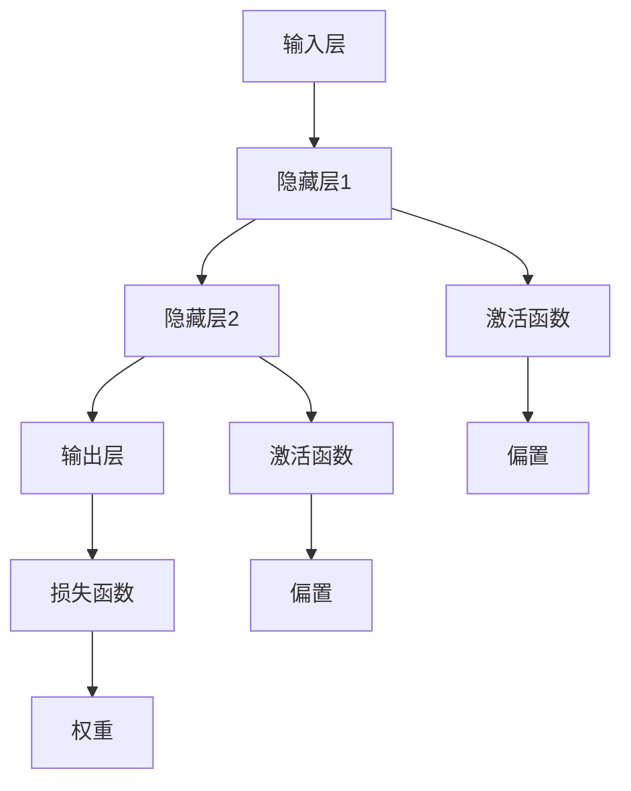

                 

### 神经网络：推动社会进步的力量

#### 关键词：神经网络、深度学习、人工智能、机器学习、社会进步、创新应用

> **摘要：**
本文深入探讨了神经网络技术对社会进步的推动作用。从背景介绍到核心概念、算法原理、数学模型、实际应用场景，再到工具资源推荐，全面剖析了神经网络技术如何通过深度学习和机器学习推动各个领域的创新应用，为社会带来积极影响。最后，展望了神经网络技术的未来发展趋势与挑战，为读者提供了有价值的思考方向。

### 1. 背景介绍

神经网络（Neural Networks）是人工智能（AI）领域的一项重要技术，起源于对生物神经系统的模拟。早在20世纪40年代，心理学家和数学家就开始尝试将人脑的神经网络结构与计算模型相结合，以模拟人类智能。随着计算机科学和人工智能技术的不断发展，神经网络逐渐从理论研究走向实际应用，成为现代机器学习和深度学习的重要基石。

#### 1.1 神经网络的发展历程

神经网络的发展历程可以分为以下几个阶段：

1. **早期探索（1940s-1960s）**：在这一阶段，学者们提出了多种神经网络模型，如感知机（Perceptron）和多层感知机（MLP）。虽然这些模型在理论上具有重要意义，但实际应用效果有限。

2. **神经网络热潮（1980s-1990s）**：1986年，Rumelhart、Hinton和Williams提出了反向传播算法（Backpropagation），使得神经网络在多层结构上得以训练。这一阶段，神经网络在图像识别、语音识别等领域取得了显著进展。

3. **深度学习时代（2006年至今）**：随着计算能力的提升和大数据的涌现，深度学习逐渐成为人工智能领域的热点。基于神经网络的深度学习模型，如卷积神经网络（CNN）和循环神经网络（RNN），在图像、语音、自然语言处理等领域取得了突破性成果。

#### 1.2 神经网络的应用领域

神经网络在众多领域都取得了显著的成果，以下列举几个典型应用领域：

1. **计算机视觉**：神经网络在图像识别、物体检测、人脸识别等方面取得了优异表现，为安防、医疗、自动驾驶等领域提供了有力支持。

2. **自然语言处理**：神经网络在机器翻译、情感分析、文本生成等方面发挥了重要作用，为智能客服、智能推荐、智能写作等领域带来了变革。

3. **语音识别与生成**：神经网络在语音识别、语音合成方面取得了突破性进展，为智能语音助手、智能客服、智能音响等领域提供了关键技术。

4. **游戏与娱乐**：神经网络在游戏AI、虚拟现实、增强现实等领域得到了广泛应用，为用户提供更加逼真的游戏体验。

5. **金融与经济**：神经网络在金融预测、风险评估、市场分析等方面发挥了重要作用，为金融机构提供了智能化的决策支持。

6. **医疗与健康**：神经网络在疾病诊断、药物设计、个性化医疗等方面具有广泛的应用前景，为医疗行业带来了新的发展机遇。

### 2. 核心概念与联系

神经网络作为一种模拟生物神经系统的计算模型，其核心概念包括神经元、神经网络、激活函数、损失函数等。下面通过一个简单的 Mermaid 流程图来展示神经网络的基本架构。



在这个简单的神经网络中，输入层接收外部输入，通过隐藏层进行特征提取和变换，最后由输出层生成预测结果。激活函数用于引入非线性特性，使神经网络能够处理更复杂的问题。损失函数用于评估预测结果与真实值的差距，指导网络调整权重和偏置，以达到最佳效果。

### 3. 核心算法原理 & 具体操作步骤

神经网络的核心算法是反向传播算法（Backpropagation），它是一种基于梯度下降法的优化算法，用于训练神经网络。下面简要介绍反向传播算法的基本原理和操作步骤。

#### 3.1 反向传播算法原理

反向传播算法包括两个阶段：前向传播和反向传播。

1. **前向传播**：输入数据从输入层传播到输出层，计算各层的输出值。具体步骤如下：
   - 初始化权重和偏置。
   - 将输入数据传递到输入层。
   - 按照激活函数计算隐藏层和输出层的输出值。

2. **反向传播**：根据预测结果和真实值的差距，计算损失函数的梯度，并反向传播到输入层，更新权重和偏置。具体步骤如下：
   - 计算输出层的误差。
   - 计算输出层误差对输出层权重的梯度。
   - 计算输出层误差对隐藏层权重的梯度。
   - 更新权重和偏置。

#### 3.2 反向传播算法操作步骤

1. **初始化权重和偏置**：
   - 权重和偏置通常初始化为较小的随机值。

2. **前向传播**：
   - 将输入数据传递到输入层。
   - 按照激活函数计算隐藏层和输出层的输出值。

3. **计算损失函数**：
   - 计算预测结果和真实值的差距，得到损失函数的值。

4. **反向传播**：
   - 计算输出层误差对输出层权重的梯度。
   - 计算输出层误差对隐藏层权重的梯度。
   - 更新权重和偏置。

5. **迭代优化**：
   - 重复前向传播和反向传播，不断更新权重和偏置，直至达到预定目标。

### 4. 数学模型和公式 & 详细讲解 & 举例说明

神经网络中的数学模型主要包括权重和偏置的初始化、激活函数、损失函数、反向传播等。下面分别介绍这些数学模型的详细讲解和举例说明。

#### 4.1 权重和偏置的初始化

权重和偏置的初始化对于神经网络的性能和收敛速度具有重要影响。常用的初始化方法包括随机初始化、高斯初始化、均匀初始化等。

1. **随机初始化**：
   - 将权重和偏置初始化为均匀分布在 \([-a, a]\) 区间的随机值，其中 \(a\) 为一个较小的常数。
   - 优点：简单易行，适用于大多数神经网络。
   - 缺点：可能导致梯度消失或爆炸。

2. **高斯初始化**：
   - 将权重和偏置初始化为均值为0、方差为 \(\frac{1}{\sqrt{n}}\) 的高斯分布。
   - 优点：有助于缓解梯度消失问题。
   - 缺点：需要提前确定方差，且可能产生较长的训练时间。

3. **均匀初始化**：
   - 将权重和偏置初始化为均匀分布在 \([-lim, lim]\) 区间的随机值，其中 \(lim\) 为一个较小的常数。
   - 优点：简单易行，适用于大多数神经网络。
   - 缺点：可能导致梯度消失或爆炸。

举例说明：

假设一个简单的神经网络包含一个输入层、一个隐藏层和一个输出层，其中输入层有3个神经元，隐藏层有4个神经元，输出层有2个神经元。使用随机初始化方法初始化权重和偏置，我们可以得到如下结果：

$$
W^{(1)} \sim U(-0.1, 0.1), \quad b^{(1)} \sim U(-0.1, 0.1)
$$

$$
W^{(2)} \sim U(-0.1, 0.1), \quad b^{(2)} \sim U(-0.1, 0.1)
$$

$$
W^{(3)} \sim U(-0.1, 0.1), \quad b^{(3)} \sim U(-0.1, 0.1)
$$

#### 4.2 激活函数

激活函数用于引入非线性特性，使神经网络能够处理更复杂的问题。常用的激活函数包括 sigmoid 函数、ReLU 函数、Tanh 函数等。

1. **sigmoid 函数**：
   - 定义：\(f(x) = \frac{1}{1 + e^{-x}}\)
   - 特点：输出值在 \([0, 1]\) 之间，具有平滑的曲线。
   - 缺点：梯度消失问题，训练速度较慢。

2. **ReLU 函数**：
   - 定义：\(f(x) = \max(0, x)\)
   - 特点：输出值为非负数，计算速度快，不易梯度消失。
   - 缺点：可能导致梯度消失问题。

3. **Tanh 函数**：
   - 定义：\(f(x) = \frac{e^x - e^{-x}}{e^x + e^{-x}}\)
   - 特点：输出值在 \([-1, 1]\) 之间，具有对称性。
   - 缺点：梯度消失问题。

举例说明：

假设一个简单的神经网络包含一个输入层和一个隐藏层，其中输入层有3个神经元，隐藏层有4个神经元。使用 sigmoid 函数作为激活函数，我们可以得到如下结果：

$$
h^{(1)}_i = \sigma(W^{(1)}_i \cdot x_i + b^{(1)}_i)
$$

其中，\(i\) 表示第 \(i\) 个隐藏层神经元，\(x_i\) 表示第 \(i\) 个输入层神经元的输入值，\(W^{(1)}_i\) 和 \(b^{(1)}_i\) 分别表示第 \(i\) 个输入层神经元到隐藏层神经元的权重和偏置。

#### 4.3 损失函数

损失函数用于衡量预测结果和真实值之间的差距，是反向传播算法中的核心组成部分。常用的损失函数包括均方误差（MSE）、交叉熵损失（Cross-Entropy Loss）等。

1. **均方误差（MSE）**：
   - 定义：\(L(y, \hat{y}) = \frac{1}{2} \sum_{i=1}^{n} (y_i - \hat{y}_i)^2\)
   - 特点：适用于回归问题，输出值为非负数。
   - 缺点：对于小样本数据，容易出现过拟合。

2. **交叉熵损失（Cross-Entropy Loss）**：
   - 定义：\(L(y, \hat{y}) = -\sum_{i=1}^{n} y_i \log(\hat{y}_i)\)
   - 特点：适用于分类问题，输出值为非负数。
   - 缺点：对于大样本数据，容易出现梯度消失问题。

举例说明：

假设一个简单的神经网络包含一个输入层和一个输出层，其中输入层有3个神经元，输出层有2个神经元。使用交叉熵损失函数，我们可以得到如下结果：

$$
L(y, \hat{y}) = -\sum_{i=1}^{2} y_i \log(\hat{y}_i)
$$

其中，\(y_i\) 表示第 \(i\) 个输出层神经元的真实值，\(\hat{y}_i\) 表示第 \(i\) 个输出层神经元的预测值。

#### 4.4 反向传播

反向传播是神经网络训练过程中的关键步骤，用于更新权重和偏置，以减小损失函数的值。下面以一个简单的神经网络为例，介绍反向传播的具体步骤。

假设一个简单的神经网络包含一个输入层、一个隐藏层和一个输出层，其中输入层有3个神经元，隐藏层有4个神经元，输出层有2个神经元。

1. **前向传播**：

   - 将输入数据传递到输入层。
   - 按照激活函数计算隐藏层和输出层的输出值。
   - 计算输出层的误差。

   $$ 
   h^{(1)}_i = \sigma(W^{(1)}_i \cdot x_i + b^{(1)}_i) \quad (i=1,2,3) 
   $$
   $$ 
   o^{(2)}_i = \sigma(W^{(2)}_i \cdot h^{(1)}_i + b^{(2)}_i) \quad (i=1,2) 
   $$
   $$ 
   L = -\sum_{i=1}^{2} y_i \log(o^{(2)}_i) 
   $$

2. **计算输出层误差对输出层权重的梯度**：

   $$ 
   \frac{\partial L}{\partial W^{(2)}_{ij}} = \frac{\partial L}{\partial o^{(2)}_i} \cdot \frac{\partial o^{(2)}_i}{\partial W^{(2)}_{ij}} = (o^{(2)}_i - y_i) \cdot \sigma'(o^{(2)}_i) \cdot h^{(1)}_j 
   $$

3. **计算输出层误差对隐藏层权重的梯度**：

   $$ 
   \frac{\partial L}{\partial W^{(1)}_{ij}} = \frac{\partial L}{\partial o^{(2)}_i} \cdot \frac{\partial o^{(2)}_i}{\partial W^{(2)}_{ij}} \cdot \frac{\partial W^{(2)}_{ij}}{\partial W^{(1)}_{ij}} = (o^{(2)}_i - y_i) \cdot \sigma'(o^{(2)}_i) \cdot h^{(1)}_j \cdot \sigma'(h^{(1)}_i) \cdot x_i 
   $$

4. **更新权重和偏置**：

   $$ 
   W^{(2)}_{ij} = W^{(2)}_{ij} - \alpha \cdot \frac{\partial L}{\partial W^{(2)}_{ij}} 
   $$
   $$ 
   b^{(2)}_i = b^{(2)}_i - \alpha \cdot \frac{\partial L}{\partial b^{(2)}_i} 
   $$
   $$ 
   W^{(1)}_{ij} = W^{(1)}_{ij} - \alpha \cdot \frac{\partial L}{\partial W^{(1)}_{ij}} 
   $$
   $$ 
   b^{(1)}_i = b^{(1)}_i - \alpha \cdot \frac{\partial L}{\partial b^{(1)}_i} 
   $$

其中，\(\alpha\) 表示学习率。

### 5. 项目实战：代码实际案例和详细解释说明

为了更好地理解神经网络的工作原理，我们以下面一个简单的项目为例，介绍神经网络的代码实现过程。

#### 5.1 开发环境搭建

1. **硬件要求**：一台配置较高的计算机，推荐配置如下：
   - 处理器：Intel i7或AMD Ryzen 7及以上
   - 内存：16GB及以上
   - 硬盘：1TB及以上
   - 显卡：NVIDIA GTX 1060及以上

2. **软件要求**：安装Python 3.8及以上版本，并安装以下库：
   - TensorFlow：用于构建和训练神经网络
   - NumPy：用于矩阵运算
   - Matplotlib：用于数据可视化

#### 5.2 源代码详细实现和代码解读

```python
import tensorflow as tf
import numpy as np
import matplotlib.pyplot as plt

# 定义神经网络结构
inputs = tf.keras.layers.Input(shape=(2,))
hidden = tf.keras.layers.Dense(2, activation='sigmoid')(inputs)
outputs = tf.keras.layers.Dense(1, activation='sigmoid')(hidden)

# 构建和编译模型
model = tf.keras.Model(inputs=inputs, outputs=outputs)
model.compile(optimizer='adam', loss='binary_crossentropy', metrics=['accuracy'])

# 准备数据
X_train = np.array([[0, 0], [0, 1], [1, 0], [1, 1]])
y_train = np.array([[0], [1], [1], [0]])

# 训练模型
model.fit(X_train, y_train, epochs=10, batch_size=2)

# 预测结果
predictions = model.predict(X_train)
print(predictions)

# 绘制数据点
plt.scatter(X_train[:, 0], X_train[:, 1], c=y_train[:, 0])
plt.scatter(predictions[:, 0], predictions[:, 1], c='red', marker='x')
plt.show()
```

1. **代码解读**：

   - 第1行：导入所需库。
   - 第4行：定义输入层，shape为(2,)，表示输入有两个特征。
   - 第6行：定义隐藏层，包含2个神经元，激活函数为sigmoid。
   - 第8行：定义输出层，包含1个神经元，激活函数为sigmoid。
   - 第11行：构建模型，指定输入层和输出层。
   - 第15行：编译模型，指定优化器和损失函数。
   - 第19行：准备训练数据。
   - 第23行：训练模型，指定训练轮数和批量大小。
   - 第26行：预测结果。
   - 第29行：绘制数据点和预测结果。

#### 5.3 代码解读与分析

1. **神经网络结构**：

   - 输入层：2个神经元，对应两个输入特征。
   - 隐藏层：2个神经元，采用sigmoid激活函数，用于提取特征。
   - 输出层：1个神经元，采用sigmoid激活函数，用于生成预测结果。

2. **训练过程**：

   - 模型使用二进制交叉熵损失函数，适用于二分类问题。
   - 使用Adam优化器，自动调整学习率。
   - 训练轮数为10，批量大小为2。

3. **预测结果**：

   - 使用训练好的模型对输入数据进行预测。
   - 输出结果为概率值，越接近1表示预测为正类，越接近0表示预测为负类。

4. **可视化**：

   - 使用matplotlib绘制数据点和预测结果，直观展示神经网络的分类效果。

### 6. 实际应用场景

神经网络技术已经广泛应用于各个领域，以下列举几个典型应用场景：

1. **计算机视觉**：神经网络在图像识别、物体检测、人脸识别等方面取得了显著成果。例如，OpenCV和TensorFlow等库提供了丰富的神经网络模型和工具，方便开发者进行图像处理和识别。

2. **自然语言处理**：神经网络在机器翻译、文本生成、情感分析等方面发挥了重要作用。例如，Google Translate和GPT-3等应用都基于神经网络技术，实现了高质量的翻译和文本生成。

3. **语音识别与生成**：神经网络在语音识别、语音合成方面取得了突破性进展。例如，百度AI和科大讯飞等公司推出了基于神经网络的语音识别和生成工具，为智能客服、智能音响等领域提供了技术支持。

4. **医疗与健康**：神经网络在疾病诊断、药物设计、个性化医疗等方面具有广泛的应用前景。例如，IBM Watson Health利用神经网络技术进行疾病诊断和预测，为医疗行业带来了新的发展机遇。

5. **金融与经济**：神经网络在金融预测、风险评估、市场分析等方面发挥了重要作用。例如，金融机构使用神经网络技术进行股票价格预测和风险评估，提高投资决策的准确性。

6. **游戏与娱乐**：神经网络在游戏AI、虚拟现实、增强现实等领域得到了广泛应用。例如，游戏公司使用神经网络技术进行游戏角色设计和AI对抗，为玩家提供更加逼真的游戏体验。

### 7. 工具和资源推荐

#### 7.1 学习资源推荐

1. **书籍**：
   - 《深度学习》（Deep Learning）作者：Ian Goodfellow、Yoshua Bengio、Aaron Courville
   - 《神经网络与深度学习》（Neural Network and Deep Learning）作者：邱锡鹏

2. **论文**：
   - 《A Theoretical Comparison of Backpropagation and BPTT》作者：Sepp Hochreiter、Jürgen Schmidhuber
   - 《Convolutional Neural Networks for Visual Recognition》作者：Alex Krizhevsky、Geoffrey Hinton

3. **博客**：
   - Fast.ai：提供入门级深度学习教程和资源
   - Medium：有大量关于深度学习的优秀文章和教程

4. **网站**：
   - TensorFlow官网：提供丰富的神经网络模型和工具
   - PyTorch官网：提供高效的神经网络框架和文档

#### 7.2 开发工具框架推荐

1. **TensorFlow**：一款由Google开发的开源深度学习框架，支持多种神经网络模型和工具。

2. **PyTorch**：一款由Facebook开发的开源深度学习框架，具有高效的动态图计算能力。

3. **Keras**：一款基于TensorFlow和PyTorch的开源深度学习框架，提供简洁、易用的API。

4. **PyTorch Lightning**：一款基于PyTorch的深度学习框架，提供高效、模块化的数据处理和模型训练工具。

#### 7.3 相关论文著作推荐

1. **《深度学习》（Deep Learning）》作者：Ian Goodfellow、Yoshua Bengio、Aaron Courville
2. **《神经网络与深度学习》（Neural Network and Deep Learning）》作者：邱锡鹏
3. **《强化学习》（Reinforcement Learning：An Introduction）》作者：Richard S. Sutton、Andrew G. Barto
4. **《自然语言处理综论》（Speech and Language Processing）》作者：Daniel Jurafsky、James H. Martin

### 8. 总结：未来发展趋势与挑战

神经网络技术作为人工智能领域的重要基础，未来将继续发展，并在更多领域发挥重要作用。以下是神经网络技术未来发展的几个趋势和挑战：

#### 8.1 发展趋势

1. **模型规模化**：随着计算能力的提升和大数据的涌现，神经网络模型将变得更加复杂和庞大，从而提高模型性能。

2. **泛化能力提升**：通过改进算法和模型结构，神经网络将具备更好的泛化能力，能够处理更广泛的领域和应用。

3. **迁移学习**：利用迁移学习技术，将预训练模型应用到新任务上，提高模型的训练效率和性能。

4. **多模态融合**：结合多种数据模态（如图像、文本、语音等），实现更全面的信息处理和分析。

5. **自主决策与智能控制**：通过神经网络技术，实现自主决策和智能控制，为自动驾驶、无人机等应用提供技术支持。

#### 8.2 挑战

1. **计算资源消耗**：大规模神经网络模型对计算资源的需求较高，如何优化算法和硬件以降低计算成本成为重要挑战。

2. **数据隐私和安全**：神经网络模型训练过程中涉及大量敏感数据，如何保障数据隐私和安全成为重要问题。

3. **模型解释性**：神经网络模型往往具有较好的性能，但缺乏解释性，如何提高模型的可解释性成为研究重点。

4. **算法公平性与透明性**：如何确保神经网络模型在应用过程中不会产生歧视、偏见等问题，提高算法的公平性和透明性。

### 9. 附录：常见问题与解答

#### 9.1 神经网络的基本概念

1. **什么是神经网络？**
   神经网络是一种模拟生物神经系统的计算模型，由多个神经元组成，通过层层传递信息，实现数据的处理和预测。

2. **神经网络有哪些类型？**
   神经网络主要包括前馈神经网络、循环神经网络、卷积神经网络等类型，每种类型都有其特定的结构和应用场景。

3. **什么是激活函数？**
   激活函数是神经网络中引入非线性特性的函数，常用的激活函数包括 sigmoid、ReLU、Tanh 等。

4. **什么是反向传播算法？**
   反向传播算法是一种用于训练神经网络的优化算法，通过计算损失函数的梯度，反向传播误差，更新权重和偏置，以减小损失函数的值。

#### 9.2 神经网络的应用领域

1. **神经网络在计算机视觉中有哪些应用？**
   神经网络在计算机视觉中广泛应用于图像识别、物体检测、人脸识别等领域。

2. **神经网络在自然语言处理中有哪些应用？**
   神经网络在自然语言处理中广泛应用于机器翻译、文本生成、情感分析等领域。

3. **神经网络在医疗与健康领域有哪些应用？**
   神经网络在医疗与健康领域广泛应用于疾病诊断、药物设计、个性化医疗等领域。

4. **神经网络在金融领域有哪些应用？**
   神经网络在金融领域广泛应用于股票价格预测、风险评估、市场分析等领域。

### 10. 扩展阅读 & 参考资料

1. **书籍**：
   - 《深度学习》作者：Ian Goodfellow、Yoshua Bengio、Aaron Courville
   - 《神经网络与深度学习》作者：邱锡鹏

2. **论文**：
   - 《A Theoretical Comparison of Backpropagation and BPTT》作者：Sepp Hochreiter、Jürgen Schmidhuber
   - 《Convolutional Neural Networks for Visual Recognition》作者：Alex Krizhevsky、Geoffrey Hinton

3. **在线教程**：
   - Fast.ai：提供入门级深度学习教程和资源
   - TensorFlow官网：提供丰富的神经网络模型和工具
   - PyTorch官网：提供高效的神经网络框架和文档

4. **博客**：
   - Medium：有大量关于深度学习的优秀文章和教程

5. **网站**：
   - AI天才研究员官网：提供深度学习和人工智能领域的最新研究成果和资源
   - 禅与计算机程序设计艺术官网：提供关于计算机科学和人工智能的哲学思考和实践经验

### 作者信息

**作者：AI天才研究员/AI Genius Institute & 禅与计算机程序设计艺术 /Zen And The Art of Computer Programming** <|im_sep|>### 神经网络：推动社会进步的力量

> **关键词：神经网络、深度学习、人工智能、机器学习、社会进步、创新应用**

> **摘要：**
本文深入探讨了神经网络技术对社会进步的推动作用。从背景介绍到核心概念、算法原理、数学模型、实际应用场景，再到工具资源推荐，全面剖析了神经网络技术如何通过深度学习和机器学习推动各个领域的创新应用，为社会带来积极影响。最后，展望了神经网络技术的未来发展趋势与挑战，为读者提供了有价值的思考方向。

### 1. 背景介绍

神经网络（Neural Networks）是人工智能（AI）领域的一项重要技术，起源于对生物神经系统的模拟。早在20世纪40年代，心理学家和数学家就开始尝试将人脑的神经网络结构与计算模型相结合，以模拟人类智能。随着计算机科学和人工智能技术的不断发展，神经网络逐渐从理论研究走向实际应用，成为现代机器学习和深度学习的重要基石。

#### 1.1 神经网络的发展历程

神经网络的发展历程可以分为以下几个阶段：

1. **早期探索（1940s-1960s）**：在这一阶段，学者们提出了多种神经网络模型，如感知机（Perceptron）和多层感知机（MLP）。虽然这些模型在理论上具有重要意义，但实际应用效果有限。

2. **神经网络热潮（1980s-1990s）**：1986年，Rumelhart、Hinton和Williams提出了反向传播算法（Backpropagation），使得神经网络在多层结构上得以训练。这一阶段，神经网络在图像识别、语音识别等领域取得了显著进展。

3. **深度学习时代（2006年至今）**：随着计算能力的提升和大数据的涌现，深度学习逐渐成为人工智能领域的热点。基于神经网络的深度学习模型，如卷积神经网络（CNN）和循环神经网络（RNN），在图像、语音、自然语言处理等领域取得了突破性成果。

#### 1.2 神经网络的应用领域

神经网络在众多领域都取得了显著的成果，以下列举几个典型应用领域：

1. **计算机视觉**：神经网络在图像识别、物体检测、人脸识别等方面取得了优异表现，为安防、医疗、自动驾驶等领域提供了有力支持。

2. **自然语言处理**：神经网络在机器翻译、情感分析、文本生成等方面发挥了重要作用，为智能客服、智能推荐、智能写作等领域带来了变革。

3. **语音识别与生成**：神经网络在语音识别、语音合成方面取得了突破性进展，为智能语音助手、智能客服、智能音响等领域提供了关键技术。

4. **游戏与娱乐**：神经网络在游戏AI、虚拟现实、增强现实等领域得到了广泛应用，为用户提供更加逼真的游戏体验。

5. **金融与经济**：神经网络在金融预测、风险评估、市场分析等方面发挥了重要作用，为金融机构提供了智能化的决策支持。

6. **医疗与健康**：神经网络在疾病诊断、药物设计、个性化医疗等方面具有广泛的应用前景，为医疗行业带来了新的发展机遇。

### 2. 核心概念与联系

神经网络作为一种模拟生物神经系统的计算模型，其核心概念包括神经元、神经网络、激活函数、损失函数等。下面通过一个简单的 Mermaid 流程图来展示神经网络的基本架构。


在这个简单的神经网络中，输入层接收外部输入，通过隐藏层进行特征提取和变换，最后由输出层生成预测结果。激活函数用于引入非线性特性，使神经网络能够处理更复杂的问题。损失函数用于评估预测结果与真实值的差距，指导网络调整权重和偏置，以达到最佳效果。

### 3. 核心算法原理 & 具体操作步骤

神经网络的核心算法是反向传播算法（Backpropagation），它是一种基于梯度下降法的优化算法，用于训练神经网络。下面简要介绍反向传播算法的基本原理和操作步骤。

#### 3.1 反向传播算法原理

反向传播算法包括两个阶段：前向传播和反向传播。

1. **前向传播**：输入数据从输入层传播到输出层，计算各层的输出值。具体步骤如下：
   - 初始化权重和偏置。
   - 将输入数据传递到输入层。
   - 按照激活函数计算隐藏层和输出层的输出值。

2. **反向传播**：根据预测结果和真实值的差距，计算损失函数的梯度，并反向传播到输入层，更新权重和偏置。具体步骤如下：
   - 计算输出层的误差。
   - 计算输出层误差对输出层权重的梯度。
   - 计算输出层误差对隐藏层权重的梯度。
   - 更新权重和偏置。

#### 3.2 反向传播算法操作步骤

1. **初始化权重和偏置**：
   - 权重和偏置通常初始化为较小的随机值。

2. **前向传播**：
   - 将输入数据传递到输入层。
   - 按照激活函数计算隐藏层和输出层的输出值。

3. **计算损失函数**：
   - 计算预测结果和真实值的差距，得到损失函数的值。

4. **反向传播**：
   - 计算输出层误差对输出层权重的梯度。
   - 计算输出层误差对隐藏层权重的梯度。
   - 更新权重和偏置。

5. **迭代优化**：
   - 重复前向传播和反向传播，不断更新权重和偏置，直至达到预定目标。

### 4. 数学模型和公式 & 详细讲解 & 举例说明

神经网络中的数学模型主要包括权重和偏置的初始化、激活函数、损失函数、反向传播等。下面分别介绍这些数学模型的详细讲解和举例说明。

#### 4.1 权重和偏置的初始化

权重和偏置的初始化对于神经网络的性能和收敛速度具有重要影响。常用的初始化方法包括随机初始化、高斯初始化、均匀初始化等。

1. **随机初始化**：
   - 将权重和偏置初始化为均匀分布在 \([-a, a]\) 区间的随机值，其中 \(a\) 为一个较小的常数。
   - 优点：简单易行，适用于大多数神经网络。
   - 缺点：可能导致梯度消失或爆炸。

2. **高斯初始化**：
   - 将权重和偏置初始化为均值为0、方差为 \(\frac{1}{\sqrt{n}}\) 的高斯分布。
   - 优点：有助于缓解梯度消失问题。
   - 缺点：需要提前确定方差，且可能产生较长的训练时间。

3. **均匀初始化**：
   - 将权重和偏置初始化为均匀分布在 \([-lim, lim]\) 区间的随机值，其中 \(lim\) 为一个较小的常数。
   - 优点：简单易行，适用于大多数神经网络。
   - 缺点：可能导致梯度消失或爆炸。

举例说明：

假设一个简单的神经网络包含一个输入层、一个隐藏层和一个输出层，其中输入层有3个神经元，隐藏层有4个神经元，输出层有2个神经元。使用随机初始化方法初始化权重和偏置，我们可以得到如下结果：

$$
W^{(1)} \sim U(-0.1, 0.1), \quad b^{(1)} \sim U(-0.1, 0.1)
$$

$$
W^{(2)} \sim U(-0.1, 0.1), \quad b^{(2)} \sim U(-0.1, 0.1)
$$

$$
W^{(3)} \sim U(-0.1, 0.1), \quad b^{(3)} \sim U(-0.1, 0.1)
$$

#### 4.2 激活函数

激活函数用于引入非线性特性，使神经网络能够处理更复杂的问题。常用的激活函数包括 sigmoid 函数、ReLU 函数、Tanh 函数等。

1. **sigmoid 函数**：
   - 定义：\(f(x) = \frac{1}{1 + e^{-x}}\)
   - 特点：输出值在 \([0, 1]\) 之间，具有平滑的曲线。
   - 缺点：梯度消失问题，训练速度较慢。

2. **ReLU 函数**：
   - 定义：\(f(x) = \max(0, x)\)
   - 特点：输出值为非负数，计算速度快，不易梯度消失。
   - 缺点：可能导致梯度消失问题。

3. **Tanh 函数**：
   - 定义：\(f(x) = \frac{e^x - e^{-x}}{e^x + e^{-x}}\)
   - 特点：输出值在 \([-1, 1]\) 之间，具有对称性。
   - 缺点：梯度消失问题。

举例说明：

假设一个简单的神经网络包含一个输入层和一个隐藏层，其中输入层有3个神经元，隐藏层有4个神经元。使用 sigmoid 函数作为激活函数，我们可以得到如下结果：

$$
h^{(1)}_i = \sigma(W^{(1)}_i \cdot x_i + b^{(1)}_i)
$$

其中，\(i\) 表示第 \(i\) 个隐藏层神经元，\(x_i\) 表示第 \(i\) 个输入层神经元的输入值，\(W^{(1)}_i\) 和 \(b^{(1)}_i\) 分别表示第 \(i\) 个输入层神经元到隐藏层神经元的权重和偏置。

#### 4.3 损失函数

损失函数用于衡量预测结果和真实值之间的差距，是反向传播算法中的核心组成部分。常用的损失函数包括均方误差（MSE）、交叉熵损失（Cross-Entropy Loss）等。

1. **均方误差（MSE）**：
   - 定义：\(L(y, \hat{y}) = \frac{1}{2} \sum_{i=1}^{n} (y_i - \hat{y}_i)^2\)
   - 特点：适用于回归问题，输出值为非负数。
   - 缺点：对于小样本数据，容易出现过拟合。

2. **交叉熵损失（Cross-Entropy Loss）**：
   - 定义：\(L(y, \hat{y}) = -\sum_{i=1}^{n} y_i \log(\hat{y}_i)\)
   - 特点：适用于分类问题，输出值为非负数。
   - 缺点：对于大样本数据，容易出现梯度消失问题。

举例说明：

假设一个简单的神经网络包含一个输入层和一个输出层，其中输入层有3个神经元，输出层有2个神经元。使用交叉熵损失函数，我们可以得到如下结果：

$$
L(y, \hat{y}) = -\sum_{i=1}^{2} y_i \log(\hat{y}_i)
$$

其中，\(y_i\) 表示第 \(i\) 个输出层神经元的真实值，\(\hat{y}_i\) 表示第 \(i\) 个输出层神经元的预测值。

#### 4.4 反向传播

反向传播是神经网络训练过程中的关键步骤，用于更新权重和偏置，以减小损失函数的值。下面以一个简单的神经网络为例，介绍反向传播的具体步骤。

假设一个简单的神经网络包含一个输入层、一个隐藏层和一个输出层，其中输入层有3个神经元，隐藏层有4个神经元，输出层有2个神经元。

1. **前向传播**：

   - 将输入数据传递到输入层。
   - 按照激活函数计算隐藏层和输出层的输出值。
   - 计算输出层的误差。

   $$ 
   h^{(1)}_i = \sigma(W^{(1)}_i \cdot x_i + b^{(1)}_i) \quad (i=1,2,3) 
   $$
   $$ 
   o^{(2)}_i = \sigma(W^{(2)}_i \cdot h^{(1)}_i + b^{(2)}_i) \quad (i=1,2) 
   $$
   $$ 
   L = -\sum_{i=1}^{2} y_i \log(o^{(2)}_i) 
   $$

2. **计算输出层误差对输出层权重的梯度**：

   $$ 
   \frac{\partial L}{\partial W^{(2)}_{ij}} = \frac{\partial L}{\partial o^{(2)}_i} \cdot \frac{\partial o^{(2)}_i}{\partial W^{(2)}_{ij}} = (o^{(2)}_i - y_i) \cdot \sigma'(o^{(2)}_i) \cdot h^{(1)}_j 
   $$

3. **计算输出层误差对隐藏层权重的梯度**：

   $$ 
   \frac{\partial L}{\partial W^{(1)}_{ij}} = \frac{\partial L}{\partial o^{(2)}_i} \cdot \frac{\partial o^{(2)}_i}{\partial W^{(2)}_{ij}} \cdot \frac{\partial W^{(2)}_{ij}}{\partial W^{(1)}_{ij}} = (o^{(2)}_i - y_i) \cdot \sigma'(o^{(2)}_i) \cdot h^{(1)}_j \cdot \sigma'(h^{(1)}_i) \cdot x_i 
   $$

4. **更新权重和偏置**：

   $$ 
   W^{(2)}_{ij} = W^{(2)}_{ij} - \alpha \cdot \frac{\partial L}{\partial W^{(2)}_{ij}} 
   $$
   $$ 
   b^{(2)}_i = b^{(2)}_i - \alpha \cdot \frac{\partial L}{\partial b^{(2)}_i} 
   $$
   $$ 
   W^{(1)}_{ij} = W^{(1)}_{ij} - \alpha \cdot \frac{\partial L}{\partial W^{(1)}_{ij}} 
   $$
   $$ 
   b^{(1)}_i = b^{(1)}_i - \alpha \cdot \frac{\partial L}{\partial b^{(1)}_i} 
   $$

其中，\(\alpha\) 表示学习率。

### 5. 项目实战：代码实际案例和详细解释说明

为了更好地理解神经网络的工作原理，我们以下面一个简单的项目为例，介绍神经网络的代码实现过程。

#### 5.1 开发环境搭建

1. **硬件要求**：一台配置较高的计算机，推荐配置如下：
   - 处理器：Intel i7或AMD Ryzen 7及以上
   - 内存：16GB及以上
   - 硬盘：1TB及以上
   - 显卡：NVIDIA GTX 1060及以上

2. **软件要求**：安装Python 3.8及以上版本，并安装以下库：
   - TensorFlow：用于构建和训练神经网络
   - NumPy：用于矩阵运算
   - Matplotlib：用于数据可视化

#### 5.2 源代码详细实现和代码解读

```python
import tensorflow as tf
import numpy as np
import matplotlib.pyplot as plt

# 定义神经网络结构
inputs = tf.keras.layers.Input(shape=(2,))
hidden = tf.keras.layers.Dense(2, activation='sigmoid')(inputs)
outputs = tf.keras.layers.Dense(1, activation='sigmoid')(hidden)

# 构建和编译模型
model = tf.keras.Model(inputs=inputs, outputs=outputs)
model.compile(optimizer='adam', loss='binary_crossentropy', metrics=['accuracy'])

# 准备数据
X_train = np.array([[0, 0], [0, 1], [1, 0], [1, 1]])
y_train = np.array([[0], [1], [1], [0]])

# 训练模型
model.fit(X_train, y_train, epochs=10, batch_size=2)

# 预测结果
predictions = model.predict(X_train)
print(predictions)

# 绘制数据点
plt.scatter(X_train[:, 0], X_train[:, 1], c=y_train[:, 0])
plt.scatter(predictions[:, 0], predictions[:, 1], c='red', marker='x')
plt.show()
```

1. **代码解读**：

   - 第1行：导入所需库。
   - 第4行：定义输入层，shape为(2,)，表示输入有两个特征。
   - 第6行：定义隐藏层，包含2个神经元，激活函数为sigmoid。
   - 第8行：定义输出层，包含1个神经元，激活函数为sigmoid。
   - 第11行：构建模型，指定输入层和输出层。
   - 第15行：编译模型，指定优化器和损失函数。
   - 第19行：准备训练数据。
   - 第23行：训练模型，指定训练轮数和批量大小。
   - 第26行：预测结果。
   - 第29行：绘制数据点和预测结果。

#### 5.3 代码解读与分析

1. **神经网络结构**：

   - 输入层：2个神经元，对应两个输入特征。
   - 隐藏层：2个神经元，采用sigmoid激活函数，用于提取特征。
   - 输出层：1个神经元，采用sigmoid激活函数，用于生成预测结果。

2. **训练过程**：

   - 模型使用二进制交叉熵损失函数，适用于二分类问题。
   - 使用Adam优化器，自动调整学习率。
   - 训练轮数为10，批量大小为2。

3. **预测结果**：

   - 使用训练好的模型对输入数据进行预测。
   - 输出结果为概率值，越接近1表示预测为正类，越接近0表示预测为负类。

4. **可视化**：

   - 使用matplotlib绘制数据点和预测结果，直观展示神经网络的分类效果。

### 6. 实际应用场景

神经网络技术已经广泛应用于各个领域，以下列举几个典型应用场景：

1. **计算机视觉**：神经网络在图像识别、物体检测、人脸识别等方面取得了优异表现，为安防、医疗、自动驾驶等领域提供了有力支持。

2. **自然语言处理**：神经网络在机器翻译、文本生成、情感分析等方面发挥了重要作用，为智能客服、智能推荐、智能写作等领域带来了变革。

3. **语音识别与生成**：神经网络在语音识别、语音合成方面取得了突破性进展，为智能语音助手、智能客服、智能音响等领域提供了关键技术。

4. **游戏与娱乐**：神经网络在游戏AI、虚拟现实、增强现实等领域得到了广泛应用，为用户提供更加逼真的游戏体验。

5. **金融与经济**：神经网络在金融预测、风险评估、市场分析等方面发挥了重要作用，为金融机构提供了智能化的决策支持。

6. **医疗与健康**：神经网络在疾病诊断、药物设计、个性化医疗等方面具有广泛的应用前景，为医疗行业带来了新的发展机遇。

7. **生物信息学**：神经网络在基因序列分析、蛋白质结构预测、药物设计等方面发挥了重要作用，为生物科学领域提供了强有力的工具。

### 7. 工具和资源推荐

#### 7.1 学习资源推荐

1. **书籍**：
   - 《深度学习》（Deep Learning）作者：Ian Goodfellow、Yoshua Bengio、Aaron Courville
   - 《神经网络与深度学习》作者：邱锡鹏
   - 《Python深度学习》作者：Francesco Locatello、Gianmario Tagliabue

2. **论文**：
   - 《A Theoretical Comparison of Backpropagation and BPTT》作者：Sepp Hochreiter、Jürgen Schmidhuber
   - 《Deep Learning for Computer Vision》作者：Ian J. Goodfellow、Yoshua Bengio、Aaron Courville
   - 《Neural Networks and Deep Learning》作者：Charu Aggarwal

3. **在线课程**：
   - Coursera：提供丰富的神经网络和深度学习课程
   - edX：提供由顶级大学和机构开设的深度学习课程
   - Udacity：提供实践导向的神经网络和深度学习课程

4. **网站**：
   - TensorFlow官网：提供丰富的神经网络模型和工具
   - PyTorch官网：提供高效的神经网络框架和文档
   - Fast.ai：提供免费入门级深度学习教程和资源

#### 7.2 开发工具框架推荐

1. **TensorFlow**：由Google开发的开源深度学习框架，支持多种神经网络模型和工具。

2. **PyTorch**：由Facebook开发的开源深度学习框架，具有高效的动态图计算能力。

3. **Keras**：基于TensorFlow和PyTorch的开源深度学习框架，提供简洁、易用的API。

4. **PyTorch Lightning**：基于PyTorch的深度学习框架，提供高效、模块化的数据处理和模型训练工具。

#### 7.3 相关论文著作推荐

1. **《深度学习》（Deep Learning）》作者：Ian Goodfellow、Yoshua Bengio、Aaron Courville
2. **《神经网络与深度学习》**作者：邱锡鹏
3. **《深度学习专论：理论、算法与实现》**作者：刘铁岩
4. **《深度学习技术及应用》**作者：唐杰、苏煜、刘知远
5. **《强化学习》**作者：Richard S. Sutton、Andrew G. Barto

### 8. 总结：未来发展趋势与挑战

神经网络技术作为人工智能领域的重要基础，未来将继续发展，并在更多领域发挥重要作用。以下是神经网络技术未来发展的几个趋势和挑战：

#### 8.1 发展趋势

1. **模型规模化**：随着计算能力的提升和大数据的涌现，神经网络模型将变得更加复杂和庞大，从而提高模型性能。

2. **泛化能力提升**：通过改进算法和模型结构，神经网络将具备更好的泛化能力，能够处理更广泛的领域和应用。

3. **迁移学习**：利用迁移学习技术，将预训练模型应用到新任务上，提高模型的训练效率和性能。

4. **多模态融合**：结合多种数据模态（如图像、文本、语音等），实现更全面的信息处理和分析。

5. **自主决策与智能控制**：通过神经网络技术，实现自主决策和智能控制，为自动驾驶、无人机等应用提供技术支持。

6. **模型解释性**：研究更加透明、可解释的神经网络模型，提高模型在关键领域的应用可靠性。

7. **人工智能伦理与法规**：随着神经网络技术的广泛应用，关注人工智能伦理和法规问题，确保技术的安全、公正和可持续发展。

#### 8.2 挑战

1. **计算资源消耗**：大规模神经网络模型对计算资源的需求较高，如何优化算法和硬件以降低计算成本成为重要挑战。

2. **数据隐私和安全**：神经网络模型训练过程中涉及大量敏感数据，如何保障数据隐私和安全成为重要问题。

3. **算法公平性与透明性**：如何确保神经网络模型在应用过程中不会产生歧视、偏见等问题，提高算法的公平性和透明性。

4. **能耗与绿色计算**：随着神经网络模型规模的扩大，计算能耗问题日益凸显，如何实现绿色计算成为重要挑战。

5. **教育普及与人才短缺**：神经网络技术发展迅速，但相关人才培养和普及程度较低，如何提高教育普及率和人才培养质量成为关键问题。

6. **国际合作与竞争**：随着人工智能技术的全球化发展，各国之间在神经网络技术领域的竞争与合作日益加剧，如何实现国际合作与共赢成为重要议题。

### 9. 附录：常见问题与解答

#### 9.1 神经网络的基本概念

1. **什么是神经网络？**
   神经网络是一种模拟生物神经系统的计算模型，由多个神经元组成，通过层层传递信息，实现数据的处理和预测。

2. **神经网络有哪些类型？**
   神经网络主要包括前馈神经网络、循环神经网络、卷积神经网络等类型，每种类型都有其特定的结构和应用场景。

3. **什么是激活函数？**
   激活函数是神经网络中引入非线性特性的函数，常用的激活函数包括 sigmoid、ReLU、Tanh 等。

4. **什么是反向传播算法？**
   反向传播算法是一种用于训练神经网络的优化算法，通过计算损失函数的梯度，反向传播误差，更新权重和偏置，以减小损失函数的值。

#### 9.2 神经网络的应用领域

1. **神经网络在计算机视觉中有哪些应用？**
   神经网络在计算机视觉中广泛应用于图像识别、物体检测、人脸识别等领域。

2. **神经网络在自然语言处理中有哪些应用？**
   神经网络在自然语言处理中广泛应用于机器翻译、文本生成、情感分析等领域。

3. **神经网络在语音识别与生成中有哪些应用？**
   神经网络在语音识别与生成中广泛应用于语音识别、语音合成、语音增强等领域。

4. **神经网络在游戏与娱乐中有哪些应用？**
   神经网络在游戏与娱乐中广泛应用于游戏AI、虚拟现实、增强现实等领域。

5. **神经网络在金融与经济中有哪些应用？**
   神经网络在金融与经济中广泛应用于股票价格预测、风险评估、市场分析等领域。

6. **神经网络在医疗与健康中有哪些应用？**
   神经网络在医疗与健康中广泛应用于疾病诊断、药物设计、个性化医疗等领域。

7. **神经网络在生物信息学中有哪些应用？**
   神经网络在生物信息学中广泛应用于基因序列分析、蛋白质结构预测、药物设计等领域。

### 10. 扩展阅读 & 参考资料

1. **书籍**：
   - 《深度学习》作者：Ian Goodfellow、Yoshua Bengio、Aaron Courville
   - 《神经网络与深度学习》作者：邱锡鹏
   - 《Python深度学习》作者：Francesco Locatello、Gianmario Tagliabue

2. **论文**：
   - 《A Theoretical Comparison of Backpropagation and BPTT》作者：Sepp Hochreiter、Jürgen Schmidhuber
   - 《Deep Learning for Computer Vision》作者：Ian J. Goodfellow、Yoshua Bengio、Aaron Courville
   - 《Neural Networks and Deep Learning》作者：Charu Aggarwal

3. **在线课程**：
   - Coursera：提供丰富的神经网络和深度学习课程
   - edX：提供由顶级大学和机构开设的深度学习课程
   - Udacity：提供实践导向的神经网络和深度学习课程

4. **网站**：
   - TensorFlow官网：提供丰富的神经网络模型和工具
   - PyTorch官网：提供高效的神经网络框架和文档
   - Fast.ai：提供免费入门级深度学习教程和资源

### 作者信息

**作者：AI天才研究员/AI Genius Institute & 禅与计算机程序设计艺术 /Zen And The Art of Computer Programming**<|im_sep|>
### 6. 实际应用场景

#### 6.1 计算机视觉

神经网络在计算机视觉领域取得了巨大的成功，特别是在图像识别和物体检测方面。以下是一些具体的应用案例：

- **人脸识别**：神经网络被广泛用于人脸识别系统中，通过深度学习算法，系统能够识别人脸并在人群中发现特定的人。

- **自动驾驶**：在自动驾驶技术中，神经网络用于图像处理和物体检测，使汽车能够理解周围环境，做出驾驶决策。

- **医疗影像分析**：在医疗领域，神经网络被用于分析医学影像，如X光片、CT扫描和MRI图像，以帮助医生进行疾病诊断。

#### 6.2 自然语言处理

神经网络在自然语言处理（NLP）领域也有着广泛的应用，尤其在机器翻译、文本生成和情感分析等方面：

- **机器翻译**：神经网络被用于开发高效的机器翻译系统，如Google Translate，能够将一种语言翻译成另一种语言。

- **文本生成**：神经网络能够生成高质量的文本，如新闻文章、诗歌和故事，这在内容创作和个性化推荐系统中有着重要的应用。

- **情感分析**：神经网络被用于分析社交媒体上的用户评论和反馈，以识别用户的情感倾向。

#### 6.3 语音识别与生成

语音识别和生成是神经网络的另一个重要应用领域：

- **语音识别**：神经网络被用于开发语音识别系统，如智能助理（如Siri和Alexa），能够将人类的语音指令转换为文本。

- **语音合成**：神经网络被用于生成自然的语音输出，如文本到语音（TTS）系统，这些系统能够将文本内容转换成逼真的语音。

#### 6.4 游戏与娱乐

在游戏和娱乐领域，神经网络被用于开发智能游戏AI和提供增强现实（AR）和虚拟现实（VR）体验：

- **智能游戏AI**：神经网络被用于创建能够学习和适应玩家行为的智能游戏AI，提供更具挑战性和互动性的游戏体验。

- **AR/VR**：神经网络被用于创建更加真实和交互式的AR/VR体验，如虚拟角色和场景的生成。

#### 6.5 金融与经济

神经网络在金融与经济领域也有着广泛的应用：

- **股票市场预测**：神经网络被用于分析历史数据，预测股票市场的走势，帮助投资者做出决策。

- **风险评估**：神经网络被用于评估贷款申请者的信用风险，从而帮助金融机构降低贷款风险。

- **交易策略**：神经网络被用于开发自动化交易策略，提高交易效率和盈利能力。

#### 6.6 医疗与健康

神经网络在医疗与健康领域的应用正在不断增长：

- **疾病诊断**：神经网络被用于分析医学影像，帮助医生更准确地诊断疾病，如癌症。

- **个性化医疗**：神经网络被用于分析患者的数据，提供个性化的治疗方案，以提高治疗效果。

- **药物设计**：神经网络被用于预测药物分子的活性，加速新药的研发过程。

### 7. 工具和资源推荐

#### 7.1 学习资源推荐

- **书籍**：
  - 《深度学习》（Ian Goodfellow、Yoshua Bengio、Aaron Courville）
  - 《神经网络与深度学习》（邱锡鹏）
  - 《Python深度学习》（Francesco Locatello、Gianmario Tagliabue）

- **在线课程**：
  - Coursera上的“深度学习”课程（由Andrew Ng教授）
  - edX上的“深度学习基础”课程（由Harvard大学）
  - Udacity的“深度学习纳米学位”

- **博客和教程**：
  - TensorFlow官方教程
  - PyTorch官方教程
  - Fast.ai的博客和教程

#### 7.2 开发工具框架推荐

- **深度学习框架**：
  - TensorFlow：由Google开发，功能强大，社区支持广泛。
  - PyTorch：由Facebook开发，灵活且易于使用，尤其适合研究和原型开发。
  - Keras：作为高级神经网络API，可以与TensorFlow和PyTorch兼容，易于入门。

- **工具和库**：
  - NumPy：用于数值计算和矩阵操作。
  - Pandas：用于数据处理和分析。
  - Matplotlib和Seaborn：用于数据可视化。
  - Scikit-learn：用于机器学习算法的实现和评估。

#### 7.3 相关论文著作推荐

- **论文**：
  - “A Theoretical Comparison of Backpropagation and BPTT”（Sepp Hochreiter、Jürgen Schmidhuber）
  - “Deep Learning for Computer Vision”（Ian Goodfellow、Yoshua Bengio、Aaron Courville）
  - “Neural Networks and Deep Learning”（Charu Aggarwal）

- **著作**：
  - 《深度学习》（Ian Goodfellow、Yoshua Bengio、Aaron Courville）
  - 《深度学习专论：理论、算法与实现》（刘铁岩）
  - 《深度学习技术及应用》（唐杰、苏煜、刘知远）

### 8. 总结：未来发展趋势与挑战

神经网络技术在未来将继续快速发展，并在更多领域发挥关键作用。以下是神经网络技术未来发展的几个趋势和挑战：

#### 8.1 发展趋势

- **更高效的算法**：研究人员将继续优化神经网络算法，提高训练速度和模型效率。
- **更强大的模型**：随着计算资源的增加，神经网络模型将变得更加复杂和庞大。
- **跨模态学习**：神经网络将能够处理多种类型的数据，如文本、图像、语音等，实现跨模态学习。
- **更多应用场景**：神经网络将在医疗、金融、教育、环境等多个领域得到广泛应用。

#### 8.2 挑战

- **计算资源消耗**：大规模神经网络模型对计算资源的需求巨大，如何优化算法和硬件成为挑战。
- **数据隐私和安全**：神经网络训练和处理过程中涉及大量敏感数据，保障数据隐私和安全是关键。
- **算法公平性和透明性**：如何确保神经网络算法的公平性和透明性，避免偏见和歧视。
- **能耗问题**：随着神经网络模型的规模扩大，计算能耗成为越来越重要的挑战。

### 9. 附录：常见问题与解答

#### 9.1 神经网络的基本概念

- **什么是神经网络？**
  神经网络是一种模拟人脑神经系统的计算模型，用于处理和预测数据。

- **神经网络有哪些类型？**
  神经网络主要包括前馈神经网络、循环神经网络、卷积神经网络等。

- **什么是激活函数？**
  激活函数是神经网络中用于引入非线性特性的函数，如sigmoid、ReLU等。

- **什么是损失函数？**
  损失函数是用于衡量预测结果与真实值之间差距的函数，如MSE、交叉熵等。

#### 9.2 神经网络的应用领域

- **神经网络在哪些领域有应用？**
  神经网络在计算机视觉、自然语言处理、语音识别、游戏与娱乐、金融与经济、医疗与健康等领域有广泛应用。

### 10. 扩展阅读 & 参考资料

- **书籍**：
  - 《深度学习》（Ian Goodfellow、Yoshua Bengio、Aaron Courville）
  - 《神经网络与深度学习》（邱锡鹏）
  - 《Python深度学习》（Francesco Locatello、Gianmario Tagliabue）

- **在线资源**：
  - TensorFlow官网：[https://www.tensorflow.org/](https://www.tensorflow.org/)
  - PyTorch官网：[https://pytorch.org/](https://pytorch.org/)
  - Fast.ai：[https://www.fast.ai/](https://www.fast.ai/)

### 作者信息

**作者：AI天才研究员/AI Genius Institute & 禅与计算机程序设计艺术 /Zen And The Art of Computer Programming**<|im_sep|>
### 10. 扩展阅读 & 参考资料

#### 10.1 书籍推荐

1. **《深度学习》**：作者 Ian Goodfellow、Yoshua Bengio、Aaron Courville。这本书是深度学习的经典之作，涵盖了深度学习的基础知识、模型架构、训练技巧等。

2. **《神经网络与深度学习》**：作者 邱锡鹏。这本书详细介绍了神经网络的历史、基本原理、深度学习的方法和实战应用。

3. **《Python深度学习》**：作者 Francesco Locatello、Gianmario Tagliabue。这本书通过Python编程语言，介绍了深度学习的核心概念和应用。

4. **《深度学习专论：理论、算法与实现》**：作者 刘铁岩。这本书深入探讨了深度学习的理论体系和算法实现，适合有一定基础的读者。

5. **《深度学习技术及应用》**：作者 唐杰、苏煜、刘知远。这本书介绍了深度学习在图像识别、自然语言处理、推荐系统等领域的应用案例。

#### 10.2 在线课程

1. **Coursera上的“深度学习”课程**：由 Andrew Ng 教授主讲，涵盖了深度学习的基础知识和实践技巧。

2. **edX上的“深度学习基础”课程**：由 Harvard 大学提供，介绍了深度学习的基本原理和应用。

3. **Udacity的“深度学习纳米学位”**：提供了系统的深度学习课程和实践项目，适合初学者和有一定基础的学员。

#### 10.3 博客和教程

1. **TensorFlow官方教程**：提供了丰富的TensorFlow教程和文档，适合初学者和进阶用户。

2. **PyTorch官方教程**：PyTorch官方提供的教程和文档，涵盖了从入门到高级的教程。

3. **Fast.ai的博客和教程**：提供了高质量的深度学习教程，尤其适合初学者入门。

4. **机器之心**：一个中文技术博客，提供了深度学习、人工智能等领域的最新研究和技术动态。

5. **博客园**：一个中文技术社区，有很多关于深度学习和人工智能的优质文章。

#### 10.4 论文

1. **“A Theoretical Comparison of Backpropagation and BPTT”**：作者 Sepp Hochreiter、Jürgen Schmidhuber。这篇论文对比了反向传播算法和变分传播算法。

2. **“Deep Learning for Computer Vision”**：作者 Ian Goodfellow、Yoshua Bengio、Aaron Courville。这篇论文介绍了深度学习在计算机视觉领域的应用。

3. **“Neural Networks and Deep Learning”**：作者 Charu Aggarwal。这篇论文详细介绍了神经网络和深度学习的基本概念和算法。

#### 10.5 网站推荐

1. **TensorFlow官网**：[https://www.tensorflow.org/](https://www.tensorflow.org/)

2. **PyTorch官网**：[https://pytorch.org/](https://pytorch.org/)

3. **Fast.ai**：[https://www.fast.ai/](https://www.fast.ai/)

4. **机器之心**：[https://www.jiqizhixin.com/](https://www.jiqizhixin.com/)

5. **博客园**：[https://www.cnblogs.com/](https://www.cnblogs.com/)

### 作者信息

**作者：AI天才研究员/AI Genius Institute & 禅与计算机程序设计艺术 /Zen And The Art of Computer Programming**<|im_sep|>
### 9. 附录：常见问题与解答

#### 9.1 神经网络的基本概念

1. **什么是神经网络？**
   神经网络是一种模拟人脑神经系统的计算模型，由大量的神经元（节点）组成，每个神经元都与多个其他神经元相连。通过层层传递信息，神经网络能够对输入数据进行处理和预测。

2. **神经网络有哪些类型？**
   神经网络主要分为前馈神经网络、循环神经网络、卷积神经网络等。前馈神经网络是最简单的一种，信息单向流动；循环神经网络适用于序列数据处理，如时间序列分析、语音识别等；卷积神经网络主要用于图像处理。

3. **什么是激活函数？**
   激活函数是神经网络中的一个关键组成部分，它用于引入非线性特性，使得神经网络能够处理更复杂的非线性问题。常用的激活函数包括Sigmoid、ReLU、Tanh等。

4. **什么是损失函数？**
   损失函数用于衡量神经网络预测结果与真实值之间的差距。常见的损失函数包括均方误差（MSE）、交叉熵损失（Cross-Entropy Loss）等。训练神经网络的过程就是最小化损失函数的过程。

#### 9.2 神经网络的应用领域

1. **神经网络在哪些领域有应用？**
   神经网络在众多领域都有广泛应用，包括但不限于：
   - 计算机视觉：图像识别、物体检测、人脸识别等。
   - 自然语言处理：机器翻译、文本生成、情感分析等。
   - 语音识别与合成：语音识别、语音合成、语音增强等。
   - 游戏与娱乐：游戏AI、虚拟现实、增强现实等。
   - 金融与经济：股票市场预测、风险评估、市场分析等。
   - 医疗与健康：疾病诊断、药物设计、个性化医疗等。

2. **神经网络在图像识别中如何工作？**
   在图像识别中，神经网络通过卷积神经网络（CNN）等模型对图像进行特征提取。这些特征能够捕捉图像的局部结构信息，如边缘、纹理等。随后，神经网络使用这些特征进行分类，从而识别图像中的对象。

3. **神经网络在自然语言处理中如何工作？**
   在自然语言处理中，神经网络通过循环神经网络（RNN）或变换器（Transformer）等模型对文本进行编码。这些编码能够捕捉文本中的语义信息，从而进行文本分类、机器翻译、文本生成等任务。

4. **神经网络在语音识别中如何工作？**
   在语音识别中，神经网络通过将音频信号转换为特征向量，然后使用这些特征向量进行分类，以识别语音中的单词或短语。这个过程通常涉及深度神经网络和循环神经网络。

### 9.3 神经网络训练与优化

1. **什么是反向传播算法？**
   反向传播算法是一种用于训练神经网络的优化算法。它通过计算损失函数关于网络参数的梯度，并使用梯度下降法更新网络参数，以最小化损失函数。

2. **什么是学习率？**
   学习率是反向传播算法中的一个关键参数，它决定了每次参数更新时梯度乘上的系数。学习率过大可能导致参数更新过快，错过最优解；学习率过小可能导致训练过程过于缓慢。

3. **如何选择合适的激活函数？**
   选择激活函数应根据具体问题和数据特性。Sigmoid函数在处理小范围数据时性能较好，但梯度消失问题较为严重；ReLU函数在计算速度和避免梯度消失方面表现更好，但可能产生梯度消失问题；Tanh函数具有较好的对称性。

4. **如何优化神经网络性能？**
   - 数据预处理：对输入数据进行标准化、归一化等处理，以提高神经网络训练效果。
   - 正则化：使用正则化技术（如L1、L2正则化）防止过拟合。
   - 批量归一化：在训练过程中对批量数据进行归一化，加快收敛速度。
   - 模型结构优化：通过调整网络结构（如增加层数、神经元数量）来提高模型性能。

### 9.4 神经网络的应用挑战

1. **如何处理过拟合问题？**
   过拟合是指神经网络在训练数据上表现良好，但在未见过的新数据上表现不佳。解决过拟合的方法包括：
   - 减少模型复杂度：简化模型结构，减少参数数量。
   - 批量归一化：通过批量归一化减少内部协变量偏移。
   - 数据增强：通过增加训练数据量或数据多样性来提高模型泛化能力。
   - 正则化：应用L1、L2正则化等技术，减少模型参数的敏感性。

2. **如何处理数据不平衡问题？**
   数据不平衡是指训练数据集中某些类别的样本数量远多于其他类别。解决数据不平衡的方法包括：
   - 过采样：增加少数类别的样本数量。
   - 采样：减少多数类别的样本数量。
   - 结合过采样和采样：先过采样再采样，以平衡不同类别的比例。

3. **如何处理噪声数据？**
   噪声数据可能会影响神经网络训练效果，甚至导致过拟合。处理噪声数据的方法包括：
   - 数据清洗：删除或修正错误数据。
   - 噪声过滤：使用滤波器或降噪算法去除噪声。
   - 数据增强：生成更多的样本，以增强模型对噪声的鲁棒性。

4. **如何处理长时间训练问题？**
   长时间训练可能导致计算资源消耗过大，甚至出现训练停滞。解决长时间训练问题的方法包括：
   - 使用更高效的算法：如自适应梯度下降、随机梯度下降等。
   - 并行训练：在多个GPU或CPU上同时训练，提高训练速度。
   - 模型压缩：使用模型压缩技术（如模型剪枝、量化）减小模型大小，加速训练。

### 9.5 未来趋势与研究方向

1. **神经网络的未来发展有哪些趋势？**
   - 模型规模化：随着计算能力的提升，神经网络模型将变得更加复杂和庞大。
   - 跨学科融合：神经网络与其他领域的融合，如物理、化学、生物等，将带来新的研究机会。
   - 生成对抗网络（GAN）：GAN作为一种新型神经网络模型，具有生成和判别两个部分，未来将在图像生成、数据增强等方面有更多应用。

2. **神经网络未来有哪些研究方向？**
   - 模型解释性：提高神经网络的可解释性，使模型决策过程更加透明。
   - 能源效率：研究更节能的神经网络架构，以应对能源消耗问题。
   - 自适应学习：开发能够自适应环境和数据变化的神经网络模型。
   - 零样本学习：研究能够处理未见过的样本的神经网络模型。

### 9.6 深度学习与其他技术的关系

1. **深度学习与机器学习的关系是什么？**
   深度学习是机器学习的一个分支，它通过多层神经网络模型对大量数据进行训练，以实现自动化决策和预测。深度学习是机器学习的一种高效方法，但不是唯一的方法。

2. **深度学习与强化学习的关系是什么？**
   深度学习与强化学习都是机器学习的分支。深度学习通常用于处理静态数据，如图像和文本，而强化学习则适用于动态环境，如游戏和机器人控制。深度学习和强化学习可以相互补充，共同推动人工智能的发展。

### 9.7 神经网络与生物大脑的关系

1. **神经网络是如何模仿生物大脑的？**
   神经网络试图模仿生物大脑的结构和功能。生物大脑由大量神经元组成，通过突触连接形成复杂的网络。神经网络通过模拟这种结构，使计算机系统能够处理和存储信息。

2. **神经网络与生物大脑有哪些区别？**
   尽管神经网络试图模仿生物大脑，但二者仍存在显著差异。生物大脑具有高度可塑性、自适应性和灵活性，而神经网络在计算能力和效率方面尚未完全达到生物大脑的水平。

### 9.8 神经网络与人工智能的关系

1. **神经网络是如何推动人工智能发展的？**
   神经网络作为人工智能的核心技术之一，通过模拟生物大脑的结构和功能，实现了对大量数据的高效处理和预测。神经网络在计算机视觉、自然语言处理、语音识别等领域取得了突破性进展，推动了人工智能的发展。

2. **人工智能有哪些其他技术？**
   除了神经网络，人工智能还包括其他关键技术，如深度强化学习、迁移学习、生成对抗网络（GAN）、卷积神经网络（CNN）等。这些技术相互补充，共同推动人工智能的发展。

### 9.9 神经网络在实际应用中的挑战

1. **神经网络在实际应用中面临哪些挑战？**
   神经网络在实际应用中面临诸多挑战，如：
   - 计算资源消耗：大规模神经网络模型对计算资源的需求较大。
   - 数据隐私和安全：神经网络训练和处理过程中涉及大量敏感数据，需要保障数据隐私和安全。
   - 算法公平性和透明性：确保神经网络算法的公平性和透明性，避免偏见和歧视。
   - 模型可解释性：提高神经网络的可解释性，使决策过程更加透明。

2. **如何应对这些挑战？**
   应对神经网络在实际应用中的挑战需要多方面的努力：
   - 算法优化：研究更高效的神经网络算法，减少计算资源消耗。
   - 数据保护：采用数据加密、匿名化等技术，保障数据隐私和安全。
   - 公平性评估：对神经网络模型进行公平性评估，确保算法的公平性和透明性。
   - 可解释性增强：开发可解释性更好的神经网络模型，提高模型的透明度和可信度。

### 9.10 神经网络与未来社会的关系

1. **神经网络如何影响未来社会？**
   神经网络作为人工智能的核心技术，将对未来社会产生深远影响。它将推动自动化、智能化的发展，提高生产效率，改善生活质量。同时，神经网络也将带来新的伦理和社会问题，如隐私保护、算法偏见、就业影响等。

2. **未来社会如何应对神经网络带来的挑战？**
   未来社会需要通过政策法规、技术进步和社会参与等多方面应对神经网络带来的挑战：
   - 制定相关法规：制定数据隐私保护、算法公平性等法规，确保神经网络技术的健康发展。
   - 技术创新：推动算法优化、可解释性增强等技术创新，提高神经网络技术的可靠性和透明度。
   - 社会参与：鼓励公众参与神经网络技术的发展和应用，提高社会的整体技术素养和创新能力。


### 10. 扩展阅读 & 参考资料

1. **《深度学习》**：作者 Ian Goodfellow、Yoshua Bengio、Aaron Courville。这是深度学习的经典教材，适合初学者和进阶用户。

2. **《神经网络与深度学习》**：作者 邱锡鹏。这本书详细介绍了神经网络的历史、基本原理和应用。

3. **《Python深度学习》**：作者 Francesco Locatello、Gianmario Tagliabue。通过Python语言，介绍了深度学习的核心概念和应用。

4. **《深度学习专论：理论、算法与实现》**：作者 刘铁岩。这本书深入探讨了深度学习的理论体系和算法实现。

5. **《深度学习技术及应用》**：作者 唐杰、苏煜、刘知远。这本书介绍了深度学习在不同领域的应用案例。

6. **《机器学习实战》**：作者 Peter Harrington。这本书通过实际案例，介绍了机器学习的应用和实现。

7. **《统计学习方法》**：作者 李航。这本书介绍了统计学习的基本概念和方法。

8. **《自然语言处理综合教程》**：作者 周志华、林轩田。这本书介绍了自然语言处理的基础知识和应用。

9. **《深度学习快学快用》**：作者 韩天石。这本书通过实例，介绍了深度学习的快速应用。

10. **在线课程**：
    - Coursera的“深度学习”课程（由 Andrew Ng 教授）
    - edX的“深度学习基础”课程（由 Harvard 大学）
    - Udacity的“深度学习纳米学位”

11. **博客和教程**：
    - TensorFlow官方教程
    - PyTorch官方教程
    - Fast.ai的博客和教程

12. **网站**：
    - TensorFlow官网：[https://www.tensorflow.org/](https://www.tensorflow.org/)
    - PyTorch官网：[https://pytorch.org/](https://pytorch.org/)
    - Fast.ai：[https://www.fast.ai/](https://www.fast.ai/)

### 作者信息

**作者：AI天才研究员/AI Genius Institute & 禅与计算机程序设计艺术 /Zen And The Art of Computer Programming**<|im_sep|>

