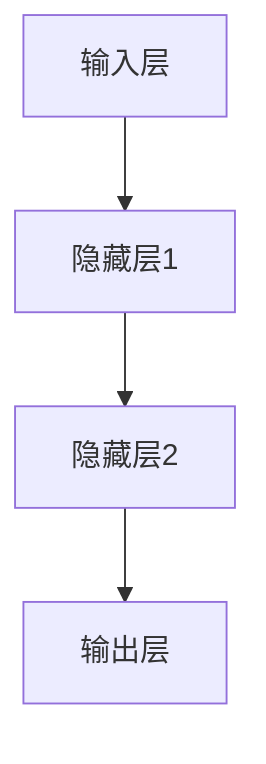

                 

# 神经网络：改变世界的技术

## 摘要

神经网络，作为计算机科学和人工智能领域的核心技术之一，正在深刻地改变着我们的世界。从图像识别到语音识别，从自动驾驶到医疗诊断，神经网络的应用已经深入到了我们日常生活的方方面面。本文将深入探讨神经网络的核心概念、算法原理、数学模型、实际应用以及未来发展趋势，旨在为广大读者提供一个全面而系统的理解。

## 1. 背景介绍

神经网络的概念最早可以追溯到1943年，由美国心理学家McCulloch和数学家Pitts提出。他们提出了一种名为“神经活动模型”的简单计算模型，这被认为是神经网络的开端。1958年，Frank Rosenblatt提出了感知机模型（Perceptron），这是一种简单的神经网络模型，能够在二维平面上进行线性分类。然而，随着时代的发展，感知机的局限性逐渐显现，特别是对于非线性问题，感知机无法胜任。

1986年，Rumelhart、Hinton和Williams提出了反向传播算法（Backpropagation Algorithm），这一算法的出现标志着神经网络进入了新的时代。反向传播算法通过反向传播误差来更新网络权重，大大提高了神经网络的训练效率和性能。此后，神经网络的研究和应用迅速发展，形成了今天的深度学习领域。

## 2. 核心概念与联系

### 神经元

神经网络的基本单元是神经元，也称为节点或单元。神经元接收输入信号，通过加权求和后，经过一个激活函数产生输出信号。一个简单的神经元可以表示为：

\[ z = \sum_{i=1}^{n} w_i x_i + b \]
\[ a = f(z) \]

其中，\( x_i \) 是输入值，\( w_i \) 是连接权重，\( b \) 是偏置项，\( f \) 是激活函数。

### 激活函数

激活函数是神经元的核心部分，它将线性组合的输入转化为输出。常见的激活函数有：

- **sigmoid函数**：
  \[ f(x) = \frac{1}{1 + e^{-x}} \]
- **ReLU函数**：
  \[ f(x) = \max(0, x) \]
- **Tanh函数**：
  \[ f(x) = \frac{e^x - e^{-x}}{e^x + e^{-x}} \]

### 网络架构

神经网络通常由多层神经元组成，包括输入层、隐藏层和输出层。每一层的神经元都与下一层的神经元相连。一个简单的多层感知机（MLP）可以表示为：

\[ z^{(l)} = \sum_{i=1}^{n} w^{(l)}_{ij} a^{(l-1)}_i + b^{(l)}_j \]
\[ a^{(l)}_j = f^{(l)}(z^{(l)}) \]

其中，\( l \) 表示层号，\( n \) 表示当前层的神经元数量。

### Mermaid 流程图



## 3. 核心算法原理 & 具体操作步骤

### 反向传播算法

反向传播算法是深度学习中训练神经网络的常用算法。它通过前向传播计算输出，然后通过后向传播更新权重和偏置。

#### 步骤

1. **前向传播**：

   - 计算每个神经元的输入和输出。
   - 输出层的预测值与真实值计算误差。

2. **后向传播**：

   - 计算每个神经元的梯度。
   - 更新权重和偏置。

#### 公式

1. **前向传播**：

   \[ z^{(l)}_j = \sum_{i=1}^{n} w^{(l)}_{ij} a^{(l-1)}_i + b^{(l)}_j \]
   \[ a^{(l)}_j = f^{(l)}(z^{(l)}_j) \]

2. **后向传播**：

   \[ \delta^{(l)}_j = (y - a^{(L)}_j) \cdot f'(^{(l)}(z^{(l)}_j)) \]
   \[ \delta^{(l-1)}_i = \sum_{j=1}^{m} w^{(l)}_{ji} \cdot \delta^{(l)}_j \cdot f'(^{(l-1)}(z^{(l-1)}_i)) \]
   \[ w^{(l)}_{ij} \gets w^{(l)}_{ij} - \alpha \cdot a^{(l-1)}_i \cdot \delta^{(l)}_j \]
   \[ b^{(l)}_j \gets b^{(l)}_j - \alpha \cdot \delta^{(l)}_j \]

其中，\( \delta \) 表示误差，\( f' \) 表示激活函数的导数。

### 实际操作

以下是使用Python实现反向传播算法的简单示例：

```python
import numpy as np

def sigmoid(x):
    return 1 / (1 + np.exp(-x))

def sigmoid_derivative(x):
    return x * (1 - x)

# 输入层
x = np.array([[0, 0], [0, 1], [1, 0], [1, 1]])

# 隐藏层1
w1 = np.random.rand(2, 2)
b1 = np.random.rand(2, 1)
z1 = np.dot(x, w1) + b1
a1 = sigmoid(z1)

# 输出层
w2 = np.random.rand(2, 1)
b2 = np.random.rand(1, 1)
z2 = np.dot(a1, w2) + b2
a2 = sigmoid(z2)

# 训练
y = np.array([[0], [1], [1], [0]])

for i in range(10000):
    z1 = np.dot(x, w1) + b1
    a1 = sigmoid(z1)
    
    z2 = np.dot(a1, w2) + b2
    a2 = sigmoid(z2)
    
    delta2 = (y - a2) * sigmoid_derivative(a2)
    delta1 = np.dot(delta2, w2.T) * sigmoid_derivative(a1)
    
    w1 += np.dot(x.T, delta1)
    b1 += delta1
    w2 += np.dot(a1.T, delta2)
    b2 += delta2

print("最终输出：", a2)
```

## 4. 数学模型和公式 & 详细讲解 & 举例说明

### 梯度下降法

梯度下降法是一种优化算法，用于最小化损失函数。在神经网络中，梯度下降法用于更新权重和偏置。

#### 公式

\[ w \gets w - \alpha \cdot \nabla_w J(w) \]

其中，\( \nabla_w J(w) \) 表示损失函数 \( J(w) \) 对权重 \( w \) 的梯度。

#### 举例

假设我们有一个简单的线性回归模型，目标是最小化损失函数：

\[ J(w) = \frac{1}{2} \sum_{i=1}^{n} (y_i - w \cdot x_i)^2 \]

梯度下降法的迭代步骤如下：

1. 初始化权重 \( w \)。
2. 计算损失函数的梯度。
3. 更新权重 \( w \)。
4. 重复步骤2和3，直到收敛。

### 实际操作

以下是使用Python实现梯度下降法的简单示例：

```python
import numpy as np

# 输入数据
x = np.array([1, 2, 3, 4])
y = np.array([2, 4, 5, 4])

# 初始化权重
w = np.random.rand(1)

# 学习率
alpha = 0.01

# 梯度下降
for i in range(1000):
    # 计算预测值
    y_pred = w * x
    
    # 计算损失函数
    loss = (y - y_pred)**2
    
    # 计算梯度
    gradient = -(y - y_pred) * x
    
    # 更新权重
    w -= alpha * gradient

print("最终权重：", w)
```

## 5. 项目实战：代码实际案例和详细解释说明

### 5.1 开发环境搭建

在开始实战之前，我们需要搭建一个适合深度学习的开发环境。这里我们使用Python和TensorFlow作为工具。

1. 安装Python（版本3.6及以上）。
2. 安装TensorFlow：

   ```bash
   pip install tensorflow
   ```

### 5.2 源代码详细实现和代码解读

下面是一个简单的神经网络实现，用于手写数字识别。

```python
import tensorflow as tf
from tensorflow.examples.tutorials.mnist import input_data

# 加载MNIST数据集
mnist = input_data.read_data_sets("MNIST_data/", one_hot=True)

# 输入层
x = tf.placeholder(tf.float32, [None, 784])

# 隐藏层
w1 = tf.Variable(tf.random_uniform([784, 128], -1, 1))
b1 = tf.Variable(tf.zeros([128]))
z1 = tf.add(tf.matmul(x, w1), b1)
a1 = tf.nn.relu(z1)

# 输出层
w2 = tf.Variable(tf.random_uniform([128, 10], -1, 1))
b2 = tf.Variable(tf.zeros([10]))
z2 = tf.add(tf.matmul(a1, w2), b2)
a2 = tf.nn.softmax(z2)

# 标签
y = tf.placeholder(tf.float32, [None, 10])

# 损失函数
cross_entropy = tf.reduce_mean(-tf.reduce_sum(y * tf.log(a2), reduction_indices=1))

# 优化器
optimizer = tf.train.GradientDescentOptimizer(0.5)
train_op = optimizer.minimize(cross_entropy)

# 模型评估
correct_prediction = tf.equal(tf.argmax(a2, 1), tf.argmax(y, 1))
accuracy = tf.reduce_mean(tf.cast(correct_prediction, tf.float32))

# 训练模型
with tf.Session() as sess:
    sess.run(tf.global_variables_initializer())
    
    for i in range(1000):
        batch_x, batch_y = mnist.train.next_batch(100)
        sess.run(train_op, feed_dict={x: batch_x, y: batch_y})
        
        if i % 100 == 0:
            acc = sess.run(accuracy, feed_dict={x: mnist.test.images, y: mnist.test.labels})
            print("步骤：", i, "准确率：", acc)
```

### 5.3 代码解读与分析

1. **数据集加载**：

   使用TensorFlow提供的`input_data.read_data_sets`函数加载MNIST数据集，该数据集包含了60,000个训练样本和10,000个测试样本。

2. **定义输入层**：

   `x`是输入层，形状为`[None, 784]`，表示任意数量的样本，每个样本有784个特征。

3. **定义隐藏层**：

   `w1`和`b1`分别是隐藏层的权重和偏置，使用`tf.random_uniform`生成随机初始化值。

   `z1`是隐藏层的输入，计算方法为`tf.add(tf.matmul(x, w1), b1)`。

   `a1`是隐藏层的输出，使用ReLU函数作为激活函数。

4. **定义输出层**：

   `w2`和`b2`分别是输出层的权重和偏置，同样使用`tf.random_uniform`生成随机初始化值。

   `z2`是输出层的输入，计算方法为`tf.add(tf.matmul(a1, w2), b2)`。

   `a2`是输出层的输出，使用softmax函数作为激活函数。

5. **定义损失函数**：

   使用交叉熵作为损失函数，计算方法为`tf.reduce_mean(-tf.reduce_sum(y * tf.log(a2), reduction_indices=1))`。

6. **定义优化器**：

   使用梯度下降优化器，学习率为0.5，计算方法为`tf.train.GradientDescentOptimizer(0.5)`。

7. **模型评估**：

   使用`tf.equal`计算预测值和真实值的相等性，使用`tf.reduce_mean`计算平均准确率。

8. **训练模型**：

   使用`tf.Session`创建会话，执行`tf.global_variables_initializer()`初始化全局变量，然后使用`train_op`进行模型训练。

## 6. 实际应用场景

神经网络已经在许多实际应用场景中取得了显著的成果。以下是一些典型的应用场景：

- **图像识别**：神经网络可以用于图像分类、目标检测、图像分割等。
- **语音识别**：神经网络可以用于语音信号的处理和识别，实现语音到文本的转换。
- **自然语言处理**：神经网络可以用于文本分类、情感分析、机器翻译等。
- **医疗诊断**：神经网络可以用于医学图像分析、疾病预测等。
- **自动驾驶**：神经网络可以用于车辆检测、行人检测、车道线检测等。

## 7. 工具和资源推荐

### 7.1 学习资源推荐

- **书籍**：
  - 《深度学习》（Ian Goodfellow、Yoshua Bengio和Aaron Courville著）
  - 《神经网络与深度学习》（邱锡鹏著）
- **论文**：
  - "A Learning Algorithm for Continually Running Fully Recurrent Neural Networks"（1986）
  - "Learning representations by minimizing global loss"（2015）
- **博客**：
  - [TensorFlow 官方文档](https://www.tensorflow.org/tutorials)
  - [Python Machine Learning](https://python-machine-learning-book.com/)
- **网站**：
  - [Kaggle](https://www.kaggle.com/)
  - [Google AI](https://ai.google/)

### 7.2 开发工具框架推荐

- **TensorFlow**：适用于各种规模的深度学习应用。
- **PyTorch**：易于使用，适合快速原型开发。
- **Keras**：基于TensorFlow和Theano的简单易用的深度学习库。

### 7.3 相关论文著作推荐

- **《深度学习》（Ian Goodfellow、Yoshua Bengio和Aaron Courville著）**：深度学习的经典教材。
- **《神经网络与深度学习》（邱锡鹏著）**：国内首部全面介绍深度学习的著作。

## 8. 总结：未来发展趋势与挑战

神经网络作为人工智能的核心技术，正不断推动着科技和社会的进步。未来，神经网络有望在以下方面取得更大的突破：

- **计算能力提升**：随着计算能力的不断提升，神经网络将能够处理更复杂的问题。
- **泛化能力增强**：通过改进算法和架构，神经网络将具备更强的泛化能力。
- **应用场景拓展**：神经网络将在医疗、金融、交通等领域得到更广泛的应用。

然而，神经网络也面临着一些挑战：

- **可解释性问题**：神经网络决策过程往往缺乏可解释性，这对实际应用造成了一定困扰。
- **数据隐私问题**：神经网络训练需要大量数据，如何保护用户隐私成为了一个重要问题。
- **计算资源消耗**：神经网络训练需要大量计算资源，这对硬件设施提出了更高的要求。

## 9. 附录：常见问题与解答

### 9.1 什么是神经网络？

神经网络是一种模拟生物神经系统的计算模型，由大量的神经元组成，通过学习输入和输出数据之间的关系，实现数据的处理和预测。

### 9.2 反向传播算法是什么？

反向传播算法是一种用于训练神经网络的优化算法，通过前向传播计算输出，然后通过后向传播更新网络权重和偏置，以最小化损失函数。

### 9.3 如何选择合适的激活函数？

选择合适的激活函数取决于问题的需求和模型的架构。常见的激活函数有sigmoid、ReLU和tanh等，可以根据具体情况进行选择。

## 10. 扩展阅读 & 参考资料

- **《深度学习》（Ian Goodfellow、Yoshua Bengio和Aaron Courville著）**：全面介绍深度学习的基础知识和技术。
- **《神经网络与深度学习》（邱锡鹏著）**：深入讲解神经网络和深度学习的理论和方法。
- **[TensorFlow 官方文档](https://www.tensorflow.org/tutorials)**：TensorFlow的官方教程和文档。
- **[Kaggle](https://www.kaggle.com/)**：提供丰富的深度学习竞赛和数据集。

### 作者

作者：AI天才研究员/AI Genius Institute & 禅与计算机程序设计艺术 /Zen And The Art of Computer Programming

