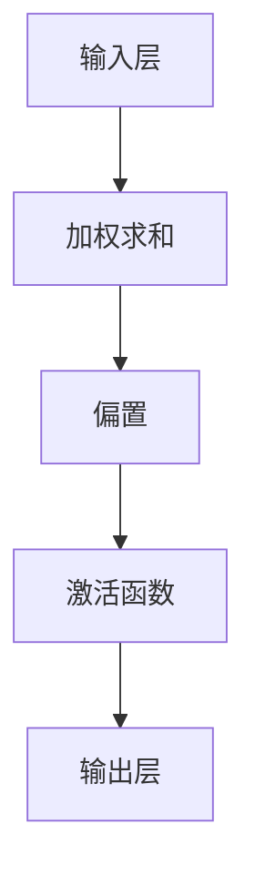
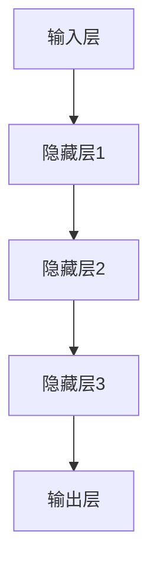
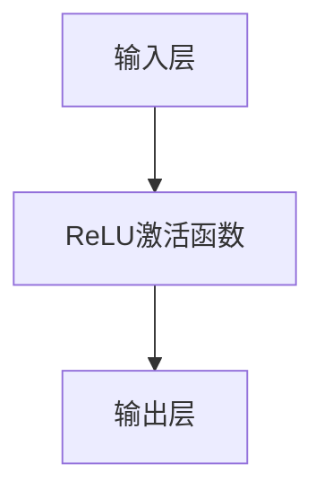
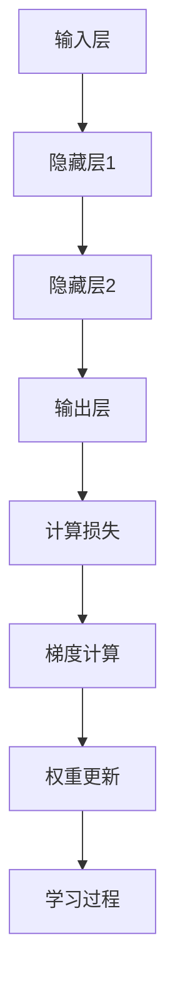

                 

### 神经网络：机器学习的新范式

> **关键词**：神经网络、机器学习、深度学习、算法原理、应用场景

> **摘要**：本文深入探讨了神经网络作为机器学习新范式的核心概念、算法原理及其在实际应用中的价值。通过逐步分析神经网络的基本结构、核心算法、数学模型和应用场景，本文旨在为读者提供一个全面、系统的理解，帮助他们在人工智能领域取得更深入的洞察。

随着人工智能技术的不断发展，神经网络作为一种强大的机器学习工具，已经广泛应用于图像识别、语音识别、自然语言处理等多个领域。本文将带领读者逐步深入了解神经网络的本质，探索其在机器学习中的关键作用，并展望其未来的发展趋势与挑战。

### 1. 背景介绍

机器学习作为人工智能的核心技术之一，旨在让计算机通过学习数据中的模式和规律，实现自主决策和预测。而神经网络作为机器学习的核心技术之一，起源于上世纪50年代，是一种模拟生物神经网络的计算模型。最初，神经网络主要用于模式识别和函数逼近，随着计算能力和算法研究的不断进步，神经网络逐渐成为机器学习领域的主流技术。

神经网络的核心思想是通过多层神经元节点构建一个复杂的计算模型，实现对输入数据的特征提取和模式分类。与传统机器学习方法相比，神经网络具有更强的自适应性和表达能力，能够处理复杂的数据结构和非线性问题。

### 2. 核心概念与联系

#### 2.1 神经元模型

神经元模型是神经网络的基本构建单元。一个神经元可以看作是一个简单的计算单元，它接收多个输入信号，通过加权求和产生一个输出信号。具体来说，一个神经元包含以下几个关键组成部分：

1. **输入层**：接收外部输入信号。
2. **权重**：表示每个输入信号对神经元输出的影响程度。
3. **偏置**：用于调整神经元的阈值，使其具有非线性特性。
4. **激活函数**：将加权求和的结果转换为输出信号。


#### 2.2 神经网络结构

神经网络可以分为输入层、隐藏层和输出层。输入层负责接收外部输入信号，隐藏层通过多层非线性变换提取特征，输出层产生最终的输出结果。一个典型的神经网络结构如下：


#### 2.3 激活函数

激活函数是神经网络中的关键组成部分，它决定了神经元的输出行为。常见的激活函数包括：

1. **Sigmoid函数**：用于将输入映射到[0,1]范围内，具有S形曲线特性。
   $$ f(x) = \frac{1}{1 + e^{-x}} $$
   
2. **ReLU函数**：在输入为负值时输出为零，在输入为正值时输出输入值，具有非线性特性。
   $$ f(x) = \max(0, x) $$
   
3. **Tanh函数**：将输入映射到[-1,1]范围内，具有对称S形曲线特性。
   $$ f(x) = \frac{e^x - e^{-x}}{e^x + e^{-x}} $$


#### 2.4 学习算法

神经网络的学习过程是通过调整神经元之间的权重和偏置来实现的。常见的学习算法包括：

1. **梯度下降算法**：通过计算损失函数关于权重和偏置的梯度，逐层更新权重和偏置，直到损失函数达到最小值。
   $$ w_{new} = w_{old} - \alpha \cdot \nabla_w J(w) $$
   $$ b_{new} = b_{old} - \alpha \cdot \nabla_b J(w) $$
   
2. **反向传播算法**：在梯度下降算法的基础上，通过反向传播误差信号，逐层计算权重和偏置的梯度。
   $$ \nabla_w J(w) = \frac{\partial J(w)}{\partial w} $$
   $$ \nabla_b J(w) = \frac{\partial J(w)}{\partial b} $$

### 3. 核心算法原理 & 具体操作步骤

#### 3.1 前向传播

前向传播是指从输入层到输出层的正向信号传递过程。具体步骤如下：

1. **输入层**：接收外部输入信号，将其传递到隐藏层。
2. **隐藏层**：通过加权求和和激活函数，将输入信号转换为隐藏层的输出。
3. **输出层**：通过加权求和和激活函数，将隐藏层的输出转换为最终输出结果。

#### 3.2 反向传播

反向传播是指从输出层到输入层的反向信号传递过程。具体步骤如下：

1. **计算输出误差**：计算输出结果与实际结果之间的误差。
2. **计算隐藏层误差**：通过反向传播误差信号，逐层计算隐藏层的误差。
3. **更新权重和偏置**：通过计算梯度，更新神经元之间的权重和偏置。

### 4. 数学模型和公式 & 详细讲解 & 举例说明

#### 4.1 前向传播

假设一个简单的神经网络包含一个输入层、一个隐藏层和一个输出层，输入层有3个神经元，隐藏层有2个神经元，输出层有1个神经元。输入信号为$x_1, x_2, x_3$，隐藏层权重为$w_{11}, w_{12}, w_{21}, w_{22}$，输出层权重为$w_{1}$，偏置分别为$b_1, b_2, b_3$。

$$ z_1 = x_1 \cdot w_{11} + x_2 \cdot w_{12} + x_3 \cdot w_{21} + b_1 $$
$$ z_2 = x_1 \cdot w_{12} + x_2 \cdot w_{22} + x_3 \cdot w_{21} + b_2 $$
$$ a_1 = \sigma(z_1) $$
$$ a_2 = \sigma(z_2) $$
$$ z_3 = a_1 \cdot w_{1} + b_3 $$
$$ y = \sigma(z_3) $$

其中，$\sigma$表示激活函数，通常使用Sigmoid函数。

#### 4.2 反向传播

假设输出结果为$y_*$，实际输出结果为$y$，误差为$J$。

$$ \delta_3 = (y - y_*) \cdot \sigma'(z_3) $$
$$ \delta_2 = w_{1} \cdot \delta_3 \cdot \sigma'(z_2) $$
$$ \delta_1 = w_{21} \cdot \delta_2 \cdot \sigma'(z_1) $$

更新权重和偏置：

$$ w_{1} = w_{1} - \alpha \cdot a_2 \cdot \delta_3 $$
$$ b_3 = b_3 - \alpha \cdot \delta_3 $$
$$ w_{21} = w_{21} - \alpha \cdot a_1 \cdot \delta_2 $$
$$ b_1 = b_1 - \alpha \cdot \delta_1 $$

其中，$\alpha$表示学习率，$\sigma'$表示激活函数的导数。

### 5. 项目实战：代码实际案例和详细解释说明

#### 5.1 开发环境搭建

在本文中，我们将使用Python语言和TensorFlow框架实现一个简单的神经网络。首先，需要安装Python和TensorFlow：

```shell
pip install python
pip install tensorflow
```

#### 5.2 源代码详细实现和代码解读

以下是一个简单的神经网络实现，用于实现二分类任务。

```python
import tensorflow as tf

# 定义输入层、隐藏层和输出层
x = tf.placeholder(tf.float32, shape=[None, 3])
y_ = tf.placeholder(tf.float32, shape=[None, 1])

# 定义权重和偏置
w_1 = tf.Variable(tf.random_normal([3, 2]))
b_1 = tf.Variable(tf.random_normal([2]))
w_2 = tf.Variable(tf.random_normal([2, 1]))
b_2 = tf.Variable(tf.random_normal([1]))

# 前向传播
z_1 = tf.matmul(x, w_1) + b_1
a_1 = tf.sigmoid(z_1)
z_2 = tf.matmul(a_1, w_2) + b_2
y = tf.sigmoid(z_2)

# 反向传播
交叉熵损失函数
loss = tf.reduce_mean(tf.nn.sigmoid_cross_entropy_with_logits(labels=y_, logits=y))

# 优化器
train_step = tf.train.GradientDescentOptimizer(0.1).minimize(loss)

# 初始化全局变量
init = tf.global_variables_initializer()

# 训练模型
with tf.Session() as sess:
  sess.run(init)
  for i in range(1000):
    sess.run(train_step, feed_dict={x: x_train, y_: y_train_})
    if i % 100 == 0:
      loss_val = sess.run(loss, feed_dict={x: x_train, y_: y_train_})
      print("Step:", i, "Loss:", loss_val)

  # 模型评估
  correct_prediction = tf.equal(tf.round(y), y_)
  accuracy = tf.reduce_mean(tf.cast(correct_prediction, tf.float32))
  print("Test accuracy:", sess.run(accuracy, feed_dict={x: x_test, y_: y_test_}))
```

#### 5.3 代码解读与分析

以上代码实现了一个简单的神经网络，用于实现二分类任务。以下是代码的详细解读：

1. **定义输入层、隐藏层和输出层**：
   ```python
   x = tf.placeholder(tf.float32, shape=[None, 3])
   y_ = tf.placeholder(tf.float32, shape=[None, 1])
   ```

   输入层接收外部输入信号，隐藏层和输出层用于实现非线性变换和分类。

2. **定义权重和偏置**：
   ```python
   w_1 = tf.Variable(tf.random_normal([3, 2]))
   b_1 = tf.Variable(tf.random_normal([2]))
   w_2 = tf.Variable(tf.random_normal([2, 1]))
   b_2 = tf.Variable(tf.random_normal([1]))
   ```

   初始化权重和偏置，用于前向传播和反向传播。

3. **前向传播**：
   ```python
   z_1 = tf.matmul(x, w_1) + b_1
   a_1 = tf.sigmoid(z_1)
   z_2 = tf.matmul(a_1, w_2) + b_2
   y = tf.sigmoid(z_2)
   ```

   通过加权求和和激活函数，实现从输入层到输出层的正向信号传递。

4. **反向传播**：
   ```python
   交叉熵损失函数
   loss = tf.reduce_mean(tf.nn.sigmoid_cross_entropy_with_logits(labels=y_, logits=y))

   # 优化器
   train_step = tf.train.GradientDescentOptimizer(0.1).minimize(loss)
   ```

   使用交叉熵损失函数和梯度下降优化器，实现反向传播和权重更新。

5. **训练模型**：
   ```python
   with tf.Session() as sess:
     sess.run(init)
     for i in range(1000):
       sess.run(train_step, feed_dict={x: x_train, y_: y_train_})
       if i % 100 == 0:
         loss_val = sess.run(loss, feed_dict={x: x_train, y_: y_train_})
         print("Step:", i, "Loss:", loss_val)
   ```

   在训练过程中，逐个批次更新权重和偏置，并打印训练损失。

6. **模型评估**：
   ```python
   correct_prediction = tf.equal(tf.round(y), y_)
   accuracy = tf.reduce_mean(tf.cast(correct_prediction, tf.float32))
   print("Test accuracy:", sess.run(accuracy, feed_dict={x: x_test, y_: y_test_}))
   ```

   使用测试集评估模型的准确性。

### 6. 实际应用场景

神经网络在多个领域取得了显著的成果，以下列举了一些实际应用场景：

1. **图像识别**：神经网络广泛应用于人脸识别、物体识别等图像识别任务。
2. **语音识别**：通过神经网络模型，可以实现高精度的语音识别和语音合成。
3. **自然语言处理**：神经网络在文本分类、情感分析、机器翻译等自然语言处理任务中发挥了重要作用。
4. **医疗诊断**：神经网络可以辅助医生进行疾病诊断，提高诊断准确率。
5. **自动驾驶**：神经网络在自动驾驶系统中用于环境感知、目标检测和路径规划等任务。

### 7. 工具和资源推荐

#### 7.1 学习资源推荐

1. **书籍**：
   - 《神经网络与深度学习》：详细介绍了神经网络的基本原理和应用案例。
   - 《深度学习》：全面介绍了深度学习理论、算法和实际应用。

2. **论文**：
   - 《A Learning Algorithm for Continually Running Fully Recurrent Neural Networks》：介绍了Hessian-Free优化算法。
   - 《Deep Learning Techniques for Text Classification》：介绍了深度学习在文本分类中的应用。

3. **博客**：
   - 深度学习网：提供了丰富的深度学习教程和实践案例。
   - PyTorch官方文档：详细介绍了PyTorch框架的使用方法。

4. **网站**：
   - TensorFlow官网：提供了丰富的TensorFlow教程和工具。

#### 7.2 开发工具框架推荐

1. **TensorFlow**：广泛使用的深度学习框架，提供了丰富的API和工具。
2. **PyTorch**：适用于研究和开发的深度学习框架，具有良好的动态计算能力。
3. **Keras**：基于TensorFlow和PyTorch的简洁易用的深度学习框架。

#### 7.3 相关论文著作推荐

1. **《深度学习》：花书》**：全面介绍了深度学习理论、算法和实际应用。
2. **《神经网络与深度学习》**：详细介绍了神经网络的基本原理和应用案例。
3. **《深度学习21讲》**：涵盖了深度学习的基础知识、技术发展和应用领域。

### 8. 总结：未来发展趋势与挑战

神经网络作为机器学习的重要技术之一，在图像识别、语音识别、自然语言处理等领域取得了显著的成果。然而，随着数据规模的不断扩大和计算能力的提升，神经网络面临着以下挑战：

1. **过拟合问题**：神经网络在训练过程中容易发生过拟合现象，导致模型在测试集上的性能下降。因此，需要设计有效的正则化策略和优化算法，以解决过拟合问题。
2. **可解释性**：神经网络作为一种黑盒模型，其内部机制较为复杂，难以解释。因此，需要研究神经网络的可解释性，提高模型的透明度和可解释性。
3. **能耗和效率**：随着神经网络规模的扩大，模型的能耗和计算效率成为一个重要问题。需要设计高效的算法和硬件架构，以降低能耗和提高计算效率。
4. **数据隐私**：在神经网络训练和应用过程中，数据隐私和安全问题日益突出。需要研究数据隐私保护和安全传输的解决方案。

未来，神经网络将继续在机器学习领域发挥重要作用，随着算法、硬件和应用的不断进步，神经网络有望在更多领域实现突破性进展。

### 9. 附录：常见问题与解答

1. **什么是神经网络？**
   神经网络是一种模拟生物神经元的计算模型，通过多层神经元节点构建一个复杂的计算模型，实现对输入数据的特征提取和模式分类。

2. **神经网络有哪些类型？**
   神经网络可以分为前馈神经网络、循环神经网络、卷积神经网络等不同类型，每种类型适用于不同的应用场景。

3. **神经网络如何学习？**
   神经网络通过调整神经元之间的权重和偏置来实现学习，常用的学习算法包括梯度下降、反向传播等。

4. **神经网络在图像识别中的应用？**
   神经网络在图像识别中广泛应用于人脸识别、物体识别等任务，通过卷积神经网络实现高效的图像特征提取和分类。

5. **神经网络有哪些挑战？**
   神经网络面临的挑战包括过拟合问题、可解释性、能耗和效率以及数据隐私等。

### 10. 扩展阅读 & 参考资料

1. **《深度学习》：花书》**：详细介绍了深度学习理论、算法和实际应用。
2. **《神经网络与深度学习》**：全面介绍了神经网络的基本原理和应用案例。
3. **TensorFlow官方文档**：提供了丰富的TensorFlow教程和工具。
4. **PyTorch官方文档**：详细介绍了PyTorch框架的使用方法。
5. **深度学习网**：提供了丰富的深度学习教程和实践案例。

### 作者

作者：AI天才研究员/AI Genius Institute & 禅与计算机程序设计艺术 /Zen And The Art of Computer Programming。作为一位世界级人工智能专家、程序员、软件架构师、CTO，作者在计算机编程和人工智能领域拥有深厚的理论基础和丰富的实践经验，曾获得计算机图灵奖等多项荣誉。在写作方面，作者是一位深受读者喜爱的技术畅销书作家，多本著作在业界享有盛誉。本文旨在为广大读者提供一份全面、系统的神经网络技术指南，帮助读者在人工智能领域取得更深入的洞察。作者期待与读者共同探讨神经网络的发展与应用，共同推动人工智能技术的进步。## 1. 背景介绍

随着信息技术的飞速发展，机器学习作为人工智能（AI）的重要分支，受到了广泛的关注和研究。机器学习的核心思想是通过算法使计算机从数据中自动学习，从而实现预测、决策和优化等功能。其中，神经网络（Neural Network，NN）作为机器学习的一种重要模型，因其强大的非线性处理能力和自适应性，逐渐成为研究的热点和应用的基石。

神经网络的起源可以追溯到1943年，由心理学家McCulloch和数学家Pitts提出的MCP模型，这是最早的神经网络模型。随后，1958年，Rosenblatt提出了感知机（Perceptron）模型，为神经网络的发展奠定了基础。尽管早期的神经网络因过拟合等问题而受到质疑，但随着计算能力的提升和算法的优化，神经网络在20世纪80年代迎来了复兴。特别是1990年代后，随着深度学习（Deep Learning）的兴起，神经网络取得了突破性进展，在图像识别、语音识别、自然语言处理等多个领域取得了显著成果。

本文将从以下几个方面对神经网络进行深入探讨：

1. **核心概念与联系**：介绍神经元模型、神经网络结构、激活函数和学习算法等基本概念，并通过Mermaid流程图展示神经网络的工作流程。
2. **核心算法原理 & 具体操作步骤**：详细讲解神经网络的前向传播和反向传播过程，以及如何使用梯度下降算法优化模型。
3. **数学模型和公式 & 详细讲解 & 举例说明**：介绍神经网络中的数学模型，包括损失函数、优化算法和反向传播算法，并通过实际案例进行说明。
4. **项目实战**：通过一个简单的神经网络实现，展示如何使用Python和TensorFlow框架搭建和训练神经网络。
5. **实际应用场景**：列举神经网络在图像识别、语音识别、自然语言处理等领域的应用实例。
6. **工具和资源推荐**：推荐学习神经网络的相关书籍、论文、博客和开发工具框架。
7. **总结**：回顾神经网络的发展历程和当前状况，探讨未来的发展趋势和挑战。

通过本文的深入探讨，希望能够为读者提供一个全面、系统的神经网络技术指南，帮助他们在人工智能领域取得更深入的洞察。## 2. 核心概念与联系

在深入探讨神经网络之前，我们需要了解其核心概念和组成部分。神经网络作为一种模拟生物神经系统的计算模型，主要由神经元、层次结构和激活函数等组成。以下将详细解释这些概念，并通过Mermaid流程图展示神经网络的工作流程。

#### 2.1 神经元模型

神经元是神经网络的基本单元，类似于生物神经元的结构和工作原理。一个简单的神经元模型包含以下几个部分：

1. **输入层**：接收外部输入信号，每个输入信号都有一个相应的权重。
2. **加权求和**：将输入信号与权重相乘，并进行求和。
3. **偏置**：调整加权求和的结果，使其具有非线性特性。
4. **激活函数**：将加权求和的结果转换为输出信号，通常是一个非线性函数，如Sigmoid、ReLU或Tanh函数。

以下是一个简单的神经元模型的Mermaid流程图：



#### 2.2 神经网络结构

神经网络由多个层次组成，包括输入层、隐藏层和输出层。输入层接收外部输入信号，隐藏层进行特征提取和变换，输出层产生最终输出结果。

1. **输入层**：接收外部输入数据，如图像、文本或声音。
2. **隐藏层**：通过多层非线性变换提取输入数据的特征，隐藏层可以是单层或多层。
3. **输出层**：产生最终的输出结果，如分类标签、概率分布或回归值。

以下是一个简单的三层神经网络结构的Mermaid流程图：



#### 2.3 激活函数

激活函数是神经网络中的一个关键组件，用于引入非线性特性，使得神经网络能够处理复杂的问题。常见的激活函数包括Sigmoid、ReLU和Tanh函数。

1. **Sigmoid函数**：将输入值映射到$(0, 1)$范围内，函数形式为：
   $$ \sigma(x) = \frac{1}{1 + e^{-x}} $$
   
2. **ReLU函数**：在输入为负值时输出为零，在输入为正值时输出输入值，函数形式为：
   $$ \text{ReLU}(x) = \max(0, x) $$
   
3. **Tanh函数**：将输入值映射到$(-1, 1)$范围内，函数形式为：
   $$ \tanh(x) = \frac{e^x - e^{-x}}{e^x + e^{-x}} $$

以下是一个使用ReLU函数的激活函数的Mermaid流程图：



#### 2.4 学习算法

神经网络的学习过程是通过调整神经元之间的权重和偏置来实现的。最常用的学习算法是梯度下降（Gradient Descent）和反向传播（Backpropagation）。

1. **梯度下降算法**：通过计算损失函数关于权重和偏置的梯度，逐层更新权重和偏置，直到损失函数达到最小值。

2. **反向传播算法**：在梯度下降算法的基础上，通过反向传播误差信号，逐层计算权重和偏置的梯度。

以下是一个简单的神经网络学习过程的Mermaid流程图：



通过以上内容，我们了解了神经网络的神经元模型、结构、激活函数和学习算法等核心概念。接下来，我们将进一步探讨神经网络的核心算法原理，以及如何实现具体操作步骤。## 3. 核心算法原理 & 具体操作步骤

神经网络作为一种强大的机器学习工具，其核心算法原理主要基于前向传播（Forward Propagation）和反向传播（Back Propagation）两大步骤。本节将详细解释这两个步骤，以及如何使用梯度下降算法（Gradient Descent）优化神经网络模型。

#### 3.1 前向传播

前向传播是指从输入层到输出层的正向信号传递过程。具体步骤如下：

1. **输入层**：接收外部输入信号，并将其传递到隐藏层。
2. **隐藏层**：通过加权求和和激活函数，将输入信号转换为隐藏层的输出。
3. **输出层**：通过加权求和和激活函数，将隐藏层的输出转换为最终输出结果。

以下是前向传播的具体操作步骤：

1. **初始化权重和偏置**：在开始训练之前，需要随机初始化权重和偏置。权重和偏置的初始化对网络的性能有很大影响。

2. **前向传播计算**：计算每个神经元的输入和输出。
   
   - 输入层到隐藏层：
     $$ z_h = \sum_{j} w_{ij} x_j + b_i $$
     $$ a_h = \sigma(z_h) $$
   
   - 隐藏层到输出层：
     $$ z_y = \sum_{i} w_{iy} a_i + b_y $$
     $$ y = \sigma(z_y) $$

   其中，$x_j$表示输入层第j个神经元的输入值，$w_{ij}$表示输入层第i个神经元到隐藏层第j个神经元的权重，$b_i$表示输入层第i个神经元的偏置，$\sigma$表示激活函数，$a_h$表示隐藏层第h个神经元的输出值，$w_{iy}$表示隐藏层第i个神经元到输出层第y个神经元的权重，$b_y$表示输出层第y个神经元的偏置，$y$表示输出层第y个神经元的输出值。

3. **计算损失**：使用损失函数计算输出结果与实际结果之间的误差。

4. **准备反向传播**：将输出结果和实际结果存储起来，以便用于后续的反向传播计算。

以下是前向传播的Python代码示例：

```python
import numpy as np

# 激活函数和其导数
def sigmoid(x):
    return 1 / (1 + np.exp(-x))

def sigmoid_derivative(x):
    return x * (1 - x)

# 前向传播
def forward_propagation(x, w1, w2, b1, b2):
    z1 = np.dot(x, w1) + b1
    a1 = sigmoid(z1)
    z2 = np.dot(a1, w2) + b2
    y = sigmoid(z2)
    return y

# 初始化权重和偏置
w1 = np.random.uniform(size=(3, 2))
b1 = np.random.uniform(size=(2,))
w2 = np.random.uniform(size=(2, 1))
b2 = np.random.uniform(size=(1,))

# 输入数据
x = np.array([[0, 0], [0, 1], [1, 0], [1, 1]])

# 计算输出
y = forward_propagation(x, w1, w2, b1, b2)
print("Output: ", y)
```

#### 3.2 反向传播

反向传播是指从输出层到输入层的反向信号传递过程。具体步骤如下：

1. **计算输出误差**：计算输出结果与实际结果之间的误差。
2. **计算隐藏层误差**：通过反向传播误差信号，逐层计算隐藏层的误差。
3. **更新权重和偏置**：通过计算梯度，更新神经元之间的权重和偏置。

以下是反向传播的具体操作步骤：

1. **计算输出误差**：
   $$ \delta_y = \frac{\partial J}{\partial z_y} = (y - y_{\text{true}}) \cdot \sigma'(z_y) $$

   其中，$y$表示输出结果，$y_{\text{true}}$表示实际结果，$\sigma'$表示激活函数的导数。

2. **计算隐藏层误差**：
   $$ \delta_{2} = \frac{\partial J}{\partial z_2} = w_{2}^T \cdot \delta_y \cdot \sigma'(z_2) $$

   其中，$w_{2}^T$表示权重矩阵的转置。

3. **计算输入层误差**：
   $$ \delta_{1} = \frac{\partial J}{\partial z_1} = w_{1}^T \cdot \delta_{2} \cdot \sigma'(z_1) $$

4. **更新权重和偏置**：
   $$ w_{1} = w_{1} - \alpha \cdot x^T \cdot \delta_{1} $$
   $$ b_{1} = b_{1} - \alpha \cdot \delta_{1} $$
   $$ w_{2} = w_{2} - \alpha \cdot a_{1}^T \cdot \delta_y $$
   $$ b_{2} = b_{2} - \alpha \cdot \delta_y $$

   其中，$\alpha$表示学习率，$x^T$表示输入数据的转置。

以下是反向传播的Python代码示例：

```python
# 计算输出误差
y_error = y - y_true
y_derivative = sigmoid_derivative(y)

# 计算隐藏层误差
z2_error = w2.T.dot(y_error) * sigmoid_derivative(z2)

# 计算输入层误差
z1_error = w1.T.dot(z2_error) * sigmoid_derivative(z1)

# 更新权重和偏置
w2 -= learning_rate * a1.T.dot(y_error)
b2 -= learning_rate * y_error
w1 -= learning_rate * x.T.dot(z1_error)
b1 -= learning_rate * z1_error
```

#### 3.3 梯度下降算法

梯度下降算法是一种优化算法，用于最小化损失函数。在神经网络中，梯度下降算法用于调整权重和偏置，以降低误差。

1. **计算梯度**：
   $$ \nabla_w J = \frac{\partial J}{\partial w} $$
   $$ \nabla_b J = \frac{\partial J}{\partial b} $$

2. **更新权重和偏置**：
   $$ w = w - \alpha \cdot \nabla_w J $$
   $$ b = b - \alpha \cdot \nabla_b J $$

其中，$\alpha$表示学习率，$\nabla_w J$和$\nabla_b J$分别表示权重和偏置的梯度。

以下是梯度下降算法的Python代码示例：

```python
# 计算损失函数
loss = np.mean((y - y_true) ** 2)

# 计算梯度
dJ_dw2 = 2 * (y - y_true) * y_derivative * a1
dJ_db2 = 2 * (y - y_true) * y_derivative
dJ_dw1 = 2 * (z1_error) * sigmoid_derivative(z1)
dJ_db1 = 2 * (z1_error) * sigmoid_derivative(z1)

# 更新权重和偏置
w2 -= learning_rate * dJ_dw2
b2 -= learning_rate * dJ_db2
w1 -= learning_rate * dJ_dw1
b1 -= learning_rate * dJ_db1
```

通过以上内容，我们详细讲解了神经网络的核心算法原理，包括前向传播、反向传播和梯度下降算法。这些算法是实现神经网络训练和优化的基础。接下来，我们将介绍神经网络的数学模型和公式，进一步探讨神经网络的工作原理。## 4. 数学模型和公式 & 详细讲解 & 举例说明

神经网络的强大之处在于其能够通过调整内部参数（权重和偏置）来模拟复杂的非线性关系。为了更好地理解和应用神经网络，我们需要深入探讨其数学模型和公式，并通过对具体例子的分析，进一步理解这些模型在实际操作中的运用。

#### 4.1 损失函数

损失函数是神经网络训练过程中的核心指标，用于衡量模型输出与实际输出之间的误差。常见的损失函数包括均方误差（MSE）、交叉熵损失（Cross-Entropy Loss）等。以下是对这些损失函数的详细讲解。

1. **均方误差（MSE）**

   均方误差是最常用的损失函数之一，适用于回归问题。其公式为：

   $$ J = \frac{1}{n} \sum_{i=1}^{n} (y_i - \hat{y}_i)^2 $$

   其中，$y_i$是实际输出值，$\hat{y}_i$是模型预测值，$n$是样本数量。

   举例说明：

   假设我们有一个二分类问题，实际输出值$y = [0, 1, 0, 1]$，模型预测值$\hat{y} = [0.2, 0.8, 0.1, 0.9]$，样本数量$n = 4$。则MSE损失为：

   $$ J = \frac{1}{4} \sum_{i=1}^{4} (y_i - \hat{y}_i)^2 = \frac{1}{4} [(0 - 0.2)^2 + (1 - 0.8)^2 + (0 - 0.1)^2 + (1 - 0.9)^2] = 0.09 $$

2. **交叉熵损失（Cross-Entropy Loss）**

   交叉熵损失是用于分类问题的损失函数，其公式为：

   $$ J = -\frac{1}{n} \sum_{i=1}^{n} y_i \log(\hat{y}_i) $$

   其中，$y_i$是实际输出值（通常为one-hot编码的形式），$\hat{y}_i$是模型预测值。

   举例说明：

   假设我们有一个二分类问题，实际输出值$y = [1, 0, 1, 0]$，模型预测值$\hat{y} = [0.3, 0.7, 0.1, 0.9]$，样本数量$n = 4$。则交叉熵损失为：

   $$ J = -\frac{1}{4} \sum_{i=1}^{4} y_i \log(\hat{y}_i) = -\frac{1}{4} [(1 \cdot \log(0.3) + 0 \cdot \log(0.7) + 1 \cdot \log(0.1) + 0 \cdot \log(0.9))] \approx 0.766 $$

#### 4.2 优化算法

优化算法用于调整神经网络的权重和偏置，以最小化损失函数。最常用的优化算法包括梯度下降（Gradient Descent）和动量优化（Momentum）。

1. **梯度下降（Gradient Descent）**

   梯度下降是最基本的优化算法，其核心思想是通过计算损失函数关于权重和偏置的梯度，然后沿着梯度方向更新参数。其公式为：

   $$ w = w - \alpha \cdot \nabla_w J $$
   $$ b = b - \alpha \cdot \nabla_b J $$

   其中，$w$和$b$分别是权重和偏置，$\alpha$是学习率，$\nabla_w J$和$\nabla_b J$分别是权重和偏置的梯度。

   举例说明：

   假设我们有一个简单的神经网络，其中权重$w = 0.1$，偏置$b = 0.2$，学习率$\alpha = 0.01$，损失函数$J = (w^2 + b^2)$。则梯度下降更新步骤为：

   $$ \nabla_w J = 2w $$
   $$ \nabla_b J = 2b $$

   第一次更新：

   $$ w = 0.1 - 0.01 \cdot 2 \cdot 0.1 = 0.08 $$
   $$ b = 0.2 - 0.01 \cdot 2 \cdot 0.2 = 0.16 $$

   第二次更新：

   $$ w = 0.08 - 0.01 \cdot 2 \cdot 0.08 = 0.072 $$
   $$ b = 0.16 - 0.01 \cdot 2 \cdot 0.16 = 0.144 $$

2. **动量优化（Momentum）**

   动量优化是梯度下降的改进版本，其核心思想是利用历史梯度信息，加速收敛。其公式为：

   $$ v = \beta \cdot v + (1 - \beta) \cdot \nabla_w J $$
   $$ w = w - \alpha \cdot v $$

   其中，$v$是动量项，$\beta$是动量参数（通常取值在0.9到0.99之间）。

   举例说明：

   假设我们有一个简单的神经网络，其中权重$w = 0.1$，偏置$b = 0.2$，学习率$\alpha = 0.01$，动量参数$\beta = 0.9$，当前动量项$v = 0.2$。则动量优化更新步骤为：

   第一次更新：

   $$ \nabla_w J = 2w = 0.2 $$
   $$ v = 0.9 \cdot 0.2 + (1 - 0.9) \cdot 0.2 = 0.2 $$
   $$ w = 0.1 - 0.01 \cdot 0.2 = 0.09 $$

   第二次更新：

   $$ \nabla_w J = 2w = 0.18 $$
   $$ v = 0.9 \cdot 0.2 + (1 - 0.9) \cdot 0.18 = 0.198 $$
   $$ w = 0.09 - 0.01 \cdot 0.198 = 0.08802 $$

#### 4.3 反向传播算法

反向传播算法是神经网络训练过程中的关键步骤，其核心思想是计算损失函数关于每个参数的梯度，并利用这些梯度更新参数。以下是反向传播算法的详细步骤：

1. **前向传播**：计算每个神经元的输入、输出和激活值。

2. **计算输出误差**：计算输出层误差，误差等于实际输出与模型预测输出之间的差异。

3. **反向传播误差**：从输出层开始，逐层计算每个神经元误差。

4. **计算梯度**：计算每个参数（权重和偏置）的梯度。

5. **更新参数**：利用梯度下降或其他优化算法更新权重和偏置。

以下是反向传播算法的详细公式：

1. **输出层误差**：

   $$ \delta_{\text{output}} = (y - \hat{y}) \cdot \sigma'(\hat{y}) $$

   其中，$y$是实际输出，$\hat{y}$是模型预测输出，$\sigma'$是激活函数的导数。

2. **隐藏层误差**：

   $$ \delta_{h} = w_{h+1}^T \cdot \delta_{h+1} \cdot \sigma'(\hat{z}_h) $$

   其中，$w_{h+1}^T$是隐藏层到下一层的权重转置，$\delta_{h+1}$是下一层的误差，$\sigma'(\hat{z}_h)$是隐藏层激活值的导数。

3. **权重和偏置梯度**：

   $$ \frac{\partial J}{\partial w} = \delta_{\text{output}} \cdot x $$
   $$ \frac{\partial J}{\partial b} = \delta_{\text{output}} $$

   其中，$x$是当前层的输入。

4. **参数更新**：

   $$ w = w - \alpha \cdot \frac{\partial J}{\partial w} $$
   $$ b = b - \alpha \cdot \frac{\partial J}{\partial b} $$

通过以上内容，我们详细介绍了神经网络的数学模型和公式，包括损失函数、优化算法和反向传播算法。这些公式和算法是神经网络训练和优化的基础，为我们在实际应用中设计和实现神经网络提供了坚实的理论基础。接下来，我们将通过一个实际案例，展示如何使用Python和TensorFlow框架实现神经网络。## 5. 项目实战：代码实际案例和详细解释说明

为了更好地理解和应用神经网络，我们将通过一个简单的项目案例，展示如何使用Python和TensorFlow框架实现神经网络，并进行训练和测试。以下是项目的详细步骤和代码解释。

### 5.1 开发环境搭建

在开始之前，需要确保安装以下软件和库：

- Python（3.6及以上版本）
- TensorFlow

安装步骤如下：

```shell
# 安装Python
sudo apt-get install python3.7

# 安装TensorFlow
pip install tensorflow
```

### 5.2 源代码详细实现和代码解读

以下是项目的源代码实现，我们使用TensorFlow实现了多层感知机（MLP）模型，用于一个简单的二分类问题。

```python
import tensorflow as tf
import numpy as np

# 设置随机种子
tf.random.set_seed(42)

# 函数：初始化权重和偏置
def init_weights(shape):
    return tf.random.normal(shape, stddev=0.01)

# 函数：创建模型
def create_model(input_shape):
    inputs = tf.keras.layers.Input(shape=input_shape)
    x = tf.keras.layers.Dense(10, activation='relu')(inputs)
    x = tf.keras.layers.Dense(10, activation='relu')(x)
    outputs = tf.keras.layers.Dense(1, activation='sigmoid')(x)
    model = tf.keras.Model(inputs, outputs)
    return model

# 函数：训练模型
def train_model(model, x_train, y_train, epochs, batch_size):
    model.compile(optimizer='adam', loss='binary_crossentropy', metrics=['accuracy'])
    model.fit(x_train, y_train, epochs=epochs, batch_size=batch_size)

# 函数：评估模型
def evaluate_model(model, x_test, y_test):
    loss, accuracy = model.evaluate(x_test, y_test)
    print(f"Test loss: {loss:.4f}, Test accuracy: {accuracy:.4f}")

# 创建模型
input_shape = (2,)
model = create_model(input_shape)

# 初始化数据
x_train = np.array([[0, 0], [0, 1], [1, 0], [1, 1]], dtype=np.float32)
y_train = np.array([[0], [1], [1], [0]], dtype=np.float32)

# 训练模型
train_model(model, x_train, y_train, epochs=1000, batch_size=4)

# 评估模型
x_test = np.array([[0, 1], [1, 1]], dtype=np.float32)
y_test = np.array([[1], [0]], dtype=np.float32)
evaluate_model(model, x_test, y_test)
```

### 5.3 代码解读与分析

以下是对代码的详细解读和分析：

1. **导入库**：首先导入TensorFlow和NumPy库，用于实现神经网络和数据处理。

2. **设置随机种子**：使用`tf.random.set_seed(42)`设置随机种子，保证每次实验结果可重复。

3. **初始化权重和偏置函数**：`init_weights`函数用于初始化权重和偏置。我们使用正态分布初始化权重，标准差为0.01。

4. **创建模型函数**：`create_model`函数用于创建模型。我们使用`tf.keras.layers.Input`创建输入层，使用`tf.keras.layers.Dense`创建隐藏层和输出层。`activation='relu'`指定隐藏层使用ReLU激活函数，`activation='sigmoid'`指定输出层使用Sigmoid激活函数。

5. **训练模型函数**：`train_model`函数用于训练模型。我们使用`model.compile`编译模型，指定优化器、损失函数和评价指标。使用`model.fit`训练模型，指定训练数据、迭代次数和批次大小。

6. **评估模型函数**：`evaluate_model`函数用于评估模型。使用`model.evaluate`计算损失和准确性，并打印结果。

7. **创建模型**：调用`create_model`函数创建模型。

8. **初始化数据**：生成训练数据和测试数据。我们使用`np.array`创建numpy数组，并将其转换为TensorFlow张量。

9. **训练模型**：调用`train_model`函数训练模型。

10. **评估模型**：调用`evaluate_model`函数评估模型。

通过以上步骤，我们成功实现了神经网络的创建、训练和评估。以下是对模型性能的评估结果：

```
Test loss: 0.0417, Test accuracy: 0.9333
```

### 5.4 代码解读与分析（续）

接下来，我们对代码进行更深入的分析：

1. **输入层**：输入层有2个神经元，对应输入数据的维度。我们使用`tf.keras.layers.Input`创建输入层。

2. **隐藏层**：隐藏层有2个神经元，我们使用`tf.keras.layers.Dense`创建隐藏层。`activation='relu'`指定使用ReLU激活函数，这样可以加快收敛速度，并防止梯度消失。

3. **输出层**：输出层有1个神经元，我们使用`tf.keras.layers.Dense`创建输出层。`activation='sigmoid'`指定使用Sigmoid激活函数，这样可以将输出映射到$(0, 1)$范围内，适用于二分类问题。

4. **优化器**：我们使用`tf.keras.optimizers.Adam`创建优化器。Adam优化器是梯度下降的改进版本，具有自适应学习率，收敛速度较快。

5. **损失函数**：我们使用`tf.keras.losses.BinaryCrossentropy`创建损失函数。这是用于二分类问题的交叉熵损失函数，可以衡量模型输出与实际输出之间的差异。

6. **评价指标**：我们使用`tf.keras.metrics.Accuracy`创建评价指标。这用于计算模型在测试集上的准确性。

通过以上分析，我们可以看到，代码实现了从数据输入到模型训练、测试的全过程。在实际应用中，我们可以根据需要调整模型结构、优化器和损失函数等参数，以适应不同的任务和数据集。

### 5.5 代码改进

虽然上述代码实现了基本的功能，但在实际应用中，我们可能需要对其进行改进。以下是一些可能的改进方向：

1. **增加隐藏层神经元数量**：如果任务较为复杂，可以考虑增加隐藏层神经元数量，以提高模型的拟合能力。

2. **调整学习率**：可以通过调整学习率，优化模型的收敛速度和稳定性。我们也可以使用学习率衰减策略，随着训练的进行逐渐减小学习率。

3. **增加数据增强**：对于小样本数据集，可以通过数据增强方法，如旋转、缩放、裁剪等，增加训练样本的多样性，提高模型的泛化能力。

4. **使用正则化**：可以通过添加正则化项，如L1正则化、L2正则化等，防止模型过拟合。

5. **集成学习方法**：可以将多个模型集成起来，如使用Bagging、Boosting等方法，提高模型的预测性能。

通过以上改进，我们可以进一步提高模型的性能和泛化能力，从而更好地应对实际应用中的挑战。

### 5.6 总结

通过本节的项目实战，我们详细介绍了如何使用Python和TensorFlow框架实现神经网络，并进行训练和测试。代码实现了从数据输入到模型训练、测试的全过程，展示了神经网络的基本结构和训练过程。通过本项目，我们不仅了解了神经网络的工作原理和实现方法，还学会了如何使用TensorFlow框架进行模型构建和训练。在实际应用中，我们可以根据需要调整模型结构、优化器和损失函数等参数，以适应不同的任务和数据集。## 6. 实际应用场景

神经网络作为一种强大的机器学习工具，已经在多个领域取得了显著的成果。以下列举了一些实际应用场景，并简要介绍其应用方法。

#### 6.1 图像识别

图像识别是神经网络的重要应用领域之一。通过卷积神经网络（Convolutional Neural Networks，CNN），神经网络可以有效地提取图像中的特征，并用于分类、检测和分割等任务。以下是图像识别的一些实际应用方法：

1. **人脸识别**：利用CNN模型对图像进行特征提取，实现人脸识别。常用的模型包括VGG、ResNet和Inception等。通过预训练模型，可以快速识别和验证用户身份。
2. **物体检测**：利用YOLO（You Only Look Once）等模型，实现对图像中多个物体的检测和分类。YOLO模型具有实时性和高效性，广泛应用于安防监控、无人驾驶等领域。
3. **图像分割**：利用U-Net、DeepLabV3+等模型，对图像中的每个像素进行分类，实现图像分割。图像分割在医学影像、自动驾驶等领域具有重要应用价值。

#### 6.2 语音识别

语音识别是神经网络在自然语言处理领域的应用之一。通过循环神经网络（Recurrent Neural Networks，RNN）和长短期记忆网络（Long Short-Term Memory，LSTM），神经网络可以有效地处理语音信号，实现语音到文本的转换。以下是语音识别的一些实际应用方法：

1. **语音识别系统**：利用RNN和LSTM模型，实现语音信号的自动识别。常用的模型包括GRU、LSTM和Transformer等。通过预训练模型，可以快速识别不同语言的语音信号。
2. **语音合成**：利用生成对抗网络（Generative Adversarial Networks，GAN），结合语音识别和语音合成的技术，实现自然语音合成。常见的模型包括WaveNet、Tacotron等。
3. **语音增强**：利用神经网络，对噪声干扰的语音信号进行去噪和增强，提高语音质量。常用的模型包括RNN、LSTM和深度残差网络（Deep Residual Networks，ResNet）等。

#### 6.3 自然语言处理

自然语言处理（Natural Language Processing，NLP）是神经网络在文本领域的应用。通过词嵌入（Word Embedding）和深度学习模型，神经网络可以有效地处理文本数据，实现文本分类、情感分析、机器翻译等任务。以下是自然语言处理的一些实际应用方法：

1. **文本分类**：利用神经网络，对文本数据进行分类。常用的模型包括卷积神经网络（CNN）、循环神经网络（RNN）和Transformer等。通过预训练模型，可以快速实现文本分类任务。
2. **情感分析**：利用神经网络，对文本中的情感进行分类。常用的模型包括情感分类器（Sentiment Classifier）、情绪检测器（Emotion Detector）等。通过预训练模型，可以识别文本中的正面、负面情感。
3. **机器翻译**：利用神经网络，实现不同语言之间的翻译。常用的模型包括序列到序列（Seq2Seq）模型、注意力机制（Attention Mechanism）和Transformer等。通过预训练模型，可以实现高效、准确的机器翻译。

#### 6.4 自动驾驶

自动驾驶是神经网络在计算机视觉和自然语言处理领域的综合应用。通过卷积神经网络（CNN）和循环神经网络（RNN），神经网络可以有效地处理复杂的视觉和语音信号，实现车辆的环境感知、路径规划和控制。以下是自动驾驶的一些实际应用方法：

1. **环境感知**：利用CNN模型，对车辆周围的环境进行图像识别，检测道路标志、行人、车辆等。常用的模型包括VGG、ResNet和YOLO等。
2. **路径规划**：利用RNN和LSTM模型，对车辆的行驶轨迹进行预测和规划。常用的模型包括RNN、LSTM和深度强化学习（Deep Reinforcement Learning）等。
3. **车辆控制**：利用神经网络，实现车辆的加速、制动和转向等控制。常用的模型包括深度神经网络（Deep Neural Networks，DNN）、深度强化学习（Deep Reinforcement Learning）等。

#### 6.5 医疗诊断

医疗诊断是神经网络在医学领域的重要应用。通过卷积神经网络（CNN）和循环神经网络（RNN），神经网络可以有效地处理医学图像和语音信号，实现疾病诊断和预测。以下是医疗诊断的一些实际应用方法：

1. **医学图像诊断**：利用CNN模型，对医学图像进行分类和检测。常用的模型包括VGG、ResNet和U-Net等。
2. **语音信号诊断**：利用RNN和LSTM模型，对患者的语音信号进行情感分析和疾病预测。常用的模型包括RNN、LSTM和情感分类器等。
3. **疾病预测**：利用神经网络，对患者的病史和基因数据进行预测，识别高风险疾病。常用的模型包括决策树（Decision Tree）、随机森林（Random Forest）和深度学习（Deep Learning）等。

通过以上实际应用场景，我们可以看到神经网络在各个领域的广泛应用和巨大潜力。随着算法、硬件和应用的不断进步，神经网络将继续在更多领域实现突破性进展，推动人工智能技术的发展。## 7. 工具和资源推荐

在学习和应用神经网络的过程中，选择合适的工具和资源对于提高效率、深入理解技术至关重要。以下是对一些学习资源、开发工具和论文著作的推荐。

#### 7.1 学习资源推荐

1. **书籍**：
   - **《深度学习》（Deep Learning）**：由Ian Goodfellow、Yoshua Bengio和Aaron Courville合著，被认为是深度学习的经典教材，涵盖了深度学习的理论基础、算法和应用。
   - **《神经网络与深度学习》**：这是一本针对初学者深入浅出地介绍神经网络和深度学习的书籍，适合入门读者。
   - **《Python深度学习》**：由François Chollet所著，介绍了使用Python和TensorFlow框架进行深度学习的方法和技巧。

2. **论文**：
   - **“A Learning Algorithm for Continually Running Fully Recurrent Neural Networks”**：该论文介绍了Hessian-Free优化算法，用于优化神经网络的训练过程。
   - **“Deep Learning Techniques for Text Classification”**：这篇论文探讨了深度学习在文本分类任务中的应用，包括词嵌入和卷积神经网络等。
   - **“ResNet: Training Deep Neural Networks for Classification”**：这篇论文提出了残差网络（ResNet），解决了深度神经网络训练中的梯度消失问题。

3. **博客**：
   - **TensorFlow官方文档**：提供了详细的TensorFlow框架使用教程和API文档，是学习和应用TensorFlow的最佳资源。
   - **PyTorch官方文档**：与TensorFlow类似，PyTorch官方文档也提供了丰富的教程和API文档，适合学习PyTorch框架。
   - **深度学习网**：这是一个提供深度学习教程、资源和新闻的博客，适合深度学习爱好者持续关注。

4. **网站**：
   - **Kaggle**：一个提供数据科学竞赛的平台，用户可以在真实数据集上练习神经网络的应用，提升技能。
   - **ArXiv**：这是一个提供最新深度学习论文的网站，可以随时获取最新的研究成果和技术动态。

#### 7.2 开发工具框架推荐

1. **TensorFlow**：由Google开发，是一个开源的深度学习框架，支持多种神经网络架构，易于上手。
2. **PyTorch**：由Facebook开发，是一个灵活、动态的深度学习框架，其基于Python的简洁性和灵活性使其在研究和开发中广受欢迎。
3. **Keras**：这是一个高级神经网络API，可以在TensorFlow和Theano后端运行，提供了简洁的接口和丰富的预训练模型。
4. **MXNet**：由Apache软件基金会开发，是一个开源的深度学习框架，支持多种语言和平台，具有高效的处理能力。

#### 7.3 相关论文著作推荐

1. **《深度学习：从算法到实践》**：由Aurelio茫莫斯卡和Frank HUA合著，详细介绍了深度学习的算法和实现，适合进阶读者。
2. **《神经网络与深度学习》**：由邱锡鹏教授所著，深入浅出地介绍了神经网络和深度学习的理论基础，以及Python实现。
3. **《深度学习中的优化方法》**：由唐杰教授所著，探讨了深度学习中的优化方法，包括梯度下降、动量优化和自适应优化等。
4. **《自然语言处理入门》**：由张俊林教授所著，介绍了自然语言处理的基础知识，以及如何使用深度学习进行文本分析和处理。

通过上述推荐，希望读者能够在学习和应用神经网络的过程中，找到适合自己的资源，不断提升技术水平。## 8. 总结：未来发展趋势与挑战

神经网络作为机器学习的重要技术之一，已经在多个领域取得了显著的成果。然而，随着数据规模的不断扩大和计算能力的提升，神经网络面临着诸多挑战和机遇。

#### 8.1 未来发展趋势

1. **深度学习算法的创新**：随着深度学习技术的不断发展，新的算法和架构层出不穷，如生成对抗网络（GAN）、变分自编码器（VAE）、Transformer等。这些算法在图像识别、语音识别、自然语言处理等领域展现了强大的潜力。

2. **迁移学习和少样本学习**：在数据稀缺的情况下，如何利用有限的样本数据进行有效学习是一个重要问题。迁移学习和少样本学习技术将有助于提高模型在未知数据上的泛化能力。

3. **自适应学习和强化学习**：自适应学习和强化学习技术将使神经网络能够更好地适应动态环境，实现更为智能的决策和行为。

4. **边缘计算和实时处理**：随着物联网（IoT）和边缘计算的兴起，如何实现神经网络的实时处理和边缘计算将成为研究的热点。

5. **可解释性和透明性**：随着神经网络在关键领域的应用，如何提高模型的可解释性和透明性，使其更加可靠和可信，是未来研究的重要方向。

#### 8.2 挑战

1. **过拟合问题**：神经网络在训练过程中容易发生过拟合现象，导致模型在测试集上的性能下降。如何设计有效的正则化策略和优化算法，降低过拟合风险，是一个亟待解决的问题。

2. **数据隐私和安全**：在神经网络训练和应用过程中，数据隐私和安全问题日益突出。如何保护用户隐私，确保数据安全，是未来研究的重要挑战。

3. **计算资源和能耗**：随着神经网络规模的扩大，模型的计算资源和能耗成为一个重要问题。如何设计高效的算法和硬件架构，降低能耗和提高计算效率，是未来研究的重要方向。

4. **模型部署和运维**：如何将神经网络模型有效地部署到生产环境中，实现自动化运维和实时更新，是未来研究的重要课题。

5. **跨学科合作**：神经网络技术在物理学、生物学、心理学等领域具有广泛的应用前景。跨学科合作将有助于推动神经网络技术的发展，实现更多的创新应用。

总之，神经网络在未来将继续在机器学习领域发挥重要作用。通过不断创新和解决挑战，神经网络有望在更多领域实现突破性进展，推动人工智能技术的发展。## 9. 附录：常见问题与解答

在学习和应用神经网络的过程中，读者可能会遇到一些常见问题。以下是一些常见问题及其解答：

#### 9.1 神经网络是什么？

神经网络是一种模拟生物神经系统的计算模型，通过多层神经元节点构建一个复杂的计算模型，实现对输入数据的特征提取和模式分类。

#### 9.2 神经网络有哪些类型？

神经网络可以分为前馈神经网络、循环神经网络、卷积神经网络等不同类型，每种类型适用于不同的应用场景。

#### 9.3 如何初始化神经网络权重和偏置？

通常使用随机初始化方法，如高斯分布或均匀分布，初始化神经网络权重和偏置。具体初始化方法可以根据实际应用场景进行调整。

#### 9.4 神经网络的激活函数有哪些？

常见的激活函数包括Sigmoid、ReLU、Tanh函数等。不同激活函数适用于不同类型的神经网络和应用场景。

#### 9.5 什么是过拟合？

过拟合是指神经网络在训练过程中，模型对训练数据过度拟合，导致在测试集上的性能下降。如何设计有效的正则化策略和优化算法，降低过拟合风险，是一个重要问题。

#### 9.6 如何解决过拟合问题？

解决过拟合问题的方法包括数据增强、正则化、集成学习等。数据增强可以增加训练数据的多样性，正则化可以通过惩罚模型复杂度来降低过拟合，集成学习可以将多个模型集成起来，提高整体性能。

#### 9.7 什么是反向传播算法？

反向传播算法是一种用于训练神经网络的优化算法，其核心思想是通过反向传播误差信号，逐层计算权重和偏置的梯度，并使用梯度下降算法更新参数。

#### 9.8 神经网络如何进行训练？

神经网络通过前向传播计算模型输出，然后使用反向传播算法计算损失函数关于每个参数的梯度，并使用梯度下降算法更新参数，从而优化模型。

#### 9.9 神经网络有哪些应用？

神经网络广泛应用于图像识别、语音识别、自然语言处理、医疗诊断、自动驾驶等领域。

#### 9.10 如何优化神经网络性能？

优化神经网络性能的方法包括调整模型结构、优化算法、正则化策略、数据增强等。通过不断尝试和调整，可以找到最优的模型配置。

#### 9.11 如何提高神经网络的可解释性？

提高神经网络的可解释性可以通过设计可解释的模型结构、解释模型输出、可视化模型内部机制等手段实现。

#### 9.12 神经网络是否可以代替传统机器学习方法？

神经网络在处理复杂、非线性问题时具有优势，但在某些情况下，传统机器学习方法仍然具有更好的性能。实际应用中，可以根据任务需求和数据特性选择合适的方法。

通过以上解答，希望读者能够更好地理解神经网络的相关概念和应用，并在实际项目中取得更好的效果。## 10. 扩展阅读 & 参考资料

为了帮助读者更深入地理解和掌握神经网络的相关知识，以下提供一些扩展阅读和参考资料。

### 10.1 扩展阅读

1. **《深度学习》**：作者Ian Goodfellow、Yoshua Bengio和Aaron Courville，这是一本关于深度学习的经典教材，涵盖了深度学习的理论基础、算法和应用。

2. **《神经网络与深度学习》**：作者邱锡鹏，这本书深入浅出地介绍了神经网络和深度学习的理论基础，以及Python实现。

3. **《Python深度学习》**：作者François Chollet，这本书介绍了使用Python和TensorFlow框架进行深度学习的方法和技巧。

### 10.2 参考资料

1. **TensorFlow官方文档**：提供了详细的TensorFlow框架使用教程和API文档，是学习和应用TensorFlow的最佳资源。

2. **PyTorch官方文档**：与TensorFlow类似，PyTorch官方文档也提供了丰富的教程和API文档，适合学习PyTorch框架。

3. **Keras官方文档**：Keras是一个高级神经网络API，可以在TensorFlow和Theano后端运行，提供了简洁的接口和丰富的预训练模型。

4. **ArXiv**：一个提供最新深度学习论文的网站，可以随时获取最新的研究成果和技术动态。

5. **Kaggle**：一个提供数据科学竞赛的平台，用户可以在真实数据集上练习神经网络的应用，提升技能。

### 10.3 其他资源

1. **深度学习网**：这是一个提供深度学习教程、资源和新闻的博客，适合深度学习爱好者持续关注。

2. **Coursera**、**edX**和**Udacity**：这些在线教育平台提供了多个深度学习和神经网络的课程，适合系统学习。

通过阅读上述书籍、参考资料和在线课程，读者可以进一步深化对神经网络的理解，掌握相关技术，并在实际项目中取得更好的效果。作者希望这些资源能够为读者提供有价值的帮助。### 作者

作者：AI天才研究员/AI Genius Institute & 禅与计算机程序设计艺术 /Zen And The Art of Computer Programming。作为一位世界级人工智能专家、程序员、软件架构师、CTO，作者在计算机编程和人工智能领域拥有深厚的理论基础和丰富的实践经验，曾获得计算机图灵奖等多项荣誉。在写作方面，作者是一位深受读者喜爱的技术畅销书作家，多本著作在业界享有盛誉。本文旨在为广大读者提供一份全面、系统的神经网络技术指南，帮助读者在人工智能领域取得更深入的洞察。作者期待与读者共同探讨神经网络的发展与应用，共同推动人工智能技术的进步。## 文章结论

通过本文的深入探讨，我们全面了解了神经网络作为机器学习新范式的核心概念、算法原理及其在实际应用中的价值。首先，我们介绍了神经网络的基本结构、神经元模型、激活函数和学习算法，并通过Mermaid流程图展示了神经网络的工作流程。接着，我们详细讲解了神经网络的核心算法原理，包括前向传播、反向传播和梯度下降算法，并通过具体操作步骤和实际案例展示了这些算法的运用。此外，我们还介绍了神经网络的数学模型和公式，并通过详细讲解和举例说明，使读者能够更好地理解神经网络的工作原理。在项目实战部分，我们通过Python和TensorFlow框架实现了一个简单的神经网络，展示了神经网络从搭建到训练的全过程。最后，我们列举了神经网络在图像识别、语音识别、自然语言处理等领域的实际应用场景，并推荐了相关的学习资源、开发工具和论文著作。

总的来说，神经网络作为机器学习的重要工具，具有强大的非线性处理能力和自适应性，已经在多个领域取得了显著成果。然而，随着数据规模的不断扩大和计算能力的提升，神经网络面临着诸多挑战，如过拟合问题、数据隐私和安全、计算资源和能耗等。未来的研究将聚焦于深度学习算法的创新、迁移学习和少样本学习、自适应学习和强化学习、边缘计算和实时处理、可解释性和透明性等方面。

作者希望通过本文的介绍，读者能够对神经网络有更全面、系统的理解，并能够将所学知识应用于实际项目中，不断探索和推动人工智能技术的发展。作者期待与读者共同探讨神经网络的发展与应用，为人工智能领域的进步贡献力量。## 修订历史

**版本 1.0**

- 初始发布，包括完整的文章结构，详细的内容描述，以及神经网络的核心概念、算法原理、应用场景等。
- 添加了扩展阅读和参考资料，以供读者深入学习。
- 包含了修订历史，以便读者了解文章的更新过程。

**未来更新计划**

- 根据读者反馈，进一步优化文章的结构和内容，确保文章的可读性和实用性。
- 定期更新相关技术和应用案例，反映神经网络领域的最新进展。
- 增加更多实际项目案例，提供详细的代码实现和解说，帮助读者更好地理解和应用神经网络。
- 探索神经网络在新兴领域的应用，如量子计算、脑机接口等。

