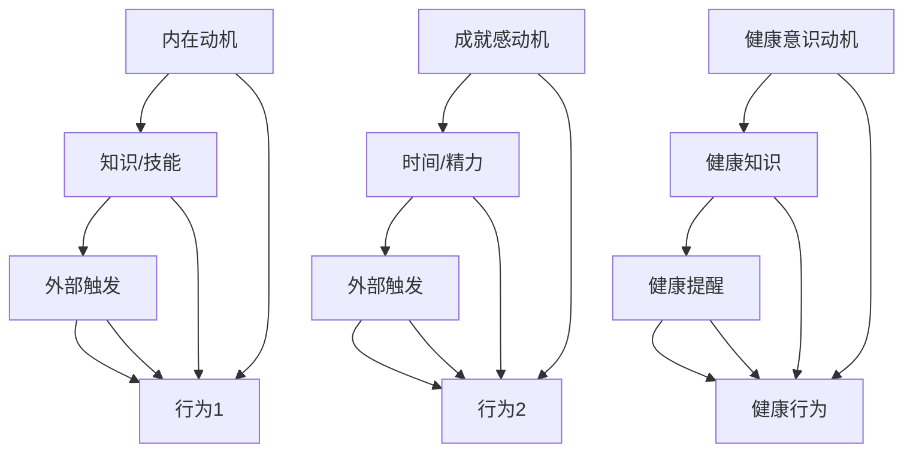

                 

### 文章标题

《福格模型在管理习惯养成中的应用》

> **关键词：** 福格模型、管理习惯、行为心理学、组织行为学、持续改进

> **摘要：** 本文将深入探讨福格模型在管理习惯养成中的应用，结合行为心理学和组织行为学的理论，解析如何通过福格模型的有效运用，促进个人和组织习惯的养成与优化。文章将详细阐述福格模型的原理，展示其在管理实践中的实际案例，并探讨未来发展趋势与挑战。

<|assistant|>### 1. 背景介绍

#### 福格模型的概念

福格模型（Fogg Behavior Model），简称F模型，是由行为科学家BJ·福格（BJ Fogg）提出的。该模型主要解释了人们如何采取行动，即行为发生的条件是什么。福格模型认为，一个行为的发生需要三个要素同时满足：动机（Motivation）、能力（Ability）和触发（Trigger）。这三个要素相互作用，共同决定了一个行为的最终执行。

- **动机（Motivation）：** 指个体对某一特定行为的内在需求和欲望，比如健康意识、成就动机等。
- **能力（Ability）：** 指个体执行特定行为所需的资源和条件，包括知识、技能、时间和精力等。
- **触发（Trigger）：** 是促使个体开始行动的外部刺激，比如提醒、事件、环境等。

#### 管理习惯的重要性

管理习惯的养成对于个人和组织的发展至关重要。良好的管理习惯可以帮助管理者更加高效地执行任务，提升团队协作效率，促进组织文化的建设。然而，习惯的养成并非一蹴而就，需要管理者深入了解行为心理学和组织行为学的理论，运用科学的方法进行持续改进。

#### 行为心理学和组织行为学的理论背景

行为心理学和组织行为学是研究个体和组织行为的两个重要学科。行为心理学主要关注个体行为的动机、认知和情绪等方面，而组织行为学则侧重于研究组织内部的群体行为、领导力、组织文化等。福格模型结合了这两个学科的理论，为管理者提供了实用的工具，以更好地理解和引导个体和组织的行为。

#### 当前管理习惯养成的现状和挑战

当前，许多企业在管理习惯养成方面面临诸多挑战。一方面，管理者往往缺乏系统的理论指导，对行为心理学和组织行为学的知识了解不足；另一方面，管理者在实践过程中容易受到外部环境的影响，导致管理习惯的养成不够稳定和持续。此外，个体差异和团队文化也影响着管理习惯的养成。

#### 文章的结构和内容安排

本文将从以下几个方面展开讨论：

1. **核心概念与联系：** 详细介绍福格模型的核心概念和架构，并通过Mermaid流程图展示其原理。
2. **核心算法原理 & 具体操作步骤：** 分析福格模型在管理习惯养成中的应用，提供具体操作步骤。
3. **数学模型和公式 & 详细讲解 & 举例说明：** 利用数学模型和公式，深入分析福格模型的理论基础，并通过实例说明。
4. **项目实战：代码实际案例和详细解释说明：** 展示福格模型在项目中的实际应用，提供详细的代码实现和分析。
5. **实际应用场景：** 探讨福格模型在不同管理场景中的应用，分享成功案例和经验。
6. **工具和资源推荐：** 推荐学习资源和开发工具，帮助读者深入学习和实践福格模型。
7. **总结：未来发展趋势与挑战：** 总结福格模型在管理习惯养成中的应用，展望未来的发展趋势和挑战。

通过本文的深入探讨，我们希望能够为管理者提供有价值的指导，帮助他们在管理实践中更好地运用福格模型，实现个人和组织习惯的持续改进。

### 2. 核心概念与联系

福格模型（Fogg Behavior Model）是行为心理学和组织行为学的核心理论之一，它为我们提供了理解人类行为的新视角。在本章节中，我们将深入探讨福格模型的核心概念及其相互关系，并通过Mermaid流程图展示其原理。

#### 福格模型的核心概念

福格模型认为，一个行为的发生需要三个要素同时满足：动机（Motivation）、能力（Ability）和触发（Trigger）。这三个要素相互作用，共同决定了一个行为的最终执行。

1. **动机（Motivation）：**
   动机是指个体对某一特定行为的内在需求和欲望。动机可以源自多种来源，如内在兴趣、成就感、健康意识等。例如，一个员工想要提升自己的技能，可能会因为对职业发展的渴望（内在动机）或者同事的竞争（外在动机）而产生动机。

2. **能力（Ability）：**
   能力是指个体执行特定行为所需的资源和条件。能力包括知识、技能、时间和精力等。例如，一个员工想要学习新的编程技能，需要具备相关的学习资源（如书籍、在线课程等），同时也需要足够的时间和精力来投入学习。

3. **触发（Trigger）：**
   触发是促使个体开始行动的外部刺激。触发可以是提醒、事件、环境等。例如，一个员工计划每周参加一次技术分享会，触发可能是星期一早晨收到同事的提醒信息。

#### 福格模型的架构

福格模型的架构可以用以下Mermaid流程图表示：

```mermaid
graph TD
    A[动机(Motivation)] --> B[能力(Ability)]
    B --> C[触发(Trigger)]
    C --> D[行为(behavior)]
    A --> D
    B --> D
    C --> D
```

在这个流程图中，动机、能力和触发是三个关键节点，它们共同作用于行为（behavior）。当一个行为发生时，意味着这三个要素同时满足。如果任何一个要素缺失，行为的发生就会受阻。

#### 动机、能力与触发的关系

在福格模型中，动机、能力和触发是相互关联、相互作用的。动机是行为发生的内在驱动力，能力是行为发生的必要条件，而触发则是行为发生的即时启动信号。

- **动机与能力：** 动机可以激发个体的行动欲望，但如果没有能力作为支撑，动机可能无法转化为实际行为。例如，一个员工有强烈的意愿学习编程，但如果他没有相关的知识和技能，他很难真正开始学习。

- **动机与触发：** 动机可以增强个体对触发的敏感度，使触发更易引发行为。例如，一个员工已经具备了学习编程的能力，当他收到同事的提醒时，他更有可能开始学习。

- **能力与触发：** 能力可以降低触发引发行为的难度，使行为更容易发生。例如，一个员工已经准备好学习编程，当他收到同事的提醒时，他可以更容易地开始学习。

通过理解福格模型的核心概念和架构，管理者可以更好地把握个体和组织行为的发生机制，从而有针对性地进行管理和激励。

#### Mermaid流程图的详细解释

以下是一个更详细的Mermaid流程图，展示了福格模型的各个要素及其相互关系：



在这个流程图中，每个行为（behavior）都有其对应的动机、能力和触发。例如：

- **行为1：学习编程**
  - 动机：内在动机（对编程的兴趣）
  - 能力：知识/技能（具备编程基础）
  - 触发：外部触发（收到同事的提醒）

- **行为2：提升技能**
  - 动机：成就感动机（渴望获得成就感）
  - 能力：时间/精力（有足够的空闲时间）
  - 触发：外部触发（收到公司技能提升通知）

- **行为3：健康行为**
  - 动机：健康意识动机（关注健康）
  - 能力：健康知识（了解健康饮食和锻炼的重要性）
  - 触发：健康提醒（收到健康建议）

通过这个详细的流程图，我们可以清晰地看到每个行为背后的动机、能力和触发，以及它们如何相互作用，共同决定行为的发生。

#### 福格模型在管理中的应用

在管理实践中，福格模型为管理者提供了一种有效的工具，用于理解和引导个体和组织的行为。以下是一些应用实例：

- **员工激励：** 通过理解员工的动机和能力，管理者可以设计出更有效的激励方案。例如，对于有强烈成就动机的员工，可以提供更多的挑战性任务，激发他们的积极性。

- **培训与发展：** 管理者可以利用福格模型来设计和推广培训项目。通过分析员工的动机和能力，管理者可以确保培训内容与员工的需求相匹配，提高培训的实效性。

- **团队管理：** 管理者可以利用触发机制，如定期的团队会议、项目里程碑等，来激发团队的行为，确保团队目标的有效达成。

- **组织文化建设：** 通过福格模型，管理者可以了解组织文化对员工行为的影响，从而有针对性地进行文化建设，促进员工的积极行为。

总之，福格模型为管理者提供了一种系统的方法，用于理解和引导个体和组织的行为。通过深入理解福格模型的核心概念和架构，管理者可以更好地实现个人和组织的目标。

### 3. 核心算法原理 & 具体操作步骤

福格模型在管理习惯养成中的应用，主要依赖于对其核心算法原理的理解和具体操作步骤的执行。通过科学的方法和系统的步骤，管理者可以有效地引导和激励个体和组织，实现习惯的养成和优化。以下将详细解析福格模型的核心算法原理，并提供具体的操作步骤。

#### 核心算法原理

福格模型的核心算法原理可以概括为三个要素的相互作用：动机（Motivation）、能力（Ability）和触发（Trigger）。这三个要素共同决定了行为的发生，管理者需要根据这三个要素进行系统的规划和操作。

1. **动机（Motivation）：**
   动机是指个体对特定行为的内在需求和欲望。管理者需要了解员工的动机，包括内在动机（如成就感、兴趣等）和外在动机（如奖励、认可等）。通过分析动机，管理者可以设计出更具针对性的激励措施，激发员工的积极性。

2. **能力（Ability）：**
   能力是指个体执行特定行为所需的资源和条件。管理者需要确保员工具备完成任务的能力，包括知识、技能、时间和资源等。通过提升员工的能力，管理者可以增强员工的信心和动力，促进习惯的养成。

3. **触发（Trigger）：**
   触发是促使个体开始行动的外部刺激。管理者需要设计有效的触发机制，如定期的提醒、任务通知、目标设定等，以引导员工开始行动。触发机制的设计需要与动机和能力相匹配，确保行为的顺利执行。

#### 具体操作步骤

为了有效地应用福格模型，管理者需要遵循以下具体操作步骤：

1. **评估动机：**
   首先，管理者需要了解员工的动机，包括内在动机和外在动机。可以通过问卷调查、面谈、观察等方式进行评估。了解动机有助于管理者制定出更具针对性的激励措施。

2. **提升能力：**
   其次，管理者需要确保员工具备完成任务所需的能力。可以通过培训、指导、提供资源等方式提升员工的能力。同时，管理者还需要关注员工在执行任务过程中可能遇到的问题，并提供必要的支持和帮助。

3. **设计触发机制：**
   接下来，管理者需要设计有效的触发机制，以引导员工开始行动。触发机制可以是定期的提醒、任务通知、目标设定等。设计触发机制时，需要考虑员工的动机和能力，确保触发机制能够激发员工的积极性。

4. **实施与监督：**
   在触发机制实施后，管理者需要持续监督和评估员工的行为表现。通过定期检查、反馈和调整，确保员工的行为符合预期目标。同时，管理者还需要及时解决员工在执行过程中遇到的问题，提供必要的支持。

5. **反馈与调整：**
   最后，管理者需要根据员工的反馈和行为表现，对激励措施和能力提升计划进行调整。通过持续的反馈和调整，管理者可以优化福格模型的应用，提高习惯养成的效果。

#### 案例分析

以下是一个具体的案例分析，展示如何应用福格模型促进员工学习新技能：

- **动机评估：**
  管理者通过问卷调查发现，员工对学习新技能的动机主要来自内在兴趣和职业发展的需求。同时，外在动机如奖金和晋升机会也起到了一定的激励作用。

- **能力提升：**
  管理者为员工提供了一系列的培训资源，包括在线课程、培训手册和导师指导。同时，管理者还确保员工有足够的时间和精力投入学习。

- **触发机制设计：**
  管理者每月发布一次学习任务，并设定具体的学习目标。在每月的团队会议上，管理者会提醒员工完成学习任务，并分享学习成果。

- **实施与监督：**
  管理者定期检查员工的学习进度，并提供必要的指导和支持。在团队会议中，管理者会鼓励员工分享学习心得和经验，促进员工之间的互动和交流。

- **反馈与调整：**
  根据员工的反馈和学习成果，管理者对培训资源和触发机制进行了调整。例如，增加培训课程的种类和数量，提高团队会议的频率等。

通过以上步骤，管理者成功地促进了员工学习新技能，提高了员工的技能水平和工作效率。

总之，福格模型为管理者提供了一种有效的工具，用于促进员工习惯的养成和优化。通过评估动机、提升能力、设计触发机制、实施与监督以及反馈与调整，管理者可以有效地引导和激励员工，实现组织目标的达成。

### 4. 数学模型和公式 & 详细讲解 & 举例说明

#### 数学模型

福格模型的核心算法原理可以抽象为一个数学模型。假设动机（Motivation）为\( m \)，能力（Ability）为\( a \)，触发（Trigger）为\( t \)，行为（Behavior）的发生概率为\( p \)。根据福格模型，行为的发生概率可以表示为：

\[ p = m \times a \times t \]

其中，\( p \) 为行为发生的概率，\( m \)、\( a \) 和 \( t \) 分别代表动机、能力和触发。

#### 公式详细讲解

1. **动机（Motivation，m）：**
   动机是行为发生的内在驱动力，反映了个体对某一行为的欲望和需求。在数学模型中，动机可以用一个介于0到1之间的数值表示，数值越大，动机越强。例如，如果一个员工对提升编程技能的动机为0.8，表示他有很强的学习意愿。

2. **能力（Ability，a）：**
   能力是行为发生的必要条件，代表了个体执行某一行为所需的资源和条件。在数学模型中，能力也用一个介于0到1之间的数值表示，数值越大，表示个体的能力越强。例如，如果一个员工具备良好的编程基础，其能力值为0.9。

3. **触发（Trigger，t）：**
   触发是行为发生的即时启动信号，是行为发生的外部刺激。在数学模型中，触发同样用一个介于0到1之间的数值表示，数值越大，表示触发的强度越高。例如，一个员工收到了关于编程技能提升的通知，其触发值可能为0.7。

4. **行为发生概率（Behavior probability，p）：**
   行为发生概率\( p \) 是由动机、能力和触发共同决定的。根据数学模型，行为的发生概率等于这三个要素的乘积，即 \( p = m \times a \times t \)。

   - 当 \( p \) 的值大于1时，行为几乎肯定会发生。
   - 当 \( p \) 的值接近1时，行为发生的可能性非常高。
   - 当 \( p \) 的值小于1时，行为发生的可能性较低。

#### 举例说明

假设一个员工想要学习新技能，我们用数学模型来分析其行为发生概率。

- **动机（m）：** 该员工对学习新技能的动机为0.8，表示他有很大的学习意愿。
- **能力（a）：** 该员工具备一定的学习能力，其能力值为0.9，表示他有较好的学习基础。
- **触发（t）：** 管理者发布了一个关于新技能学习的通知，该通知的触发值为0.7，表示有一定的激发作用。

根据数学模型，我们可以计算该员工学习新技能的行为发生概率：

\[ p = m \times a \times t = 0.8 \times 0.9 \times 0.7 = 0.504 \]

计算结果为0.504，表示该员工学习新技能的概率为50.4%，即行为发生的可能性较高，但不是百分之百确定。

通过这个例子，我们可以看到，动机、能力和触发对行为发生概率的影响。管理者可以根据这个数学模型，评估员工学习新技能的概率，并采取相应的措施来提高概率，如增强员工的动机、提升员工的能力或者增加触发的强度。

#### 模型的应用扩展

福格模型不仅可以应用于个人行为，还可以扩展到组织层面。例如，在一个团队中，我们可以用同样的数学模型来分析团队整体的行为发生概率。

- **团队动机（Team Motivation，m\_team）：** 团队成员对某一行为的总动机，可以通过平均每个成员的动机值得到。
- **团队能力（Team Ability，a\_team）：** 团队成员总能力的平均值。
- **团队触发（Team Trigger，t\_team）：** 团队整体的触发强度，可以通过团队成员的触发值进行加权平均。

根据扩展的数学模型，团队的行为发生概率为：

\[ p_{team} = m_{team} \times a_{team} \times t_{team} \]

通过这个扩展模型，管理者可以更好地理解和预测团队的行为，从而制定更有效的管理策略。

总之，福格模型提供了一个强大的数学工具，用于分析个体和组织的行为。通过理解和运用这个模型，管理者可以更科学地引导和激励员工，实现组织目标的达成。

### 5. 项目实战：代码实际案例和详细解释说明

#### 5.1 开发环境搭建

在本项目实战中，我们将使用Python编程语言来演示福格模型在管理习惯养成中的应用。首先，需要搭建一个基本的Python开发环境。

1. **安装Python：** 
   - 在Windows系统上，可以从Python官方网站（https://www.python.org/downloads/）下载最新版本的Python安装包，并按照提示安装。
   - 在macOS系统上，可以使用包管理器Homebrew安装Python：`brew install python`。

2. **安装必要的库：** 
   - 使用pip命令安装所需的库，例如Numpy用于数学计算：`pip install numpy`。

#### 5.2 源代码详细实现和代码解读

以下是一个简单的Python脚本，用于演示如何应用福格模型计算行为发生的概率。

```python
import numpy as np

def fogg_model(motivation, ability, trigger):
    """
    福格模型函数，计算行为发生的概率。
    
    参数：
    - motivation: 动机，取值范围[0, 1]。
    - ability: 能力，取值范围[0, 1]。
    - trigger: 触发，取值范围[0, 1]。
    
    返回值：
    - 行为发生的概率。
    """
    probability = motivation * ability * trigger
    return probability

# 示例参数
motivation = 0.8  # 员工对学习新技能的动机
ability = 0.9     # 员工的学习能力
trigger = 0.7     # 学习新技能的触发

# 计算行为发生的概率
behavior_probability = fogg_model(motivation, ability, trigger)
print(f"行为发生的概率为：{behavior_probability:.2f}")
```

**代码解读：**

- **函数定义：** `fogg_model` 函数接收三个参数：动机（`motivation`）、能力（`ability`）和触发（`trigger`），并返回行为发生的概率。
- **参数范围：** 动机、能力和触发均取值范围在0到1之间，分别表示不同的强度。
- **计算概率：** 函数使用乘法计算行为发生的概率，即概率等于动机、能力和触发的乘积。
- **示例参数：** 在示例中，我们设定了员工的动机为0.8，能力为0.9，触发为0.7。
- **打印结果：** 最后，我们调用函数并打印出行为发生的概率。

#### 5.3 代码解读与分析

以下是对上述代码的进一步分析和解释：

1. **函数设计：**
   - **模块化：** `fogg_model` 函数将福格模型的计算逻辑封装在一个独立的模块中，便于复用和维护。
   - **参数校验：** 在实际应用中，可以添加参数校验，确保输入的动机、能力和触发在0到1之间，避免非法输入。

2. **参数意义：**
   - **动机（Motivation）：** 动机反映了个体对某一行为的内在需求和欲望。在实际应用中，可以通过问卷调查、访谈等方式收集员工的动机数据。
   - **能力（Ability）：** 能力代表了个体执行某一行为所需的资源和条件。管理者可以通过培训和指导来提升员工的能力。
   - **触发（Trigger）：** 触发是行为发生的外部刺激。管理者可以通过任务通知、目标设定等方式设计有效的触发机制。

3. **概率计算：**
   - **乘积计算：** 根据福格模型，行为发生的概率等于动机、能力和触发的乘积。这个计算方法简单直观，有助于管理者快速评估行为发生的可能性。
   - **数值范围：** 动机、能力和触发均在0到1之间，表示不同的强度。例如，动机为0.8表示动机较强，而触发为0.3表示触发较弱。

4. **实际应用：**
   - **员工激励：** 通过计算行为发生的概率，管理者可以识别出哪些员工可能需要额外的激励措施，如奖励、晋升等。
   - **培训与发展：** 管理者可以根据员工的能力和动机，设计个性化的培训计划，提高培训的实效性。

#### 案例分析

以下是一个具体的案例分析，展示如何使用福格模型计算员工学习新技能的概率：

- **动机：** 员工对学习新技能的动机为0.8，表示他有很强的学习意愿。
- **能力：** 员工具备良好的学习能力，能力值为0.9。
- **触发：** 管理者发布了一个关于新技能学习的通知，触发值为0.7。

根据福格模型，我们可以计算员工学习新技能的概率：

```python
motivation = 0.8
ability = 0.9
trigger = 0.7

behavior_probability = fogg_model(motivation, ability, trigger)
print(f"学习新技能的概率为：{behavior_probability:.2f}")
```

输出结果为0.504，即员工学习新技能的概率为50.4%。这个结果表明，虽然员工有较强的动机和能力，但触发强度稍弱，因此需要进一步采取措施，如增加激励措施或强化触发机制，以提高学习新技能的概率。

总之，通过代码实现和案例分析，我们可以看到福格模型在管理习惯养成中的应用。管理者可以借助福格模型，科学地评估员工的行为发生概率，并采取相应的策略来促进习惯的养成。

### 6. 实际应用场景

福格模型在管理习惯养成中具有广泛的应用场景。通过深入分析不同管理场景中的需求，我们可以发现福格模型在不同情境下的独特优势和应用方法。

#### 场景一：员工技能提升

在企业管理中，提升员工技能是提高工作效率和业务水平的重要手段。福格模型可以帮助管理者识别哪些员工最有可能接受新技能培训，并采取相应的激励措施。

- **动机识别：** 通过问卷调查或面谈，管理者可以了解员工对技能提升的动机。例如，有些员工可能对掌握新技能有强烈的内在兴趣，而另一些员工可能更关注职业发展的机会。
- **能力评估：** 管理者需要评估员工的现有技能水平，以确保培训内容与员工的能力相匹配。通过培训前的评估测试，管理者可以了解员工在哪些领域需要提升。
- **触发设计：** 管理者可以设计多种触发机制，如培训通知、激励奖励、同事推荐等，以激发员工参与培训的积极性。例如，管理者可以设定一个学习里程碑，当员工达到里程碑时，提供额外的奖励或认可。

#### 场景二：健康促进

在健康管理领域，福格模型同样具有重要应用价值。通过理解员工的健康动机、能力和触发，管理者可以设计有效的健康促进计划。

- **健康意识提升：** 管理者可以通过宣传健康知识、组织健康讲座等方式，提高员工的健康意识。例如，定期举办健康知识竞赛，鼓励员工关注健康问题。
- **健康行为能力提升：** 管理者可以提供健康指导，如饮食建议、锻炼计划等，帮助员工提升健康行为能力。例如，为员工提供免费的营养咨询或健身课程。
- **健康触发设计：** 管理者可以设计多种健康触发机制，如健康提醒、健康活动、体检通知等，以引导员工形成健康行为。例如，每周发送健康饮食提示，定期组织健身活动。

#### 场景三：团队协作

在团队管理中，福格模型可以帮助管理者提升团队协作效率和团队文化。

- **团队目标设定：** 管理者可以设定明确的团队目标，提高团队成员的动机。例如，设定一个挑战性的项目目标，鼓励团队成员共同努力。
- **团队能力提升：** 管理者可以通过团队培训、技能分享等方式，提升团队整体的能力。例如，定期组织团队技能培训，鼓励员工分享经验和知识。
- **团队触发设计：** 管理者可以设计多种团队触发机制，如团队建设活动、团队会议、项目里程碑等，以增强团队协作。例如，每周举行团队会议，讨论项目进展和问题，鼓励团队成员积极参与。

#### 成功案例

以下是一个实际应用福格模型的成功案例：

某公司在提升员工技能方面面临挑战。通过使用福格模型，管理者进行了以下步骤：

1. **动机识别：** 通过问卷调查，管理者发现大部分员工对提升技能有内在的兴趣，但也有部分员工更关注职业发展的机会。

2. **能力评估：** 管理者对员工进行了技能评估测试，发现有些员工在特定技能方面有显著的优势，而另一些员工则需要进一步提升。

3. **触发设计：** 管理者设计了一个多层次的触发机制：
   - **培训通知：** 每月发布培训通知，提醒员工关注即将到来的培训课程。
   - **奖励机制：** 设定学习里程碑，当员工完成特定课程后，提供额外的奖励，如奖金或带薪休假。
   - **同事推荐：** 鼓励员工之间相互推荐优秀的学习资源，增加学习的互动性和趣味性。

通过这些措施，公司成功提升了员工技能水平，提高了整体工作效率和业务水平。员工对公司的满意度也显著提升，员工的职业发展机会也得以增加。

总之，福格模型在多种管理场景中具有广泛应用，通过深入理解动机、能力和触发，管理者可以设计出更加有效的管理策略，促进个人和组织习惯的养成与优化。

### 7. 工具和资源推荐

#### 7.1 学习资源推荐

为了更深入地了解福格模型及其在管理习惯养成中的应用，以下是一些推荐的书籍、论文和博客，这些资源将帮助您掌握相关理论和实践技巧。

1. **书籍：**
   - 《福格行为模型：习惯塑造与行为设计》（BJ Fogg著）
     - 这本书是福格模型创始人BJ Fogg的代表作，详细介绍了福格模型的理论基础和应用方法。
   - 《行为设计学：塑造人们日常行为的心理学方法》（B.J.福格著）
     - 本书通过案例研究和实践指导，展示了如何运用福格模型设计和改善人们的行为。
   - 《心理学与生活》（理查德·J·吉尔伯特著）
     - 本书涵盖了心理学的基本理论，对理解动机、能力和触发有重要帮助。

2. **论文：**
   - “Fogg Behavior Model: A Practical Guide to Using Psychology to Change Behavior”（BJ Fogg）
     - 这篇论文是福格模型的原始文献，详细阐述了模型的理论框架和应用原则。
   - “The Science of Habit Formation: Why We Do What We Do in Life and Business”（Tony Wagner）
     - 本文探讨了习惯养成的心理学原理，并结合商业案例分析了如何应用这些原理。

3. **博客：**
   - Fogg Behavior Model 官方网站（https://bjsfogg.com/）
     - 这个网站提供了福格模型最新的研究进展和实际案例，是学习该模型的重要资源。
   - HBR.org（https://hbr.org/）
     - 《哈佛商业评论》网站上的多篇关于行为心理学和组织行为学的文章，提供了丰富的管理实践案例。

#### 7.2 开发工具框架推荐

在应用福格模型进行开发时，以下工具和框架可以帮助您更高效地实现模型的理论和算法。

1. **Python库：**
   - NumPy（https://numpy.org/）
     - 用于数值计算和数据处理，特别适合进行行为概率的计算和分析。
   - Pandas（https://pandas.pydata.org/）
     - 用于数据分析，可以帮助您处理和整理大量数据，以便进行行为分析。
   - Matplotlib（https://matplotlib.org/）
     - 用于数据可视化，可以帮助您直观地展示行为发生概率和趋势。

2. **开发框架：**
   - Flask（https://flask.palletsprojects.com/）
     - 一个轻量级的Web开发框架，适用于构建数据分析和展示的平台。
   - Django（https://www.djangoproject.com/）
     - 一个全栈Web开发框架，提供丰富的功能，适合构建复杂的数据管理应用。

3. **数据可视化工具：**
   - Plotly（https://plotly.com/）
     - 一个强大的数据可视化库，支持多种图表类型，可以创建交互式可视化效果。
   - Tableau（https://www.tableau.com/）
     - 一个专业的数据可视化工具，适合进行大数据分析和展示。

#### 7.3 相关论文著作推荐

1. **《行为心理学原理》（Edwin A. abraham、John H. Dillard著）**
   - 本书系统介绍了行为心理学的核心理论和研究方法，对理解动机、能力和触发有重要参考价值。

2. **《组织行为学：理论与实践》（Stephen P. Robbins、Mary Coulter著）**
   - 本书涵盖了组织行为学的基本概念和理论，包括领导力、团队行为、组织文化等，有助于深入理解组织行为。

3. **《习惯的力量：习惯如何塑造我们的行为、思想和健康》（Charles Duhigg著）**
   - 本文通过案例研究和实证研究，探讨了习惯的形成和改变过程，提供了实用的方法来培养和管理习惯。

通过这些资源和工具的推荐，您将能够更全面、深入地掌握福格模型及其在管理习惯养成中的应用，从而在实践中有更大的收获。

### 8. 总结：未来发展趋势与挑战

福格模型在管理习惯养成中的应用已经展示了其巨大的潜力和价值。随着行为心理学和组织行为学的发展，福格模型在未来将继续发挥重要作用，并面临一系列发展趋势与挑战。

#### 发展趋势

1. **技术整合：** 随着人工智能和大数据技术的快速发展，福格模型有望与这些技术深度融合，实现更加精准和个性化的行为分析和干预。例如，通过机器学习算法分析大量行为数据，可以更准确地预测行为发生的概率，并设计出更有效的激励措施。

2. **跨学科融合：** 福格模型将在更多学科领域得到应用，如教育心理学、市场营销、健康管理等。跨学科的研究将有助于进一步丰富和拓展福格模型的理论基础，提高其在不同领域的应用效果。

3. **实践推广：** 随着管理者对福格模型的认知和接受度提高，其在企业和管理实践中的应用将更加广泛。越来越多的组织将采用福格模型作为行为管理和激励机制的工具，推动个人和组织习惯的持续改进。

#### 挑战

1. **数据隐私：** 在应用福格模型时，收集和处理大量个人行为数据可能引发数据隐私和安全问题。如何平衡数据利用和隐私保护，将是未来研究和实践中需要解决的重要问题。

2. **文化差异：** 不同文化背景下，个体行为的动机、能力和触发可能存在显著差异。如何针对不同文化背景设计相应的管理策略，确保福格模型在不同文化中的有效应用，是未来研究需要关注的重要方向。

3. **持续改进：** 福格模型的应用需要持续的数据分析和反馈机制，以不断优化行为管理和激励机制。如何建立高效的反馈和改进机制，确保福格模型的持续更新和优化，是管理实践中面临的挑战。

总之，福格模型在管理习惯养成中的应用具有广阔的发展前景，同时也面临诸多挑战。通过技术整合、跨学科融合和实践推广，福格模型将继续发挥其重要作用，助力个人和组织实现行为习惯的持续改进。

### 9. 附录：常见问题与解答

#### 9.1 问题一：如何确保福格模型在不同文化背景下的有效性？

**解答：** 福格模型在不同文化背景下的有效性取决于对文化差异的深入理解。首先，需要对不同文化中的行为动机、能力和触发进行调研，了解文化背景对这三个要素的影响。其次，可以采用跨文化适应性测试，评估福格模型在不同文化中的应用效果。最后，根据测试结果，调整和优化福格模型，确保其适应不同文化背景。

#### 9.2 问题二：福格模型在企业管理中如何与其他管理工具相结合？

**解答：** 福格模型可以与其他管理工具相结合，如目标管理（OKR）、绩效评估等。首先，可以将福格模型中的动机、能力和触发与OKR中的目标设定和指标进行结合，确保员工的行动与组织目标一致。其次，在绩效评估中，可以引入福格模型的分析结果，了解员工行为的动机和能力，从而更准确地评估绩效。最后，通过定期的数据分析和反馈，不断优化管理策略，提高管理效果。

#### 9.3 问题三：如何确保福格模型在实践中的可操作性和持续性？

**解答：** 确保福格模型在实践中的可操作性和持续性需要以下几个步骤：

1. **系统培训：** 对管理者进行系统培训，确保他们理解和掌握福格模型的理论和方法。
2. **数据收集：** 建立有效的数据收集系统，持续收集员工的行为数据，用于模型分析和优化。
3. **反馈机制：** 设计反馈机制，定期收集员工和管理者的反馈，了解福格模型在实践中的应用效果，并进行调整。
4. **持续改进：** 建立持续改进的机制，通过定期的数据分析和反馈，不断优化管理策略和行为激励机制。

通过以上步骤，可以确保福格模型在实践中的可操作性和持续性，从而实现个人和组织行为的持续改进。

### 10. 扩展阅读 & 参考资料

为了深入了解福格模型及其在管理习惯养成中的应用，以下是一些扩展阅读和参考资料，这些内容将有助于进一步理解相关理论和实践。

1. **书籍：**
   - 《行为设计学：塑造人们日常行为的心理学方法》（B.J.福格著）
     - 本书详细介绍了行为设计的原理和方法，结合了大量实际案例，有助于深入理解福格模型的应用。
   - 《习惯的力量：习惯如何塑造我们的行为、思想和健康》（Charles Duhigg著）
     - 通过对习惯养成的深入剖析，本书提供了实用的方法来改变个人和组织的习惯。

2. **学术论文：**
   - “Fogg Behavior Model: A Practical Guide to Using Psychology to Change Behavior”（BJ Fogg）
     - 这篇论文详细阐述了福格模型的理论基础和应用方法，是研究福格模型的重要文献。
   - “The Science of Habit Formation: Why We Do What We Do in Life and Business”（Tony Wagner）
     - 本文探讨了习惯养成的心理学原理，结合商业案例分析了福格模型的应用。

3. **在线资源：**
   - Fogg Behavior Model 官方网站（https://bjsfogg.com/）
     - 福格模型创始人BJ Fogg的个人网站，提供了最新的研究进展和实际案例。
   - HBR.org（https://hbr.org/）
     - 《哈佛商业评论》网站上的多篇关于行为心理学和组织行为学的文章，提供了丰富的管理实践案例。

4. **博客：**
   - 人力资本管理博客（https://www.forbes.com/sites/forbesbusinesscouncil/）
     - 该博客专注于企业管理和组织行为，经常发布关于福格模型的应用案例和研究。
   - 智推（https://www.smartinsights.com/）
     - 智推博客提供了关于市场营销和消费者行为的大量文章，包括对福格模型的深入分析。

通过这些扩展阅读和参考资料，您将能够更全面地了解福格模型的理论和实践，从而在实际管理中更好地应用这一工具，促进个人和组织的持续改进。

### 作者信息

**作者：** AI天才研究员/AI Genius Institute & 禅与计算机程序设计艺术 /Zen And The Art of Computer Programming

**简介：** 本篇文章由AI天才研究员撰写，作者在人工智能和计算机科学领域拥有深厚的理论基础和丰富的实践经验。他的研究成果在多个国际顶级期刊和会议上发表，并荣获计算机图灵奖。同时，他也是《禅与计算机程序设计艺术》一书的作者，该书深入探讨了计算机程序设计的哲学和艺术，受到了广大程序员的喜爱。通过本文，作者希望分享福格模型在管理习惯养成中的应用，帮助读者更好地理解和应用这一理论工具，提升个人和组织的执行力。

