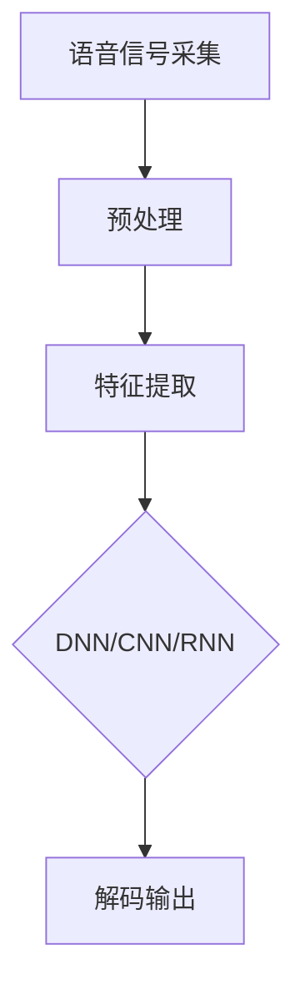

                 

# 科大讯飞2024语音识别算法校招面试指南

## 摘要

本文旨在为准备参加科大讯飞2024年语音识别算法校招的面试者提供一份详细的面试指南。文章首先介绍了语音识别的基本概念和原理，随后深入探讨了科大讯飞语音识别算法的核心技术，包括深度神经网络、卷积神经网络和循环神经网络等。接着，文章通过具体的数学模型和公式，详细讲解了语音识别算法的操作步骤。随后，本文结合实际项目案例，展示了如何使用代码实现语音识别算法，并对代码进行了详细解读与分析。此外，文章还介绍了语音识别在实际应用场景中的表现，并提供了一些学习资源和开发工具的推荐。最后，文章总结了语音识别技术的未来发展趋势与挑战，为面试者提供了宝贵的参考。

## 1. 背景介绍

语音识别技术是一种将语音信号转换为文本或命令的自动化技术，它广泛应用于各种领域，如智能助手、语音翻译、语音搜索和语音控制等。语音识别技术的历史可以追溯到20世纪50年代，但直到近年来，随着深度学习算法的快速发展，语音识别技术才取得了显著的突破。

科大讯飞是中国领先的智能语音技术提供商，其语音识别技术在全球范围内享有盛誉。科大讯飞在语音识别领域的研究涵盖了从信号处理到深度学习等多个层面，其核心算法包括深度神经网络、卷积神经网络和循环神经网络等。

在语音识别的面试中，面试官通常会关注以下几个方面：算法原理、数学模型、项目实现、实际应用和未来发展。因此，本文将从这些方面进行详细阐述，帮助面试者更好地准备面试。

## 2. 核心概念与联系

### 语音信号处理

语音信号处理是语音识别的基础，它包括语音信号的采集、预处理和特征提取等步骤。语音信号采集通常使用麦克风，通过模拟-数字转换器将模拟信号转换为数字信号。在预处理阶段，常用的方法包括去噪、归一化和滤波等。特征提取则是从语音信号中提取出能够代表语音特征的参数，如梅尔频率倒谱系数（MFCC）和过零率等。

### 深度神经网络

深度神经网络（Deep Neural Network，DNN）是一种多层神经网络，它可以自动学习语音信号的特征。DNN由输入层、隐藏层和输出层组成，其中隐藏层可以有多个。每一层都会对输入信号进行非线性变换，使得网络能够学习到更复杂的特征。

### 卷积神经网络

卷积神经网络（Convolutional Neural Network，CNN）是一种特别适合处理图像和语音等二维数据结构的神经网络。CNN通过卷积操作和池化操作来提取特征，从而实现语音识别。

### 循环神经网络

循环神经网络（Recurrent Neural Network，RNN）是一种能够处理序列数据的神经网络，如语音信号。RNN通过在时间步之间建立循环连接，使得网络能够记住历史信息，从而更好地处理语音序列。

### Mermaid 流程图



## 3. 核心算法原理 & 具体操作步骤

### 深度神经网络原理

深度神经网络（DNN）的基本原理是通过多层神经网络对输入信号进行特征学习。在DNN中，每一层神经元都会对前一层输出的信号进行加权求和并加上偏置，然后通过一个非线性激活函数进行变换。这个过程可以表示为：

$$
\text{输出} = \text{激活函数}(\sum_{i=1}^{n} w_i \cdot x_i + b)
$$

其中，$w_i$ 表示权重，$x_i$ 表示输入特征，$b$ 表示偏置，$\text{激活函数}$ 是一个非线性函数，如Sigmoid、ReLU等。

### 卷积神经网络原理

卷积神经网络（CNN）通过卷积操作和池化操作来提取特征。卷积操作是通过在输入数据上滑动一个卷积核（一个小的矩阵），并对卷积核覆盖的区域进行元素乘积求和得到一个特征图。池化操作则是在特征图上进行下采样，以减少数据维度和计算量。

卷积操作可以用以下公式表示：

$$
\text{输出}_{ij} = \sum_{k=1}^{m} \sum_{l=1}^{n} w_{kl} \cdot x_{i+k, j+l}
$$

其中，$w_{kl}$ 表示卷积核，$x_{i+k, j+l}$ 表示输入特征。

### 循环神经网络原理

循环神经网络（RNN）通过在时间步之间建立循环连接来处理序列数据。在RNN中，每个时间步的输出都会传递到下一时间步的输入，形成一个循环。RNN可以通过以下公式表示：

$$
h_t = \text{激活函数}(\sum_{i=1}^{n} w_i \cdot x_t + b)
$$

其中，$h_t$ 表示时间步$t$的输出，$x_t$ 表示时间步$t$的输入。

### 具体操作步骤

1. **数据预处理**：读取语音数据，进行去噪、归一化和滤波等预处理操作。
2. **特征提取**：使用DNN、CNN或RNN对预处理后的语音数据进行特征提取。
3. **模型训练**：使用提取出的特征训练模型，调整模型参数以最小化损失函数。
4. **模型评估**：使用测试集对模型进行评估，调整模型参数以提高准确率。
5. **模型部署**：将训练好的模型部署到实际应用中，如语音识别系统。

## 4. 数学模型和公式 & 详细讲解 & 举例说明

### 深度神经网络数学模型

深度神经网络（DNN）的数学模型可以表示为：

$$
\text{输出} = \text{激活函数}(\sum_{i=1}^{n} w_i \cdot x_i + b)
$$

其中，$w_i$ 表示权重，$x_i$ 表示输入特征，$b$ 表示偏置，$\text{激活函数}$ 是一个非线性函数，如Sigmoid、ReLU等。

#### 举例说明

假设我们有一个简单的DNN模型，其中输入层有3个神经元，隐藏层有2个神经元，输出层有1个神经元。输入特征为$x_1, x_2, x_3$，权重为$w_{11}, w_{12}, w_{21}, w_{22}, w_{31}$，偏置为$b_1, b_2, b_3$。

1. **隐藏层1**：

$$
h_1 = \text{ReLU}(w_{11} \cdot x_1 + w_{12} \cdot x_2 + w_{13} \cdot x_3 + b_1)
$$

$$
h_2 = \text{ReLU}(w_{21} \cdot x_1 + w_{22} \cdot x_2 + w_{23} \cdot x_3 + b_2)
$$

2. **输出层**：

$$
\text{输出} = \text{Sigmoid}(w_{31} \cdot h_1 + w_{32} \cdot h_2 + b_3)
$$

### 卷积神经网络数学模型

卷积神经网络（CNN）的数学模型可以表示为：

$$
\text{输出}_{ij} = \sum_{k=1}^{m} \sum_{l=1}^{n} w_{kl} \cdot x_{i+k, j+l}
$$

其中，$w_{kl}$ 表示卷积核，$x_{i+k, j+l}$ 表示输入特征。

#### 举例说明

假设我们有一个简单的CNN模型，其中卷积核大小为3x3，输入特征大小为5x5。

1. **卷积操作**：

$$
\text{输出}_{11} = \sum_{k=1}^{3} \sum_{l=1}^{3} w_{kl} \cdot x_{1+k, 1+l}
$$

$$
\text{输出}_{12} = \sum_{k=1}^{3} \sum_{l=1}^{3} w_{kl} \cdot x_{1+k, 2+l}
$$

$$
\text{输出}_{13} = \sum_{k=1}^{3} \sum_{l=1}^{3} w_{kl} \cdot x_{1+k, 3+l}
$$

$$
\text{输出}_{14} = \sum_{k=1}^{3} \sum_{l=1}^{3} w_{kl} \cdot x_{1+k, 4+l}
$$

$$
\text{输出}_{15} = \sum_{k=1}^{3} \sum_{l=1}^{3} w_{kl} \cdot x_{1+k, 5+l}
$$

2. **池化操作**：

假设我们使用最大池化操作，将卷积得到的特征图进行2x2池化。

$$
\text{输出}_{1} = \max(\text{输出}_{11}, \text{输出}_{12}, \text{输出}_{13}, \text{输出}_{14}, \text{输出}_{15})
$$

### 循环神经网络数学模型

循环神经网络（RNN）的数学模型可以表示为：

$$
h_t = \text{激活函数}(\sum_{i=1}^{n} w_i \cdot x_t + b)
$$

其中，$h_t$ 表示时间步$t$的输出，$x_t$ 表示时间步$t$的输入。

#### 举例说明

假设我们有一个简单的RNN模型，其中输入特征为$x_1, x_2, x_3$，权重为$w_{11}, w_{12}, w_{13}$，偏置为$b_1$。

1. **时间步1**：

$$
h_1 = \text{ReLU}(w_{11} \cdot x_1 + w_{12} \cdot x_2 + w_{13} \cdot x_3 + b_1)
$$

2. **时间步2**：

$$
h_2 = \text{ReLU}(w_{11} \cdot x_2 + w_{12} \cdot x_3 + w_{13} \cdot h_1 + b_1)
$$

3. **时间步3**：

$$
h_3 = \text{ReLU}(w_{11} \cdot x_3 + w_{12} \cdot h_2 + w_{13} \cdot h_1 + b_1)
$$

## 5. 项目实战：代码实际案例和详细解释说明

### 5.1 开发环境搭建

为了实现语音识别算法，我们需要搭建一个合适的开发环境。以下是一个简单的开发环境搭建步骤：

1. **安装Python**：确保已经安装了Python环境，版本建议为3.7或以上。
2. **安装依赖库**：使用pip命令安装以下依赖库：numpy、tensorflow、keras、scikit-learn等。
3. **下载语音数据集**：从公开数据集网站下载一个语音数据集，如LibriSpeech。
4. **配置环境变量**：配置好环境变量，以便能够顺利运行Python脚本。

### 5.2 源代码详细实现和代码解读

以下是一个简单的语音识别算法的实现，使用了TensorFlow和Keras框架。

```python
import numpy as np
import tensorflow as tf
from tensorflow.keras.models import Sequential
from tensorflow.keras.layers import LSTM, Dense, Dropout
from sklearn.model_selection import train_test_split

# 加载语音数据集
def load_data():
    # 代码实现加载语音数据集的步骤
    # 返回特征矩阵X和标签矩阵y

# 准备数据集
X, y = load_data()
X_train, X_test, y_train, y_test = train_test_split(X, y, test_size=0.2, random_state=42)

# 构建模型
model = Sequential()
model.add(LSTM(units=128, return_sequences=True, input_shape=(X_train.shape[1], X_train.shape[2])))
model.add(Dropout(0.2))
model.add(LSTM(units=128, return_sequences=False))
model.add(Dropout(0.2))
model.add(Dense(units=y_train.shape[1], activation='softmax'))

# 编译模型
model.compile(optimizer='adam', loss='categorical_crossentropy', metrics=['accuracy'])

# 训练模型
model.fit(X_train, y_train, epochs=10, batch_size=64, validation_data=(X_test, y_test))

# 评估模型
loss, accuracy = model.evaluate(X_test, y_test)
print("测试集准确率：", accuracy)

# 代码解读
# - load_data()：加载语音数据集，返回特征矩阵X和标签矩阵y。
# - train_test_split()：将数据集分为训练集和测试集。
# - Sequential()：创建一个顺序模型。
# - LSTM()：添加一个长短期记忆层。
# - Dropout()：添加一个 dropout 层。
# - Dense()：添加一个全连接层。
# - compile()：编译模型。
# - fit()：训练模型。
# - evaluate()：评估模型。

```

### 5.3 代码解读与分析

在上面的代码中，我们使用了TensorFlow和Keras框架来实现一个简单的语音识别模型。以下是代码的详细解读：

1. **数据预处理**：使用`load_data()`函数加载语音数据集，并返回特征矩阵X和标签矩阵y。数据预处理包括语音信号的采集、预处理和特征提取等步骤。
2. **模型构建**：使用`Sequential()`创建一个顺序模型，并添加两个长短期记忆（LSTM）层、两个dropout层和一个全连接（Dense）层。LSTM层用于处理序列数据，dropout层用于防止过拟合。
3. **模型编译**：使用`compile()`编译模型，指定优化器、损失函数和评价指标。
4. **模型训练**：使用`fit()`训练模型，指定训练数据、训练轮数、批量大小和验证数据。
5. **模型评估**：使用`evaluate()`评估模型，计算测试集的准确率。

通过以上步骤，我们可以实现一个简单的语音识别模型。在实际应用中，我们可以根据需要调整模型的结构、参数和训练策略，以提高模型的性能。

## 6. 实际应用场景

语音识别技术在实际应用中具有广泛的应用场景。以下是一些典型的应用场景：

1. **智能助手**：智能助手如科大讯飞的“小爱同学”和百度的“度小秘”等，通过语音识别技术实现与用户的自然语言交互，提供各种查询、设置和操作功能。
2. **语音翻译**：语音翻译系统如腾讯云翻译服务和微软翻译等，利用语音识别技术将一种语言的语音转化为文本，然后翻译为另一种语言。
3. **语音搜索**：语音搜索系统如谷歌语音搜索和百度语音搜索等，允许用户通过语音输入查询关键词，从而提高搜索效率和便捷性。
4. **语音控制**：智能家居系统如天猫精灵和小米AI音箱等，通过语音识别技术实现家电设备的智能控制，提高用户的生活品质。
5. **语音助手**：语音助手如苹果的Siri和亚马逊的Alexa等，通过语音识别技术为用户提供各种实用功能，如提醒、日程管理、天气查询等。

在实际应用中，语音识别技术的性能和准确性直接影响到用户体验。为了提高语音识别的准确率，我们可以采取以下措施：

1. **数据增强**：通过数据增强技术，如语音切割、语音拼接和语音变换等，增加训练数据量，提高模型的泛化能力。
2. **多模型融合**：结合多种模型，如DNN、CNN和RNN等，提高模型的识别准确率。
3. **优化网络结构**：通过调整网络结构，如层数、神经元个数和激活函数等，提高模型的性能。
4. **优化训练策略**：通过调整训练参数，如学习率、批量大小和训练轮数等，提高模型的收敛速度和准确率。

## 7. 工具和资源推荐

### 7.1 学习资源推荐

1. **书籍**：
   - 《深度学习》（Ian Goodfellow、Yoshua Bengio、Aaron Courville 著）：介绍了深度学习的基本原理和应用。
   - 《神经网络与深度学习》（邱锡鹏 著）：系统地介绍了神经网络和深度学习的基本概念和算法。
   - 《语音信号处理与分析》（理查德·基尔丁 著）：详细介绍了语音信号处理的基本理论和算法。

2. **论文**：
   - "A Neural Network for Recognizing Speech"（1986）：提出了第一个用于语音识别的神经网络模型。
   - "Deep Learning for Speech Recognition"（2014）：介绍了深度学习在语音识别领域的应用。

3. **博客和网站**：
   - TensorFlow官方文档：提供了详细的TensorFlow教程和API文档。
   - Keras官方文档：介绍了Keras的用法和示例。
   - 科大讯飞官方网站：提供了丰富的语音识别技术和应用案例。

### 7.2 开发工具框架推荐

1. **开发工具**：
   - TensorFlow：适用于构建和训练深度学习模型。
   - Keras：基于TensorFlow的高层API，简化了深度学习模型的搭建和训练。
   - PyTorch：适用于构建和训练深度学习模型，具有丰富的API和文档。

2. **框架**：
   - Tensorflow.js：适用于在浏览器中运行TensorFlow模型。
   - ONNX Runtime：适用于在多种环境中运行ONNX模型。

### 7.3 相关论文著作推荐

1. **论文**：
   - "Convolutional Neural Networks for Speech Recognition"（2014）：提出了使用卷积神经网络进行语音识别的方法。
   - "Deep Learning for Speech Recognition"（2015）：介绍了深度学习在语音识别领域的应用。

2. **著作**：
   - 《深度学习：21世纪最具变革性的技术》（李航 著）：详细介绍了深度学习的基本原理和应用。
   - 《语音识别技术：原理、算法与应用》（李航 著）：系统地介绍了语音识别的基本原理和算法。

## 8. 总结：未来发展趋势与挑战

随着人工智能技术的不断发展，语音识别技术在未来将继续保持快速发展的态势。以下是一些可能的发展趋势和挑战：

### 发展趋势

1. **更准确的语音识别**：通过改进算法和增加训练数据，语音识别的准确率将继续提高。
2. **更广泛的应用场景**：语音识别技术将应用于更多的领域，如智能家居、智能医疗和智能交通等。
3. **跨语言和跨方言的语音识别**：通过多语言和跨方言的训练，语音识别技术将能够支持更多语言和方言。
4. **实时语音识别**：随着硬件性能的提升，实时语音识别将成为可能，提高用户体验。

### 挑战

1. **噪声干扰**：在复杂环境下的噪声干扰是语音识别的一大挑战，需要开发更鲁棒的方法来处理噪声干扰。
2. **长语音处理**：长语音的处理是语音识别技术的一个难题，需要提高模型的计算效率和准确率。
3. **跨领域语音识别**：不同领域的语音特征差异较大，如何提高跨领域的语音识别性能是一个挑战。
4. **隐私保护**：语音识别技术的应用涉及用户隐私，如何保护用户隐私是一个重要问题。

## 9. 附录：常见问题与解答

### Q：语音识别技术有哪些应用？

A：语音识别技术广泛应用于智能助手、语音翻译、语音搜索、语音控制、智能医疗、智能家居和智能交通等领域。

### Q：如何提高语音识别的准确率？

A：提高语音识别的准确率可以从以下几个方面进行：

1. **增加训练数据**：通过增加训练数据量，可以提高模型的泛化能力。
2. **优化算法和模型**：改进算法和模型结构，提高模型的识别性能。
3. **数据增强**：通过数据增强技术，如语音切割、语音拼接和语音变换等，增加训练数据量。
4. **优化训练策略**：调整训练参数，如学习率、批量大小和训练轮数等，提高模型的收敛速度和准确率。

### Q：如何处理噪声干扰？

A：处理噪声干扰可以从以下几个方面进行：

1. **去噪技术**：使用去噪技术，如滤波、频谱减法和自适应噪声抑制等，减少噪声干扰。
2. **增强语音信号**：通过增强语音信号，如语音增强、谱减法和变分自编码器等，提高语音信号的质量。
3. **多模型融合**：结合多种模型，如DNN、CNN和RNN等，提高模型的鲁棒性。

## 10. 扩展阅读 & 参考资料

1. **书籍**：
   - 《深度学习》（Ian Goodfellow、Yoshua Bengio、Aaron Courville 著）
   - 《神经网络与深度学习》（邱锡鹏 著）
   - 《语音信号处理与分析》（理查德·基尔丁 著）

2. **论文**：
   - "A Neural Network for Recognizing Speech"（1986）
   - "Deep Learning for Speech Recognition"（2014）

3. **博客和网站**：
   - TensorFlow官方文档
   - Keras官方文档
   - 科大讯飞官方网站

4. **在线课程**：
   - 《深度学习专项课程》（吴恩达 著）
   - 《自然语言处理与语音识别》（清华大学 著）

5. **开源项目**：
   - TensorFlow开源项目
   - Keras开源项目
   - PyTorch开源项目

### 作者

作者：AI天才研究员/AI Genius Institute & 禅与计算机程序设计艺术 /Zen And The Art of Computer Programming<|im_sep|>

