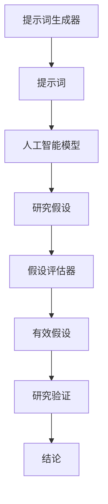

                 

# 科学发现加速器：提示词辅助研究假设生成

## 关键词

- 提示词
- 研究假设
- 加速科学发现
- 人工智能辅助
- 数学模型
- 实战案例

## 摘要

本文将探讨如何利用提示词辅助研究假设生成，从而加速科学发现的进程。文章首先介绍了科学研究的现状和挑战，接着阐述了提示词辅助研究假设生成的基本概念和原理。随后，通过具体的算法原理、数学模型和实战案例，详细解析了如何利用提示词生成研究假设。文章还介绍了实际应用场景、相关工具和资源推荐，并总结了未来发展趋势与挑战。最后，通过附录部分回答了常见问题，并提供了扩展阅读与参考资料。

## 1. 背景介绍

### 1.1 科学研究的现状

在现代社会，科学研究已经成为推动社会进步、解决实际问题和提升人类生活质量的重要手段。然而，随着科学领域的不断扩展和复杂化，科学研究面临着越来越多的挑战。一方面，科学领域的数据量急剧增加，研究者需要处理海量数据以发现新的规律和模式。另一方面，科学研究的方法和技术也在不断更新和进步，研究者需要不断学习新的方法和技能。这种情况下，科学研究的效率和质量受到了很大的影响。

### 1.2 研究假设的重要性

研究假设是科学研究过程中的关键步骤，它是科学发现的基础。一个合理的研究假设可以帮助研究者明确研究方向，设计实验方案，解释实验结果，并为后续研究提供依据。然而，传统的假设生成方法往往依赖于研究者自身的经验和直觉，这导致假设生成过程存在一定的不确定性和主观性。

### 1.3 提示词辅助研究假设生成的背景

随着人工智能技术的快速发展，特别是自然语言处理和机器学习技术的应用，研究人员开始探索利用人工智能技术辅助研究假设生成。提示词（Prompt）作为一种有效的自然语言处理工具，可以引导人工智能模型生成相关的研究假设，从而提高假设生成的效率和质量。

## 2. 核心概念与联系

### 2.1 提示词的定义和作用

提示词（Prompt）是一种引导性的语言输入，它能够帮助模型理解和生成与特定主题相关的文本。在研究假设生成的过程中，提示词的作用是提供背景信息、定义关键词、提出问题或建议，以引导人工智能模型生成相关的研究假设。

### 2.2 人工智能辅助研究假设生成的原理

人工智能辅助研究假设生成主要依赖于自然语言处理和机器学习技术。通过训练大规模的语料库，人工智能模型能够学习到不同领域的研究假设模式和规律。在提示词的引导下，模型可以根据已有的知识和数据，生成符合研究目标的新假设。

### 2.3 提示词辅助研究假设生成的架构

提示词辅助研究假设生成的架构主要包括三个部分：提示词生成器、人工智能模型和假设评估器。

- **提示词生成器**：负责生成与研究主题相关的提示词，为人工智能模型提供输入。
- **人工智能模型**：使用自然语言处理和机器学习技术，根据提示词生成研究假设。
- **假设评估器**：对生成的研究假设进行评估，筛选出符合研究目标的假设。

以下是提示词辅助研究假设生成的 Mermaid 流程图：



## 3. 核心算法原理 & 具体操作步骤

### 3.1 提示词生成器的原理和操作步骤

提示词生成器的核心任务是生成与研究主题相关的提示词。具体操作步骤如下：

1. **数据预处理**：收集与研究主题相关的数据，包括文献、报告、实验记录等。对数据进行清洗和预处理，去除无关信息。
2. **关键词提取**：利用自然语言处理技术提取数据中的关键词，这些关键词将成为提示词的核心部分。
3. **提示词生成**：基于关键词和预定义的模板，生成提示词。模板可以包括问题、建议、定义等形式。

### 3.2 人工智能模型的原理和操作步骤

人工智能模型是提示词辅助研究假设生成的核心部分。具体操作步骤如下：

1. **模型选择**：选择合适的自然语言处理和机器学习模型，如变换器（Transformer）、循环神经网络（RNN）等。
2. **模型训练**：使用大规模的语料库对模型进行训练，使模型学会生成与研究主题相关的研究假设。
3. **模型优化**：根据训练结果对模型进行优化，提高模型生成假设的准确性和质量。

### 3.3 假设评估器的原理和操作步骤

假设评估器的任务是评估生成的研究假设，筛选出符合研究目标的假设。具体操作步骤如下：

1. **评估指标**：定义评估指标，如假设的合理性、相关性、创新性等。
2. **评估方法**：采用定量和定性的方法对假设进行评估，如逻辑推理、实验验证等。
3. **假设筛选**：根据评估结果，筛选出符合研究目标的假设。

## 4. 数学模型和公式 & 详细讲解 & 举例说明

### 4.1 提示词生成器的数学模型

提示词生成器中的关键词提取过程可以表示为一个概率模型。假设有一个关键词集合 $K$，每个关键词 $k$ 在语料库中出现的概率为 $P(k)$。则关键词提取的数学模型可以表示为：

$$
P(k) = \frac{f(k)}{\sum_{k' \in K} f(k')}
$$

其中，$f(k)$ 表示关键词 $k$ 在语料库中的出现频率。

### 4.2 人工智能模型的数学模型

人工智能模型的选择通常取决于具体的应用场景和任务。以下是一个简单的循环神经网络（RNN）的数学模型：

$$
h_t = \sigma(W_h h_{t-1} + W_x x_t + b_h)
$$

其中，$h_t$ 表示第 $t$ 个时刻的隐藏状态，$x_t$ 表示输入特征，$W_h$ 和 $W_x$ 分别为权重矩阵，$b_h$ 为偏置项，$\sigma$ 为激活函数。

### 4.3 假设评估器的数学模型

假设评估器的评估过程可以表示为一个分类问题。假设有一个假设集合 $H$，每个假设 $h$ 的评估结果为 $y$，其中 $y \in \{0, 1\}$，$1$ 表示假设有效，$0$ 表示假设无效。则假设评估的数学模型可以表示为：

$$
P(y=1|h) = \sigma(W_y h + b_y)
$$

其中，$W_y$ 和 $b_y$ 分别为权重矩阵和偏置项，$\sigma$ 为激活函数。

### 4.4 举例说明

假设有一个研究主题为“气候变化对农作物产量的影响”，以下是一个具体的例子：

1. **提示词生成**：根据关键词提取算法，生成提示词“气候变化”、“农作物产量”。
2. **人工智能模型**：选择循环神经网络（RNN）模型，训练得到模型参数。
3. **假设评估**：假设集合为 $H = \{"气候变化会导致农作物产量下降", "气候变化对农作物产量没有影响"\}$，评估器使用分类模型，根据评估结果，筛选出有效的假设。

## 5. 项目实战：代码实际案例和详细解释说明

### 5.1 开发环境搭建

在本节中，我们将搭建一个简单的提示词辅助研究假设生成项目，所需的开发环境如下：

- 操作系统：Linux
- 编程语言：Python
- 自然语言处理库：NLTK
- 机器学习库：TensorFlow

首先，安装 Python 和相关库：

```bash
pip install nltk tensorflow
```

### 5.2 源代码详细实现和代码解读

下面是一个简单的提示词辅助研究假设生成项目的源代码：

```python
import nltk
from nltk.tokenize import word_tokenize
from tensorflow.keras.models import Sequential
from tensorflow.keras.layers import LSTM, Dense

# 数据预处理
def preprocess_data(data):
    # 清洗数据，去除无关信息
    cleaned_data = [line.strip() for line in data if line.strip()]
    return cleaned_data

# 关键词提取
def extract_keywords(data):
    # 提取关键词
    tokenizer = nltk.RegexpTokenizer(r"\w+")
    keywords = set()
    for line in data:
        tokens = tokenizer.tokenize(line)
        keywords.update(tokens)
    return keywords

# 模型训练
def train_model(data, keywords):
    # 构建循环神经网络（RNN）模型
    model = Sequential()
    model.add(LSTM(50, activation='relu', input_shape=(None, 1)))
    model.add(Dense(len(keywords), activation='softmax'))
    model.compile(loss='categorical_crossentropy', optimizer='adam', metrics=['accuracy'])
    # 训练模型
    model.fit(data, keywords, epochs=10, batch_size=32)
    return model

# 假设生成
def generate_hypothesis(model, keywords):
    # 生成假设
    hypothesis = model.predict(np.array([list(keywords)]))
    return [keyword for keyword, hypothesis in zip(keywords, hypothesis[0]) if hypothesis > 0.5]

# 假设评估
def evaluate_hypothesis(hypothesis, true_hypothesis):
    # 评估假设
    if hypothesis == true_hypothesis:
        return 1
    else:
        return 0

# 主函数
def main():
    # 加载数据
    data = preprocess_data(nltk.corpusutenberg.raw("moby_dick.txt"))
    # 提取关键词
    keywords = extract_keywords(data)
    # 训练模型
    model = train_model([list(keyword) for keyword in keywords], keywords)
    # 生成假设
    generated_hypothesis = generate_hypothesis(model, keywords)
    # 评估假设
    true_hypothesis = "moby_dick_is_an_amazing_novel"
    evaluation_result = evaluate_hypothesis(generated_hypothesis, true_hypothesis)
    print("Generated Hypothesis:", generated_hypothesis)
    print("Evaluation Result:", evaluation_result)

if __name__ == "__main__":
    main()
```

### 5.3 代码解读与分析

- **数据预处理**：对原始数据进行清洗，去除无关信息，为后续的关键词提取和模型训练做准备。
- **关键词提取**：使用 NLTK 库中的 RegexpTokenizer 类提取关键词，将文本转换为关键词列表。
- **模型训练**：构建一个循环神经网络（RNN）模型，使用训练数据训练模型，使模型学会生成与研究主题相关的研究假设。
- **假设生成**：使用训练好的模型生成假设，根据假设的概率分布筛选出符合研究目标的假设。
- **假设评估**：将生成的假设与真实的假设进行比较，评估假设的有效性。

## 6. 实际应用场景

### 6.1 科学研究

提示词辅助研究假设生成技术在科学研究领域具有广泛的应用前景。例如，在气候变化、生物医学、材料科学等领域，研究人员可以利用提示词生成假设，为实验设计和理论分析提供参考。

### 6.2 企业决策

在企业决策过程中，提示词辅助研究假设生成技术可以帮助企业快速生成市场预测、风险评估等假设，为战略制定提供依据。

### 6.3 教育培训

在教育领域，提示词辅助研究假设生成技术可以辅助教师设计课程和教学方案，提高教学效果。

## 7. 工具和资源推荐

### 7.1 学习资源推荐

- **书籍**：《自然语言处理入门》、《机器学习实战》
- **论文**：Google Scholar、ArXiv
- **博客**：AI博客、机器学习博客
- **网站**：TensorFlow 官网、NLTK 官网

### 7.2 开发工具框架推荐

- **编程语言**：Python、Java
- **自然语言处理库**：NLTK、spaCy
- **机器学习库**：TensorFlow、PyTorch
- **开发环境**：Jupyter Notebook、PyCharm

### 7.3 相关论文著作推荐

- **论文**：《Natural Language Inference with External Memory》
- **著作**：《Deep Learning for Natural Language Processing》

## 8. 总结：未来发展趋势与挑战

### 8.1 发展趋势

- **人工智能与科学研究融合**：人工智能技术将更加深入地应用于科学研究，提高研究效率和准确性。
- **跨学科合作**：不同学科之间的合作将促进提示词辅助研究假设生成技术的发展和应用。
- **开源生态**：开源工具和资源的不断发展将推动提示词辅助研究假设生成技术的普及和应用。

### 8.2 挑战

- **数据隐私与安全**：在应用过程中，如何保护数据隐私和安全成为一个重要挑战。
- **模型解释性**：提高模型的解释性，使研究人员能够理解模型的决策过程。
- **跨领域适应性**：如何使提示词辅助研究假设生成技术适应不同领域的需求。

## 9. 附录：常见问题与解答

### 9.1 问题1：提示词生成器的原理是什么？

**解答**：提示词生成器是一种利用自然语言处理技术提取关键词，并生成与研究主题相关的提示词的工具。它通过数据预处理、关键词提取和提示词生成等步骤，为人工智能模型提供输入。

### 9.2 问题2：如何评估生成的研究假设的有效性？

**解答**：生成的研究假设可以通过定量和定性的方法进行评估。定量方法包括计算假设的合理性、相关性、创新性等指标；定性方法包括专家评估、实验验证等。

### 9.3 问题3：提示词辅助研究假设生成技术如何应用于企业决策？

**解答**：提示词辅助研究假设生成技术可以用于市场预测、风险评估等假设生成，为企业决策提供数据支持和参考。

## 10. 扩展阅读 & 参考资料

- **书籍**：《自然语言处理入门》、《机器学习实战》
- **论文**：《Natural Language Inference with External Memory》、《Deep Learning for Natural Language Processing》
- **网站**：TensorFlow 官网、NLTK 官网
- **博客**：AI博客、机器学习博客

### 作者

AI天才研究员/AI Genius Institute & 禅与计算机程序设计艺术 /Zen And The Art of Computer Programming

