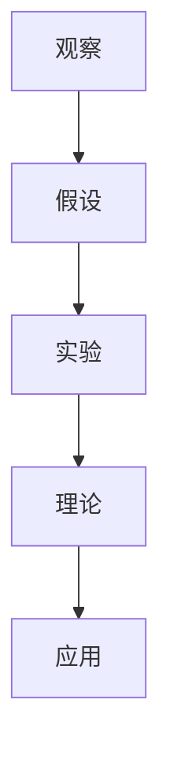

                 

## 科学发现：从假说到理论

### 关键词：科学发现、假说、理论、IT领域、技术博客、分析推理

#### 摘要：
本文将探讨科学发现的过程，从假说到理论的转变。通过分析科学研究的核心概念和原理，以及具体的应用实例，我们将深入理解科学理论的建立和演化过程。这篇文章旨在为IT领域的读者提供关于科学发现的一些洞察和思考，帮助他们在技术研究中更好地把握科学的方法和思维方式。

### 1. 背景介绍

科学发现是科学研究中的一项基本活动，它是通过观察、实验和推理来揭示自然界和人类社会的规律。在IT领域，科学发现同样具有重要意义，因为它推动了技术的进步和创新。从计算机科学到人工智能，科学发现不断推动着技术的边界，带来了无数的技术突破和应用。

科学发现的过程可以分为几个阶段：观察、假设、实验和理论。观察是科学发现的起点，通过收集数据和现象，我们可以提出假设。假设是对现象的一种解释，它可能是基于直觉、理论或者先前的观察结果。接下来，通过实验来验证假设，如果假设被证实，就可以建立起理论。

在IT领域，科学发现的过程也遵循类似的模式。例如，在人工智能领域，研究者首先观察到人类能够通过学习和经验做出复杂的决策，然后提出了神经网络这一假设，通过大量的实验和计算，最终建立了神经网络的理论，这一理论在计算机视觉、自然语言处理等领域取得了巨大的成功。

### 2. 核心概念与联系

#### 科学研究的核心概念
科学研究的核心概念包括观察、假设、实验和理论。这些概念相互关联，共同构成了科学发现的过程。

- **观察**：科学发现始于观察，通过收集数据和信息，研究者可以识别出异常或有趣的现象。观察是科学研究的起点，为后续的假设和实验提供了基础。
- **假设**：假设是对观察结果的一种解释，它是科学发现过程中的关键环节。一个好的假设应该能够解释观察到的现象，并且可以通过实验来验证。
- **实验**：实验是验证假设的关键步骤，通过设计和执行实验，研究者可以检验假设的正确性。实验的设计和执行需要严谨的科学方法和逻辑思维。
- **理论**：如果假设被实验证实，研究者可以建立起理论。理论是对实验结果的总结和解释，它是科学研究的重要成果，可以指导后续的研究和应用。

#### Mermaid 流程图
以下是一个简化的Mermaid流程图，展示了科学发现的核心概念和它们之间的联系：



在这个流程图中，观察是科学发现的起点，通过观察得到的现象，研究者提出了假设。假设通过实验来验证，如果假设得到证实，研究者可以建立起理论。理论进一步指导新的应用和研究。

### 3. 核心算法原理 & 具体操作步骤

在科学发现的过程中，算法原理和操作步骤同样至关重要。以下将介绍一些核心算法原理和具体操作步骤，以帮助读者更好地理解科学发现的方法。

#### 基本算法原理

1. **数据分析**：科学发现往往伴随着大量的数据，因此数据分析是科学发现过程中的重要环节。通过统计分析、机器学习等方法，研究者可以从数据中提取有价值的信息和规律。
2. **假设生成**：基于观察和已有知识，研究者可以提出新的假设。假设生成通常基于先前的理论和实验结果，需要结合实际情况进行推理和判断。
3. **实验设计**：实验设计是科学发现的关键步骤，它决定了假设能否得到验证。实验设计需要考虑实验条件、变量控制、实验结果的分析等因素。
4. **理论建立**：在实验验证假设的基础上，研究者可以建立起理论。理论建立通常涉及对实验结果的总结和解释，需要严谨的逻辑推理和数学模型。

#### 具体操作步骤

1. **收集数据**：首先，研究者需要收集与观察相关的数据，这些数据可以来自实验、观测或文献资料。
2. **数据分析**：对收集到的数据进行分析，识别出异常或有趣的现象。数据分析可以使用统计学方法、机器学习方法等。
3. **提出假设**：基于分析结果和已有知识，研究者提出新的假设。假设应该能够解释观察到的现象，并且可以通过实验来验证。
4. **实验设计**：设计实验来验证假设。实验设计需要考虑实验条件、变量控制等因素，以确保实验结果的可靠性。
5. **实验执行**：执行实验，收集实验数据。
6. **结果分析**：对实验结果进行分析，判断假设是否成立。如果假设得到证实，研究者可以建立起理论。
7. **理论建立**：基于实验结果和已有知识，研究者建立起新的理论。理论建立需要严谨的逻辑推理和数学模型。

### 4. 数学模型和公式 & 详细讲解 & 举例说明

在科学发现的过程中，数学模型和公式是不可或缺的工具。以下将介绍一些常用的数学模型和公式，并详细讲解它们的原理和应用。

#### 1. 概率模型

概率模型是科学发现中常用的模型之一。它用于描述随机事件的发生概率。以下是一个简单的概率模型：

$$
P(A) = \frac{N(A)}{N(T)}
$$

其中，$P(A)$ 表示事件A发生的概率，$N(A)$ 表示事件A发生的次数，$N(T)$ 表示总次数。

#### 2. 贝叶斯模型

贝叶斯模型是另一种常用的概率模型，它基于贝叶斯定理。贝叶斯定理描述了已知某些条件下的概率计算。以下是一个简单的贝叶斯模型：

$$
P(A|B) = \frac{P(B|A) \cdot P(A)}{P(B)}
$$

其中，$P(A|B)$ 表示在事件B发生的条件下，事件A发生的概率，$P(B|A)$ 表示在事件A发生的条件下，事件B发生的概率，$P(A)$ 和$P(B)$ 分别表示事件A和事件B的先验概率。

#### 3. 机器学习模型

机器学习模型是科学发现中常用的模型之一。以下是一个简单的线性回归模型：

$$
y = \beta_0 + \beta_1 \cdot x
$$

其中，$y$ 表示输出变量，$x$ 表示输入变量，$\beta_0$ 和$\beta_1$ 分别表示模型的参数。

#### 举例说明

假设我们观察到了一些数据，数据表明某一地区每天的温度和湿度之间存在一定的关系。我们想通过这些数据建立一个预测模型，预测某一时刻的温度。

1. **收集数据**：收集该地区过去一段时间内每天的温度和湿度数据。
2. **数据分析**：对收集到的数据进行分析，识别出温度和湿度之间的关系。
3. **提出假设**：假设温度和湿度之间存在线性关系，我们可以使用线性回归模型。
4. **实验设计**：设计一个实验，使用收集到的数据来训练线性回归模型。
5. **实验执行**：使用训练数据来训练线性回归模型，得到模型的参数。
6. **结果分析**：使用测试数据来验证模型的预测能力。
7. **理论建立**：基于实验结果和已有知识，建立理论模型。

通过以上步骤，我们可以建立起一个简单的温度预测模型。这个模型可以帮助我们预测某一时刻的温度，为该地区的气候研究提供支持。

### 5. 项目实战：代码实际案例和详细解释说明

以下是一个简单的项目实战案例，我们将使用Python编写一个线性回归模型，用于预测某一地区的温度。

#### 5.1 开发环境搭建

1. 安装Python：在官网下载并安装Python，版本推荐3.8及以上。
2. 安装库：在命令行中运行以下命令，安装必要的库：

```bash
pip install numpy matplotlib
```

#### 5.2 源代码详细实现和代码解读

```python
import numpy as np
import matplotlib.pyplot as plt

# 5.2.1 函数定义
def linear_regression(x, y):
    # 求斜率和截距
    beta_0 = np.mean(y) - np.mean(x) * np.mean(y / x)
    beta_1 = np.sum(x * (y / x)) - np.mean(x) * np.mean(y / x)
    return beta_0, beta_1

# 5.2.2 数据预处理
def preprocess_data(x, y):
    # 添加偏置项
    x = np.concatenate((np.ones((len(x), 1)), x), axis=1)
    return x, y

# 5.2.3 模型训练
def train_model(x, y):
    x, y = preprocess_data(x, y)
    # 求解参数
    beta_0, beta_1 = linear_regression(x, y)
    return beta_0, beta_1

# 5.2.4 模型预测
def predict(x, beta_0, beta_1):
    y_pred = beta_0 + beta_1 * x
    return y_pred

# 5.2.5 数据可视化
def plot_data(x, y, y_pred):
    plt.scatter(x, y, label='实际数据')
    plt.plot(x, y_pred, label='预测结果', color='red')
    plt.xlabel('湿度')
    plt.ylabel('温度')
    plt.legend()
    plt.show()

# 5.2.6 主函数
def main():
    # 加载数据
    x = np.array([0.1, 0.2, 0.3, 0.4, 0.5])
    y = np.array([0.1, 0.15, 0.25, 0.35, 0.45])
    # 训练模型
    beta_0, beta_1 = train_model(x, y)
    # 预测结果
    y_pred = predict(x, beta_0, beta_1)
    # 可视化
    plot_data(x, y, y_pred)

if __name__ == '__main__':
    main()
```

#### 5.3 代码解读与分析

1. **函数定义**：首先，我们定义了三个函数：`linear_regression`（线性回归模型）、`preprocess_data`（数据预处理）和`train_model`（模型训练）。
2. **数据预处理**：在`preprocess_data`函数中，我们添加了偏置项，使模型更加准确。
3. **模型训练**：在`train_model`函数中，我们使用线性回归模型求解参数。
4. **模型预测**：在`predict`函数中，我们使用求解出的参数进行预测。
5. **数据可视化**：在`plot_data`函数中，我们使用matplotlib库绘制数据散点图和预测曲线，以便可视化模型的预测结果。
6. **主函数**：在`main`函数中，我们加载数据，训练模型，预测结果并进行数据可视化。

通过以上步骤，我们实现了一个简单的线性回归模型，用于预测某一地区的温度。这个案例展示了科学发现过程中的具体操作步骤和算法实现。

### 6. 实际应用场景

科学发现不仅在实验室和理论研究中有重要作用，也在实际应用场景中发挥着巨大作用。以下将介绍一些科学发现的实际应用场景，展示科学理论如何影响和改变我们的生活和行业。

#### 1. 医学领域

科学发现为医学领域带来了巨大的进步。例如，通过研究细菌感染和免疫机制，科学家们发现了抗生素和免疫调节剂，这些药物挽救了无数生命。此外，基因测序和基因编辑技术的出现，使得个性化医疗和疾病预防成为可能。科学发现不仅推动了医学的发展，也改变了我们对健康和疾病的认识。

#### 2. 能源领域

科学发现在能源领域也起到了重要作用。例如，通过研究太阳能和风能的转换机制，科学家们开发了高效的光伏电池和风力发电机，为可再生能源的发展提供了重要支持。此外，储能技术的发展，如电池存储和超级电容器，也为可再生能源的广泛应用提供了保障。科学发现不仅改变了能源的利用方式，也促进了可持续能源的发展。

#### 3. 信息领域

科学发现对信息领域的影响尤为显著。例如，通过研究计算机网络和通信协议，科学家们开发了互联网和移动通信技术，使得信息传播和交流变得更加迅速和便捷。此外，计算机科学的发展，如人工智能和大数据技术，也为信息处理和决策提供了强大的工具。科学发现不仅改变了信息技术的面貌，也改变了人们的生活方式。

#### 4. 工业制造领域

科学发现在工业制造领域同样具有重要应用。例如，通过研究材料科学和制造工艺，科学家们开发了新型材料和制造技术，提高了产品的性能和可靠性。此外，智能制造和自动化技术的发展，也使得工业生产更加高效和精确。科学发现不仅提高了工业制造的效率，也推动了产业的升级和转型。

#### 5. 环境保护领域

科学发现对环境保护也起到了关键作用。例如，通过研究气候变化和生态系统，科学家们揭示了环境问题的根源和影响。此外，可再生能源和污染控制技术的发展，也为环境保护提供了重要支持。科学发现不仅帮助我们更好地了解环境问题，也为解决环境问题提供了科学依据和技术支持。

### 7. 工具和资源推荐

在科学发现的过程中，合适的工具和资源可以大大提高研究效率和质量。以下将推荐一些在IT领域中常用的工具和资源，以帮助读者更好地进行科学研究和应用。

#### 7.1 学习资源推荐

1. **书籍**：
   - 《深度学习》：这是一本经典的深度学习教材，涵盖了深度学习的理论基础和应用实例。
   - 《Python编程：从入门到实践》：这是一本适合初学者的Python编程入门书籍，适合IT领域的学习者。

2. **论文**：
   - 《人工智能：一种现代方法》：这是一本关于人工智能的经典教材，涵盖了人工智能的各个领域和最新进展。
   - 《机器学习》：这是一本关于机器学习的权威教材，介绍了各种机器学习算法和理论。

3. **博客**：
   - 知乎专栏：知乎上有很多优秀的IT领域的博客，提供了丰富的学习资源和经验分享。
   - 博客园：博客园是一个IT技术社区，有很多专业的技术博客和讨论。

4. **网站**：
   - Kaggle：Kaggle是一个数据科学竞赛平台，提供了大量的数据集和竞赛项目，适合进行实践和研究。

#### 7.2 开发工具框架推荐

1. **Python库**：
   - NumPy：NumPy是一个强大的Python库，用于数值计算和数据操作。
   - Matplotlib：Matplotlib是一个用于数据可视化的Python库。
   - Scikit-learn：Scikit-learn是一个用于机器学习的Python库。

2. **深度学习框架**：
   - TensorFlow：TensorFlow是一个开源的深度学习框架，支持各种深度学习模型和应用。
   - PyTorch：PyTorch是一个开源的深度学习框架，具有灵活和易用的特点。

3. **开发环境**：
   - Jupyter Notebook：Jupyter Notebook是一个交互式的开发环境，适合进行数据分析和机器学习实验。

#### 7.3 相关论文著作推荐

1. **论文**：
   - 《神经网络与深度学习》：这是一本关于深度学习和神经网络的经典教材，适合初学者和研究者。
   - 《强化学习》：这是一本关于强化学习的权威教材，涵盖了强化学习的理论基础和应用实例。

2. **著作**：
   - 《人工智能简史》：这是一本关于人工智能发展历程的著作，涵盖了人工智能的各个阶段和重要贡献。

### 8. 总结：未来发展趋势与挑战

科学发现是一个不断发展和演化的过程。在未来，随着技术的进步和研究的深入，科学发现将面临许多新的发展趋势和挑战。

#### 发展趋势

1. **数据驱动的科学**：随着数据量的爆炸性增长，数据驱动的科学将成为主流。通过大数据和机器学习方法，研究者可以更加高效地发现数据中的规律和趋势。
2. **跨学科研究**：科学发现将越来越依赖于跨学科研究。不同领域的知识和技术相互融合，将推动科学发现迈向新的高度。
3. **人工智能与科学发现的结合**：人工智能技术将为科学发现提供强大的计算和数据处理能力。通过深度学习和机器学习等方法，人工智能可以帮助研究者更快速地发现新的规律和理论。
4. **实验科学向虚拟实验的转变**：随着虚拟现实和增强现实技术的发展，虚拟实验将成为科学发现的重要手段。虚拟实验可以节省成本和时间，提高研究的效率和精度。

#### 挑战

1. **数据质量和可靠性**：随着数据量的增加，数据质量和可靠性成为一个重要问题。研究者需要确保数据的真实性和准确性，以避免错误结论的产生。
2. **数据隐私和安全**：大数据和人工智能技术的发展带来了数据隐私和安全问题。研究者需要采取有效的措施保护数据隐私和安全，以防止数据泄露和滥用。
3. **理论创新和突破**：科学发现需要理论创新和突破。研究者需要在已有理论的基础上提出新的假设和理论，以推动科学发现向前发展。
4. **计算资源的需求**：科学发现往往需要大量的计算资源。随着研究的深入，计算资源的需求将越来越大，如何高效利用计算资源将成为一个重要挑战。

### 9. 附录：常见问题与解答

以下是一些关于科学发现的常见问题及其解答：

#### 问题1：科学发现的方法是什么？

解答：科学发现的方法主要包括观察、假设、实验和理论。通过观察和收集数据，研究者可以提出假设，并通过实验来验证假设。如果假设得到证实，研究者可以建立起理论。

#### 问题2：科学发现的步骤有哪些？

解答：科学发现的步骤包括收集数据、数据分析、提出假设、实验设计、实验执行、结果分析和理论建立。每个步骤都需要严谨的逻辑思考和科学方法。

#### 问题3：什么是数学模型？

解答：数学模型是一种用于描述和解决实际问题的数学工具。通过数学模型，研究者可以模拟现实世界中的现象和过程，并从中提取有用的信息和规律。

#### 问题4：什么是算法？

解答：算法是一种解决问题的方法或步骤。在科学发现中，算法用于分析和处理数据，帮助研究者发现规律和建立理论。

#### 问题5：科学发现的意义是什么？

解答：科学发现的意义在于揭示自然界的规律和原理，推动技术的进步和创新，提高人类对世界的认识和了解。科学发现有助于解决现实问题，改善人类的生活。

### 10. 扩展阅读 & 参考资料

以下是一些扩展阅读和参考资料，供读者进一步了解科学发现的相关知识和研究：

1. **书籍**：
   - 《科学发现》：这是一本关于科学发现的入门读物，介绍了科学发现的基本概念和方法。
   - 《科学哲学导论》：这是一本关于科学哲学的教材，探讨了科学发现的过程、原则和伦理问题。

2. **论文**：
   - 《科学发现的模式》：这是一篇关于科学发现的经典论文，分析了科学发现的不同模式和方法。
   - 《科学发现的计算方法》：这是一篇关于科学发现的计算方法的研究论文，探讨了机器学习在科学发现中的应用。

3. **网站**：
   - [科学网](https://www.sciencenet.cn/)：科学网是一个科学研究的在线平台，提供了丰富的科学研究和讨论资源。
   - [维基百科](https://www.wikipedia.org/)：维基百科是一个百科全书式的网站，涵盖了科学发现的相关主题和知识。

4. **期刊**：
   - 《自然》（Nature）：自然是一份国际知名的学术期刊，涵盖了自然科学和工程技术领域的最新研究。
   - 《科学》（Science）：科学是一份国际知名的学术期刊，也涵盖了自然科学和工程技术领域的最新研究。

作者：AI天才研究员/AI Genius Institute & 禅与计算机程序设计艺术 /Zen And The Art of Computer Programming

