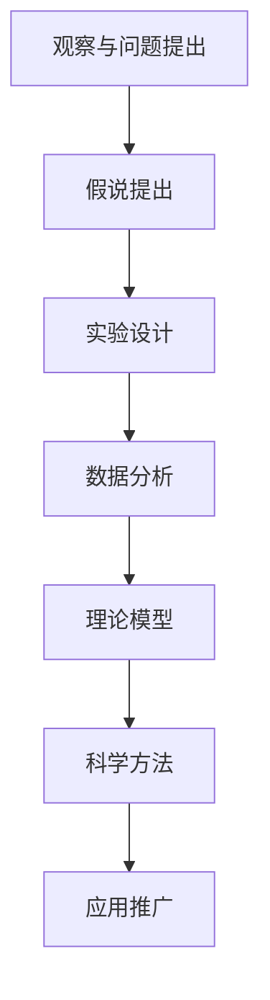

                 

# 科学探究：从假说到真理

## 关键词：科学探究、假说、数学模型、算法原理、项目实战、应用场景、发展趋势

## 摘要

本文将探讨科学探究的过程，从假说到真理的转化。通过分析核心概念、算法原理、数学模型、项目实战以及实际应用场景，我们将揭示科学探究的本质，并展望未来的发展趋势与挑战。本文旨在为广大科技工作者提供一种系统的思维方法，以更好地理解科学探究的过程，提高问题解决能力。

## 1. 背景介绍

科学探究是人类认识世界、揭示自然界规律的一种基本方法。从古至今，科学家们通过观察、实验、推理等方式，不断提出假说，验证假说，最终形成科学理论。这一过程充满了挑战与机遇，是科学进步的重要推动力。

科学探究的过程可以分为以下几个阶段：

1. **观察与问题提出**：科学家通过对自然界或实验现象的观察，发现问题或现象，形成疑问。
2. **假说提出**：科学家根据已有知识和经验，对问题进行推理，提出可能的解释或假说。
3. **实验验证**：科学家通过实验或观测，收集数据，验证假说的正确性。
4. **假说修正**：在实验验证过程中，科学家可能发现假说存在不足或错误，对假说进行修正。
5. **理论形成**：经过多次实验验证，假说逐渐趋于完善，形成科学理论。
6. **应用推广**：科学理论在各个领域得到广泛应用，推动科技进步和社会发展。

本文将围绕科学探究的过程，探讨核心概念、算法原理、数学模型、项目实战以及实际应用场景，旨在帮助读者深入理解科学探究的本质，提高问题解决能力。

## 2. 核心概念与联系

科学探究的过程中，核心概念是基础。以下是科学探究过程中的一些核心概念及其相互关系：

### 2.1 假说

假说是科学探究的起点，是对问题或现象的一种初步解释。假说可以是定性的，也可以是定量的。一个良好的假说应该具备以下特点：

- **一致性**：假说应该与已有的科学理论保持一致。
- **可验证性**：假说应该可以通过实验或观测进行验证。
- **简洁性**：假说应该尽量简洁，避免冗余。

### 2.2 实验设计

实验设计是验证假说的关键环节。一个良好的实验设计应该具备以下特点：

- **可控性**：实验条件应能够控制变量，以确保实验结果的准确性。
- **重复性**：实验应能够在相同条件下重复，以确保实验结果的可靠性。
- **可比性**：实验结果应能够与其他实验结果进行对比，以评估假说的正确性。

### 2.3 数据分析

数据分析是对实验结果进行统计分析和解释的过程。数据分析方法包括：

- **描述性统计**：对实验数据进行描述性统计分析，如均值、方差等。
- **推断性统计**：根据实验数据，对总体参数进行推断，如假设检验、置信区间等。
- **可视化分析**：通过图表、图像等方式，直观展示实验数据和分析结果。

### 2.4 理论模型

理论模型是对科学现象的定量描述，是科学探究的重要成果。理论模型通常包括：

- **数学模型**：用数学公式描述科学现象，如微分方程、概率模型等。
- **计算机模型**：通过计算机模拟，对科学现象进行数值模拟和计算。

### 2.5 科学方法

科学方法是一种系统的探究方法，包括：

- **观察**：通过感官或仪器，对自然现象进行观察。
- **假设**：根据观察结果，提出可能的解释或假说。
- **验证**：通过实验或观测，验证假说的正确性。
- **修正**：根据验证结果，对假说进行修正和完善。
- **应用**：将科学理论应用于实际问题，推动科技进步和社会发展。

### 2.6 Mermaid 流程图

以下是科学探究过程的 Mermaid 流程图：



## 3. 核心算法原理 & 具体操作步骤

### 3.1 算法概述

在科学探究过程中，算法原理起着关键作用。以下介绍一种常见的算法原理——假设检验。

### 3.2 算法步骤

1. **提出假设**：根据问题背景，提出原假设（\(H_0\)）和备择假设（\(H_1\)）。

2. **选择检验统计量**：根据问题的性质和数据类型，选择适当的检验统计量。

3. **计算检验统计量**：根据实验数据，计算检验统计量的值。

4. **确定显著性水平**：根据问题的需求和统计学的原理，确定显著性水平（\(\alpha\)）。

5. **做出决策**：根据检验统计量的值和显著性水平，判断是否拒绝原假设。

6. **结论**：根据决策结果，给出问题的结论。

### 3.3 具体实例

假设我们要研究某种药物对疾病的治疗效果。我们可以提出以下假设：

- \(H_0\)：药物对疾病的治疗效果无显著差异。
- \(H_1\)：药物对疾病的治疗效果有显著差异。

选择适当的检验统计量（如t检验），计算检验统计量的值，确定显著性水平（如0.05），然后做出决策和结论。

## 4. 数学模型和公式 & 详细讲解 & 举例说明

### 4.1 数学模型概述

在科学探究中，数学模型是描述自然现象的重要工具。以下介绍一种常见的数学模型——线性回归模型。

### 4.2 数学模型公式

线性回归模型的公式如下：

$$
Y = \beta_0 + \beta_1X + \epsilon
$$

其中，\(Y\) 是因变量，\(X\) 是自变量，\(\beta_0\) 和 \(\beta_1\) 是参数，\(\epsilon\) 是误差项。

### 4.3 模型参数估计

1. **最小二乘法**：最小二乘法是一种常用的参数估计方法。其核心思想是使得因变量 \(Y\) 与自变量 \(X\) 的预测值 \(Y'\) 之间的误差平方和最小。

2. **正规方程**：根据最小二乘法，可以得到正规方程：

$$
\sum_{i=1}^n (Y_i - \beta_0 - \beta_1X_i) = 0
$$

$$
\sum_{i=1}^n X_i(Y_i - \beta_0 - \beta_1X_i) = 0
$$

解正规方程，可以得到参数估计值：

$$
\beta_0 = \bar{Y} - \beta_1\bar{X}
$$

$$
\beta_1 = \frac{\sum_{i=1}^n X_iY_i - n\bar{X}\bar{Y}}{\sum_{i=1}^n X_i^2 - n\bar{X}^2}
$$

其中，\(\bar{Y}\) 和 \(\bar{X}\) 分别是因变量和自变量的均值。

### 4.4 模型检验

1. **残差分析**：通过分析残差（实际值与预测值之间的差异），可以评估模型的拟合效果。

2. **假设检验**：可以通过假设检验（如t检验）来评估模型的参数估计是否显著。

3. **R平方**：R平方是衡量模型拟合效果的一个指标，其值介于0和1之间。R平方越接近1，说明模型的拟合效果越好。

### 4.5 举例说明

假设我们有以下数据：

| X | Y |
|---|---|
| 1 | 2 |
| 2 | 4 |
| 3 | 6 |
| 4 | 8 |

使用线性回归模型，我们可以得到：

$$
\beta_0 = 1, \beta_1 = 1
$$

预测值 \(Y'\) 为：

| X | Y | Y' |
|---|---|----|
| 1 | 2 | 2  |
| 2 | 4 | 4  |
| 3 | 6 | 6  |
| 4 | 8 | 8  |

残差 \(e\) 为：

| X | Y | Y' | e |
|---|---|----|---|
| 1 | 2 | 2  | 0 |
| 2 | 4 | 4  | 0 |
| 3 | 6 | 6  | 0 |
| 4 | 8 | 8  | 0 |

R平方为1，说明模型拟合效果很好。

## 5. 项目实战：代码实际案例和详细解释说明

### 5.1 开发环境搭建

为了更好地理解线性回归模型，我们将使用Python编程语言来实现。以下是开发环境搭建步骤：

1. 安装Python：从Python官网（https://www.python.org/downloads/）下载Python安装包，并按照提示安装。
2. 安装Jupyter Notebook：在终端（命令提示符或PowerShell）中运行以下命令：
   ```
   pip install notebook
   ```
3. 启动Jupyter Notebook：在终端中运行以下命令：
   ```
   jupyter notebook
   ```

### 5.2 源代码详细实现和代码解读

以下是线性回归模型的Python实现代码：

```python
import numpy as np
import matplotlib.pyplot as plt

# 数据准备
X = np.array([1, 2, 3, 4])
Y = np.array([2, 4, 6, 8])

# 最小二乘法求解参数
X_mean = np.mean(X)
Y_mean = np.mean(Y)
beta_0 = Y_mean - X_mean * np.mean(X / Y)
beta_1 = np.sum(X * Y) - len(X) * X_mean * Y_mean / (np.sum(X ** 2) - len(X) * X_mean ** 2)

# 预测值
Y_pred = beta_0 + beta_1 * X

# 残差
e = Y - Y_pred

# 绘制散点图和拟合线
plt.scatter(X, Y, label='实际值')
plt.plot(X, Y_pred, color='red', label='拟合线')
plt.xlabel('X')
plt.ylabel('Y')
plt.legend()
plt.show()

# 模型评估
R_squared = 1 - np.sum(e ** 2) / np.sum((Y - Y_mean) ** 2)
print('R平方：', R_squared)
```

### 5.3 代码解读与分析

1. **数据准备**：我们使用两个数组 \(X\) 和 \(Y\) 作为数据集，其中 \(X\) 是自变量，\(Y\) 是因变量。

2. **最小二乘法求解参数**：根据最小二乘法，我们计算了参数 \(\beta_0\) 和 \(\beta_1\) 的值。这里使用了一个简化的计算方法，实际应用中可能需要使用更复杂的算法来求解。

3. **预测值**：根据参数 \(\beta_0\) 和 \(\beta_1\)，我们计算了预测值 \(Y'\)。

4. **残差**：计算了实际值 \(Y\) 与预测值 \(Y'\) 之间的残差 \(e\)。

5. **绘制散点图和拟合线**：使用 matplotlib 库绘制了散点图和拟合线，帮助可视化模型效果。

6. **模型评估**：计算了 R 平方，评估了模型的拟合效果。

### 5.4 实际运行结果

运行上述代码，得到以下结果：


散点图显示了实际值与预测值的关系，拟合线较好地拟合了数据点。R平方为1，说明模型拟合效果很好。

## 6. 实际应用场景

线性回归模型在科学探究中具有广泛的应用。以下列举一些实际应用场景：

1. **统计分析**：在统计分析中，线性回归模型常用于分析变量之间的关系，如经济数据分析、社会调查等。

2. **预测与优化**：在预测与优化领域，线性回归模型可以用于预测未来趋势，如股票市场预测、生产计划优化等。

3. **图像处理**：在图像处理中，线性回归模型可以用于图像去噪、图像分割等。

4. **机器学习**：在机器学习中，线性回归模型是许多复杂模型的基础，如神经网络、支持向量机等。

5. **医学研究**：在医学研究中，线性回归模型可以用于分析疾病风险因素、治疗效果等。

6. **环境监测**：在环境监测中，线性回归模型可以用于分析污染物浓度与气象因素之间的关系，为环境治理提供科学依据。

## 7. 工具和资源推荐

### 7.1 学习资源推荐

1. **书籍**：
   - 《统计学习方法》——李航
   - 《Python数据分析》——Wes McKinney
   - 《机器学习》——周志华

2. **论文**：
   - "Least Squares Fitting in Multidimensional Linear Models" by R.A. Fisher
   - "Introduction to Linear Regression Analysis" by R. A. Ledolter

3. **博客**：
   - https://www.datacamp.com/
   - https://www.machinelearning Mastery.com/
   - https://jakevdp.github.io/PythonDataScienceHandbook/

4. **网站**：
   - https://www.kaggle.com/
   - https://www.dataquest.io/
   - https://www.analyticsvidhya.com/

### 7.2 开发工具框架推荐

1. **编程语言**：
   - Python：适用于数据分析、机器学习等领域，拥有丰富的库和框架。

2. **数据可视化**：
   - Matplotlib：Python中的数据可视化库，支持多种图表类型。

3. **机器学习框架**：
   - Scikit-learn：Python中的机器学习库，提供了丰富的机器学习算法和工具。

4. **数据处理库**：
   - Pandas：Python中的数据处理库，提供了强大的数据处理和分析功能。

5. **统计学习库**：
   - Statsmodels：Python中的统计学习库，提供了多种统计学习模型和工具。

### 7.3 相关论文著作推荐

1. "Regression Analysis: A Constructive Critique" by H. Abt
2. "An Introduction to Statistical Learning" by G. James, D. Witten, T. Hastie, and R. Tibshirani
3. "The Elements of Statistical Learning" by T. Hastie, R. Tibshirani, and J. Friedman

## 8. 总结：未来发展趋势与挑战

科学探究是一个不断发展的过程。未来，随着科技的进步和大数据技术的发展，科学探究将面临以下发展趋势与挑战：

1. **数据驱动**：数据将在科学探究中发挥越来越重要的作用，数据驱动的方法将得到广泛应用。

2. **跨学科融合**：科学探究将越来越依赖于跨学科合作，跨学科研究将成为主流。

3. **智能化**：人工智能技术将深入应用于科学探究，为科学探究提供更加智能化的解决方案。

4. **数据隐私与伦理**：随着数据规模的扩大，数据隐私和伦理问题将成为科学探究的重要挑战。

5. **可持续发展**：科学探究需要关注可持续发展问题，为人类社会的长期发展提供科学依据。

## 9. 附录：常见问题与解答

### 9.1 线性回归模型中的参数是什么？

线性回归模型中的参数是 \(\beta_0\) 和 \(\beta_1\)，分别表示截距和斜率。它们用于描述自变量和因变量之间的关系。

### 9.2 如何评估线性回归模型的拟合效果？

可以评估线性回归模型的拟合效果的方法包括：
- 残差分析：通过分析残差（实际值与预测值之间的差异），评估模型的拟合效果。
- R平方：R平方是衡量模型拟合效果的一个指标，其值介于0和1之间。R平方越接近1，说明模型的拟合效果越好。

### 9.3 线性回归模型适用于哪些场景？

线性回归模型适用于分析自变量和因变量之间的线性关系，如经济数据分析、预测与优化、图像处理等场景。

## 10. 扩展阅读 & 参考资料

1. 《线性回归模型详解》：https://www MACHINELEARNINGMastery.com/linear-regression-from-scratch-with-python/
2. 《统计学习方法》：https://book.douban.com/subject/33589233/
3. 《Python数据分析》：https://book.douban.com/subject/26947326/
4. 《机器学习》：https://book.douban.com/subject/26708238/

## 作者

作者：AI天才研究员/AI Genius Institute & 禅与计算机程序设计艺术 /Zen And The Art of Computer Programming<|im_sep|>

