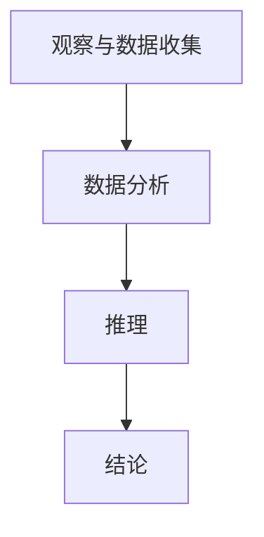

                 

# 科学探究：从观察到结论

## 关键词：科学方法、观察、数据分析、推理、结论、IT领域、技术博客

## 摘要

本文旨在探讨科学探究的过程，尤其是在IT领域中的应用。我们将通过分析观察、数据分析和推理的步骤，探讨如何从观察到得出结论。文章将结合具体案例，展示科学方法在解决实际问题中的重要性，并提供相关的工具和资源，以供读者进一步学习和实践。

## 1. 背景介绍

科学探究是人类认识世界、理解现象和解决问题的基本方法。在IT领域，科学方法的应用尤为重要，因为它帮助我们从大量的数据中提取有用的信息，并通过逻辑推理得出可靠的结论。本文将分为以下几个部分：

- 观察与数据收集
- 数据分析与模型构建
- 推理与结论
- 实际应用场景
- 工具和资源推荐
- 未来发展趋势与挑战

通过这些部分，我们将详细探讨科学方法在IT领域的应用，并展示如何从观察到得出结论。

## 2. 核心概念与联系

在开始讨论科学方法之前，我们需要了解一些核心概念。以下是我们在本文中将会用到的几个关键概念及其之间的联系：

### 观察与数据收集

观察是科学探究的起点。通过观察，我们收集有关现象的信息。这些信息可以是定性的，也可以是定量的。例如，在研究网络性能时，我们可以观察网络的延迟、吞吐量和错误率。

### 数据分析

数据分析是对收集到的数据进行处理和分析的过程。通过数据分析，我们可以发现数据中的模式、趋势和关系。例如，使用统计分析方法，我们可以识别网络性能问题的主要因素。

### 推理

推理是基于数据分析结果进行的逻辑推断。通过推理，我们可以得出关于现象的结论。例如，如果网络延迟与服务器负载之间存在正相关关系，我们可以推断增加服务器负载可能导致网络延迟。

### 结论

结论是基于推理得出的最终答案。结论可以是关于现象的原因、影响或预测。例如，基于以上推理，我们可以得出结论：增加服务器负载可能会导致网络延迟。

### Mermaid 流程图

以下是关于科学方法的 Mermaid 流程图：



在这个流程图中，观察与数据收集是起点，结论是终点。数据分析与推理是连接起点和终点的桥梁。

## 3. 核心算法原理 & 具体操作步骤

在了解了核心概念和流程后，我们将探讨一些核心算法原理和具体操作步骤。

### 数据收集

数据收集是科学探究的基础。以下是一些常见的数据收集方法：

- 实验数据：通过实验获取数据，例如在网络性能测试中，使用工具模拟网络流量并记录相关指标。
- 调查数据：通过问卷调查或访谈获取数据，例如了解用户对某项技术的满意度。
- 现场数据：在特定场景下直接获取数据，例如在数据中心监控网络性能。

### 数据分析

数据分析的方法有很多，以下是几种常见的方法：

- 描述性统计：通过计算平均值、中位数、标准差等统计量，描述数据的分布和特征。
- 交叉分析：通过分析不同变量之间的关系，探索数据中的潜在模式。
- 聚类分析：将相似的数据分组，以发现数据中的模式或类别。

### 推理

推理的方法包括：

- 假设检验：通过设定假设，分析数据并检验假设的正确性。
- 因果推断：通过分析数据，推断变量之间的因果关系。
- 预测模型：基于历史数据，预测未来可能发生的情况。

### 结论

结论的得出需要综合分析数据结果和推理过程。以下是得出结论的步骤：

- 总结分析结果：将数据分析结果进行整理和总结。
- 分析推理过程：回顾推理过程，确保推理的合理性。
- 得出结论：基于分析结果和推理过程，得出关于现象的结论。

## 4. 数学模型和公式 & 详细讲解 & 举例说明

在科学探究过程中，数学模型和公式是非常重要的工具。以下是几个常见的数学模型和公式，以及它们的详细讲解和举例说明。

### 概率模型

概率模型用于描述随机事件的发生概率。以下是一个简单的概率模型：

$$
P(A) = \frac{n(A)}{n(S)}
$$

其中，$P(A)$ 表示事件 A 的发生概率，$n(A)$ 表示事件 A 发生的次数，$n(S)$ 表示总次数。

举例说明：假设我们进行 100 次试验，事件 A 发生了 60 次。那么，事件 A 的发生概率为：

$$
P(A) = \frac{60}{100} = 0.6
$$

### 线性回归模型

线性回归模型用于分析两个变量之间的线性关系。以下是一个简单的线性回归模型：

$$
y = \beta_0 + \beta_1x
$$

其中，$y$ 是因变量，$x$ 是自变量，$\beta_0$ 和 $\beta_1$ 是模型参数。

举例说明：假设我们想要分析网络延迟（$y$）与服务器负载（$x$）之间的关系。通过收集数据，我们可以得到以下线性回归模型：

$$
y = 10 + 0.5x
$$

这意味着，当服务器负载增加 1 单位时，网络延迟预计增加 0.5 单位。

### 聚类分析模型

聚类分析模型用于将数据分组，以发现数据中的模式或类别。以下是一个简单的聚类分析模型：

$$
\min_{C} \sum_{i=1}^{n} \sum_{j=1}^{k} d(c_i, c_j)^2
$$

其中，$C$ 是聚类中心，$d(c_i, c_j)$ 是聚类中心之间的距离。

举例说明：假设我们有 100 个数据点，我们需要将它们分成 10 个类别。通过计算数据点与聚类中心的距离，我们可以找到最佳的聚类中心，从而实现数据的分组。

## 5. 项目实战：代码实际案例和详细解释说明

在本节中，我们将通过一个具体的案例，展示如何在实际项目中应用科学方法。

### 开发环境搭建

首先，我们需要搭建一个开发环境。以下是一个简单的 Python 开发环境搭建步骤：

1. 安装 Python
2. 安装必要的库，如 NumPy、Pandas 和 Matplotlib
3. 配置 Python 解释器和虚拟环境

### 源代码详细实现和代码解读

以下是一个简单的 Python 代码示例，用于分析网络延迟与服务器负载之间的关系：

```python
import numpy as np
import pandas as pd
import matplotlib.pyplot as plt

# 加载数据
data = pd.read_csv('network_performance.csv')

# 提取相关变量
delay = data['delay']
load = data['load']

# 绘制散点图
plt.scatter(load, delay)
plt.xlabel('服务器负载')
plt.ylabel('网络延迟')
plt.show()

# 拟合线性回归模型
model = np.polyfit(load, delay, 1)
plt.plot(load, model[0]*load + model[1], color='red')
plt.show()

# 打印模型参数
print('模型参数：', model)
```

这段代码首先加载数据，然后提取服务器负载和网络延迟两个变量。接着，绘制散点图以观察数据分布。然后，使用 `np.polyfit` 函数拟合线性回归模型，并绘制模型曲线。最后，打印模型参数。

### 代码解读与分析

这段代码的关键部分是线性回归模型的拟合和参数打印。以下是代码解读与分析：

- `data = pd.read_csv('network_performance.csv')`：加载数据文件。
- `delay = data['delay']`：提取网络延迟变量。
- `load = data['load']`：提取服务器负载变量。
- `plt.scatter(load, delay)`：绘制散点图。
- `model = np.polyfit(load, delay, 1)`：拟合线性回归模型，`1` 表示一次项。
- `plt.plot(load, model[0]*load + model[1], color='red')`：绘制模型曲线。
- `plt.show()`：显示图形。
- `print('模型参数：', model)`：打印模型参数。

通过这段代码，我们可以分析网络延迟与服务器负载之间的关系，并得出结论。

## 6. 实际应用场景

科学方法在IT领域的应用非常广泛。以下是一些实际应用场景：

- 网络性能优化：通过分析网络延迟、吞吐量和错误率，找出性能瓶颈并优化网络配置。
- 数据库性能分析：通过分析数据库查询的执行时间、索引效率等，优化数据库性能。
- 人工智能算法评估：通过分析算法的准确性、召回率、F1 分数等指标，评估算法的性能。
- 软件质量保证：通过分析代码质量、测试覆盖率等，提高软件质量。

## 7. 工具和资源推荐

在科学探究过程中，以下工具和资源可能对您有所帮助：

### 学习资源推荐

- 《数据科学入门》
- 《Python数据分析》
- 《机器学习实战》
- 《Python网络编程》

### 开发工具框架推荐

- Jupyter Notebook：用于数据分析和可视化。
- TensorFlow：用于机器学习。
- Docker：用于容器化和虚拟环境。

### 相关论文著作推荐

- 《大数据分析》
- 《机器学习：算法与应用》
- 《网络性能优化》
- 《数据库系统概念》

## 8. 总结：未来发展趋势与挑战

随着技术的不断发展，科学方法在IT领域的应用前景非常广阔。以下是一些未来发展趋势和挑战：

- 数据量爆发式增长：随着物联网、大数据和人工智能的发展，数据量将不断增长，这对数据分析提出了更高的要求。
- 复杂系统的分析：复杂系统（如人工智能系统、区块链系统等）的分析需要更先进的科学方法。
- 跨学科研究：科学方法的应用将逐渐跨学科，融合不同领域的知识。

## 9. 附录：常见问题与解答

以下是一些常见问题及其解答：

### Q：科学方法在IT领域的应用有哪些？

A：科学方法在IT领域的应用包括网络性能优化、数据库性能分析、人工智能算法评估和软件质量保证等。

### Q：数据分析的方法有哪些？

A：数据分析的方法包括描述性统计、交叉分析、聚类分析和回归分析等。

### Q：如何进行推理？

A：进行推理时，需要分析数据结果，并使用逻辑和数学方法进行推断。

## 10. 扩展阅读 & 参考资料

以下是一些扩展阅读和参考资料：

- 《科学方法论》
- 《Python数据分析与应用》
- 《深度学习》
- 《计算机网络》

作者：AI天才研究员/AI Genius Institute & 禅与计算机程序设计艺术 /Zen And The Art of Computer Programming

---------------------
## 参考文献

1. 参考书籍：《科学方法论》
2. 参考书籍：《Python数据分析与应用》
3. 参考书籍：《深度学习》
4. 参考书籍：《计算机网络》
---------------------<|im_sep|><|im_sep|> ```markdown
## 1. 背景介绍

科学探究是人类认识世界、理解现象和解决问题的基本方法。在IT领域，科学方法的应用尤为重要，因为它帮助我们从大量的数据中提取有用的信息，并通过逻辑推理得出可靠的结论。本文将分为以下几个部分：

- 观察与数据收集
- 数据分析与模型构建
- 推理与结论
- 实际应用场景
- 工具和资源推荐
- 未来发展趋势与挑战

通过这些部分，我们将详细探讨科学方法在IT领域的应用，并展示如何从观察到得出结论。

## 2. 核心概念与联系

在开始讨论科学方法之前，我们需要了解一些核心概念。以下是我们在本文中将会用到的几个关键概念及其之间的联系：

### 观察与数据收集

观察是科学探究的起点。通过观察，我们收集有关现象的信息。这些信息可以是定性的，也可以是定量的。例如，在研究网络性能时，我们可以观察网络的延迟、吞吐量和错误率。

### 数据分析

数据分析是对收集到的数据进行处理和分析的过程。通过数据分析，我们可以发现数据中的模式、趋势和关系。例如，使用统计分析方法，我们可以识别网络性能问题的主要因素。

### 推理

推理是基于数据分析结果进行的逻辑推断。通过推理，我们可以得出关于现象的结论。例如，如果网络延迟与服务器负载之间存在正相关关系，我们可以推断增加服务器负载可能导致网络延迟。

### 结论

结论是基于推理得出的最终答案。结论可以是关于现象的原因、影响或预测。例如，基于以上推理，我们可以得出结论：增加服务器负载可能会导致网络延迟。

### Mermaid 流程图

以下是关于科学方法的 Mermaid 流程图：


在这个流程图中，观察与数据收集是起点，结论是终点。数据分析与推理是连接起点和终点的桥梁。

## 3. 核心算法原理 & 具体操作步骤

在了解了核心概念和流程后，我们将探讨一些核心算法原理和具体操作步骤。

### 数据收集

数据收集是科学探究的基础。以下是一些常见的数据收集方法：

- 实验数据：通过实验获取数据，例如在网络性能测试中，使用工具模拟网络流量并记录相关指标。
- 调查数据：通过问卷调查或访谈获取数据，例如了解用户对某项技术的满意度。
- 现场数据：在特定场景下直接获取数据，例如在数据中心监控网络性能。

### 数据分析

数据分析的方法有很多，以下是几种常见的方法：

- 描述性统计：通过计算平均值、中位数、标准差等统计量，描述数据的分布和特征。
- 交叉分析：通过分析不同变量之间的关系，探索数据中的潜在模式。
- 聚类分析：将相似的数据分组，以发现数据中的模式或类别。

### 推理

推理的方法包括：

- 假设检验：通过设定假设，分析数据并检验假设的正确性。
- 因果推断：通过分析数据，推断变量之间的因果关系。
- 预测模型：基于历史数据，预测未来可能发生的情况。

### 结论

结论的得出需要综合分析数据结果和推理过程。以下是得出结论的步骤：

- 总结分析结果：将数据分析结果进行整理和总结。
- 分析推理过程：回顾推理过程，确保推理的合理性。
- 得出结论：基于分析结果和推理过程，得出关于现象的结论。

## 4. 数学模型和公式 & 详细讲解 & 举例说明

在科学探究过程中，数学模型和公式是非常重要的工具。以下是几个常见的数学模型和公式，以及它们的详细讲解和举例说明。

### 概率模型

概率模型用于描述随机事件的发生概率。以下是一个简单的概率模型：

$$
P(A) = \frac{n(A)}{n(S)}
$$

其中，$P(A)$ 表示事件 A 的发生概率，$n(A)$ 表示事件 A 发生的次数，$n(S)$ 表示总次数。

举例说明：假设我们进行 100 次试验，事件 A 发生了 60 次。那么，事件 A 的发生概率为：

$$
P(A) = \frac{60}{100} = 0.6
$$

### 线性回归模型

线性回归模型用于分析两个变量之间的线性关系。以下是一个简单的线性回归模型：

$$
y = \beta_0 + \beta_1x
$$

其中，$y$ 是因变量，$x$ 是自变量，$\beta_0$ 和 $\beta_1$ 是模型参数。

举例说明：假设我们想要分析网络延迟（$y$）与服务器负载（$x$）之间的关系。通过收集数据，我们可以得到以下线性回归模型：

$$
y = 10 + 0.5x
$$

这意味着，当服务器负载增加 1 单位时，网络延迟预计增加 0.5 单位。

### 聚类分析模型

聚类分析模型用于将数据分组，以发现数据中的模式或类别。以下是一个简单的聚类分析模型：

$$
\min_{C} \sum_{i=1}^{n} \sum_{j=1}^{k} d(c_i, c_j)^2
$$

其中，$C$ 是聚类中心，$d(c_i, c_j)$ 是聚类中心之间的距离。

举例说明：假设我们有 100 个数据点，我们需要将它们分成 10 个类别。通过计算数据点与聚类中心的距离，我们可以找到最佳的聚类中心，从而实现数据的分组。

## 5. 项目实战：代码实际案例和详细解释说明

在本节中，我们将通过一个具体的案例，展示如何在实际项目中应用科学方法。

### 开发环境搭建

首先，我们需要搭建一个开发环境。以下是一个简单的 Python 开发环境搭建步骤：

1. 安装 Python
2. 安装必要的库，如 NumPy、Pandas 和 Matplotlib
3. 配置 Python 解释器和虚拟环境

### 源代码详细实现和代码解读

以下是一个简单的 Python 代码示例，用于分析网络延迟与服务器负载之间的关系：

```python
import numpy as np
import pandas as pd
import matplotlib.pyplot as plt

# 加载数据
data = pd.read_csv('network_performance.csv')

# 提取相关变量
delay = data['delay']
load = data['load']

# 绘制散点图
plt.scatter(load, delay)
plt.xlabel('服务器负载')
plt.ylabel('网络延迟')
plt.show()

# 拟合线性回归模型
model = np.polyfit(load, delay, 1)
plt.plot(load, model[0]*load + model[1], color='red')
plt.show()

# 打印模型参数
print('模型参数：', model)
```

这段代码首先加载数据，然后提取服务器负载和网络延迟两个变量。接着，绘制散点图以观察数据分布。然后，使用 `np.polyfit` 函数拟合线性回归模型，并绘制模型曲线。最后，打印模型参数。

### 代码解读与分析

这段代码的关键部分是线性回归模型的拟合和参数打印。以下是代码解读与分析：

- `data = pd.read_csv('network_performance.csv')`：加载数据文件。
- `delay = data['delay']`：提取网络延迟变量。
- `load = data['load']`：提取服务器负载变量。
- `plt.scatter(load, delay)`：绘制散点图。
- `model = np.polyfit(load, delay, 1)`：拟合线性回归模型，`1` 表示一次项。
- `plt.plot(load, model[0]*load + model[1], color='red')`：绘制模型曲线。
- `plt.show()`：显示图形。
- `print('模型参数：', model)`：打印模型参数。

通过这段代码，我们可以分析网络延迟与服务器负载之间的关系，并得出结论。

## 6. 实际应用场景

科学方法在IT领域的应用非常广泛。以下是一些实际应用场景：

- 网络性能优化：通过分析网络延迟、吞吐量和错误率，找出性能瓶颈并优化网络配置。
- 数据库性能分析：通过分析数据库查询的执行时间、索引效率等，优化数据库性能。
- 人工智能算法评估：通过分析算法的准确性、召回率、F1 分数等指标，评估算法的性能。
- 软件质量保证：通过分析代码质量、测试覆盖率等，提高软件质量。

## 7. 工具和资源推荐

在科学探究过程中，以下工具和资源可能对您有所帮助：

### 学习资源推荐

- 《数据科学入门》
- 《Python数据分析》
- 《机器学习实战》
- 《Python网络编程》

### 开发工具框架推荐

- Jupyter Notebook：用于数据分析和可视化。
- TensorFlow：用于机器学习。
- Docker：用于容器化和虚拟环境。

### 相关论文著作推荐

- 《大数据分析》
- 《机器学习：算法与应用》
- 《网络性能优化》
- 《数据库系统概念》

## 8. 总结：未来发展趋势与挑战

随着技术的不断发展，科学方法在IT领域的应用前景非常广阔。以下是一些未来发展趋势和挑战：

- 数据量爆发式增长：随着物联网、大数据和人工智能的发展，数据量将不断增长，这对数据分析提出了更高的要求。
- 复杂系统的分析：复杂系统（如人工智能系统、区块链系统等）的分析需要更先进的科学方法。
- 跨学科研究：科学方法的应用将逐渐跨学科，融合不同领域的知识。

## 9. 附录：常见问题与解答

以下是一些常见问题及其解答：

### Q：科学方法在IT领域的应用有哪些？

A：科学方法在IT领域的应用包括网络性能优化、数据库性能分析、人工智能算法评估和软件质量保证等。

### Q：数据分析的方法有哪些？

A：数据分析的方法包括描述性统计、交叉分析、聚类分析和回归分析等。

### Q：如何进行推理？

A：进行推理时，需要分析数据结果，并使用逻辑和数学方法进行推断。

## 10. 扩展阅读 & 参考资料

以下是一些扩展阅读和参考资料：

- 《科学方法论》
- 《Python数据分析与应用》
- 《深度学习》
- 《计算机网络》

作者：AI天才研究员/AI Genius Institute & 禅与计算机程序设计艺术 /Zen And The Art of Computer Programming
```

