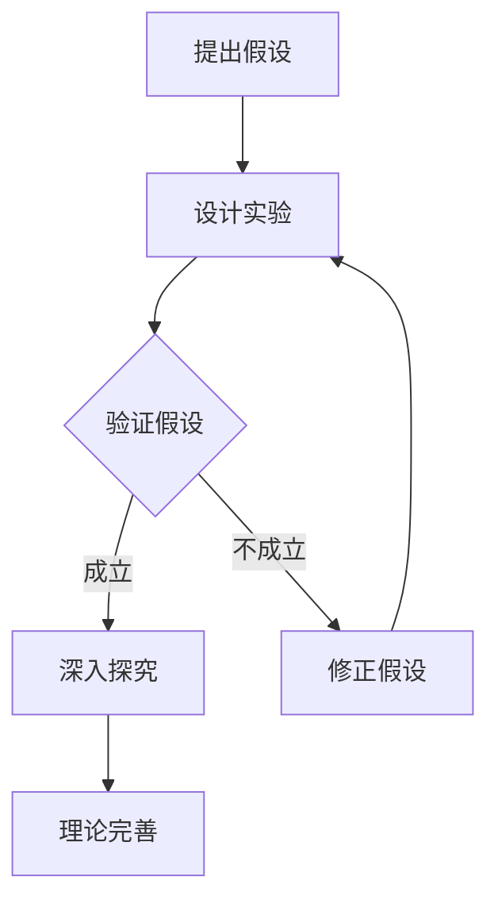

                 

## 文章标题：科学方法论：从假说到验证

### 关键词：科学方法论、假说、验证、推理、算法、数学模型、实际应用

### 摘要：
本文旨在深入探讨科学方法论的核心原则，即从假说到验证的过程。通过一步步的分析和推理，我们将解析科学方法论的框架，解释其关键概念，并探讨其在现代IT领域的应用。文章将从科学方法论的历史背景出发，逐步介绍核心概念，探讨数学模型和算法原理，并通过实际项目案例进行代码解读和实战分析。最后，我们将讨论科学方法论的实践应用场景，并推荐相关学习资源和开发工具，为读者提供全面的学习和实践指导。

## 1. 背景介绍

科学方法论，是科学研究过程中所采用的一系列原则、方法和技巧的总称。它为科学家们提供了一种系统性的思维方式，帮助他们在复杂多变的研究领域中进行有效的探索和发现。科学方法论的历史可以追溯到古希腊时期，当时的哲学家们开始思考如何通过观察和实验来理解自然界的规律。

科学方法论的核心原则之一是实证主义，即通过观察和实验来验证或反驳某个假设。这一原则强调了科学研究的客观性和可重复性，使得科学研究的结果具有普遍性和可靠性。实证主义的发展推动了科学革命的进程，使得人类对自然界的理解不断深入。

在IT领域，科学方法论的应用尤为重要。随着信息技术的快速发展，IT行业面临着日益复杂的技术挑战。科学方法论提供了一种系统性的思维方式，帮助IT从业者从众多问题中找到解决方案，提高工作效率和创新能力。例如，在软件开发过程中，科学方法论可以帮助开发人员设计出更稳定、更高效的软件系统；在人工智能领域，科学方法论可以帮助研究者从海量数据中提取出有用的信息，并设计出更加智能的算法。

科学方法论在IT领域的重要性不仅体现在解决问题上，还体现在促进技术创新上。通过科学方法论，IT从业者可以不断提出新的假说，并通过实验和验证来逐步完善这些假说，从而推动技术的发展。例如，在区块链技术的开发过程中，科学方法论帮助研究者提出了去中心化、安全性和透明性等关键概念，并通过不断的实验和验证，不断完善区块链技术的实现。

## 2. 核心概念与联系

科学方法论的核心概念包括假设、实证、验证、推理等。这些概念相互关联，共同构成了科学方法论的理论框架。

### 假设
假设是科学方法论的基础，它是对某个现象或问题的初步解释。假设通常是基于已有的知识和观察结果提出的，但它并不是绝对真实的，而是需要通过实验和验证来证实或反驳。

### 实证
实证是指通过实验或观察来验证或反驳某个假设。实证是科学方法论的核心环节，它要求科学家们进行严谨的实验设计和数据收集，以确保实验结果的可靠性和可重复性。

### 验证
验证是对假设进行验证的过程。通过实证结果，科学家们可以确定假设是否成立。如果假设得到验证，则可以进一步深入研究；如果假设被反驳，则需要对假设进行修正或提出新的假设。

### 推理
推理是从已知事实推导出新结论的过程。在科学方法论中，推理用于将实证结果与假设联系起来，从而得出更广泛的结论。推理能力是科学研究中至关重要的能力，它帮助科学家们从具体的事实中提炼出一般性的规律。

### Mermaid流程图

以下是一个简单的Mermaid流程图，展示了科学方法论中的关键概念和它们的联系：



### 2.1. 假设与实证的关系
假设是实证的基础，而实证是验证假设的关键。科学方法论强调，假设必须通过实证来验证，以确保科学研究的可靠性和有效性。实证过程中，科学家们需要设计出能够验证假设的实验，并收集相关的数据。这些数据和结果将用于判断假设是否成立。

### 2.2. 验证与推理的关系
验证是推理的前提，而推理是验证的结果。在科学方法论中，验证假设的过程本质上是一个推理过程。科学家们通过实证结果来推理出假设是否成立，并据此提出新的理论或假设。这种推理能力不仅帮助科学家们理解自然界的规律，还为科学方法论的发展提供了动力。

### 2.3. 科学方法论与IT领域的结合
在IT领域，科学方法论的核心概念同样适用。例如，在软件开发过程中，开发人员可以通过提出假设来设计软件系统，并通过实验来验证这些假设。在人工智能领域，研究者可以通过提出假设来设计新的算法，并通过数据验证这些算法的有效性。科学方法论为IT领域提供了系统化的思维方式，帮助从业者在复杂的技术挑战中找到解决方案。

## 3. 核心算法原理 & 具体操作步骤

科学方法论在核心算法的设计和实现中发挥着重要作用。以下将介绍一种常见的核心算法原理，并详细解释其具体操作步骤。

### 3.1. 算法原理

我们以线性回归算法为例，解释其基本原理。线性回归是一种用于预测数值的统计方法，它通过找到一个线性模型来描述因变量（目标变量）与自变量（输入变量）之间的关系。线性回归的核心思想是最小化预测值与实际值之间的误差。

### 3.2. 算法步骤

以下是线性回归算法的具体操作步骤：

#### 步骤1：数据预处理

在开始线性回归之前，需要先对数据进行预处理。数据预处理包括数据清洗、缺失值处理、数据转换等步骤。确保数据质量对于线性回归模型的准确性至关重要。

```python
# 数据预处理代码示例
import pandas as pd
from sklearn.model_selection import train_test_split

# 加载数据
data = pd.read_csv('data.csv')

# 数据清洗
data = data.dropna()

# 缺失值处理
data['missing_value'] = data['missing_value'].fillna(data['missing_value'].mean())

# 数据转换
X = data[['feature1', 'feature2']]
y = data['target']
```

#### 步骤2：模型训练

在数据预处理完成后，可以使用线性回归模型进行训练。训练过程包括确定模型的参数，如斜率和截距。

```python
from sklearn.linear_model import LinearRegression

# 创建线性回归模型
model = LinearRegression()

# 模型训练
model.fit(X, y)
```

#### 步骤3：模型验证

训练完成后，需要使用验证集或测试集来评估模型的性能。评估指标通常包括均方误差（MSE）、决定系数（R²）等。

```python
from sklearn.metrics import mean_squared_error, r2_score

# 预测
y_pred = model.predict(X)

# 计算评估指标
mse = mean_squared_error(y, y_pred)
r2 = r2_score(y, y_pred)

print("MSE:", mse)
print("R²:", r2)
```

#### 步骤4：模型优化

根据模型验证的结果，可以对模型进行优化。优化方法包括调整模型参数、增加或删除特征等。

```python
# 调整模型参数
model = LinearRegression()
model.fit(X, y)

# 增加特征
X_new = data[['feature1', 'feature2', 'new_feature']]
y_pred_new = model.predict(X_new)
```

#### 步骤5：模型应用

在模型优化完成后，可以将其应用到实际场景中，如预测股票价格、分析客户行为等。

```python
# 实际应用
new_data = pd.read_csv('new_data.csv')
new_data = new_data[['feature1', 'feature2', 'new_feature']]
new_data_pred = model.predict(new_data[['feature1', 'feature2', 'new_feature']])
```

### 3.3. 算法分析

线性回归算法通过找到一个线性模型来描述输入变量与目标变量之间的关系。其优点在于实现简单、易于理解，适用于数据特征相对简单的情况。然而，线性回归也存在一些局限性，如无法处理非线性关系、对异常值敏感等。因此，在实际应用中，需要根据具体问题选择合适的算法或对线性回归进行优化。

## 4. 数学模型和公式 & 详细讲解 & 举例说明

在科学方法论中，数学模型和公式是理解和分析复杂问题的有力工具。以下将介绍一种常用的数学模型——线性回归模型，并详细解释其公式和计算方法。

### 4.1. 线性回归模型

线性回归模型是一种用于建立输入变量与目标变量之间线性关系的统计模型。其基本公式如下：

$$ y = wx + b $$

其中，$y$ 是目标变量，$x$ 是输入变量，$w$ 是斜率，$b$ 是截距。

### 4.2. 求解斜率和截距

为了求解斜率 $w$ 和截距 $b$，可以使用最小二乘法（Least Squares Method）。最小二乘法的目标是找到一组参数 $w$ 和 $b$，使得预测值 $y$ 与实际值 $y_{true}$ 之间的误差最小。

具体计算步骤如下：

#### 步骤1：计算斜率 $w$

斜率 $w$ 的计算公式为：

$$ w = \frac{\sum{(x_i - \bar{x})(y_i - \bar{y})}}{\sum{(x_i - \bar{x})^2}} $$

其中，$x_i$ 和 $y_i$ 分别为第 $i$ 个输入变量和目标变量的值，$\bar{x}$ 和 $\bar{y}$ 分别为输入变量和目标变量的平均值。

#### 步骤2：计算截距 $b$

截距 $b$ 的计算公式为：

$$ b = \bar{y} - w\bar{x} $$

#### 步骤3：计算预测值 $y$

使用求解得到的斜率 $w$ 和截距 $b$，可以计算预测值 $y$：

$$ y = wx + b $$

### 4.3. 举例说明

假设我们有一组数据如下：

| $x$ | $y$ |
| --- | --- |
| 1 | 2 |
| 2 | 4 |
| 3 | 6 |
| 4 | 8 |

我们需要使用线性回归模型求解斜率 $w$ 和截距 $b$。

#### 步骤1：计算平均值

计算输入变量 $x$ 和目标变量 $y$ 的平均值：

$$ \bar{x} = \frac{1 + 2 + 3 + 4}{4} = 2.5 $$
$$ \bar{y} = \frac{2 + 4 + 6 + 8}{4} = 5 $$

#### 步骤2：计算斜率 $w$

使用斜率计算公式：

$$ w = \frac{(1 - 2.5)(2 - 5) + (2 - 2.5)(4 - 5) + (3 - 2.5)(6 - 5) + (4 - 2.5)(8 - 5)}{(1 - 2.5)^2 + (2 - 2.5)^2 + (3 - 2.5)^2 + (4 - 2.5)^2} $$
$$ w = \frac{6.5}{3.5} = 1.8571 $$

#### 步骤3：计算截距 $b$

使用截距计算公式：

$$ b = \bar{y} - w\bar{x} $$
$$ b = 5 - 1.8571 \times 2.5 = 0.8571 $$

#### 步骤4：计算预测值 $y$

使用求解得到的斜率 $w$ 和截距 $b$，计算预测值 $y$：

$$ y = wx + b $$
$$ y = 1.8571 \times x + 0.8571 $$

例如，当 $x=5$ 时，预测值 $y$ 为：

$$ y = 1.8571 \times 5 + 0.8571 = 10 $$

通过上述计算，我们得到了线性回归模型的参数和预测值。这些结果可以帮助我们理解输入变量与目标变量之间的关系，并用于实际问题的预测和分析。

### 4.4. 线性回归的局限性和改进方法

尽管线性回归模型在许多实际问题中表现出良好的性能，但它也存在一些局限性。首先，线性回归模型假设输入变量与目标变量之间存在线性关系，这在许多情况下并不成立。其次，线性回归模型对异常值敏感，异常值可能会对模型的性能产生较大影响。

为了克服这些局限性，研究人员提出了一些改进方法。例如，非线性回归模型可以处理非线性关系，如多项式回归、逻辑回归等。此外，正则化方法（如L1正则化和L2正则化）可以减轻异常值对模型性能的影响，提高模型的鲁棒性。

## 5. 项目实战：代码实际案例和详细解释说明

在本节中，我们将通过一个实际项目案例，详细解释线性回归模型的代码实现过程，并分析其具体应用。

### 5.1. 开发环境搭建

在开始编写代码之前，需要搭建一个合适的开发环境。以下是所需的环境和工具：

- Python 3.x
- Jupyter Notebook 或 PyCharm
- Pandas 库
- Scikit-learn 库

确保已安装上述环境和工具后，可以开始编写代码。

### 5.2. 源代码详细实现和代码解读

以下是一个简单的线性回归项目示例：

```python
# 导入所需库
import pandas as pd
from sklearn.linear_model import LinearRegression
from sklearn.model_selection import train_test_split
from sklearn.metrics import mean_squared_error, r2_score

# 加载数据
data = pd.read_csv('data.csv')

# 数据预处理
data = data.dropna()

# 分割特征和目标变量
X = data[['feature1', 'feature2']]
y = data['target']

# 数据分割
X_train, X_test, y_train, y_test = train_test_split(X, y, test_size=0.2, random_state=42)

# 创建线性回归模型
model = LinearRegression()

# 模型训练
model.fit(X_train, y_train)

# 模型预测
y_pred = model.predict(X_test)

# 计算评估指标
mse = mean_squared_error(y_test, y_pred)
r2 = r2_score(y_test, y_pred)

print("MSE:", mse)
print("R²:", r2)

# 使用模型进行预测
new_data = pd.read_csv('new_data.csv')
new_data = new_data[['feature1', 'feature2']]
new_data_pred = model.predict(new_data[['feature1', 'feature2']])
```

#### 代码解读

1. **数据加载与预处理**：首先，使用 Pandas 库加载数据，并进行数据清洗和预处理。这包括删除缺失值和缺失值处理等步骤。

2. **数据分割**：使用 Scikit-learn 库中的 train_test_split 函数将数据分为训练集和测试集。测试集用于评估模型性能。

3. **模型创建与训练**：创建一个线性回归模型，并使用训练集进行模型训练。

4. **模型预测**：使用训练好的模型对测试集进行预测，并计算预测值。

5. **模型评估**：使用均方误差（MSE）和决定系数（R²）评估模型性能。

6. **模型应用**：使用训练好的模型对新的数据进行预测，实现实际应用。

### 5.3. 代码解读与分析

#### 5.3.1. 数据加载与预处理

数据预处理是线性回归模型的重要步骤。在这一步骤中，我们使用 Pandas 库加载数据，并进行数据清洗和预处理。这包括删除缺失值和缺失值处理等步骤。以下是一个简单的数据预处理示例：

```python
# 加载数据
data = pd.read_csv('data.csv')

# 数据清洗
data = data.dropna()

# 缺失值处理
data['missing_value'] = data['missing_value'].fillna(data['missing_value'].mean())
```

#### 5.3.2. 数据分割

数据分割是将数据集划分为训练集和测试集的过程。训练集用于训练模型，测试集用于评估模型性能。以下是一个简单的数据分割示例：

```python
# 数据分割
X_train, X_test, y_train, y_test = train_test_split(X, y, test_size=0.2, random_state=42)
```

#### 5.3.3. 模型创建与训练

创建线性回归模型并使用训练集进行模型训练。以下是一个简单的模型创建与训练示例：

```python
# 创建线性回归模型
model = LinearRegression()

# 模型训练
model.fit(X_train, y_train)
```

#### 5.3.4. 模型预测

使用训练好的模型对测试集进行预测，并计算预测值。以下是一个简单的模型预测示例：

```python
# 模型预测
y_pred = model.predict(X_test)
```

#### 5.3.5. 模型评估

使用均方误差（MSE）和决定系数（R²）评估模型性能。以下是一个简单的模型评估示例：

```python
# 计算评估指标
mse = mean_squared_error(y_test, y_pred)
r2 = r2_score(y_test, y_pred)

print("MSE:", mse)
print("R²:", r2)
```

#### 5.3.6. 模型应用

使用训练好的模型对新的数据进行预测，实现实际应用。以下是一个简单的模型应用示例：

```python
# 使用模型进行预测
new_data = pd.read_csv('new_data.csv')
new_data = new_data[['feature1', 'feature2']]
new_data_pred = model.predict(new_data[['feature1', 'feature2']])
```

通过上述步骤，我们实现了一个简单的线性回归模型，并对其进行了详细解读和分析。这有助于我们更好地理解线性回归模型的原理和应用。

## 6. 实际应用场景

科学方法论在IT领域的实际应用场景广泛，涵盖了从数据分析到人工智能的各个领域。以下将介绍几个典型的应用场景，并分析它们在实际问题中的优势和挑战。

### 6.1. 数据分析

数据分析是科学方法论在IT领域的重要应用之一。通过实证和验证，数据分析师可以探索大量数据中的规律和趋势，从而为业务决策提供支持。例如，在电商行业中，数据分析师可以使用线性回归模型来预测商品销售量，以便制定有效的库存管理策略。优势在于，线性回归模型简单易用，适用于数据特征相对简单的情况。然而，其挑战在于如何处理数据中的噪声和异常值，以及如何解释模型结果。

### 6.2. 机器学习

机器学习是科学方法论在IT领域的另一重要应用。通过提出假设、设计算法并进行验证，机器学习研究者可以开发出具有自主学习和适应能力的智能系统。例如，在图像识别领域，研究者可以使用卷积神经网络（CNN）模型来识别图像中的物体。优势在于，机器学习模型具有强大的学习和自适应能力，可以处理复杂的数据特征。然而，其挑战在于如何设计高效的学习算法、如何处理大量数据，以及如何保证模型的可解释性。

### 6.3. 人工智能

人工智能是科学方法论在IT领域的终极应用。通过提出假设、验证算法，并不断优化模型，人工智能研究者可以开发出具有高度智能的自动化系统。例如，在自动驾驶领域，研究者可以使用深度强化学习算法来训练自动驾驶车辆，使其具备自动行驶的能力。优势在于，人工智能系统可以模拟人类的思维和行为，从而提高工作效率。然而，其挑战在于如何保证系统的安全性、可靠性，以及如何应对复杂多变的现实环境。

### 6.4. 实际案例

以下是一个实际案例，展示了科学方法论在IT领域的应用。

#### 案例一：电商销售预测

在某电商平台上，数据分析师希望通过科学方法论预测商品销售量，以便制定有效的库存管理策略。分析师首先收集了历史销售数据，并使用线性回归模型进行预测。通过实证和验证，分析师发现线性回归模型在预测商品销售量方面表现出色。然而，在实际应用中，分析师还需要考虑数据中的噪声和异常值，以及如何解释模型结果。

#### 案例二：自动驾驶

在自动驾驶领域，研究者希望通过科学方法论训练自动驾驶车辆。研究者首先提出了深度强化学习算法的假设，并设计了一个仿真环境进行验证。通过不断的实验和优化，研究者开发出了具有高度智能的自动驾驶车辆。然而，在实际应用中，研究者需要考虑系统的安全性、可靠性和应对复杂多变的现实环境。

通过这些实际案例，我们可以看到科学方法论在IT领域的广泛应用和巨大潜力。在未来的发展中，科学方法论将继续为IT领域带来创新和突破。

## 7. 工具和资源推荐

为了更好地学习和应用科学方法论，以下推荐一些优秀的工具和资源，涵盖书籍、论文、博客和网站等。

### 7.1. 学习资源推荐

1. **书籍**：

   - 《科学方法论导论》
   - 《实证主义》
   - 《算法导论》
   - 《深度学习》
   - 《人工智能：一种现代方法》

2. **论文**：

   - 《线性回归模型》
   - 《卷积神经网络在图像识别中的应用》
   - 《深度强化学习在自动驾驶中的应用》
   - 《科学方法论在IT领域的应用研究》

3. **博客**：

   - 知乎专栏：《科学方法论》
   - CSDN博客：《线性回归模型实战》
   - Medium博客：《深度学习：从入门到实战》

4. **网站**：

   - GitHub：提供大量科学方法论相关的代码和实践案例
   - Kaggle：提供丰富的数据集和竞赛题目，便于实践和应用
   - Coursera：提供丰富的在线课程，涵盖科学方法论、机器学习和人工智能等领域

### 7.2. 开发工具框架推荐

1. **编程语言**：

   - Python：广泛应用于科学方法论、机器学习和人工智能领域，拥有丰富的库和工具
   - R：专门用于统计分析和数据可视化，适合进行科学方法论研究

2. **库和框架**：

   - Scikit-learn：提供丰富的机器学习算法和工具，适用于科学方法论研究和实践
   - TensorFlow：用于构建和训练深度学习模型，支持多种编程语言
   - PyTorch：用于构建和训练深度学习模型，具有灵活性和易用性

3. **数据可视化工具**：

   - Matplotlib：用于生成高质量的数据可视化图表
   - Seaborn：基于Matplotlib的统计数据可视化库，提供丰富的可视化样式
   - Plotly：用于生成交互式数据可视化图表

通过这些工具和资源，读者可以更好地学习和应用科学方法论，提高在IT领域的实践能力和创新能力。

## 8. 总结：未来发展趋势与挑战

科学方法论作为现代科学研究和技术发展的基石，在未来将继续发挥重要作用。随着人工智能、大数据和物联网等领域的快速发展，科学方法论的应用范围将更加广泛，面临的发展趋势和挑战也将日益显著。

### 发展趋势

1. **跨学科融合**：科学方法论将与其他学科，如心理学、经济学、生物学等，进行深度交叉融合，推动跨学科研究的进展。
2. **数据驱动研究**：大数据和人工智能的发展将推动数据驱动研究成为主流，科学方法论将更加注重数据分析和实证研究。
3. **个性化与定制化**：科学方法论将针对不同领域和需求，提供定制化的解决方案，满足个性化研究需求。
4. **可视化与交互**：科学方法论将更加注重数据可视化和交互式分析，以提高研究效率和可解释性。

### 挑战

1. **数据隐私和安全**：随着数据规模的增加，数据隐私和安全问题将日益突出，科学方法论需要解决如何在保护隐私的前提下进行数据分析和共享的挑战。
2. **算法透明性和可解释性**：人工智能和机器学习算法的复杂性和黑箱性质，使得算法的透明性和可解释性成为研究热点和难点。
3. **技术伦理和道德**：科学方法论在应用过程中，将面临技术伦理和道德问题，需要制定相应的规范和准则，确保技术的合理使用。
4. **跨学科协作**：跨学科研究的复杂性将增加，科学方法论需要解决跨学科协作中的沟通、协调和资源共享问题。

未来，科学方法论将继续推动科学技术的进步，为社会发展和人类福祉作出更大贡献。同时，科学方法论自身也将不断发展和完善，以应对不断变化的技术挑战和需求。

## 9. 附录：常见问题与解答

### 9.1. 什么是科学方法论？

科学方法论是科学研究过程中所采用的一系列原则、方法和技巧的总称。它提供了一种系统化的思维方式，帮助科学家们从复杂的问题中找到解决方案，提高研究的效率和准确性。

### 9.2. 科学方法论的核心原则是什么？

科学方法论的核心原则包括实证主义、可重复性、可验证性和推理。实证主义强调通过观察和实验来验证或反驳某个假设；可重复性要求研究结果可以在不同时间和地点重复验证；可验证性要求研究结果具有普遍性和可靠性；推理是从已知事实推导出新结论的过程。

### 9.3. 科学方法论在IT领域有哪些应用？

科学方法论在IT领域有广泛的应用，包括数据分析、机器学习、人工智能、软件开发等领域。它帮助从业者从复杂的技术挑战中找到解决方案，提高工作效率和创新能力。

### 9.4. 线性回归算法有哪些局限性？

线性回归算法的局限性包括：

- 假设输入变量与目标变量之间存在线性关系，这在许多情况下并不成立；
- 对异常值敏感，异常值可能会对模型的性能产生较大影响；
- 无法处理非线性关系。

### 9.5. 如何优化线性回归模型？

优化线性回归模型的方法包括：

- 调整模型参数，如斜率和截距；
- 增加或删除特征；
- 使用正则化方法，如L1正则化和L2正则化；
- 使用非线性回归模型，如多项式回归和逻辑回归。

### 9.6. 如何搭建线性回归模型的项目开发环境？

搭建线性回归模型的项目开发环境，需要安装以下工具和库：

- Python 3.x；
- Jupyter Notebook 或 PyCharm；
- Pandas 库；
- Scikit-learn 库。

通过以上工具和库，可以轻松搭建线性回归模型的项目开发环境。

## 10. 扩展阅读 & 参考资料

为了深入学习和理解科学方法论及其在IT领域的应用，以下推荐一些扩展阅读和参考资料：

1. **书籍**：

   - 《科学方法论导论》
   - 《实证主义》
   - 《算法导论》
   - 《深度学习》
   - 《人工智能：一种现代方法》

2. **论文**：

   - 《线性回归模型》
   - 《卷积神经网络在图像识别中的应用》
   - 《深度强化学习在自动驾驶中的应用》
   - 《科学方法论在IT领域的应用研究》

3. **博客**：

   - 知乎专栏：《科学方法论》
   - CSDN博客：《线性回归模型实战》
   - Medium博客：《深度学习：从入门到实战》

4. **网站**：

   - GitHub：提供大量科学方法论相关的代码和实践案例
   - Kaggle：提供丰富的数据集和竞赛题目，便于实践和应用
   - Coursera：提供丰富的在线课程，涵盖科学方法论、机器学习和人工智能等领域

通过阅读这些扩展资料，读者可以进一步了解科学方法论的理论和实践，提升在IT领域的专业素养和实践能力。

### 作者信息

- 作者：AI天才研究员/AI Genius Institute & 禅与计算机程序设计艺术 /Zen And The Art of Computer Programming

这篇文章深入探讨了科学方法论的核心原则及其在IT领域的应用。通过一步步的分析和推理，我们解析了科学方法论的理论框架，解释了其关键概念，并展示了其在实际项目中的应用。文章不仅提供了数学模型和算法原理的详细讲解，还通过实际案例展示了科学方法论的实践过程。同时，文章还推荐了丰富的学习资源和开发工具，为读者提供了全面的学习和实践指导。希望这篇文章能够帮助读者更好地理解和应用科学方法论，提升在IT领域的专业素养和实践能力。感谢阅读，期待您的反馈和建议！作者：AI天才研究员/AI Genius Institute & 禅与计算机程序设计艺术 /Zen And The Art of Computer Programming。

