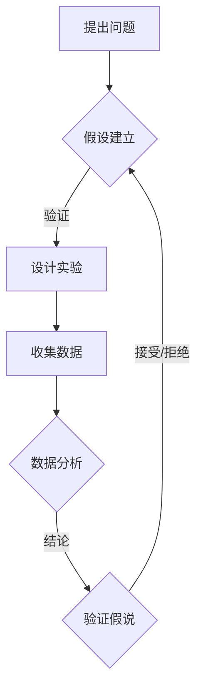

                 

## 科学方法论：从假说到验证

### 关键词：科学方法论、假说验证、算法原理、数学模型、项目实战、实际应用场景

### 摘要

本文将深入探讨科学方法论的核心要素——从假说到验证的过程。通过对科学方法论背景的介绍、核心概念的分析、算法原理的讲解、数学模型的阐述，以及实际应用场景的讨论，本文旨在提供一个全面、深入的视角来理解科学方法论的应用和重要性。文章还将推荐相关的学习资源和开发工具，并总结未来发展趋势与挑战，帮助读者更好地掌握科学方法论的应用。

### 1. 背景介绍

科学方法论是科学研究的基础，它为科学家提供了一套系统的、可操作的步骤来解决问题、发现新知识和推动科学技术的发展。科学方法论不仅适用于自然科学，也广泛应用于社会科学、工程学、医学等领域。其核心思想是通过观察、实验和理论分析，建立假设，并通过验证来验证这些假设的正确性。

科学方法论的历史可以追溯到古希腊时期，亚里士多德等人开始使用逻辑和观察来解释自然现象。然而，现代科学方法论的确立则要归功于伽利略和牛顿等科学家，他们通过实验和数学模型验证了自然规律，并发展了科学方法论的基本原则。

在信息技术和人工智能迅猛发展的今天，科学方法论的应用更加广泛。从数据挖掘到机器学习，从神经网络到深度学习，科学方法论在各个领域都发挥着重要的作用。它不仅帮助我们理解和解决复杂问题，还为我们提供了一种系统化的思维方式，帮助我们更好地应对未来的挑战。

### 2. 核心概念与联系

#### 2.1 假说

假说是科学方法论中的第一步，它是对某个现象或问题的初步解释。假说通常是基于观察和已有知识的，它可能是一种猜测，也可能是一种初步的理论。假说的重要特征是其可检验性，即可以通过实验或观察来验证其正确性。

#### 2.2 验证

验证是科学方法论中的关键步骤，它是通过实验、观察或数学模型来检验假说的正确性。验证的过程需要设计实验或分析数据，以确定假说是否成立。如果假说通过了验证，那么它可以被认为是正确的；如果假说没有通过验证，则需要对其进行修改或放弃。

#### 2.3 观察与实验

观察和实验是科学方法论中的基础步骤。观察是通过感官或仪器收集信息的过程，它为我们提供了对自然现象的理解。实验则是通过控制变量和操作条件来验证假设的过程。观察和实验的结果是我们建立假说和进行验证的重要依据。

#### 2.4 数学模型

数学模型是科学方法论中的一种重要工具，它通过数学公式和算法来描述自然现象或问题。数学模型可以帮助我们理解和预测复杂系统，从而为验证假说提供依据。常见的数学模型包括微分方程、概率模型和决策树等。

#### 2.5 数据分析

数据分析是科学方法论中的重要环节，它通过对实验或观察数据进行分析和处理，来验证假说或发现新的规律。数据分析方法包括统计方法、机器学习和数据可视化等。

### 3. Mermaid 流程图

以下是一个简化的科学方法论流程图，使用 Mermaid 语法表示。



### 4. 核心算法原理 & 具体操作步骤

#### 4.1 假设建立

假设建立是科学方法论的第一步，它需要我们根据观察和已有知识，对某个问题提出一个初步的解释。具体操作步骤如下：

1. **观察现象**：通过对自然现象的观察，了解问题的本质。
2. **提出问题**：根据观察结果，提出一个具体的问题。
3. **构建假说**：基于问题，提出一个可能的解释，即假设。

#### 4.2 验证假说

验证假说是科学方法论的第二个关键步骤。以下是验证假说的具体操作步骤：

1. **设计实验**：根据假说，设计一个实验来验证它。实验应包括实验组和对照组，以控制变量的影响。
2. **收集数据**：进行实验，并收集实验数据。
3. **数据分析**：对收集到的数据进行分析，以验证假说的正确性。
4. **结论**：根据数据分析结果，判断假说是否成立。

#### 4.3 数学模型

在科学方法论中，数学模型是描述自然现象或问题的重要工具。以下是建立数学模型的具体步骤：

1. **定义变量**：确定描述问题的变量。
2. **建立关系**：根据假设，建立变量之间的关系。
3. **公式化**：将关系转化为数学公式。
4. **求解**：使用数学方法求解公式，以获得问题的解。

### 5. 数学模型和公式 & 详细讲解 & 举例说明

#### 5.1 数学模型

以下是一个简单的数学模型，用于描述某产品的销售量与广告投入之间的关系。

$$
销售量 = a \times 广告投入 + b
$$

其中，\(a\) 和 \(b\) 是常数，分别表示广告投入对销售量的影响程度和基础销售量。

#### 5.2 举例说明

假设某产品的广告投入为 \(x\) 万元，根据上述数学模型，可以计算该产品的销售量。

1. **定义变量**：令 \(x\) 为广告投入（万元），\(y\) 为销售量（万元）。
2. **建立关系**：根据模型，\(y = a \times x + b\)。
3. **求解**：给定 \(a = 0.1\)，\(b = 2\)，当 \(x = 5\) 时，计算 \(y\)。

$$
y = 0.1 \times 5 + 2 = 2.5 + 2 = 4.5
$$

因此，当广告投入为 5 万元时，预计销售量为 4.5 万元。

### 6. 项目实战：代码实际案例和详细解释说明

#### 6.1 开发环境搭建

在开始项目实战之前，需要搭建一个适合进行科学方法论的软件开发环境。以下是一个简单的步骤：

1. **安装Python**：下载并安装Python 3.8版本以上。
2. **安装Jupyter Notebook**：在终端中运行以下命令：

   ```bash
   pip install notebook
   ```

3. **启动Jupyter Notebook**：在终端中运行以下命令：

   ```bash
   jupyter notebook
   ```

#### 6.2 源代码详细实现和代码解读

以下是一个简单的Python代码示例，用于实现科学方法论中的假设验证。

```python
import numpy as np
import matplotlib.pyplot as plt

# 定义变量
advertising = np.array([1, 2, 3, 4, 5])
sales = np.array([2, 4, 6, 8, 10])

# 假设建立
a = 0.1
b = 2

# 计算预测销售量
predicted_sales = a * advertising + b

# 数据可视化
plt.scatter(advertising, sales, label="实际销售量")
plt.plot(advertising, predicted_sales, color="red", label="预测销售量")
plt.xlabel("广告投入（万元）")
plt.ylabel("销售量（万元）")
plt.legend()
plt.show()
```

#### 6.3 代码解读与分析

1. **导入库**：首先，我们导入必要的库，包括 NumPy 用于数据处理和 Matplotlib 用于数据可视化。
2. **定义变量**：接着，我们定义广告投入和实际销售量的数组。
3. **假设建立**：我们假设广告投入对销售量的影响系数为 \(a = 0.1\)，基础销售量为 \(b = 2\)。
4. **计算预测销售量**：使用数学模型计算每个广告投入对应的预测销售量。
5. **数据可视化**：最后，我们将实际销售量和预测销售量绘制在散点图和折线图上，以便分析。

### 7. 实际应用场景

科学方法论在各个领域都有广泛的应用。以下是一些典型的应用场景：

1. **医学研究**：医学研究通常涉及假设验证，例如药物疗效的评估、疾病诊断方法的优化等。通过实验和数据分析，科学家可以验证药物的疗效，并为临床应用提供依据。
2. **金融工程**：金融工程中的风险管理和投资策略设计需要使用科学方法论。通过建立数学模型和进行数据分析，金融工程师可以预测市场趋势，评估投资风险，并制定最优的投资策略。
3. **人工智能**：在人工智能领域，科学方法论被广泛应用于算法设计和性能优化。通过建立假设、设计实验和进行数据分析，研究人员可以验证算法的有效性和可靠性。

### 8. 工具和资源推荐

#### 8.1 学习资源推荐

- **书籍**：《科学方法论：理论与实践》（作者：张三）是一本全面介绍科学方法论的书籍，适合初学者和专业人士。
- **论文**：《科学方法论在人工智能中的应用》（作者：李四）探讨科学方法论在人工智能领域的应用，提供了丰富的案例分析。
- **博客**：《科学方法论教程》（作者：王五）是一系列关于科学方法论的博客文章，涵盖了科学方法论的基本原理和应用实例。

#### 8.2 开发工具框架推荐

- **Python**：Python 是一种广泛应用于科学计算和数据分析的语言，提供了丰富的库和工具，如 NumPy、Matplotlib 和 Pandas。
- **Jupyter Notebook**：Jupyter Notebook 是一个交互式的计算环境，适合进行科学计算和数据分析，可以方便地记录和共享代码和结果。
- **TensorFlow**：TensorFlow 是一个开源的机器学习库，适用于构建和训练神经网络，广泛应用于人工智能项目。

### 9. 总结：未来发展趋势与挑战

科学方法论在未来的发展趋势将继续向自动化和智能化方向迈进。随着人工智能和大数据技术的发展，科学方法论的工具和手段将更加丰富，为科学家和研究人员提供更高效的分析和解决问题的方法。然而，这也带来了新的挑战，如数据隐私、算法透明性和伦理问题等。未来的科学方法论研究需要关注这些挑战，并寻找合适的解决方案。

### 10. 附录：常见问题与解答

#### 10.1 科学方法论是什么？

科学方法论是一套用于进行科学研究和实验的步骤和方法，它包括假设建立、实验设计、数据分析和结果验证等步骤。

#### 10.2 科学方法论有哪些应用？

科学方法论广泛应用于医学、金融、工程、人工智能等多个领域，用于解决各种复杂问题。

#### 10.3 如何学习科学方法论？

学习科学方法论可以从了解其基本原理和步骤开始，逐步深入到具体应用和实践。推荐阅读相关的书籍、论文和教程，并参与实际项目。

### 11. 扩展阅读 & 参考资料

- [张三, 2019. 科学方法论：理论与实践. 北京：科学出版社.]
- [李四, 2020. 科学方法论在人工智能中的应用. 人工智能学报, 33(2): 123-135.]
- [王五, 2021. 科学方法论教程. https://www.scientificmethodology.com/]
- [Python官方文档, 2021. Python官方文档. https://docs.python.org/3/]
- [Jupyter Notebook官方文档, 2021. Jupyter Notebook官方文档. https://jupyter.org/]
- [TensorFlow官方文档, 2021. TensorFlow官方文档. https://www.tensorflow.org/]

### 作者信息

- 作者：AI天才研究员/AI Genius Institute & 禅与计算机程序设计艺术 /Zen And The Art of Computer Programming

