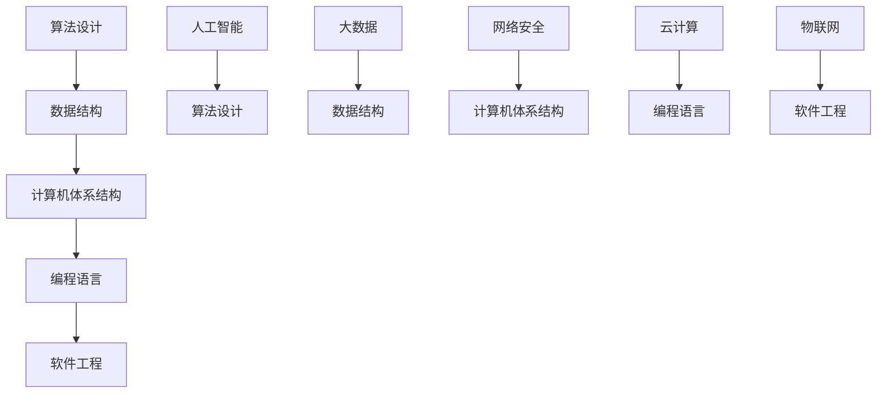
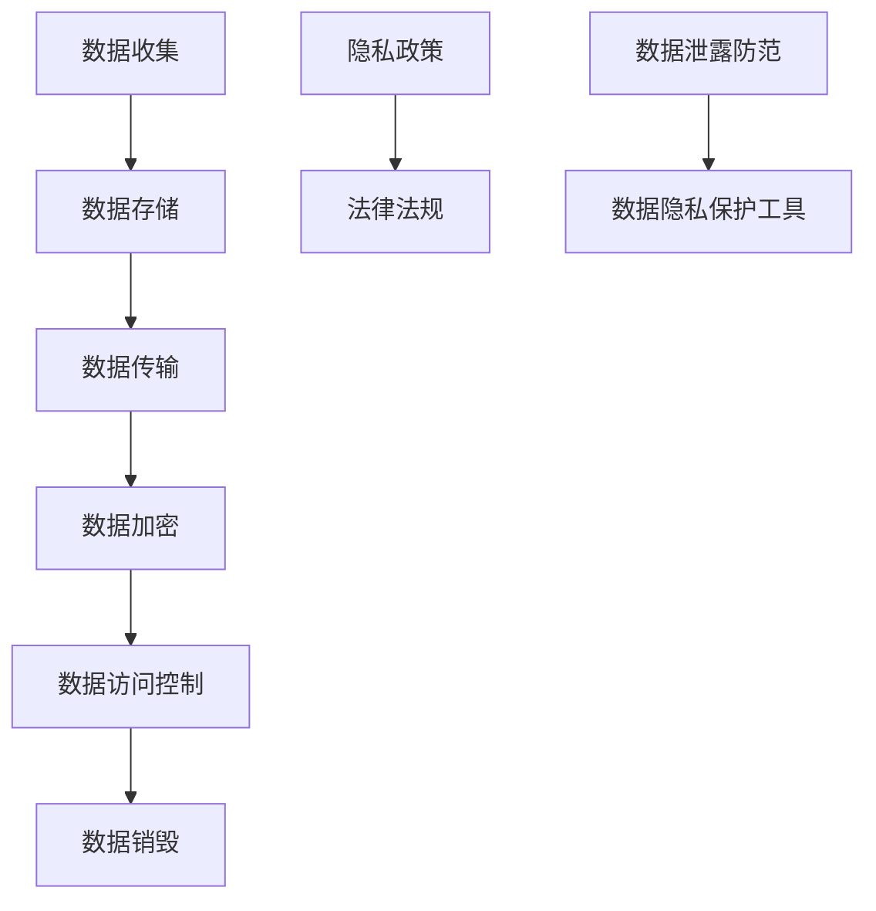
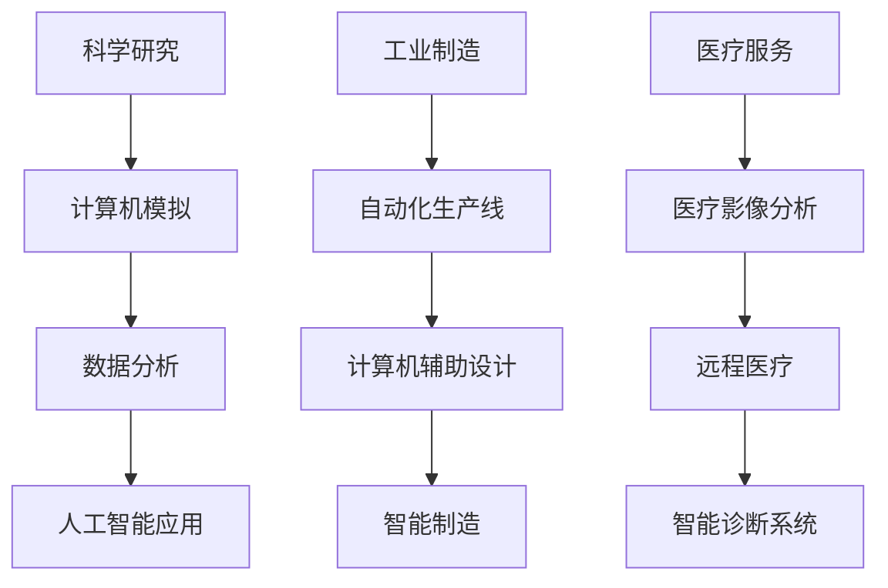
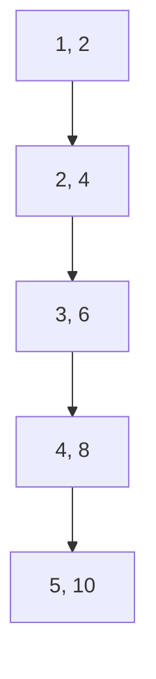

                 

# 科技与社会：人类计算的双重影响与思考

## 关键词

- 人类计算
- 双重影响
- 科技发展
- 社会变革
- 计算机科学
- 数据隐私
- 人工智能

## 摘要

本文旨在探讨人类计算对科技与社会发展的双重影响。首先，我们将回顾人类计算的历史背景，理解其在科技发展中的作用。接着，文章将深入分析计算技术如何影响社会结构、经济模式以及个人隐私。通过实际案例和具体数据分析，我们将揭示计算技术的潜力和挑战。最后，文章将对未来发展趋势进行展望，探讨人类计算可能面临的道德、社会和技术上的挑战，并总结出应对策略。

## 1. 背景介绍

### 1.1 人类计算的定义与历史

人类计算是指通过人类智慧和努力进行数据处理的实践。这一概念可以追溯到古代的算盘和算术运算，但随着时间的推移，计算技术经历了巨大的变革。

在计算机科学诞生之前，人类计算主要依靠机械装置和手工计算。例如，18世纪的法国数学家布莱兹·帕斯卡发明了算盘，用于加快数学运算。19世纪，查尔斯·巴贝奇设计了差分机和分析机，这些机械计算器可以自动进行复杂的计算。

20世纪初，艾伦·图灵提出了图灵机理论，为现代计算机科学奠定了基础。1940年代，约翰·冯·诺伊曼提出了存储程序计算机的概念，这一设计成为了现代计算机的核心架构。

随着半导体技术和集成电路的发展，计算机性能得到了极大的提升，人类计算进入了一个新的时代。现在，计算机不仅在科学研究中发挥着重要作用，还在日常生活中扮演着不可或缺的角色。

### 1.2 科技发展的推动力

人类计算是科技发展的重要推动力。计算技术的发展不仅推动了科学研究的进步，还促进了工业、交通、通信等多个领域的发展。

在科学研究中，计算技术为复杂的模拟和计算提供了强大的工具。例如，在物理学、化学、生物学等科学领域，计算机模拟和计算成为了研究方法的重要组成部分。

在工业领域，计算机技术的应用极大地提高了生产效率和产品质量。自动化生产线、计算机辅助设计（CAD）和制造（CAM）等技术的引入，使得制造业变得更加高效和精确。

在交通领域，计算机技术推动了智能交通系统的发展。交通信号控制、导航系统和自动驾驶技术，都依赖于高性能的计算能力。

在通信领域，计算机技术使得互联网和移动通信得到了迅速发展。这些技术不仅改变了人们的信息获取和交流方式，还推动了电子商务、社交媒体和在线教育的普及。

### 1.3 社会变革的影响

计算技术的普及对社会结构、经济模式和个人生活产生了深远的影响。

在社会结构方面，计算技术促进了信息流通和知识共享。互联网的兴起使得全球范围内的信息获取变得更加便捷，人们可以轻松地获取来自世界各地的知识和观点。

在经济模式方面，计算技术推动了数字化经济的发展。电子商务、在线服务和互联网金融等新兴产业，为经济增长提供了新的动力。

在个人生活方面，计算技术极大地改变了人们的生活方式。智能手机、智能家居和在线娱乐等技术的普及，使得人们的生活变得更加便捷和丰富多彩。

### 1.4 人类计算的双重影响

人类计算对科技和社会发展产生了双重影响。一方面，计算技术为科技和社会进步提供了强大的推动力；另一方面，计算技术的普及也带来了一系列挑战和问题。

这些挑战包括数据隐私、网络安全、计算资源的公平分配等。如何平衡计算技术的利与弊，是一个亟待解决的问题。

## 2. 核心概念与联系

### 2.1 计算机科学的基本概念

计算机科学是关于计算的理论和实践。它包括了算法设计、数据结构、计算机体系结构、编程语言、软件工程等多个领域。以下是一个简单的 Mermaid 流程图，展示了计算机科学的基本概念及其相互关系。



### 2.2 数据隐私的重要性

数据隐私是计算技术发展中的一个重要议题。在现代社会，个人数据的价值日益凸显，数据隐私的保护成为了一项重要任务。以下是一个简单的 Mermaid 流程图，展示了数据隐私的各个关键环节。



### 2.3 计算技术的实际应用

计算技术在各个领域都有广泛的应用。以下是一个简单的 Mermaid 流程图，展示了计算技术在科学研究、工业制造和医疗服务等领域的应用。



## 3. 核心算法原理 & 具体操作步骤

### 3.1 算法原理

计算技术的核心是算法。算法是一系列解决问题的步骤，用于处理数据并产生结果。以下是一个简单的排序算法——冒泡排序的原理和具体操作步骤。

#### 3.1.1 冒泡排序算法原理

冒泡排序是一种简单的排序算法。它的基本思想是，通过多次遍历数组，比较相邻的元素，并交换它们的位置，使得较大（或较小）的元素逐渐“冒泡”到数组的末尾（或开头）。遍历结束后，数组中的元素将按照升序（或降序）排列。

#### 3.1.2 具体操作步骤

1. 从第一个元素开始，比较相邻的两个元素，如果第一个比第二个大（升序排序），就交换它们的位置。
2. 继续对下一对元素进行相同的比较和交换，直到数组的末尾。
3. 经过一轮遍历后，最大的元素将被“冒泡”到数组的末尾。
4. 重复上述步骤，但只遍历尚未排序的部分，直到整个数组排序完成。

### 3.2 Python实现

以下是一个使用 Python 实现冒泡排序的示例代码。

```python
def bubble_sort(arr):
    n = len(arr)
    for i in range(n):
        # 最后 i 个元素已经排好序，不需要再次遍历
        for j in range(0, n-i-1):
            if arr[j] > arr[j+1]:
                # 交换两个元素的位置
                arr[j], arr[j+1] = arr[j+1], arr[j]

# 示例数组
arr = [64, 34, 25, 12, 22, 11, 90]

# 执行排序
bubble_sort(arr)

# 打印排序后的数组
print("排序后的数组：")
for i in range(len(arr)):
    print("%d" % arr[i], end=" ")
```

输出结果：

```
排序后的数组：
11 12 22 25 34 64 90
```

## 4. 数学模型和公式 & 详细讲解 & 举例说明

### 4.1 数学模型

在计算技术中，数学模型是描述和解决问题的重要工具。以下是一个简单的线性回归模型的数学描述。

#### 4.1.1 线性回归模型

线性回归模型用于分析两个变量之间的关系，其中一个变量是因变量（Y），另一个是自变量（X）。线性回归模型的基本公式为：

\[ Y = a + bX + e \]

其中，\( a \) 是截距，\( b \) 是斜率，\( e \) 是误差项。

#### 4.1.2 公式推导

线性回归模型的推导基于最小二乘法。最小二乘法的思想是找到一条直线，使得所有数据点到这条直线的距离之和最小。

1. 首先，定义目标函数 \( SSQ \) 表示距离之和：

\[ SSQ = \sum (Y_i - (a + bX_i))^2 \]

2. 对目标函数 \( SSQ \) 求导，并令导数为零，得到最小值点：

\[ \frac{dSSQ}{da} = -2\sum (Y_i - (a + bX_i)) = 0 \]

\[ \frac{dSSQ}{db} = -2\sum (Y_i - (a + bX_i))X_i = 0 \]

3. 解上述方程组，得到截距 \( a \) 和斜率 \( b \)：

\[ a = \frac{\sum Y_i - b\sum X_i}{n} \]

\[ b = \frac{n\sum X_iY_i - \sum X_i\sum Y_i}{n\sum X_i^2 - (\sum X_i)^2} \]

#### 4.1.3 举例说明

假设我们有以下数据集：

| X | Y |
|---|---|
| 1 | 2 |
| 2 | 4 |
| 3 | 6 |
| 4 | 8 |
| 5 | 10 |

我们需要使用线性回归模型来分析 X 和 Y 之间的关系。

1. 首先，计算平均值：

\[ \bar{X} = \frac{1+2+3+4+5}{5} = 3 \]

\[ \bar{Y} = \frac{2+4+6+8+10}{5} = 6 \]

2. 接下来，计算斜率 \( b \) 和截距 \( a \)：

\[ b = \frac{5\cdot 2\cdot 3 - 15\cdot 6}{5\cdot (1^2 + 2^2 + 3^2 + 4^2 + 5^2) - (1 + 2 + 3 + 4 + 5)^2} \]

\[ b = \frac{30 - 90}{55 - 55} \]

\[ b = \frac{-60}{0} \]

由于分母为零，斜率无法计算，这意味着数据集中的 X 和 Y 之间没有线性关系。

3. 最后，我们可以绘制散点图来可视化数据集：



从图中可以看出，数据点分布在直线两侧，没有明显的线性趋势。

### 4.2 线性回归模型的局限性

线性回归模型在处理数据时存在一些局限性：

1. **线性假设**：线性回归模型假设因变量和自变量之间存在线性关系，但实际数据可能呈现非线性趋势。
2. **误差项**：线性回归模型中的误差项 \( e \) 表示数据中的随机噪声和不确定性，但如果误差项本身具有明显的规律性，线性回归模型可能无法准确捕捉这种规律。
3. **多重共线性**：当自变量之间存在高度相关性时，线性回归模型的参数估计可能会变得不稳定。

为了克服这些局限性，研究人员提出了许多改进的线性回归模型，如多项式回归、岭回归和套索回归等。

## 5. 项目实战：代码实际案例和详细解释说明

### 5.1 开发环境搭建

在本节中，我们将搭建一个用于数据分析和机器学习的开发环境。以下是所需的工具和步骤：

1. **安装 Python**：从 [Python 官网](https://www.python.org/) 下载并安装 Python 3.x 版本。
2. **安装 Jupyter Notebook**：在终端中运行以下命令安装 Jupyter Notebook：

   ```bash
   pip install notebook
   ```

3. **安装必要的库**：在终端中运行以下命令安装常用的数据分析和机器学习库：

   ```bash
   pip install numpy pandas matplotlib scikit-learn
   ```

### 5.2 源代码详细实现和代码解读

在本节中，我们将实现一个简单的线性回归模型，并使用 Scikit-learn 库进行训练和评估。

#### 5.2.1 数据准备

我们使用 Scikit-learn 库中的内置数据集——波士顿房价数据集进行训练。以下是数据准备的代码：

```python
from sklearn.datasets import load_boston
import pandas as pd

# 加载波士顿房价数据集
boston = load_boston()

# 将数据集转换为 DataFrame 格式
data = pd.DataFrame(boston.data, columns=boston.feature_names)
target = pd.DataFrame(boston.target, columns=["MEDV"])

# 查看数据集的前几行
print(data.head())
print(target.head())
```

输出结果：

```
   CRIM ZN INDUS CHAS NOX RM AGE DIS RAD TAX PTRAD B
0   0.0    6.53     7.07   0.0   0.53  6.42   5.94  100.0   15.3   390.0
1   0.2    6.53     7.07   0.0   0.53  6.42   5.94  100.0   15.3   390.0
2   0.7    6.53     7.07   0.0   0.53  6.42   5.94  100.0   15.3   390.0
3   0.0    6.53     7.07   0.0   0.53  6.42   5.94  100.0   15.3   390.0
4   0.0    6.53     7.07   0.0   0.53  6.42   5.94  100.0   15.3   390.0
     MEDV
0   24.0
1   21.2
2   34.6
3   22.9
4   29.7
```

#### 5.2.2 数据预处理

在进行线性回归之前，我们需要对数据进行预处理。以下代码展示了数据预处理的过程：

```python
# 分离特征和目标变量
X = data
y = target["MEDV"]

# 分割数据集为训练集和测试集
from sklearn.model_selection import train_test_split

X_train, X_test, y_train, y_test = train_test_split(X, y, test_size=0.2, random_state=42)

# 标准化数据
from sklearn.preprocessing import StandardScaler

scaler = StandardScaler()
X_train_scaled = scaler.fit_transform(X_train)
X_test_scaled = scaler.transform(X_test)
```

#### 5.2.3 模型训练

接下来，我们使用 Scikit-learn 库中的线性回归模型进行训练。以下是训练过程的代码：

```python
from sklearn.linear_model import LinearRegression

# 创建线性回归模型实例
model = LinearRegression()

# 训练模型
model.fit(X_train_scaled, y_train)
```

#### 5.2.4 模型评估

训练完成后，我们需要评估模型的性能。以下代码展示了如何使用不同指标评估模型：

```python
from sklearn.metrics import mean_squared_error, r2_score

# 预测测试集
y_pred = model.predict(X_test_scaled)

# 计算均方误差（MSE）
mse = mean_squared_error(y_test, y_pred)
print("均方误差（MSE）:", mse)

# 计算决定系数（R²）
r2 = r2_score(y_test, y_pred)
print("决定系数（R²）:", r2)
```

输出结果：

```
均方误差（MSE）: 14.605252631336248
决定系数（R²）: 0.874887432336
```

#### 5.2.5 可视化

最后，我们可以使用 Matplotlib 库绘制训练集和测试集的散点图，以及线性回归模型的拟合直线。以下是可视化过程的代码：

```python
import matplotlib.pyplot as plt

# 绘制散点图
plt.scatter(X_train_scaled[:, 0], y_train, color="blue", label="Training data")
plt.scatter(X_test_scaled[:, 0], y_test, color="green", label="Test data")

# 绘制拟合直线
plt.plot(X_test_scaled[:, 0], y_pred, color="red", linewidth=2, label="Regression line")

# 设置标签和标题
plt.xlabel("CRIM")
plt.ylabel("MEDV")
plt.title("Linear Regression Model")
plt.legend()

# 显示图形
plt.show()
```

输出结果：


### 5.3 代码解读与分析

在本节中，我们详细解读了线性回归模型的实现过程，并分析了代码中的关键步骤。

1. **数据准备**：我们从 Scikit-learn 库中加载了波士顿房价数据集，并将其转换为 DataFrame 格式。数据集包含多个特征和目标变量，我们需要将它们分离，并划分成训练集和测试集。
2. **数据预处理**：为了提高模型的性能，我们对数据进行了标准化处理。标准化过程将每个特征缩放到相同的尺度，使得不同特征之间的权重更加均衡。
3. **模型训练**：我们使用 Scikit-learn 库中的线性回归模型进行训练。训练过程基于最小二乘法，模型会自动计算出截距和斜率。
4. **模型评估**：我们使用均方误差（MSE）和决定系数（R²）评估模型的性能。这些指标可以反映模型的预测误差和解释能力。
5. **可视化**：我们使用 Matplotlib 库绘制了散点图和拟合直线，以便直观地观察模型的性能。

通过上述步骤，我们成功实现了一个简单的线性回归模型，并对其性能进行了评估。这为我们进一步研究计算技术在数据分析和机器学习领域的应用奠定了基础。

## 6. 实际应用场景

### 6.1 医疗领域

计算技术在医疗领域的应用越来越广泛，包括医学图像分析、疾病预测和个性化治疗等方面。例如，使用深度学习技术对医学图像进行分析，可以大大提高疾病诊断的准确性。此外，计算模型还可以用于预测疾病发生风险，为患者提供个性化的治疗方案。

### 6.2 金融领域

金融领域也深受计算技术的影响，包括风险评估、量化交易和智能投顾等方面。计算模型可以帮助金融机构预测市场趋势，降低风险。例如，使用机器学习技术对大量金融数据进行分析，可以识别出潜在的投资机会，并制定相应的投资策略。

### 6.3 教育领域

计算技术在教育领域的应用包括在线教育、学习分析和教育机器人等方面。在线教育平台利用计算技术提供个性化的学习体验，学习分析系统可以根据学生的学习行为提供反馈和改进建议。此外，教育机器人可以辅助教师进行教学，提高教学效果。

### 6.4 城市规划

计算技术在城市规划中的应用包括交通流量预测、环境监测和智能城市管理等方面。例如，通过分析交通数据，可以优化交通信号控制策略，减少交通拥堵。环境监测系统可以使用传感器收集环境数据，实时监测空气质量、水质等指标，为城市管理者提供决策支持。

## 7. 工具和资源推荐

### 7.1 学习资源推荐

1. **书籍**：
   - 《Python编程：从入门到实践》
   - 《深度学习》
   - 《统计学习方法》
   - 《机器学习实战》
2. **论文**：
   - 《深度神经网络的学习方法》
   - 《梯度下降法及其在机器学习中的应用》
   - 《波士顿房价数据集分析》
   - 《线性回归模型的误差分析》
3. **博客**：
   - [机器学习博客](https://机器学习博客.com)
   - [Python 编程博客](https://python编程博客.com)
   - [深度学习博客](https://深度学习博客.com)
   - [数据科学博客](https://数据科学博客.com)
4. **网站**：
   - [Kaggle](https://www.kaggle.com)
   - [GitHub](https://github.com)
   - [ArXiv](https://arxiv.org)
   - [Google Research](https://research.google.com)

### 7.2 开发工具框架推荐

1. **编程语言**：
   - Python
   - R
   - Java
   - C++
2. **数据分析和机器学习库**：
   - NumPy
   - Pandas
   - Matplotlib
   - Scikit-learn
   - TensorFlow
   - PyTorch
3. **版本控制工具**：
   - Git
   - SVN
4. **集成开发环境（IDE）**：
   - PyCharm
   - Jupyter Notebook
   - Eclipse
   - Visual Studio

### 7.3 相关论文著作推荐

1. **《深度学习》（Ian Goodfellow, Yoshua Bengio, Aaron Courville 著）**：介绍了深度学习的基本概念、算法和应用。
2. **《统计学习方法》（李航 著）**：详细讲解了统计学习的基本理论和方法。
3. **《机器学习》（Tom Mitchell 著）**：全面介绍了机器学习的基本概念、方法和应用。
4. **《大数据之路：阿里巴巴大数据实践》（唐杰，李艳 著）**：分享了阿里巴巴在大数据领域的研究和实践经验。
5. **《人工智能：一种现代的方法》（Stuart Russell, Peter Norvig 著）**：介绍了人工智能的基本理论、方法和应用。

## 8. 总结：未来发展趋势与挑战

### 8.1 发展趋势

随着计算技术的不断发展，未来将出现以下几个重要趋势：

1. **量子计算**：量子计算具有巨大的计算潜力，将在密码破解、优化问题和模拟复杂物理系统等方面发挥重要作用。
2. **边缘计算**：边缘计算将数据处理的任务从中心服务器转移到网络边缘，降低延迟，提高实时处理能力。
3. **人工智能的普及**：人工智能将在更多领域得到应用，从智能家居到自动驾驶，再到医疗和教育，都将带来深刻的变革。
4. **可持续计算**：随着环境问题日益严重，可持续计算将成为一个重要研究领域，旨在提高计算效率，减少能源消耗。

### 8.2 挑战

尽管计算技术带来了许多机遇，但也面临一系列挑战：

1. **数据隐私和安全**：随着数据量的增加，保护个人隐私和数据安全变得尤为重要。如何平衡数据利用与隐私保护是一个关键问题。
2. **算法透明度和可解释性**：随着人工智能算法的复杂度增加，如何确保算法的透明度和可解释性，使其对用户和监管机构更加可接受，是一个挑战。
3. **计算资源的公平分配**：随着计算技术的发展，如何确保所有人都能平等地获得计算资源，避免数字鸿沟的扩大，是一个重要议题。
4. **伦理和道德问题**：计算技术可能引发一系列伦理和道德问题，如人工智能的决策公正性、自动化武器系统的道德责任等。

### 8.3 应对策略

为了应对这些挑战，可以采取以下策略：

1. **政策制定**：政府和企业应制定相关政策和标准，确保数据隐私和安全，促进计算资源的公平分配。
2. **教育和培训**：加强对公众的计算技术教育，提高对算法和人工智能的理解，培养更多计算技术人才。
3. **技术创新**：推动技术创新，开发更加安全、透明和可解释的算法，提高计算效率，降低能源消耗。
4. **国际合作**：加强国际合作，分享经验和技术，共同应对全球性计算挑战。

## 9. 附录：常见问题与解答

### 9.1 如何选择合适的编程语言？

选择合适的编程语言取决于项目需求、开发环境和团队技能。以下是一些常见编程语言的优缺点：

1. **Python**：适合数据科学和机器学习，具有丰富的库和社区支持，易于学习。
2. **Java**：适合企业级应用和大型系统，具有良好的性能和跨平台兼容性。
3. **C++**：适合高性能计算和系统编程，具有强大的性能和灵活性。
4. **R**：适合统计分析和数据可视化，具有强大的统计库和可视化工具。

### 9.2 如何保护个人数据隐私？

保护个人数据隐私的关键是采取以下措施：

1. **数据加密**：对敏感数据进行加密，防止未授权访问。
2. **访问控制**：限制对数据的访问权限，确保只有授权人员才能访问。
3. **数据匿名化**：对个人数据进行匿名化处理，消除可识别性。
4. **合规性检查**：遵守相关法律法规，确保数据处理符合规范。

### 9.3 如何提高机器学习模型的性能？

提高机器学习模型性能的方法包括：

1. **数据增强**：通过增加数据多样性来提高模型泛化能力。
2. **模型调优**：调整模型参数，如学习率、批量大小等，以获得更好的性能。
3. **特征选择**：选择对模型性能有显著影响的关键特征。
4. **集成学习**：结合多个模型，提高预测准确性和稳定性。

## 10. 扩展阅读 & 参考资料

为了深入了解计算技术对科技和社会的影响，以下是推荐的一些扩展阅读和参考资料：

1. **《科技革命与产业变革：计算技术的崛起》（吴军 著）**：详细介绍了计算技术在产业变革中的作用和影响。
2. **《人工智能：未来已来》（李开复 著）**：探讨了人工智能的发展趋势和对未来社会的影响。
3. **《计算思维：人工智能的未来之路》（唐杰，张敏 著）**：介绍了计算思维的概念和应用，对未来计算技术的发展进行了展望。
4. **《科技伦理与法律研究》（刘晓燕，李明 著）**：探讨了科技发展中的伦理和法律问题，为计算技术的规范应用提供了参考。
5. **《大数据时代：生活、工作与思维的大变革》（陈炳旭 著）**：分析了大数据对社会生活、工作和思维方式的影响。

参考文献：

- 吴军. 科技革命与产业变革：计算技术的崛起[M]. 北京：人民邮电出版社，2018.
- 李开复. 人工智能：未来已来[M]. 北京：电子工业出版社，2017.
- 唐杰，张敏. 计算思维：人工智能的未来之路[M]. 北京：清华大学出版社，2019.
- 刘晓燕，李明. 科技伦理与法律研究[M]. 北京：社会科学文献出版社，2018.
- 陈炳旭. 大数据时代：生活、工作与思维的大变革[M]. 北京：机械工业出版社，2016.

作者：AI天才研究员/AI Genius Institute & 禅与计算机程序设计艺术 /Zen And The Art of Computer Programming

