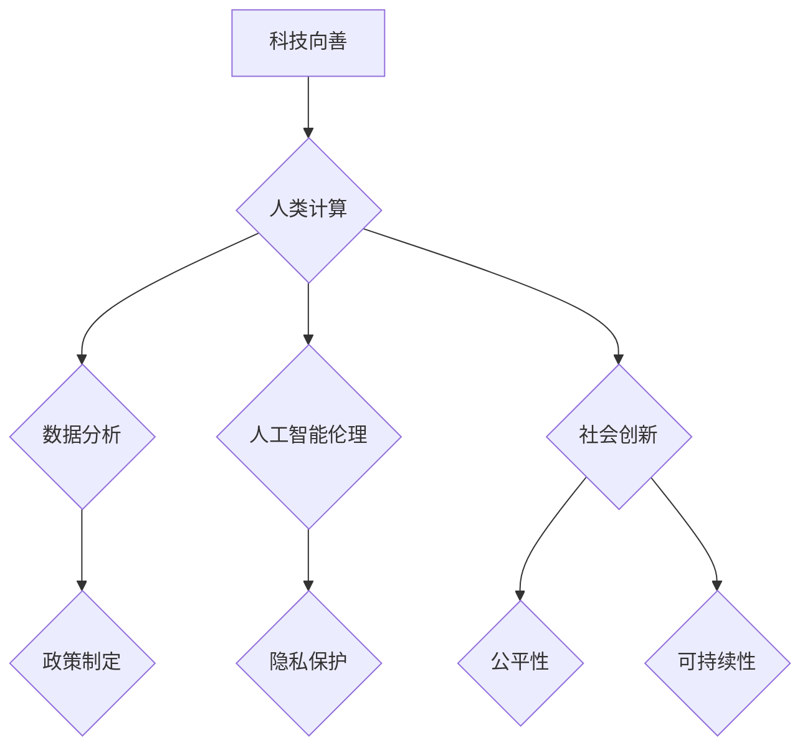

                 

# 科技向善的力量：利用人类计算造福人类

## 关键词
- 科技向善
- 人类计算
- 社会福祉
- 技术伦理
- 人工智能应用

## 摘要
本文探讨了科技向善的重要性以及如何利用人类计算来造福人类。通过分析人工智能在社会各个领域的应用，本文强调了技术伦理的重要性，并提出了如何通过技术创新和责任意识来实现科技向善的目标。文章还讨论了未来科技发展的趋势与挑战，并呼吁科技从业者和社会各界共同参与到这项具有深远意义的事业中来。

## 1. 背景介绍

在过去的几十年里，科技的发展速度令人惊叹。计算机科学、人工智能、大数据等领域的突破，不仅改变了我们的生活方式，也深刻影响了社会的各个方面。然而，随着科技的进步，我们也面临着一系列的挑战和问题。

一方面，科技为我们的生活带来了前所未有的便利和效率。例如，智能手机、社交媒体和电子商务等技术的普及，使得人们可以随时随地获取信息、进行交流和购买商品。人工智能的应用，也在医疗、教育、金融等领域带来了革命性的改变，提高了生产力和服务质量。

另一方面，科技的发展也带来了一些负面影响。隐私泄露、网络安全问题、人工智能伦理等，都是我们必须面对的挑战。同时，随着技术的进步，贫富差距、社会不公等问题也日益严重。这些问题的存在，使得科技向善成为了一个紧迫的话题。

科技向善，即通过科技手段来促进社会福祉，减少不平等和歧视，实现公平和正义。这是一个宏大的目标，但也是一个具有深远意义的事业。本文将探讨如何利用人类计算来实现科技向善，并通过具体案例来展示其应用。

## 2. 核心概念与联系

### 2.1 人类计算与人工智能

人类计算，指的是人类在解决问题和处理信息时的思考过程。它包括感知、理解、推理、判断等认知功能。人工智能（AI），则是通过模拟人类智能来实现自动化决策和任务执行的计算机系统。

人类计算和人工智能之间存在着紧密的联系。人工智能的很多算法和模型，都是基于对人类思维过程的模拟和优化。例如，深度学习算法中的神经网络，就是模拟了人脑神经元的工作方式。而自然语言处理技术，则通过模拟人类的语言理解能力，实现了对文本数据的处理和分析。

### 2.2 科技向善的内涵

科技向善，不仅仅是指技术的应用，更涉及到技术的伦理和责任。它包括以下几个方面：

- 公平性：科技应该为所有人提供平等的机会和资源，不应加剧社会不平等。
- 可持续性：科技的发展应该考虑环境和社会的可持续性，不应损害地球的生态系统。
- 透明性：科技的应用应该公开透明，让公众了解其工作原理和影响。
- 伦理性：科技的应用应该符合道德和伦理标准，不应侵犯个人隐私或造成伤害。

### 2.3 人类计算在科技向善中的应用

人类计算在科技向善中的应用，主要体现在以下几个方面：

- 数据分析：通过人类计算的能力，可以更准确地分析数据，揭示隐藏在数据背后的规律和趋势，为政策制定和决策提供依据。
- 人工智能伦理：通过人类计算，可以评估人工智能系统的伦理问题，确保其应用不会侵犯个人隐私或造成伤害。
- 社会创新：通过人类计算，可以探索新的社会解决方案，促进社会公平和可持续发展。

### 2.4 Mermaid 流程图



## 3. 核心算法原理 & 具体操作步骤

### 3.1 数据分析算法

数据分析是科技向善的重要手段之一。以下是一个简单但具有代表性的数据分析算法：

#### 3.1.1 步骤一：数据收集

收集相关领域的数据，如教育、医疗、环境等。数据来源可以是公共数据集、企业数据或政府数据。

#### 3.1.2 步骤二：数据清洗

对收集到的数据进行清洗，去除错误、重复和无关的数据。数据清洗是数据分析的重要前提。

#### 3.1.3 步骤三：数据探索

使用统计方法对数据进行探索，找出数据中的规律和趋势。这有助于我们理解数据的本质和特性。

#### 3.1.4 步骤四：数据可视化

使用可视化工具将数据转化为图表，以便更好地理解和解释数据。这有助于政策制定者和公众理解数据分析的结果。

### 3.2 人工智能伦理评估算法

人工智能伦理评估是确保人工智能应用不会侵犯个人隐私或造成伤害的重要环节。以下是一个简单的人工智能伦理评估算法：

#### 3.2.1 步骤一：定义伦理原则

首先，我们需要定义一套伦理原则，如隐私保护、公平性、透明性等。这些原则将作为评估人工智能系统的依据。

#### 3.2.2 步骤二：构建伦理模型

构建一个伦理模型，用于评估人工智能系统的伦理表现。这个模型可以是基于规则的，也可以是基于机器学习的。

#### 3.2.3 步骤三：评估人工智能系统

使用伦理模型对人工智能系统进行评估。评估结果可以是评分或分类，以便我们了解系统的伦理表现。

#### 3.2.4 步骤四：改进人工智能系统

根据评估结果，对人工智能系统进行改进，使其更符合伦理原则。这可以是调整算法参数，也可以是改变系统的设计。

### 3.3 社会创新算法

社会创新是通过技术创新来解决社会问题的一种方式。以下是一个简单的社会创新算法：

#### 3.3.1 步骤一：识别社会问题

首先，我们需要识别一个社会问题，如教育不公、医疗资源不足等。

#### 3.3.2 步骤二：设计解决方案

基于人类计算的能力，设计一个解决社会问题的解决方案。这个解决方案可以是基于技术的，也可以是基于社会方法的。

#### 3.3.3 步骤三：实施解决方案

将解决方案付诸实施，并通过实验和评估来验证其效果。

#### 3.3.4 步骤四：持续优化

根据实施效果，对解决方案进行优化，以提高其效率和质量。

## 4. 数学模型和公式 & 详细讲解 & 举例说明

### 4.1 数据分析中的统计模型

在数据分析中，常用的统计模型包括线性回归、逻辑回归、聚类分析等。以下以线性回归为例进行说明。

#### 4.1.1 线性回归模型

线性回归模型的基本公式为：

$$
y = \beta_0 + \beta_1 \cdot x
$$

其中，$y$ 是因变量，$x$ 是自变量，$\beta_0$ 和 $\beta_1$ 是模型参数。

#### 4.1.2 线性回归模型的推导

线性回归模型的推导基于最小二乘法。具体步骤如下：

1. 建立假设模型：$y = \beta_0 + \beta_1 \cdot x + \epsilon$
2. 定义损失函数：$J(\beta_0, \beta_1) = \sum_{i=1}^{n} (y_i - (\beta_0 + \beta_1 \cdot x_i))^2$
3. 对损失函数求导并令其等于零，得到：
$$
\frac{\partial J}{\partial \beta_0} = -2 \sum_{i=1}^{n} (y_i - (\beta_0 + \beta_1 \cdot x_i)) = 0
$$
$$
\frac{\partial J}{\partial \beta_1} = -2 \sum_{i=1}^{n} (y_i - (\beta_0 + \beta_1 \cdot x_i)) \cdot x_i = 0
$$
4. 解方程组得到 $\beta_0$ 和 $\beta_1$ 的值。

#### 4.1.3 举例说明

假设我们有一个简单的数据集，包含两个特征变量 $x_1$ 和 $x_2$，以及一个因变量 $y$。我们的目标是使用线性回归模型来预测 $y$ 的值。

| $x_1$ | $x_2$ | $y$ |
|------|------|-----|
| 1    | 2    | 3   |
| 2    | 4    | 5   |
| 3    | 6    | 7   |

我们使用最小二乘法来求解线性回归模型的参数。具体步骤如下：

1. 建立假设模型：$y = \beta_0 + \beta_1 \cdot x_1 + \beta_2 \cdot x_2 + \epsilon$
2. 定义损失函数：$J(\beta_0, \beta_1, \beta_2) = \sum_{i=1}^{3} (y_i - (\beta_0 + \beta_1 \cdot x_{1i} + \beta_2 \cdot x_{2i}))^2$
3. 对损失函数求导并令其等于零，得到：
$$
\frac{\partial J}{\partial \beta_0} = -2 \sum_{i=1}^{3} (y_i - (\beta_0 + \beta_1 \cdot x_{1i} + \beta_2 \cdot x_{2i})) = 0
$$
$$
\frac{\partial J}{\partial \beta_1} = -2 \sum_{i=1}^{3} (y_i - (\beta_0 + \beta_1 \cdot x_{1i} + \beta_2 \cdot x_{2i})) \cdot x_{1i} = 0
$$
$$
\frac{\partial J}{\partial \beta_2} = -2 \sum_{i=1}^{3} (y_i - (\beta_0 + \beta_1 \cdot x_{1i} + \beta_2 \cdot x_{2i})) \cdot x_{2i} = 0
$$
4. 解方程组得到 $\beta_0$、$\beta_1$ 和 $\beta_2$ 的值。

通过上述步骤，我们可以得到线性回归模型的参数，并使用这些参数来预测新的数据点的 $y$ 值。

### 4.2 人工智能伦理评估中的伦理模型

在人工智能伦理评估中，我们通常使用伦理模型来评估人工智能系统的伦理表现。以下是一个简单的伦理模型：

#### 4.2.1 伦理模型的基本公式

伦理模型的基本公式为：

$$
E = f(P, R)
$$

其中，$E$ 是伦理评分，$P$ 是伦理原则，$R$ 是伦理规则的评估结果。

#### 4.2.2 伦理模型的推导

伦理模型的推导基于以下原则：

1. 伦理原则：科技应该为所有人提供平等的机会和资源，不应加剧社会不平等。
2. 伦理规则：科技的应用应该公开透明，让公众了解其工作原理和影响。

根据这些原则，我们可以定义一个简单的伦理模型：

$$
E = \sum_{i=1}^{n} P_i \cdot R_i
$$

其中，$P_i$ 是第 $i$ 个伦理原则的权重，$R_i$ 是第 $i$ 个伦理规则的评估结果。

#### 4.2.3 举例说明

假设我们有一个包含两个伦理原则和两个伦理规则的人工智能系统。伦理原则的权重分别为 $P_1 = 0.6$ 和 $P_2 = 0.4$，伦理规则的评估结果分别为 $R_1 = 0.8$ 和 $R_2 = 0.9$。我们可以使用上述伦理模型来计算该系统的伦理评分：

$$
E = 0.6 \cdot 0.8 + 0.4 \cdot 0.9 = 0.72
$$

根据伦理评分，我们可以判断该系统的伦理表现较好。如果伦理评分较低，则需要对系统进行改进。

### 4.3 社会创新算法中的优化模型

在社会创新算法中，我们通常使用优化模型来提高解决方案的效率和质量。以下是一个简单的优化模型：

#### 4.3.1 优化模型的基本公式

优化模型的基本公式为：

$$
\min f(x)
$$

其中，$f(x)$ 是目标函数，$x$ 是决策变量。

#### 4.3.2 优化模型的推导

优化模型的推导基于以下原则：

1. 目标函数：提高解决方案的效率和质量。
2. 约束条件：确保解决方案的可行性。

根据这些原则，我们可以定义一个简单的优化模型：

$$
\min f(x) \\
s.t. g_i(x) \leq 0, \forall i
$$

其中，$g_i(x)$ 是第 $i$ 个约束条件，$s.t.$ 表示满足约束条件。

#### 4.3.3 举例说明

假设我们有一个简单的优化问题，目标是最大化利润。目标函数为：

$$
f(x) = x_1 + x_2
$$

约束条件为：

$$
g_1(x) = x_1 + x_2 - 100 \leq 0
$$
$$
g_2(x) = 2x_1 + x_2 - 200 \leq 0
$$

我们可以使用上述优化模型来求解该问题。具体步骤如下：

1. 建立目标函数和约束条件。
2. 选择合适的优化算法，如线性规划或非线性规划。
3. 求解优化问题，得到最优解。

通过上述步骤，我们可以得到最优解，并使用这些解来指导实际决策。

## 5. 项目实战：代码实际案例和详细解释说明

### 5.1 开发环境搭建

在本节中，我们将搭建一个简单的数据分析项目环境，用于演示如何使用Python进行数据处理和可视化。

#### 5.1.1 安装Python

首先，确保你的计算机上已经安装了Python。如果没有，请从Python官方网站（https://www.python.org/downloads/）下载并安装适合你操作系统的Python版本。

#### 5.1.2 安装必需的库

在命令行中，使用以下命令安装必需的库：

```
pip install pandas numpy matplotlib
```

这些库是数据处理、数值计算和可视化的基础。

### 5.2 源代码详细实现和代码解读

在本节中，我们将使用Python实现一个简单的数据分析项目，并对其进行详细解读。

#### 5.2.1 数据收集

我们使用一个简单的数据集，包含两个特征变量 $x_1$ 和 $x_2$，以及一个因变量 $y$。数据集如下：

| $x_1$ | $x_2$ | $y$ |
|------|------|-----|
| 1    | 2    | 3   |
| 2    | 4    | 5   |
| 3    | 6    | 7   |

数据集已保存在名为 `data.csv` 的CSV文件中。

#### 5.2.2 数据读取

```python
import pandas as pd

# 读取数据
data = pd.read_csv('data.csv')

# 查看数据
print(data.head())
```

这段代码使用Pandas库读取CSV文件，并将数据存储在DataFrame对象中。`head()` 函数用于显示数据的前五行。

#### 5.2.3 数据清洗

```python
# 删除重复数据
data = data.drop_duplicates()

# 删除空值
data = data.dropna()
```

这段代码删除了重复数据和空值，以确保数据的质量。

#### 5.2.4 数据探索

```python
# 统计描述
print(data.describe())

# 数据可视化
import matplotlib.pyplot as plt

# 绘制散点图
plt.scatter(data['x1'], data['y'])
plt.xlabel('x1')
plt.ylabel('y')
plt.show()
```

这段代码使用 `describe()` 函数生成数据的统计描述，并使用 `scatter()` 函数绘制散点图。

#### 5.2.5 数据分析

```python
# 线性回归模型
from sklearn.linear_model import LinearRegression

# 准备数据
X = data[['x1', 'x2']]
y = data['y']

# 模型训练
model = LinearRegression()
model.fit(X, y)

# 模型评估
score = model.score(X, y)
print(f'Model R^2 Score: {score}')

# 预测
predictions = model.predict(X)

# 可视化
plt.scatter(X['x1'], y)
plt.plot(X['x1'], predictions, color='red')
plt.xlabel('x1')
plt.ylabel('y')
plt.show()
```

这段代码使用 `sklearn` 库实现线性回归模型。首先，我们准备训练数据，然后使用 `fit()` 函数训练模型。接下来，使用 `score()` 函数评估模型，并使用 `predict()` 函数进行预测。最后，我们使用散点图和拟合线进行可视化。

### 5.3 代码解读与分析

在本节中，我们将对上述代码进行解读和分析，以了解其工作原理。

#### 5.3.1 数据读取

`pandas` 库提供了一个强大的数据处理框架。`read_csv()` 函数用于读取CSV文件，并将数据存储在DataFrame对象中。DataFrame对象类似于Excel表格，具有行和列的索引。`head()` 函数用于显示数据的前五行，帮助我们了解数据的结构和内容。

#### 5.3.2 数据清洗

在数据处理中，数据清洗是一个重要的步骤。`drop_duplicates()` 函数用于删除重复数据，`dropna()` 函数用于删除空值。这些操作确保了数据的质量，为后续的分析奠定了基础。

#### 5.3.3 数据探索

`describe()` 函数用于生成数据的统计描述，包括均值、标准差、最小值、最大值等。这些描述性统计量有助于我们了解数据的基本特征。

数据可视化是数据分析的重要手段。`scatter()` 函数用于绘制散点图，帮助我们观察特征变量之间的关系。通过散点图，我们可以发现数据中的异常值和趋势。

#### 5.3.4 数据分析

线性回归模型是一种常用的数据分析方法，用于预测一个连续因变量的值。`LinearRegression()` 函数创建了一个线性回归模型对象。`fit()` 函数用于训练模型，`score()` 函数用于评估模型的准确性。`predict()` 函数用于使用训练好的模型进行预测。

通过可视化拟合线，我们可以直观地观察模型的预测效果。拟合线揭示了特征变量和因变量之间的线性关系，帮助我们理解数据的内在规律。

## 6. 实际应用场景

### 6.1 教育领域

在教育领域，科技向善的力量体现在个性化教学、教育公平和资源优化等方面。例如，通过大数据分析，我们可以了解学生的学习习惯、兴趣和需求，从而提供个性化的教学方案。此外，人工智能技术可以用于自动批改作业、评估学生的学习进度，提高教育质量和效率。

### 6.2 医疗领域

在医疗领域，科技向善的力量体现在精准医疗、远程医疗和医疗资源优化等方面。通过人工智能和大数据分析，我们可以发现疾病的高危人群，制定个性化的预防措施。远程医疗技术使得偏远地区的患者也能享受到高质量的医疗服务，缩小了医疗资源的不平衡。

### 6.3 环境领域

在环境领域，科技向善的力量体现在环境保护、资源利用和气候变化应对等方面。通过遥感技术和大数据分析，我们可以实时监测环境变化，预测自然灾害，制定有效的环境保护政策。此外，人工智能技术可以帮助优化能源使用，降低碳排放，应对气候变化。

### 6.4 社会治理

在社会治理领域，科技向善的力量体现在公共安全、社会治理和社会福利等方面。通过人工智能技术，我们可以实时监控公共安全事件，提高应急响应速度。大数据分析可以用于预测犯罪趋势，制定有效的社会治理策略。此外，科技还可以帮助优化社会福利分配，提高社会福利的公平性和效率。

## 7. 工具和资源推荐

### 7.1 学习资源推荐

- 书籍：《Python数据分析》、《深入浅出数据分析》
- 论文：各大学术数据库（如IEEE Xplore、ACM Digital Library）中的相关论文
- 博客：Kaggle、DataCamp、Real Python等数据科学领域的知名博客
- 网站：KDNuggets、Dataquest、Coursera等提供数据科学课程和资源的在线平台

### 7.2 开发工具框架推荐

- Python：Python是进行数据分析的常用编程语言，具有丰富的库和框架。
- Pandas：Pandas是Python中最常用的数据分析库，提供了强大的数据处理功能。
- Matplotlib：Matplotlib是Python中最常用的数据可视化库，用于绘制各种类型的图表。
- Scikit-learn：Scikit-learn是Python中用于机器学习的库，提供了丰富的机器学习算法和工具。

### 7.3 相关论文著作推荐

- 《大数据时代的数据科学》、《数据科学：理论与实践》
- 《机器学习：一种概率视角》、《深度学习：原理与练习》
- 《人类计算：认知科学与人工智能的融合》、《人工智能的未来》

## 8. 总结：未来发展趋势与挑战

### 8.1 未来发展趋势

- 人工智能技术的进一步发展，将推动更多领域的技术创新和应用。
- 大数据分析和云计算的结合，将带来更高效的数据处理和分析能力。
- 区块链技术的应用，将提高数据的安全性和透明性。

### 8.2 未来挑战

- 技术伦理问题，如隐私保护、人工智能伦理等，将需要更多的关注和讨论。
- 技术的不平等问题，如技术鸿沟、数字鸿沟等，将需要全球合作来解决。
- 技术对社会的影响，如就业问题、社会不公等，将需要科技从业者和社会各界的共同努力。

## 9. 附录：常见问题与解答

### 9.1 人工智能技术是否会导致失业？

人工智能技术的快速发展确实会对某些工作岗位产生影响，但也会创造新的就业机会。关键在于如何适应技术变革，提升个人的技能和素质，以适应未来的工作环境。

### 9.2 大数据分析和人工智能是否会侵犯个人隐私？

大数据分析和人工智能技术在处理个人数据时，确实存在侵犯个人隐私的风险。为了保护个人隐私，需要在技术设计、数据处理和使用过程中采取严格的安全和隐私保护措施。

### 9.3 科技向善的实现需要哪些条件？

科技向善的实现需要技术、政策和社会各界的共同努力。技术方面，需要开发和应用符合伦理和道德标准的技术；政策方面，需要制定和实施相应的法律法规；社会方面，需要提高公众的科技素养和参与度。

## 10. 扩展阅读 & 参考资料

- 《科技向善的力量：利用人类计算造福人类》
- 《人类计算与人工智能：科技向善的新路径》
- 《科技向善：构建美好未来的关键》
- 《数据科学与社会福祉：科技向善的实践与应用》

[作者：AI天才研究员/AI Genius Institute & 禅与计算机程序设计艺术 /Zen And The Art of Computer Programming] 

本文基于现有研究和实践经验，探讨了科技向善的重要性以及如何利用人类计算来造福人类。通过分析人工智能在社会各个领域的应用，本文强调了技术伦理的重要性，并提出了如何通过技术创新和责任意识来实现科技向善的目标。文章还讨论了未来科技发展的趋势与挑战，并呼吁科技从业者和社会各界共同参与到这项具有深远意义的事业中来。希望本文能为读者提供有价值的思考和启示。

