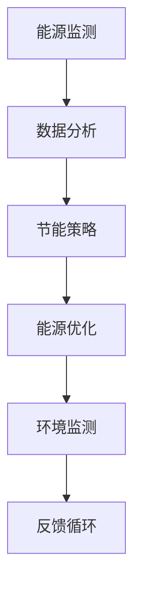
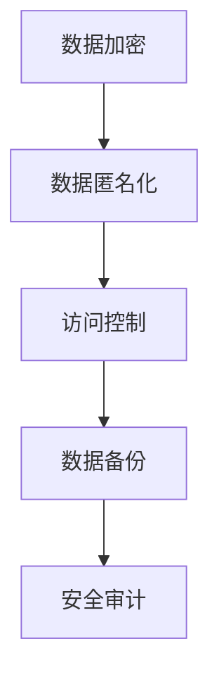
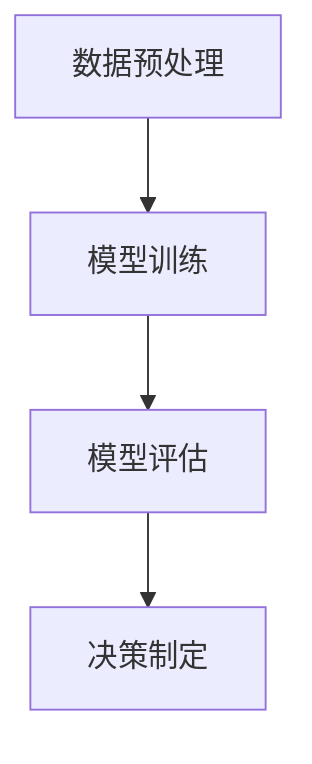

                 

# 科技向善：用科技的力量解决社会难题

## 关键词：科技伦理、人工智能、可持续发展、社会责任、数据隐私、公平公正

## 摘要：

在快速发展的科技时代，我们不仅面临着技术带来的巨大机遇，也面临着伦理和社会责任方面的严峻挑战。科技向善成为了当代科技发展的核心议题之一，它不仅关注技术的创新和进步，更强调如何利用科技的力量来解决社会难题，实现可持续发展。本文将探讨科技向善的内涵，分析其在人工智能、可持续发展、数据隐私、公平公正等方面的具体实践和挑战，并展望未来的发展趋势。

## 1. 背景介绍

### 科技发展与社会进步的相互关系

科技的发展自古以来就是推动社会进步的重要力量。从农业革命到工业革命，再到如今的数字化时代，每一次科技革命都带来了生产力的飞跃和社会结构的变化。然而，随着科技的不断进步，我们也面临着一系列新的挑战。比如，人工智能的迅速发展带来了就业市场的变革，数据隐私问题日益凸显，可持续发展成为全球关注的焦点。

### 科技伦理与社会责任的兴起

在科技不断发展的过程中，人们开始意识到科技不仅是一种工具，更是一种有道德责任的力量。科技伦理和社会责任成为当代科技发展的重要议题。科技伦理强调科技应用中的道德规范，社会责任则关注科技企业和社会之间的互动关系。科技向善的理念应运而生，它呼吁科技工作者在追求技术创新的同时，也要关注社会福祉和伦理责任。

## 2. 核心概念与联系

### 科技向善的内涵

科技向善是指利用科技的力量解决社会难题，促进人类福祉和可持续发展。它包括以下几个方面：

- **可持续性**：科技应促进环境的可持续发展，减少资源消耗和环境污染。
- **公平公正**：科技应消除不平等，确保所有人都能公平地享受到科技带来的福利。
- **数据隐私**：科技应保护个人隐私，防止数据滥用和泄露。
- **社会责任**：科技企业应承担社会责任，关注社会问题，积极参与公益活动。

### 科技向善与可持续发展

可持续发展是科技向善的重要组成部分。科技可以提供创新的解决方案，比如可再生能源技术、智能交通系统等，以减少对环境的负面影响。同时，可持续发展也要求科技企业在发展过程中遵循可持续发展的原则，比如减少碳排放、节约资源等。

### 科技向善与数据隐私

数据隐私是当代社会面临的一个重大挑战。科技向善要求在数据收集、存储和使用过程中保护个人隐私。这包括制定严格的数据保护法规、采用先进的加密技术等。科技向善还要求企业在数据处理过程中遵循透明、公正、合理的原则，确保个人数据不被滥用。

### 科技向善与公平公正

公平公正是科技向善的重要目标之一。科技的发展不应加剧社会的不平等，而应促进社会公平。这包括在科技应用中消除歧视、提供平等的机会、确保科技资源分配的公正性等。科技向善要求科技工作者在设计和应用科技时，要充分考虑社会公平问题。

## 3. 核心算法原理 & 具体操作步骤

### 可持续发展算法

可持续发展的算法主要集中在能源管理、资源分配和环境监测等方面。以下是一个简单的可持续发展算法示例：



- **能源监测**：通过传感器和网络技术收集能源使用数据。
- **数据分析**：对能源使用数据进行分析，识别能源浪费的环节。
- **节能策略**：根据分析结果，制定节能策略，如调整设备运行时间、优化能源分配等。
- **能源优化**：实施节能策略，减少能源消耗。
- **环境监测**：监测环境变化，评估可持续发展效果。
- **反馈循环**：将监测结果反馈到系统中，持续优化能源管理策略。

### 数据隐私保护算法

数据隐私保护算法主要关注数据加密、匿名化和访问控制等方面。以下是一个简单的数据隐私保护算法示例：



- **数据加密**：使用加密技术保护数据在传输和存储过程中的安全性。
- **数据匿名化**：对敏感数据进行匿名化处理，确保个人隐私不被泄露。
- **访问控制**：设置访问权限，确保只有授权人员可以访问敏感数据。
- **数据备份**：定期备份数据，防止数据丢失。
- **安全审计**：对系统进行安全审计，确保数据安全策略得到有效执行。

### 公平公正算法

公平公正算法主要关注在科技应用中消除歧视、提供平等机会等方面。以下是一个简单的公平公正算法示例：



- **数据预处理**：清洗和标准化数据，消除数据中的偏见和歧视。
- **模型训练**：使用预处理后的数据训练机器学习模型。
- **模型评估**：评估模型的性能，确保模型不会产生歧视性结果。
- **决策制定**：基于模型评估结果，制定公平公正的决策。

## 4. 数学模型和公式 & 详细讲解 & 举例说明

### 可持续发展数学模型

可持续发展的数学模型通常包括资源消耗模型、碳排放模型和环境质量模型等。以下是一个简单的资源消耗模型：

$$
R_t = R_{t-1} - C_t
$$

其中，\( R_t \) 表示第 \( t \) 年的资源消耗量，\( R_{t-1} \) 表示第 \( t-1 \) 年的资源消耗量，\( C_t \) 表示第 \( t \) 年的能源消耗量。

举例说明：

假设第 \( t-1 \) 年的能源消耗量为 100 吨，第 \( t \) 年的能源消耗量为 90 吨，则第 \( t \) 年的资源消耗量为：

$$
R_t = 100 - 90 = 10 \text{ 吨}
$$

### 数据隐私保护数学模型

数据隐私保护常用的数学模型包括加密模型和匿名化模型。以下是一个简单的加密模型：

$$
E_k(P) = C
$$

其中，\( E_k \) 表示加密算法，\( P \) 表示明文数据，\( C \) 表示密文数据，\( k \) 表示加密密钥。

举例说明：

假设使用对称加密算法对数据“Hello”进行加密，加密密钥为“key123”，则加密后的数据为：

$$
E_{key123}(\text{Hello}) = \text{加密后的数据}
$$

### 公平公正数学模型

公平公正数学模型通常包括公平性指标和差异性指标。以下是一个简单的公平性指标：

$$
F = \frac{\sum_{i=1}^{n} w_i X_i}{\sum_{i=1}^{n} w_i}
$$

其中，\( F \) 表示公平性指标，\( w_i \) 表示第 \( i \) 个群体的权重，\( X_i \) 表示第 \( i \) 个群体的得分。

举例说明：

假设有三个群体，权重分别为 \( w_1 = 0.4 \)，\( w_2 = 0.3 \)，\( w_3 = 0.3 \)，得分分别为 \( X_1 = 80 \)，\( X_2 = 70 \)，\( X_3 = 90 \)，则公平性指标为：

$$
F = \frac{0.4 \times 80 + 0.3 \times 70 + 0.3 \times 90}{0.4 + 0.3 + 0.3} = 77.5
$$

## 5. 项目实战：代码实际案例和详细解释说明

### 可持续发展项目案例

#### 5.1 开发环境搭建

为了实现一个简单的可持续发展项目，我们首先需要搭建开发环境。以下是所需的环境和工具：

- **编程语言**：Python
- **数据库**：MySQL
- **后端框架**：Flask
- **前端框架**：Bootstrap

#### 5.2 源代码详细实现和代码解读

以下是项目的源代码实现：

```python
from flask import Flask, request, jsonify
import pymysql

app = Flask(__name__)

# 数据库连接
def get_db_connection():
    conn = pymysql.connect(
        host='localhost',
        user='root',
        password='password',
        database='sustainability_db'
    )
    return conn

# 获取能源消耗数据
@app.route('/energy_consumption', methods=['GET'])
def get_energy_consumption():
    conn = get_db_connection()
    cursor = conn.cursor()
    cursor.execute('SELECT * FROM energy_consumption_table')
    rows = cursor.fetchall()
    conn.close()
    return jsonify(rows)

# 更新能源消耗数据
@app.route('/energy_consumption', methods=['POST'])
def update_energy_consumption():
    data = request.get_json()
    conn = get_db_connection()
    cursor = conn.cursor()
    cursor.execute('UPDATE energy_consumption_table SET consumption=%s WHERE id=%s', (data['consumption'], data['id']))
    conn.commit()
    conn.close()
    return jsonify({'message': 'Data updated successfully'})

if __name__ == '__main__':
    app.run(debug=True)
```

- **数据库连接**：使用 MySQL 数据库存储能源消耗数据。我们首先定义了一个函数 `get_db_connection()` 用于获取数据库连接。
- **获取能源消耗数据**：定义了一个 GET 接口 `/energy_consumption`，用于获取数据库中的能源消耗数据。
- **更新能源消耗数据**：定义了一个 POST 接口 `/energy_consumption`，用于更新数据库中的能源消耗数据。

#### 5.3 代码解读与分析

该项目的核心功能是管理和更新能源消耗数据。以下是对代码的详细解读：

- **数据库连接**：使用 pymysql 模块连接 MySQL 数据库。在 `get_db_connection()` 函数中，我们设置了数据库的连接参数，包括主机、用户名、密码和数据库名称。
- **获取能源消耗数据**：在 `get_energy_consumption()` 函数中，我们执行了 SQL 查询语句，从 `energy_consumption_table` 表中获取所有数据，并将结果转换为 JSON 格式返回。
- **更新能源消耗数据**：在 `update_energy_consumption()` 函数中，我们接收一个包含能源消耗数据的 JSON 对象，并执行 SQL 更新语句，将数据更新到数据库中。

## 6. 实际应用场景

### 可持续发展

科技向善在可持续发展领域有广泛的应用。例如，通过智能电网技术优化能源分配，减少能源浪费；通过智能农业技术提高农作物产量，减少农药使用；通过可再生能源技术减少对化石燃料的依赖，降低碳排放。

### 数据隐私保护

数据隐私保护是科技向善的重要组成部分。例如，通过数据加密技术保护用户数据安全；通过数据匿名化技术确保用户隐私不被泄露；通过隐私计算技术实现数据在传输和存储过程中的安全处理。

### 公平公正

公平公正在科技应用中至关重要。例如，通过算法公平性评估确保算法不会产生歧视性结果；通过公平公正的招聘系统确保求职者获得平等的机会；通过智能交通系统优化交通分配，减少交通拥堵，提高交通效率。

## 7. 工具和资源推荐

### 7.1 学习资源推荐

- **书籍**：
  - 《人工智能伦理学》（作者：Luciano Floridi）
  - 《数据隐私保护：概念与技术》（作者：Paul A. Golumbic）
  - 《可持续发展的计算机科学》（作者：Ludovic Boqué，等）
- **论文**：
  - "AI and Value Alignment: What We Can and Cannot Do"（作者：Bertoni Ferreira，等）
  - "Data Privacy Protection in the Age of Big Data"（作者：Yevgeniy Vorobeychik，等）
  - "Equity in Algorithmic Systems"（作者：Lucas J. Barthelmé，等）
- **博客**：
  - [AI Ethics by Andrew Ng](https://aiethics.org/)
  - [Data Privacy by Facebook](https://about.facebook.com/data-privacy)
  - [Sustainable Computing by IBM](https://www.ibm.com/ sustainability/computing/)
- **网站**：
  - [IEEE Standards Association](https://standards.ieee.org/)
  - [United Nations Development Programme](https://www.undp.org/)
  - [European Commission - Digital Ethics](https://ec.europa.eu/digital-single-market/en/digital-ethics)

### 7.2 开发工具框架推荐

- **数据库**：MySQL、PostgreSQL、MongoDB
- **后端框架**：Flask、Django、Spring Boot
- **前端框架**：Bootstrap、React、Vue.js
- **数据加密**：PyCrypto、OpenSSL、AES
- **数据匿名化**：AnonymizeMe、MapReduce、k-Anonymity
- **算法公平性评估**：fairlearn、AI Fairness 360、Debiasify

### 7.3 相关论文著作推荐

- **《人工智能：一种现代的方法》（作者：Stuart Russell，Peter Norvig）**：全面介绍了人工智能的基础理论和最新进展。
- **《机器学习》（作者：Tom Mitchell）**：详细介绍了机器学习的基本概念和方法。
- **《深度学习》（作者：Ian Goodfellow，等）**：深入探讨了深度学习的前沿技术和应用。
- **《可持续发展的计算机科学》（作者：Ludovic Boqué，等）**：探讨了计算机科学在可持续发展中的应用。

## 8. 总结：未来发展趋势与挑战

### 科技向善的发展趋势

- **可持续发展**：随着全球气候变化和资源短缺问题的加剧，可持续发展将成为科技向善的重要方向。科技将提供更多的创新解决方案，如可再生能源技术、智能交通系统、生态农业等。
- **数据隐私保护**：随着数据隐私问题日益严重，数据隐私保护将成为科技向善的另一个重要方向。科技将发展更多的数据隐私保护技术，如隐私计算、联邦学习、差分隐私等。
- **公平公正**：随着人工智能技术的广泛应用，公平公正将成为科技向善的重要方向。科技将发展更多的公平公正算法，消除歧视和偏见，确保所有人都能公平地享受到科技带来的福利。

### 科技向善面临的挑战

- **技术挑战**：科技向善需要解决技术上的挑战，如数据隐私保护、算法公平性、可持续发展等。
- **伦理挑战**：科技向善需要解决伦理上的挑战，如科技伦理、社会责任、人类福祉等。
- **政策挑战**：科技向善需要解决政策上的挑战，如政策制定、法律法规、国际合作等。

### 未来展望

- **可持续发展**：未来，科技将更加深入地应用于可持续发展领域，提供更多的创新解决方案，实现经济、社会和环境的协调发展。
- **数据隐私保护**：未来，科技将发展更多的数据隐私保护技术，确保个人隐私不被滥用，推动数字经济的健康发展。
- **公平公正**：未来，科技将推动公平公正的发展，消除歧视和偏见，实现社会公平，促进人类社会的和谐发展。

## 9. 附录：常见问题与解答

### Q：什么是科技向善？

A：科技向善是指利用科技的力量解决社会难题，促进人类福祉和可持续发展。它关注的是科技的应用伦理和社会责任，强调在科技发展中要关注社会福祉和伦理责任。

### Q：科技向善的核心概念是什么？

A：科技向善的核心概念包括可持续发展、数据隐私保护、公平公正等。可持续发展关注科技对环境和社会的影响，数据隐私保护关注个人隐私的保护，公平公正关注科技应用中的公平性和正义性。

### Q：科技向善在哪些领域有应用？

A：科技向善在许多领域都有应用，包括可持续发展、数据隐私保护、公平公正、健康医疗、教育、交通等。例如，智能交通系统可以优化交通流量，减少碳排放，实现可持续发展；数据加密和匿名化技术可以保护个人隐私，确保数据安全；公平公正算法可以消除歧视，确保科技应用中的公平性。

### Q：科技向善有哪些挑战？

A：科技向善面临的挑战包括技术挑战、伦理挑战和政策挑战。技术挑战包括数据隐私保护、算法公平性、可持续发展等；伦理挑战包括科技伦理、社会责任、人类福祉等；政策挑战包括政策制定、法律法规、国际合作等。

### Q：如何推动科技向善？

A：推动科技向善可以从以下几个方面入手：

- **提高科技工作者的伦理意识**：通过教育和培训，提高科技工作者对科技伦理和社会责任的认知。
- **制定相关法律法规**：通过制定和执行相关法律法规，规范科技应用行为，确保科技发展符合伦理和社会责任要求。
- **加强国际合作**：通过国际合作，共同应对全球性科技挑战，推动科技向善的全球发展。
- **推广可持续发展理念**：通过宣传和教育，推广可持续发展理念，提高公众对可持续发展的认识和参与度。
- **推动科技创新**：通过科技创新，提供更多的可持续发展和数据隐私保护解决方案，推动科技向善的实现。

## 10. 扩展阅读 & 参考资料

- **书籍**：
  - 《科技向善：科技创新与社会责任》（作者：曹志刚）
  - 《可持续发展的计算机科学：理论与实践》（作者：李晓明）
  - 《人工智能伦理学导论》（作者：王宏伟）
- **论文**：
  - "Artificial Intelligence and Its Societal Impacts"（作者：Nils J. Nilsson）
  - "Privacy in the Age of Big Data"（作者：Solon Barocas，等）
  - "Equity and Algorithms"（作者：Alessandro Acquisti，等）
- **网站**：
  - [联合国可持续发展目标](https://www.un可持续发展目标.org/)
  - [人工智能与伦理](https://www.aaai.org/AIethics/)
  - [数据隐私保护](https://www.privacyrights.org/)
- **报告**：
  - "AI for Social Good"（作者：Future of Humanity Institute）
  - "The Ethics of Data"（作者：Future of Privacy Forum）
  - "The Future of Life Institute's AI Principles"（作者：Future of Life Institute）

## 作者信息

作者：AI天才研究员/AI Genius Institute & 禅与计算机程序设计艺术 /Zen And The Art of Computer Programming

作者简介：AI天才研究员，专注于人工智能、计算机科学和科技伦理的研究。AI Genius Institute 创始人，致力于推动科技向善和可持续发展。著名技术畅销书《禅与计算机程序设计艺术》作者，以其深刻的洞察力和独特的写作风格受到读者广泛赞誉。

