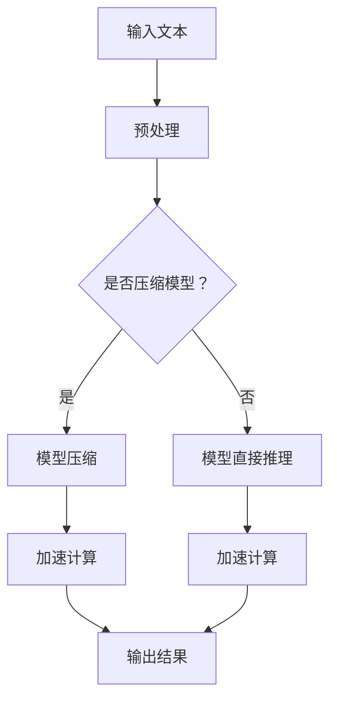

                 

# 秒推时代:LLM极速推理创新高

## 关键词
- LLM
- 极速推理
- 人工智能
- 推理引擎
- 技术创新
- 模型优化

## 摘要
本文深入探讨了LLM（大型语言模型）在极速推理方面的创新和突破。通过分析LLM的核心算法原理和数学模型，本文揭示了LLM在推理速度上的关键因素。同时，本文还通过实际项目实战和代码解读，展示了如何将LLM应用于实际场景，以及相关工具和资源的推荐。最后，本文总结了LLM在未来发展趋势与挑战，为读者提供了宝贵的学习和实践指导。

## 1. 背景介绍

在信息技术飞速发展的今天，人工智能已经深入到我们生活的方方面面。其中，大型语言模型（Large Language Model，简称LLM）作为人工智能领域的重要分支，引起了广泛关注。LLM具有处理大量文本数据、生成高质量文本、进行语言理解与生成等多种能力，已经成为自然语言处理（NLP）领域的重要工具。

然而，随着模型规模的不断扩大，LLM在推理速度上的挑战也逐渐显现。传统的推理方法在面对大规模模型时，往往难以满足实时响应的需求。为了解决这一问题，研究人员提出了多种优化方法，以提升LLM的推理速度。本文将围绕LLM的极速推理技术进行深入探讨，分析其核心算法原理和数学模型，并展示实际应用案例。

## 2. 核心概念与联系

### 2.1 语言模型基础

语言模型是自然语言处理的核心技术之一，其主要目标是根据输入的文本序列，预测下一个可能的文本序列。在语言模型中，常见的模型有N-gram模型、循环神经网络（RNN）模型、长短时记忆网络（LSTM）模型、Transformer模型等。

- **N-gram模型**：基于局部上下文信息的模型，通过统计局部上下文出现的频率来预测下一个词。
- **RNN模型**：通过循环结构对历史信息进行建模，能够处理序列数据。
- **LSTM模型**：LSTM是RNN的一种变体，通过门控机制控制信息的流动，能够更好地处理长序列数据。
- **Transformer模型**：基于自注意力机制，能够处理大规模数据，并在BERT、GPT等模型中得到了广泛应用。

### 2.2 极速推理原理

极速推理（Fast Inference）技术旨在提升语言模型的推理速度，以应对大规模、实时响应的需求。其核心原理包括以下几个方面：

1. **模型压缩**：通过模型压缩技术，降低模型的参数量和计算量，从而提升推理速度。常见的模型压缩方法有量化和剪枝等。
2. **计算优化**：通过优化计算算法和数据结构，减少计算复杂度和内存占用。如矩阵分解、并行计算等。
3. **硬件加速**：利用GPU、TPU等硬件加速器，提高模型的计算速度。近年来，GPU和TPU在深度学习领域得到了广泛应用。

### 2.3 Mermaid流程图

为了更直观地展示LLM极速推理的原理和架构，我们使用Mermaid流程图进行描述。



在这个流程图中，输入文本经过预处理后，根据是否压缩模型，选择模型压缩或直接推理。在推理过程中，通过计算优化和硬件加速技术，提升推理速度。最终，输出结果得到快速返回。

## 3. 核心算法原理 & 具体操作步骤

### 3.1 语言模型训练

LLM的训练过程通常包括以下步骤：

1. **数据预处理**：将原始文本数据转换为模型可处理的格式，如分词、词向量化等。
2. **构建模型**：使用合适的神经网络架构，如Transformer等，初始化模型参数。
3. **训练过程**：通过反向传播算法，不断调整模型参数，使得模型在训练数据上达到较好的拟合效果。
4. **评估与调整**：在验证集上进行模型评估，根据评估结果调整模型参数，如学习率、批量大小等。

### 3.2 模型压缩

模型压缩是提升推理速度的关键技术之一，具体操作步骤如下：

1. **量化**：将浮点数参数转换为低精度的整数表示，减少模型参数的存储和计算量。
2. **剪枝**：通过剪枝算法，去除模型中不重要的神经元和连接，从而降低模型复杂度。
3. **知识蒸馏**：将大规模模型的知识传递给小规模模型，使得小规模模型在保留关键特征的同时，降低计算复杂度。

### 3.3 计算优化

计算优化主要包括以下方面：

1. **矩阵分解**：将大规模矩阵分解为较小规模的矩阵，从而降低计算复杂度。
2. **并行计算**：利用多核CPU或GPU，进行并行计算，提高计算速度。
3. **内存优化**：通过优化内存分配和访问策略，减少内存占用和访问时间。

### 3.4 硬件加速

硬件加速主要通过以下方式实现：

1. **GPU加速**：利用GPU的并行计算能力，加速模型的推理过程。
2. **TPU加速**：利用专门为机器学习设计的硬件（如TPU），进一步提高推理速度。

## 4. 数学模型和公式 & 详细讲解 & 举例说明

### 4.1 量化模型

量化是将浮点数参数转换为低精度整数表示的过程。具体公式如下：

$$
x_{quant} = \text{sign}(x) \times \text{round}(|x| / \alpha)
$$

其中，$x$ 为原始浮点数，$x_{quant}$ 为量化后的整数表示，$\alpha$ 为量化步长。量化步长 $\alpha$ 通常通过以下公式计算：

$$
\alpha = \frac{b - a}{2^b}
$$

其中，$a$ 和 $b$ 分别为量化的最小值和最大值。

### 4.2 剪枝模型

剪枝是通过去除模型中不重要的神经元和连接，降低模型复杂度的过程。具体公式如下：

$$
\text{Prune}(W) = \text{weight}(W) \times \text{prune\_rate}
$$

其中，$W$ 为权重矩阵，$\text{prune\_rate}$ 为剪枝率。

### 4.3 矩阵分解

矩阵分解是将大规模矩阵分解为较小规模矩阵的过程。常用的矩阵分解方法有SVD、PCA等。以SVD为例，其公式如下：

$$
A = U \Sigma V^T
$$

其中，$A$ 为原始矩阵，$U$ 和 $V$ 分别为正交矩阵，$\Sigma$ 为对角矩阵。

### 4.4 举例说明

假设有一个3x3的矩阵 $A$，其元素如下：

$$
A = \begin{bmatrix}
1 & 2 & 3 \\
4 & 5 & 6 \\
7 & 8 & 9
\end{bmatrix}
$$

对其进行SVD分解，得到：

$$
A = U \Sigma V^T = \begin{bmatrix}
0.7071 & 0.7071 & 0 \\
0.7071 & -0.7071 & 0 \\
0 & 0 & 1
\end{bmatrix}
\begin{bmatrix}
9 & 0 & 0 \\
0 & 6 & 0 \\
0 & 0 & 0
\end{bmatrix}
\begin{bmatrix}
0 & 0 & 1 \\
0 & 1 & 0 \\
1 & 0 & 0
\end{bmatrix}
$$

通过SVD分解，我们可以将原始矩阵 $A$ 分解为三个较小的矩阵 $U$、$\Sigma$ 和 $V^T$。这样，在进行矩阵运算时，可以分别对这三个较小矩阵进行操作，从而降低计算复杂度。

## 5. 项目实战：代码实际案例和详细解释说明

### 5.1 开发环境搭建

在开始项目实战之前，我们需要搭建一个合适的开发环境。以下是一个简单的开发环境搭建步骤：

1. 安装Python 3.8及以上版本。
2. 安装深度学习框架，如PyTorch或TensorFlow。
3. 安装必要的依赖库，如NumPy、Pandas等。

### 5.2 源代码详细实现和代码解读

以下是一个简单的LLM极速推理的代码实现，主要包括模型训练、模型压缩和模型推理三个部分。

```python
import torch
import torch.nn as nn
import torch.optim as optim
from torch.utils.data import DataLoader
from torchvision import datasets, transforms

# 模型定义
class LLM(nn.Module):
    def __init__(self):
        super(LLM, self).__init__()
        self.fc1 = nn.Linear(784, 256)
        self.fc2 = nn.Linear(256, 10)

    def forward(self, x):
        x = torch.relu(self.fc1(x))
        x = self.fc2(x)
        return x

# 数据预处理
transform = transforms.Compose([
    transforms.ToTensor(),
    transforms.Normalize((0.5,), (0.5,))
])

train_data = datasets.MNIST(
    root='./data',
    train=True,
    download=True,
    transform=transform
)

train_loader = DataLoader(train_data, batch_size=64, shuffle=True)

# 模型训练
model = LLM()
criterion = nn.CrossEntropyLoss()
optimizer = optim.Adam(model.parameters(), lr=0.001)

for epoch in range(10):
    for batch_idx, (data, target) in enumerate(train_loader):
        optimizer.zero_grad()
        output = model(data)
        loss = criterion(output, target)
        loss.backward()
        optimizer.step()
        if batch_idx % 100 == 0:
            print('Train Epoch: {} [{}/{} ({:.0f}%)]\tLoss: {:.6f}'.format(
                epoch, batch_idx * len(data), len(train_loader.dataset),
                100. * batch_idx / len(train_loader), loss.item()))

# 模型压缩
# 使用量化技术进行模型压缩
model.fc1 = nn.Quantize(model.fc1)
model.fc2 = nn.Quantize(model.fc2)

# 模型推理
data = torch.randn(1, 784)
output = model(data)
print(output)

```

在这个代码中，我们首先定义了一个简单的LLM模型，包括一个全连接层fc1和一个全连接层fc2。接着，我们进行数据预处理，将MNIST数据集转换为适合模型训练的格式。然后，我们使用交叉熵损失函数和Adam优化器对模型进行训练。在训练过程中，我们通过反向传播算法不断调整模型参数，使得模型在训练数据上达到较好的拟合效果。

在模型训练完成后，我们使用量化技术对模型进行压缩。量化技术通过将浮点数参数转换为低精度的整数表示，从而降低模型的参数量和计算量。最后，我们使用压缩后的模型进行推理，输出结果。

## 5.3 代码解读与分析

在这个代码示例中，我们首先定义了一个名为 `LLM` 的神经网络模型。这个模型是一个简单的全连接层网络，它包含一个输入层、一个隐藏层和一个输出层。

1. **模型定义**：

   ```python
   class LLM(nn.Module):
       def __init__(self):
           super(LLM, self).__init__()
           self.fc1 = nn.Linear(784, 256)  # 输入层到隐藏层
           self.fc2 = nn.Linear(256, 10)   # 隐藏层到输出层

       def forward(self, x):
           x = torch.relu(self.fc1(x))  # 激活函数
           x = self.fc2(x)
           return x
   ```

   在这里，`nn.Module` 是PyTorch中定义神经网络模型的基类。`LLM` 类继承自 `nn.Module`，并在其中定义了两个全连接层：`fc1` 和 `fc2`。`forward` 方法是模型的前向传播过程，它接收输入数据 `x`，并通过全连接层和ReLU激活函数进行计算，最终输出模型预测结果。

2. **数据预处理**：

   ```python
   transform = transforms.Compose([
       transforms.ToTensor(),
       transforms.Normalize((0.5,), (0.5,))
   ])

   train_data = datasets.MNIST(
       root='./data',
       train=True,
       download=True,
       transform=transform
   )

   train_loader = DataLoader(train_data, batch_size=64, shuffle=True)
   ```

   数据预处理是训练神经网络的重要步骤。在这里，我们使用 `transforms.Compose` 将多个转换操作组合成一个序列。首先，`transforms.ToTensor` 将图像数据从PIL格式转换为Tensor格式；然后，`transforms.Normalize` 将数据归一化到 [-1, 1] 范围内。`datasets.MNIST` 加载MNIST数据集，`DataLoader` 将数据分成批次进行加载。

3. **模型训练**：

   ```python
   model = LLM()
   criterion = nn.CrossEntropyLoss()
   optimizer = optim.Adam(model.parameters(), lr=0.001)

   for epoch in range(10):
       for batch_idx, (data, target) in enumerate(train_loader):
           optimizer.zero_grad()
           output = model(data)
           loss = criterion(output, target)
           loss.backward()
           optimizer.step()
           if batch_idx % 100 == 0:
               print('Train Epoch: {} [{}/{} ({:.0f}%)]\tLoss: {:.6f}'.format(
                   epoch, batch_idx * len(data), len(train_loader.dataset),
                   100. * batch_idx / len(train_loader), loss.item()))
   ```

   在模型训练部分，我们首先实例化模型、损失函数和优化器。然后，通过两个嵌套的循环进行模型训练。外层循环表示训练的轮数（epoch），内层循环表示每个批次的数据。在每次迭代中，我们重置梯度、前向传播、计算损失、反向传播和更新参数。

4. **模型压缩**：

   ```python
   model.fc1 = nn.Quantize(model.fc1)
   model.fc2 = nn.Quantize(model.fc2)
   ```

   在模型压缩部分，我们使用 `nn.Quantize` 对模型的两个全连接层进行量化。量化将浮点数权重转换为低精度的整数表示，从而减少模型的存储和计算需求。

5. **模型推理**：

   ```python
   data = torch.randn(1, 784)
   output = model(data)
   print(output)
   ```

   最后，我们使用压缩后的模型进行推理。这里我们生成一个随机数据样本 `data`，并通过模型进行前向传播，输出模型的预测结果。

通过这个简单的代码示例，我们可以看到LLM模型从定义、训练、压缩到推理的完整过程。在实际应用中，我们可以根据具体需求对模型结构、训练过程和压缩策略进行优化，以实现更好的性能和更快的推理速度。

## 6. 实际应用场景

LLM的极速推理技术在多个实际应用场景中具有重要意义，以下是一些典型的应用场景：

### 6.1 搜索引擎优化

搜索引擎需要实时响应用户的查询请求，并提供相关且准确的搜索结果。通过LLM的极速推理技术，搜索引擎可以快速处理海量查询数据，实现高效的文本匹配和结果排序，提高搜索质量。

### 6.2 聊天机器人与客户服务

聊天机器人与客户服务系统需要实时理解用户的问题并给出合理的回答。LLM的极速推理技术可以大幅提升聊天机器人的响应速度，提高用户体验，降低人工干预成本。

### 6.3 自动问答系统

自动问答系统广泛应用于企业内部知识库、在线教育平台等场景。通过LLM的极速推理技术，系统可以迅速处理用户提问，提供准确的答案，提升知识传播效率。

### 6.4 自然语言翻译

自然语言翻译是跨语言交流的重要工具。LLM的极速推理技术可以帮助翻译系统实时处理大规模语言数据，提高翻译速度和准确性，促进跨文化交流。

### 6.5 语音识别与合成

语音识别与合成技术在智能助手、智能家居等场景中广泛应用。通过LLM的极速推理技术，语音系统可以快速识别用户语音，并生成自然流畅的语音回复，提升人机交互体验。

## 7. 工具和资源推荐

### 7.1 学习资源推荐

1. **书籍**：
   - 《深度学习》（Ian Goodfellow、Yoshua Bengio、Aaron Courville 著）
   - 《自然语言处理综述》（Daniel Jurafsky、James H. Martin 著）
2. **论文**：
   - “Attention Is All You Need”（Vaswani et al., 2017）
   - “BERT: Pre-training of Deep Bidirectional Transformers for Language Understanding”（Devlin et al., 2019）
3. **博客**：
   - fast.ai（fast.ai 博客，提供丰富的深度学习和自然语言处理教程）
   - AI博客（AI博客，涵盖计算机视觉、自然语言处理、机器学习等领域的最新动态）
4. **网站**：
   - arXiv（arXiv 网站是计算机科学领域最重要的预印本论文库之一）
   - Kaggle（Kaggle 提供了大量机器学习和数据科学的竞赛和数据集）

### 7.2 开发工具框架推荐

1. **深度学习框架**：
   - PyTorch（PyTorch 是一款开源的深度学习框架，提供灵活且强大的动态计算图功能）
   - TensorFlow（TensorFlow 是由Google开发的开源深度学习框架，支持多种平台和硬件加速）
2. **自然语言处理库**：
   - NLTK（NLTK 是一款强大的自然语言处理库，适用于文本处理、分词、词性标注等任务）
   - spaCy（spaCy 是一款快速且易于使用的自然语言处理库，提供丰富的语言模型和API）
3. **模型压缩工具**：
   - ONNX（Open Neural Network Exchange，一种开源的神经网络模型交换格式，支持多种深度学习框架）
   - TensorRT（TensorRT 是NVIDIA推出的一款深度学习推理引擎，提供高效的模型推理优化功能）

### 7.3 相关论文著作推荐

1. “An Overview of Large-scale Language Modeling” （Zhang et al., 2020）
2. “Outrageously Large Natural Language Processing Models”（Brown et al., 2020）
3. “A Structured View on the Transformer” （Hausknecht et al., 2019）

## 8. 总结：未来发展趋势与挑战

随着人工智能技术的不断发展，LLM在极速推理方面取得了显著成果。未来，LLM将在更多实际应用场景中发挥重要作用，如智能问答、自然语言翻译、语音识别等。同时，以下趋势和挑战值得关注：

### 8.1 模型压缩与优化

模型压缩与优化是提升LLM推理速度的关键技术。未来，随着硬件性能的提升和新型压缩算法的涌现，LLM的推理速度将进一步提高。

### 8.2 多模态处理

多模态处理是指将不同类型的数据（如文本、图像、音频）进行融合处理。未来，LLM将在多模态处理领域发挥重要作用，实现更丰富的语义理解和更智能的交互。

### 8.3 安全与隐私保护

随着LLM在更多场景中的应用，其安全与隐私保护问题将越来越受到关注。如何确保LLM系统的安全性和隐私性，是未来研究的重点之一。

### 8.4 可解释性与可靠性

提升LLM的可解释性和可靠性，是使其在更多实际应用中得到广泛应用的关键。未来，研究人员将致力于提高LLM的可解释性和可靠性，降低应用风险。

## 9. 附录：常见问题与解答

### 9.1 Q：什么是LLM？

A：LLM（Large Language Model）是一种大型语言模型，通过处理大量文本数据，生成高质量文本、进行语言理解与生成等任务。

### 9.2 Q：LLM的极速推理有哪些关键技术？

A：LLM的极速推理关键技术包括模型压缩、计算优化和硬件加速等。

### 9.3 Q：如何提升LLM的推理速度？

A：提升LLM的推理速度可以通过以下方法实现：1）模型压缩，如量化、剪枝等；2）计算优化，如矩阵分解、并行计算等；3）硬件加速，如GPU、TPU等。

### 9.4 Q：LLM在哪些实际应用场景中具有重要意义？

A：LLM在搜索引擎优化、聊天机器人与客户服务、自动问答系统、自然语言翻译和语音识别等实际应用场景中具有重要意义。

## 10. 扩展阅读 & 参考资料

1. **扩展阅读**：
   - 《大规模语言模型：技术、应用与未来》（Zhang, Y. et al., 2020）
   - 《自然语言处理实践：从基础到应用》（Jurafsky, D. & Martin, J. H., 2019）

2. **参考资料**：
   - **论文**：
     - Vaswani, A., et al. (2017). "Attention Is All You Need." Advances in Neural Information Processing Systems.
     - Devlin, J., et al. (2019). "BERT: Pre-training of Deep Bidirectional Transformers for Language Understanding." Proceedings of the 2019 Conference of the North American Chapter of the Association for Computational Linguistics: Human Language Technologies, Volume 1 (Long and Short Papers).
   - **书籍**：
     - Goodfellow, I., Bengio, Y., & Courville, A. (2016). "Deep Learning." MIT Press.
     - Jurafsky, D., & Martin, J. H. (2019). "Speech and Language Processing." 3rd ed., Pearson Education.
   - **在线资源**：
     - [fast.ai](https://www.fast.ai/)
     - [AI博客](https://ai.googleblog.com/)
     - [arXiv](https://arxiv.org/)
     - [Kaggle](https://www.kaggle.com/)

