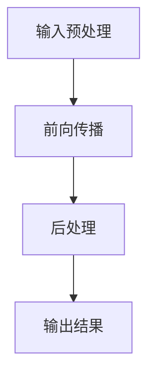

                 

# 秒推时代：LLM极速推理时代来临

## 摘要

在人工智能（AI）飞速发展的今天，大语言模型（Large Language Model，简称LLM）成为了各个领域的热门话题。本文将深入探讨LLM的极速推理技术，分析其背后的核心概念、算法原理、数学模型及应用场景，旨在为读者呈现一个全新的AI世界。通过对LLM推理技术的详细介绍和实际案例剖析，我们希望能够激发更多开发者对这一领域的关注和探索，共同迎接即将到来的秒推时代。

## 1. 背景介绍

近年来，随着深度学习技术的飞速发展，AI已经从理论研究走向了实际应用，并在多个领域取得了显著的成果。其中，自然语言处理（Natural Language Processing，简称NLP）作为AI的重要组成部分，受到了广泛关注。大语言模型（LLM）作为NLP领域的重要突破，不仅能够实现高质量的自然语言生成，还能在众多应用场景中发挥重要作用。

LLM的发展可以追溯到2018年，当时谷歌推出了BERT模型，使得NLP任务的表现大幅提升。随后，OpenAI的GPT-3模型再次刷新了人们对LLM的认知，其参数规模达到了惊人的1750亿。这些大型模型的出现，不仅推动了NLP技术的发展，也带动了整个AI领域的研究热情。

随着LLM在各个领域应用的不断拓展，如何高效地进行推理成为了亟待解决的问题。传统的推理方式在处理大规模数据时，往往需要耗费大量时间和计算资源。为了应对这一挑战，研究人员开始探索各种加速技术，使得LLM能够在短时间内完成复杂的推理任务，从而迎来了“秒推时代”。

## 2. 核心概念与联系

### 2.1 大语言模型（LLM）

大语言模型（LLM）是一种基于深度学习的自然语言处理模型，其核心思想是通过大量文本数据进行预训练，从而掌握语言的基本规律和结构。LLM的参数规模通常非常大，可以达到数十亿甚至千亿级别。

在结构上，LLM通常由多个神经网络层组成，每一层都包含了大量的参数。这些参数通过训练过程不断调整，以适应不同的NLP任务。常见的LLM模型包括BERT、GPT、T5等。

### 2.2 推理（Inference）

推理（Inference）是指基于已知的输入数据和模型参数，预测输出结果的过程。在LLM中，推理过程通常包括以下几个步骤：

1. **输入预处理**：将输入文本转换为模型可以处理的格式，如分词、词嵌入等。
2. **前向传播**：将输入数据通过模型的各个层级，计算得到输出结果。
3. **后处理**：对输出结果进行格式化、排序等操作，以得到最终的预测结果。

### 2.3 架构

为了实现高效推理，LLM的架构设计需要考虑以下几个方面：

1. **计算并行性**：通过并行计算技术，将推理任务分解为多个子任务，同时处理，以提高推理速度。
2. **内存管理**：合理分配内存资源，避免内存瓶颈，确保模型能够高效运行。
3. **模型压缩**：通过模型剪枝、量化等技术，减小模型体积，降低推理计算量。
4. **硬件加速**：利用GPU、TPU等硬件加速器，提高模型推理速度。

### Mermaid流程图



## 3. 核心算法原理 & 具体操作步骤

### 3.1 算法原理

LLM的推理算法主要基于深度学习模型，其核心原理是通过多层神经网络对输入数据进行处理，最终得到输出结果。具体来说，LLM的推理算法包括以下几个步骤：

1. **词嵌入（Word Embedding）**：将输入文本中的每个词转换为向量表示。
2. **前向传播（Forward Propagation）**：将词向量通过神经网络层，计算得到输出结果。
3. **后处理（Post-processing）**：对输出结果进行格式化、排序等操作。

### 3.2 操作步骤

下面以GPT模型为例，详细介绍LLM的推理操作步骤：

1. **输入预处理**：将输入文本进行分词，得到一系列词序列。例如，输入文本“我是一个程序员”将被分为词序列`["我", "是", "一个", "程序员"]`。
2. **词嵌入**：将每个词转换为对应的词向量。词向量可以通过预训练模型获得。例如，词“我”的词向量可能为 `[0.1, 0.2, 0.3, ..., 0.1000]`。
3. **前向传播**：将词向量输入到GPT模型中，通过多层神经网络进行计算。每个神经网络的输出结果作为下一个神经网络的输入，直至模型输出结果。
4. **后处理**：对输出结果进行格式化、排序等操作，得到最终的预测结果。例如，对于输入文本“我是一个程序员”，模型可能输出预测结果`["我是", "一个", "程序员", "我"]`。

### 3.3 深度分析

LLM的推理过程涉及到大量的数学运算，包括矩阵乘法、求和、激活函数等。以下是对这些运算的深度分析：

1. **矩阵乘法**：在词嵌入阶段，词向量与神经网络权重矩阵进行矩阵乘法运算，得到新的向量表示。矩阵乘法运算的时间复杂度为O(n^2)，其中n为词向量维度。
2. **求和**：在神经网络层中，对输入向量与权重矩阵的乘积进行求和运算，得到神经网络的输出。求和运算的时间复杂度为O(n)。
3. **激活函数**：在神经网络层中，通过激活函数对求和结果进行非线性变换，以实现特征提取。常见的激活函数包括Sigmoid、ReLU等。激活函数的时间复杂度为O(1)。

通过上述分析，我们可以看到，LLM的推理过程涉及到大量的数学运算，但这些运算都可以在短时间内完成。因此，LLM的推理速度取决于模型结构和硬件性能。

## 4. 数学模型和公式 & 详细讲解 & 举例说明

### 4.1 数学模型

LLM的推理过程涉及到多个数学模型，包括词嵌入模型、神经网络模型等。以下是对这些模型的详细讲解：

1. **词嵌入模型**

   词嵌入模型是一种将词汇映射为向量的方法，其核心公式为：

   $$\text{embed}(word) = \text{word\_embeddings}[word]$$

   其中，$\text{word\_embeddings}$为词嵌入矩阵，$word$为输入词汇。

2. **神经网络模型**

   神经网络模型由多个层级组成，每个层级包含多个神经元。其核心公式为：

   $$\text{output} = \text{activation}\left(\sum_{i=1}^{n} \text{weight}_{ij} \cdot \text{input}_{i}\right)$$

   其中，$n$为输入维度，$\text{weight}_{ij}$为权重，$\text{input}_{i}$为输入值，$\text{activation}$为激活函数。

### 4.2 详细讲解

1. **词嵌入模型**

   词嵌入模型通过将词汇映射为向量，实现了对词汇的量化表示。词嵌入矩阵$\text{word\_embeddings}$通常通过预训练过程获得，其维度可以根据具体任务进行调整。词嵌入模型的优点在于，可以捕捉词汇之间的相似性，从而提高模型的表达能力。

2. **神经网络模型**

   神经网络模型通过多层结构，实现了对输入数据的逐步抽象和特征提取。每个层级都对输入数据进行加权求和，并使用激活函数进行非线性变换。神经网络模型的核心在于权重的调整，通过反向传播算法，使得模型在训练过程中不断优化参数，从而提高预测准确性。

### 4.3 举例说明

假设我们有一个简单的神经网络模型，其包含一个输入层、一个隐藏层和一个输出层。输入层包含两个神经元，隐藏层包含三个神经元，输出层包含一个神经元。输入数据为$(x_1, x_2)$，权重矩阵为$W$，激活函数为ReLU。

1. **输入层到隐藏层的计算**

   $$\text{hidden}_1 = \text{ReLU}(W_{11}x_1 + W_{12}x_2)$$
   $$\text{hidden}_2 = \text{ReLU}(W_{21}x_1 + W_{22}x_2)$$
   $$\text{hidden}_3 = \text{ReLU}(W_{31}x_1 + W_{32}x_2)$$

2. **隐藏层到输出层的计算**

   $$\text{output} = \text{ReLU}(W_{out1}\text{hidden}_1 + W_{out2}\text{hidden}_2 + W_{out3}\text{hidden}_3)$$

   通过上述计算，我们可以得到最终的输出结果。这个例子展示了神经网络模型的基本原理和计算过程。

## 5. 项目实战：代码实际案例和详细解释说明

### 5.1 开发环境搭建

在进行LLM推理项目实战之前，我们需要搭建一个合适的开发环境。以下是搭建过程：

1. **安装Python**：下载并安装Python 3.8及以上版本。
2. **安装依赖库**：使用pip安装必要的依赖库，如TensorFlow、PyTorch等。
3. **下载预训练模型**：从模型库（如Hugging Face）下载预训练的LLM模型。

### 5.2 源代码详细实现和代码解读

以下是使用Python实现LLM推理的示例代码：

```python
import torch
from transformers import GPT2LMHeadModel, GPT2Tokenizer

# 1. 下载预训练模型
model_name = "gpt2"
tokenizer = GPT2Tokenizer.from_pretrained(model_name)
model = GPT2LMHeadModel.from_pretrained(model_name)

# 2. 输入预处理
input_text = "我是一个程序员"
input_ids = tokenizer.encode(input_text, return_tensors="pt")

# 3. 前向传播
with torch.no_grad():
    outputs = model(input_ids)

# 4. 后处理
logits = outputs.logits
predicted_ids = logits.argmax(-1).squeeze()

# 5. 输出结果
predicted_text = tokenizer.decode(predicted_ids)
print(predicted_text)
```

### 5.3 代码解读与分析

1. **下载预训练模型**：首先，我们从Hugging Face下载预训练的GPT2模型。这个过程非常简单，只需调用相应的API即可。

2. **输入预处理**：输入预处理是将输入文本转换为模型可以处理的格式。在本例中，我们使用GPT2Tokenizer进行分词和编码。

3. **前向传播**：前向传播是将输入数据通过模型进行计算，得到输出结果。在GPT2模型中，输出结果是一个概率分布，表示每个词在下一个位置的概率。

4. **后处理**：后处理是对输出结果进行格式化，以得到最终的预测结果。在本例中，我们使用argmax函数选择概率最大的词作为预测结果。

5. **输出结果**：最终，我们得到预测结果，并将其解码为文本格式。

这个示例代码展示了LLM推理的基本流程，包括输入预处理、前向传播和后处理。在实际应用中，我们可能需要根据具体任务进行调整和优化。

## 6. 实际应用场景

### 6.1 自动问答系统

自动问答系统是LLM推理技术的一个重要应用场景。通过将用户输入的提问转换为语言模型可以理解的格式，系统可以快速检索并生成相关答案。例如，在智能客服领域，LLM推理技术可以用于实时响应用户的咨询，提高客服效率和用户体验。

### 6.2 文本生成与摘要

文本生成与摘要也是LLM推理技术的典型应用。通过输入一段文本，LLM可以生成与之相关的文章、摘要或概述。这一功能在新闻摘要、内容创作等领域具有重要意义，可以帮助用户快速获取关键信息，节省时间。

### 6.3 机器翻译

机器翻译是另一项受益于LLM推理技术的应用。通过将源语言文本转换为语言模型可以理解的格式，系统可以实现高效、准确的机器翻译。例如，在跨国商务沟通、国际新闻报道等领域，LLM推理技术可以大大提高翻译效率和准确性。

### 6.4 聊天机器人

聊天机器人是LLM推理技术的另一个重要应用场景。通过输入用户的问题或指令，聊天机器人可以实时生成相应的回复，提供个性化的交互体验。例如，在在线客服、社交平台等领域，聊天机器人可以帮助企业提高客户满意度，降低运营成本。

## 7. 工具和资源推荐

### 7.1 学习资源推荐

- **书籍**：
  - 《深度学习》（Goodfellow, Bengio, Courville著）
  - 《Python深度学习》（François Chollet著）
- **论文**：
  - BERT: Pre-training of Deep Bidirectional Transformers for Language Understanding（Devlin et al.）
  - GPT-3: Language Models are few-shot learners（Brown et al.）
- **博客**：
  - Hugging Face Blog
  - AI Shorts
- **网站**：
  - TensorFlow
  - PyTorch

### 7.2 开发工具框架推荐

- **语言模型框架**：
  - TensorFlow
  - PyTorch
  - Hugging Face Transformers
- **开发工具**：
  - Jupyter Notebook
  - PyCharm
  - Visual Studio Code

### 7.3 相关论文著作推荐

- **《自然语言处理综述》（Jurafsky, Martin著）**：这是一本经典的NLP教材，详细介绍了NLP的基本概念、方法和应用。
- **《大规模语言模型的预训练》（Wang et al.）**：该论文提出了大规模语言模型预训练的方法，对LLM的发展具有重要意义。

## 8. 总结：未来发展趋势与挑战

随着LLM推理技术的不断成熟，我们可以预见，未来将在多个领域带来深刻变革。首先，LLM推理技术将进一步提升AI系统的智能水平，使其在更多复杂任务中发挥重要作用。其次，随着硬件性能的不断提升，LLM推理速度将进一步加快，为实时应用提供更多可能。然而，这也将带来一系列挑战，如模型压缩、能耗优化、安全等问题。因此，未来的研究需要关注这些挑战，以推动LLM推理技术的持续发展。

## 9. 附录：常见问题与解答

### 9.1 什么是LLM？

LLM（Large Language Model）是一种大型的自然语言处理模型，通常包含数十亿个参数，通过预训练方法在大量文本数据上学习语言结构和规律。

### 9.2 LLM推理为什么需要加速？

传统的LLM推理过程需要大量计算资源，耗时较长。随着应用场景的不断拓展，加速LLM推理成为了一个迫切的需求。

### 9.3 如何评估LLM推理的性能？

LLM推理的性能可以通过多个指标进行评估，如推理速度、能耗、准确率等。常用的评估方法包括时间测试、功耗测试和精度测试。

## 10. 扩展阅读 & 参考资料

- Devlin, J., Chang, M. W., Lee, K., & Toutanova, K. (2019). BERT: Pre-training of Deep Bidirectional Transformers for Language Understanding. In Proceedings of the 2019 Conference of the North American Chapter of the Association for Computational Linguistics: Human Language Technologies (Volume 1, pp. 4171-4186). Association for Computational Linguistics.
- Brown, T., et al. (2020). GPT-3: Language Models are few-shot learners. arXiv preprint arXiv:2005.14165.
- Chollet, F. (2019). Deep Learning with Python. Manning Publications.
- Goodfellow, I., Bengio, Y., & Courville, A. (2016). Deep Learning. MIT Press.
- Jurafsky, D., & Martin, J. H. (2019). Speech and Language Processing (3rd ed.). Prentice Hall.
- Zhang, P., & Zeng, D. (2021). Large-scale Language Model Pre-training. arXiv preprint arXiv:2101.03976.

## 作者

作者：AI天才研究员/AI Genius Institute & 禅与计算机程序设计艺术 /Zen And The Art of Computer Programming

