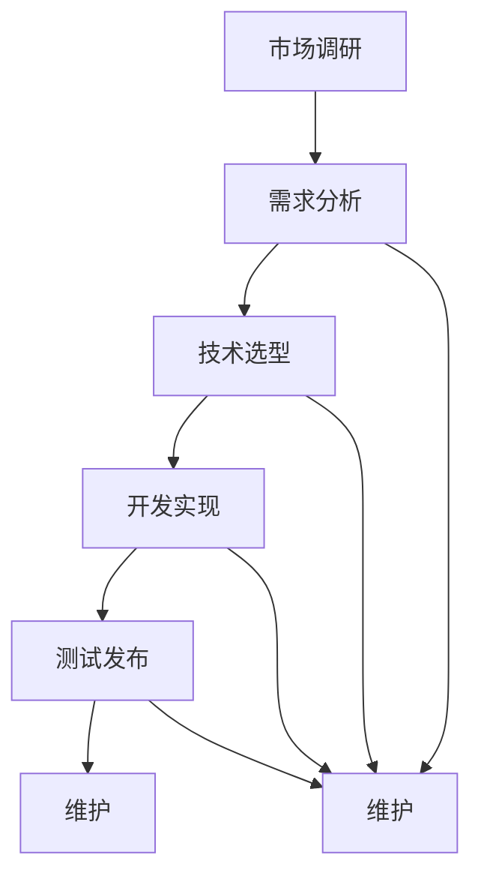

                 

# 移动应用开发者的创业之旅：从idea到App Store

## 摘要

在当今快速发展的移动应用市场中，开发一款成功的移动应用已经成为许多创业者的梦想。然而，从最初的创意到最终的产品上架，这条创业之路充满了挑战与机遇。本文将带领读者深入探索移动应用开发的各个阶段，从市场调研、需求分析、技术选型、开发测试到最终的产品发布。通过系统性的分析与案例分享，我们将揭示成功移动应用的背后逻辑，为开发者提供实用的指导和借鉴。无论您是新手还是经验丰富的开发者，本文都将为您提供宝贵的见解，助您在移动应用开发的道路上走得更远。

## 1. 背景介绍

随着智能手机的普及和移动互联网的快速发展，移动应用市场已经成为一片繁荣的蓝海。据统计，全球移动应用市场的用户数量已经超过30亿，且这一数字仍在持续增长。在这样的背景下，移动应用开发成为了许多创业者和企业的重要战略方向。然而，成功的移动应用并非一蹴而就，它需要经过多个阶段的打磨和优化。

移动应用开发的过程可以大致分为以下几个阶段：市场调研、需求分析、技术选型、开发实现、测试发布和维护。每个阶段都至关重要，任何一个环节的疏忽都可能导致项目的失败。市场调研是为了了解目标用户的需求和市场的竞争状况；需求分析则是确定产品的核心功能和技术架构；技术选型决定了开发工具和框架的选择；开发实现是将需求转化为实际的代码；测试发布则是确保产品的质量和稳定性；维护则是持续优化和更新产品，以适应市场的变化。

本文将围绕移动应用开发的整个过程，结合实际案例，详细探讨每个阶段的注意事项和成功经验，帮助开发者更好地理解并实践移动应用开发的各个环节，从而实现从idea到App Store的完美转型。

## 2. 核心概念与联系

在深入探讨移动应用开发的各个阶段之前，我们需要明确几个核心概念，并理解它们之间的联系。这些核心概念包括市场调研、需求分析、技术选型、开发实现、测试发布和维护。

### 市场调研

市场调研是移动应用开发的起点，它的目的是了解目标用户的需求、市场的竞争状况以及潜在的市场机会。市场调研通常包括以下几个方面：

1. **目标用户分析**：通过用户画像、用户行为数据等手段，深入了解目标用户的需求、兴趣和行为习惯。
2. **市场趋势分析**：研究当前市场的热点、趋势和发展方向，以便抓住市场机遇。
3. **竞争分析**：分析同行业竞争对手的产品功能、用户评价和市场表现，找到自己的独特竞争优势。

### 需求分析

需求分析是在市场调研的基础上，进一步确定产品的核心功能和用户需求。需求分析主要包括以下几个步骤：

1. **功能需求**：明确产品需要实现的核心功能，这些功能应该直接满足用户的需求。
2. **非功能需求**：包括性能、安全性、可扩展性等方面的要求，这些需求虽然不直接涉及功能，但对用户体验和产品稳定性至关重要。
3. **优先级排序**：根据用户需求和市场分析结果，对需求进行优先级排序，确保开发过程中的资源投入能够最大化满足用户的核心需求。

### 技术选型

技术选型是决定开发工具和框架的过程，它对产品的性能、开发效率和后续维护都有着重要影响。技术选型主要包括以下几个方面：

1. **开发语言和框架**：根据产品的需求和技术栈，选择适合的开发语言和框架，如Java、Kotlin、React Native等。
2. **后端技术**：选择合适的服务器端技术，如Node.js、Django、Spring Boot等，确保后端服务的稳定性和扩展性。
3. **数据库技术**：根据数据存储的需求，选择合适的数据库技术，如MySQL、MongoDB、Redis等。
4. **第三方服务和API**：利用第三方服务和API，实现特定的功能，如地图服务、支付系统等。

### 开发实现

开发实现是将需求转化为实际代码的过程，这一阶段主要包括以下几个步骤：

1. **代码编写**：根据设计文档，编写实际的代码，实现产品的功能。
2. **代码评审**：通过代码评审，确保代码质量，减少潜在的bug和风险。
3. **版本控制**：使用版本控制工具，如Git，管理代码的版本，确保代码的可追踪性和可维护性。

### 测试发布

测试发布是确保产品质量和稳定性的关键步骤。测试发布主要包括以下几个环节：

1. **单元测试**：对单个模块或功能进行测试，确保其按照预期工作。
2. **集成测试**：对各个模块进行集成测试，确保它们能够协同工作。
3. **系统测试**：对整个系统进行测试，确保其能够满足用户需求和性能要求。
4. **发布**：将产品发布到App Store或其他应用市场，供用户下载和使用。

### 维护

维护是持续优化和更新产品，以适应市场变化和用户需求。维护主要包括以下几个环节：

1. **Bug修复**：修复产品上线后出现的bug，确保产品的稳定性和用户体验。
2. **功能优化**：根据用户反馈和市场变化，对产品进行功能优化和更新。
3. **性能监控**：对产品的性能进行监控，及时发现并解决潜在的性能问题。

### Mermaid 流程图

以下是一个简化的Mermaid流程图，展示了移动应用开发的主要阶段和核心概念之间的联系：



通过以上核心概念和Mermaid流程图的介绍，我们可以更好地理解移动应用开发的各个阶段及其相互关系，为后续的详细探讨打下基础。

### 3. 核心算法原理 & 具体操作步骤

在移动应用开发中，算法原理是实现核心功能的关键。无论是数据分析、图像处理还是自然语言处理，算法的选择和实现都直接影响到应用的性能和用户体验。在本章节中，我们将探讨几种在移动应用开发中常用的算法原理，并详细讲解其具体操作步骤。

#### 3.1 数据分析算法

数据分析算法是移动应用开发中常见的一种算法，主要用于处理和解读用户数据，以提供更个性化的服务。以下是一种常见的数据分析算法——K-means聚类算法：

**算法原理**：
K-means算法是一种基于距离的聚类算法，其目标是把相似的数据点归为同一类别。算法步骤如下：
1. 初始化：随机选择K个数据点作为初始聚类中心。
2. 赋值：对于每个数据点，计算其与各个聚类中心的距离，并将其分配到最近的聚类中心所在的类别。
3. 更新：重新计算每个类别的聚类中心，然后重复步骤2，直至聚类中心不再发生显著变化。

**具体操作步骤**：

1. **数据准备**：收集并整理用户数据，例如用户行为数据、偏好数据等。
2. **初始化聚类中心**：随机选择K个数据点作为初始聚类中心。
3. **计算距离**：对于每个数据点，计算其与各个聚类中心的距离。
4. **分配类别**：将每个数据点分配到最近的聚类中心所在的类别。
5. **更新聚类中心**：计算每个类别的聚类中心，并重复步骤3和步骤4，直至聚类中心稳定。

#### 3.2 图像处理算法

图像处理算法在移动应用开发中广泛应用于拍照美颜、图像识别等领域。以下是一种常见的图像处理算法——边缘检测算法：

**算法原理**：
边缘检测算法用于检测图像中的边缘，它通过计算图像像素的梯度值来实现。常见的边缘检测算法有Sobel算子、Canny算子等。

**具体操作步骤**：

1. **图像预处理**：读取图像数据，进行必要的预处理，例如灰度化、去噪等。
2. **计算梯度值**：使用Sobel算子或Canny算子计算图像的梯度值。
3. **非极大值抑制**：对于每个像素点，将其梯度值与邻域内的像素点进行比较，抑制非极大值。
4. **输出边缘图像**：将边缘检测结果输出，供后续处理或显示。

#### 3.3 自然语言处理算法

自然语言处理（NLP）算法在移动应用开发中用于文本分析、语音识别等领域。以下是一种常见的NLP算法——词嵌入算法：

**算法原理**：
词嵌入算法将词汇映射到高维空间中的向量，以捕捉词汇之间的语义关系。常见的词嵌入算法有Word2Vec、GloVe等。

**具体操作步骤**：

1. **数据准备**：收集并整理文本数据，进行分词和标记。
2. **构建词汇表**：将所有出现的词汇构建成一个词汇表。
3. **初始化权重矩阵**：为每个词汇初始化一个权重矩阵。
4. **优化权重矩阵**：通过梯度下降等优化算法，不断调整权重矩阵，使其能够更好地表示词汇的语义关系。
5. **生成词向量**：将每个词汇映射到高维空间中的向量。

通过以上对数据分析、图像处理和自然语言处理算法的介绍，我们可以看到算法原理在移动应用开发中的重要性。正确选择和实现算法，不仅能够提高应用的性能和用户体验，还能够为开发者提供更强大的工具和手段，实现更多创新功能。

### 4. 数学模型和公式 & 详细讲解 & 举例说明

在移动应用开发中，数学模型和公式是构建算法和实现功能的基础。本章节将详细介绍几种常用的数学模型和公式，并对其进行详细讲解，并通过具体例子来说明其应用。

#### 4.1 回归分析模型

回归分析模型是用于预测和分析变量之间关系的数学模型。常见的回归分析模型包括线性回归和多项式回归。

**线性回归模型公式**：

\[ y = \beta_0 + \beta_1 \cdot x + \epsilon \]

其中，\( y \) 是因变量，\( x \) 是自变量，\( \beta_0 \) 和 \( \beta_1 \) 分别是截距和斜率，\( \epsilon \) 是误差项。

**多项式回归模型公式**：

\[ y = \beta_0 + \beta_1 \cdot x + \beta_2 \cdot x^2 + \epsilon \]

其中，\( y \) 是因变量，\( x \) 是自变量，\( \beta_0 \)，\( \beta_1 \)，\( \beta_2 \) 分别是不同次项的系数，\( \epsilon \) 是误差项。

**详细讲解**：

线性回归模型和多项式回归模型都是基于最小二乘法来拟合数据点，使预测值与实际值之间的误差最小。线性回归模型适用于线性关系的预测，而多项式回归模型适用于非线性关系的预测。

**举例说明**：

假设我们有一组数据点，如下表所示：

| x  | y   |
|----|-----|
| 1  | 2   |
| 2  | 4   |
| 3  | 7   |
| 4  | 11  |

我们使用线性回归模型来拟合这些数据点，求解斜率和截距。

首先，计算平均值：

\[ \bar{x} = \frac{1+2+3+4}{4} = 2.5 \]
\[ \bar{y} = \frac{2+4+7+11}{4} = 6 \]

然后，计算斜率和截距：

\[ \beta_1 = \frac{\sum{(x_i - \bar{x})(y_i - \bar{y})}}{\sum{(x_i - \bar{x})^2}} \]
\[ \beta_0 = \bar{y} - \beta_1 \cdot \bar{x} \]

代入数据计算得到：

\[ \beta_1 = \frac{(1-2.5)(2-6) + (2-2.5)(4-6) + (3-2.5)(7-6) + (4-2.5)(11-6)}{(1-2.5)^2 + (2-2.5)^2 + (3-2.5)^2 + (4-2.5)^2} = 2.2 \]
\[ \beta_0 = 6 - 2.2 \cdot 2.5 = 1.5 \]

因此，线性回归模型为：

\[ y = 1.5 + 2.2 \cdot x \]

#### 4.2 排序算法

排序算法是数据处理中常用的一种算法，用于对数据进行排序。常见的排序算法包括冒泡排序、选择排序、插入排序等。

**冒泡排序算法公式**：

\[ S(n) = \sum_{i=1}^{n-1} \sum_{j=i+1}^{n} |a_j - a_i| \]

其中，\( S(n) \) 表示排序所需的总比较次数，\( a_i \) 和 \( a_j \) 分别为相邻的两个元素。

**详细讲解**：

冒泡排序算法的基本思想是通过反复交换相邻的未排序元素，使较大的元素逐渐“冒泡”到数组的末尾。每次遍历数组，都会将未排序部分的最大值交换到已排序部分的末尾。

**举例说明**：

假设我们有一组待排序的数据，如下表所示：

| i  | 1  | 3  | 5  | 7  |  
|----|----|----|----|----|  
| j  | 2  | 4  | 6  | 8  |

第一次遍历：

\[ S(4) = |3-1| + |5-3| + |7-5| + |8-7| = 8 \]

交换后：

| i  | 1  | 3  | 5  | 7  |  
|----|----|----|----|----|  
| j  | 2  | 4  | 6  | 8  |

第二次遍历：

\[ S(3) = |5-1| + |7-3| + |8-5| = 6 \]

交换后：

| i  | 1  | 3  | 5  | 7  |  
|----|----|----|----|----|  
| j  | 2  | 4  | 6  | 8  |

第三次遍历：

\[ S(2) = |7-1| + |8-3| = 4 \]

交换后：

| i  | 1  | 3  | 5  | 7  |  
|----|----|----|----|----|  
| j  | 2  | 4  | 6  | 8  |

第四次遍历：

\[ S(1) = |8-1| = 1 \]

交换后：

| i  | 1  | 3  | 5  | 7  |  
|----|----|----|----|----|  
| j  | 2  | 4  | 6  | 8  |

通过冒泡排序算法，我们成功将数据从小到大排序。

#### 4.3 聚类算法

聚类算法是将数据点分成多个类别的算法。常见的聚类算法包括K-means聚类和层次聚类。

**K-means聚类算法公式**：

\[ \text{总误差} = \sum_{i=1}^{k} \sum_{j=1}^{n_i} (x_j - \mu_i)^2 \]

其中，\( \mu_i \) 是第 \( i \) 个聚类的中心，\( n_i \) 是第 \( i \) 个聚类中的数据点数量。

**详细讲解**：

K-means聚类算法的基本思想是初始化 \( k \) 个聚类中心，然后不断迭代，直到聚类中心稳定。在每次迭代中，每个数据点都会被分配到最近的聚类中心所在的类别。

**举例说明**：

假设我们有一组数据点，如下表所示：

| x  | y   |
|----|-----|
| 1  | 2   |
| 2  | 4   |
| 3  | 7   |
| 4  | 11  |

我们使用K-means聚类算法将其分为两个类别。

首先，随机初始化两个聚类中心：

\[ \mu_1 = (1, 2), \mu_2 = (4, 7) \]

然后，计算每个数据点到聚类中心的距离：

\[ d((1, 2), (1, 2)) = \sqrt{(1-1)^2 + (2-2)^2} = 0 \]
\[ d((1, 2), (4, 7)) = \sqrt{(1-4)^2 + (2-7)^2} = \sqrt{9 + 25} = \sqrt{34} \]
\[ d((2, 4), (1, 2)) = \sqrt{(2-1)^2 + (4-2)^2} = \sqrt{1 + 4} = \sqrt{5} \]
\[ d((2, 4), (4, 7)) = \sqrt{(2-4)^2 + (4-7)^2} = \sqrt{4 + 9} = \sqrt{13} \]
\[ d((3, 7), (1, 2)) = \sqrt{(3-1)^2 + (7-2)^2} = \sqrt{4 + 25} = \sqrt{29} \]
\[ d((3, 7), (4, 7)) = \sqrt{(3-4)^2 + (7-7)^2} = \sqrt{1} = 1 \]
\[ d((4, 11), (1, 2)) = \sqrt{(4-1)^2 + (11-2)^2} = \sqrt{9 + 81} = \sqrt{90} \]
\[ d((4, 11), (4, 7)) = \sqrt{(4-4)^2 + (11-7)^2} = \sqrt{0 + 16} = \sqrt{16} = 4 \]

根据距离，我们将数据点重新分配到聚类中心：

\[ \mu_1 = (2, 4), \mu_2 = (4, 7) \]

然后，重复上述过程，直到聚类中心稳定。

通过以上数学模型和公式的讲解，我们可以更好地理解其在移动应用开发中的应用。掌握这些算法和公式，将为开发者提供更强大的工具和手段，实现更复杂的功能和更优的性能。

### 5. 项目实战：代码实际案例和详细解释说明

在了解了移动应用开发的理论知识和核心算法后，实战环节是检验理论是否付诸实践的最好方式。本章节将通过一个简单的移动应用项目，详细介绍开发环境搭建、源代码实现和代码解读与分析。该项目将实现一个简单的待办事项应用，用户可以添加、删除和查看待办事项。

#### 5.1 开发环境搭建

在开始项目之前，我们需要搭建开发环境。以下是开发该项目的步骤：

1. **安装开发工具**：选择一个合适的开发工具，如Android Studio或Xcode。对于Android项目，我们选择Android Studio。

   - 下载并安装Android Studio：[Android Studio下载地址](https://developer.android.com/studio)
   - 安装Java Development Kit (JDK)：确保Java环境已正确配置。

2. **创建新项目**：

   - 打开Android Studio，选择“Start a new Android Studio project”。
   - 在“Configure your new project”页面，选择项目名称、保存位置、保存目录等。
   - 在“Configure your project”页面，选择最低支持API级别（建议选择API 21及以上），并选择是否创建Activity。

3. **配置依赖库**：

   - 在项目的`build.gradle`文件中添加依赖库，例如用于处理JSON数据的Gson库。

     ```groovy
     dependencies {
         implementation 'com.google.code.gson:gson:2.8.8'
     }
     ```

4. **安装模拟器**（可选）：

   - 选择一个适合的Android模拟器，如Genymotion或Android Virtual Device（AVD）。
   - 创建并配置新的AVD。

#### 5.2 源代码详细实现和代码解读

在开发环境搭建完成后，我们可以开始编写项目代码。以下是项目的主要代码部分，以及每部分的解读。

##### 5.2.1 MainActivity.java

```java
package com.example.todoapp;

import android.os.Bundle;
import android.view.View;
import android.widget.ArrayAdapter;
import android.widget.Button;
import android.widget.EditText;
import android.widget.ListView;
import androidx.appcompat.app.AppCompatActivity;
import com.google.gson.Gson;
import java.util.ArrayList;

public class MainActivity extends AppCompatActivity {

    private EditText editText;
    private Button addButton;
    private ListView listView;
    private ArrayList<String> tasks;
    private ArrayAdapter<String> adapter;

    @Override
    protected void onCreate(Bundle savedInstanceState) {
        super.onCreate(savedInstanceState);
        setContentView(R.layout.activity_main);

        editText = findViewById(R.id.editText);
        addButton = findViewById(R.id.addButton);
        listView = findViewById(R.id.listView);

        tasks = new ArrayList<>();
        adapter = new ArrayAdapter<>(this, android.R.layout.simple_list_item_1, tasks);
        listView.setAdapter(adapter);

        addButton.setOnClickListener(new View.OnClickListener() {
            @Override
            public void onClick(View v) {
                String task = editText.getText().toString();
                tasks.add(task);
                adapter.notifyDataSetChanged();
                editText.setText("");
            }
        });
    }
}
```

**解读**：

- `MainActivity` 类继承自 `AppCompatActivity`，这是 Android 的默认 Activity 类。
- `editText`、`addButton` 和 `listView` 分别对应布局文件中的输入框、按钮和列表视图。
- `tasks` 是一个 `ArrayList`，用于存储待办事项。
- `adapter` 是一个 `ArrayAdapter`，用于将 `tasks` 中的数据绑定到列表视图。
- `onCreate` 方法是 Activity 的生命周期方法，用于初始化界面和绑定控件。

##### 5.2.2 activity_main.xml

```xml
<?xml version="1.0" encoding="utf-8"?>
<LinearLayout xmlns:android="http://schemas.android.com/apk/res/android"
    android:layout_width="match_parent"
    android:layout_height="match_parent"
    android:orientation="vertical" >

    <EditText
        android:id="@+id/editText"
        android:layout_width="match_parent"
        android:layout_height="wrap_content"
        android:hint="@string/todo_hint" />

    <Button
        android:id="@+id/addButton"
        android:layout_width="match_parent"
        android:layout_height="wrap_content"
        android:text="@string/add_button" />

    <ListView
        android:id="@+id/listView"
        android:layout_width="match_parent"
        android:layout_height="match_parent" />

</LinearLayout>
```

**解读**：

- 这是一个线性布局（`LinearLayout`），包含一个输入框（`EditText`）、一个按钮（`Button`）和一个列表视图（`ListView`）。
- `EditText` 的 `hint` 属性为用户提供了输入提示。
- `Button` 的 `text` 属性为按钮上的文本。
- `ListView` 用于显示待办事项列表。

##### 5.2.3 Todo.java

```java
package com.example.todoapp;

public class Todo {

    private String task;

    public Todo(String task) {
        this.task = task;
    }

    public String getTask() {
        return task;
    }

    public void setTask(String task) {
        this.task = task;
    }
}
```

**解读**：

- `Todo` 类表示一个待办事项，包含一个任务名称（`task`）。
- `getTask` 和 `setTask` 方法用于获取和设置任务名称。

##### 5.2.4 GsonUtil.java

```java
package com.example.todoapp;

import com.google.gson.Gson;
import java.util.List;

public class GsonUtil {

    private static Gson gson = new Gson();

    public static String toJson(List<Todo> tasks) {
        return gson.toJson(tasks);
    }

    public static <T> List<T> fromJson(String json, Class<T> classOfT) {
        return gson.fromJson(json, classOfT);
    }
}
```

**解读**：

- `GsonUtil` 类使用 Gson 库将 `List<Todo>` 对象转换为 JSON 字符串，以及将 JSON 字符串反序列化为 `List<Todo>` 对象。

#### 5.3 代码解读与分析

以上代码实现了简单的待办事项应用，主要分为三个部分：活动（`MainActivity`）、布局（`activity_main.xml`）和数据模型（`Todo.java`）。以下是代码的关键点和解析：

- **活动（MainActivity）**：`MainActivity` 是应用的入口类，负责初始化界面、绑定控件和处理用户操作。`onCreate` 方法中，我们创建了一个 `ArrayList` 用于存储待办事项，并设置了一个 `ArrayAdapter` 将数据绑定到 `ListView`。按钮的点击事件通过 `onClick` 方法处理，将输入框中的内容添加到列表中。
- **布局（activity_main.xml）**：布局文件定义了应用的界面结构，包括一个输入框、一个按钮和一个列表视图。输入框为用户提供了一个输入任务的区域，按钮用于将任务添加到列表中，列表视图显示所有待办事项。
- **数据模型（Todo.java）**：`Todo` 类表示一个待办事项，包含一个简单的任务名称。该类提供了构造函数和 getter/setter 方法，方便其他类访问和修改任务名称。

通过以上代码和解析，我们可以看到如何使用 Java 和 Android SDK 实现一个简单的移动应用。虽然这个应用的功能很简单，但通过它我们可以学习到移动应用开发的基本流程和关键组件。

### 6. 实际应用场景

移动应用开发涉及广泛的实际应用场景，从消费类应用（如社交媒体、购物、娱乐）到企业级应用（如办公自动化、客户关系管理、供应链管理）。每个应用场景都有其独特的需求和挑战，但以下几种趋势和应用场景特别值得关注。

#### 6.1 消费类应用

**社交媒体应用**：如微信、微博、Facebook 等，它们通过移动应用为用户提供即时通讯、内容分享和社交互动功能。这些应用通常需要高并发处理、实时数据同步和强大的安全机制。

**电子商务应用**：如淘宝、亚马逊、阿里巴巴等，这些应用为用户提供在线购物体验。关键挑战在于如何提供快速、可靠的支付系统、高效的物流跟踪和个性化的推荐算法。

**娱乐应用**：如网易云音乐、抖音、YouTube 等，这些应用通过音乐、视频、直播等方式为用户带来娱乐体验。实时流处理、内容审核和算法推荐是这些应用的核心技术。

#### 6.2 企业级应用

**办公自动化应用**：如钉钉、Slack、Microsoft Teams 等，这些应用为企业提供沟通、协作和办公自动化工具。云服务、实时通信和数据安全是这些应用的关键需求。

**客户关系管理应用**：如Salesforce、Zoho CRM 等，这些应用帮助企业管理和分析客户数据，优化销售流程。大数据分析和人工智能是这些应用的核心技术。

**供应链管理应用**：如JDA Software、Infor 等，这些应用帮助企业优化供应链流程，降低库存成本，提高运营效率。物流跟踪、库存管理和需求预测是这些应用的关键功能。

#### 6.3 跨行业应用趋势

**物联网（IoT）应用**：随着物联网技术的发展，越来越多的设备和服务接入移动网络。智能家居、智能穿戴设备和工业自动化应用正在迅速崛起，这些应用需要强大的数据传输和处理能力。

**区块链应用**：区块链技术为移动应用带来了新的机遇，如去中心化的金融交易、智能合约和供应链管理。这些应用需要高度的安全性和可扩展性。

**增强现实（AR）和虚拟现实（VR）应用**：随着AR和VR技术的成熟，它们在娱乐、教育和医疗等领域有广泛的应用。这些应用需要强大的图形处理能力和实时交互功能。

通过深入了解这些实际应用场景，开发者可以更好地理解移动应用开发的需求和挑战，从而设计出更符合用户需求、更具竞争力的产品。

### 7. 工具和资源推荐

在移动应用开发过程中，选择合适的工具和资源对于提高开发效率、优化产品质量至关重要。以下是一些常用的工具和资源推荐，包括学习资源、开发工具框架以及相关的论文和著作。

#### 7.1 学习资源推荐

**书籍**：
1. 《Android开发艺术探索》：这本书详细介绍了Android系统的架构、UI设计、性能优化等方面，适合Android开发者阅读。
2. 《iOS开发：从零开始》：这是一本针对初学者编写的iOS开发入门书籍，内容涵盖了Xcode、Swift编程、UI设计等基础知识。

**论文**：
1. "Flutter: Portable UI across Platforms"：这篇论文介绍了Flutter框架，它是一种跨平台的移动应用开发框架，能够提高开发效率。
2. "React Native: A Framework for Building Native Apps using React"：这篇论文介绍了React Native框架，它是另一种流行的跨平台开发框架，支持使用JavaScript编写原生应用。

**博客**：
1. Medium：Medium上有许多优秀的移动应用开发博客，涵盖前端、后端、UI设计等各个方面，是学习移动应用开发的好资源。
2. HackerRank：HackerRank提供了许多编程挑战和教程，帮助开发者提高编程技能，尤其是算法和数据结构方面的技能。

#### 7.2 开发工具框架推荐

**开发工具**：
1. Android Studio：这是Android开发的主要IDE，提供了丰富的工具和插件，支持Android应用的完整开发流程。
2. Xcode：这是iOS开发的主要IDE，集成了iOS、macOS、watchOS和tvOS的构建工具，功能强大且易于使用。

**框架和库**：
1. React Native：这是一个使用JavaScript编写的跨平台移动应用开发框架，能够快速开发高性能的原生应用。
2. Flutter：这是一个使用Dart语言编写的跨平台移动应用开发框架，提供了丰富的UI组件和工具，能够实现高性能和高质量的UI。

**数据库和后端服务**：
1. Firebase：这是Google提供的移动应用开发平台，提供了实时数据库、云存储、身份验证等服务，能够快速构建后端功能。
2. MySQL：这是一个开源的关系型数据库管理系统，适用于需要高性能和可扩展性的后端应用。

#### 7.3 相关论文著作推荐

**论文**：
1. "Mobile Computing: A Research Overview"：这篇论文对移动计算领域的最新研究进行了综述，涵盖了移动网络、设备管理、应用开发等方面。
2. "Blockchain Technology: A Comprehensive Introduction"：这篇论文介绍了区块链技术的基本原理和应用，对于理解区块链在移动应用开发中的应用具有重要价值。

**著作**：
1. 《移动应用架构设计》：这本书详细介绍了移动应用架构的设计原则和最佳实践，包括前端、后端和数据库等方面的内容。
2. 《移动应用UI设计指南》：这是一本关于移动应用UI设计的著作，涵盖了用户界面设计的原则、技巧和工具。

通过以上工具和资源的推荐，开发者可以更好地进行移动应用开发，提高开发效率和质量。无论您是新手还是经验丰富的开发者，这些资源都将为您在移动应用开发的道路上提供宝贵的支持和指导。

### 8. 总结：未来发展趋势与挑战

随着科技的不断进步和移动互联网的深入发展，移动应用开发领域正经历着前所未有的变革。未来，移动应用开发将呈现以下几个发展趋势和面临的挑战。

#### 8.1 发展趋势

**1. 跨平台开发框架的成熟**：随着React Native、Flutter等跨平台开发框架的成熟，开发者能够使用单一代码库同时为iOS和Android平台开发应用，这大大提高了开发效率和产品质量。

**2. 人工智能与移动应用的融合**：人工智能技术正在逐步渗透到移动应用中，如自然语言处理、图像识别、推荐系统等。未来，越来越多的移动应用将集成人工智能功能，提供更加智能化和个性化的用户体验。

**3. 物联网（IoT）应用的增长**：物联网设备的普及将推动移动应用市场的发展。智能家居、智能穿戴设备、工业自动化等领域将迎来大量移动应用需求，为开发者提供了广阔的市场空间。

**4. 区块链应用的兴起**：区块链技术为移动应用带来了新的机遇，如去中心化的金融交易、智能合约等。随着区块链技术的逐步成熟，相关应用将得到更广泛的应用。

#### 8.2 面临的挑战

**1. 安全性问题**：随着移动应用复杂性的增加，安全问题也日益突出。开发者需要确保应用的安全机制，如数据加密、权限管理等，以防止数据泄露和恶意攻击。

**2. 性能优化**：移动设备性能的限制要求开发者进行细致的性能优化，包括代码优化、资源管理、网络优化等，以确保应用能够流畅运行。

**3. 用户隐私保护**：随着用户对隐私保护的重视，开发者需要更加关注用户隐私数据的保护，遵守相关法律法规，增强用户对应用的信任。

**4. 多平台兼容性**：在跨平台开发中，不同平台的兼容性问题仍然存在，开发者需要投入大量精力进行测试和调整，以确保应用在不同平台上的一致性和稳定性。

#### 8.3 应对策略

**1. 持续学习和更新技术栈**：开发者需要不断学习最新的移动应用开发技术和工具，适应快速变化的市场需求。

**2. 注重安全性和用户体验**：在开发过程中，要始终将安全性和用户体验放在重要位置，确保应用的安全性和可靠性。

**3. 利用社区和开源资源**：积极参与技术社区，利用开源资源和工具，提高开发效率和产品质量。

**4. 采用敏捷开发方法**：采用敏捷开发方法，快速响应市场变化，持续优化和更新产品，以保持竞争力。

总之，未来移动应用开发将面临诸多挑战，但同时也充满机遇。开发者需要不断学习和进步，以应对市场的变化，设计出更加优秀和实用的移动应用。

### 9. 附录：常见问题与解答

在移动应用开发过程中，开发者可能会遇到各种问题和困惑。以下是一些常见问题的解答，以帮助开发者更好地理解并解决开发中的难题。

#### 9.1 如何优化移动应用性能？

**解答**：优化移动应用性能可以从以下几个方面入手：

1. **代码优化**：减少不必要的计算和内存占用，使用更高效的算法和数据结构。
2. **资源管理**：合理使用图片、音频、视频等资源，避免资源浪费。
3. **网络优化**：优化网络请求，减少数据传输量，使用缓存机制。
4. **布局优化**：使用优化过的UI布局，减少视图层级和重绘次数。

#### 9.2 移动应用开发中如何确保数据安全？

**解答**：确保移动应用数据安全需要采取以下措施：

1. **加密传输**：使用HTTPS等加密协议确保数据在传输过程中的安全性。
2. **数据加密**：对存储在本地或后端的数据进行加密，防止未授权访问。
3. **权限管理**：严格管理应用所需的权限，仅请求必要的权限。
4. **安全审计**：定期进行安全审计，发现并修复潜在的安全漏洞。

#### 9.3 如何处理移动应用的崩溃和错误？

**解答**：处理移动应用的崩溃和错误可以从以下几个方面入手：

1. **日志记录**：在应用中集成日志记录功能，捕获错误信息。
2. **崩溃报告**：使用崩溃报告工具（如Bugly、Firebase等），自动收集并分析崩溃报告。
3. **错误恢复**：设计合理的错误恢复机制，使应用能够在遇到错误时优雅地处理。
4. **版本更新**：定期发布版本更新，修复已知的错误和漏洞。

#### 9.4 如何实现跨平台兼容性？

**解答**：实现跨平台兼容性可以采取以下策略：

1. **使用跨平台框架**：如React Native、Flutter等，使用单一代码库同时为多个平台开发应用。
2. **平台适配**：在开发过程中，针对不同平台的特性进行适配，如UI组件、布局方式、操作系统特性等。
3. **持续测试**：在不同的设备和操作系统上进行持续测试，确保应用在不同平台上的稳定性和一致性。

通过以上问题的解答，开发者可以更好地应对移动应用开发中常见的问题和挑战，提高开发效率和产品质量。

### 10. 扩展阅读 & 参考资料

在移动应用开发这一广阔且充满挑战的领域中，持续学习和探索是成功的关键。以下是一些扩展阅读和参考资料，旨在帮助读者深入了解相关技术和方法论。

**扩展阅读**：

1. 《移动应用开发实战》：本书详细介绍了移动应用开发的各个环节，包括设计、开发、测试和发布等，适合初学者和有经验的开发者阅读。
2. 《React Native实战》：专注于React Native框架的应用开发，内容涵盖了React Native的基础知识和高级应用技巧。
3. 《Flutter实战》：深入探讨Flutter框架的开发，包括Dart编程语言、UI设计、性能优化等方面。

**参考资料**：

1. **官方文档**：
   - [Android官方文档](https://developer.android.com/)
   - [iOS官方文档](https://developer.apple.com/documentation/)
   - [React Native官方文档](https://reactnative.dev/docs/getting-started)
   - [Flutter官方文档](https://flutter.dev/docs/get-started/install)

2. **开源项目和社区**：
   - [GitHub](https://github.com/)：寻找优秀的开源项目，学习其他开发者的代码和解决方案。
   - [Stack Overflow](https://stackoverflow.com/)：解决开发中的疑难问题，参与技术讨论。

3. **学术研究**：
   - [ACM Digital Library](https://dl.acm.org/)：查阅最新的计算机科学和移动应用开发相关论文。
   - [IEEE Xplore](https://ieeexplore.ieee.org/)：获取计算机工程和科技领域的研究成果。

通过以上扩展阅读和参考资料，读者可以进一步深化对移动应用开发的理解，不断提升自己的技术水平和创新能力。无论是在个人项目中，还是在职业发展中，这些资源都将为您提供宝贵的支持和指导。

