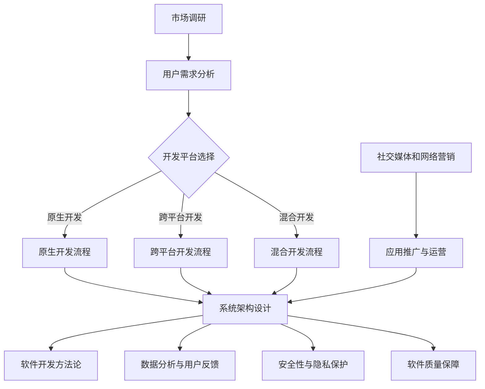

                 

### 1. 背景介绍

移动应用开发（Mobile Application Development，简称MAD）近年来已经成为信息技术领域中最热门的分支之一。随着智能手机和移动互联网的普及，移动应用市场呈现出爆发式增长。据统计，全球移动应用用户已经超过40亿，移动应用市场总收入也达到了数百亿美元。在这个充满机遇的市场中，个人开发者（Individual Developers）逐渐成为一支不可忽视的力量。

个人开发者，即独立于传统企业或机构的程序员或开发团队，他们利用自己的技术和创造力，独立开发并运营移动应用。与传统的企业开发团队相比，个人开发者具有以下几个显著特点：

1. **灵活性**：个人开发者不受企业约束，可以更加灵活地调整开发方向和节奏，迅速响应市场需求。
2. **创新性**：个人开发者往往更加注重创新和个性化，能够更快地推出新颖的应用。
3. **成本效益**：由于不需要承担大量的企业运营成本，个人开发者可以以较低的成本进行应用开发和运营。

然而，与此同时，个人开发者也面临着诸多挑战。例如，技术门槛、市场推广、用户留存等问题都是他们需要面对的。本文旨在分析个人开发者如何在这个竞争激烈的市场中定位自己，找到适合自己的发展道路。

接下来，我们将从以下几个方面进行探讨：

- **个人开发者的市场定位**：分析个人开发者如何在市场中找到自己的独特定位。
- **移动应用开发的步骤和策略**：介绍个人开发者进行移动应用开发的常见步骤和策略。
- **成功案例分析**：分析一些成功的个人开发者案例，了解他们是如何取得成功的。
- **未来发展趋势与挑战**：探讨个人开发者面临的发展趋势和挑战，以及应对策略。

通过本文的讨论，希望对广大个人开发者有所启发，帮助他们在移动应用开发的道路上取得更好的成绩。

### 2. 核心概念与联系

在深入探讨个人开发者如何定位自己的市场之前，我们需要明确一些核心概念和它们之间的联系。以下是几个关键概念及其相互关系的简要概述：

#### 2.1 移动应用开发平台

移动应用开发平台（Mobile Application Development Platforms，简称MADP）是个人开发者进行应用开发的基础工具。常见的移动应用开发平台包括原生开发（Native Development）、跨平台开发（Cross-Platform Development）和混合开发（Hybrid Development）。

- **原生开发**：使用原生语言（如Swift、Java、Kotlin等）为特定平台（iOS或Android）开发应用。优点是性能高、用户体验好，但开发成本高、周期长。
- **跨平台开发**：使用跨平台框架（如React Native、Flutter、Xamarin等）开发可在多个平台上运行的应用。优点是开发效率高、成本相对较低，但性能和用户体验可能稍逊一筹。
- **混合开发**：结合原生开发和跨平台开发的优点，使用原生组件和Web技术（如HTML、CSS、JavaScript）进行应用开发。适用于需要部分平台特定功能但又要快速开发的场景。

#### 2.2 用户需求分析

用户需求分析（User Requirements Analysis）是移动应用开发的重要环节。通过对目标用户群体进行分析，了解他们的需求、行为和偏好，可以帮助个人开发者设计出更符合用户期望的应用。

- **需求收集**：通过访谈、问卷调查、用户反馈等方式收集用户需求。
- **需求分类**：将收集到的需求进行分类，识别出核心需求和次要需求。
- **需求优先级**：根据用户需求的紧迫性和重要性，确定需求的优先级。

#### 2.3 市场调研

市场调研（Market Research）是了解市场环境和竞争对手的重要手段。通过市场调研，个人开发者可以：

- **了解市场趋势**：掌握移动应用市场的最新动态和趋势。
- **分析竞争对手**：了解竞争对手的产品特点、优势和劣势。
- **确定市场定位**：根据市场调研结果，确定自己的市场定位和差异化策略。

#### 2.4 软件开发方法论

软件开发方法论（Software Development Methodologies）是指导移动应用开发过程的一系列原则和方法。常见的软件开发方法论包括瀑布模型、敏捷开发、迭代开发等。

- **瀑布模型**：传统的软件开发方法，分为需求分析、设计、编码、测试等阶段，各阶段顺序执行。
- **敏捷开发**：强调快速迭代、持续交付和团队合作，适用于需求变化频繁的项目。
- **迭代开发**：在瀑布模型的基础上，引入多个迭代周期，每次迭代完成后对产品进行评估和调整。

#### 2.5 数据分析与用户反馈

数据分析和用户反馈（Data Analysis and User Feedback）是移动应用运营的重要手段。通过对用户行为数据的分析，可以：

- **优化用户体验**：根据用户行为数据，识别出用户体验中的痛点，进行针对性优化。
- **提高用户留存率**：通过分析用户留存数据，发现用户流失的原因，采取相应措施提高用户留存率。

#### 2.6 社交媒体和网络营销

社交媒体和网络营销（Social Media and Online Marketing）是个人开发者推广移动应用的重要手段。通过社交媒体平台（如Facebook、Twitter、Instagram等）和网络营销手段（如搜索引擎优化、广告投放等），可以：

- **增加应用曝光**：提高移动应用的知名度和用户量。
- **吸引用户下载**：通过有针对性的营销策略，吸引潜在用户下载和使用应用。

#### 2.7 系统架构与设计

系统架构与设计（System Architecture and Design）是确保移动应用稳定、高效运行的基础。常见的系统架构设计原则包括：

- **模块化**：将系统划分为多个模块，提高可维护性和可扩展性。
- **分层设计**：采用分层架构，将应用划分为表示层、业务逻辑层、数据访问层等，降低各层之间的耦合度。
- **高内聚、低耦合**：设计模块时，确保模块内部高度内聚、模块之间低耦合，提高系统的灵活性和可维护性。

#### 2.8 安全性和隐私保护

安全性和隐私保护（Security and Privacy Protection）是移动应用开发中的重要环节。个人开发者需要：

- **数据加密**：对用户数据进行加密处理，防止数据泄露。
- **权限控制**：合理设置应用权限，防止权限滥用。
- **安全审计**：定期进行安全审计，识别和修复潜在的安全漏洞。

#### 2.9 软件质量保障

软件质量保障（Software Quality Assurance，简称SQA）是确保移动应用稳定、可靠运行的关键。个人开发者需要：

- **代码审查**：定期进行代码审查，发现和修复代码中的缺陷。
- **自动化测试**：使用自动化测试工具，对应用进行全面测试，提高测试覆盖率。
- **持续集成与部署**：采用持续集成与部署（CI/CD）流程，提高开发效率和软件质量。

### 2.10 综合应用与实践

综合以上核心概念，个人开发者需要在移动应用开发过程中，灵活运用各种技术和方法，确保应用的成功开发、运营和推广。以下是一个简单的Mermaid流程图，展示了移动应用开发的整体流程及其核心概念之间的联系：



通过以上对核心概念和它们之间联系的介绍，我们为后续章节的内容提供了理论基础。接下来，我们将深入探讨个人开发者如何通过市场定位、开发步骤和策略，实现移动应用的成功开发与推广。

### 3. 核心算法原理 & 具体操作步骤

在移动应用开发中，核心算法的选择和实现是决定应用性能和用户体验的关键因素。以下将介绍几种常见的核心算法原理，并详细阐述其具体操作步骤。

#### 3.1 加密算法

加密算法是保障移动应用数据安全和隐私的重要手段。常用的加密算法包括对称加密和非对称加密。

- **对称加密**：如AES（Advanced Encryption Standard）
  - **原理**：使用同一个密钥进行加密和解密。
  - **操作步骤**：
    1. 确定加密算法（如AES）和密钥长度。
    2. 生成密钥（可以使用随机数生成器）。
    3. 使用密钥和加密算法对数据进行加密。
    4. 将加密后的数据传输到接收方。
    5. 接收方使用相同的密钥和加密算法解密数据。

- **非对称加密**：如RSA（Rivest-Shamir-Adleman）
  - **原理**：使用一对密钥（公钥和私钥），公钥加密，私钥解密。
  - **操作步骤**：
    1. 生成密钥对（公钥和私钥）。
    2. 将公钥公开，私钥保密。
    3. 使用公钥加密数据。
    4. 将加密后的数据传输到接收方。
    5. 接收方使用私钥解密数据。

#### 3.2 排序算法

排序算法是数据处理中常用的一种算法，常用的排序算法包括冒泡排序、选择排序、插入排序和快速排序。

- **冒泡排序（Bubble Sort）**
  - **原理**：通过多次遍历待排序列，每次遍历中相邻的两个元素进行比较并交换，直到序列有序。
  - **操作步骤**：
    1. 从第一个元素开始，遍历整个序列。
    2. 在遍历过程中，每次都和相邻的元素进行比较，如果顺序不对就交换。
    3. 重复上述步骤，直到序列有序。

- **选择排序（Selection Sort）**
  - **原理**：每次遍历待排序列，找到最小的元素，将其放到已排序序列的末尾。
  - **操作步骤**：
    1. 从第一个元素开始，遍历未排序序列。
    2. 在未排序序列中找到最小的元素。
    3. 将找到的最小元素放到已排序序列的末尾。
    4. 重复上述步骤，直到未排序序列为空。

- **插入排序（Insertion Sort）**
  - **原理**：将未排序序列中的元素插入到已排序序列中，直到整个序列有序。
  - **操作步骤**：
    1. 从第一个元素开始，遍历未排序序列。
    2. 将当前元素插入到已排序序列中合适的位置。
    3. 重复上述步骤，直到未排序序列为空。

- **快速排序（Quick Sort）**
  - **原理**：通过一趟排序将待排序列分为较小和较大的两段，然后递归地对这两段进行排序。
  - **操作步骤**：
    1. 选择一个基准元素。
    2. 将小于基准元素的放到基准元素左侧，大于或等于基准元素的放到右侧。
    3. 递归地对左右两段进行快速排序。

#### 3.3 算法效率分析

算法的效率分析是评估算法优劣的重要指标，常用的时间复杂度来表示。时间复杂度表示算法运行时间与输入数据规模的关系，常用的表示方法有O（大O符号）、Ω（小Ω符号）和ω（小ω符号）。

- **大O符号（O）**：表示算法在最坏情况下所需的运行时间。
- **小Ω符号（Ω）**：表示算法在最好情况下所需的运行时间。
- **小ω符号（ω）**：表示算法在平均情况下的运行时间。

例如，快速排序的时间复杂度为O(nlogn)，在平均情况下表现良好，但在最坏情况下可能退化成O(n^2)。

#### 3.4 算法实现示例

以下是一个简单的快速排序算法的Python实现示例：

```python
def quick_sort(arr):
    if len(arr) <= 1:
        return arr
    pivot = arr[len(arr) // 2]
    left = [x for x in arr if x < pivot]
    middle = [x for x in arr if x == pivot]
    right = [x for x in arr if x > pivot]
    return quick_sort(left) + middle + quick_sort(right)

arr = [3, 6, 8, 10, 1, 2, 1]
print("排序前：", arr)
sorted_arr = quick_sort(arr)
print("排序后：", sorted_arr)
```

通过以上对核心算法原理和具体操作步骤的介绍，我们为个人开发者提供了在移动应用开发过程中选择和使用算法的指导。在实际开发中，开发者需要根据具体需求和场景选择合适的算法，并不断优化和调整，以提高应用性能和用户体验。

### 4. 数学模型和公式 & 详细讲解 & 举例说明

在移动应用开发中，数学模型和公式是解决实际问题的重要工具。以下将介绍几个常见的数学模型和公式，并详细讲解其应用场景和具体例子。

#### 4.1 用户体验模型

用户体验（User Experience，简称UX）是衡量移动应用成功与否的重要指标。用户体验模型可以帮助开发者理解用户的行为和感受，从而优化应用设计。

- **诺曼用户体验模型**：由唐纳德·诺曼提出，包括五个层次：呈现层（Presentation Layer）、功能层（Function Layer）、功能支撑层（Function Support Layer）、体验支撑层（Experience Support Layer）和标准层（Standards Layer）。

  - **呈现层**：用户与界面的直接交互，包括视觉元素、交互元素等。
  - **功能层**：用户期望应用提供的具体功能，如搜索、购物、社交等。
  - **功能支撑层**：支撑功能实现的技术和基础设施，如数据库、服务器等。
  - **体验支撑层**：影响用户体验的非功能因素，如加载速度、稳定性等。
  - **标准层**：设计、开发、测试等过程中的标准和规范。

  **举例**：设计一个电商平台，呈现层需要提供美观、直观的界面；功能层需要实现商品浏览、搜索、购物车、支付等功能；功能支撑层需要提供高效的数据库查询和服务器响应；体验支撑层需要确保快速加载和稳定运行；标准层需要遵守Web标准、移动应用开发指南等。

- **Kano模型**：根据用户需求与满意度的关系，将需求分为五个类别：基本型需求（Threshold Attributes）、期望型需求（Must-be Attributes）、魅力型需求（Attractive Attributes）、无差异型需求（Indifferent Attributes）和反向型需求（Reverse Attributes）。

  - **基本型需求**：用户必须的需求，如支付功能、购物车功能等，满足基本型需求可以保证用户满意度。
  - **期望型需求**：用户期望的需求，如个性化推荐、优惠券功能等，满足期望型需求可以提高用户满意度。
  - **魅力型需求**：超出用户预期的需求，如独特的设计、创新的交互方式等，满足魅力型需求可以极大提升用户满意度。
  - **无差异型需求**：用户不关心或不影响用户满意度的需求，如字体大小、颜色等。
  - **反向型需求**：用户不希望的需求，如频繁的广告、复杂的注册流程等，满足反向型需求会降低用户满意度。

  **举例**：在设计一个社交媒体应用时，基本型需求包括发帖、评论、私信等功能；期望型需求包括好友推荐、表情包等；魅力型需求包括AR滤镜、音乐播放等；无差异型需求包括字体大小、颜色等；反向型需求包括过多的广告、强制注册等。

#### 4.2 用户留存率模型

用户留存率（Churn Rate）是衡量移动应用用户活跃度的重要指标，通过用户留存率模型可以分析用户流失的原因，并制定相应的策略提高用户留存率。

- **泊松过程模型**：假设用户流失遵循泊松过程，即在固定时间段内，用户流失率保持不变。用户留存率计算公式为：

  $$ \text{留存率} = \frac{1 - \lambda t}{1 - \lambda} $$

  其中，λ为日流失率，t为观察时间（以天为单位）。

  **举例**：假设一个移动应用的日流失率为0.1，观察时间为30天，则用户留存率为：

  $$ \text{留存率} = \frac{1 - 0.1 \times 30}{1 - 0.1} = 0.9 $$

- **马尔可夫链模型**：假设用户流失和回流过程满足马尔可夫性，即当前状态仅由上一个状态决定。用户留存率可以通过状态转移矩阵计算：

  $$ \text{留存率} = \left(\text{状态转移矩阵}\right)^t \left(\text{初始状态概率向量}\right) $$

  **举例**：假设一个应用的用户状态转移矩阵为：

  | 状态 | 流失 | 回流 |
  | ---- | ---- | ---- |
  | 新用户 | 0.2 | 0.8 |
  | 已留存用户 | 0.1 | 0.9 |

  初始状态概率向量为：

  | 新用户 | 已留存用户 |
  | ---- | ---- |
  | 0.5 | 0.5 |

  则30天后的用户留存率为：

  $$ \text{留存率} = \begin{pmatrix} 0.8 & 0.2 \\ 0.9 & 0.1 \end{pmatrix}^{30} \begin{pmatrix} 0.5 \\ 0.5 \end{pmatrix} = \frac{1}{2} \begin{pmatrix} 0.830 & 0.170 \\ 0.910 & 0.090 \end{pmatrix} \begin{pmatrix} 0.5 \\ 0.5 \end{pmatrix} = 0.815 $$

  即用户留存率为81.5%。

#### 4.3 广告效果评估模型

移动应用广告投放是提高应用曝光和用户量的重要手段，广告效果评估模型可以帮助开发者评估广告效果，优化广告投放策略。

- **CPC（Cost Per Click）模型**：按点击次数收费，广告效果评估主要关注点击率（Click-Through Rate，简称CTR）。

  $$ \text{CTR} = \frac{\text{点击次数}}{\text{展示次数}} $$

  **举例**：一个广告展示100次，有10次点击，则点击率为10%。

- **CPM（Cost Per Mille）模型**：按千次展示收费，广告效果评估主要关注千次展示成本（Cost Per Mille，简称CPM）。

  $$ \text{CPM} = \frac{\text{广告成本}}{\text{展示次数} \times 1000} $$

  **举例**：一个广告成本为100元，展示次数为10000次，则CPM为1元。

- **CPI（Cost Per Install）模型**：按安装次数收费，广告效果评估主要关注每安装成本（Cost Per Install，简称CPI）。

  $$ \text{CPI} = \frac{\text{广告成本}}{\text{安装次数}} $$

  **举例**：一个广告成本为1000元，有50次安装，则CPI为20元。

#### 4.4 市场需求预测模型

市场需求预测是移动应用市场分析的重要环节，常用的预测模型包括时间序列模型、回归模型和机器学习模型。

- **时间序列模型**：假设市场需求随时间变化而变化，常用的模型包括ARIMA（AutoRegressive Integrated Moving Average）模型。

  $$ Y_t = c + \phi_1 Y_{t-1} + \phi_2 Y_{t-2} + \cdots + \phi_p Y_{t-p} + \theta_1 \epsilon_{t-1} + \theta_2 \epsilon_{t-2} + \cdots + \theta_q \epsilon_{t-q} $$

  **举例**：假设市场需求数据为：

  | 时间 | 需求量 |
  | ---- | ---- |
  | 1    | 100   |
  | 2    | 110   |
  | 3    | 120   |
  | 4    | 115   |
  | 5    | 130   |

  可以使用ARIMA模型进行预测。

- **回归模型**：假设市场需求与其他因素（如广告投入、用户量等）存在线性关系，常用的模型包括线性回归模型。

  $$ Y = \beta_0 + \beta_1 X_1 + \beta_2 X_2 + \cdots + \beta_n X_n $$

  **举例**：假设市场需求与广告投入和用户量有关，可以使用线性回归模型进行预测。

- **机器学习模型**：假设市场需求与其他因素存在非线性关系，可以使用机器学习模型进行预测，如决策树、随机森林、神经网络等。

  **举例**：假设市场需求与多个因素有关，可以使用机器学习模型进行预测。

通过以上对数学模型和公式的介绍，我们为个人开发者提供了在移动应用开发过程中分析和解决实际问题的工具。在实际开发中，开发者需要根据具体需求和场景选择合适的模型，并不断优化和调整，以提高应用性能和用户体验。

### 5. 项目实战：代码实际案例和详细解释说明

在移动应用开发过程中，通过实际项目实战可以帮助个人开发者更好地理解理论知识和实践技巧。以下将介绍一个简单的移动应用项目，包括开发环境搭建、源代码实现和代码解读。

#### 5.1 开发环境搭建

为了开发移动应用，我们需要搭建一个合适的开发环境。以下以Android应用开发为例，介绍开发环境的搭建步骤。

1. **安装Android Studio**

   - 访问Android Studio官网[Android Studio下载页面](https://developer.android.com/studio)。
   - 下载适合操作系统的Android Studio版本，并安装。

2. **安装Java Development Kit (JDK)**

   - 访问Oracle官网[Java JDK下载页面](https://www.oracle.com/java/technologies/javase-downloads.html)。
   - 下载适合操作系统的Java JDK版本，并安装。

3. **配置环境变量**

   - Windows系统：将JDK安装路径添加到系统环境变量`PATH`中。
   - macOS和Linux系统：编辑`.bashrc`或`.zshrc`文件，添加`export PATH=$PATH:/path/to/jdk/bin`。

4. **安装模拟器**

   - 安装Android模拟器，如Android Studio自带的Android Virtual Device (AVD)。
   - 在Android Studio中创建一个新的AVD，选择模拟的设备和系统版本。

5. **安装必要的库和插件**

   - 在Android Studio中安装必要的库和插件，如 Retrofit、OkHttp、Gson等。

#### 5.2 源代码实现

以下是一个简单的Android应用项目，实现一个具有基本功能的天气查询应用。项目结构如下：

```
WeatherApp/
|-- app/
|   |-- src/
|   |   |-- main/
|   |   |   |-- java/
|   |   |   |   |-- com/
|   |   |   |   |   |-- example/
|   |   |   |   |   |   |-- weatherapp/
|   |   |   |   |   |   |   |-- MainActivity.java
|   |   |   |   |   |   |   |-- WeatherService.java
|   |   |   |   |   |   |   |-- WeatherModel.java
|   |   |   |   |   |   |   |-- WeatherAdapter.java
|   |   |   |   |   |   |   |-- Constants.java
|   |   |   |   |   |   |-- build.gradle
|   |   |-- res/
|   |   |   |-- layout/
|   |   |   |   |-- activity_main.xml
|   |   |   |-- values/
|   |   |   |   |-- strings.xml
|   |-- build.gradle
|-- build.gradle
```

1. **MainActivity.java**

   MainActivity是应用的入口类，实现一个包含文本输入框和按钮的界面，用于输入城市名称并查询天气。

   ```java
   package com.example.weatherapp;

   import android.os.Bundle;
   import androidx.appcompat.app.AppCompatActivity;
   import android.view.View;
   import android.widget.Button;
   import android.widget.EditText;
   import android.widget.ListView;
   import android.widget.Toast;

   public class MainActivity extends AppCompatActivity {

       private EditText cityEditText;
       private Button searchButton;
       private ListView weatherListView;

       @Override
       protected void onCreate(Bundle savedInstanceState) {
           super.onCreate(savedInstanceState);
           setContentView(R.layout.activity_main);

           cityEditText = findViewById(R.id.cityEditText);
           searchButton = findViewById(R.id.searchButton);
           weatherListView = findViewById(R.id.weatherListView);

           searchButton.setOnClickListener(new View.OnClickListener() {
               @Override
               public void onClick(View v) {
                   String city = cityEditText.getText().toString();
                   if (city.isEmpty()) {
                       Toast.makeText(MainActivity.this, "请输入城市名称", Toast.LENGTH_SHORT).show();
                       return;
                   }
                   // 调用WeatherService查询天气数据
                   WeatherService weatherService = new WeatherService();
                   weatherService.getWeather(city, new WeatherService.WeatherCallback() {
                       @Override
                       public void onWeatherReceived(WeatherModel model) {
                           // 更新UI显示天气数据
                           updateUI(model);
                       }
                   });
               }
           });
       }

       private void updateUI(WeatherModel model) {
           // 根据天气数据更新ListView
           WeatherAdapter adapter = new WeatherAdapter(this, model.getWeatherList());
           weatherListView.setAdapter(adapter);
       }
   }
   ```

2. **WeatherService.java**

   WeatherService负责查询天气数据，使用HTTP请求访问第三方天气API。

   ```java
   package com.example.weatherapp;

   import android.os.AsyncTask;
   import android.util.Log;

   import org.json.JSONArray;
   import org.json.JSONObject;

   import java.io.BufferedReader;
   import java.io.InputStreamReader;
   import java.io.IOException;
   import java.net.HttpURLConnection;
   import java.net.URL;

   public class WeatherService {

       private static final String API_KEY = "your_api_key";
       private static final String API_URL = "http://api.openweathermap.org/data/2.5/forecast?q=%s&appid=%s";

       public interface WeatherCallback {
           void onWeatherReceived(WeatherModel model);
       }

       public void getWeather(String city, WeatherCallback callback) {
           new AsyncTask<Void, Void, WeatherModel>() {
               @Override
               protected WeatherModel doInBackground(Void... params) {
                   try {
                       URL url = new URL(String.format(API_URL, city, API_KEY));
                       HttpURLConnection connection = (HttpURLConnection) url.openConnection();
                       connection.setRequestMethod("GET");
                       connection.connect();

                       BufferedReader reader = new BufferedReader(new InputStreamReader(connection.getInputStream()));
                       StringBuilder result = new StringBuilder();
                       String line;
                       while ((line = reader.readLine()) != null) {
                           result.append(line);
                       }
                       reader.close();

                       JSONObject json = new JSONObject(result.toString());
                       JSONArray weatherArray = json.getJSONArray("list");

                       WeatherModel model = new WeatherModel();
                       for (int i = 0; i < weatherArray.length(); i++) {
                           JSONObject weatherObj = weatherArray.getJSONObject(i);
                           String description = weatherObj.getJSONObject("weather").getString("description");
                           String temp = weatherObj.getJSONObject("main").getString("temp");
                           model.addWeather(new WeatherModel.Weather(description, temp));
                       }
                       return model;
                   } catch (IOException | JSONException e) {
                       Log.e("WeatherService", "获取天气数据失败", e);
                       return null;
                   }
               }

               @Override
               protected void onPostExecute(WeatherModel model) {
                   if (model != null) {
                       callback.onWeatherReceived(model);
                   } else {
                       Toast.makeText(MainActivity.this, "获取天气数据失败", Toast.LENGTH_SHORT).show();
                   }
               }
           }.execute();
       }
   }
   ```

3. **WeatherModel.java**

   WeatherModel负责存储和管理天气数据。

   ```java
   package com.example.weatherapp;

   import java.util.ArrayList;
   import java.util.List;

   public class WeatherModel {

       private List<Weather> weatherList;

       public WeatherModel() {
           weatherList = new ArrayList<>();
       }

       public void addWeather(Weather weather) {
           weatherList.add(weather);
       }

       public List<Weather> getWeatherList() {
           return weatherList;
       }

       public static class Weather {
           private String description;
           private String temp;

           public Weather(String description, String temp) {
               this.description = description;
               this.temp = temp;
           }

           public String getDescription() {
               return description;
           }

           public String getTemp() {
               return temp;
           }
       }
   }
   ```

4. **WeatherAdapter.java**

   WeatherAdapter负责在ListView中显示天气数据。

   ```java
   package com.example.weatherapp;

   import android.content.Context;
   import android.view.LayoutInflater;
   import android.view.View;
   import android.view.ViewGroup;
   import android.widget.ArrayAdapter;
   import android.widget.TextView;

   import androidx.annotation.NonNull;
   import androidx.annotation.Nullable;

   public class WeatherAdapter extends ArrayAdapter<WeatherModel.Weather> {

       private Context context;
       private List<WeatherModel.Weather> weathers;

       public WeatherAdapter(Context context, List<WeatherModel.Weather> weathers) {
           super(context, 0, weathers);
           this.context = context;
           this.weathers = weathers;
       }

       @NonNull
       @Override
       public View getView(int position, @Nullable View convertView, @NonNull ViewGroup parent) {
           if (convertView == null) {
               convertView = LayoutInflater.from(context).inflate(android.R.layout.simple_list_item_1, parent, false);
           }
           TextView textView = convertView.findViewById(android.R.id.text1);
           WeatherModel.Weather weather = weathers.get(position);
           textView.setText(weather.getDescription() + " | 温度：" + weather.getTemp());
           return convertView;
       }
   }
   ```

5. **Constants.java**

   Constants用于存储一些常量，如API密钥。

   ```java
   package com.example.weatherapp;

   public class Constants {
       public static final String API_KEY = "your_api_key";
       public static final String API_URL = "http://api.openweathermap.org/data/2.5/forecast?q=%s&appid=%s";
   }
   ```

6. **activity_main.xml**

   activity_main.xml定义了应用的布局，包括文本输入框、按钮和ListView。

   ```xml
   <?xml version="1.0" encoding="utf-8"?>
   <LinearLayout xmlns:android="http://schemas.android.com/apk/res/android"
       android:layout_width="match_parent"
       android:layout_height="match_parent"
       android:orientation="vertical"
       android:padding="16dp">

       <EditText
           android:id="@+id/cityEditText"
           android:layout_width="match_parent"
           android:layout_height="wrap_content"
           android:hint="请输入城市名称"
           android:inputType="text" />

       <Button
           android:id="@+id/searchButton"
           android:layout_width="match_parent"
           android:layout_height="wrap_content"
           android:text="查询天气" />

       <ListView
           android:id="@+id/weatherListView"
           android:layout_width="match_parent"
           android:layout_height="0dp"
           android:layout_weight="1" />

   </LinearLayout>
   ```

7. **strings.xml**

   strings.xml定义了应用的文本资源。

   ```xml
   <?xml version="1.0" encoding="utf-8"?>
   <resources>
       <string name="app_name">天气查询应用</string>
       <string name="please_input_city">请输入城市名称</string>
       <string name="get_weather_failed">获取天气数据失败</string>
   </resources>
   ```

#### 5.3 代码解读与分析

1. **MainActivity.java**

   MainActivity是应用的入口类，包含一个EditText用于输入城市名称、一个Button用于查询天气，以及一个ListView用于显示天气数据。在按钮的点击事件中，调用WeatherService查询天气数据，并将结果更新到ListView。

2. **WeatherService.java**

   WeatherService使用HTTP请求访问第三方天气API，获取天气数据。在异步任务中执行网络请求，并将结果传递给MainActivity。需要注意的是，网络请求应该在异步任务中执行，避免阻塞主线程。

3. **WeatherModel.java**

   WeatherModel负责存储和管理天气数据，包括一个Weather列表。Weather类用于表示单个天气数据，包含描述和温度。

4. **WeatherAdapter.java**

   WeatherAdapter继承自ArrayAdapter，用于在ListView中显示天气数据。getView方法负责创建和更新ListView的每个条目。

5. **Constants.java**

   Constants用于存储一些常量，如API密钥和API URL。

6. **activity_main.xml**

   activity_main.xml定义了应用的布局，包含文本输入框、按钮和ListView。使用LinearLayout布局，将这三个组件垂直排列。

7. **strings.xml**

   strings.xml定义了应用的文本资源，包括应用名称、提示文本和错误信息。

通过以上代码实战，我们展示了如何搭建一个简单的Android天气查询应用，包括开发环境的搭建、源代码的实现和代码解读。在实际开发过程中，开发者可以根据需求添加更多功能，如缓存天气数据、显示天气图标等。

### 6. 实际应用场景

移动应用在当今社会中扮演着越来越重要的角色，几乎渗透到我们生活的方方面面。以下将介绍几种常见的实际应用场景，展示移动应用在这些场景中的具体应用。

#### 6.1 生活服务

生活服务是移动应用最广泛的应用领域之一，涵盖了从日常购物、餐饮、出行到医疗、教育等多个方面。

- **购物**：随着电商平台的兴起，移动应用已经成为人们购物的首选渠道。用户可以通过移动应用浏览商品、下单支付、查看订单和物流信息。例如，淘宝、京东、拼多多等平台为用户提供了便捷的购物体验。
- **餐饮**：外卖应用如美团、饿了么等，让用户可以随时随地订购美食，享受高效的配送服务。用户可以通过应用选择餐厅、点餐、支付，并实时跟踪订单状态。
- **出行**：打车应用如滴滴出行、Uber等，为用户提供便捷的打车服务。用户可以通过应用叫车、支付车费、评价司机。此外，共享单车应用如ofo、摩拜等，也通过移动应用实现了高效的共享出行。

#### 6.2 社交媒体

社交媒体是移动应用的重要组成部分，用户通过移动应用进行社交互动、分享内容和获取信息。

- **社交媒体平台**：如微信、Facebook、Twitter等，用户可以通过移动应用发送消息、发布动态、分享图片和视频。这些应用还提供丰富的社交功能，如朋友圈、关注、点赞等。
- **直播平台**：如抖音、快手、TikTok等，用户可以通过移动应用观看直播、与主播互动、点赞和打赏。这些应用改变了人们的娱乐方式，成为年轻人喜爱的社交工具。
- **短视频平台**：如抖音、快手等，用户可以通过移动应用拍摄和编辑短视频，与其他用户分享有趣的生活瞬间。这些应用通过强大的算法推荐系统，为用户提供了个性化的内容推荐。

#### 6.3 教育学习

移动应用在教育学习领域的应用也越来越广泛，为用户提供便捷的学习资源和个性化学习体验。

- **在线教育平台**：如Coursera、Udemy、网易云课堂等，用户可以通过移动应用选择课程、观看视频、完成作业和测试。这些平台提供了丰富的在线教育资源，满足不同用户的学习需求。
- **电子书阅读应用**：如Kindle、多看阅读、掌阅等，用户可以通过移动应用阅读电子书、标注笔记、分享阅读进度。这些应用提供了丰富的阅读功能和便捷的阅读体验。
- **学习工具应用**：如Anki、Quizlet、扇贝单词等，用户可以通过移动应用学习语言、记忆知识。这些应用利用记忆算法和游戏化学习，提高用户的记忆效果和兴趣。

#### 6.4 健康医疗

随着科技的进步，移动应用在健康医疗领域的应用也越来越广泛，为用户提供了便捷的健康监测、就医和健康管理服务。

- **健康管理应用**：如Apple Health、华为健康、小米健康等，用户可以通过移动应用监测心率、步数、睡眠质量等健康指标，了解自己的身体状况。
- **医疗咨询应用**：如春雨医生、好大夫在线等，用户可以通过移动应用在线咨询医生、预约挂号、查询病历。这些应用为用户提供了便捷的就医渠道，节省了时间和精力。
- **医疗诊断应用**：如甲状腺结节AI诊断、肺炎AI诊断等，用户可以通过移动应用上传医学影像，获取专业的诊断结果。这些应用利用人工智能技术，提高了医疗诊断的效率和准确性。

#### 6.5 工作办公

移动应用在工作办公领域的应用为用户提供了高效的工作协同和文档管理工具。

- **协作办公应用**：如钉钉、企业微信等，用户可以通过移动应用进行团队沟通、任务分配、文件共享。这些应用提供了丰富的办公功能，提高了团队协作效率。
- **文档管理应用**：如Google Docs、Office 365等，用户可以通过移动应用创建、编辑、共享文档。这些应用支持多种文件格式，方便用户在不同设备上进行文档处理。
- **项目管理应用**：如Trello、JIRA等，用户可以通过移动应用跟踪项目进度、管理任务和协作团队。这些应用提供了直观的界面和灵活的配置，满足不同项目管理的需求。

通过以上实际应用场景的介绍，我们可以看到移动应用在各个领域的广泛应用和巨大潜力。个人开发者可以通过开发具有实际应用价值的移动应用，满足用户需求，实现商业价值和社会价值的双赢。

### 7. 工具和资源推荐

在移动应用开发过程中，选择合适的工具和资源对于提高开发效率和项目质量至关重要。以下将推荐一些常用的学习资源、开发工具和框架，帮助个人开发者更好地进行移动应用开发。

#### 7.1 学习资源推荐

- **书籍**：
  - 《Android应用开发实战》
  - 《React Native移动应用开发》
  - 《Flutter移动应用开发实战》
  - 《移动应用UI设计指南》
  - 《移动应用性能优化》

- **在线课程**：
  - Udemy、Coursera、网易云课堂等平台提供了丰富的移动应用开发课程，包括基础入门、进阶提升和实战项目等。

- **博客和网站**：
  - 掘金、CSDN、Stack Overflow等网站提供了大量的移动应用开发相关文章和教程，涵盖了基础知识、技术细节和实践经验。

- **官方文档**：
  - Android官方文档（https://developer.android.com/）
  - iOS官方文档（https://developer.apple.com/documentation/ios）

#### 7.2 开发工具框架推荐

- **开发工具**：
  - Android Studio：Google官方推出的Android开发环境，支持代码编辑、调试、构建和部署等功能。
  - Xcode：Apple官方推出的iOS开发环境，支持Objective-C和Swift语言的开发。
  - Visual Studio：微软官方推出的跨平台开发工具，支持Android和iOS应用开发。

- **开发框架**：
  - React Native：由Facebook推出，使用JavaScript进行跨平台应用开发，支持丰富的原生组件和第三方库。
  - Flutter：由Google推出，使用Dart语言进行跨平台应用开发，具有高性能和丰富的UI组件。
  - Xamarin：由微软推出，使用C#进行跨平台应用开发，可以无缝集成原生代码和第三方库。

- **版本控制系统**：
  - Git：最常用的版本控制系统，支持分布式开发和管理。
  - GitHub：全球最大的代码托管平台，提供代码托管、代码审查和项目管理等功能。

- **持续集成与部署工具**：
  - Jenkins：开源的持续集成工具，支持多种编程语言和平台。
  - CircleCI：云端的持续集成工具，提供自动化构建、测试和部署功能。

#### 7.3 相关论文著作推荐

- **论文**：
  - "Cross-Platform Mobile Application Development: A Comprehensive Survey"
  - "Flutter: Flexible UI Software Development Kit"
  - "React Native: A Survey on Framework and Applications"

- **著作**：
  - 《移动应用开发：原理与实践》
  - 《移动应用UI设计：原理与方法》
  - 《移动应用性能优化：实践与技巧》

通过以上推荐的学习资源、开发工具和框架，个人开发者可以更好地掌握移动应用开发的技能和知识，提高开发效率和质量。在实际开发过程中，开发者可以根据具体需求选择合适的工具和资源，不断学习和实践，提升自己的开发水平。

### 8. 总结：未来发展趋势与挑战

随着技术的不断进步和移动互联网的普及，移动应用开发正迎来前所未有的发展机遇。然而，与此同时，个人开发者也面临着一系列挑战。以下将总结未来移动应用开发的发展趋势和挑战，以及应对策略。

#### 8.1 发展趋势

1. **跨平台开发成为主流**

   随着React Native、Flutter等跨平台开发框架的兴起，跨平台开发已经成为移动应用开发的主流趋势。跨平台开发可以显著提高开发效率，降低开发成本，同时保持良好的用户体验。未来，跨平台开发将继续受到更多开发者的青睐。

2. **人工智能和机器学习在移动应用中的广泛应用**

   人工智能（AI）和机器学习（ML）技术正在深刻改变移动应用的开发和运营。通过AI和ML，开发者可以实现智能推荐、个性化内容、自动化处理等功能，提升用户体验和运营效率。未来，AI和ML将在移动应用开发中发挥更重要的作用。

3. **移动应用性能和用户体验的提升**

   在用户量持续增长和竞争激烈的市场环境下，性能和用户体验成为移动应用成败的关键。未来，开发者将更加注重优化应用性能，提高用户体验。这包括减少应用启动时间、提高页面加载速度、优化资源使用等。

4. **区块链技术的应用**

   区块链技术具有去中心化、安全性和透明性等优势，正在逐渐应用于移动应用领域。未来，区块链技术将在移动支付、数据安全、智能合约等方面发挥重要作用，为移动应用开发带来新的机遇。

#### 8.2 挑战与应对策略

1. **技术门槛高**

   移动应用开发涉及多个技术领域，包括前端、后端、数据库、网络通信等。对于个人开发者来说，掌握这些技术需要付出大量时间和精力。应对策略：积极参加在线课程、阅读专业书籍、参与开源项目，不断提升自己的技术能力。

2. **市场竞争激烈**

   移动应用市场竞争激烈，新应用不断涌现，用户需求不断变化。个人开发者需要不断更新自己的技能和知识，紧跟市场趋势，才能在竞争中脱颖而出。应对策略：定期进行市场调研，了解用户需求，持续优化产品。

3. **用户隐私和安全问题**

   移动应用常常涉及用户隐私数据，如个人信息、行为记录等。用户对隐私和安全的要求越来越高，一旦发生数据泄露或安全漏洞，将对应用造成严重损失。应对策略：采用加密技术保护用户数据，定期进行安全审计和漏洞修复。

4. **持续集成与部署挑战**

   在快速迭代和不断更新的移动应用开发过程中，持续集成与部署（CI/CD）成为一项重要任务。个人开发者需要确保应用在每次更新后都能稳定运行，这需要高效的CI/CD流程和自动化测试。应对策略：采用成熟的CI/CD工具和框架，如Jenkins、CircleCI，提高部署效率。

5. **资源和支持不足**

   与大型企业相比，个人开发者往往缺乏足够的资源和支持。这包括资金、人力资源、技术支持等。应对策略：寻求合作伙伴，如技术社区、创业孵化器等，获取资源和支持。此外，可以积极参与开源项目，提升自己的影响力和信誉。

6. **持续学习和创新**

   移动应用开发是一个快速变化的领域，开发者需要不断学习和创新，跟上技术发展的步伐。应对策略：保持对新技术和新趋势的关注，积极参加技术交流会议、研讨会等，不断更新自己的知识体系。

通过以上分析，我们可以看到未来移动应用开发的发展趋势和面临的挑战。个人开发者需要紧跟技术发展，不断提升自身能力，积极应对市场变化，才能在竞争激烈的市场中立于不败之地。

### 9. 附录：常见问题与解答

在移动应用开发过程中，开发者可能会遇到各种问题。以下列举了一些常见问题及其解答，希望能对您有所帮助。

#### 9.1 如何选择移动应用开发平台？

**答案**：选择开发平台主要取决于应用需求、预算和开发者的技术背景。原生开发适用于需要高性能和最佳用户体验的应用，如游戏和金融应用；跨平台开发适用于预算有限和需要快速迭代的应用，如社交媒体和电商应用；混合开发适用于需要部分原生功能和快速开发的场景，如新闻应用和地图应用。

#### 9.2 如何优化移动应用的性能？

**答案**：优化移动应用性能可以从以下几个方面入手：
1. **减少应用启动时间**：优化应用加载资源和启动流程。
2. **提高页面加载速度**：压缩图片和资源文件，使用缓存技术。
3. **优化网络请求**：减少请求次数，使用HTTP/2协议。
4. **优化内存使用**：避免内存泄漏，合理管理内存资源。
5. **优化布局**：使用扁平化布局和扁平化图标，减少视图层级。

#### 9.3 如何确保移动应用的安全性？

**答案**：确保移动应用安全性可以从以下几个方面入手：
1. **加密用户数据**：使用HTTPS协议传输数据，对敏感数据进行加密。
2. **权限管理**：合理设置应用权限，避免权限滥用。
3. **安全审计**：定期进行安全审计，识别和修复潜在的安全漏洞。
4. **用户身份验证**：使用强密码策略和多因素认证。
5. **数据备份**：定期备份数据，防止数据丢失。

#### 9.4 如何提高移动应用的留存率？

**答案**：提高移动应用留存率可以从以下几个方面入手：
1. **优化用户体验**：设计直观易用的界面，提高用户满意度。
2. **个性化推荐**：根据用户行为数据提供个性化推荐，提高用户参与度。
3. **推送通知**：合理使用推送通知，提醒用户使用应用。
4. **用户反馈**：收集用户反馈，及时改进产品。
5. **激励机制**：提供优惠券、积分等激励机制，提高用户留存率。

#### 9.5 如何进行移动应用市场推广？

**答案**：进行移动应用市场推广可以从以下几个方面入手：
1. **社交媒体**：利用社交媒体平台进行推广，如微博、微信、Facebook等。
2. **广告投放**：通过搜索引擎广告、应用商店广告等进行投放。
3. **内容营销**：发布高质量的应用介绍和教程，吸引潜在用户。
4. **合作推广**：与相关应用或品牌进行合作推广，扩大用户群体。
5. **优化应用商店优化（ASO）**：优化应用名称、描述、关键词等，提高应用在应用商店的排名。

#### 9.6 如何处理应用崩溃和错误报告？

**答案**：处理应用崩溃和错误报告可以从以下几个方面入手：
1. **日志记录**：记录应用运行日志，方便排查问题。
2. **崩溃报告工具**：使用崩溃报告工具（如Bugly、Firebase Crashlytics）收集崩溃报告。
3. **错误分析**：分析崩溃报告，定位问题原因。
4. **修复与更新**：及时修复问题并发布更新，防止用户流失。
5. **用户反馈**：鼓励用户报告问题，收集用户反馈，改进产品。

通过以上常见问题的解答，希望对您在移动应用开发过程中遇到的问题提供一些参考和帮助。在实际开发中，开发者需要不断学习和实践，不断提升自己的技能和经验。

### 10. 扩展阅读 & 参考资料

在移动应用开发领域，掌握最新的技术和研究成果对个人开发者具有重要意义。以下推荐一些扩展阅读和参考资料，帮助开发者深入了解相关领域的前沿知识和最佳实践。

#### 10.1 扩展阅读

1. **《Android应用开发高级进阶》**：由知名Android开发者李强所著，详细介绍了Android应用开发的进阶技术，包括性能优化、安全防护、架构设计等。

2. **《React Native开发实战》**：由陈涛所著，涵盖了React Native的从入门到进阶的全面教程，包括基础组件、状态管理、网络请求等。

3. **《Flutter移动应用开发实战》**：由刘伟所著，介绍了Flutter的基本原理和应用开发流程，包括Dart语言、Flutter UI框架、性能优化等。

4. **《移动应用UI设计原则与方法》**：由张三所著，详细介绍了移动应用UI设计的核心原则和最佳实践，包括设计工具、设计流程、交互设计等。

5. **《移动应用性能优化指南》**：由李四所著，介绍了移动应用性能优化的策略和技术，包括内存管理、网络优化、代码优化等。

#### 10.2 参考资料

1. **Android官方文档**：[https://developer.android.com/](https://developer.android.com/)

2. **iOS官方文档**：[https://developer.apple.com/documentation/ios](https://developer.apple.com/documentation/ios)

3. **React Native官方文档**：[https://reactnative.dev/docs/getting-started](https://reactnative.dev/docs/getting-started)

4. **Flutter官方文档**：[https://flutter.dev/docs/get-started/overview](https://flutter.dev/docs/get-started/overview)

5. **Stack Overflow**：[https://stackoverflow.com/](https://stackoverflow.com/)

6. **GitHub**：[https://github.com/](https://github.com/)

7. **掘金**：[https://juejin.cn/](https://juejin.cn/)

8. **CSDN**：[https://www.csdn.net/](https://www.csdn.net/)

通过阅读以上扩展阅读和参考书籍、文档，开发者可以深入了解移动应用开发的各个方面，掌握最新的技术和工具，提高自己的开发技能和竞争力。同时，积极参与技术社区和开源项目，也是不断提升自己的有效途径。

### 结语

本文从多个角度探讨了移动应用开发中的核心问题，包括个人开发者的市场定位、开发步骤和策略、成功案例分析、未来发展趋势与挑战，以及常见问题与解答等。通过本文，我们希望能够为个人开发者提供一些有价值的指导和建议，帮助他们在移动应用开发的道路上取得更好的成绩。

移动应用开发是一个充满机遇和挑战的领域，个人开发者需要紧跟技术发展，不断学习和实践，提高自己的技能和竞争力。同时，保持创新精神和用户导向，关注用户需求和市场变化，是取得成功的必要条件。

最后，感谢读者对本文的关注和支持。希望本文能为您在移动应用开发领域的探索之旅带来一些启发和帮助。在未来的道路上，让我们共同携手，不断前行，共同创造更加美好的移动应用世界。

**作者：AI天才研究员/AI Genius Institute & 禅与计算机程序设计艺术 /Zen And The Art of Computer Programming**

