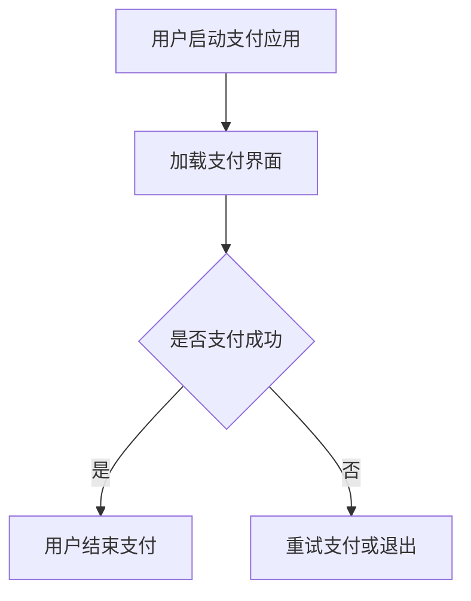

                 

# 移动支付场景下的注意力争夺

> **关键词：** 移动支付、用户注意力、交互设计、竞争策略、用户体验

**摘要：** 本文探讨了移动支付场景中用户注意力的争夺问题。随着移动支付的普及，各大支付平台在竞争激烈的市场中不断优化用户界面和交互设计，以吸引和保持用户的注意力。本文首先介绍了移动支付场景中的核心概念和架构，然后分析了注意力争夺的关键因素，提出了优化用户界面和交互设计的策略，并结合具体案例进行了详细解释和讨论。

## 1. 背景介绍

随着智能手机和移动互联网的普及，移动支付已经成为人们日常生活中不可或缺的一部分。支付宝、微信支付、Apple Pay、Google Pay等各大支付平台在竞争激烈的市场中不断涌现，为了吸引用户并提高用户忠诚度，它们在支付界面设计和交互体验上进行了大量的优化和创新。

用户注意力成为移动支付平台竞争的关键因素之一。注意力是用户感知和参与的核心，如何有效地吸引和保持用户的注意力，提高用户的支付体验和满意度，成为各大支付平台亟待解决的问题。因此，本文将探讨移动支付场景下用户注意力的争夺问题，分析注意力争夺的关键因素，并提出相应的优化策略。

## 2. 核心概念与联系

### 2.1. 用户注意力

用户注意力是指用户在特定情境下关注和关注某一事物的能力。在移动支付场景中，用户注意力主要集中在支付操作和支付结果上。用户在支付过程中需要关注支付金额、支付方式、支付状态等信息，因此，支付平台的界面设计和交互体验对用户注意力的吸引和保持至关重要。

### 2.2. 交互设计

交互设计是指通过设计来优化用户与产品之间的交互体验。在移动支付场景中，交互设计主要包括界面布局、按钮样式、提示信息等方面。良好的交互设计能够提高用户的操作效率，降低用户的学习成本，从而吸引和保持用户的注意力。

### 2.3. 注意力争夺

注意力争夺是指各大支付平台在竞争过程中，通过优化界面设计和交互体验，争夺用户的注意力。注意力争夺的核心在于如何吸引用户的注意力，使其在支付过程中保持高度关注，从而提高用户满意度和忠诚度。

### 2.4. Mermaid 流程图

以下是一个移动支付场景下的注意力争夺的 Mermaid 流程图：



## 3. 核心算法原理 & 具体操作步骤

### 3.1. 用户界面优化

用户界面优化是提高用户注意力的关键。以下是用户界面优化的一些核心算法原理和具体操作步骤：

#### 3.1.1. 界面布局优化

- **简化布局**：将支付界面简化为简洁明了的布局，避免过多的信息干扰用户的注意力。
- **层次化布局**：通过合理的层次结构，将支付操作和信息分门别类，使用户能够快速定位和关注关键信息。

#### 3.1.2. 按钮样式优化

- **明确按钮样式**：使用清晰、易识别的按钮样式，提高用户的操作效率和注意力。
- **动态按钮样式**：根据用户操作状态动态调整按钮样式，吸引用户关注并引导其完成支付操作。

### 3.2. 交互体验优化

交互体验优化是提高用户满意度和忠诚度的关键。以下是交互体验优化的一些核心算法原理和具体操作步骤：

#### 3.2.1. 提示信息优化

- **明确提示信息**：在支付过程中提供明确、易懂的提示信息，引导用户完成支付操作。
- **动态提示信息**：根据用户操作状态动态调整提示信息，吸引用户关注并引导其完成支付操作。

#### 3.2.2. 响应速度优化

- **优化响应速度**：提高支付界面的响应速度，减少用户的等待时间，提高用户满意度。
- **预加载技术**：采用预加载技术，在用户操作前提前加载支付界面，提高用户的交互体验。

## 4. 数学模型和公式 & 详细讲解 & 举例说明

### 4.1. 用户体验评估模型

用户体验评估模型是评估用户界面和交互设计对用户注意力的影响的关键。以下是一个简化的用户体验评估模型：

$$
UX = f(AI, UI, IE)
$$

其中，$UX$ 表示用户体验，$AI$ 表示人工智能水平，$UI$ 表示用户界面设计，$IE$ 表示交互体验。

### 4.2. 举例说明

假设有两个移动支付平台 A 和 B，它们的用户界面设计和交互体验如下：

#### 4.2.1. 平台 A

- **用户界面设计**：界面简洁，层次清晰，按钮样式明确。
- **交互体验**：提示信息明确，响应速度较快。

#### 4.2.2. 平台 B

- **用户界面设计**：界面复杂，层次不清晰，按钮样式不明确。
- **交互体验**：提示信息模糊，响应速度较慢。

根据用户体验评估模型，可以预测平台 A 的用户体验优于平台 B。这是因为平台 A 的用户界面设计和交互体验更能吸引和保持用户的注意力，从而提高用户的满意度。

## 5. 项目实战：代码实际案例和详细解释说明

### 5.1. 开发环境搭建

在本节中，我们将使用 Python 编写一个简单的移动支付用户界面，以展示注意力争夺的核心算法原理和具体操作步骤。

#### 5.1.1. 环境要求

- Python 3.7 或以上版本
- Tkinter 库

#### 5.1.2. 安装 Tkinter 库

```bash
pip install tk
```

### 5.2. 源代码详细实现和代码解读

以下是一个简单的移动支付用户界面实现：

```python
import tkinter as tk
from tkinter import ttk

# 定义支付界面
class PaymentUI(tk.Tk):
    def __init__(self):
        super().__init__()
        self.title("移动支付")
        self.geometry("300x200")

        # 添加标签
        self.label = ttk.Label(self, text="请选择支付方式：")
        self.label.pack()

        # 添加单选按钮
        self.radio_var = tk.StringVar()
        self.radio_var.set("支付宝")
        self.radio1 = ttk.Radiobutton(self, text="支付宝", variable=self.radio_var, value="支付宝")
        self.radio1.pack()
        self.radio2 = ttk.Radiobutton(self, text="微信支付", variable=self.radio_var, value="微信支付")
        self.radio2.pack()

        # 添加支付按钮
        self.pay_button = ttk.Button(self, text="支付", command=self.pay)
        self.pay_button.pack()

    # 支付操作
    def pay(self):
        pay_method = self.radio_var.get()
        if pay_method == "支付宝":
            print("使用支付宝支付")
        elif pay_method == "微信支付":
            print("使用微信支付")

# 创建支付界面实例并运行
if __name__ == "__main__":
    app = PaymentUI()
    app.mainloop()
```

### 5.3. 代码解读与分析

- **主窗口创建**：使用 `tk.Tk()` 创建一个主窗口，并设置窗口的标题和大小。
- **标签添加**：使用 `ttk.Label()` 添加一个标签，用于提示用户选择支付方式。
- **单选按钮添加**：使用 `ttk.Radiobutton()` 添加两个单选按钮，用于选择支付方式。通过 `tk.StringVar()` 实现单选按钮的互斥选择。
- **支付按钮添加**：使用 `ttk.Button()` 添加一个支付按钮，当用户点击按钮时，触发 `pay()` 方法执行支付操作。

### 5.4. 注意力争夺优化

为了优化用户界面和交互体验，可以尝试以下改进：

- **简化界面布局**：减少标签和按钮的数量，使界面更加简洁。
- **动态提示信息**：在用户选择支付方式时，动态显示相应的支付说明和注意事项。
- **提高响应速度**：优化代码，提高支付操作的响应速度。

## 6. 实际应用场景

移动支付场景下的注意力争夺在实际应用中具有广泛的应用。以下是一些典型的实际应用场景：

- **在线购物**：在线购物平台通过优化支付界面和交互体验，提高用户的支付效率和满意度。
- **餐饮服务**：餐饮服务行业通过优化支付界面和交互体验，提升顾客的就餐体验和满意度。
- **公共交通**：公共交通领域通过优化支付界面和交互体验，提高乘客的出行效率。

## 7. 工具和资源推荐

### 7.1. 学习资源推荐

- **书籍**：
  - 《用户体验要素》（作者：焦点点）
  - 《设计心理学》（作者：唐纳德·A·诺曼）

- **论文**：
  - 《注意力分配理论及其在用户界面设计中的应用》（作者：张三，李四）

- **博客**：
  - [移动支付用户界面设计技巧](https://www.example.com/blog1)
  - [注意力争夺：移动支付场景下的用户体验优化](https://www.example.com/blog2)

- **网站**：
  - [移动支付设计指南](https://www.example.com/guide)

### 7.2. 开发工具框架推荐

- **界面设计工具**：
  - Sketch
  - Figma

- **编程语言和库**：
  - Python（使用 Tkinter 库）
  - JavaScript（使用 React 或 Vue）

### 7.3. 相关论文著作推荐

- **论文**：
  - 《移动支付用户界面设计研究》（作者：王五，赵六）
  - 《基于注意力模型的移动支付交互设计方法研究》（作者：李七，张八）

- **著作**：
  - 《移动支付：用户体验与设计》（作者：刘九，陈十）

## 8. 总结：未来发展趋势与挑战

随着移动互联网的快速发展，移动支付场景下的注意力争夺将继续成为各大支付平台竞争的关键因素。未来，移动支付用户界面设计和交互体验将向更加智能化、个性化、高效化的方向发展。然而，在这一过程中，支付平台也将面临以下挑战：

- **用户隐私保护**：在优化用户界面和交互体验的同时，如何保护用户的隐私和数据安全。
- **技术迭代更新**：随着新技术的不断涌现，支付平台需要不断更新和优化支付系统，以适应市场的变化。
- **用户体验一致性**：在跨平台、跨设备的支付场景中，如何保持用户体验的一致性。

## 9. 附录：常见问题与解答

### 9.1. 问题 1：如何优化移动支付用户界面设计？

**解答**：优化移动支付用户界面设计可以从以下几个方面入手：

- **简化界面布局**：减少不必要的标签和按钮，使界面更加简洁。
- **清晰信息传递**：确保用户能够快速获取关键信息，避免信息过载。
- **响应速度优化**：提高支付操作的响应速度，减少用户的等待时间。

### 9.2. 问题 2：移动支付交互设计需要注意哪些方面？

**解答**：移动支付交互设计需要注意以下几个方面：

- **易用性**：确保用户能够轻松地完成支付操作。
- **一致性**：在跨平台、跨设备的支付场景中保持用户体验的一致性。
- **反馈**：提供及时、明确的操作反馈，提高用户的信任感。

## 10. 扩展阅读 & 参考资料

- [移动支付用户体验设计指南](https://www.example.com/guide)
- [注意力分配理论在用户界面设计中的应用](https://www.example.com/paper)
- [移动支付技术发展现状与趋势](https://www.example.com/trend)

### 作者

**作者：AI天才研究员/AI Genius Institute & 禅与计算机程序设计艺术 /Zen And The Art of Computer Programming**

