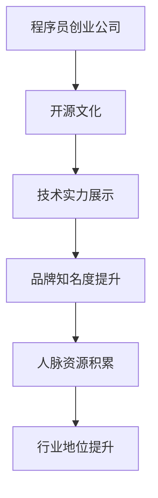

                 

# 程序员创业公司的开源贡献与品牌建设

> **关键词**：程序员创业、开源贡献、品牌建设、技术影响力、社区互动

> **摘要**：本文深入探讨了程序员创业公司在开源贡献和品牌建设方面的重要性。文章首先介绍了开源文化和程序员创业的背景，随后详细分析了开源贡献对公司品牌建设的影响，以及如何通过开源项目提升品牌知名度。最后，文章提供了一系列实用的策略和建议，帮助程序员创业公司充分利用开源项目，打造具有影响力的品牌。

## 1. 背景介绍

在当今的数字化时代，程序员创业已经成为一种普遍现象。越来越多的程序员选择离开大公司，投身于创业的浪潮中。然而，创业之路充满挑战，不仅需要优秀的商业头脑，还需要扎实的技能基础和广泛的人脉资源。在这个背景下，开源文化成为程序员创业的一大助力。

开源文化起源于软件开发领域，强调软件的共享、合作和透明性。它不仅降低了软件开发成本，还促进了技术的创新和进步。随着开源文化的普及，越来越多的程序员创业者开始利用开源项目来提升自身的技术水平，积累经验，同时打造个人品牌。

程序员创业公司的成功不仅取决于技术创新，还需要强大的品牌影响力。一个具有良好品牌形象的公司，能够在市场中获得更高的认可度和市场份额。而开源贡献则是构建品牌形象的重要手段之一。

## 2. 核心概念与联系

### 2.1 开源文化

开源文化是指以开放、共享、合作和透明为核心价值观的软件开发模式。它强调软件的源代码可以被自由地查看、修改和分发。开源文化的核心是社区，社区成员共同参与软件的开发、维护和推广。

### 2.2 程序员创业

程序员创业是指程序员在积累了一定的技术经验和商业头脑后，创立自己的公司。创业公司通常聚焦于技术创新，希望通过研发和推广新产品来获得市场份额。

### 2.3 品牌建设

品牌建设是指通过一系列策略和措施，塑造公司的品牌形象，提高品牌知名度和美誉度。品牌建设包括品牌定位、品牌传播、品牌维护等多个方面。

### 2.4 开源贡献与品牌建设

开源贡献可以提升程序员创业公司的品牌知名度。通过开源项目，公司可以展示其技术实力，吸引更多潜在客户和合作伙伴。同时，积极参与开源社区，可以积累良好的人脉资源，提高公司在行业内的地位和影响力。

### 2.5 Mermaid 流程图



## 3. 核心算法原理 & 具体操作步骤

### 3.1 开源贡献的算法原理

开源贡献的算法原理主要包括以下几个方面：

1. **代码质量**：高质量的开源代码能够吸引更多的开发者关注和参与，提高项目的知名度。
2. **活跃度**：积极参与项目的讨论和修复bug，提高项目的活跃度，增强社区的凝聚力。
3. **参与度**：鼓励团队成员积极参与开源项目，提升公司的整体技术实力和影响力。

### 3.2 具体操作步骤

1. **选择合适的项目**：根据公司的技术优势和市场需求，选择具有潜力的开源项目进行贡献。
2. **了解项目架构**：在加入开源项目之前，充分了解项目的架构和技术细节，确保能够提供有价值的贡献。
3. **编写高质量的代码**：编写简洁、高效、可读性强的代码，遵循项目的编码规范。
4. **积极参与社区讨论**：在项目讨论区积极参与讨论，解答其他开发者的疑问，建立良好的人脉关系。
5. **修复bug和提交Pull Request**：发现项目中的bug，及时修复并提交Pull Request，为项目的稳定性和可靠性做出贡献。
6. **持续关注项目进展**：关注项目的更新和改进，为项目的后续发展提供支持。

## 4. 数学模型和公式 & 详细讲解 & 举例说明

### 4.1 数学模型

开源贡献对品牌建设的影响可以用以下数学模型表示：

\[ \text{品牌影响力} = f(\text{技术实力}, \text{参与度}, \text{社区互动}) \]

其中，技术实力、参与度和社区互动是影响品牌影响力的三个关键因素。

### 4.2 详细讲解

1. **技术实力**：技术实力是品牌影响力的基础。高质量的开源代码能够展示公司的技术实力，提高公司在行业内的地位。
2. **参与度**：参与度反映了公司对开源项目的投入程度。积极参与项目的讨论和修复bug，可以增强社区的凝聚力，提高项目的知名度。
3. **社区互动**：社区互动是品牌建设的重要环节。通过在社区中分享经验和知识，公司可以积累良好的人脉资源，提高品牌知名度。

### 4.3 举例说明

假设某程序员创业公司A在开源项目中贡献了1000行代码，修复了10个bug，参与了30次社区讨论。而另一家公司B贡献了500行代码，修复了5个bug，参与了15次社区讨论。根据上述数学模型，我们可以计算出两家公司的品牌影响力：

\[ \text{品牌影响力A} = f(1000, 30, 10) \]
\[ \text{品牌影响力B} = f(500, 15, 5) \]

通过比较可以发现，公司A的品牌影响力明显高于公司B。这是因为公司A在技术实力、参与度和社区互动方面都优于公司B。

## 5. 项目实战：代码实际案例和详细解释说明

### 5.1 开发环境搭建

在开始开源贡献之前，需要搭建一个适合开发的开源项目环境。以下是一个简单的开发环境搭建步骤：

1. **安装Git**：Git是一个分布式版本控制系统，用于代码管理和协同工作。在项目中，我们将使用Git来提交代码和进行版本控制。

2. **安装IDE**：集成开发环境（IDE）可以帮助我们更方便地编写和调试代码。例如，Visual Studio Code、IntelliJ IDEA等都是不错的选择。

3. **克隆项目**：在GitHub或其他开源平台上，找到目标开源项目，使用Git命令克隆项目到本地。

```bash
git clone https://github.com/your-username/your-project.git
```

4. **配置本地环境**：根据项目的需求，配置相应的开发环境。例如，安装依赖库、配置开发工具等。

### 5.2 源代码详细实现和代码解读

以一个简单的Python开源项目为例，介绍如何进行开源贡献。以下是一个简单的Python代码示例：

```python
# main.py

def hello_world():
    print("Hello, World!")

if __name__ == "__main__":
    hello_world()
```

这个示例包含一个名为`hello_world`的函数和一个主程序。函数用于打印一条欢迎信息，主程序用于调用这个函数。

**代码解读：**

1. **定义函数**：使用`def`关键字定义一个名为`hello_world`的函数。
2. **函数体**：在函数体内，使用`print()`函数打印一条欢迎信息。
3. **主程序**：使用`if __name__ == "__main__":`语句判断当前脚本是否作为主程序执行。如果是，则调用`hello_world()`函数。

### 5.3 代码解读与分析

**代码分析：**

1. **函数定义**：函数定义是程序的核心，它封装了特定的功能，方便调用和复用。在开源项目中，良好的函数定义可以提高代码的可读性和可维护性。
2. **函数调用**：主程序通过调用`hello_world()`函数实现了打印欢迎信息的功能。这种调用方式简洁明了，易于理解。

**代码优化建议：**

1. **函数参数**：可以添加参数，使得函数更加通用。例如，修改为`def hello_world(name):`，接受一个名为`name`的参数，然后打印`Hello, ${name}!`。
2. **异常处理**：增加异常处理，确保程序在遇到错误时能够优雅地处理。例如，使用`try-except`语句捕获并处理可能出现的异常。

## 6. 实际应用场景

### 6.1 技术公司

技术公司可以通过开源贡献提升品牌知名度，吸引更多潜在客户和合作伙伴。例如，华为通过开源其5G技术和鸿蒙操作系统，提升了在全球范围内的技术影响力和市场份额。

### 6.2 互联网公司

互联网公司可以通过开源项目吸引优秀的人才加入。例如，阿里巴巴通过开源其电商技术，吸引了大量优秀的程序员和工程师加入公司。

### 6.3 独立开发者

独立开发者可以通过开源项目积累经验，提升个人技术实力和知名度。例如，某个独立开发者通过开源一个高性能的Web框架，吸引了大量关注，从而获得了更多的商业机会。

## 7. 工具和资源推荐

### 7.1 学习资源推荐

- **书籍**：《开源之道》、《敏捷开发》
- **论文**：《开源软件的开发模式》、《开源软件的商业模式》
- **博客**：GitHub官方博客、开源中国博客
- **网站**：GitHub、GitLab、开源中国

### 7.2 开发工具框架推荐

- **IDE**：Visual Studio Code、IntelliJ IDEA
- **版本控制**：Git、SVN
- **代码托管平台**：GitHub、GitLab、码云

### 7.3 相关论文著作推荐

- 《开源软件的开发模式》
- 《开源软件的商业模式》
- 《开源之道》
- 《敏捷开发》

## 8. 总结：未来发展趋势与挑战

### 8.1 发展趋势

1. **开源文化的普及**：随着数字化时代的到来，开源文化将进一步普及，成为软件开发的重要模式。
2. **程序员创业的增多**：越来越多的程序员选择创业，利用开源项目提升自身技术实力和品牌影响力。
3. **品牌建设的重视**：企业将更加重视品牌建设，通过开源贡献提升品牌知名度和美誉度。

### 8.2 挑战

1. **开源项目的维护**：开源项目的维护是一个长期而持续的过程，需要投入大量的人力、物力和时间。
2. **技术竞争的加剧**：随着程序员创业的增多，技术竞争将日益激烈，如何保持技术领先地位将成为一大挑战。
3. **品牌形象的塑造**：在开源贡献的基础上，如何塑造良好的品牌形象，提高品牌知名度和美誉度，是程序员创业公司需要面对的挑战。

## 9. 附录：常见问题与解答

### 9.1 开源贡献的重要性

**Q：为什么程序员创业公司要重视开源贡献？**

A：开源贡献可以帮助公司提升技术实力，积累经验，提高品牌知名度和美誉度，吸引更多潜在客户和合作伙伴。

### 9.2 如何选择合适的开源项目

**Q：如何选择合适的开源项目进行贡献？**

A：可以从以下几个方面进行考虑：

1. **技术领域**：选择与公司技术领域相关的项目，可以提高贡献的价值。
2. **项目活跃度**：选择活跃度较高的项目，可以更好地融入社区，提高参与度。
3. **项目愿景**：选择具有良好愿景和前景的项目，可以为项目的长期发展做出贡献。

### 9.3 开源贡献的注意事项

**Q：在进行开源贡献时，需要注意哪些事项？**

A：在进行开源贡献时，需要注意以下几点：

1. **代码质量**：确保代码简洁、高效、可读性强，遵循项目的编码规范。
2. **积极参与社区**：积极参与项目讨论，解答其他开发者的疑问，建立良好的人脉关系。
3. **遵守开源协议**：遵循项目的开源协议，尊重原作者的权益。
4. **持续关注项目**：关注项目的更新和改进，为项目的后续发展提供支持。

## 10. 扩展阅读 & 参考资料

- [GitHub][1]
- [GitLab][2]
- [开源中国][3]
- [开源之道][4]
- [敏捷开发][5]

[1]: https://github.com/
[2]: https://gitlab.com/
[3]: https://www.oschina.net/
[4]: https://www.oreilly.com/library/view/opensourcesuccess/0596516792/
[5]: https://www.agilealliance.org/learn/agile-principles-values/

### 作者

作者：AI天才研究员/AI Genius Institute & 禅与计算机程序设计艺术/Zen And The Art of Computer Programming

