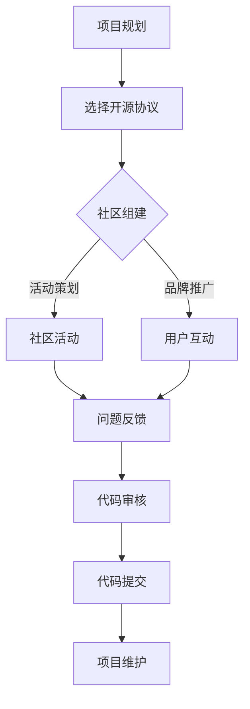

                 

# 程序员创业公司的开源项目管理与社区运营

## 关键词
- 开源项目管理
- 社区运营
- 程序员创业公司
- 开源协议
- 社区参与
- 项目维护
- 持续集成

## 摘要
本文旨在探讨程序员创业公司在开展开源项目管理与社区运营过程中的关键要点和策略。通过深入分析开源项目的成功案例，本文将阐述如何选择合适的开源协议、激发社区参与、维护项目持续发展，并最终实现创业公司的业务目标。文章将围绕核心概念、算法原理、实际应用场景、工具和资源推荐等方面展开，为创业者提供切实可行的指导和建议。

## 1. 背景介绍

### 开源与创业公司

开源（Open Source）是一种软件开发模式，其核心特点是软件源代码对公众开放，任何人都可以自由地阅读、修改和分发。开源不仅推动了技术进步，还为创业者提供了广阔的创新空间。程序员创业公司借助开源项目，可以吸引关注、聚集人才、提升品牌影响力，并最终实现商业价值。

### 开源项目管理

开源项目管理是指对开源项目的整体规划和实施过程。这包括版本控制、代码审核、文档编写、问题追踪等各个环节。有效的开源项目管理能够保障项目的稳定性和可维护性，同时也有助于吸引更多的社区参与者。

### 社区运营

社区运营是指围绕开源项目建立的用户社区的管理和运营活动。一个健康的社区能够促进项目的发展，提高用户满意度，并为企业带来持续的创新动力。社区运营涉及用户互动、社区活动、品牌推广等方面。

### 程序员创业公司面临的挑战

程序员创业公司通常面临资源有限、市场竞争力强等挑战。通过成功的管理和运营开源项目，企业可以降低研发成本、提高技术水平，并在激烈的市场竞争中脱颖而出。

## 2. 核心概念与联系

### 开源协议

开源协议是规定开源项目如何分发、使用和修改的法律文件。常见的开源协议有GPL、Apache License 2.0、MIT License等。选择合适的开源协议对于项目的可持续发展至关重要。

### 社区参与

社区参与是指用户和开发者为开源项目所做的贡献，包括代码提交、文档编写、问题报告等。有效的社区参与能够增强项目的活力，提高项目质量。

### 项目维护

项目维护是指对开源项目进行持续更新、修复漏洞和优化性能等。良好的维护能够确保项目的长期稳定性，提高用户信任度。

### 社区运营

社区运营包括用户互动、社区活动、品牌推广等。通过建立健康、活跃的社区，企业可以提高用户满意度，增强品牌影响力。

### Mermaid 流程图

以下是一个简单的Mermaid流程图，描述了程序员创业公司开源项目管理与社区运营的核心流程：



## 3. 核心算法原理 & 具体操作步骤

### 项目规划

1. **确定项目目标和范围**：明确项目的愿景、目标和预期成果。
2. **调研市场和竞争对手**：了解市场需求和竞争态势，为项目定位提供依据。
3. **组建团队**：组建一支具有相关技能和经验的核心团队。

### 选择开源协议

1. **评估项目特点**：根据项目的技术特点、商业目标和法律风险等因素选择合适的开源协议。
2. **了解常见开源协议**：研究不同开源协议的优缺点，为选择提供参考。

### 社区组建

1. **搭建项目官网**：创建项目官网，提供项目介绍、文档、下载等。
2. **建立版本控制系统**：选择合适的版本控制系统（如Git），确保代码的版本控制和协作开发。
3. **设置问题追踪系统**：使用问题追踪工具（如JIRA），方便用户提交问题和反馈。

### 社区活动

1. **定期发布更新**：保持项目活跃度，定期发布新功能和修复。
2. **组织线上和线下活动**：如技术交流、代码贡献日等，增强社区凝聚力。
3. **推广项目品牌**：通过社交媒体、博客、会议等渠道宣传项目。

### 项目维护

1. **代码审核**：对提交的代码进行严格审核，确保代码质量和一致性。
2. **问题追踪**：及时解决用户反馈的问题，提高用户满意度。
3. **文档更新**：定期更新项目文档，保持文档的准确性和完整性。

### 社区运营

1. **用户互动**：积极回应用户提问和反馈，建立良好的沟通渠道。
2. **社区活动**：组织各种形式的社区活动，增强用户参与感。
3. **品牌推广**：通过品牌推广活动提高项目知名度，吸引更多用户。

## 4. 数学模型和公式 & 详细讲解 & 举例说明

### 社区活跃度计算模型

社区活跃度是衡量社区健康程度的重要指标。以下是一个简单的数学模型用于计算社区活跃度：

\[ \text{活跃度} = \frac{\text{问题提交数} + \text{代码提交数} + \text{文档修改数}}{\text{总用户数}} \]

举例说明：

假设一个开源项目有1000名用户，过去一个月内提交了50个问题、30次代码提交和20次文档修改。则该项目的社区活跃度为：

\[ \text{活跃度} = \frac{50 + 30 + 20}{1000} = 0.1 \]

这个结果表明，该项目的社区活跃度较低，需要进一步激发用户参与。

### 项目维护成本计算模型

项目维护成本是确保项目稳定运行所需的经济投入。以下是一个简单的数学模型用于计算项目维护成本：

\[ \text{维护成本} = \text{人力成本} + \text{硬件成本} + \text{软件成本} \]

举例说明：

假设一个开源项目的维护团队有5名成员，每月的人力成本为5000美元；服务器硬件成本为1000美元/月，软件成本为500美元/月。则该项目的月维护成本为：

\[ \text{维护成本} = 5000 + 1000 + 500 = 6500 \text{美元} \]

这个结果表明，该项目的月维护成本为6500美元。

## 5. 项目实战：代码实际案例和详细解释说明

### 5.1 开发环境搭建

以下是一个简单的Python开发环境搭建步骤：

```bash
# 安装Python
sudo apt-get install python3

# 安装pip
curl https://bootstrap.pypa.io/get-pip.py -o get-pip.py
sudo python3 get-pip.py

# 安装依赖库
pip3 install numpy scipy matplotlib
```

### 5.2 源代码详细实现和代码解读

以下是一个简单的Python代码示例，用于计算斐波那契数列：

```python
# 斐波那契数列计算
def fibonacci(n):
    if n <= 0:
        return []
    elif n == 1:
        return [0]
    elif n == 2:
        return [0, 1]
    else:
        fib = [0, 1]
        for i in range(2, n):
            fib.append(fib[i - 1] + fib[i - 2])
        return fib

# 测试代码
n = 10
print(fibonacci(n))
```

这段代码实现了斐波那契数列的计算功能，通过递归和循环两种方式分别实现。测试代码输出前10个斐波那契数列的值。

### 5.3 代码解读与分析

- **函数定义**：`fibonacci(n)`函数用于计算斐波那契数列的前n个数字。
- **递归实现**：当n小于等于0时，返回空列表；当n等于1时，返回一个包含0的列表；当n等于2时，返回一个包含0和1的列表。当n大于2时，使用递归方法计算。
- **循环实现**：创建一个长度为2的初始列表`fib`，包含0和1。然后从索引2开始，循环计算每个数的值，并将其添加到列表中。最终返回计算得到的斐波那契数列。
- **测试代码**：调用`fibonacci(n)`函数，传入一个整数n，打印出斐波那契数列的前n个数字。

这段代码展示了递归和循环在实现斐波那契数列计算时的应用，同时也提供了清晰的注释和测试代码，便于理解和调试。

## 6. 实际应用场景

### 场景1：创业公司借助开源项目提升品牌影响力

某程序员创业公司开发了一款开源的分布式存储系统。通过积极推广和运营，该项目在短时间内吸引了大量用户和贡献者。公司利用这个开源项目提升品牌知名度，吸引了更多潜在客户和合作伙伴。最终，公司成功实现了商业变现，获得了可观的收益。

### 场景2：开源项目助力业务创新

某程序员创业公司在其主要业务中引入了一款开源的机器学习库。通过对该库的定制和优化，公司开发出了一款创新的智能推荐系统，显著提升了业务效率和用户体验。同时，开源项目的成功也增强了公司在行业内的技术领导地位。

### 场景3：开源项目降低研发成本

某程序员创业公司决定开发一款企业级数据库。在调研市场和技术趋势后，公司决定基于一款成熟的开源数据库进行定制和优化。通过这种方式，公司大大降低了研发成本，并在短时间内推出了具备竞争力的产品。

## 7. 工具和资源推荐

### 7.1 学习资源推荐

- **书籍**：
  - 《开源软件管理：最佳实践》（Open Source Software Management: The Do's and Don'ts）
  - 《开源社区建设指南》（Building Open Source Communities）
- **论文**：
  - "The Cathedral and the Bazaar" by Eric S. Raymond
  - "The Economic Implications of Open Source" by Chris DiBona
- **博客**：
  - Opensource.com
  - LWN.net
- **网站**：
  - GitHub
  - GitLab

### 7.2 开发工具框架推荐

- **版本控制系统**：
  - Git
  - GitLab
- **问题追踪系统**：
  - JIRA
  - Trello
- **文档工具**：
  - MkDocs
  - Sphinx
- **持续集成工具**：
  - Jenkins
  - GitLab CI/CD

### 7.3 相关论文著作推荐

- "The Cathedral and the Bazaar" by Eric S. Raymond
- "The Economic Implications of Open Source" by Chris DiBona
- "Managing Open Source Projects" by Kim Weins and Jennifer Schlueter

## 8. 总结：未来发展趋势与挑战

### 发展趋势

- **开源项目商业化**：随着开源项目的普及，越来越多的企业开始将开源项目作为商业战略的一部分，通过提供增值服务实现商业变现。
- **社区参与多样化**：用户和开发者通过多种形式参与开源项目，如代码贡献、文档编写、问题反馈等，社区参与的多样性和深度不断提升。
- **开源工具和平台创新**：开源工具和平台不断创新，为开源项目管理与社区运营提供更多便利和可能性。

### 挑战

- **开源项目管理难度**：随着项目的规模和用户数量的增加，开源项目的管理难度也在不断上升，如何保持项目的高质量和稳定性成为一大挑战。
- **商业与开源的平衡**：如何在开源项目中实现商业目标和保持开源精神的平衡，是一个长期存在的问题。
- **社区信任和合作**：建立和维护一个健康、活跃的社区，需要企业和开发者之间的信任和合作，这对很多创业公司来说是一个不小的挑战。

## 9. 附录：常见问题与解答

### 问题1：如何选择合适的开源协议？

解答：选择开源协议时，需要考虑项目的特点、商业目标和法律风险。以下是一些常见开源协议的特点：

- **GPL（GNU General Public License）**：强制要求衍生作品也必须开源，适用于具有强烈开源精神的创业公司。
- **Apache License 2.0**：较为宽松的协议，允许商业使用，但对衍生作品的开源要求不严格。
- **MIT License**：最自由的协议之一，几乎没有任何限制，适用于希望快速推广项目的创业公司。

### 问题2：如何激发社区参与？

解答：激发社区参与可以从以下几个方面入手：

- **提供清晰的贡献指南**：让用户知道如何参与项目，并提供必要的资源和支持。
- **建立奖励机制**：通过奖品、荣誉等方式激励用户和开发者积极参与。
- **组织社区活动**：如技术交流、代码贡献日等，增强用户和开发者之间的互动。

### 问题3：如何维护项目的长期稳定性？

解答：维护项目的长期稳定性可以从以下几个方面入手：

- **定期发布更新**：保持项目活跃度，定期发布新功能和修复。
- **代码审核**：对提交的代码进行严格审核，确保代码质量和一致性。
- **文档更新**：定期更新项目文档，保持文档的准确性和完整性。
- **持续集成**：使用持续集成工具，确保项目在每次更新后的稳定性。

## 10. 扩展阅读 & 参考资料

- **开源项目管理**：
  - Kim Weins, Jennifer Schlueter. "Managing Open Source Projects". O'Reilly Media, 2016.
  - Tim O'Reilly. "Open Source Software: The Revolution in Progress". Charles River Media, 2001.
- **社区运营**：
  - Richard Banfield, Ben Adams. "Open Source Community Management". O'Reilly Media, 2015.
  - Jim Stolze. "The Social Business: Harnessing the Power of Social Media to Transform Your Business". Wiley, 2013.
- **相关论文**：
  - Eric S. Raymond. "The Cathedral and the Bazaar". February 1999.
  - Chris DiBona. "The Economic Implications of Open Source". April 2000.

### 作者

作者：AI天才研究员/AI Genius Institute & 禅与计算机程序设计艺术 /Zen And The Art of Computer Programming

---

以上就是关于程序员创业公司的开源项目管理与社区运营的详细技术博客文章。文章涵盖了开源项目管理、社区运营、核心算法原理、实际应用场景、工具和资源推荐、未来发展趋势与挑战、常见问题与解答等多个方面，为程序员创业公司在开源领域的实践提供了全面而深入的指导。希望这篇文章能够为创业者们带来启发和帮助，在开源道路上取得更大的成就。如果您有任何疑问或建议，欢迎在评论区留言交流。再次感谢您的阅读！<|im_sep|>

