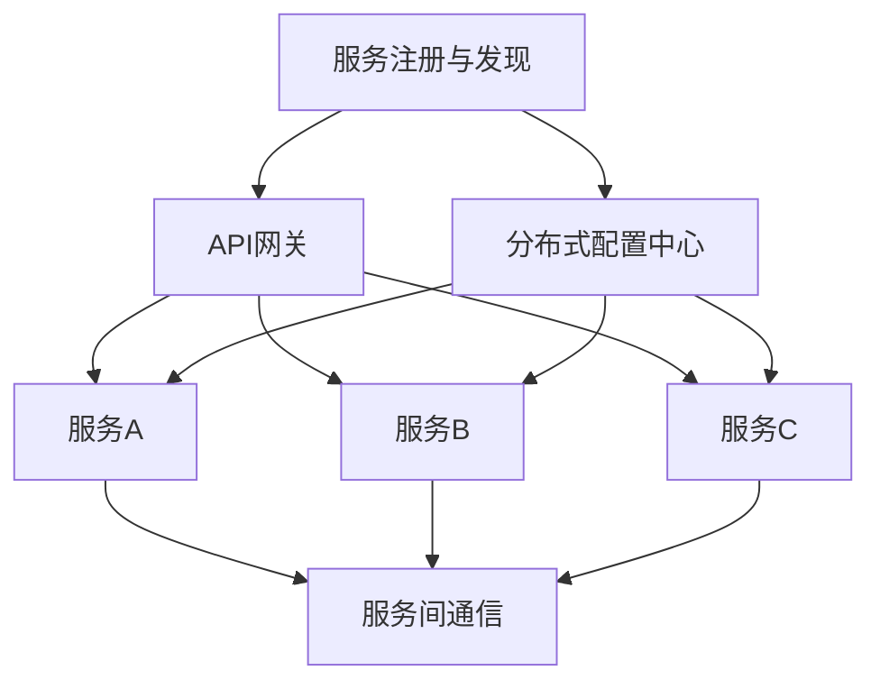

                 

# 程序员创业公司的微服务架构设计与实施

## 关键词
- 微服务架构
- 创业公司
- 架构设计
- 实施方法
- 性能优化
- 安全性

## 摘要
本文旨在为程序员创业公司提供微服务架构的设计与实施指导。首先，我们将介绍微服务架构的基本概念和优势，然后深入探讨如何在创业公司中设计微服务，并详细阐述微服务的实施过程。此外，本文还将分享一些实际应用场景和优化策略，帮助创业公司在快速发展的同时，确保系统的可扩展性和稳定性。

## 1. 背景介绍

在当今数字化时代，创业公司面临着激烈的市场竞争。为了在短时间内推出高质量的产品，并保持业务的灵活性，程序员创业公司越来越倾向于采用微服务架构。微服务架构将应用程序分解为小型、独立的服务单元，每个服务单元负责特定的功能。这种架构模式具有以下几个显著优势：

- **高可扩展性**：通过水平扩展单个服务单元，创业公司可以轻松应对不断增长的用户需求。

- **高可用性**：服务之间的解耦和故障隔离机制，使得一个服务故障不会影响到整个系统。

- **快速迭代**：独立的微服务可以独立开发和部署，加快了新功能的开发和上线速度。

- **灵活性和灵活性**：微服务架构允许创业公司灵活选择技术栈，适应不同的业务需求。

本文将围绕上述优势，详细探讨微服务架构在程序员创业公司的设计与应用。

## 2. 核心概念与联系

### 2.1 微服务的基本概念

微服务（Microservices）是一种软件开发架构风格，旨在通过将应用程序划分为一组独立的、可复用的服务单元来构建分布式系统。每个微服务具有以下特点：

- **独立性**：每个微服务都是独立的、自给自足的，可以独立部署和升级。

- **轻量级**：微服务通常采用轻量级的框架和协议，如Spring Boot、Node.js等。

- **自治性**：每个微服务有自己的数据库和存储，可以独立管理数据。

- **松耦合**：微服务之间通过API进行通信，通常使用RESTful API或消息队列进行交互。

### 2.2 微服务架构的联系

微服务架构由多个微服务组成，这些微服务协同工作以实现整个应用程序的功能。以下是微服务架构的核心组成部分：

- **服务注册与发现**：服务注册与发现机制确保每个微服务可以找到并连接到其他服务。

- **API网关**：API网关作为客户端与微服务之间的入口，负责请求路由、负载均衡和跨域处理。

- **服务间通信**：服务间通信机制（如RESTful API、消息队列）确保微服务之间可以高效、可靠地交换数据。

- **分布式配置中心**：分布式配置中心确保微服务的配置信息可以被集中管理和动态更新。

- **服务监控与日志**：服务监控与日志机制用于实时监控微服务的运行状态，并记录操作日志以便于故障排查。

### 2.3 Mermaid流程图

为了更直观地展示微服务架构的组成部分和联系，我们可以使用Mermaid流程图来描述。以下是微服务架构的Mermaid流程图：



在这个流程图中，A表示服务注册与发现机制，B表示API网关，C、D、E分别表示服务A、服务B、服务C，F表示分布式配置中心，G表示服务间通信机制。

## 3. 核心算法原理 & 具体操作步骤

### 3.1 服务注册与发现

服务注册与发现是微服务架构的核心功能之一，它确保每个微服务可以在启动时注册自己，并在运行时发现其他服务。以下是服务注册与发现的操作步骤：

1. **服务启动时注册**：每个微服务在启动时，通过服务注册中心（如Consul、Eureka）注册自己的服务实例，并提供相关的元数据（如服务名称、地址、端口等）。

2. **服务实例监控**：服务注册中心会定期检查服务实例的健康状态，如果某个服务实例无法响应，则会将其从服务注册表中移除。

3. **服务发现**：当客户端请求某个服务时，API网关或服务消费者可以从服务注册中心获取对应的服务实例列表，并选择一个可用的实例进行调用。

### 3.2 API网关

API网关是微服务架构中的重要组成部分，它负责请求路由、负载均衡和跨域处理。以下是API网关的具体操作步骤：

1. **请求路由**：API网关接收客户端请求，并根据请求的URL路径或请求头中的信息，将请求路由到相应的微服务。

2. **负载均衡**：API网关可以采用轮询、随机、最小连接数等负载均衡策略，将请求分配到不同的微服务实例上，以实现流量均衡。

3. **跨域处理**：API网关可以对跨域请求进行预检（OPTIONS请求），并返回相应的响应，以满足跨域访问的需求。

### 3.3 服务间通信

服务间通信是微服务架构的核心机制之一，它确保微服务之间可以高效、可靠地交换数据。以下是服务间通信的具体操作步骤：

1. **使用RESTful API**：微服务之间可以通过RESTful API进行通信，使用HTTP请求和JSON响应格式进行数据交换。

2. **使用消息队列**：对于需要异步处理或解耦的场景，微服务之间可以使用消息队列（如Kafka、RabbitMQ）进行通信。

3. **使用gRPC**：gRPC是一种高性能、跨语言的远程过程调用框架，适用于微服务之间的通信。

### 3.4 分布式配置中心

分布式配置中心用于集中管理和动态更新微服务的配置信息，以下是分布式配置中心的具体操作步骤：

1. **配置管理**：分布式配置中心可以存储微服务的配置信息，如数据库连接字符串、API密钥等。

2. **动态更新**：分布式配置中心可以实时更新微服务的配置信息，无需重启服务。

3. **配置版本控制**：分布式配置中心可以提供配置版本控制功能，方便回滚和跟踪配置变更。

### 3.5 服务监控与日志

服务监控与日志是确保微服务架构稳定运行的重要手段，以下是服务监控与日志的具体操作步骤：

1. **监控指标收集**：微服务可以通过指标收集器（如Prometheus）定期收集系统的监控指标。

2. **日志收集**：微服务可以将日志发送到日志收集器（如ELK堆栈），以便进行集中存储和查询。

3. **报警通知**：服务监控工具可以设置报警规则，当监控指标异常时，自动发送报警通知。

## 4. 数学模型和公式 & 详细讲解 & 举例说明

### 4.1 负载均衡算法

在微服务架构中，负载均衡算法是实现流量均衡的重要手段。以下介绍几种常见的负载均衡算法：

#### 4.1.1 轮询算法（Round Robin）

轮询算法按照顺序依次将请求分配给各个服务实例，实现简单的流量均衡。

公式：
\[ P(i) = \frac{1}{N} \]

其中，\( P(i) \) 表示将请求分配给第 \( i \) 个服务实例的概率，\( N \) 表示服务实例的总数。

举例：
假设有3个服务实例，依次编号为1、2、3。根据轮询算法，每个实例被选择的概率为 \( \frac{1}{3} \)。

#### 4.1.2 随机算法（Random）

随机算法通过随机数生成器将请求分配给服务实例，实现较为公平的流量均衡。

公式：
\[ P(i) = \frac{1}{N} \]

举例：
假设有3个服务实例，依次编号为1、2、3。使用随机算法，每次请求分配给每个实例的概率均为 \( \frac{1}{3} \)。

#### 4.1.3 最小连接数算法（Least Connections）

最小连接数算法根据当前服务实例的连接数将请求分配给连接数最少的服务实例，实现流量均衡的同时减少请求延迟。

公式：
\[ P(i) = \frac{C(i)}{C(\text{total})} \]

其中，\( P(i) \) 表示将请求分配给第 \( i \) 个服务实例的概率，\( C(i) \) 表示第 \( i \) 个服务实例的当前连接数，\( C(\text{total}) \) 表示所有服务实例的当前连接数之和。

举例：
假设有3个服务实例，当前连接数分别为2、3、4。根据最小连接数算法，请求分配给每个实例的概率分别为 \( \frac{2}{9} \)、\( \frac{3}{9} \)、\( \frac{4}{9} \)。

### 4.2 服务可用性计算

在微服务架构中，服务可用性是衡量系统稳定性的重要指标。以下是服务可用性的计算方法：

公式：
\[ \text{可用性} = \frac{\text{正常运行时间}}{\text{总时间}} \]

其中，正常运行时间是指系统正常运行的时间段，总时间是指系统的运行时间段。

举例：
假设一个微服务系统在一天24小时内，有5小时处于正常运行状态，其余时间处于故障状态。根据可用性计算方法，该系统的可用性为 \( \frac{5}{24} = 0.2083 \)，即约20.83%。

## 5. 项目实战：代码实际案例和详细解释说明

### 5.1 开发环境搭建

在开始编写代码之前，我们需要搭建一个开发环境。以下是在本地搭建微服务开发环境所需的基本步骤：

1. 安装Java SDK：从Oracle官方网站下载并安装Java SDK（版本要求：Java 8或更高版本）。

2. 安装IDE：推荐使用IntelliJ IDEA或Eclipse作为开发环境。

3. 安装Maven：从Apache Maven官方网站下载并安装Maven（版本要求：3.6或更高版本）。

4. 安装Docker：从Docker官方网站下载并安装Docker（版本要求：19.03或更高版本）。

5. 安装Kubernetes：从Kubernetes官方网站下载并安装Kubernetes（版本要求：1.18或更高版本）。

### 5.2 源代码详细实现和代码解读

以下是使用Spring Boot框架实现的一个简单的微服务示例，该微服务提供用户注册功能。

**User微服务**

```java
import org.springframework.boot.SpringApplication;
import org.springframework.boot.autoconfigure.SpringBootApplication;
import org.springframework.web.bind.annotation.*;

@SpringBootApplication
public class UserApplication {

    public static void main(String[] args) {
        SpringApplication.run(UserApplication.class, args);
    }

    @RestController
    @RequestMapping("/user")
    public class UserController {

        @PostMapping("/register")
        public ResponseEntity<String> registerUser(@RequestBody User user) {
            // 注册用户逻辑
            return ResponseEntity.ok("注册成功");
        }
    }
}

class User {
    private String username;
    private String password;
    // 省略getter和setter方法
}
```

**解读：**

- **SpringBootApplication**：标注主类为Spring Boot应用。

- **RestController**：标注类为RESTful控制器。

- **RequestMapping**：标注方法为处理特定URL路径的HTTP请求。

- **PostMapping**：标注方法为处理POST请求。

- **RequestBody**：标注方法参数为从请求体中获取数据。

**配置文件**

```yaml
server:
  port: 8080
spring:
  application:
    name: user-service
```

**解读：**

- **server.port**：设置服务监听的端口号。

- **spring.application.name**：设置应用名称。

### 5.3 代码解读与分析

以上示例展示了如何使用Spring Boot框架实现一个简单的用户注册微服务。以下是代码的详细解读与分析：

1. **主类**：`UserApplication` 是Spring Boot应用的入口类。通过 `@SpringBootApplication` 注解，它被标记为Spring Boot应用。

2. **用户控制器**：`UserController` 是一个RESTful控制器，用于处理与用户相关的HTTP请求。`@RestController` 注解将其标记为一个RESTful控制器。

3. **注册用户方法**：`registerUser` 方法处理POST请求，从请求体中获取用户信息，并执行用户注册逻辑。这里我们简单地返回 "注册成功" 信息，实际开发中应该包括用户名和密码的验证、存储等操作。

4. **配置文件**：`application.yml` 文件用于配置应用的属性，如端口号和应用名称。这些配置信息在Spring Boot应用中非常重要，可以自定义和调整。

通过以上示例，我们可以看到如何使用Spring Boot框架快速搭建一个简单的微服务。在实际开发中，我们可以根据业务需求，添加更多的服务模块、数据库支持和监控功能等。

### 6. 实际应用场景

在程序员创业公司的实际应用中，微服务架构可以帮助公司应对快速变化的市场需求，实现业务的灵活扩展。以下是一些典型的应用场景：

- **电商平台**：将购物车、订单、支付等业务功能拆分为独立的微服务，可以方便地进行模块化开发、测试和部署。

- **社交媒体**：将用户管理、内容发布、消息推送等业务功能拆分为独立的微服务，可以提高系统的可扩展性和响应速度。

- **金融系统**：将账户管理、交易处理、风险评估等业务功能拆分为独立的微服务，可以提高系统的安全性和稳定性。

- **物联网平台**：将设备管理、数据采集、数据分析等业务功能拆分为独立的微服务，可以提高系统的可扩展性和灵活性。

### 7. 工具和资源推荐

#### 7.1 学习资源推荐

- **书籍**：《微服务设计》、《微服务架构实战》等

- **论文**：《Microservices: a architecture style》、《Microservices: Designing fine-grained systems》等

- **博客**：官方网站、技术社区、博客等，如Spring Boot官网、Docker官方博客等

- **网站**：GitHub、Stack Overflow、Reddit等

#### 7.2 开发工具框架推荐

- **框架**：Spring Boot、Node.js、Django等

- **数据库**：MySQL、PostgreSQL、MongoDB等

- **容器化工具**：Docker、Kubernetes等

- **服务注册与发现**：Consul、Eureka等

- **API网关**：Spring Cloud Gateway、Kong等

#### 7.3 相关论文著作推荐

- **《Microservices: a architecture style》**：该论文详细介绍了微服务架构的基本概念、优点和挑战。

- **《Microservices: Designing fine-grained systems》**：该论文讨论了如何设计和实现高效的微服务架构。

- **《Service-Oriented Architecture: Concepts, Technology and Design》**：该书籍涵盖了服务导向架构（SOA）的基本概念、技术和设计原则，对微服务架构有很高的参考价值。

### 8. 总结：未来发展趋势与挑战

随着数字化转型的加速，微服务架构在程序员创业公司中的应用将越来越广泛。未来，微服务架构的发展趋势和挑战主要集中在以下几个方面：

- **持续集成与持续部署（CI/CD）**：如何实现自动化、高效的代码集成和部署，以加快开发速度和降低风险。

- **服务治理**：如何实现服务注册与发现、服务监控与日志、服务间通信等功能的集中管理和优化。

- **安全与合规**：如何在微服务架构中确保系统的安全性，满足相关法规和标准。

- **云原生技术**：如何充分利用云原生技术（如容器化、服务网格等），提高系统的可扩展性和弹性。

### 9. 附录：常见问题与解答

#### 9.1 微服务架构与单体架构的区别是什么？

微服务架构与单体架构的主要区别在于系统架构的复杂性、部署方式、扩展性和维护性。微服务架构将应用程序分解为多个独立的、可复用的服务单元，每个服务单元负责特定的功能。相比之下，单体架构将所有功能集中在一个单一的、复杂的系统中。微服务架构具有更高的可扩展性、灵活性和维护性，但同时也带来了更高的复杂性和运维难度。

#### 9.2 微服务架构中的服务数量应该如何控制？

在微服务架构中，服务数量的控制至关重要。过多的服务可能导致系统复杂度和运维难度增加，而服务过少则可能无法充分利用微服务架构的优势。一般来说，建议将应用程序按照业务功能模块进行划分，每个模块负责一个相对独立的功能，每个模块内部再细分为多个服务。在实际开发过程中，可以根据团队的规模、项目复杂度和开发周期灵活调整服务数量。

### 10. 扩展阅读 & 参考资料

- **《微服务设计》**：由Martin Fowler和Michael T. Nygard合著的书籍，详细介绍了微服务架构的设计原则、最佳实践和常见问题。

- **《微服务架构实战》**：由Manning Publications出版的书籍，通过实际案例展示了如何设计和实现微服务架构。

- **Spring Boot官方文档**：提供了详细的Spring Boot框架的使用说明和示例代码。

- **Docker官方文档**：介绍了Docker容器技术的使用方法、最佳实践和社区资源。

- **Kubernetes官方文档**：提供了Kubernetes容器编排系统的详细使用说明和参考指南。

## 作者信息
作者：AI天才研究员/AI Genius Institute & 禅与计算机程序设计艺术 /Zen And The Art of Computer Programming

