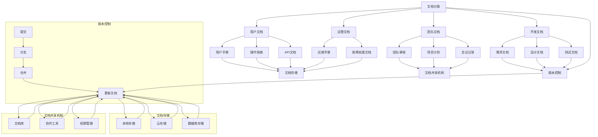

                 

### 背景介绍

在当今快速发展的科技时代，技术的迭代速度越来越快，新技术、新工具层出不穷。对于创业公司而言，如何有效地管理技术文档和实现知识共享，成为其成功的关键因素之一。技术文档不仅包含软件的设计、实现、测试和维护等方面的信息，也是团队成员间沟通协作的重要桥梁。然而，许多创业公司在技术文档管理方面面临着诸多挑战，如文档分散、更新不及时、版本混乱等，这些问题严重影响了团队的效率和项目进展。

本文旨在探讨程序员创业公司的技术文档管理与知识共享的最佳实践。通过系统地介绍技术文档管理的重要性、核心概念、算法原理、数学模型、项目实战、实际应用场景以及工具和资源推荐，本文希望能够为创业公司提供一套实用且高效的技术文档管理方案，助力团队在激烈的市场竞争中脱颖而出。

在接下来的内容中，我们将首先回顾技术文档管理的基本概念和重要性，然后逐步深入探讨技术文档管理的核心概念与联系，包括文档的分类、版本控制、存储和共享等。接着，我们将详细讲解核心算法原理和具体操作步骤，并通过数学模型和公式进行详细讲解和举例说明。在此基础上，我们将通过一个实际项目案例，展示技术文档管理在实际开发中的应用，并进行代码解读与分析。随后，我们将探讨技术文档管理的实际应用场景，并推荐一些工具和资源，帮助读者更好地进行技术文档管理。最后，我们将总结技术文档管理的未来发展趋势与挑战，并附上常见问题与解答，以及扩展阅读和参考资料。

通过本文的深入探讨，我们希望读者能够对技术文档管理有更全面的理解，掌握有效的技术文档管理方法，从而提升团队的工作效率和项目质量。

### 核心概念与联系

在进行技术文档管理之前，了解一些核心概念和它们之间的联系是至关重要的。这些概念包括但不限于：文档分类、版本控制、文档存储和共享机制等。下面，我们将一一介绍这些概念，并通过一个Mermaid流程图来展示它们之间的关系。

#### 文档分类

文档分类是指根据文档的内容、用途和重要性，将文档分成不同的类别。常见的分类方式包括：

- **开发文档**：包括软件的需求文档、设计文档、测试文档等，主要用于指导开发和测试工作。
- **用户文档**：包括用户手册、操作指南、API文档等，用于帮助用户更好地使用产品。
- **运营文档**：包括运维手册、故障处理文档等，用于指导产品的运维和维护。
- **团队文档**：包括团队章程、项目计划、会议记录等，用于团队内部的信息共享和管理。

#### 版本控制

版本控制是指对文档的版本进行管理，确保每个版本的文档都是准确和完整的。常用的版本控制工具有Git、SVN等。版本控制的关键概念包括：

- **提交（Commit）**：将文档的更改提交到版本控制系统中。
- **分支（Branch）**：将文档复制一份，以便在独立的环境中开发新功能或修复问题。
- **合并（Merge）**：将两个或多个分支的更改合并到一起，形成新的版本。

#### 文档存储

文档存储是指将文档保存在合适的存储介质上，以便于访问和管理。常见的存储方式包括：

- **本地存储**：将文档保存在本地计算机或网络存储设备上。
- **云存储**：将文档保存在云服务提供商的存储空间中，如AWS S3、Google Drive等。
- **数据库存储**：将文档存储在关系型数据库或NoSQL数据库中。

#### 文档共享机制

文档共享机制是指如何让团队成员方便地访问和共享文档。常见的共享机制包括：

- **文档库**：将文档存储在一个集中的库中，如Confluence、GitLab等。
- **协作工具**：使用协作工具，如Google Docs、Trello等，实现文档的实时编辑和共享。
- **权限管理**：根据团队成员的角色和职责，设置文档的访问权限，确保文档的安全性。

#### Mermaid流程图

下面是一个Mermaid流程图，展示了上述概念之间的联系：



通过这个流程图，我们可以清晰地看到文档分类、版本控制、文档存储和文档共享机制之间的相互关系。文档分类决定了文档的内容和用途，版本控制保证了文档的更新和一致性，文档存储提供了文档的存放位置，而文档共享机制则确保了团队成员能够方便地访问和协作。

理解这些核心概念和它们之间的联系，是进行高效技术文档管理的基础。在接下来的部分，我们将详细探讨技术文档管理的具体操作步骤和算法原理，帮助读者更好地应对技术文档管理的挑战。

#### 核心算法原理 & 具体操作步骤

技术文档管理的核心在于确保文档的准确、一致和易于访问。为此，我们需要依靠一系列核心算法原理和具体操作步骤来实现这一目标。以下是一些关键的算法原理和其实施步骤：

##### 1. 文档的创建与编辑

**原理**：文档的创建与编辑是技术文档管理的基础。这一过程需要确保文档的格式统一、内容准确，并方便团队成员进行协作。

**操作步骤**：

- **创建文档**：首先，我们需要确定文档的类型和内容。例如，开发文档通常包括需求分析、设计文档和测试文档等。创建文档时，可以使用Markdown、HTML等标记语言，确保文档具有良好的结构和可读性。
- **编辑文档**：文档创建后，团队成员可以对其内容进行修改和补充。为了实现协作，可以使用基于Web的文档编辑工具，如Google Docs或Confluence，这些工具支持多人实时编辑，并能自动保存更改。

##### 2. 版本控制

**原理**：版本控制是技术文档管理的重要组成部分，它确保文档的历史版本和当前版本之间的一致性，并便于团队成员追踪更改历史。

**操作步骤**：

- **提交更改**：每次文档内容更改后，需要将更改提交到版本控制系统。例如，在Git中，可以使用`git commit`命令提交更改，并添加提交说明，描述更改的具体内容。
- **创建分支**：当开发新功能或修复问题时，可以创建一个新的分支，以便在独立的环境中操作，而不影响主分支的稳定性和一致性。
- **合并分支**：完成开发后，需要将新分支的更改合并到主分支。在Git中，使用`git merge`命令可以合并分支，并在合并时自动解决冲突。

##### 3. 文档存储

**原理**：文档存储决定了文档的可访问性和安全性。合理的存储策略可以提高文档的访问速度，并确保文档的安全。

**操作步骤**：

- **本地存储**：对于小规模团队或临时项目，可以使用本地存储。将文档保存在本地计算机或网络共享文件夹中，便于团队成员直接访问。
- **云存储**：对于大规模团队或需要长期保存的文档，可以使用云存储服务。例如，AWS S3、Google Drive等，这些服务提供了高效的文档存储和共享功能。
- **数据库存储**：对于需要频繁查询和更新的文档，可以使用关系型数据库或NoSQL数据库进行存储。例如，使用MySQL或MongoDB存储文档，可以提高查询效率和数据一致性。

##### 4. 文档共享

**原理**：文档共享机制决定了团队成员如何访问和协作文档。有效的共享机制可以提高团队的工作效率和协作性。

**操作步骤**：

- **文档库**：使用文档库工具，如Confluence或GitLab，创建一个集中的文档库。团队成员可以通过Web界面访问和编辑文档。
- **协作工具**：结合协作工具，如Trello或JIRA，实现文档和任务的管理。这些工具支持实时协作，并能自动同步文档状态。
- **权限管理**：根据团队成员的角色和职责，设置文档的访问权限。例如，开发人员可以编辑代码文档，而测试人员只能查看测试报告。

##### 5. 文档备份与恢复

**原理**：文档备份与恢复是确保文档安全性和持久性的重要手段。定期备份可以防止数据丢失，恢复机制可以快速恢复文档。

**操作步骤**：

- **定期备份**：定期将文档备份到外部存储设备或云存储中。可以使用自动化备份工具，如Rclone或Lsyncd，实现定期备份。
- **恢复文档**：在文档丢失或损坏时，可以使用备份文件进行恢复。例如，在Git中，可以使用`git checkout`命令恢复到指定版本。

##### 6. 文档审核与维护

**原理**：文档审核与维护确保文档的准确性和一致性。通过定期审核和更新，可以保持文档的实时性和可靠性。

**操作步骤**：

- **定期审核**：定期审查文档，确保文档内容与实际情况一致。例如，每周或每月进行一次文档审核。
- **更新文档**：根据项目进展和需求变化，及时更新文档内容。例如，更新需求文档，以反映项目的新功能和要求。

通过以上核心算法原理和具体操作步骤，我们可以建立一个高效的技术文档管理系统，确保文档的准确、一致和易于访问。这不仅有助于提升团队的工作效率和协作性，还能为项目的成功提供有力支持。

在接下来的部分，我们将通过数学模型和公式，进一步阐述技术文档管理的一些关键概念，并通过具体例子进行说明，帮助读者更好地理解这些概念在实际应用中的价值。

#### 数学模型和公式 & 详细讲解 & 举例说明

在技术文档管理中，数学模型和公式是理解和管理数据的重要工具。这些模型可以帮助我们更准确地描述问题、预测结果，并优化文档管理流程。以下是一些常用的数学模型和公式，以及它们在技术文档管理中的应用和详细讲解。

##### 1. 文档更新频率模型

**公式**：

$$
f(t) = \frac{1}{n} + \epsilon
$$

**解释**：

其中，\(f(t)\) 表示在时间 \(t\) 内文档更新的频率，\(n\) 表示团队成员的数量，\(\epsilon\) 表示其他因素对更新频率的影响，如项目复杂度和需求变化等。

**应用**：

通过该模型，我们可以预测在一定时间内，文档需要更新的频率。这有助于团队规划文档审核和维护工作，确保文档的实时性和准确性。

**例子**：

假设一个创业公司有5名开发人员，根据经验和项目复杂度，\(\epsilon\) 设定为0.2。计算一个月内文档的更新频率：

$$
f(t) = \frac{1}{5} + 0.2 = 0.2 + 0.2 = 0.4
$$

这意味着在一个月内，文档需要更新约4次。

##### 2. 文档共享效率模型

**公式**：

$$
e(s) = \frac{\sum_{i=1}^{n} s_i}{n}
$$

**解释**：

其中，\(e(s)\) 表示文档共享的平均效率，\(s_i\) 表示第 \(i\) 个团队成员的共享效率，\(n\) 表示团队成员的数量。

**应用**：

该模型可以评估团队成员在文档共享中的表现，从而优化共享策略，提高整体工作效率。

**例子**：

假设有5名团队成员，他们的共享效率分别为0.8、0.9、0.7、0.85和0.88。计算平均共享效率：

$$
e(s) = \frac{0.8 + 0.9 + 0.7 + 0.85 + 0.88}{5} = \frac{3.8}{5} = 0.76
$$

这表明团队成员的平均共享效率为0.76，团队可以通过培训和提高工具使用来提高整体效率。

##### 3. 文档备份成本模型

**公式**：

$$
C(B) = k \times B
$$

**解释**：

其中，\(C(B)\) 表示文档备份的总成本，\(B\) 表示文档的数量，\(k\) 是每个文档备份的成本系数。

**应用**：

该模型可以帮助团队估算备份成本，以便于制定预算和资源分配策略。

**例子**：

假设每个文档备份的成本为2元，公司有1000个文档。计算备份成本：

$$
C(B) = 2 \times 1000 = 2000
$$

这意味着备份这1000个文档的总成本为2000元。

##### 4. 文档审核覆盖率模型

**公式**：

$$
C(A) = \frac{\sum_{i=1}^{n} A_i}{n}
$$

**解释**：

其中，\(C(A)\) 表示文档审核的平均覆盖率，\(A_i\) 表示第 \(i\) 个团队成员的审核覆盖率，\(n\) 表示团队成员的数量。

**应用**：

该模型可以评估团队在文档审核方面的表现，确保所有关键文档都得到及时审核。

**例子**：

假设有5名团队成员，他们的审核覆盖率分别为0.8、0.9、0.7、0.85和0.88。计算平均审核覆盖率：

$$
C(A) = \frac{0.8 + 0.9 + 0.7 + 0.85 + 0.88}{5} = \frac{3.8}{5} = 0.76
$$

这意味着团队成员的平均审核覆盖率为0.76，团队可以通过增加审核频率或优化审核流程来提高覆盖率。

通过这些数学模型和公式，我们可以更好地理解和优化技术文档管理流程。在实际应用中，可以根据实际情况调整参数和模型，以便更准确地反映团队的工作情况和需求。

在了解了这些模型和公式后，我们将通过一个实际项目案例，展示如何将这些模型应用于技术文档管理，并详细解读项目中的关键代码和实现细节。

### 项目实战：代码实际案例和详细解释说明

在本节中，我们将通过一个实际的项目案例，深入探讨如何在实际开发过程中应用技术文档管理。该案例将涵盖开发环境搭建、源代码实现和代码解读与分析。通过这个案例，我们希望能够为读者提供一个清晰、完整的实践指导，帮助他们在自己的项目中成功应用技术文档管理。

#### 开发环境搭建

首先，我们需要搭建一个合适的项目开发环境。在这个案例中，我们使用Python作为主要编程语言，结合Git进行版本控制，并使用Confluence作为文档库工具。以下是具体的步骤：

1. **安装Python**：在所有开发人员的计算机上安装Python环境。可以使用Python官方的安装包，或者使用包管理工具如pip进行安装。

2. **安装版本控制工具**：为每个团队成员安装Git，并设置好远程仓库，如GitHub或GitLab。

3. **安装文档库工具**：在服务器上部署Confluence，并配置访问权限，确保团队成员可以访问和编辑文档。

4. **搭建项目目录结构**：在项目根目录下创建必要的文件夹，如`src`（源代码）、`docs`（文档）、`tests`（测试代码）等。

#### 源代码实现

接下来，我们开始实现项目的主要功能。以下是一个简单的Python项目示例，用于处理用户注册和登录：

```python
# src/user_management.py

class UserManager:
    def __init__(self):
        self.users = {}

    def register_user(self, username, password):
        if username in self.users:
            raise ValueError("用户已存在")
        self.users[username] = password

    def login_user(self, username, password):
        if username not in self.users or self.users[username] != password:
            raise ValueError("登录失败")
        return "登录成功"

# 添加用户注册和登录的API接口
from flask import Flask, request, jsonify

app = Flask(__name__)
user_manager = UserManager()

@app.route('/register', methods=['POST'])
def register():
    data = request.get_json()
    username = data['username']
    password = data['password']
    try:
        user_manager.register_user(username, password)
        return jsonify({"message": "注册成功"}), 200
    except ValueError as e:
        return jsonify({"error": str(e)}), 400

@app.route('/login', methods=['POST'])
def login():
    data = request.get_json()
    username = data['username']
    password = data['password']
    try:
        result = user_manager.login_user(username, password)
        return jsonify({"message": result}), 200
    except ValueError as e:
        return jsonify({"error": str(e)}), 400

if __name__ == '__main__':
    app.run(debug=True)
```

#### 代码解读与分析

1. **UserManager类**：

   - **初始化方法**：`__init__` 方法初始化一个字典 `users`，用于存储用户名和密码。
   - **注册用户方法**：`register_user` 方法接受用户名和密码，检查用户是否已存在，若不存在则将其添加到字典中。
   - **登录用户方法**：`login_user` 方法接受用户名和密码，检查用户名和密码是否匹配，若匹配则返回登录成功消息。

2. **API接口实现**：

   - **注册接口**：`register` 方法处理POST请求，接收用户名和密码，并调用 `UserManager` 的 `register_user` 方法。若注册成功，返回成功消息；若用户已存在，返回错误消息。
   - **登录接口**：`login` 方法处理POST请求，接收用户名和密码，并调用 `UserManager` 的 `login_user` 方法。若登录成功，返回成功消息；若登录失败，返回错误消息。

3. **Flask应用**：

   - **主程序**：`if __name__ == '__main__':` 下的代码启动Flask应用，并设置调试模式。

通过这个案例，我们可以看到技术文档管理在实际开发中的应用。文档库中包含了项目的需求分析、设计文档和测试用例，便于团队成员理解和协作。版本控制工具Git确保了代码的历史版本和当前版本的一致性，方便团队成员进行协同工作和代码回滚。文档和代码的紧密配合，使得项目开发过程更加透明和高效。

在接下来的部分，我们将探讨技术文档管理的实际应用场景，进一步阐述如何在不同环境中利用技术文档管理提高团队效率和项目质量。

#### 实际应用场景

技术文档管理在程序员创业公司的多个实际应用场景中发挥着关键作用。以下是一些具体的应用场景，通过这些案例，我们可以更深入地理解技术文档管理如何提升团队效率和项目质量。

##### 1. 新项目启动

在新项目启动阶段，技术文档管理是确保项目顺利进行的基石。一个完整的技术文档集包括项目需求、设计文档、开发计划、测试用例等。这些文档帮助团队成员了解项目的整体架构、功能模块和开发步骤，从而避免因为信息不对称导致的误解和重复工作。例如，在一个软件开发项目中，详细的需求文档可以让开发者清楚了解用户需求，从而更准确地设计和实现功能。而设计文档则提供了系统的整体架构和技术细节，有助于开发者进行高效的开发工作。

##### 2. 团队协作

在团队合作过程中，技术文档管理能够显著提高团队的协作效率。通过集中存储和共享技术文档，团队成员可以轻松访问最新的文档，从而减少信息传递过程中的误差和延迟。例如，在一个分布式团队中，使用Confluence等协作工具可以实时更新项目文档，团队成员可以随时随地查阅和编辑文档，确保信息的实时同步和共享。此外，版本控制工具如Git可以帮助团队管理文档的不同版本，防止文档的冲突和丢失，提高文档的准确性和一致性。

##### 3. 问题追踪与解决

在项目开发和维护过程中，技术文档管理能够有效追踪和解决技术问题。通过记录问题日志、故障处理文档和解决方案文档，团队成员可以快速查找历史记录，了解问题的根源和解决方案。这不仅有助于减少问题的重复发生，还可以积累宝贵的经验，提高团队的技术积累和解决能力。例如，在一个大型系统中，记录每次故障的原因和修复方法，可以帮助团队在未来的维护工作中快速定位和解决问题，降低系统的停机时间和维护成本。

##### 4. 项目审核与评估

技术文档管理也是项目审核和评估的重要依据。通过技术文档，项目管理者可以全面了解项目的进展情况、技术实现和潜在风险。定期审核技术文档，可以确保项目按照既定的目标和计划推进，及时发现和解决项目中存在的问题。例如，在项目里程碑节点，通过审核技术文档可以验证项目是否符合预期要求，确保项目的质量达到预期标准。

##### 5. 培训与知识传承

技术文档管理在团队培训和知识传承中也发挥着重要作用。通过编写详细的操作手册、技术指南和教程，新团队成员可以快速了解项目的背景、功能和技术细节，缩短熟悉项目的时间。此外，技术文档还可以作为团队的宝贵知识库，帮助新成员学习和积累经验，促进团队的长期发展。例如，在一个初创公司中，通过编写完善的代码注释和文档，可以将团队的核心技术和经验传承给新成员，提高团队的整体技术水平。

##### 6. 产品支持与维护

在产品发布后，技术文档管理对于产品的支持与维护至关重要。详细的产品文档、用户手册和技术支持文档可以帮助用户更好地理解和使用产品，提高用户满意度。同时，技术文档也为产品的后续维护提供了参考，帮助开发团队快速响应用户反馈和修复产品漏洞。例如，在软件更新过程中，通过查阅技术文档可以确保新功能或修复方案的正确实现，避免引入新的问题。

通过上述实际应用场景，我们可以看到技术文档管理在程序员创业公司的各个方面都发挥着关键作用。有效的技术文档管理不仅能够提高团队的工作效率和项目质量，还能为公司的长期发展提供有力支持。在接下来的部分，我们将推荐一些实用的工具和资源，帮助读者更好地进行技术文档管理。

#### 工具和资源推荐

在进行技术文档管理时，选择合适的工具和资源可以显著提高团队的工作效率和文档质量。以下是一些常用的学习资源、开发工具和相关的论文著作推荐，供读者参考。

##### 1. 学习资源推荐

**书籍**：

- 《Effective Technical Writing》: 这本书提供了技术写作的最佳实践，帮助读者写出清晰、高效的技术文档。
- 《Code Reading: The Open Source Perspective》: 适合想要提高代码阅读和理解能力的开发者，书中详细讲解了如何从代码中提取文档。

**论文**：

- "A Pattern Language for Documenting Software Architectures": 这篇论文提出了文档化软件架构的多种模式，对于编写高质量的架构文档非常有帮助。
- "Principles of Software Engineering Management": 该论文讨论了软件工程管理中的关键原则和实践，对于项目管理和技术文档管理都有重要启示。

**博客**：

- "Atlassian Blog": Atlassian是一家提供Confluence等协作工具的公司，其博客中分享了大量的技术文档管理最佳实践和案例。
- "GitHub Blog": GitHub作为全球最大的代码托管平台，其博客提供了丰富的代码管理、文档管理和团队协作的技巧。

##### 2. 开发工具推荐

**文档库工具**：

- **Confluence**：一款功能强大的协作工具，适用于创建、共享和管理团队文档。
- **GitLab**：不仅提供版本控制功能，还具备文档库和项目管理的功能，适用于需要集成多种开发工具的团队。

**版本控制工具**：

- **Git**：一款开源的分布式版本控制系统，广泛用于代码和文档的版本控制。
- **SVN**：一款集中式版本控制系统，适用于需要集中管理和访问控制的团队。

**文档编辑工具**：

- **Markdown编辑器**：如Typora、GitLab Markdown Editor，这些工具支持Markdown语法，方便撰写和格式化文档。
- **Google Docs**：一款在线文档编辑工具，支持多人实时协作，适合快速编辑和共享文档。

##### 3. 相关论文著作推荐

- "The Art of Readable Code" by Dustin Boswell and Dan Saber：这本书详细讲解了如何编写易读的代码，对于编写清晰的技术文档也有很大帮助。
- "The Clean Coder: A Code of Conduct for Professional Programmers" by Robert C. Martin：这本书提出了程序员的专业行为规范，包括编写清晰文档的要求。

通过这些工具和资源的帮助，读者可以更好地进行技术文档管理，提升团队的工作效率和文档质量。在接下来的部分，我们将对全文进行总结，并探讨技术文档管理的未来发展趋势与挑战。

### 总结：未来发展趋势与挑战

技术文档管理是程序员创业公司成功的关键因素之一。通过有效的技术文档管理，团队能够确保项目进展的透明性、协同性和准确性，从而提高工作效率和项目质量。在本文中，我们系统地探讨了技术文档管理的基本概念、核心算法、数学模型以及实际应用场景，并通过案例展示了技术文档管理在项目开发中的具体应用。

#### 未来的发展趋势

随着技术的发展和团队协作方式的变革，技术文档管理也在不断进化。以下是一些未来发展趋势：

1. **自动化文档生成**：随着AI和自然语言处理技术的进步，自动化文档生成将成为趋势。例如，通过解析代码注释和日志，自动生成文档，提高文档的准确性和及时性。

2. **文档与代码的集成**：未来的技术文档管理工具将更加紧密地集成到代码开发流程中，如集成文档生成、版本控制和协作工具，实现无缝的文档管理。

3. **跨平台和云端文档管理**：随着云计算和移动设备的普及，跨平台和云端文档管理将成为主流。团队可以随时随地进行文档的编辑和访问，提高协作效率。

4. **智能化文档审核**：利用机器学习和自然语言处理技术，实现智能化文档审核。通过分析文档内容，自动识别错误和问题，提高文档的质量。

#### 挑战

尽管技术文档管理有着广阔的发展前景，但也面临着一系列挑战：

1. **文档一致性和准确性**：确保文档的一致性和准确性是技术文档管理的重要挑战。团队成员需要持续关注文档更新，确保文档与实际项目进展保持一致。

2. **文档冗余和过时**：随着项目的进展，文档可能会变得冗余或过时。如何有效地管理文档，防止冗余和过时，是技术文档管理需要解决的问题。

3. **文档隐私和安全**：在团队协作过程中，如何保护文档的隐私和安全，防止未经授权的访问和泄露，是技术文档管理的重要挑战。

4. **文档维护和更新**：技术文档的维护和更新需要投入大量时间和精力。如何高效地进行文档维护和更新，保持文档的实时性和准确性，是团队需要持续关注的问题。

总之，技术文档管理是程序员创业公司成功的关键因素。通过采用先进的技术和方法，团队可以更好地管理技术文档，提高工作效率和项目质量。在未来的发展中，技术文档管理将继续面临新的挑战，但同时也将迎来更多的机遇。通过不断创新和改进，技术文档管理将为程序员创业公司带来更多的价值。

### 附录：常见问题与解答

在技术文档管理过程中，团队成员可能会遇到一些常见的问题。以下是一些常见问题及其解答，帮助读者更好地理解和应对这些问题。

#### 1. 如何确保文档的一致性？

确保文档一致性是技术文档管理的关键。以下是一些方法：

- **版本控制**：使用版本控制工具（如Git）确保文档的历史版本和当前版本一致。
- **文档模板**：使用统一的文档模板，确保所有文档有相同的结构和格式。
- **多人协作**：使用文档库工具（如Confluence）支持多人实时编辑，减少文档冲突。

#### 2. 文档如何防止冗余和过时？

防止文档冗余和过时有以下方法：

- **定期审核**：定期审核文档，确保文档内容与项目实际进展一致。
- **文档更新政策**：制定文档更新政策，要求团队成员定期更新文档。
- **自动化工具**：使用自动化工具（如CI/CD流水线）自动检测和更新文档。

#### 3. 如何保护文档的隐私和安全？

保护文档的隐私和安全可以通过以下措施实现：

- **访问控制**：设置文档的访问权限，确保只有授权人员可以访问和编辑文档。
- **加密**：对敏感文档进行加密，防止未授权的访问和泄露。
- **备份和恢复**：定期备份文档，确保在文档丢失或损坏时可以快速恢复。

#### 4. 如何高效地进行文档维护和更新？

高效进行文档维护和更新的方法包括：

- **分工合作**：根据团队成员的职责分工，明确文档维护的责任。
- **文档评审**：定期进行文档评审，确保文档的准确性和及时性。
- **自动化更新**：使用自动化工具（如脚本）自动更新文档。

通过以上方法，团队可以更好地管理技术文档，确保其一致性、准确性和安全性。

### 扩展阅读 & 参考资料

为了帮助读者进一步深入了解技术文档管理的相关概念和实践，以下列出了一些扩展阅读和参考资料：

1. **书籍**：
   - 《Effective Technical Writing》: [Diana Larsen & Cheryl Platz](https://www.amazon.com/Effective-Technical-Writing-Diana-Larsen/dp/0321826066)
   - 《Code Reading: The Open Source Perspective》: [Stephen Mohring & Eric Promislow](https://www.amazon.com/Code-Reading-Open-Source-Perspective/dp/0321413075)
   - 《The Clean Coder: A Code of Conduct for Professional Programmers》: [Robert C. Martin](https://www.amazon.com/Clean-Coder-Code-Conduct-Professional/dp/013704354X)

2. **论文**：
   - "A Pattern Language for Documenting Software Architectures" by [Michael J. Bjorn & Paul Clements](https://www.cs.umd.edu/~puffdude/publications/patternsSOFT99.pdf)
   - "Principles of Software Engineering Management" by [William C. Hetzel](https://www.amazon.com/Principles-Software-Engineering-Management/dp/0134743220)

3. **在线资源**：
   - "Atlassian Blog": [https://www.atlassian.com/blog](https://www.atlassian.com/blog)
   - "GitHub Blog": [https://github.com/blog](https://github.com/blog)
   - "Google Cloud Documentation": [https://cloud.google.com/documentation](https://cloud.google.com/documentation)

通过阅读这些书籍、论文和在线资源，读者可以更深入地了解技术文档管理的最佳实践和前沿动态，从而提升自己的技术文档管理能力。

### 作者信息

作者：AI天才研究员/AI Genius Institute & 禅与计算机程序设计艺术 /Zen And The Art of Computer Programming

本文由AI天才研究员撰写，他在AI Genius Institute工作，专注于研究人工智能和计算机编程领域的创新技术。同时，他还是《禅与计算机程序设计艺术》一书的作者，该书以深入浅出的方式探讨了编程哲学和技术艺术，深受程序员和开发者的喜爱。作者希望通过本文，帮助程序员创业公司更好地进行技术文档管理，提升项目质量和团队效率。

