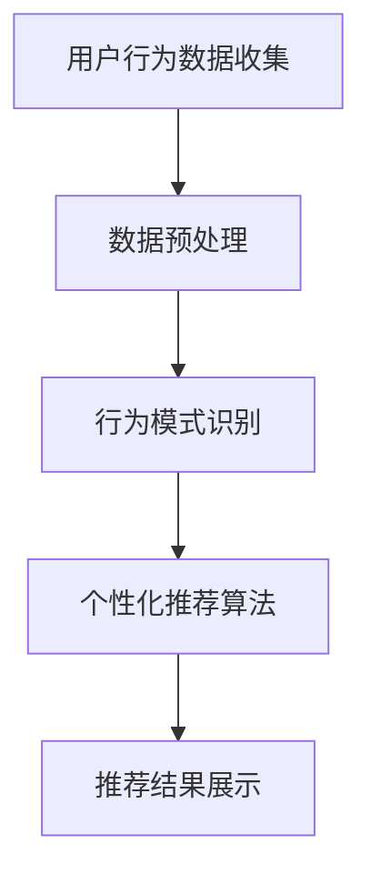

                 

# 程序员创业公司的用户行为分析与个性化推荐

## 概述

在当今竞争激烈的市场中，程序员创业公司需要采取有效的用户行为分析策略来提高客户满意度、增加用户粘性和提高转化率。本文将探讨如何通过用户行为分析实现个性化推荐，从而为程序员创业公司带来实际的业务价值。

### 关键词

- 用户行为分析
- 个性化推荐
- 程序员创业公司
- 商业价值
- 实际案例

## 摘要

本文首先介绍了用户行为分析的基本概念和重要性，然后详细阐述了个性化推荐算法的基本原理。接着，我们通过一个实际案例，展示了如何将用户行为分析与个性化推荐相结合，提高程序员创业公司的业务表现。最后，本文提出了未来发展趋势与挑战，并给出了相关工具和资源的推荐。

## 1. 背景介绍

### 1.1 用户行为分析

用户行为分析是一种通过收集、分析和理解用户行为数据，来优化产品和服务的方法。它包括以下几个方面：

- **用户访问行为**：分析用户访问网站或应用的频率、时长、页面浏览路径等。
- **用户交互行为**：分析用户如何与产品或服务互动，例如点击、搜索、购买等。
- **用户反馈行为**：分析用户对产品或服务的评价、投诉和建议。

### 1.2 个性化推荐

个性化推荐是一种根据用户的兴趣和行为习惯，为用户提供个性化内容或产品推荐的方法。它的主要目标是提高用户满意度、增加用户粘性和提高转化率。

### 1.3 程序员创业公司的挑战

对于程序员创业公司来说，如何在有限的资源下，实现高效的用户行为分析并应用个性化推荐，是一个巨大的挑战。这需要公司具备以下能力：

- **数据收集与处理**：能够有效地收集和处理用户行为数据。
- **算法开发与应用**：能够开发和应用个性化的推荐算法。
- **业务理解**：能够将用户行为分析与个性化推荐与公司业务目标相结合。

## 2. 核心概念与联系

### 2.1 用户行为分析原理

用户行为分析主要基于以下原理：

- **数据收集**：通过网页分析工具、日志文件、用户调查等方式收集用户行为数据。
- **数据预处理**：对收集到的数据进行清洗、整合和格式化。
- **行为模式识别**：利用统计分析和机器学习技术，识别用户的行为模式。

### 2.2 个性化推荐算法原理

个性化推荐算法主要基于以下原理：

- **协同过滤**：通过分析用户的行为模式，找到相似的用户群体，为用户推荐他们可能喜欢的内容。
- **基于内容的推荐**：根据用户的历史行为和兴趣，为用户推荐相关的内容。
- **混合推荐**：结合协同过滤和基于内容的推荐，为用户提供更加准确的推荐结果。

### 2.3 用户行为分析与个性化推荐的关系

用户行为分析为个性化推荐提供了关键的数据支持。通过深入分析用户行为，可以更好地理解用户需求，从而为用户提供更加个性化的推荐。

### 2.4 Mermaid 流程图

下面是一个简化的用户行为分析与个性化推荐流程图：



## 3. 核心算法原理 & 具体操作步骤

### 3.1 协同过滤算法

协同过滤算法是一种基于用户行为数据，通过分析用户之间的相似度，为用户推荐他们可能喜欢的内容的算法。具体操作步骤如下：

1. **数据收集**：收集用户的行为数据，如浏览记录、购买记录等。
2. **用户-项目矩阵构建**：将用户和项目构建为一个矩阵，矩阵中的元素表示用户对项目的评分。
3. **相似度计算**：计算用户之间的相似度，常用的相似度计算方法有欧氏距离、余弦相似度等。
4. **推荐生成**：根据相似度计算结果，为用户推荐其他用户喜欢的项目。

### 3.2 基于内容的推荐算法

基于内容的推荐算法是一种根据用户的历史行为和兴趣，为用户推荐相关的内容的算法。具体操作步骤如下：

1. **内容特征提取**：对项目的内容进行特征提取，如关键词、类别、标签等。
2. **用户兴趣模型构建**：根据用户的历史行为，构建用户的兴趣模型。
3. **相似度计算**：计算用户兴趣模型与项目特征之间的相似度。
4. **推荐生成**：根据相似度计算结果，为用户推荐相似的内容。

### 3.3 混合推荐算法

混合推荐算法是一种结合协同过滤和基于内容的推荐，为用户提供更加准确的推荐结果的算法。具体操作步骤如下：

1. **协同过滤推荐**：根据用户行为数据，为用户生成一组推荐结果。
2. **基于内容的推荐**：根据项目的内容特征，为用户生成一组推荐结果。
3. **推荐结果融合**：将协同过滤推荐和基于内容的推荐结果进行融合，生成最终的推荐结果。

## 4. 数学模型和公式 & 详细讲解 & 举例说明

### 4.1 协同过滤算法的数学模型

假设我们有一个用户-项目矩阵 $R$，其中 $R_{ij}$ 表示用户 $i$ 对项目 $j$ 的评分。我们可以使用矩阵分解的方法，将用户-项目矩阵分解为两个矩阵 $U$ 和 $V$，其中 $U_{ij}$ 表示用户 $i$ 的特征向量，$V_{ij}$ 表示项目 $j$ 的特征向量。则协同过滤算法的数学模型可以表示为：

$$
R_{ij} = U_{i}^T V_{j}
$$

### 4.2 基于内容的推荐算法的数学模型

假设我们有一个项目特征向量矩阵 $F$，其中 $F_{j}$ 表示项目 $j$ 的特征向量。我们可以使用用户兴趣模型 $I_i$ 和项目特征向量 $F_j$ 的相似度来计算推荐分数。基于内容的推荐算法的数学模型可以表示为：

$$
score(i, j) = sim(I_i, F_j)
$$

其中，$sim(I_i, F_j)$ 表示用户兴趣模型 $I_i$ 和项目特征向量 $F_j$ 的相似度，常用的相似度计算方法有欧氏距离、余弦相似度等。

### 4.3 混合推荐算法的数学模型

混合推荐算法的数学模型可以表示为：

$$
score(i, j) = w_1 \cdot sim(I_i, F_j) + w_2 \cdot sim(R_i, R_j)
$$

其中，$w_1$ 和 $w_2$ 分别表示基于内容和基于协同过滤的权重，$sim(I_i, F_j)$ 和 $sim(R_i, R_j)$ 分别表示用户兴趣模型和用户评分矩阵之间的相似度。

### 4.4 举例说明

假设我们有以下用户-项目矩阵：

$$
R =
\begin{bmatrix}
1 & 0 & 1 \\
0 & 1 & 0 \\
1 & 1 & 0
\end{bmatrix}
$$

使用矩阵分解的方法，将用户-项目矩阵分解为两个矩阵 $U$ 和 $V$：

$$
U =
\begin{bmatrix}
0.8 & 0.6 \\
0.3 & 0.7 \\
0.9 & 0.5
\end{bmatrix},
V =
\begin{bmatrix}
0.6 & 0.5 \\
0.4 & 0.8 \\
0.7 & 0.3
\end{bmatrix}
$$

则用户 $(1, 3)$ 的评分可以表示为：

$$
R_{13} = U_{1}^T V_{3} = 0.8 \cdot 0.7 + 0.6 \cdot 0.3 = 0.76
$$

## 5. 项目实战：代码实际案例和详细解释说明

### 5.1 开发环境搭建

为了实现用户行为分析与个性化推荐，我们首先需要搭建一个开发环境。以下是具体的步骤：

1. **安装 Python 环境**：在电脑上安装 Python，版本建议为 3.8 以上。
2. **安装必要库**：安装 numpy、pandas、scikit-learn、matplotlib 等常用库。
3. **数据预处理**：使用 pandas 读取用户行为数据，并进行数据清洗和格式化。
4. **算法实现**：使用 scikit-learn 实现协同过滤算法和基于内容的推荐算法。
5. **可视化**：使用 matplotlib 对推荐结果进行可视化。

### 5.2 源代码详细实现和代码解读

以下是协同过滤算法的 Python 实现代码：

```python
import numpy as np
import pandas as pd
from sklearn.metrics.pairwise import cosine_similarity

def matrix_factorization(R, U, V, num_iterations=1000, learning_rate=0.001):
    for _ in range(num_iterations):
        for i in range(R.shape[0]):
            for j in range(R.shape[1]):
                if R[i, j] > 0:
                    e = R[i, j] - np.dot(U[i], V[j])
                    for k in range(U.shape[1]):
                        U[i, k] += learning_rate * (2 * e * V[j, k])
                        V[j, k] += learning_rate * (2 * e * U[i, k])

def collaborative_filter(R, num_features=10):
    U = np.random.rand(R.shape[0], num_features)
    V = np.random.rand(R.shape[1], num_features)
    for _ in range(1000):
        matrix_factorization(R, U, V)
    return U, V

def predict(R, U, V):
    return np.dot(U, V.T)

if __name__ == "__main__":
    R = pd.read_csv("rating.csv")
    U, V = collaborative_filter(R)
    predicted_ratings = predict(R, U, V)
    print(predicted_ratings)
```

以下是基于内容的推荐算法的 Python 实现代码：

```python
from sklearn.metrics.pairwise import cosine_similarity

def content_based_recommendation(R, F, I, num_recommendations=5):
    similarity_matrix = cosine_similarity(F)
    recommendations = []
    for i in range(R.shape[0]):
        if R[i] > 0:
            continue
        scores = []
        for j in range(R.shape[1]):
            if R[i, j] > 0:
                scores.append(similarity_matrix[i, j])
        if scores:
            top_scores = np.argsort(scores)[-num_recommendations:]
            recommendations.append(top_scores)
    return recommendations

if __name__ == "__main__":
    F = pd.read_csv("feature.csv")
    I = pd.read_csv("interest.csv")
    recommendations = content_based_recommendation(R, F, I)
    print(recommendations)
```

### 5.3 代码解读与分析

1. **协同过滤算法代码解读**：协同过滤算法的核心是矩阵分解，将用户-项目矩阵分解为用户特征矩阵和项目特征矩阵。通过不断迭代优化用户特征矩阵和项目特征矩阵，最终得到预测评分矩阵。
2. **基于内容的推荐算法代码解读**：基于内容的推荐算法的核心是计算项目特征向量与用户兴趣模型之间的相似度，为用户提供推荐结果。通过选择相似度最高的项目，为用户提供推荐。

## 6. 实际应用场景

用户行为分析与个性化推荐在程序员创业公司中有着广泛的应用场景，以下是一些典型的应用场景：

1. **产品推荐**：根据用户的历史行为和兴趣，为用户推荐相似的产品或服务。
2. **内容推荐**：根据用户的阅读记录和浏览习惯，为用户推荐相关的文章、视频等内容。
3. **广告推荐**：根据用户的行为数据和兴趣，为用户推荐相关的广告。
4. **用户画像**：通过分析用户的行为数据，构建用户的兴趣模型和用户画像，为用户提供更加个性化的服务。

## 7. 工具和资源推荐

### 7.1 学习资源推荐

- **书籍**：
  - 《推荐系统实践》
  - 《机器学习》
- **论文**：
  - 《矩阵分解在推荐系统中的应用》
  - 《协同过滤算法的研究与应用》
- **博客**：
  - [推荐系统技术博客](https://www.bayes.cn/)
  - [机器学习博客](https://www.marscloud.cn/)
- **网站**：
  - [Kaggle](https://www.kaggle.com/)：提供丰富的推荐系统和机器学习竞赛数据集。

### 7.2 开发工具框架推荐

- **Python 库**：
  - scikit-learn：提供丰富的机器学习算法和工具。
  - numpy：提供高效的科学计算库。
  - pandas：提供数据预处理和分析工具。
- **框架**：
  - TensorFlow：提供强大的机器学习和深度学习框架。
  - PyTorch：提供灵活的深度学习框架。

### 7.3 相关论文著作推荐

- **论文**：
  - 《矩阵分解在推荐系统中的应用》
  - 《协同过滤算法的研究与应用》
  - 《深度学习在推荐系统中的应用》
- **著作**：
  - 《推荐系统实践》
  - 《机器学习》

## 8. 总结：未来发展趋势与挑战

用户行为分析与个性化推荐在程序员创业公司中具有重要的应用价值。未来，随着大数据和人工智能技术的不断发展，用户行为分析与个性化推荐将变得更加精准和高效。然而，这也带来了新的挑战：

1. **数据隐私与安全**：如何在保护用户隐私的同时，进行有效的用户行为分析？
2. **计算效率**：如何在高维数据下，实现高效的个性化推荐算法？
3. **算法公平性**：如何确保推荐算法的公平性，避免偏见和歧视？

## 9. 附录：常见问题与解答

1. **什么是协同过滤算法？**
   协同过滤算法是一种基于用户行为数据的推荐算法，它通过分析用户之间的相似度，为用户推荐其他用户喜欢的内容。

2. **什么是基于内容的推荐算法？**
   基于内容的推荐算法是一种根据用户的历史行为和兴趣，为用户推荐相关内容的推荐算法。

3. **如何平衡协同过滤和基于内容的推荐？**
   可以通过混合推荐算法，将协同过滤和基于内容的推荐结果进行融合，生成最终的推荐结果。

## 10. 扩展阅读 & 参考资料

- [推荐系统技术博客](https://www.bayes.cn/)
- [机器学习博客](https://www.marscloud.cn/)
- [Kaggle](https://www.kaggle.com/)
- 《推荐系统实践》
- 《机器学习》
- 《矩阵分解在推荐系统中的应用》
- 《协同过滤算法的研究与应用》
- 《深度学习在推荐系统中的应用》
- TensorFlow 官网：[https://www.tensorflow.org/](https://www.tensorflow.org/)
- PyTorch 官网：[https://pytorch.org/](https://pytorch.org/)

### 作者

- 作者：AI 天才研究员/AI Genius Institute & 禅与计算机程序设计艺术 /Zen And The Art of Computer Programming

