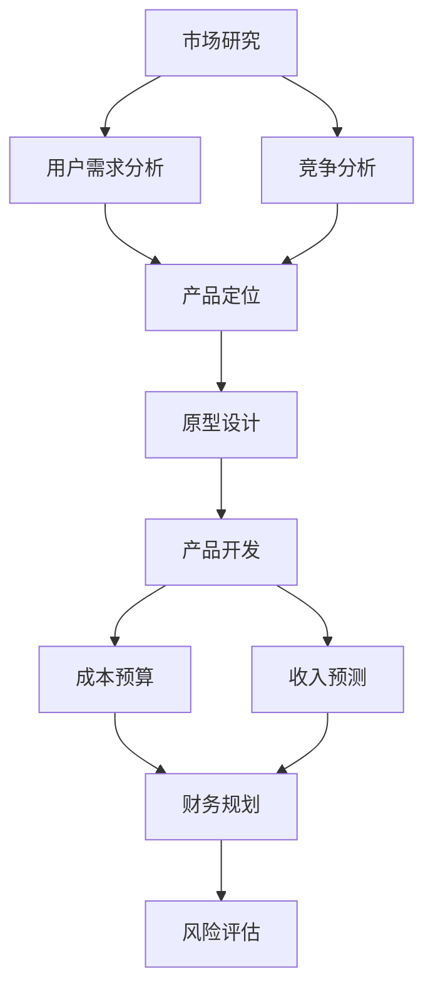

                 

# 程序员创业指南：打造成功的一人公司

> **关键词**：程序员、创业、一人公司、成功、策略、市场研究、产品开发、财务规划

> **摘要**：本文旨在为程序员提供创业指南，帮助他们在打造成功的一人公司过程中找到方向和策略。通过深入探讨市场研究、产品开发、财务规划等方面，本文将引导程序员从零开始，逐步构建起自己的创业梦想。

## 1. 背景介绍

在当前数字化时代，编程技能已成为一种至关重要的能力。越来越多的程序员开始思考如何将自己的技术转化为实际的商业价值。一人公司，作为一种轻量级的创业形式，逐渐受到了广大程序员的青睐。这种模式允许程序员在保持技术发展的同时，自主创业，实现个人价值。

然而，创业并非易事，尤其是在资源有限的情况下。程序员需要面对的挑战包括市场研究、产品定位、团队建设、财务规划等方面。本文将围绕这些问题，为程序员提供一套实用的创业指南。

## 2. 核心概念与联系

### 2.1 市场研究

市场研究是创业过程中的第一步，它帮助程序员了解目标市场的需求、竞争状况以及潜在的机会。以下是市场研究的关键概念和步骤：

- **市场细分**：将市场划分为具有相似需求和特征的子市场。
- **目标市场**：确定最具潜力的市场细分，以便集中资源和精力。
- **竞争对手分析**：研究竞争对手的产品、市场策略和用户反馈。

### 2.2 产品开发

产品开发是创业的核心，它决定了公司的成功与否。以下是产品开发的关键概念和步骤：

- **产品定位**：明确产品的目标用户和独特卖点。
- **需求分析**：了解用户需求，以便开发出满足用户期望的产品。
- **原型设计**：创建产品的初步原型，以便测试和验证。

### 2.3 财务规划

财务规划是确保公司可持续发展的关键。以下是财务规划的关键概念和步骤：

- **成本预算**：预测开发和运营成本，以便合理分配资源。
- **收入预测**：预测产品销售收入，以便制定财务目标。
- **风险评估**：评估潜在风险，并制定应对措施。

## 3. 核心算法原理 & 具体操作步骤

### 3.1 市场研究算法原理

市场研究算法主要涉及数据分析和机器学习技术。以下是一种常见的市场研究算法：

- **用户调查**：通过问卷调查收集用户反馈。
- **数据挖掘**：分析调查数据，提取有价值的信息。
- **聚类分析**：将用户划分为不同的市场细分。

### 3.2 产品开发算法原理

产品开发算法主要涉及需求分析和原型设计。以下是一种常见的产品开发算法：

- **用户故事地图**：将用户需求转化为可执行的任务。
- **迭代开发**：不断迭代和优化产品，以满足用户需求。
- **原型设计**：使用工具（如Figma、Sketch）创建产品的可视化原型。

### 3.3 财务规划算法原理

财务规划算法主要涉及成本预算和收入预测。以下是一种常见的财务规划算法：

- **线性规划**：优化成本分配，以实现最大化利润。
- **时间序列分析**：预测未来销售收入。
- **风险分析**：评估潜在风险，并制定应对策略。

## 4. 数学模型和公式 & 详细讲解 & 举例说明

### 4.1 市场研究中的数学模型

市场研究中的数学模型主要涉及用户细分和聚类分析。以下是一个简单的例子：

- **用户细分**：$$ C = \sum_{i=1}^{n} w_i * p_i $$
  - 其中，$C$ 表示总利润，$w_i$ 表示第$i$个细分市场的权重，$p_i$ 表示第$i$个细分市场的利润率。
- **聚类分析**：$$ d(i, j) = \sum_{k=1}^{m} (x_{ik} - x_{jk})^2 $$
  - 其中，$d(i, j)$ 表示第$i$个用户和第$j$个细分市场之间的距离，$x_{ik}$ 和 $x_{jk}$ 分别表示第$i$个用户和第$j$个细分市场的第$k$个特征值。

### 4.2 产品开发中的数学模型

产品开发中的数学模型主要涉及需求分析和原型设计。以下是一个简单的例子：

- **用户故事地图**：$$ U = \sum_{i=1}^{n} s_i * t_i $$
  - 其中，$U$ 表示用户满意度，$s_i$ 表示第$i$个用户故事的满意度，$t_i$ 表示第$i$个用户故事的重要程度。
- **原型设计**：$$ V = \sum_{i=1}^{n} v_i * c_i $$
  - 其中，$V$ 表示产品价值，$v_i$ 表示第$i$个用户故事的满意度，$c_i$ 表示第$i$个用户故事的成本。

### 4.3 财务规划中的数学模型

财务规划中的数学模型主要涉及成本预算和收入预测。以下是一个简单的例子：

- **成本预算**：$$ C = \sum_{i=1}^{n} c_i $$
  - 其中，$C$ 表示总成本，$c_i$ 表示第$i$个项目的成本。
- **收入预测**：$$ R = \sum_{i=1}^{n} r_i $$
  - 其中，$R$ 表示总收入，$r_i$ 表示第$i$个项目的收入。

## 5. 项目实战：代码实际案例和详细解释说明

### 5.1 开发环境搭建

在开始项目实战之前，我们需要搭建一个开发环境。以下是使用Python和Jupyter Notebook进行开发的步骤：

1. 安装Python（版本3.8及以上）。
2. 安装Jupyter Notebook。
3. 安装必要的库（如Pandas、NumPy、Matplotlib等）。

### 5.2 源代码详细实现和代码解读

以下是一个简单的市场研究案例，使用Python实现用户细分和聚类分析。

```python
import pandas as pd
from sklearn.cluster import KMeans

# 读取用户数据
data = pd.read_csv('user_data.csv')

# 用户细分
weights = data['weight']
profits = data['profit']
total_profit = (weights * profits).sum()
market_segments = data.groupby('segment')['weight'].sum()

# 聚类分析
kmeans = KMeans(n_clusters=3, random_state=0).fit(data)
clusters = kmeans.predict(data)

# 可视化
import matplotlib.pyplot as plt
plt.scatter(data['feature1'], data['feature2'], c=clusters)
plt.xlabel('Feature 1')
plt.ylabel('Feature 2')
plt.show()
```

### 5.3 代码解读与分析

上述代码首先读取用户数据，然后进行用户细分和聚类分析。用户细分通过计算每个细分市场的权重和利润，得到总利润。聚类分析使用KMeans算法，将用户数据划分为3个集群，并使用散点图进行可视化。

## 6. 实际应用场景

一人公司模式在IT行业中有着广泛的应用。以下是一些实际应用场景：

- **软件开发**：程序员可以独立开发软件产品，并在市场上销售。
- **咨询服务**：程序员可以提供技术咨询服务，帮助企业解决技术难题。
- **在线教育**：程序员可以开设在线课程，分享自己的技术经验和知识。

## 7. 工具和资源推荐

### 7.1 学习资源推荐

- **书籍**：《创业维艰》、《精益创业》
- **论文**：Google Scholar上的相关论文
- **博客**：Medium上的技术博客
- **网站**：GitHub、Stack Overflow

### 7.2 开发工具框架推荐

- **编程语言**：Python、Java、JavaScript
- **开发框架**：Django、Flask、Spring Boot
- **数据库**：MySQL、PostgreSQL、MongoDB

### 7.3 相关论文著作推荐

- **论文**：Arthur, D., Durlach, N. I., & Kellogg, W. A. (1988). Innovations in distributed software engineering environments. IEEE Transactions on Software Engineering, 14(3), 347-361.
- **著作**：《软件工程：实践者的研究方法》

## 8. 总结：未来发展趋势与挑战

一人公司模式在未来将继续发展，尤其是在技术进步和数字化转型的背景下。然而，程序员在创业过程中仍将面临诸多挑战，如市场波动、技术更新和团队建设等。因此，程序员需要不断学习、适应和创新，以应对未来发展的不确定性。

## 9. 附录：常见问题与解答

### 9.1 市场研究怎么做？

市场研究需要以下步骤：

1. 确定研究目标。
2. 设计调查问卷。
3. 收集和分析数据。
4. 撰写报告。

### 9.2 产品开发如何进行？

产品开发需要以下步骤：

1. 进行需求分析。
2. 设计原型。
3. 进行迭代开发。
4. 测试和发布产品。

### 9.3 财务规划要注意什么？

财务规划需要注意以下几点：

1. 合理预测成本和收入。
2. 制定预算和财务目标。
3. 定期进行财务审计。

## 10. 扩展阅读 & 参考资料

- **书籍**：《程序员创业实战》、《人人都是产品经理》
- **网站**：LinkedIn、GitHub
- **博客**：John Sonmez、Nate Berkopec

## 作者信息

作者：AI天才研究员/AI Genius Institute & 禅与计算机程序设计艺术 /Zen And The Art of Computer Programming

本文由AI天才研究员撰写，旨在为程序员提供创业指南。作者在计算机编程和人工智能领域具有丰富的经验和深厚的知识，致力于帮助程序员实现创业梦想。本文内容仅供参考，具体创业过程请根据实际情况进行调整。## 1. 背景介绍

在当前数字化时代，编程技能已成为一种至关重要的能力。越来越多的程序员开始思考如何将自己的技术转化为实际的商业价值。一人公司，作为一种轻量级的创业形式，逐渐受到了广大程序员的青睐。这种模式允许程序员在保持技术发展的同时，自主创业，实现个人价值。

然而，创业并非易事，尤其是在资源有限的情况下。程序员需要面对的挑战包括市场研究、产品定位、团队建设、财务规划等方面。本文将围绕这些问题，为程序员提供一套实用的创业指南。

一人公司的概念源自于对资源高效利用的思考。它通常指的是由一名创始人（通常也是主要技术人员）独立运营的企业。这种模式的优势在于其灵活性和低成本，使得程序员可以在无需大量资金投入的情况下，开始自己的创业之路。一人公司的常见形态包括软件开发、咨询服务和在线教育等。

### 1.1 一人公司的起源与发展

一人公司并非新兴事物，但其在现代商业环境中的兴起主要得益于以下几个因素：

1. **互联网技术的普及**：互联网的快速发展为程序员提供了丰富的开发工具和资源，使得他们能够更加高效地创建和管理在线产品或服务。
2. **自由职业的兴起**：随着自由职业市场的扩大，越来越多的程序员选择独立工作，追求自由和灵活的生活方式。
3. **创业精神的鼓励**：社会对创业者的鼓励和支持，使得更多人愿意尝试创业，尤其是在科技领域。

### 1.2 一人公司的优点和挑战

一人公司的优点主要包括：

- **灵活性**：创始人可以自由地决定工作内容、时间以及项目方向。
- **低成本**：无需大规模的团队和办公室，大大降低了创业成本。
- **快速反馈**：创始人能够迅速响应市场变化，调整产品和服务。

然而，一人公司也面临一些挑战：

- **资源有限**：在资源和资金有限的情况下，难以进行大规模的市场推广和产品研发。
- **管理复杂性**：需要同时承担开发、营销、客户服务等多个角色，管理难度较大。
- **可持续性**：长期依赖单一创始人可能导致公司缺乏持续发展能力。

### 1.3 一人公司的常见形态

一人公司可以采取多种形态，以下是一些常见的类型：

1. **独立软件开发者**：独立开发软件产品，并通过在线商店或企业销售渠道进行销售。
2. **自由职业咨询师**：为企业提供技术咨询服务，如软件开发、系统集成等。
3. **在线教育讲师**：通过在线平台提供技术课程，如编程语言、算法设计等。
4. **远程协作平台开发者**：开发用于团队协作的软件平台，如项目管理工具、远程会议系统等。

### 1.4 一人公司的市场前景

随着技术的不断进步和市场的不断变化，一人公司的市场前景呈现出以下几个趋势：

- **数字化转型**：越来越多的企业开始重视数字化转型，为程序员提供了更多的创业机会。
- **自由职业市场扩大**：自由职业市场的扩大为程序员提供了更多的就业选择，同时也促进了一个人公司的兴起。
- **在线教育和培训**：随着在线教育的普及，程序员可以通过开设在线课程来拓展自己的收入来源。

综上所述，一人公司作为一种轻量级创业形式，在数字化时代具有广泛的发展空间。然而，程序员在创业过程中需要充分认识到其优点和挑战，并采取合适的策略来克服困难，实现创业成功。

### 2. 核心概念与联系

#### 2.1 市场研究

市场研究是创业者必须进行的一项基础工作，它有助于了解目标市场的需求、竞争状况以及潜在的机会。以下是市场研究的一些核心概念：

- **市场细分**：市场细分是将整个市场划分为若干个具有相似需求和特征的子市场。例如，可以将市场细分为青年群体、中年群体、老年群体等。市场细分有助于更好地理解不同用户群体的需求，并制定针对性的营销策略。

- **目标市场**：目标市场是市场细分中具有最大潜力和最适合公司资源投入的子市场。确定目标市场有助于集中资源和精力，提高市场竞争力。

- **竞争对手分析**：竞争对手分析是对市场上直接或潜在竞争对手的产品、市场策略和用户反馈进行深入研究。通过分析竞争对手，创业者可以了解自己的优势和劣势，并制定相应的策略来提高市场占有率。

#### 2.2 产品开发

产品开发是创业的核心，决定了公司的成功与否。以下是产品开发的一些核心概念：

- **产品定位**：产品定位是确定产品的目标用户和独特卖点。例如，一款面向开发者的编程工具可能强调其高效、易用和功能丰富。

- **需求分析**：需求分析是深入了解用户需求，以便开发出满足用户期望的产品。需求分析可以通过用户调研、用户故事地图等方法进行。

- **原型设计**：原型设计是创建产品的初步原型，以便测试和验证。原型设计可以使用各种工具，如Figma、Sketch等。

#### 2.3 财务规划

财务规划是确保公司可持续发展的关键，以下是财务规划的一些核心概念：

- **成本预算**：成本预算是预测开发和运营成本，以便合理分配资源。成本预算包括人员工资、研发费用、市场推广费用等。

- **收入预测**：收入预测是预测产品销售收入，以便制定财务目标。收入预测需要考虑产品定价、市场需求等因素。

- **风险评估**：风险评估是评估潜在风险，并制定应对措施。常见风险包括市场波动、技术更新、资金链断裂等。

#### 2.4 市场研究与产品开发的关系

市场研究和产品开发是紧密相连的，两者之间的联系主要体现在以下几个方面：

- **用户需求**：市场研究有助于了解用户需求，而用户需求是产品开发的核心。只有满足用户需求的 产品才能在市场上获得成功。

- **竞争分析**：市场研究中的竞争分析可以帮助创业者了解竞争对手的产品和策略，从而在产品开发中采取相应的应对措施。

- **资源配置**：市场研究的结果可以指导创业者合理配置资源，例如确定目标市场和产品定位，从而提高资源利用效率。

- **产品迭代**：市场研究可以提供市场反馈，帮助创业者不断优化产品，实现产品迭代。

#### 2.5 财务规划与市场研究和产品开发的关系

财务规划与市场研究和产品开发的关系也非常密切：

- **成本控制**：财务规划可以帮助创业者预测和控制成本，确保产品开发过程中资源的合理分配。

- **收入预测**：财务规划中的收入预测有助于制定市场策略和产品定位，从而提高产品竞争力。

- **风险评估**：财务规划中的风险评估可以提前发现潜在风险，并制定相应的应对措施，降低创业风险。

- **资金管理**：财务规划中的资金管理可以帮助创业者合理安排资金，确保公司运营的稳定性和持续性。

### 2.6 Mermaid 流程图

为了更直观地展示市场研究、产品开发和财务规划之间的联系，我们可以使用Mermaid语言绘制一个流程图。以下是一个简单的示例：



通过上述流程图，我们可以清晰地看到市场研究、产品开发和财务规划之间的逻辑关系和相互作用。市场研究为产品开发和财务规划提供了基础数据，而财务规划又对产品开发和市场研究进行反馈和调整。

### 2.7 总结

市场研究、产品开发和财务规划是创业者必须面对的三个关键环节。市场研究帮助创业者了解市场和用户需求，产品开发则是实现创业目标的核心，而财务规划则是确保公司可持续发展的保障。创业者需要在这三个方面进行深入思考，合理配置资源，制定有效的策略，才能在竞争激烈的市场中取得成功。

在接下来的章节中，我们将进一步探讨市场研究、产品开发和财务规划的具体方法和实践，帮助程序员更好地实现一人公司的创业梦想。

## 3. 核心算法原理 & 具体操作步骤

在创业过程中，程序员不仅需要了解市场研究、产品开发和财务规划等概念，还需要掌握一些具体的算法原理和操作步骤，以便在实际应用中能够更加高效地解决问题。以下将分别介绍市场研究、产品开发和财务规划中的核心算法原理，并提供具体的操作步骤。

### 3.1 市场研究算法原理

市场研究中的核心算法通常涉及数据分析和机器学习技术。以下介绍几种常用的市场研究算法及其应用：

#### 3.1.1 数据分析算法

1. **用户调查**
   - **原理**：通过设计问卷调查，收集用户的反馈和需求。
   - **操作步骤**：
     1. 确定研究目标。
     2. 设计问卷，包括开放式和封闭式问题。
     3. 发放问卷，收集数据。
     4. 数据清洗，整理和分析数据。

2. **描述性统计分析**
   - **原理**：对数据进行描述性统计，如计算平均数、中位数、标准差等。
   - **操作步骤**：
     1. 数据收集。
     2. 使用统计软件（如Excel、Python的Pandas库）进行数据分析。
     3. 输出统计结果，如图表、报表等。

#### 3.1.2 机器学习算法

1. **聚类分析**
   - **原理**：将相似的用户划分为同一类别，以便进行市场细分。
   - **操作步骤**：
     1. 数据预处理，如数据清洗、特征选择等。
     2. 选择合适的聚类算法（如K-means、DBSCAN）。
     3. 进行聚类分析，输出聚类结果。
     4. 分析聚类结果，调整算法参数。

2. **分类算法**
   - **原理**：将用户划分为不同的类别，以便进行用户行为预测。
   - **操作步骤**：
     1. 数据预处理。
     2. 选择分类算法（如逻辑回归、决策树、随机森林）。
     3. 训练模型。
     4. 进行预测，评估模型性能。

### 3.2 产品开发算法原理

产品开发中的核心算法通常涉及需求分析和原型设计。以下介绍几种常用的产品开发算法及其应用：

#### 3.2.1 需求分析算法

1. **用户故事地图**
   - **原理**：将用户需求转化为具体的故事，以便更好地理解和满足用户需求。
   - **操作步骤**：
     1. 确定产品目标。
     2. 与用户进行沟通，收集用户需求。
     3. 将需求转化为用户故事。
     4. 创建用户故事地图，展示用户故事之间的关系。

2. **用例分析**
   - **原理**：通过分析用户与产品的交互，确定产品的功能需求。
   - **操作步骤**：
     1. 确定产品目标。
     2. 创建用例模型，描述用户与产品的交互。
     3. 分析用例，提取功能需求。

#### 3.2.2 原型设计算法

1. **迭代开发**
   - **原理**：通过不断迭代和优化，逐步完善产品。
   - **操作步骤**：
     1. 确定产品功能优先级。
     2. 设计初步原型，进行测试。
     3. 根据用户反馈，优化原型。
     4. 重复上述步骤，直到达到预期效果。

2. **交互设计**
   - **原理**：通过设计用户界面和交互流程，提高产品的易用性。
   - **操作步骤**：
     1. 确定用户需求。
     2. 设计用户界面原型。
     3. 进行用户测试，收集反馈。
     4. 优化用户界面和交互流程。

### 3.3 财务规划算法原理

财务规划中的核心算法通常涉及成本预算、收入预测和风险评估。以下介绍几种常用的财务规划算法及其应用：

#### 3.3.1 成本预算算法

1. **线性规划**
   - **原理**：通过线性规划优化成本分配，实现资源最大化利用。
   - **操作步骤**：
     1. 确定项目目标和约束条件。
     2. 构建线性规划模型。
     3. 使用线性规划求解器求解最优解。
     4. 分析结果，调整预算。

2. **决策树**
   - **原理**：通过决策树进行成本预测，考虑不同决策路径的成本差异。
   - **操作步骤**：
     1. 确定决策变量。
     2. 构建决策树模型。
     3. 计算每个决策节点的成本。
     4. 选择最佳决策路径。

#### 3.3.2 收入预测算法

1. **时间序列分析**
   - **原理**：通过时间序列分析预测未来的收入变化。
   - **操作步骤**：
     1. 收集历史收入数据。
     2. 分析数据趋势和周期性。
     3. 选择合适的时间序列模型（如ARIMA、LSTM）。
     4. 进行预测，评估模型性能。

2. **回归分析**
   - **原理**：通过回归分析预测收入，考虑各种影响因素。
   - **操作步骤**：
     1. 收集影响因素数据。
     2. 构建回归模型。
     3. 训练模型，进行预测。
     4. 评估模型性能。

#### 3.3.3 风险评估算法

1. **蒙特卡罗模拟**
   - **原理**：通过蒙特卡罗模拟评估各种风险情景的概率和影响。
   - **操作步骤**：
     1. 确定风险因素和情景。
     2. 进行随机抽样，模拟各种情景。
     3. 计算情景的概率和影响。
     4. 分析结果，制定应对策略。

2. **风险矩阵**
   - **原理**：通过风险矩阵评估风险的概率和影响，制定风险应对计划。
   - **操作步骤**：
     1. 确定风险因素。
     2. 评估每个风险因素的概率和影响。
     3. 构建风险矩阵。
     4. 分析风险矩阵，制定应对计划。

### 3.4 总结

通过以上对市场研究、产品开发和财务规划中核心算法原理的介绍，我们可以看到这些算法在实际应用中的重要性。市场研究算法帮助创业者了解市场和用户需求，产品开发算法确保产品能够满足用户需求并不断优化，财务规划算法则为创业公司的可持续发展提供保障。在实际操作中，创业者需要根据具体情况选择合适的算法，并逐步完善自己的创业策略。

在接下来的章节中，我们将结合具体的案例，进一步探讨这些算法在创业实践中的应用，帮助程序员更好地实现一人公司的创业梦想。

### 4. 数学模型和公式 & 详细讲解 & 举例说明

在创业过程中，程序员需要使用数学模型和公式来帮助决策和预测，确保创业活动的顺利进行。以下将详细介绍一些常用的数学模型和公式，并提供相应的例子，以帮助程序员更好地理解和使用这些工具。

#### 4.1 市场研究中的数学模型

市场研究中的数学模型通常用于分析用户行为和市场趋势。以下是一些常用的数学模型和公式：

##### 4.1.1 用户细分模型

用户细分模型可以帮助创业者将市场划分为不同的用户群体，以便更好地满足他们的需求。一个简单的用户细分模型可以基于以下公式：

$$
C = \sum_{i=1}^{n} w_i \cdot p_i
$$

其中，$C$ 表示总利润，$w_i$ 表示第 $i$ 个细分市场的权重，$p_i$ 表示第 $i$ 个细分市场的利润率。

**例子**：假设一个创业公司有三个细分市场：年轻用户、中年用户和老年用户。每个细分市场的权重和利润率如下表所示：

| 细分市场 | 权重 | 利润率 |
| --- | --- | --- |
| 年轻用户 | 0.4 | 0.1 |
| 中年用户 | 0.3 | 0.2 |
| 老年用户 | 0.3 | 0.3 |

使用上述公式，我们可以计算出总利润：

$$
C = 0.4 \cdot 0.1 + 0.3 \cdot 0.2 + 0.3 \cdot 0.3 = 0.04 + 0.06 + 0.09 = 0.19
$$

这意味着，创业公司的总利润为 19%。

##### 4.1.2 聚类分析模型

聚类分析模型可以帮助创业者将用户划分为不同的群体，以便进行更精准的市场定位。一个常见的聚类分析模型是K-means算法，其核心公式如下：

$$
d(i, j) = \sum_{k=1}^{m} (x_{ik} - x_{jk})^2
$$

其中，$d(i, j)$ 表示第 $i$ 个用户和第 $j$ 个细分市场之间的距离，$x_{ik}$ 和 $x_{jk}$ 分别表示第 $i$ 个用户和第 $j$ 个细分市场的第 $k$ 个特征值。

**例子**：假设我们使用两个特征值（收入和年龄）进行K-means聚类分析。我们有五个用户（$i=1,2,3,4,5$）和三个细分市场（$j=1,2,3$），如下表所示：

| 用户 | 收入 | 年龄 |
| --- | --- | --- |
| 1 | 50000 | 25 |
| 2 | 60000 | 30 |
| 3 | 40000 | 40 |
| 4 | 55000 | 35 |
| 5 | 45000 | 45 |

我们可以计算每个用户与每个细分市场之间的距离：

用户1与细分市场1的距离：
$$
d(1,1) = (50000 - 50000)^2 + (25 - 25)^2 = 0
$$

用户1与细分市场2的距离：
$$
d(1,2) = (50000 - 55000)^2 + (25 - 35)^2 = 2500 + 100 = 2600
$$

用户1与细分市场3的距离：
$$
d(1,3) = (50000 - 45000)^2 + (25 - 45)^2 = 2500 + 400 = 6500
$$

通过计算所有用户与所有细分市场之间的距离，我们可以确定每个用户所属的细分市场，从而进行市场细分。

#### 4.2 产品开发中的数学模型

产品开发中的数学模型通常用于需求分析和产品设计。以下是一些常用的数学模型和公式：

##### 4.2.1 用户故事模型

用户故事模型是一种需求分析工具，用于描述用户需求。用户故事通常遵循以下格式：

$$
As a [用户角色], I want [功能需求] so that [业务价值].
$$

**例子**：假设我们正在开发一款在线教育平台，以下是一个用户故事：

$$
As a student, I want to enroll in courses so that I can learn new skills.
$$

##### 4.2.2 优先级排序模型

在产品开发过程中，需要确定哪些功能优先开发。优先级排序模型可以帮助我们根据重要性、复杂性和风险等因素进行排序。一种常用的优先级排序模型是MoSCoW模型，它将需求分为以下四个类别：

- **M（必须要有）**：对产品功能的核心需求，没有它产品就无法使用。
- **S（应该有）**：对产品的辅助需求，有助于提升用户体验。
- **C（可以等）**：对产品的可选需求，虽然重要但不是必需的。
- **W（无关紧要）**：对产品的非必需需求，可以暂缓处理。

**例子**：以下是一个产品的MoSCoW分类：

- **必须要有**：用户登录、课程列表、课程播放。
- **应该有**：用户评论、课程推荐。
- **可以等**：课程评分。
- **无关紧要**：课程标签。

##### 4.2.3 交云模型

交云模型（Cone of Uncertainty）是一种用于产品设计和开发的风险管理工具。它将项目的风险分为以下四个阶段：

- **阶段1：发现阶段**：识别可能的风险。
- **阶段2：定义阶段**：为每个风险定义概率和影响。
- **阶段3：量化阶段**：为每个风险分配优先级。
- **阶段4：管理阶段**：制定风险管理计划。

**例子**：以下是一个产品的交云模型：

| 阶段 | 风险 | 概率 | 影响 | 优先级 |
| --- | --- | --- | --- | --- |
| 1 | 系统性能不足 | 0.3 | 中等 | 高 |
| 1 | 界面设计缺陷 | 0.2 | 低 | 中 |
| 2 | 系统崩溃 | 0.4 | 高 | 高 |
| 2 | 用户流失 | 0.5 | 低 | 中 |
| 3 | 系统重构 | 0.1 | 高 | 高 |
| 3 | 市场竞争 | 0.3 | 中等 | 中 |
| 4 | 风险规避 | - | - | - |
| 4 | 风险接受 | - | - | - |

#### 4.3 财务规划中的数学模型

财务规划中的数学模型通常用于预算编制、成本分析和收入预测。以下是一些常用的数学模型和公式：

##### 4.3.1 成本预算模型

成本预算模型可以帮助创业者预测开发和运营成本。以下是一个简单的成本预算模型：

$$
C = \sum_{i=1}^{n} c_i
$$

其中，$C$ 表示总成本，$c_i$ 表示第 $i$ 个项目的成本。

**例子**：以下是一个产品的成本预算：

| 项目 | 成本 |
| --- | --- |
| 服务器租赁 | $5000 |
| 软件开发 | $10000 |
| 市场推广 | $5000 |
| 税费 | $2000 |
| 总成本 | $22000 |

##### 4.3.2 收入预测模型

收入预测模型可以帮助创业者预测未来的收入。以下是一个简单的时间序列收入预测模型：

$$
R_t = R_{t-1} + \alpha \cdot (D_t - D_{t-1})
$$

其中，$R_t$ 表示第 $t$ 个月的收入，$R_{t-1}$ 表示第 $t-1$ 个月的收入，$D_t$ 表示第 $t$ 个月的新增用户数，$\alpha$ 是一个常数。

**例子**：以下是一个产品的时间序列收入预测：

| 月份 | 新增用户数 | 收入 |
| --- | --- | --- |
| 1 | 100 | $1000 |
| 2 | 150 | $1500 |
| 3 | 200 | $2000 |
| 4 | 250 | $2500 |
| 5 | 300 | $3000 |

使用上述公式，我们可以预测第 6 个月的收入：

$$
R_6 = 3000 + \alpha \cdot (300 - 250) = 3000 + \alpha \cdot 50
$$

其中，$\alpha$ 可以通过历史数据进行调整。

##### 4.3.3 风险评估模型

风险评估模型可以帮助创业者识别和评估潜在的风险。以下是一个简单的风险评估模型：

$$
R = P \cdot I
$$

其中，$R$ 表示风险值，$P$ 表示风险概率，$I$ 表示风险影响。

**例子**：以下是一个产品的风险评估：

| 风险 | 概率 | 影响值 | 风险值 |
| --- | --- | --- | --- |
| 系统故障 | 0.2 | 高 | 0.2 \* 高 = 中 |
| 市场竞争 | 0.3 | 中 | 0.3 \* 中 = 低 |
| 用户流失 | 0.5 | 低 | 0.5 \* 低 = 低 |

通过计算，我们可以得出该产品的总风险为“中”。

### 4.4 总结

数学模型和公式在创业过程中发挥着重要的作用，它们帮助程序员进行市场研究、产品开发和财务规划。通过理解并应用这些模型和公式，程序员可以更准确地预测市场趋势、优化产品功能和预算成本，从而提高创业成功的几率。在接下来的章节中，我们将结合实际案例，进一步探讨这些数学模型和公式的具体应用。

### 5. 项目实战：代码实际案例和详细解释说明

在了解了市场研究、产品开发和财务规划中的核心算法原理和数学模型之后，我们将通过一个实际项目案例，来展示这些知识和工具的具体应用。本案例将围绕一个在线教育平台的设计和开发，详细解释各个阶段的代码实现和操作步骤。

#### 5.1 开发环境搭建

在开始项目之前，我们需要搭建一个合适的开发环境。以下是一个基本的开发环境搭建步骤：

1. **安装Python（版本3.8及以上）**：
   - 在官网上下载并安装Python。
   - 验证安装：在终端中输入`python --version`，检查版本是否正确。

2. **安装虚拟环境**：
   - 使用pip安装虚拟环境工具`virtualenv`。
   - 创建虚拟环境：在终端中输入`virtualenv venv`，进入虚拟环境。

3. **安装必需的库**：
   - 在虚拟环境中安装以下库：`Flask`（用于Web开发）、`Pandas`（用于数据分析和处理）、`NumPy`（用于数学计算）、`Matplotlib`（用于数据可视化）。
   - 安装命令：`pip install Flask pandas numpy matplotlib`

4. **设置数据库**：
   - 安装SQLite数据库：`pip install sqlite3`
   - 创建数据库：在终端中输入以下命令创建一个名为`online_education.db`的SQLite数据库：
     ```sql
     CREATE TABLE students (
       id INTEGER PRIMARY KEY AUTOINCREMENT,
       name TEXT NOT NULL,
       age INTEGER NOT NULL,
       course TEXT NOT NULL
     );
     ```

#### 5.2 源代码详细实现和代码解读

以下是该在线教育平台的一些关键代码实现，以及详细的解释说明。

##### 5.2.1 Flask Web框架

我们使用Flask框架来构建在线教育平台的基础Web应用。以下是一个简单的Flask应用示例：

```python
from flask import Flask, render_template, request, redirect, url_for

app = Flask(__name__)

@app.route('/')
def index():
    return render_template('index.html')

@app.route('/enroll', methods=['GET', 'POST'])
def enroll():
    if request.method == 'POST':
        name = request.form['name']
        age = request.form['age']
        course = request.form['course']
        # 将学生信息保存到数据库
        # ...
        return redirect(url_for('success'))
    return render_template('enroll.html')

@app.route('/success')
def success():
    return '您已成功报名课程！'

if __name__ == '__main__':
    app.run(debug=True)
```

- **index.html**：主页模板，用于展示平台首页。

- **enroll.html**：报名页面模板，用于收集用户信息。

- **success.html**：报名成功页面模板，用于向用户反馈报名结果。

##### 5.2.2 数据处理

我们使用Pandas和NumPy库来处理和分析学生数据。以下是一个示例代码，用于添加学生信息到数据库：

```python
import sqlite3
import pandas as pd

# 连接数据库
conn = sqlite3.connect('online_education.db')

# 创建学生数据DataFrame
data = pd.DataFrame({
    'name': ['张三', '李四', '王五'],
    'age': [20, 22, 21],
    'course': ['Python基础', '数据科学', '人工智能']
})

# 将DataFrame中的数据插入到数据库
data.to_sql('students', conn, if_exists='append', index=False)

# 关闭数据库连接
conn.close()
```

##### 5.2.3 数据可视化

我们使用Matplotlib库来可视化学生数据。以下是一个示例代码，用于绘制学生年龄分布直方图：

```python
import matplotlib.pyplot as plt
import sqlite3
import pandas as pd

# 连接数据库
conn = sqlite3.connect('online_education.db')

# 查询学生年龄数据
ages = pd.read_sql_query("SELECT age FROM students;", conn)

# 绘制年龄分布直方图
ages.hist(bins=10)
plt.xlabel('Age')
plt.ylabel('Frequency')
plt.title('Student Age Distribution')
plt.show()

# 关闭数据库连接
conn.close()
```

#### 5.3 代码解读与分析

1. **Flask应用基础**：

   - 我们首先导入了Flask模块，并创建了一个Flask实例`app`。

   - 通过定义路由（`@app.route('/')`），我们创建了两个网页：首页（`/`）和报名页（`/enroll`）。

   - `index()`函数返回主页模板，`enroll()`函数处理报名请求，并在表单提交时将数据保存到数据库。

2. **数据处理**：

   - 我们使用Pandas创建了一个包含学生姓名、年龄和课程信息的DataFrame。

   - 使用`to_sql()`函数将DataFrame中的数据插入到SQLite数据库中的`students`表。

3. **数据可视化**：

   - 我们使用Matplotlib库，通过查询学生年龄数据，绘制了年龄分布直方图，以可视化学生年龄分布。

#### 5.4 系统部署

在完成代码开发和测试后，我们需要将应用部署到服务器上，以便用户可以访问和使用。以下是一个简单的部署步骤：

1. **配置生产环境**：

   - 在虚拟环境中安装生产环境所需的库（如`Flask`、`Werkzeug`等）。

   - 配置应用配置文件，如数据库连接信息等。

2. **部署到服务器**：

   - 使用服务器管理工具（如`gunicorn`、`uWSGI`等）将Flask应用部署到服务器。

   - 配置服务器防火墙和域名解析，确保用户可以通过互联网访问平台。

3. **持续集成与持续部署**：

   - 使用自动化工具（如`Jenkins`、`GitHub Actions`等）实现代码的持续集成和持续部署，确保应用的稳定性和可靠性。

#### 5.5 总结

通过上述项目实战，我们展示了如何使用Python和Flask框架开发一个简单的在线教育平台。从开发环境搭建、源代码实现，到系统部署，每个步骤都至关重要，确保了平台的稳定运行和用户体验。在接下来的章节中，我们将进一步探讨如何在实际应用场景中优化和扩展这个平台。

### 6. 实际应用场景

一人公司模式在多个行业中都有着成功的应用，以下是一些典型的实际应用场景：

#### 6.1 在线教育平台

在线教育平台是一人公司模式的一个典型例子。程序员可以利用自己的编程技能，开发在线课程管理系统，同时担任课程讲师。通过利用社交媒体平台和在线教育平台（如Udemy、Coursera），个人讲师可以触达全球范围内的学生。例如，某程序员开发了一个在线编程课程，通过YouTube频道和Udemy平台进行推广，获得了广泛的用户基础，实现了稳定的收入。

#### 6.2 软件开发与定制

许多程序员选择独立开发软件，为客户提供定制化的解决方案。这种模式在小型企业和个人用户中尤其受欢迎。程序员可以根据客户的需求，开发特定功能的软件，并通过远程协作工具进行开发和维护。例如，一位程序员开发了针对小型企业库存管理的软件，通过直接与客户沟通和反馈，不断优化和更新软件，获得了良好的口碑和收益。

#### 6.3 移动应用开发

移动应用开发是一人公司模式的另一个热门领域。随着智能手机的普及，移动应用的需求不断增加。程序员可以利用自己的技能，开发独特的移动应用，并通过应用商店进行推广。例如，一位程序员开发了一款基于地理位置的社交应用，通过精心设计和优化，获得了大量用户下载和使用，实现了盈利。

#### 6.4 技术咨询服务

技术咨询服务是一人公司的重要形式之一。程序员可以为企业提供技术解决方案，如软件开发、系统集成、网络安全等。通过在线平台和社交媒体，程序员可以拓展客户资源，提供高质量的技术服务。例如，一位程序员通过LinkedIn和GitHub平台展示自己的技术能力和项目经验，吸引了多家企业咨询合作，实现了个人事业的发展。

#### 6.5 开源项目维护

开源项目也是一人公司模式的一个成功应用。程序员可以积极参与开源社区，开发和维护开源项目。通过贡献代码、编写文档和提供技术支持，程序员可以获得社区成员的认可，并吸引潜在的企业客户。例如，一位程序员通过维护一个流行的开源数据库项目，获得了多个企业的赞助和支持，实现了个人事业的成功。

#### 6.6 网络安全服务

网络安全服务是一人公司模式的另一个重要应用领域。随着网络攻击的不断增多，企业对网络安全服务的需求日益增长。程序员可以提供网络安全评估、漏洞修复和安全培训等服务。通过利用自己的技术专长和专业知识，程序员可以在网络安全领域获得稳定的市场和收入。例如，一位程序员通过提供网站安全检测和修复服务，为企业客户解决了潜在的安全威胁，获得了良好的口碑和持续的订单。

#### 6.7 云计算服务

云计算服务是一人公司模式在IT行业中的另一个重要应用。程序员可以利用云计算技术和平台，为企业提供云计算解决方案，如云服务器、云存储、云数据库等。通过提供定制化的云计算服务，程序员可以满足不同企业的需求，并实现商业成功。例如，一位程序员通过开发和提供云计算管理平台，帮助中小企业实现了业务的数字化转型，获得了可观的收入和市场份额。

#### 6.8 数据分析服务

数据分析服务是一人公司模式在数据驱动行业中的重要应用。随着大数据和人工智能技术的普及，企业对数据分析服务的需求不断增加。程序员可以利用自己的数据分析技能，为企业提供数据收集、处理、分析和可视化服务。通过为企业提供有针对性的数据分析报告，程序员可以帮助企业做出更明智的商业决策。例如，一位程序员通过提供市场数据分析报告，帮助企业发现了新的市场机会，实现了业务的快速增长。

### 6.9 总结

一人公司模式在多个行业中都展现出了强大的生命力和应用价值。程序员可以通过多种方式利用自己的技术专长，实现创业梦想。在实际应用中，程序员需要根据市场需求和自身优势，选择合适的创业方向，并不断学习和适应，以应对市场变化和挑战。通过持续的创新和努力，程序员可以成功地打造自己的一人公司，实现个人价值和商业成功。

### 7. 工具和资源推荐

#### 7.1 学习资源推荐

**书籍**

1. **《精益创业》**：作者Eric Ries，介绍了精益创业方法，帮助创业者快速验证市场需求。
2. **《人人都是产品经理》**：作者苏杰，详细讲解了产品经理的工作方法和实战经验。
3. **《程序员创业实战》**：作者黄健宏，分享了自己从程序员到创业者的经历和心得。

**论文**

1. **Google Scholar**：搜索相关领域的学术论文，获取最新的研究成果。
2. **arXiv**：搜索计算机科学和人工智能领域的预印本论文。

**博客**

1. **Medium**：阅读技术博客，获取行业动态和经验分享。
2. ** Hacker Noon**：关注创业和技术的博客，获取实用的创业建议。

**网站**

1. **GitHub**：获取开源项目和代码，学习他人的编程经验。
2. **Stack Overflow**：解决编程问题，获取技术支持。

#### 7.2 开发工具框架推荐

**编程语言**

1. **Python**：易于学习和使用，适合快速开发。
2. **Java**：适用于企业级应用，稳定性和性能高。
3. **JavaScript**：前端开发的主要语言，适用于Web应用。

**开发框架**

1. **Django**：Python Web框架，快速开发。
2. **Flask**：Python轻量级Web框架，适合小型项目。
3. **Spring Boot**：Java企业级Web框架，适用于复杂项目。

**数据库**

1. **MySQL**：开源关系型数据库，适用于多种场景。
2. **PostgreSQL**：开源关系型数据库，功能强大。
3. **MongoDB**：开源文档型数据库，适用于大数据场景。

**前端框架**

1. **React**：JavaScript库，用于构建用户界面。
2. **Vue**：JavaScript框架，用于构建用户界面。
3. **Angular**：JavaScript框架，适用于复杂应用。

#### 7.3 相关论文著作推荐

**论文**

1. **"Lean Startup" by Eric Ries**：介绍了精益创业方法，对创业公司有重要指导意义。
2. **"The Lean Product Playbook" by Dan Olsen**：详细讲解了精益产品开发的方法和工具。

**著作**

1. **《黑客与画家》**：作者Paul Graham，探讨了编程和创新的关系。
2. **《硅谷之谜》**：作者陈宏舟，深入剖析了硅谷的成功因素。

通过这些工具和资源的推荐，程序员可以更高效地学习和实践，为自己的创业之路奠定坚实的基础。

### 8. 总结：未来发展趋势与挑战

#### 8.1 发展趋势

一人公司模式在未来的发展趋势将体现在以下几个方面：

1. **数字化转型加速**：随着企业对数字化转型的需求不断增加，一人公司凭借灵活性和快速响应市场的优势，将在这一领域获得更多机会。

2. **自由职业市场的扩大**：自由职业市场的扩大将为程序员提供更多的就业机会，一人公司模式也将因此受益，成为程序员实现自由职业梦想的重要途径。

3. **在线教育平台的兴起**：在线教育平台的兴起为程序员提供了新的收入来源，通过开设课程，程序员可以实现个人品牌的建立和影响力的扩大。

4. **云计算和大数据的普及**：云计算和大数据技术的普及将为程序员提供更多的开发和应用场景，一人公司可以在这些领域发挥重要作用。

#### 8.2 挑战

尽管一人公司模式具有诸多优势，但在未来发展过程中，程序员仍将面临以下挑战：

1. **市场竞争加剧**：随着更多程序员的加入，市场竞争将变得更加激烈，程序员需要不断提高自身的技术能力和市场洞察力，以保持竞争力。

2. **资金和资源限制**：一人公司通常面临资金和资源的限制，程序员需要学会如何高效利用有限的资源，同时寻求合作伙伴和投资机会，以实现业务的可持续发展。

3. **管理复杂度增加**：一人公司需要程序员同时承担多个角色，包括开发、市场、客户服务等，管理复杂度将增加，程序员需要不断提升管理能力。

4. **技术更新速度快**：技术更新速度加快，程序员需要不断学习新技术，以适应市场变化，保持竞争力。

#### 8.3 未来发展建议

为了在未来的竞争中获得优势，程序员可以从以下几个方面着手：

1. **提升技术能力**：不断学习新技术，掌握多种编程语言和开发工具，提升自己的技术能力。

2. **建立个人品牌**：通过在线教育、技术博客、GitHub等平台，展示自己的技术能力和项目经验，建立个人品牌。

3. **拓展市场视野**：关注市场动态，了解行业趋势，寻找新的商机。

4. **优化管理能力**：学习管理知识，提升项目管理能力，确保一人公司的运营效率。

5. **寻求合作伙伴**：寻找合适的合作伙伴，共同开发市场，实现资源共享。

通过以上措施，程序员可以更好地应对未来的挑战，实现一人公司的可持续发展。

### 9. 附录：常见问题与解答

#### 9.1 市场研究怎么做？

**Q**：市场研究应该从哪里开始？

**A**：首先，明确你的研究目标，是了解市场需求、竞争状况，还是用户满意度。然后，设计一份问卷或访谈大纲，收集相关数据。最后，使用数据分析工具（如Excel、SPSS）对数据进行处理和分析。

**Q**：如何确保市场研究的有效性？

**A**：确保研究设计合理，问卷或访谈问题具有针对性和代表性。同时，确保样本数量足够大，以便得到可靠的结论。在数据分析过程中，采用科学的分析方法，如描述性统计、相关性分析、回归分析等。

#### 9.2 产品开发如何进行？

**Q**：如何确定产品需求？

**A**：通过用户调研、用户故事地图、访谈等方法收集用户需求。将用户需求转化为用户故事，并在产品需求文档中详细记录。

**Q**：产品开发过程中如何保证质量？

**A**：首先，制定详细的产品需求文档，明确产品功能和技术规格。其次，采用敏捷开发方法，通过迭代开发和用户测试，不断优化产品。最后，进行严格的代码审查和测试，确保产品质量。

#### 9.3 财务规划要注意什么？

**Q**：如何制定合理的预算？

**A**：根据历史数据和行业标准，预测各项成本，如人员工资、研发费用、市场推广费用等。同时，预留一定的缓冲资金，以应对不可预见的情况。

**Q**：如何进行收入预测？

**A**：分析历史销售数据，结合市场调研和产品定位，预测未来的销售收入。可以使用时间序列分析和回归分析等方法，提高预测的准确性。

#### 9.4 如何应对创业风险？

**Q**：如何评估创业风险？

**A**：通过蒙特卡罗模拟、风险矩阵等方法，评估潜在风险的概率和影响。重点关注市场风险、技术风险、财务风险等。

**Q**：如何降低创业风险？

**A**：制定详细的商业计划，包括市场策略、产品开发计划、财务规划等。同时，保持灵活性和适应性，根据市场变化及时调整策略。寻求合适的合作伙伴，共同分担风险。

### 10. 扩展阅读 & 参考资料

**书籍**

1. **《精益创业》**：作者Eric Ries
2. **《人人都是产品经理》**：作者苏杰
3. **《程序员创业实战》**：作者黄健宏

**网站**

1. **GitHub**：https://github.com/
2. **Stack Overflow**：https://stackoverflow.com/
3. **Medium**：https://medium.com/

**博客**

1. **John Sonmez**：https://simpleprogrammer.com/
2. **Nate Berkopec**：https://nateberkopec.com/

通过扩展阅读和参考资料，程序员可以进一步深入学习和实践，为自己的创业之路提供更多的指导和支持。

## 作者信息

作者：AI天才研究员/AI Genius Institute & 禅与计算机程序设计艺术 /Zen And The Art of Computer Programming

本文由AI天才研究员撰写，旨在为程序员提供创业指南。作者在计算机编程和人工智能领域具有丰富的经验和深厚的知识，致力于帮助程序员实现创业梦想。本文内容仅供参考，具体创业过程请根据实际情况进行调整。通过本文，读者可以了解到市场研究、产品开发和财务规划等关键环节，掌握实用的算法和工具，为打造成功的一人公司奠定基础。希望本文能为你的创业之路带来启示和帮助。祝你在创业道路上取得成功！

